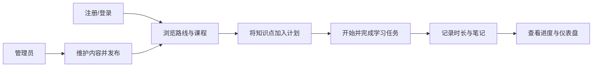

# 产品需求、用户故事与验收标准

## 范围

本文件把第一版拆成可测试的产品能力。范围仅覆盖用户、内容、学习执行、笔记和仪表盘；AI 功能、支付、社交与自动导入均不在本期。

## 关键用户旅程

## 需求与验收标准

| 编号 | 用户故事 | 优先级 | 可验收标准 |
| --- | --- | --- | --- |
| US-01 | 作为访客，我要注册和登录，以保存私人的学习数据。 | P0 | 合法邮箱和合规密码可注册；重复邮箱返回冲突；登录成功取得访问令牌与刷新令牌；错误密码不泄露账号是否存在。 |
| US-02 | 作为登录用户，我要安全地维持会话并退出。 | P0 | 访问令牌过期可用有效刷新令牌轮换；登出后刷新令牌不可再用；禁用用户无法登录或刷新。 |
| US-03 | 作为学习者，我要浏览已发布的路线、课程和知识点。 | P0 | 仅显示已发布内容；路线页按定义顺序展示课程，课程页展示知识点；草稿链接不能被普通用户读取。 |
| US-04 | 作为学习者，我要为某天创建学习任务，以安排学习。 | P0 | 可从知识点创建任务或创建自定义任务；必须有计划日期和标题；同一任务不能重复归属两个日计划。 |
| US-05 | 作为学习者，我要完成任务并记录学习时长，以获得正确进度。 | P0 | 完成动作幂等；记录开始/结束或分钟数，分钟数为正且不超过日上限；修改完成状态会重算进度。 |
| US-06 | 作为学习者，我要写笔记并加标签，以便日后回顾。 | P0 | 笔记只对本人可见；可关联一个知识点或任务；标签按用户隔离、名称不区分大小写唯一；可按标签筛选。 |
| US-07 | 作为学习者，我要在仪表盘看到可信的学习数据。 | P0 | 显示选定周期内累计时长、连续学习天数、计划完成率与掌握度；每项有口径说明，并可从记录复算。 |
| US-08 | 作为内容管理员，我要维护路线、课程和知识点。 | P0 | 可创建、编辑、排序、发布/撤回；不能发布缺少必要父级或标题的内容；撤回不删除既有学习记录。 |
| US-09 | 作为系统管理员，我要管理用户和角色。 | P1 | 可查询用户、启用/禁用账号、授予/撤销角色；不能移除自己的最后一个系统管理员角色；关键操作有审计记录。 |
| US-10 | 作为用户，我要得到一致、可理解的失败提示。 | P1 | 校验错误指出字段；401 与 403 区分；不存在资源返回 404；请求标识可用于排障。 |

### 业务规则

- 内容采用“草稿/已发布/已归档”状态；只有已发布版本向学习者可见。
- 每日计划按用户和本地日期唯一；时区以用户设置为准，默认 `Asia/Shanghai`，服务端存储 UTC。
- 任务状态为 `TODO`、`IN_PROGRESS`、`DONE`、`SKIPPED`。`DONE` 才计入完成率；`SKIPPED` 不计分母，避免将主动调整计划当作失败。
- 连续学习以当地日期至少有一条有效学习时长记录为准，今天无记录则从最近有记录日期向前计算。
- 第一版掌握度为规则化 0–100 指标，初始 0；完成关联任务 +60，至少 25 分钟有效时长 +20，保存关联笔记 +20，上限 100。它不是能力测验结果。

## 非功能性需求

- P0 页面在常规宽带环境下首屏可交互目标为 3 秒内；列表接口默认分页，单页上限 50。
- 所有写入 API 要求认证、输入校验、统一错误格式与审计上下文；所有用户私有数据必须按 `user_id` 授权过滤。
- 管理员删除采用归档或软删除；学习记录、审计记录不得被普通管理操作物理删除。

## 非目标、风险与验收

**非目标**：不提供自动课程推荐、智能日程排期、同步外部日历、富文本协作或通知提醒。

**风险**：一开始的掌握度规则可能与真实学习效果不完全一致；用户可能忘记记录时长；管理员发布错误内容会影响学习路径。缓解方式是展示指标来源、支持用户修正记录，并提供发布前校验和可撤回状态。

**产品验收**：以 P0 故事的 Given/When/Then 自动化或手工验收用例全部通过为门槛；P1 不阻塞 MVP 上线，但必须在公开试用前评审。验收数据需同时覆盖普通用户、内容管理员、系统管理员和禁用用户。
