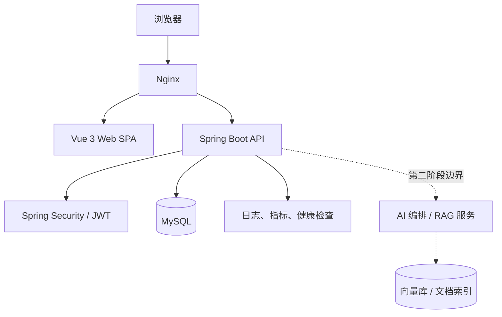

# 总体架构与技术选型

## 架构结论

第一版采用**前后端分离的模块化单体**：一个 Vue 3 Web 应用、一个 Spring Boot API、一个 MySQL 数据库。刷新令牌和所有业务数据均由 MySQL 持久化，暂不引入 Redis。开发环境以 Docker Compose 提供 MySQL；未来部署时可由 Nginx 提供 TLS 终止和静态资源/API 反向代理。模块化单体能在领域仍会变化时保持事务和调试简单，又通过包边界为第二阶段 AI 服务拆分保留空间。

## 后端模块边界

| 模块 | 职责 | 不应直接负责 |
| --- | --- | --- |
| identity | 注册、密码、令牌、角色、账号状态 | 学习规则与内容发布 |
| catalog | 路线、课程、知识点与发布状态 | 用户的个人任务 |
| learning | 计划、任务、时长、进度、掌握度 | 内容实体的任意写入 |
| notes | 笔记、标签与归属授权 | 仪表盘总计 |
| analytics | 仪表盘查询和口径计算 | 修改原始学习事件 |
| administration | 用户与内容管理入口、审计 | 绕开领域规则的数据库写入 |

模块之间通过应用服务和明确 DTO 交互，禁止控制器跨模块访问 Repository。第一版可以同库同事务；若将来 AI 处理耗时任务，再以 Outbox 事件和异步消费者隔离。

## 技术选型与取舍

| 层次 | 决策 | 原因 | 备选与取舍 |
| --- | --- | --- | --- |
| Web | Vue 3、TypeScript、Vite | 与用户指定方向及现有团队知识一致，组合式 API 适合按领域组织 | Nuxt 有 SSR 优势，但仪表盘型登录应用首版不需要 SSR 复杂度；React 不采用以减少技术栈分叉。 |
| 前端状态 | Pinia + Vue Router | 将会话、界面状态与服务端缓存区分；路由守卫可集中处理权限 | 仅 Composables 适合极小应用，难以治理跨页会话；不引入全局请求缓存库，待数据复杂度验证后再决定。 |
| UI / 图表 | Element Plus + ECharts | 管理端表单表格成熟，仪表盘图表覆盖充分 | 自建设计系统成本高；Ant Design Vue 同样可选，但团队需先统一组件规范。 |
| API | Spring Boot 3.x、Java 21、Spring MVC | LTS Java、生态成熟、同步 CRUD 与事务模型直接 | WebFlux 只在高并发流式 AI 场景有收益，第一版不采用。 |
| 安全 | Spring Security、JWT access/refresh 双令牌 | 可支持 SPA 无状态访问并允许刷新令牌撤销 | Cookie Session 也安全且实现简单；选择 JWT 是为未来多客户端保留接口，但刷新令牌必须服务端存储。 |
| 数据 | MySQL 8、Flyway、JPA/Hibernate | 关系模型适合内容、权限、计划；迁移可审计 | PostgreSQL 功能更强，但当前建议方向为 MySQL，且首版不依赖其专有能力。 |
| 缓存 | 第一版不引入缓存 | 数据量小、学习目标聚焦，可避免缓存一致性与额外运维 | Redis 在多实例会话共享、限流或真实性能瓶颈出现时再评估。 |
| 交付 | Docker Compose（仅 MySQL）、GitHub Actions、Nginx（后续） | 本地环境可复现，CI 可自动质量门禁 | Kubernetes 和首版生产容器化运维负担过高；云托管细节留到部署评审。 |

## 关键安全设计

- 密码用 Argon2id（Spring Security 支持的编码器）单向哈希；不记录原文、令牌或完整敏感头。
- access token 有效期建议 15 分钟，refresh token 30 天；刷新时旋转，数据库仅保存其哈希、到期时间、设备元数据和撤销时间。
- SPA 的 refresh token 放 `HttpOnly`、`Secure`、适当 `SameSite` Cookie；access token 仅保存在内存。若前后端跨站部署，需明确 CORS、SameSite 与 CSRF 双重提交策略。
- 角色授权之外，所有个人资源按归属校验；不可凭猜测 ID 读取他人笔记、计划或记录。

## 可扩展性原则

第二阶段 AI 的能力以独立适配器和异步工作流接入：RAG 回答必须保存文档版本、检索片段与引用；Agent 工作流必须持久化状态、工具调用与可恢复检查点。第一版不创建向量库、不调用模型，也不预埋空 AI API，避免形成无法验证的架构债务。

## 范围、非目标、风险与验收

**范围**：本章定义逻辑架构、候选组件和安全基线，不产出工程脚手架或环境文件。

**非目标**：不在本期选择云厂商、容器编排平台、消息中间件或向量数据库的具体产品；不拆微服务。

**风险**：JWT 配置不当造成 XSS/CSRF 暴露；过早缓存造成一致性问题；模块化单体的边界被跨层调用侵蚀。对此以安全评审、默认无缓存写路径、包依赖检查和代码评审门禁控制。

**架构验收**：评审应确认模块职责唯一、任何 P0 用户旅程均能在图中找到落点、MySQL 是唯一业务事实源、AI 仅通过明确的第二阶段边界出现。进入编码前还须确认部署环境的域名/TLS 与密钥托管方式。
