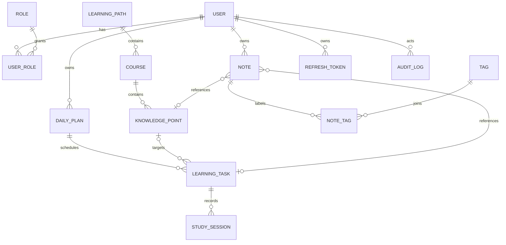
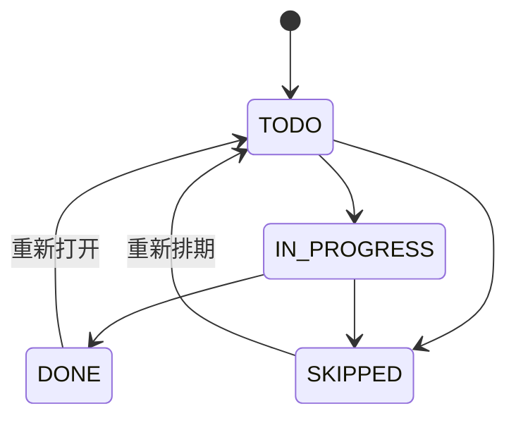

# 领域模型与数据设计

## 设计原则

数据模型以“原始记录可保留、汇总可重算、内容与个人数据分离”为原则。内容发布不会改写学习者的完成事实；仪表盘可由任务和学习会话重算，后续可增加汇总表优化但不得把汇总当唯一事实。

## 核心关系

## 实体与关键字段

| 实体 | 关键字段 | 约束与说明 |
| --- | --- | --- |
| `users` | id, email, password_hash, display_name, status, timezone | email 全局唯一并规范化；`ACTIVE` / `DISABLED`；所有时间存 UTC。 |
| `roles` / `user_roles` | code, user_id, role_id | 初始角色 `LEARNER`、`CONTENT_ADMIN`、`SYSTEM_ADMIN`；联合唯一。 |
| `learning_paths` | id, title, summary, status, sort_order, published_at | 内容状态为 `DRAFT/PUBLISHED/ARCHIVED`；软删除/归档。 |
| `courses` | id, path_id, title, summary, status, sort_order | 同一路线内排序唯一；父路线未发布时不可发布。 |
| `knowledge_points` | id, course_id, title, content, estimated_minutes, status, sort_order | 内容使用 Markdown 字符串；预计时长正整数；课程内顺序唯一。 |
| `daily_plans` | id, user_id, plan_date, note | `(user_id, plan_date)` 唯一；`plan_date` 是用户时区的日期。 |
| `learning_tasks` | id, daily_plan_id, knowledge_point_id?, title, status, estimated_minutes, completed_at | 知识点可为空以支持自定义任务；完成时间只能在 `DONE` 时存在。 |
| `study_sessions` | id, task_id, user_id, started_at?, ended_at?, duration_minutes, source | 时长 1–720；`source` 第一版为 `MANUAL`；归属用户必须等于任务所有者。 |
| `notes` | id, user_id, knowledge_point_id?, task_id?, title, body, created_at | 至少关联一个学习对象或允许独立笔记，二者需在产品确认；默认私有。 |
| `tags` / `note_tags` | id, user_id, name / note_id, tag_id | 用户范围内用规范化名称唯一；连接表联合唯一。 |
| `refresh_tokens` | id, user_id, token_hash, expires_at, revoked_at, replaced_by_id | 只保存哈希；旋转链可追溯，登出或风险事件标记撤销。 |
| `audit_logs` | id, actor_id?, action, target_type, target_id, metadata, occurred_at | 记录管理员与安全关键操作；metadata 不得保存密码或令牌。 |

所有业务表还应有 `created_at`、`updated_at`，可变资源增加乐观锁版本 `version`；主键建议 UUIDv7 或数据库生成的 BIGINT，需在编码前统一。为简化索引与调试，MVP 推荐 BIGINT 主键、对外 API 使用相同数字 ID；若预期离线/跨区写入再改 UUIDv7。

## 状态和计算规则

任务完成率 = 已完成任务数 /（已完成 + 未完成 + 进行中）任务数；跳过任务不进入分母。路线进度可按其已发布知识点关联任务的最新状态计算；若未创建任务则显示“尚未开始”，不能伪造为 0% 已学。

掌握度的首版规则详见 PRD；建议把贡献项保存在可重算的查询逻辑中，不在 `knowledge_points` 上存全局掌握度，因为它属于用户—知识点关系。若需要持久化，新增 `user_knowledge_progress(user_id, knowledge_point_id, mastery_score, calculated_at)` 作为派生表，带版本和重建机制。

## 索引、完整性和迁移

- `users(email)` 唯一；`daily_plans(user_id, plan_date)` 唯一；`tags(user_id, normalized_name)` 唯一。
- 常用查询索引：`learning_tasks(daily_plan_id, status)`、`study_sessions(user_id, started_at)`、`notes(user_id, updated_at)`、每个内容子表的 `(parent_id, sort_order)`。
- 外键保证层级与归属一致；内容禁用/归档用状态而非级联物理删除。任务引用的内容归档后仍保留标题快照或以受控读取展示，避免历史失真。
- 采用 Flyway 的不可变迁移；结构变更遵循 expand → backfill → contract，生产迁移有备份、回滚方案和耗时评估。

## 范围、非目标、风险与验收

**范围**：定义第一版逻辑模型、业务约束与索引方向；真实 DDL 应在批准后的迁移设计中产生。

**非目标**：不建向量、聊天、支付、通知、组织租户或事件仓库；不把现有 VitePress Markdown 表直接当业务表。

**风险**：内容状态变化与历史记录展示冲突；时区导致连续学习误算；冗余进度表造成漂移。缓解是保留原始事件、统一 UTC 存储/用户时区计算、派生数据可重建。

**数据设计验收**：评审时应能追溯每个 P0 用户故事涉及的实体；数据库约束能阻止重复日计划、跨用户数据关联和非法时长；任意仪表盘值可由任务/会话记录复算。需要确认的开放点是笔记是否允许完全独立于任务或知识点。
