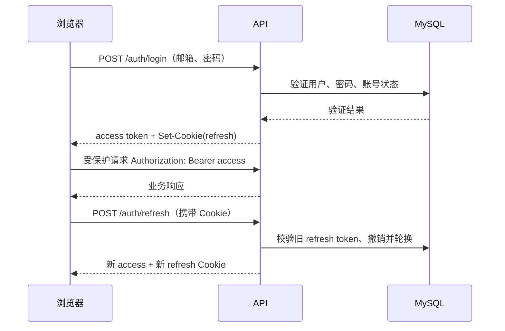

# 接口与权限设计

## API 原则与统一约定

API 采用 REST、JSON、版本前缀 `/api/v1`。资源列表使用 `page`（从 1 开始）和 `pageSize`（最大 50）；响应包含 `items` 与 `page` 元数据。时间使用 ISO 8601 UTC 时间戳，日期使用 `YYYY-MM-DD`。写请求携带 `X-Request-Id`（服务端缺失时生成）并在错误与日志中回传。

成功响应直接返回 `data`；失败使用统一信封：

```json
{
  "error": {
    "code": "VALIDATION_ERROR",
    "message": "请求参数无效",
    "fields": [{ "field": "email", "message": "邮箱格式不正确" }],
    "requestId": "req_..."
  }
}
```

HTTP 语义：400 输入无效、401 未认证/令牌无效、403 已认证但无权、404 不存在或不可见、409 状态冲突/重复、422 合法格式但不满足业务规则、429 超限、500 未预期错误。接口契约将在编码前以 OpenAPI 3.1 固化，前端不手写重复类型。

## 认证与会话流程



端点：

| 方法/路径 | 说明 | 认证 |
| --- | --- | --- |
| `POST /auth/register` | 注册学习者 | 公开，限流 |
| `POST /auth/login` | 登录 | 公开，限流 |
| `POST /auth/refresh` | 刷新并轮换令牌 | Refresh Cookie |
| `POST /auth/logout` | 撤销当前 refresh token | 可选 access + Refresh Cookie |
| `GET /me` | 当前用户、角色、时区 | 已登录 |
| `PATCH /me` | 更新显示名、时区 | 已登录 |

已确认第一版不做密码重置和邮箱验证，也不接入邮件服务。注册接口仍会校验邮箱格式和密码强度；文档与界面必须明确这是学习项目的简化边界，不能将其误认为完整的生产账号恢复方案。

## 资源端点草案

| 资源 | 学习者接口 | 管理接口 |
| --- | --- | --- |
| 内容 | `GET /paths`、`GET /paths/{id}`、`GET /courses/{id}`、`GET /knowledge-points/{id}` | `POST/PATCH /admin/paths`、`/courses`、`/knowledge-points`；`POST .../{id}/publish`、`/archive`、`/reorder` |
| 每日计划/任务 | `GET/PUT /daily-plans/{date}`、`POST/PATCH/DELETE /tasks`、`POST /tasks/{id}/complete`、`POST /tasks/{id}/reopen` | 无（第一版不下发任务） |
| 学习记录 | `GET/POST /study-sessions`、`PATCH/DELETE /study-sessions/{id}` | 仅审计查询（若批准） |
| 笔记/标签 | `GET/POST/PATCH/DELETE /notes`、`GET/POST/DELETE /tags` | 无 |
| 仪表盘 | `GET /dashboard?from=&to=`、`GET /progress/paths/{id}` | 无 |
| 用户 | `GET /me` | `GET /admin/users`、`PATCH /admin/users/{id}/status`、`PUT /admin/users/{id}/roles` |

对状态变化使用动作端点而不是通用 `PATCH status`，以承载幂等、审计和领域校验。创建任务、记录时长等可重试写操作支持 `Idempotency-Key`；服务端在限定窗口内对同键同用户返回原结果。

## 权限矩阵

| 能力 | 访客 | LEARNER | CONTENT_ADMIN | SYSTEM_ADMIN |
| --- | --- | --- | --- | --- |
| 注册/登录 | ✓ | ✓ | ✓ | ✓ |
| 浏览已发布内容 | ✓ | ✓ | ✓ | ✓ |
| 个人计划、记录、笔记、仪表盘 | — | 仅本人 | 仅本人 | 仅本人 |
| 内容草稿与发布管理 | — | — | ✓ | ✓ |
| 用户状态、角色管理 | — | — | — | ✓ |
| 审计日志查询 | — | — | 仅内容操作（建议） | ✓ |

角色检查不是资源归属检查的替代。即使两个用户都是 `LEARNER`，也只能访问各自的个人数据。管理员查看个人学习数据是否允许，第一版默认不允许，除非后续补充隐私目的、最小字段和审计要求。

## 范围、非目标、风险与验收

**范围**：定义资源、身份机制、错误语义和权限边界；具体字段、示例与 schema 由 OpenAPI 评审版补齐。

**非目标**：不实现 GraphQL、WebSocket、对外开放 API、OAuth 社交登录、细粒度 ABAC 或服务间鉴权。

**风险**：刷新 Cookie 的跨域配置可能引入 CSRF；通用更新接口可能绕过状态机；仅靠前端菜单隐藏会导致越权。缓解为 SameSite/CSRF 策略测试、动作端点、后端统一授权测试。

**接口验收**：P0 场景在 OpenAPI 中都有对应端点；401/403/404/409 可区分；权限矩阵可转为自动化负向测试；刷新令牌轮换、登出撤销和禁用账号均有端到端测试。需要确认前后端是否同域部署，这会决定 Cookie/CORS 的最终配置。
