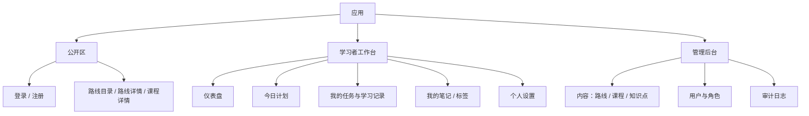

# 前端信息架构与页面设计

## 信息架构

学习者端与管理端共享一套 SPA，但以路由布局和权限守卫隔离。不要把权限只做成菜单可见性：路由守卫改善体验，API 授权才是安全边界。



## 页面规格

| 页面 | 主要内容和动作 | 状态/异常 | 验收要点 |
| --- | --- | --- | --- |
| 登录、注册 | 表单、密码显示切换、跳转原页面 | 字段校验、登录失败、限流 | 不暴露账号存在性；成功后恢复安全的内部回跳地址。 |
| 路线目录/详情 | 卡片筛选、课程树、进度提示 | 空内容、未发布 404 | 访客可浏览发布内容；登录后叠加本人进度。 |
| 课程/知识点 | 内容、预计时长、加入今日计划、关联笔记 | 无权限、已归档历史提示 | 不展示草稿；加入计划后立即反馈并防止重复。 |
| 今日计划 | 日期切换、任务拖拽排序、完成/跳过、快速记录时长 | 无计划、日期非法、冲突 | 今天可一屏完成核心学习循环；提交失败不丢本地输入。 |
| 仪表盘 | 周期筛选、四项指标、趋势图、口径说明 | 无数据 | 无数据有引导；指标与 API 返回一致、图表可键盘访问或有表格替代。 |
| 笔记/标签 | 列表、搜索、标签筛选、编辑器、关联对象 | 空状态、保存冲突 | 仅显示本人；删除须二次确认。 |
| 内容管理 | 层级列表、草稿编辑、排序、发布/归档 | 发布校验、并发冲突 | 关键操作有确认和结果反馈；不允许跳过父级发布规则。 |
| 用户管理 | 查询、状态切换、角色编辑 | 无权、最后管理员保护 | 能显示变更原因/审计入口；管理员不能锁死自己。 |

## 前端分层与状态

```text
web/src/（批准后才创建）
├── app/             # 路由、应用装配、全局样式
├── modules/         # identity、catalog、learning、notes、admin
│   ├── api/         # 由 OpenAPI 契约生成/封装的请求
│   ├── components/  # 领域组件
│   ├── views/       # 路由页面
│   └── stores/      # Pinia：会话与少量 UI/领域状态
├── shared/          # 通用布局、表单、权限、错误处理
└── assets/
```

Axios 负责请求拦截、请求标识与 401 的单飞刷新；不能在每个组件中直接拼 URL。Pinia 仅保存会话、用户偏好和跨页短状态；列表/详情等服务端数据应封装为可失效查询，首版可用 composable 管理，复杂后再引入 TanStack Query。ECharts 图表应延迟加载，避免仪表盘以外页面负担图表代码。

## 体验与无障碍基线

- 以 360px 起的响应式布局支持手机浏览与记录，但不承诺原生 App 或离线使用。
- 所有表单有可关联 label、键盘焦点、错误文本和加载/禁用状态；颜色不作为唯一状态提示。
- 所有破坏性操作须确认；网络失败可重试；提交期间避免重复请求。
- 管理端列表保留筛选条件和分页状态；权限改变后强制刷新当前用户权限并导航到安全页面。

## 范围、非目标、风险与验收

**范围**：信息架构、页面职责和前端边界；不创建 Vite、Vue 或组件库工程。

**非目标**：不设计品牌视觉、设计 token、移动原生界面、离线同步、实时协作或拖拽课程编排的完整交互细节。

**风险**：一个 SPA 同时承载管理端和学习端会使包体增长；仪表盘图表可能无障碍不足；令牌刷新竞争会导致循环登出。缓解为路由级懒加载、图表数据表替代、单飞刷新与明确退出策略。

**前端验收**：每个 P0 故事可映射到页面和加载/空/错误状态；学习者无法通过 URL 进入管理页；键盘可完成登录、创建任务、完成任务和保存笔记；在窄屏下今日计划可操作。是否使用同一 Web 应用承载管理端是需要确认的体验决策。
