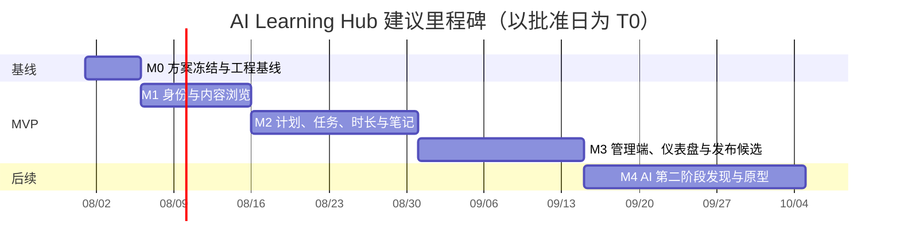

# 分阶段开发路线图

## 交付策略

按“可运行骨架 → 身份与内容 → 学习闭环 → 管理与仪表盘 → 上线准备”推进，每个阶段结束都有可演示、可测试的纵切片。不要先做完所有表，再开始页面；也不要在第一版穿插 AI 占位代码。

图中日期仅用于显示依赖关系，实际工期取决于团队人数、设计输入和部署环境，不构成承诺。

## 里程碑与出口标准

| 里程碑 | 目标与交付物 | 进入条件 | 完成/验收门槛 |
| --- | --- | --- | --- |
| M0：工程基线 | 目录决策、ADR、OpenAPI 初稿、前后端最小可运行骨架、Docker 本地依赖、CI 空流水线 | 本规划包明确批准；开放决策有结论 | 不影响 VitePress 构建；本地一条命令可启动空健康检查；迁移与密钥策略获评审。 |
| M1：身份与内容浏览 | 注册/登录/刷新/登出、角色种子、发布内容读取、管理员内容 CRUD 的最小纵切片 | M0 通过 | US-01/02/03/08 的 P0 验收和权限负向测试通过。 |
| M2：学习闭环 | 日计划、任务状态、学习时长、笔记/标签、个人进度 API 与学习端页面 | M1 通过；指标口径已确认 | US-04/05/06 可端到端通过；数据归属、幂等与时区测试通过。 |
| M3：管理与仪表盘 | 用户管理、审计、四项仪表盘、可观测性、部署候选、UAT | M2 通过 | US-07/09/10、性能/安全/备份演练达到门槛；无 P0/P1 已知阻断缺陷。 |
| M4：AI 第二阶段（独立立项） | 个性化计划、带引用 RAG、总结与卡片、可恢复 Agent 的需求/数据授权/评估原型 | MVP 运行数据与用户反馈；单独批准 | 引用正确性、数据权限、成本上限、工作流恢复率等 AI 专项指标通过，才可逐步上线。 |

## 推荐的第一个编码里程碑：M0

获批准后，首个编码里程碑应为 **M0：工程基线**，不是直接做全部功能。建议工作包为：

1. 在 `Project/ai-learning-hub/` 下新建 `web`、`server`、`infra`、`contracts`，保持仓库根目录的 `docs/` 原封不动；
2. 建立 Java 21/Spring Boot 与 Vue 3/TypeScript 的最小健康检查，不含任何业务实体；
3. 写出 OpenAPI 的 auth、content read-only 契约草案和版本策略；
4. 建立 MySQL 的仅本地 Compose，Flyway 空基线、环境变量样例与密钥不入库规则；
5. 建立 lint、单元测试、构建和依赖安全扫描的 CI 门禁。

这样先验证目录、运行时、密钥、端口和 CI 假设，能在低成本时发现环境分歧。

## 依赖与风险管理

| 风险/依赖 | 影响 | 预防与触发动作 |
| --- | --- | --- |
| 产品口径未定（连续学习、掌握度） | 仪表盘与数据模型返工 | M1 前冻结口径；任何改动必须有版本说明与数据重算方案。 |
| 前后端并行无契约 | 联调阻塞 | M0 评审 OpenAPI；在 CI 做契约校验。 |
| 域名、TLS、邮件、密钥环境未定 | 登录安全与部署延期 | M0 建立环境清单；M3 前完成预发布演练。 |
| 范围蔓延到 AI | MVP 无法按时闭环 | AI 需求进入独立 backlog，MVP PR 不接受 AI 依赖。 |
| 内容录入量不明 | UAT 无有效样本 | M1 确定种子内容责任人和最少路线/课程/知识点数量。 |

## 范围、非目标、风险与验收

**范围**：定义阶段、依赖和质量出口；不执行其中任何工程创建或部署动作。

**非目标**：不承诺具体上线日期、团队配置或云资源成本；不把 M4 作为 MVP 的隐含交付。

**风险**：将甘特图误读为日期承诺，或跳过阶段出口直接堆功能。图中的日期只作样例；实际推进应以完成标准而非日历为准。

**路线图验收**：每个 P0 用户故事在 M1–M3 有唯一主要归属；M0 被明确设为用户批准后的第一个编码动作；M4 有独立批准门槛。进入 M0 前，必须由产品负责人确认开放决策。
