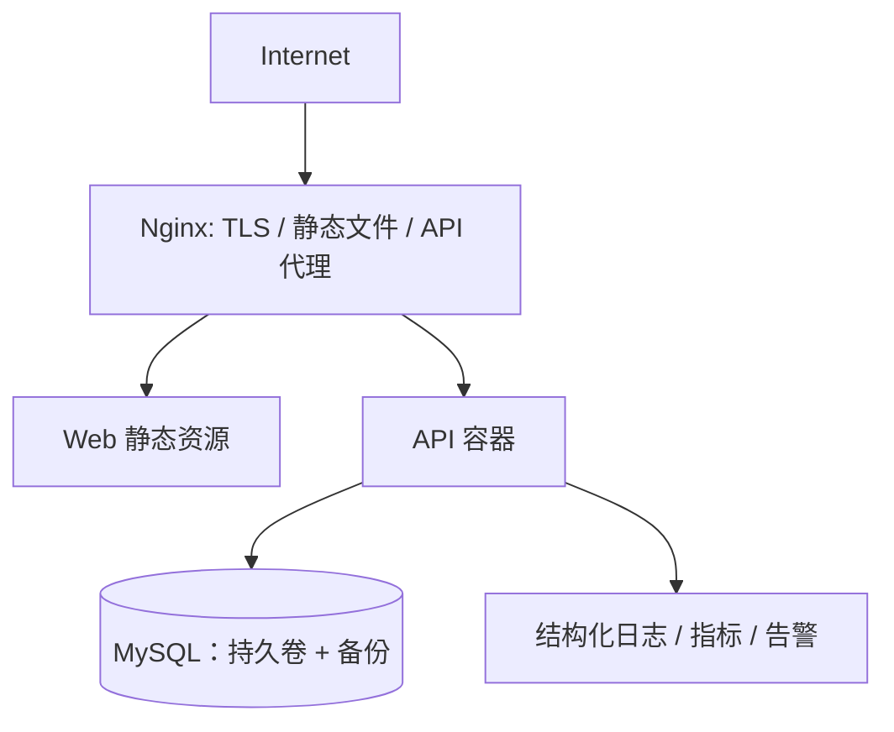

# 质量、测试与部署设计

## 质量目标

质量标准围绕学习数据可信、账号安全和可恢复发布。第一版的关键不是极端吞吐，而是让用户的数据不串户、完成与时长不悄悄丢失、指标可解释、部署可重复。

## 测试金字塔与责任

| 层级 | 主要对象 | 示例 | 门槛 |
| --- | --- | --- | --- |
| 单元测试 | 领域规则、DTO 校验、组件逻辑 | 掌握度计算、任务状态转换、密码规则 | 新增规则必须有正反例；快速执行。 |
| 集成测试 | Repository、迁移、Security、API | Flyway 从空库升级、角色拒绝、令牌轮换 | 使用 Testcontainers 的 MySQL 或等价真实依赖。 |
| 契约测试 | OpenAPI 与前后端适配 | 错误信封、分页、字段变更 | API 破坏性变更阻止合并。 |
| E2E 测试 | P0 用户旅程 | 注册→计划→完成→笔记→仪表盘 | 覆盖学习者、内容管理员、系统管理员及越权路径。 |
| 非功能测试 | 安全、性能、可用性 | 依赖扫描、限流、列表分页、窄屏键盘操作 | 发布候选必须通过基线。 |

关键测试数据应以隔离用户构造，专门验证 IDOR（猜测他人资源 ID）、禁用账户刷新令牌、并发修改内容、日界线与夏令时（即使默认时区不使用 DST）等高风险路径。

## CI/CD 设计

GitHub Actions 在第一版至少执行：前端类型检查/Lint/测试/构建，后端测试与静态检查，OpenAPI 校验，镜像构建与依赖漏洞扫描。生产部署必须由受保护环境和人工批准触发；不得把生产密钥放入仓库、日志或构建产物。

## 部署拓扑与运行基线

Compose 适合开发、测试和首版单机部署。Nginx 处理 HTTPS、压缩与静态缓存，API 只暴露给反向代理网络。数据库不暴露公网；配置按 `dev/test/staging/prod` 分离，应用以环境变量/受控密钥注入。健康检查至少包括 API 存活和就绪检查；就绪检查需能反映数据库连通性但不泄露详细错误。

## 可观测性、备份与恢复

- 日志采用 JSON，包含时间、级别、请求 ID、用户 ID（脱敏/最小化）、路由、状态、耗时；不记录密码、Authorization、refresh cookie 和笔记正文。
- 指标至少包含 HTTP 延迟/错误率、认证失败/限流、数据库连接池、JVM、任务/时长写入失败与迁移版本；告警先从 5xx 增长、就绪失败、备份失败开始。
- MySQL 进行定期逻辑或物理备份，记录保留期和恢复责任人；每个发布阶段至少做一次在隔离环境的恢复演练。迁移必须先备份，且有 expand/contract 回退方案。
- 建议初始 SLO：月度 API 可用性 99.5%（计划维护除外）、P0 读接口 p95 < 500ms、写接口 p95 < 800ms；数值在容量测试后再正式承诺。

## 安全与发布检查清单

- [ ] 依赖、容器镜像和许可证扫描无阻断问题；高危漏洞有修复或书面豁免。
- [ ] HTTPS、HSTS、CSP、CORS、Cookie 属性和安全响应头已按部署拓扑验证。
- [ ] JWT 密钥由受控密钥管理提供，支持轮换；生产不使用默认账号/密码。
- [ ] 数据库账号最小权限；备份加密且恢复已演练；管理员操作有审计。
- [ ] 执行迁移前完成备份、耗时评估、回滚/前滚说明；监控与告警可用。
- [ ] P0 E2E、越权测试、移动窄屏与键盘基本可用性测试全部通过。

## 范围、非目标、风险与验收

**范围**：定义测试层次、CI/CD 门禁、初始部署拓扑和运行保障；本阶段不创建 Compose、工作流或发布资源。

**非目标**：不承诺多区域容灾、零停机迁移、Kubernetes、商业 APM、渗透测试认证或 24×7 值班。

**风险**：单机 Compose 是单点；自动迁移可能损害大表；日志过度采集会泄露个人笔记。MVP 用备份恢复、迁移门禁和脱敏日志控制，规模提升后再评估托管数据库、多副本与集中日志。

**质量验收**：M3 发布候选必须完成本章清单；所有 P0 自动化测试稳定通过；一次从备份恢复到隔离环境并验证核心读取；预发布部署可观测、可回滚且不影响现有 VitePress 学习站。
