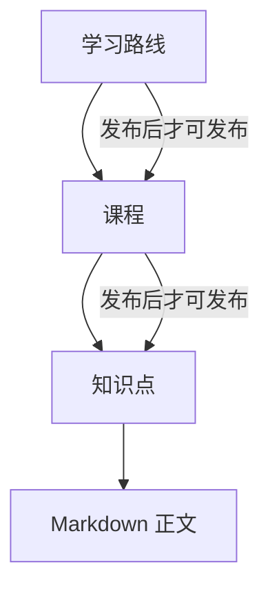

# 步骤 5：内容目录与 Markdown 学习记录

> 状态：已完成最小内容闭环、公开浏览和最简管理表单；均已通过本地验证或前端构建验证。

## 这一步要学什么

把“内容”从一个模糊概念拆成稳定的三层结构：**学习路线**组织一个主题，**课程**组织路线内的学习单元，**知识点**保存真正要阅读的 Markdown 正文。这样任务、笔记和进度在后续步骤可以稳定地引用知识点，而不是依赖易变的标题字符串。



## 已实现的最小闭环

| 层次 | 数据 | 管理操作 | 公开操作 |
| --- | --- | --- | --- |
| 路线 | 标题、简介、排序、状态 | 创建、完整更新、发布、归档 | 查看发布路线与其已发布课程 |
| 课程 | 所属路线、标题、简介、排序、状态 | 创建、完整更新、发布、归档 | 查看已发布课程与其已发布知识点 |
| 知识点 | 所属课程、标题、Markdown、预计分钟、排序、状态 | 创建、完整更新、发布、归档 | 查看完整 Markdown 正文 |

数据库迁移是 `server/src/main/resources/db/migration/V3__create_content_catalog.sql`。它只新增表，不会修改已运行的身份迁移。`status` 只有 `DRAFT`、`PUBLISHED`、`ARCHIVED` 三种值；所有新内容默认草稿。

公开读取不要求登录，但会同时检查祖先状态。例如某个知识点即使自身是 `PUBLISHED`，只要它的课程或路线被归档，公开接口仍返回 404。内容管理接口统一要求 `CONTENT_ADMIN`（`SYSTEM_ADMIN` 也会在本地管理员初始化时拥有该角色）。这是后端授权，不是前端菜单隐藏。

## 为什么采用 Markdown

Markdown 作为第一版正文格式，优点是可读、适合 Git 保存、可以安全地按白名单渲染，也为第二阶段 RAG 的分块和引用保留清晰的原始文本。代价是管理员不能在第一版上传图片、附件或编辑富文本；这些能力会牵涉对象存储、文件安全扫描、编辑器兼容与内容版本治理，因此明确延后。

第一版也不做“移动课程/知识点到新父级”。移动看似简单，却需要同时定义排序重排、已发布内容可见性、进度和笔记关联的迁移规则。当前更新接口会在尝试更换父级时返回 422，避免隐性数据变化。

## 手把手搭建：内容目录后端

下面按实际依赖顺序搭建。不要先写 Controller：Controller 要调用 Service，Service 要依赖 Repository，Repository 又必须有可映射的实体和已经存在的表。

### 1. 先用 Flyway 创建三张表

创建 `server/src/main/resources/db/migration/V3__create_content_catalog.sql`。第一张表没有父级，后两张表通过外键指向父级：

```sql
CREATE TABLE learning_paths (
  id BIGINT UNSIGNED NOT NULL AUTO_INCREMENT,
  title VARCHAR(120) NOT NULL,
  summary VARCHAR(500) NOT NULL DEFAULT '',
  status VARCHAR(20) NOT NULL DEFAULT 'DRAFT',
  sort_order INT NOT NULL DEFAULT 0,
  PRIMARY KEY (id)
);

CREATE TABLE courses (
  id BIGINT UNSIGNED NOT NULL AUTO_INCREMENT,
  path_id BIGINT UNSIGNED NOT NULL,
  -- 其余标题、简介、状态字段与路线相同
  CONSTRAINT fk_courses_path FOREIGN KEY (path_id) REFERENCES learning_paths (id)
);
```

`path_id` 不是普通数字，而是外键：数据库会拒绝指向不存在路线的课程。实际迁移还为状态、排序和预计分钟设置了 `CHECK` 约束与索引。迁移文件一旦应用就不能回头修改；字段变更要用新的 `V4__...sql`，这是 Flyway 可追溯迁移的核心规则。

启动后端时 Flyway 会自动执行迁移：

```bash
cd Project/ai-learning-hub/server
set -a; . ../infra/.env; set +a
DB_PASSWORD="$MYSQL_PASSWORD" mvn spring-boot:run
```

预期日志包含 `Migrating schema ... to version "3 - create content catalog"`。只在自己的本地数据库执行，`.env` 不要提交。

### 2. 为表建立 Java 实体

在 `server/src/main/java/com/ailearninghub/catalog/` 创建 `ContentStatus.java`：

```java
public enum ContentStatus { DRAFT, PUBLISHED, ARCHIVED }
```

接着创建 `LearningPathEntity`、`CourseEntity`、`KnowledgePointEntity`。以课程的父级关系为例：

```java
@ManyToOne(fetch = FetchType.LAZY, optional = false)
@JoinColumn(name = "path_id", nullable = false)
private LearningPathEntity path;
```

`@ManyToOne` 表示多门课程属于一条路线；`@JoinColumn` 明确 Java 字段对应数据库的 `path_id`；`LAZY` 表示仅在实际取用父级时加载，避免无意义地把整条路线树都查出来。构造方法只接收业务字段，不接收 `id` 和 `status`，因为 ID 由数据库生成，新内容状态固定从 `DRAFT` 开始。

实体中的状态动作也应是有语义的方法，而不是让外层任意赋值：

```java
public void publish() { this.status = ContentStatus.PUBLISHED; }
public void archive() { this.status = ContentStatus.ARCHIVED; }
```

### 3. 写 Repository，让查询表达“可见性”

创建三个 `JpaRepository` 接口。公开路线列表最关键的方法是：

```java
List<LearningPathEntity> findByStatusOrderBySortOrderAsc(ContentStatus status);
```

Spring Data 会按方法名生成 SQL：只查某个状态，并按 `sort_order` 升序排列。这样公开 API 从查询起就排除了草稿，而不是先查全部再依赖前端过滤。

课程和知识点使用同样的模式，额外按 `pathId` 或 `courseId` 限制父级。例如：

```java
List<CourseEntity> findByPathIdAndStatusOrderBySortOrderAsc(Long pathId, ContentStatus status);
```

### 4. 在 Service 中放发布规则

创建 `CatalogService.java`，并在类上加 `@Transactional(readOnly = true)`。读取默认只读；修改方法单独加 `@Transactional`。发布课程时不要只调用 `course.publish()`，先检查父级：

```java
if (course.getPath().getStatus() != ContentStatus.PUBLISHED) {
  throw CatalogException.invalidState("请先发布所属学习路线");
}
course.publish();
```

这段代码回答了“为什么前端不能直接决定发布”：无论请求来自网页、curl 还是未来移动端，所有入口都会经过同一个 Service 规则。`CatalogException` 会携带 422 和可读错误信息，前端可以直接显示。

读取知识点时还要检查整条父级链：

```java
if (point.getCourse().getStatus() != ContentStatus.PUBLISHED
    || point.getCourse().getPath().getStatus() != ContentStatus.PUBLISHED) {
  throw CatalogException.notFound("知识点");
}
```

这里返回 404 而不是“草稿存在”的 403，避免访客通过连续猜测 ID 得知未发布内容。

### 5. 最后暴露公开和管理 Controller

`CatalogController` 的公开读取不需要登录；在 `SecurityConfiguration` 中只放行 GET：

```java
.requestMatchers(HttpMethod.GET,
    "/api/v1/paths/**", "/api/v1/courses/**", "/api/v1/knowledge-points/**").permitAll()
```

管理端使用不同前缀并在类上保护：

```java
@RequestMapping("/api/v1/admin")
@PreAuthorize("hasRole('CONTENT_ADMIN')")
public class CatalogAdminController { /* 创建、发布、归档端点 */ }
```

`hasRole` 会匹配 JWT 过滤器转换出的 `ROLE_CONTENT_ADMIN` 权限。前端没有这个角色时即使手工请求 `/api/v1/admin/paths`，后端仍会返回 403。

### 6. 用最小请求验证规则

管理员登录后，把返回 JSON 内的 `accessToken` 临时保存到当前终端变量（不要写进源码或文档）：

```bash
curl -i -H 'Authorization: Bearer <access-token>' \
  -H 'Content-Type: application/json' \
  -d '{"title":"Java 基础","summary":"从语法到集合","sortOrder":1}' \
  http://localhost:8080/api/v1/admin/paths
```

预期为 `201`，状态是 `DRAFT`。接着创建课程并在路线尚未发布时调用课程发布端点，预期 `422`；发布路线后重试课程发布，预期 `200`。最后不带 Token 请求 `GET /api/v1/paths`，预期只出现已发布路线。

## 文件地图

| 文件/目录 | 职责 |
| --- | --- |
| `db/migration/V3__create_content_catalog.sql` | 表、外键、索引和数据库级约束。 |
| `catalog/*Entity.java` | 数据库行与 Java 对象的映射。 |
| `catalog/*Repository.java` | 定义查询意图，交由 Spring Data 生成查询。 |
| `CatalogService.java` | 发布链、归档和可见性等业务规则。 |
| `CatalogController.java` | 公开读取 HTTP API。 |
| `CatalogAdminController.java` | 受角色保护的管理 HTTP API。 |
| `ApiExceptionHandler.java` | 将业务异常转换为统一 JSON 错误。 |

## 接口与练习顺序

1. 用管理员 access token `POST /api/v1/admin/paths` 创建草稿路线；
2. 先尝试发布该路线下的草稿课程，观察 422，理解父级发布规则；
3. 发布路线后再发布课程；
4. 建立并发布 Markdown 知识点；
5. 不带 token 请求 `/api/v1/paths`、`/courses/{id}`、`/knowledge-points/{id}`，确认只有完整发布链可见；
6. 用普通学习者 token 请求 `/api/v1/admin/paths`，确认收到 403。

公开端点为：`GET /paths`、`GET /paths/{id}`、`GET /courses/{id}`、`GET /knowledge-points/{id}`；管理端点以 `/api/v1/admin` 为前缀。写接口接受完整表单，而非部分字段更新，这使学习阶段的验证规则更清楚。当前 OpenAPI 已固化认证契约；内容端点的机器可读契约会在下一次接口文档整理时补齐，当前以本记录、`CatalogController` 与 `CatalogAdminController` 为实现对照。

## 范围、非目标、风险与验收

**范围**：三层内容模型、Flyway V3、发布/归档动作、`CONTENT_ADMIN` 后端授权、Markdown 文本保存、公开浏览 API。

**非目标**：富文本编辑器、图片/文件上传、视频在线播放、内容版本历史、批量导入、VitePress 自动同步、全文搜索、课程/知识点跨父级移动。

**风险**：直接把 Markdown 作为 HTML 渲染会造成 XSS；前端接入时必须使用可信 Markdown 渲染器并执行 HTML 白名单净化。当前 API 只传递原始 Markdown，不在服务端生成 HTML。MySQL 外键阻止删除仍有子项的内容；第一版使用归档而不提供删除接口。

**验收**：空数据库能应用 V1--V3；管理员可以按路线→课程→知识点创建并按规则发布；访客只能看见完整发布链；草稿和归档内容为 404；普通学习者管理请求为 403；后端测试通过，并在本地 MySQL 上完成一次真实接口链路验证。

## 本次验证结果

| 检查 | 结果 |
| --- | --- |
| Flyway V3 | 已在本地 MySQL 成功应用，数据库版本从 V2 升至 V3。 |
| 父级发布规则 | 路线未发布时发布课程返回 422；随后按路线、课程、知识点顺序发布均返回 200。 |
| 公开可见性 | 未登录读取已发布知识点返回 200；不存在或不可见编号返回 404。 |
| 角色授权 | 普通学习者读取内容管理列表返回 403。 |
| 构建检查 | `server` 的 `mvn test` 与 `web` 的 `npm run build` 均通过。 |

为了验证自动管理员创建，测试启动时创建了一个仅限本地的 `catalog-verifier@example.test` 管理员，以及一条名称以“接口验证路线”开头的发布样例内容。它们不含真实学习数据；若希望清理，需要在下一次明确批准后采用受控的本地数据库清理方式处理，不能改写 Flyway 历史。

## 下一小步

Vue 已加入只读路线→课程→知识点浏览与最简内容管理表单，Markdown 先以原始文本安全展示，不把它当 HTML 注入。下一领域是个人学习闭环：每日计划、学习任务、完成记录和学习时长；开始前需要确定连续学习日的时区口径。
