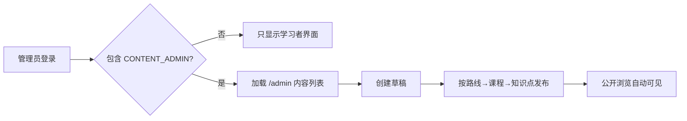

# 步骤 5.1：最简内容管理界面学习记录

> 状态：已实现并通过前端构建验证。

## 目标

在不拆分第二个管理站、也不引入组件库和富文本编辑器的前提下，让内容管理员能够完成第一版最小工作流：建立路线、在路线下建课程、在课程下建 Markdown 知识点，并按父级顺序发布或归档它们。

## 设计选择

管理入口放在现有 Vue 应用的同一页面中。`CONTENT_ADMIN` 登录后，前端根据 `/me` 或登录响应中的角色显示“内容管理”；没有该角色就不渲染入口。但这只是体验优化，真正的防线仍是后端的 `@PreAuthorize("hasRole('CONTENT_ADMIN')")`。



`web/src/App.vue` 中的 `adminFetch` 统一附加内存中的 Bearer access token 与 `credentials: include`。后者保证刷新 Cookie 的既有同域行为不被破坏；内容管理写接口仍以 access token 授权。提交成功后，管理列表与公开路线列表都会刷新，因此管理员能立即观察发布的结果。

## 已实现能力

| 能力 | 行为 |
| --- | --- |
| 管理入口 | 只有 `CONTENT_ADMIN` 角色可见。 |
| 建路线 | 输入标题、简介和排序，创建 `DRAFT` 路线。 |
| 建课程 | 从所有管理路线中选择父级，创建草稿课程。 |
| 建知识点 | 从所有管理课程中选择父级，填写预计分钟和原始 Markdown。 |
| 状态动作 | 对路线、课程、知识点执行发布或归档；后端返回的 422 会显示给管理员。 |
| 公共侧同步 | 每次管理动作后刷新公开路线清单。 |

## 手把手搭建：Vue 管理表单

本步只修改两个文件：`web/src/App.vue` 负责状态、请求和界面；`web/src/styles.css` 负责布局。先不要为了一个页面引入 Pinia、路由或组件库，等页面数量真正增长再拆分。

### 1. 定义管理状态与角色判断

在 `App.vue` 的 `<script setup>` 中先引入 `reactive`，再定义列表、提示语和三个表单：

```ts
import { computed, reactive, ref } from 'vue'

const adminPaths = ref<PathItem[]>([])
const adminMessage = ref('')
const pathForm = reactive({ title: '', summary: '', sortOrder: 0 })
const isContentAdmin = computed(() =>
  currentUser.value?.roles.includes('CONTENT_ADMIN') ?? false
)
```

`ref` 适合整体替换的数组和基本值，需要通过 `.value` 访问；`reactive` 适合表单这种有多个字段的对象，模板可以直接写 `pathForm.title`。`computed` 会在登录用户改变时自动重新计算，因此登录、登出后界面会自动切换。

### 2. 封装带令牌的管理请求

不要在每个创建函数里重复拼 Authorization。建立一个最小包装：

```ts
async function adminFetch(path: string, init: RequestInit = {}) {
  return fetch(`/api/v1/admin${path}`, {
    ...init,
    credentials: 'include',
    headers: {
      Authorization: `Bearer ${accessToken.value}`,
      'Content-Type': 'application/json',
      ...init.headers
    }
  })
}
```

它只有一个责任：调用 `/api/v1/admin` 下的接口时附加短期 access token。注意 token 仍然只在内存变量里，不写入 `localStorage`；刷新页面后当前版本需要重新登录，这是我们之前选择的安全/教学边界。

### 3. 登录成功后加载管理目录

登录响应里已含角色。登录成功后加入：

```ts
if (isContentAdmin.value) await loadAdminCatalog()
```

`loadAdminCatalog` 用 `Promise.all` 并行读取路线、课程、知识点：

```ts
const responses = await Promise.all([
  adminFetch('/paths'),
  adminFetch('/courses'),
  adminFetch('/knowledge-points')
])
```

并行比一个一个等待更快；任一请求失败时使用已有 `readError` 把后端的中文错误展示给管理员。拿到列表后，把第一个路线/课程预选为下级表单的父级，减少手动选择。

### 4. 先实现“创建草稿”这一条纵切片

路线表单用 Vue 的双向绑定把输入同步到 `pathForm`：

```html
<form @submit.prevent="createPath">
  <label>标题<input v-model.trim="pathForm.title" required maxlength="120" /></label>
  <label>简介<input v-model.trim="pathForm.summary" required maxlength="500" /></label>
  <button class="primary" type="submit">保存草稿</button>
</form>
```

`@submit.prevent` 阻止浏览器整页提交；`v-model.trim` 自动去掉标题首尾空白；`required`/`maxlength` 提供立即反馈，但后端验证仍然是最终标准。

提交逻辑把表单转为 JSON：

```ts
async function createPath() {
  await submitAdmin('/paths', pathForm, '已创建路线。')
  pathForm.title = ''
  pathForm.summary = ''
}
```

`submitAdmin` 成功后同时调用 `loadAdminCatalog()` 和 `loadPaths()`。前者更新草稿状态，后者保证路线发布后立刻出现在公开浏览区。

### 5. 以同一模式扩展课程和知识点

课程表单多一个父级选择器：

```html
<select v-model.number="courseForm.pathId" required>
  <option :value="0" disabled>请选择路线</option>
  <option v-for="path in adminPaths" :key="path.id" :value="path.id">
    {{ path.title }}
  </option>
</select>
```

`v-model.number` 很重要：HTML select 读出来默认是字符串，而后端 `pathId` 需要数字。知识点表单同理选择课程，并用 `<textarea>` 保存原始 Markdown；Vue 默认插值会转义文本，公开阅读区用 `<pre>{{ content }}</pre>`，没有使用 `v-html`，因此不会把用户输入当脚本执行。

### 6. 把发布与归档做成显式动作

列表中不要做一个可随意改状态的下拉框，而是显式按钮：

```html
<button v-if="path.status !== 'PUBLISHED'"
  @click="changeContentStatus('paths', path.id, 'publish')">发布</button>
```

点击后会发出 `POST /api/v1/admin/paths/{id}/publish`。如果父级未发布，后端返回 422，页面把原因展示在 `adminMessage`；因此前端没有复制发布规则，规则始终只有 Service 中的一份。

### 7. 构建并手工检查

先静态构建：

```bash
cd Project/ai-learning-hub/web
npm run build
```

预期看到 `vue-tsc -b && vite build` 成功。接着同时启动后端和前端，使用有 `CONTENT_ADMIN` 角色的本地管理员登录。应能看到管理区；建立路线、课程、知识点后先发布路线，再发布课程，最后发布知识点。用普通学习者登录时，管理区不出现；即使手工调用管理 API，后端也必须返回 403。

## 文件地图

| 文件 | 本步作用 |
| --- | --- |
| `web/src/App.vue` | 登录角色判断、管理请求、三个表单、状态动作和公开列表刷新。 |
| `web/src/styles.css` | 三栏自适应表单、状态行与窄屏下自然换行的简单布局。 |
| `server/.../CatalogAdminController.java` | 前端调用的管理 API；前端不替代这里的权限检查。 |

## 刻意未做的内容

没有在本步加入编辑已有内容、课程/知识点迁移、拖拽排序、删除、批量操作、图片上传、Markdown 预览或 HTML 渲染。每一项都会引入新的状态规则或安全问题：例如编辑需要决定并发覆盖策略，移动会影响进度关联，HTML 预览必须做 XSS 净化。当前原始 Markdown 文本框正好符合已确认的第一版边界。

## 范围、风险与验收

**范围**：同一 Vue 应用的角色可见入口、创建三个内容层级、发布/归档、状态显示和错误反馈。

**非目标**：把前端角色隐藏当作授权、构建完整 CMS、拆分管理子域、引入富文本或上传功能。

**风险**：access token 只保存在内存；刷新页面后当前最简界面不会自动刷新会话。这是认证步骤已记录的边界。后续可在应用启动时调用 `/auth/refresh` 恢复会话，而不改变令牌存储策略。

**验收**：普通学习者没有管理区域；管理员可以依次创建草稿并调用发布；不满足父级发布规则时显示后端错误；`npm run build` 通过。当前已完成最后一项构建验证。

## 下一步

下一领域是个人学习闭环：每日计划、学习任务、完成记录和学习时长。开始前需先确认“连续学习”按哪个时区结算；项目默认记录用户时区为 `Asia/Shanghai`，建议以用户时区的自然日计算。
