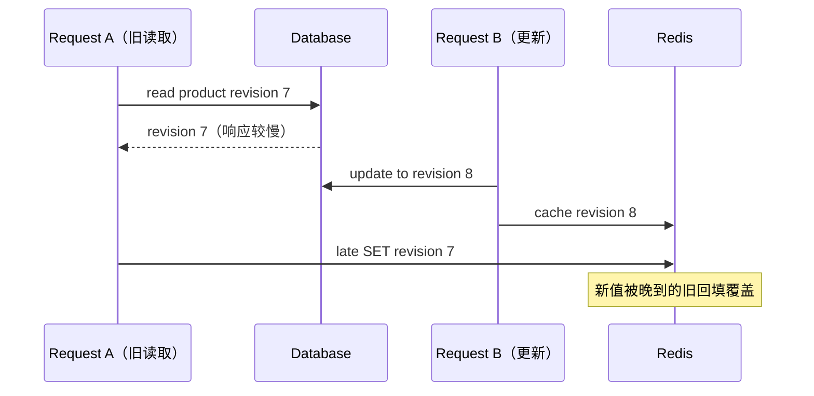
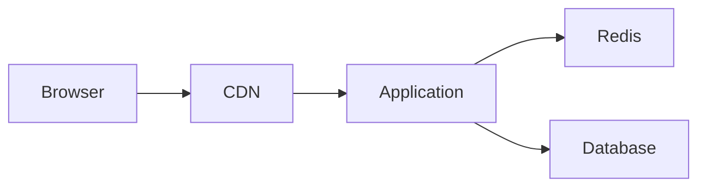
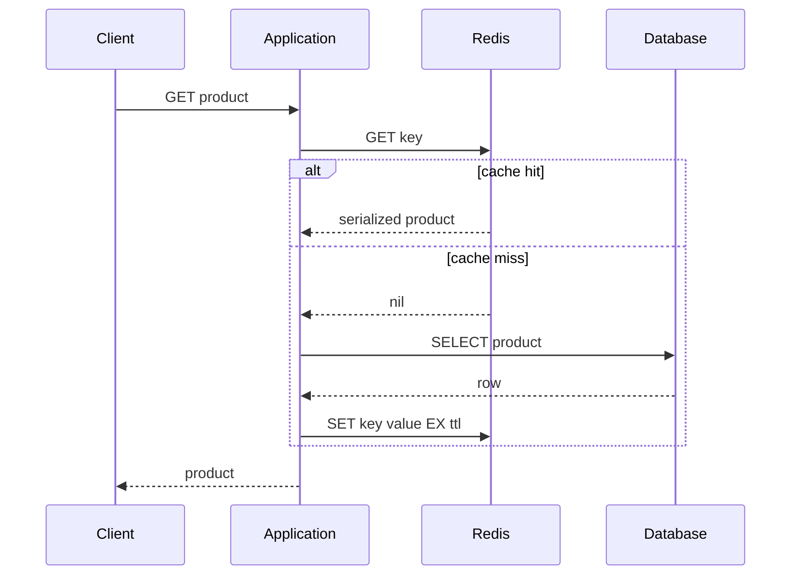
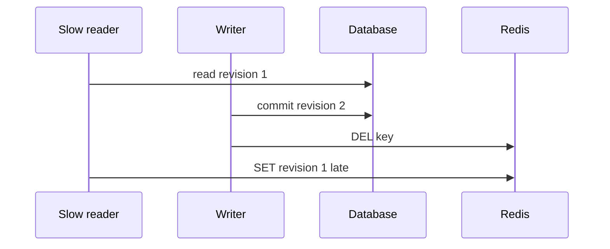

# 应用数据缓存与 Redis：cache-aside、TTL、并发回填与一致性

上一课的浏览器和 CDN 缓存保存完整 HTTP response。这一课把缓存放到应用内部：请求已经进入 Spring Boot 或 FastAPI，应用先查 Redis，没找到时才查数据库。

为什么还需要这一层？因为很多结果不能安全地让所有用户在 CDN 共享，但计算或数据库查询仍然昂贵。例如权限范围内的商品详情、模型配置、聚合统计和第三方接口结果。

Redis 很快并不意味着“把数据库前面接一个 Redis 就结束了”。真正困难的是副本：数据库已经更新，Redis 里可能还是旧值；一个热门 key 刚好过期，几千个请求可能同时压向数据库；Redis 故障时，原本被缓存挡住的流量会突然全部穿透。

本课主线只有一句话：**数据库是权威状态，缓存是可丢失、会过期、可能暂时不一致的派生副本。**

> 没有测量到数据库或计算瓶颈时，不需要 Redis。第一次只理解 cache-aside 的 miss、读取权威数据、回填、hit 和写后失效；击穿、热点、分布式锁和版本化写入都是在并发故障窗口已经明确后才选择的进阶机制。

> 示例运行环境为 Python 3.11+，使用进程内实现把并发顺序变得可测试；Redis 命令说明依据 Redis Open Source 8.x 官方文档。基础的 GET、SET、DEL、EXPIRE、MULTI、EXEC、WATCH 长期可用；文中明确标出 Redis 8.4 才加入的字符串条件更新能力。

## 先从“没有 Redis”开始设计

假设商品详情接口现在这样工作：

```text
GET /api/products/p-100
  → 校验登录与权限
  → 查询数据库
  → 组装 ProductView
  → 返回 JSON
```

如果数据库查询的 p95 只有 4 ms，应用容量也充足，引入 Redis 不一定让用户明显更快，却一定会新增网络调用、序列化、副本过期和故障降级。正确起点不是“项目要不要用 Redis”，而是先回答：

- 哪一步已经被指标证明是瓶颈？
- 相同结果是否会被大量重复读取？
- 业务允许副本旧多久？
- Redis 不可用时，是回源数据库、返回旧值，还是拒绝请求？

只有答案支持缓存时，才把读取路径改成 cache-aside。

## 用三次读取理解 cache-aside

### 第一次读取：miss 不是“商品不存在”

```text
应用 GET product:p-100
  → Redis 返回 nil
  → 应用仍不知道商品是否存在
  → 查询权威数据库
  → 数据库返回 Product(revision=7)
  → 应用序列化并 SET + TTL
  → 返回商品
```

Redis 的 nil 只表示“缓存没有副本”。如果直接把它当 404，第一次访问任何商品都会错误失败。

### 第二次读取：hit 省掉的是权威查询

```text
应用 GET product:p-100
  → Redis 返回 revision=7 的序列化副本
  → 反序列化
  → 返回商品
```

请求仍然进入应用，鉴权、Redis 网络往返和 JSON 响应仍会发生。它与上一课的 CDN hit 不同：CDN 命中可能让请求完全不到达应用。

### TTL 到期后的读取：重新建立副本

```text
key 过期
  → 下一次读取 miss
  → 查询数据库当前 revision=8
  → 回填 revision=8
  → 返回新值
```

TTL 提供的是“最晚会重新查询”的机会，不保证 TTL 期间始终最新。如果业务刚把价格从 59 改为 69，旧缓存仍可能在剩余 TTL 内返回 59。

## 真正困难从“写入同时发生”开始

单线程图里，miss 后查数据库再回填没有问题。并发时可能出现：



这就是为什么“写数据库后删除缓存”仍不能自动解决所有一致性窗口。读请求在删除前已经取得旧值，可能在删除后才把旧值写回来。

本课后面的版本化写入、singleflight、随机 TTL 和负缓存都应从具体失败推出：

| 观察到的问题 | 再考虑的机制 | 机制不能保证什么 |
| --- | --- | --- |
| 同一热点 miss 同时压向数据库 | singleflight / request coalescing | 不自动跨所有应用实例生效 |
| 大量 key 同时过期 | TTL jitter | 不保证数据强一致 |
| 不存在 ID 被反复查询 | 短 TTL negative cache | 不能永久缓存不存在 |
| 旧回填晚于新写入 | revision / compare-and-set | 需要权威源提供可比较版本 |
| Redis 故障导致全部回源 | 限流、降级、容量预留 | 不能凭空增加数据库容量 |

第一次阅读到 cache-aside 与 TTL 就可以停下来。后面的并发机制只有在你能画出对应竞态时才值得采用。

## 1. HTTP cache 与 Redis cache 的请求路径



CDN hit 时，应用完全收不到请求。Redis hit 时，请求仍经历应用线程、鉴权、网络访问 Redis、反序列化和响应生成，只是省掉数据库或昂贵计算。

所以两者不是互相替代：公开且稳定的完整 response 适合 HTTP cache；需要应用理解用户、权限和业务对象的中间结果更适合应用 cache。

## 2. Redis 是什么，不是什么

Redis 是支持多种数据结构、过期、原子命令、复制和持久化选项的内存数据系统。用作 cache 时，常见优势是：

- 多个应用实例共享同一缓存；
- GET/SET 等操作简单且延迟低；
- key 可以设置 TTL；
- 单条命令原子执行，复杂条件可用事务或脚本表达；
- 能配置内存上限和 eviction policy。

但 Redis 不是“永远不会丢数据的内存数据库”，也不是数据库事务的自动延伸：

- key 可能过期或因内存压力被淘汰；
- Redis 可能超时、重启、主从切换或发生网络分区；
- 数据库 commit 与 Redis 命令通常不是同一个原子事务；
- 序列化格式、key 命名和失效关系都由应用负责；
- Redis hit 也有网络与 CPU 成本。

如果业务正确性依赖 key 永远存在，就不能一边把它当可淘汰 cache，一边又假设它是权威记录。

## 3. cache-aside：最常见的读取模式

cache-aside 也叫 lazy loading。缓存不主动读取数据库，应用自己编排：

```text
1. GET cache key
2. hit  → deserialize → return
3. miss → query database
4. serialize → SET key with TTL
5. return
```



“cache miss”只是缓存没有可用副本，不代表数据库没有该对象。必须继续查权威源才能区分。

示例的核心读取路径：

<<< ../../../examples/python/backend-redis-cache/cache_learning/service.py{135-157}

它在加锁前后各查一次缓存。第二次检查不是重复浪费：等待第一个线程填充期间，缓存状态已经改变；若不再检查，所有等待线程仍会逐个查数据库。

## 4. key 是数据合同，不是随手拼的字符串

```text
learning:product:v1:p-100
```

建议 key 至少表达：

- application/domain namespace，避免共享 Redis 中重名；
- resource 类型；
- schema/version；
- stable identifier；
- 必要时 tenant、locale、permission scope 或 query fingerprint。

示例集中生成 key：

<<< ../../../examples/python/backend-redis-cache/cache_learning/service.py{127-129}

不要把原始 bearer token、邮箱等敏感信息直接放 key；key 会进入监控、慢日志和运维工具。复杂查询参数要规范化后 hash，不能让参数顺序制造无意义副本。

版本前缀很实用：序列化结构不兼容时，从 `v1` 切到 `v2`，新代码不再误读旧数据。代价是旧 key 仍占内存，需等待短 TTL 或安排清理。

## 5. value 需要明确序列化合同

Redis 看到的是 bytes、string 或数据结构，并不知道 Python dataclass、Java record 或数据库 row 的含义。

缓存 value 应明确：

- schema version；
- 数字、时间、Decimal、枚举和 null 如何编码；
- 是否包含 revision、source timestamp；
- 最大大小与是否压缩；
- 旧版本 reader 遇到新增字段怎么办；
- 反序列化失败是删除重建还是让请求失败。

不要缓存 ORM session/entity proxy。它可能带连接上下文、lazy loading 状态和内部字段，也难以跨语言演进。缓存稳定 DTO/representation 更安全。

## 6. TTL 解决的是“最终会重建”，不是“始终正确”

`SET key value EX 60` 可以把 value 和秒级过期一次写入。`EXPIRE` 也能给已有 key 设置过期；`TTL` 返回剩余秒数，`-1` 表示无过期，`-2` 表示 key 不存在。

TTL 到达后读取变成 miss，再从数据库回填。它提供两个边界：

- 旧副本在没有主动失效时最终会消失；
- 无人使用的缓存不会永久占用内存。

但 TTL 内数据库仍可能已经改变。因此 TTL 本质上是“最多愿意容忍多久没有自然重建”的策略之一，不是强一致保证。

示例使用可控时钟证明边界：

<<< ../../../examples/python/backend-redis-cache/cache_learning/service.py{31-75}

过期判断使用 monotonic time，避免系统时钟回拨影响进程内 duration。真实 Redis 在服务端管理过期，应用不应拿本机时钟猜 key 是否还活着。

## 7. expiration 与 eviction 不同

- **expiration**：key 的 TTL 到期；
- **eviction**：Redis 超过 `maxmemory` 后，按策略主动淘汰 key；
- **invalidation**：业务变化后，应用主动删除或替换副本。

三者都会让 key 消失，但原因不同。Redis 官方提供 `allkeys-lru`、`allkeys-lfu`、随机、仅淘汰带 TTL 的 volatile 策略和 `noeviction` 等选择。Redis 8.6 还增加了 LRM（least recently modified）策略，这是版本相关能力，不要假设旧集群支持。

LRU/LFU 在 Redis 中是近似算法，不是维护一个完美全局排序。选择策略前先确认 Redis 是否只存可重建缓存；如果 cache 与不可丢业务状态混在同一实例，淘汰策略会变得危险，通常应隔离实例/集群。

`noeviction` 不是“永不出问题”：达到上限后，新增数据的写命令会报错。应用必须决定绕过缓存还是让业务失败。

## 8. 更新数据：先写数据库还是先删缓存

常见 cache-aside 写路径是：

```text
update database → delete cache key
```

为什么通常不先删？

```text
delete cache
→ 另一个请求 miss 并读到数据库旧值
→ 回填旧值
→ 当前请求才 commit 新值
```

最终 cache 仍是旧的。先 commit 数据库再删，窗口通常更小，而且数据库更新失败时不会白白删除正确缓存。

但“先数据库、后 DEL”也不是原子操作：数据库成功后进程可能在 DEL 前崩溃。TTL 是最终修复边界；更严格场景可用 transaction outbox/CDC 发可靠失效事件。

## 9. 晚到的旧读取会覆盖新缓存

即使写后删除，也存在上一课展示过的竞态：



示例选择另一种策略：每个 value 带单调递增 revision；写入数据库后，把 revision 2 发布到缓存；任何晚到的 revision 1 都不能覆盖 revision 2。

<<< ../../../examples/python/backend-redis-cache/cache_learning/service.py{61-75}

<<< ../../../examples/python/backend-redis-cache/cache_learning/service.py{159-169}

这个 compare-and-set 必须在 Redis 端原子完成，不能 `GET revision` 后由客户端决定再 `SET`，否则两个命令之间仍有竞态。可使用 Lua、WATCH/MULTI/EXEC；Redis 8.4+ 的字符串 SET 新增 IFEQ/IFNE 等条件选项，但使用前要核对 client 与集群版本。

注意：写数据库成功、写缓存失败时，不能把数据库谎称回滚。一般记录失败并删除/绕过缓存，由 TTL 或可靠事件修复。真正跨系统原子性会在 Saga/一致性课程讨论。

## 10. 缓存穿透：一直查询不存在的数据

攻击者或错误 client 反复请求不存在的 `product_id`：

```text
cache miss → database not found
cache miss → database not found
...
```

若只缓存存在值，数据库每次都被访问。**negative caching** 会短暂缓存“不存在”这个结果。

关键是区分：

```text
cache miss          = 没有缓存答案
negative cache hit  = 缓存答案明确是“不存在”
```

示例用 `CacheLookup.hit` 区分，而不是只判断 value 是否为 None：

<<< ../../../examples/python/backend-redis-cache/cache_learning/service.py{18-28}

不存在值 TTL 应较短，因为对象可能马上被创建。创建成功时还要主动清 negative key。Bloom filter 可在大规模场景快速拒绝确定不存在的 id，但会有 false positive，并增加构建与更新复杂度；它不是所有项目的默认答案。

参数校验、认证授权和速率限制仍然必要。negative cache 不能替代防攻击边界。

## 11. 缓存击穿：一个热点 key 过期

假设一个 key 每秒有 5000 次读取。它过期的一瞬间，5000 个请求都看到 miss，然后同时查询数据库，这叫热点 key 的 cache stampede/击穿。

**single-flight/request coalescing** 的思想是：同一个 key 同一时间只允许一个执行者回填，其他请求等待并复用结果。

```text
request A: miss → 获得 key lock → DB → fill
request B: miss → 等待          → second check → hit
request C: miss → 等待          → second check → hit
```

示例锁只覆盖一个 Python 进程：

<<< ../../../examples/python/backend-redis-cache/cache_learning/service.py{131-157}

多 worker、多 pod 时，每个进程仍可能各有一个回填者。跨实例协调可用 Redis lock，但必须处理 owner token、TTL、续租、超时和只由 owner 删除；锁过期后旧 owner 仍可能继续写，严格正确性还需要 fencing token。不要用一把全局锁把不同 key 串行化。

若允许旧数据，还可采用 logical expiration：value 保存 `refresh_after`，过期后先返回旧值，由一个执行者后台刷新。这与 HTTP stale-while-revalidate 思路相似，同样扩大旧数据窗口。

## 12. 缓存雪崩：很多 key 或整个缓存同时失效

击穿通常针对一个热点 key；雪崩是大量 key 同时 miss，例如：

- 批量写入时使用完全相同 TTL；
- Redis 集群重启、flush 或大规模 eviction；
- 网络故障让所有应用绕过 Redis；
- 发布时切换 key version，所有新 key 都是空的。

缓解是系统组合，不是一条命令：

- TTL 加 bounded jitter，打散过期时间；
- 热点预热，但预热失败时系统仍要能降级；
- single-flight 限制每个 key 回填并发；
- database connection pool/bulkhead 限制最大冲击；
- 超时、rate limit、load shedding 防止排队无限增长；
- 分批切换版本/流量；
- Redis 高可用，但仍按 Redis 会失败设计；
- 监控 miss rate 突增、DB QPS 与连接池等待。

随机 jitter 也要设边界，例如基础 60 秒加 0～10 秒；不能让随机值破坏业务最大旧数据要求。

## 13. 热点 key 不只会打数据库，也会打 Redis 单点

key 没过期且 hit ratio 很高，也可能成为问题：所有请求集中到负责该 key 的 shard、网卡或 CPU。

可选手段包括 local near-cache、只读副本、拆分可聚合数据、复制热点 key、CDN 上移或降低请求频率。每种办法都会增加副本数量和一致性复杂度。

不要仅凭“Redis 平均延迟很低”排除热点；查看按 shard/node、command、key pattern 的流量与 tail latency。

## 14. Redis 原子性、pipeline 与 transaction 的边界

- 单条 Redis command 原子执行；
- pipeline 减少网络往返，不自动表示事务；
- MULTI/EXEC 让一组排队命令连续执行；
- WATCH 让 EXEC 在被观察 key 变化时放弃，实现 optimistic CAS；
- Redis transaction 不提供关系数据库式 rollback；命令运行时错误不会让之前成功命令自动撤销；
- Lua/script 可把读-判断-写放在服务端原子执行，但脚本必须短小，避免阻塞服务器。

即使 Redis 内部操作原子，也没有自动包含 PostgreSQL/MySQL commit。`DB update + Redis DEL` 仍是两个系统的两个动作。

## 15. Redis lock 不是普通互斥锁的远程版

单实例常见获取形式是带随机 owner token 和过期时间的条件 SET：

```text
SET lock:key unique-token NX PX 5000
```

释放时必须原子地“值仍等于我的 token 才删除”，否则：A 锁过期，B 获得新锁，A 醒来后直接 DEL 会误删 B 的锁。

还要回答：

- 业务执行超过 lease 怎么办？
- client timeout 时是否真的获得锁？
- Redis failover/partition 的 mutual exclusion 保证是什么？
- 锁失效后旧持有者是否还能写下游？
- correctness lock 与只减少重复计算的 efficiency lock，要求是否相同？

对 cache fill，偶尔两个回填者通常只是效率损失；对扣款、leader election 等正确性操作，必须使用满足系统模型的协调机制和 fencing，不能复制一段 SET NX 代码就宣称安全。

## 16. Redis 故障时，应用应该 fail-open 还是 fail-closed

- **fail-open/bypass**：Redis 失败就查数据库，适合可重建性能缓存；风险是流量洪峰打垮数据库；
- **fail-closed**：Redis 失败就拒绝请求，适合 Redis 承载不可绕过的限流/状态语义，但降低可用性；
- **serve stale/local fallback**：返回有界旧值，提高可用性但牺牲新鲜度。

不能全局选择一个答案。商品描述可短暂旧，权限撤销通常不能。即使 fail-open，也应有极短 Redis timeout、受控 DB 并发、load shedding，避免所有请求长时间等待 Redis 后再同时等待数据库，造成双倍排队。

## 17. 完整教学实现

<<< ../../../examples/python/backend-redis-cache/cache_learning/service.py

它故意不用真实 Redis，使下面这些时间与竞态能在任何机器稳定测试：

- hit 在 TTL 内不重复访问 repository；
- 到期后 miss 并重新加载；
- None negative hit 与 miss 可区分；
- 8 个并发冷请求只查询一次 repository；
- 写入发布更高 revision；
- 晚到旧 revision 不能覆盖新 value。

`TtlCache` 的一个 Lock 模拟“单条服务端原子操作”，不模拟 Redis 网络、持久化、复制、cluster slot、故障转移或淘汰。这是用于解释因果关系的模型，不是自制 Redis client。

## 18. 自动化测试

<<< ../../../examples/python/backend-redis-cache/tests/test_service.py

并发测试加入 50ms repository delay，让 8 个请求真的重叠；如果删除 double-check/single-flight，`read_count` 会明显大于 1。

版本测试先把 revision 2 放入 cache，再模拟 revision 1 晚到。`set_if_newer` 返回 false，证明最终值没有倒退。这比只测顺序成功路径更能说明为什么需要原子 version guard。

## 19. 运行示例

<<< ../../../examples/python/backend-redis-cache/pyproject.toml

```bash
cd examples/python/backend-redis-cache
python3 -m venv .venv
source .venv/bin/activate
python -m pip install -e '.[test]'
python -m pytest
```

示例没有要求本机 Redis。把它移植到 Redis 时，保持 `CacheLookup`/repository/service 边界，用官方 client 实现 GET、带 TTL SET 和原子 revision compare；integration test 再使用与你生产兼容的 Redis 版本。

## 20. Vue / JavaScript 对照

- Vue Query 的 query cache 在浏览器进程内；Redis 在服务端跨实例共享；
- `staleTime` 是前端库策略，不会设置 Redis TTL；
- query invalidation 不会自动 DEL Redis，也不会 purge CDN；
- JavaScript 的 `Map.get()` 返回 undefined 时也有“key 不存在”和“缓存的值就是 undefined”歧义，可用 `Map.has()`，对应示例 `CacheLookup.hit`；
- Promise memoization 能做单进程 single-flight，但 rejected Promise 要清理，且不能协调其他 pod；
- JSON 序列化会丢失 Date/BigInt/undefined 等语义，服务端缓存同样要有 schema；
- client abort 不会撤销已经开始的数据库查询或 Redis fill。

## 21. 观测指标

至少按 cache/operation/key pattern 观察：

- hit、miss、negative hit 与 hit ratio；
- Redis p50/p95/p99 latency、timeout、connection pool wait；
- database fallback QPS 与 latency；
- fill duration、single-flight waiter 数与 collapsed request 数；
- expired_keys、evicted_keys、used memory、fragmentation；
- key 数量、value size、hot key 与 big key；
- invalidation/publish 失败；
- stale/version regression 防护拒绝次数；
- 序列化失败和 schema mismatch；
- Redis 故障时 load shedding 数量。

总体 hit ratio 很高不等于健康：一个超热 key 可以掩盖大量低价值 key，一次 Redis timeout 也可能触发数据库洪峰。

## 22. 工程检查清单

- 明确权威源，cache 可删除后重建；
- key 包含 namespace、类型、schema version 和必要 scope；
- key 不泄漏 token/PII，不受未规范化输入无限放大；
- value 是稳定 DTO，有大小和 schema 演进策略；
- 所有 cache key 有合理 TTL，TTL 来自一致性容忍度；
- expiration、eviction、invalidation 概念分开；
- negative cache TTL 短，create 时能清理；
- 热点 miss 有 single-flight，double-check 不缺失；
- 多实例 single-flight 的保证范围写清楚；
- TTL jitter 有上下界；
- DB commit 与 cache 更新失败窗口已分析；
- 旧 reader 不会无条件覆盖新 revision；
- compare/delete/update 在 Redis 端原子完成；
- Redis timeout 远小于业务 deadline；
- fail-open 时 DB 有并发保护和降载；
- maxmemory 与 eviction policy 符合“cache 可丢”假设；
- cache 与不可淘汰状态尽量隔离；
- pipeline、transaction、lock 没有被夸大为跨系统原子性；
- integration test 覆盖真实 Redis 版本、failover 与序列化。

## 23. 本课结论

- cache-aside 是应用先查缓存、miss 后查权威源并回填，不是 Redis 自动同步数据库。
- TTL 让副本最终过期，也定义旧数据窗口；eviction 则由内存压力触发。
- negative cache 解决不存在对象反复穿透，但 TTL 要短且创建时要失效。
- single-flight 把同 key 并发 miss 合并为一次回填；进程内锁不能自动覆盖多实例。
- 大量同时过期或 Redis 故障会形成雪崩，需要 jitter、限并发、降载和数据库保护组合。
- `DB commit + cache command` 不是一个事务；必须写出中间崩溃和晚到旧值的因果链。
- revision guard 必须在 Redis 端原子执行，客户端 GET 后 SET 仍有竞态。
- Redis 是可失败的远程依赖；低平均延迟不能替代 timeout、容量与降级设计。

下一节：消息与事件驱动——为什么同步调用会把等待和故障耦合在一起，broker、queue、topic、consumer group、ack、重投、顺序、幂等消费和 outbox 分别解决什么问题。

## 24. 参考资料

- [Redis：Key expiration](https://redis.io/docs/latest/develop/using-commands/keyspace/)
- [Redis：TTL command](https://redis.io/docs/latest/commands/ttl/)
- [Redis：Key eviction](https://redis.io/docs/latest/develop/reference/eviction/)
- [Redis：Transactions、WATCH 与 optimistic locking](https://redis.io/docs/latest/develop/using-commands/transactions/)
- [Redis：Pipelining](https://redis.io/docs/latest/develop/using-commands/pipelining/)
- [Redis：Distributed locks](https://redis.io/docs/latest/develop/clients/patterns/distributed-locks/)
- [Redis：SET command](https://redis.io/docs/latest/commands/set/)
