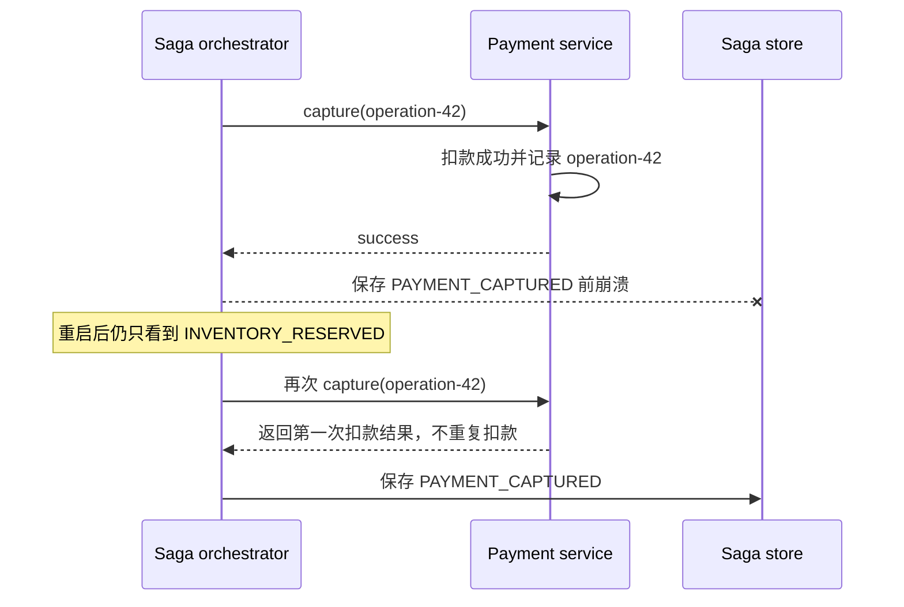
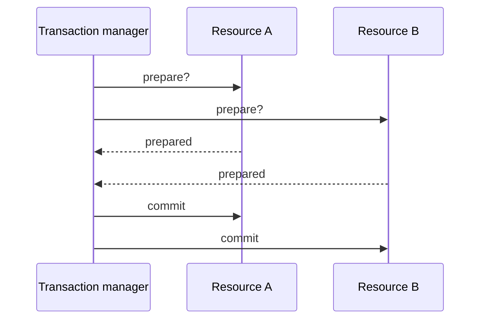
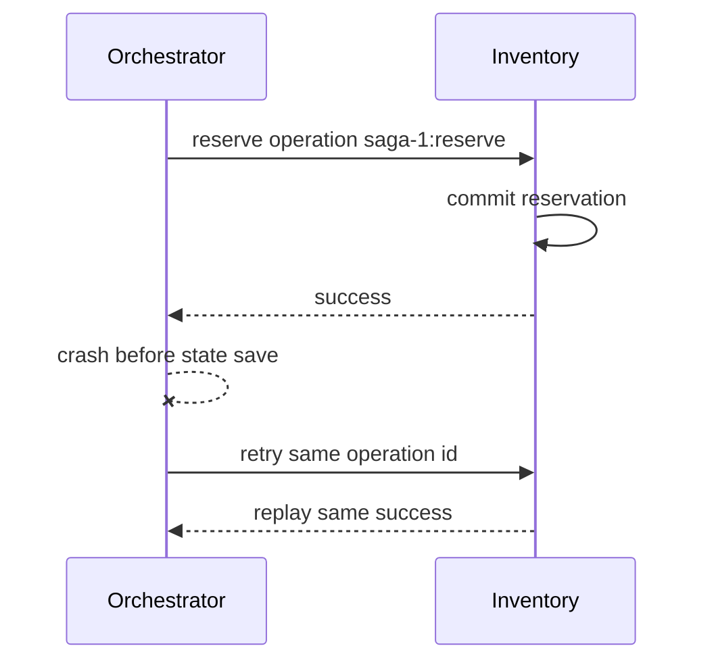

# 分布式事务、Saga、补偿与一致性边界

单个数据库 transaction 很容易理解：扣库存与写订单放在一个 transaction 中，要么一起 commit，要么一起 rollback。

服务拆开后，库存由 Inventory Service 的数据库保存，支付由 Payment Provider 保存，物流又在另一个系统。一次下单跨越多个独立故障域：库存已经预留后，支付可能拒绝；支付成功后，物流可能超时；协调者也可能在收到成功回复后、记录状态前崩溃。

此时没有一个普通 `@Transactional` 能覆盖所有进程。Saga 的思路不是假装它们仍是一个数据库 transaction，而是把业务流程建模为**一系列可恢复的本地事务**：每一步成功都持久化；后续失败时，执行显式的业务补偿。

补偿不是时间倒流。退款是一笔新的财务事实，释放库存是一笔新的库存事实；用户可能已经看到中间状态，手续费、通知或外部动作也未必能完全撤销。

> 只有一次业务写操作真正跨越多个独立状态所有者时才需要本课。第一次先把每一步的本地提交、持久化流程状态和对应补偿画出来；2PC、编排/协同选择和复杂恢复策略不能替代清晰的业务不变量。

> 示例环境为 Python 3.11+。2PC 部分依据 PostgreSQL 18 与 Java `XAResource` 官方资料；Saga 模式边界参考公开模式文档。示例是 durable workflow 的可测试模型，不是生产工作流引擎。

## 先判断这是不是 Saga 问题

看到“订单、库存、支付”三个名词，不代表立刻需要 Saga。先看状态由谁拥有：

### 情况 A：一个应用、一个数据库

```text
OrderService
  └─ 同一个 PostgreSQL
      ├─ orders
      └─ inventory_reservations
```

如果两个写入可以放进一个本地 transaction，就先使用数据库 transaction。引入 Saga 不会让本地原子性更好，只会增加中间状态、重试和补偿。

### 情况 B：库存和支付由独立系统拥有

```text
Order Service → Order DB
Inventory Service → Inventory DB
Payment Provider → 外部支付状态
```

订单服务无权直接提交另外两个系统的数据库。一次下单现在包含三个独立提交点，任何两个提交点之间都可能崩溃。这才是本课要解决的问题。

判断标准不是“表有几张”，而是一次业务写是否跨越多个**独立提交与恢复边界**。

## 把一次下单写成可以停住的步骤

先不要写一大段嵌套 `try/catch`，先列出每一步成功后留下的事实：

| 步骤 | 本地成功事实 | 后续失败时可做什么 | 能否完全撤销 |
| --- | --- | --- | --- |
| 预留库存 | reservation `R-1` 有效 | 释放 `R-1` | 通常可以，但释放也可能失败 |
| 扣款 | payment `P-1` captured | 发起 refund | 退款是新交易，可能有手续费和延迟 |
| 创建物流单 | shipment `S-1` created | 取消物流单 | 已出库后可能无法取消 |

有了这张表，Saga 状态才不是抽象枚举：

```text
NEW
  → 库存预留成功，保存 INVENTORY_RESERVED + reservationId
  → 支付成功，保存 PAYMENT_CAPTURED + paymentId
  → 物流成功，保存 COMPLETED + shipmentId
```

每个箭头都包含两件事：调用参与者，以及持久化协调者已经观察到的结果。只调用不保存，进程重启后就不知道是否要重做；只提前保存“成功”，又可能在远程调用失败时记录了不存在的事实。

## 用一个崩溃窗口理解“幂等步骤”



协调者不能从旧状态判断第一次扣款是否发生，所以必须允许重发同一个 operation id。支付服务也不能只说“POST 默认不幂等”，而应把 operation id 与首次结果作为业务合同保存。

这和上一课的 consumer 幂等是同一类不确定性：成功发生后，确认或状态保存之前崩溃，调用方无法区分“没执行”和“执行了但结果丢失”。

## 补偿要按业务事实理解

数据库 rollback 会让未提交变化像从未发生。Saga 补偿则是在已经提交之后增加新的事实：

```text
PaymentCaptured(amount=100)
RefundRequested(amount=100)
RefundCompleted(amount=100)
```

审计中仍能看到扣款与退款，用户也可能在一段时间内看到“已扣款、退款处理中”。所以 API 不应该只返回模糊的 `failed`，而应允许表达：

- `PROCESSING`：流程仍在推进；
- `COMPENSATING`：核心目标失败，正在抵消已完成步骤；
- `COMPENSATED`：补偿已完成，但历史事实仍存在；
- `MANUAL_INTERVENTION`：自动恢复无法继续，需要人工处理。

第一次学习 Saga，只要能为自己的流程写出“成功事实、补偿动作、幂等 operation id、人工接管状态”四列，就比背完 orchestration/choreography 定义更重要。

## 1. 先区分三个一致性范围

### 单资源本地事务

```sql
BEGIN;
UPDATE inventory ...;
INSERT INTO reservation ...;
COMMIT;
```

同一个 resource manager 根据 ACID 规则提交。应用异常时数据库能 rollback 未提交变化。

### 多资源全局事务

transaction manager 协调多个支持协议的 resource manager，尝试给调用方一个统一 commit/rollback 结果。XA/2PC 属于此类。

### Saga

每个服务只提交自己的 local transaction；流程状态与消息驱动下一步。失败后用 compensating transaction 抵消已完成步骤的业务效果。

Saga 提供的是业务层恢复协议，不自动拥有 ACID isolation，也不等于“最终一定成功”。它可能最终完成、补偿完成，或停在需要人工处理的状态。

## 2. 为什么远程调用不能加入普通数据库 transaction

Spring 的 `@Transactional` 默认管理当前应用配置的 transaction resource。HTTP 请求到另一个服务时，对方有自己的进程、connection pool 和数据库 transaction。

```text
Order DB transaction open
→ HTTP call Inventory
→ Inventory commits its DB
→ Order process crashes
→ Order DB rolls back
→ Inventory commit 不会自动跟着回滚
```

把 transaction annotation 放在 controller/service 上不会让 HTTP 自动获得 XA 语义。长时间保持本地 transaction 等远程调用还会占用连接和 locks，扩大故障影响。

## 3. 2PC 做了什么

two-phase commit 有 coordinator 和 participants：



第一阶段 participant 把未来 commit 所需状态持久化并保留必要 locks；全部 vote yes 后 coordinator 记录决定，第二阶段通知 commit。任何 participant prepare 失败则决定 rollback。

PostgreSQL 的 `PREPARE TRANSACTION`、`COMMIT PREPARED`、`ROLLBACK PREPARED` 为外部 transaction manager 提供 2PC 支持；Java `javax.transaction.xa.XAResource` 定义 resource manager 与 transaction manager 的 XA 合同。

## 4. 2PC 不是“错误方案”，但有适用边界

2PC 的优点是参与资源支持时可以提供强原子提交抽象，适合明确受控、需要它且能承担运维成本的系统。

代价包括：

- 每个 participant/driver/broker 都要正确支持协议；
- prepare 后 transaction 持有 locks/resources，协调者不可用时可能阻塞；
- transaction manager log 与 recovery 必须可靠；
- 延迟受最慢 participant 和额外网络/日志阶段影响；
- 跨组织支付、邮件、普通 HTTP API 通常不是 XA resource；
- 长流程不适合长时间占用 prepared transaction。

PostgreSQL 官方特别警告不要长期留下 prepared transaction：它继续持锁并妨碍 VACUUM；该功能面向外部 transaction manager，而不是普通应用手写。

因此选择不是“微服务永远不能用 2PC”或“2PC 自动最一致”，而是看参与资源、延迟、故障恢复、组织边界与业务补偿能力。

## 5. Saga 是持久化状态机

订单 Saga 可以写成：

```text
NEW
→ INVENTORY_RESERVED
→ PAYMENT_CAPTURED
→ COMPLETED

任一步失败
→ COMPENSATING
→ COMPENSATED
或 MANUAL_INTERVENTION
```

状态不能只存在 Python/Java call stack。进程重启后，系统必须知道已经完成哪些步骤、下一步是什么、哪些补偿待执行。

示例状态：

<<< ../../../examples/python/backend-saga/saga_learning/saga.py{9-29}

`inventory_reserved` 与 `payment_captured` 也是 durable facts。不能用整个服务的全局计数猜某个 Saga 是否完成步骤；不同 Saga 会并发交错。

## 6. orchestration 与 choreography

### Orchestration

orchestrator 明确发送 command、接收 result 并推进状态：

```text
Order workflow → ReserveInventory
               ← InventoryReserved
               → CapturePayment
               ← PaymentCaptured
```

优点是流程、timeout、补偿顺序和状态集中可见；缺点是 orchestrator 需要理解流程，设计不好会变成业务“大脑”和耦合中心。

### Choreography

服务监听 event 后执行本地事务，再发布新 event：

```text
OrderCreated → Inventory reserves → InventoryReserved
             → Payment listens  → PaymentCaptured
```

优点是没有中央流程调用者、参与者更自治；缺点是流程分散，循环依赖、事件风暴、失败定位和全局可见性更难。

步骤少、边界清晰的协作可 choreography；有复杂分支、timeout、人工任务和多级补偿时 orchestration 往往更容易解释。两者都需要 outbox/inbox、幂等与观测。

## 7. command、reply 与 event 在 Saga 中的角色

orchestrator 发 `ReserveInventory` command，请求库存服务动作；库存服务返回/发布 `InventoryReserved` 或 `InventoryRejected` result。整个 Saga 完成后可发布 `OrderConfirmed` event。

不要在收到 command 前就发布过去式成功 event，也不要让 consumer 通过自然语言 error message 推断下一状态。每个 step result 应有 operation id、saga id、step、outcome、reason code 和 participant revision。

## 8. 本地 transaction 与消息必须可靠连接

每个 participant 的步骤通常是：

```text
BEGIN local DB transaction
deduplicate command operation_id
change local business state
write reply/outbox
COMMIT
```

上一课的 outbox 确保本地状态和待发布 result 一起记录；inbox 确保重复 command 不重复副作用。Saga 不替代可靠消息，反而依赖它。

## 9. 每个步骤必须可幂等重试

协调者调用库存成功，但在保存 `INVENTORY_RESERVED` 前崩溃：



新 retry 必须复用同一 operation id。若每次生成新 UUID，participant 会认为是新动作，再扣一次库存。

示例 participant 保存 operation result：

<<< ../../../examples/python/backend-saga/saga_learning/saga.py{49-78}

测试会在 reserve 已生效、Saga 状态仍为 NEW 时崩溃；恢复后 reserve effect 仍只有一次。

## 10. reservation 比“先扣再猜”更适合长流程

库存、额度和席位经常使用 reservation：

```text
AVAILABLE → RESERVED(saga_id, expires_at) → CONFIRMED
                                      ↘ RELEASED/EXPIRED
```

预留把资源暂时归属于 Saga，避免其他订单消耗，同时保留确认/释放语义。它不是数据库 lock：reservation 是持久业务状态，可以跨秒/分钟存在并被观察。

必须定义：TTL 到期、续租、确认与过期竞态、部分数量、取消、重复命令、后台清理，以及过期后迟到的 confirm 如何拒绝。

## 11. 补偿不是 rollback

数据库 rollback 让未提交变化仿佛没有发生。补偿是之后提交的新 transaction：

```text
CapturePayment  → RefundPayment
ReserveStock    → ReleaseStock
CreateShipment  → CancelShipment（若承运商仍允许）
SendEmail       → 无法收回，只能再发纠正邮件
```

因此 compensation 需要业务设计：退款可能产生手续费、汇率差或延迟；货物已发出后取消可能失败；用户已经读取到中间状态。

不要把方法命名为 `rollbackEverything()` 掩盖真实语义。audit 中应保留原动作与补偿动作。

## 12. 补偿通常按反向依赖执行

若顺序是 reserve → capture → shipment，shipment 失败时通常先 refund，再 release：

```text
创建物流失败
→ refund captured payment
→ release inventory reservation
→ mark order rejected
```

如果 refund 失败就先 release inventory，可能留下“用户已付款但商品又卖给别人”。不同业务有不同优先级，补偿顺序必须显式设计。

示例 orchestrator：

<<< ../../../examples/python/backend-saga/saga_learning/saga.py{140-201}

## 13. compensation 也会失败

退款服务可能不可用或永久拒绝。此时不能把 Saga 标为 `COMPENSATED`。应保持可见状态：

```text
MANUAL_INTERVENTION
failure = shipment failed; refund failed
```

然后持续重试有希望的 transient failure，或创建人工 case。需要 runbook、owner、deadline、资金/库存风险指标和安全的 resume/force 操作。

补偿命令也必须幂等。协调者 timeout 后重发 refund，不应退款两次。

## 14. pivot transaction 与可补偿/可重试步骤

分析 Saga 时可区分：

- **compensatable**：后面失败时有合理补偿；
- **pivot**：一旦成功，流程进入必须向前完成的不可逆分界；
- **retryable**：pivot 后通过幂等重试最终完成。

例如“真正向不可撤销外部系统提交转账”可能是 pivot。应尽量把可能拒绝的校验/预留放在 pivot 前，把可靠可重试的通知放在 pivot 后。

现实中没有数学保证的“必然重试成功”；永久故障、合规冻结和人工介入仍要建模。

## 15. Saga 缺少 ACID isolation

Saga 的每个 local commit 对其他 transaction 可见。两个订单 Saga 可能交错：

```text
A 检查库存 1
B 检查库存 1
A 扣减
B 扣减
```

如果 participant 用“先 SELECT、后 UPDATE”且没有原子条件，仍会超卖。Saga 不能修复 participant 内部并发错误。

库存应使用本地 transaction 的 conditional update/unique reservation：

```sql
UPDATE stock
SET available = available - :quantity
WHERE sku = :sku AND available >= :quantity;
```

受影响行数为 0 就拒绝。其他 countermeasure 包括 semantic lock/PENDING 状态、commutative update、version check、reread value、reservation 和按 aggregate 串行化。

## 16. 隔离异常要从业务不变量出发

不要只问“是不是 eventual consistency”，要列不变量：

- available inventory 不能小于 0；
- 同一 payment operation 最多 capture 一次；
- confirmed order 必须有有效 reservation/payment；
- compensated order 不应继续创建 shipment；
- refund 失败必须可见且告警；
- 同一 Saga 的状态只能按允许边演进。

每个不变量指定 owner service，并在它的 local transaction 内强制执行。跨服务查询只能用于决策参考，不能替代 owner 的原子约束。

## 17. timeout 是未知结果，不是失败证明

调用 Payment timeout 时可能是：

- request 未到达；
- capture 已拒绝但 response 丢失；
- capture 已成功但 response 丢失；
- 仍在处理中。

不能一 timeout 就 refund，也不能直接再次用新 operation id capture。正确合同通常提供幂等 operation id 和 query/status API，让 orchestrator 重试同一 command 或查询结果。

## 18. 用户看到的一致性体验

异步 Saga 接口通常返回：

```http
HTTP/1.1 202 Accepted
Location: /orders/o-100
```

状态 resource：

```json
{
  "order_id": "o-100",
  "status": "PENDING_PAYMENT",
  "updated_at": "...",
  "failure_code": null
}
```

前端轮询、SSE/WebSocket 或 notification 获取最终状态。不要在 202 body 写“订单成功”后几秒再偷偷改失败。

read-your-writes 可通过返回创建结果、sticky/version token、读取权威服务或等待 projection 到达至少某 revision 实现。CQRS projection lag 时，刚创建的订单可能暂时不在列表；UI 需要明确 pending item，而不是让用户重复提交。

## 19. choreography 的循环与事件风暴

当 OrderCreated → CreditReserved → InventoryReserved → PaymentCaptured 由多个 handler 隐式连接时，加入取消/timeout 后可能出现：

- 谁拥有整体 deadline 不清楚；
- 两个服务互相触发补偿循环；
- 同一个 event 被误解为 command；
- 很难回答一个 Saga 当前在哪；
- change 一个事件影响多个未知 consumer。

需要 correlation/saga id、状态视图、event catalog、owner、contract tests 与拓扑观测。复杂业务不应因为“解耦”而拒绝显式 orchestrator。

## 20. workflow engine 能提供什么

成熟 durable workflow engine 可提供持久 timer、activity retry、history、worker failover、signal、查询与可视化。但它不会替你决定：

- 哪个动作可补偿；
- idempotency key 是什么；
- timeout 后业务结果怎么确认；
- 哪些状态能对用户承诺；
- participant local transaction 的不变量；
- 人工处理如何授权。

框架保证要按版本与 deployment 模式核对，不要把“workflow code 看起来顺序执行”误认为远程副作用自动 exactly-once。

## 21. 完整教学实现

<<< ../../../examples/python/backend-saga/saga_learning/saga.py

示例采用 orchestration，覆盖：

- Saga state 持久对象；
- inventory/payment/shipping 本地 participant；
- 每一步由 `saga_id:step` 构造稳定 operation id；
- participant 重放旧 result；
- payment decline 释放库存；
- shipment failure 退款后释放库存；
- refund failure 留在人工状态；
- remote success 后 orchestrator 崩溃可恢复。

进程内对象仅用于教学。生产 store 要用数据库和 optimistic locking/lease 防止两个 worker 同时推进同一 Saga；command/reply 用 outbox/inbox；timer 与 retries 必须持久化。

## 22. 自动化测试

<<< ../../../examples/python/backend-saga/tests/test_saga.py

测试包括完整成功、库存拒绝、支付拒绝补偿、物流失败反向补偿、成功回复后崩溃恢复，以及退款失败不虚假标记成功。

特别注意崩溃测试：第一次 reserve 已扣库存，但 Saga status 尚未保存；第二次 run 使用相同 operation id，participant 重放结果，因此 `reserve_effects == 1`。

## 23. 运行示例

<<< ../../../examples/python/backend-saga/pyproject.toml

```bash
cd examples/python/backend-saga
python3 -m venv .venv
source .venv/bin/activate
python -m pip install -e '.[test]'
python -m pytest
```

## 24. Vue / JavaScript 对照

- 前端多步表单的“上一步”只是 UI state，不是已提交远程动作的补偿；
- `Promise.all()` 失败不会自动撤销其他已经成功的 promises；
- AbortController 取消等待不等于 payment/inventory 未执行；
- 202 后保存 order/saga URL，刷新页面后继续查询，不能只把 pending 状态放 Pinia；
- UI 展示 PENDING/COMPENSATING/MANUAL，而不是只有 loading/success/error；
- retry button 要复用 logical operation id，避免创建第二个 Saga；
- projection lag 时用 returned object/revision 保持 read-your-writes 体验。

## 25. 观测与运维

至少观察：

- 每个 status 的 Saga 数量与 oldest age；
- step latency、attempt、timeout、business rejection；
- compensation rate、failure rate、manual queue age；
- participant duplicate/replay result 数；
- outbox/inbox lag；
- 状态非法迁移/optimistic conflict；
- reservation 即将过期与 orphan reservation；
- end-to-end business completion latency，而不只 HTTP latency；
- trace 中保留 saga/correlation/operation id，但不泄漏敏感数据。

提供按 saga id 查询 history 的工具，明确每一步 command、result、时间、attempt 和 operator action。人工 force-complete/compensate 是高风险操作，需要权限、审计和 invariant check。

## 26. 工程检查清单

- 先判断是否真的需要跨服务 write，能否重新划分边界在一个 transaction 内完成；
- local transaction、2PC 与 Saga 的保证没有混称；
- 2PC participants、coordinator recovery 和 lock duration 可接受；
- Saga 状态、step result、timer 持久化；
- orchestration/choreography 的 owner 与可见性清楚；
- 每个 command 有稳定 operation id，retry 不换 id；
- participant 在 local transaction 内 dedup + effect + outbox；
- timeout 按 unknown outcome 查询/重试，不直接假定失败；
- 每个成功步骤对应可行 compensation 或明确 pivot；
- compensation 本身幂等、可失败、有 deadline/人工路径；
- compensation 顺序符合业务风险；
- reservation 有 owner、TTL、确认、释放与迟到竞态规则；
- participant 原子维护自己的 invariant；
- Saga isolation anomalies 已逐一分析；
- 状态机只允许合法单调迁移，worker 并发推进有 version/lease；
- 202/status resource 与前端 pending 体验准确；
- projection lag/read-your-writes 策略明确；
- manual intervention、replay、force 操作有授权与审计；
- 观测能回答“卡在哪、多久、谁负责、资金/库存风险多大”。

## 27. 本课结论

- 普通本地 transaction 不能跨 HTTP 自动 rollback 其他服务的 commit。
- 2PC 通过 prepare/decision 协调支持协议的资源，强原子抽象有明确运维与参与者边界。
- Saga 是持久化状态机和一组 local transactions，不提供自动 rollback 或 ACID isolation。
- compensation 是新的业务动作，不是抹去历史；退款、释放和纠正通知都有现实副作用。
- 每个 step/compensation 必须使用稳定 operation id 幂等执行，timeout 是未知结果。
- outbox/inbox 连接本地状态与消息，Saga 仍会面对重复和延迟。
- reservation、conditional update 和 semantic state 在 owner 服务内保护业务 invariant。
- 补偿失败必须保持可见并进入受控重试/人工处理，不能为了流程“绿色”伪造完成。

下一节：弹性治理——deadline 如何沿调用链传播，timeout、retry、backoff/jitter、circuit breaker、bulkhead、rate limit 和 load shedding 分别解决哪一种失败。

## 28. 参考资料

- [PostgreSQL 18：PREPARE TRANSACTION](https://www.postgresql.org/docs/current/sql-prepare-transaction.html)
- [PostgreSQL 18：Two-Phase Transactions](https://www.postgresql.org/docs/current/two-phase.html)
- [Java SE：XAResource](https://docs.oracle.com/en/java/javase/21/docs/api/java.transaction.xa/javax/transaction/xa/XAResource.html)
- [Saga pattern](https://microservices.io/patterns/data/saga.html)
- [Transactional Outbox pattern](https://microservices.io/patterns/data/transactional-outbox.html)
- [Temporal：Compensating Actions](https://docs.temporal.io/encyclopedia/detecting-activity-failures#compensating-actions)
