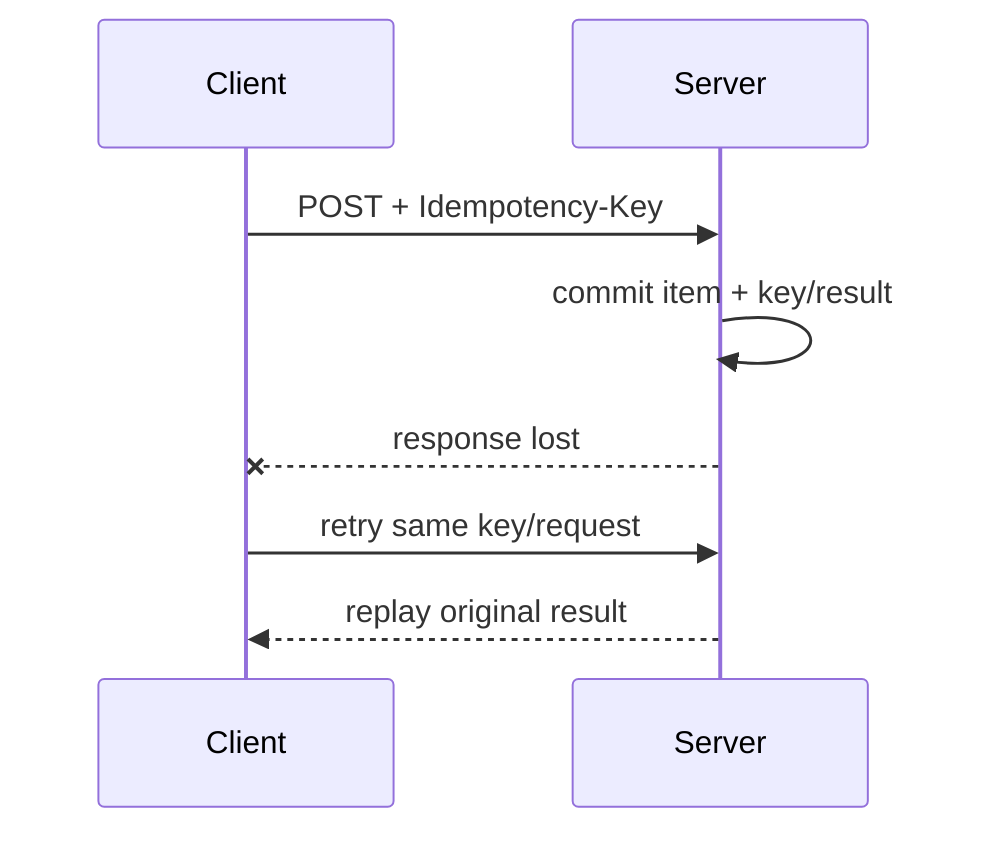

# HTTP API 资源建模、方法语义、错误、分页、并发控制与版本演进

API 一旦被浏览器、移动端、合作方、CLI 或另一个服务使用，就成为跨团队、跨进程、跨发布时间的合同。函数可以在一次提交内重命名，公开 API 却可能需要多年兼容。

设计 API 的关键不是把 controller URL 改成复数名词，而是让 client、proxy、cache 和 server 对同一个请求形成一致理解：这个方法是否安全重试、成功创建了什么、更新基于哪个版本、错误能否机器处理、翻页期间数据变化会发生什么。

第一次只设计一个资源的创建、读取和失败合同：method、URI、status、必要 header 与稳定错误 body。分页、ETag 并发控制、幂等键和版本演进是在调用方与并发复杂度出现后逐步加入的，不要把所有机制塞进第一个 CRUD。

> 规范基准：HTTP Semantics RFC 9110、HTTP Caching RFC 9111、PATCH RFC 5789、额外状态码 RFC 6585、Problem Details RFC 9457。当前 OpenAPI 最新发布版为 3.2.0；FastAPI 0.139.x 生成 OpenAPI 3.1.0，选择规范版本时还要核对目标生成器和 gateway 的支持范围。

## 1. API 合同包含整个 HTTP message

合同不只是 JSON body。一次交互包括：

```text
method + target URI + query + headers + body
→ status + response headers + body/trailers
```

例如创建成功的完整合同可能是：

```http
POST /api/v1/items HTTP/1.1
Content-Type: application/json
Idempotency-Key: request-001

{"name":"Book","price":"59.90"}
```

```http
HTTP/1.1 201 Created
Location: /api/v1/items/8c...
ETag: "1"
Content-Type: application/json

{"item_id":"8c...","name":"Book","price":"59.90","version":1}
```

只在 body 写 `{success: true}` 会丢弃 HTTP 软件已经理解的 status、cache、conditional request 和 retry 语义。

## 2. Resource 是可寻址概念，不等于数据库表

resource 可以是实体、集合、计算结果或长任务：

```text
/items/{item_id}
/customers/{customer_id}/orders
/exports/{job_id}
/reports/daily?date=2026-07-16
```

它不必与 table 一一对应。API resource 是为 consumer 设计的稳定外部模型；数据库 schema 是内部持久化模型。直接暴露 table/foreign key 会让 migration 变成 breaking API change，也容易产生 mass assignment。

“URI 必须只有名词”是有用倾向，不是绝对标准。真正无法自然表达为 CRUD 的 domain command 可建成 command resource，例如：

```text
POST /orders/{id}/cancellations
POST /accounts/{id}/password-reset-requests
```

这比 `/doCancelOrder` 更清楚地表达产生了可审计的取消/请求事实。不要为了纯粹形式把所有业务动作伪装成无含义字段更新。

## 3. URI 设计的稳定边界

- 使用稳定业务 identifier，不把可变 display name 当永久主键；
- collection 和 member 层级一致；
- query 表达 filter、sort、pagination 或 projection；
- 不把 secret、长期 bearer token 或敏感搜索词放 URL；URL 常进入日志、历史和 Referer；
- URL 大小写、尾斜杠、编码和 Unicode normalization 有统一策略；
- nested path 只表达真实 ownership，不无限嵌套；
- client 不应解析 opaque id/cursor 的内部结构。

`/users/me` 是上下文 resource，`/users/{id}` 是显式 identity resource；权限与 cache key 不同，需要清楚记录。

## 4. Safe、idempotent 与 cacheable 是三个概念

RFC 9110 的边界：

- **safe**：定义语义本质为只读，client 不请求状态变化；GET、HEAD、OPTIONS 是 safe；日志/计数等附带效果不改变这个定义；
- **idempotent**：同一请求重复多次的预期 server effect 与执行一次相同；PUT、DELETE 和 safe methods 属于 idempotent；
- **cacheable**：response 是否允许被 cache 存储/复用，由 method、status 和 cache directives 等共同决定。

幂等不表示每次 response body 完全相同，也不表示 server 只执行一次。重复 DELETE 可以第一次删掉、第二次仍返回 204；effect 相同。重复 PUT 期间 audit timestamp 可能变化，但目标 resource state 相同。

安全/幂等语义影响 browser、proxy、SDK 和 retry policy。不要让 GET 扣款或删除数据；crawler/prefetch 可能主动 GET。

## 5. POST、PUT 与 PATCH

### POST

POST 让 target resource 按自己的语义处理 representation，常用于由 server 分配 URI 的创建、command 或批处理。它默认不幂等，但可以通过业务 operation id/`Idempotency-Key` 建立应用级重试合同。

### PUT

PUT 用 request representation 创建或**完全替换**目标 resource，target URI 通常由 client 已知。PUT 的幂等性来自“重复把目标变成同一表示”。如果 endpoint 实际只更新出现字段，它更像 partial update，不能靠名字 `PUT` 获得正确语义。

### PATCH

PATCH 应用 patch document 做部分修改。RFC 5789 要求一次 PATCH 的直接变更原子应用：不能让 client 观察一半成功。PATCH 不自动幂等；JSON Patch 的 `add`、自定义“increment”重复执行可能继续变化。

必须声明 patch media type/语义，例如 JSON Merge Patch、JSON Patch 或明确的 application JSON partial model。普通 `null` 究竟代表“清空”还是“未提供”要可区分。

## 6. Success status 是协议的一部分

- `200 OK`：成功并返回 representation/result；
- `201 Created`：创建新 resource，通常附 `Location`；
- `202 Accepted`：已接受但尚未完成，应提供 job/status resource；
- `204 No Content`：成功且无 response content；不能再偷偷返回 JSON body；
- `206 Partial Content`：HTTP range response，不是普通分页的代名词；
- `304 Not Modified`：conditional GET/HEAD 可复用缓存表示，不带普通 response body。

不要所有成功都返回 200，也不要用 202 掩盖“任务可能永远丢失”。202 后的 job 需要状态、失败、取消、retention 与权限合同。

## 7. 常见 4xx/5xx 的边界

| Status | 适用语义 |
| --- | --- |
| 400 | request syntax/header/cursor 等无法理解 |
| 401 | 缺少或无效 authentication，通常结合 `WWW-Authenticate` |
| 403 | 已识别身份但无权执行；也可按安全策略用 404 隐藏存在性 |
| 404 | target resource 不存在或不可见 |
| 409 | 当前 resource/application state 冲突，例如重复业务 id |
| 412 | conditional header 的 precondition 不成立 |
| 415 | request media type 不受支持 |
| 422 | content 可解析，但字段/语义校验失败 |
| 428 | server 要求 conditional request，例如必须提供 `If-Match` |
| 429 | 此 client/tenant 超出 rate policy，可附 `Retry-After` |
| 500 | 未预期 server bug/failure；不应泄漏 stack/SQL |
| 503 | 服务暂不可用/过载，可附 `Retry-After` |
| 504 | gateway/proxy 等待 upstream 超时 |

404、409、412 的区别依赖失败对象：更新不存在的 item 是 404；创建使用已存在的业务 key 可为 409；基于旧 ETag 更新现存 item 是 412。

## 8. Problem Details 提供稳定错误 envelope

RFC 9457 定义 JSON media type `application/problem+json`：

```json
{
  "type": "https://api.example.test/problems/precondition-failed",
  "title": "Precondition failed",
  "status": 412,
  "detail": "The supplied ETag is stale.",
  "instance": "/api/v1/items/abc"
}
```

- `type` 是 problem type 的机器标识，client 应按它分支；
- `title` 是相对稳定的人类摘要；
- `status` 便于持久化 body 后理解，但真正 HTTP status 仍是权威且两者应一致；
- `detail` 描述本次 occurrence，不应让 client 解析自然语言；
- `instance` 标识本次问题 occurrence，可用安全 URI/request id；
- extension members 可加入 validation errors、limit 等结构化信息。

RFC 9457 已取代 RFC 7807。不要把 stack trace、SQL、内部 host 或 secret 放进 detail。problem type URI 可提供文档，但 client 不应每次自动访问它。

示例统一处理业务和 Pydantic validation 错误：

<<< ../../../examples/python/backend-http-api-contract/contract_api/app.py{12-119}

## 9. Validation error 要能定位，但不能泄漏内部模型

批量字段错误通常作为同一 validation problem 的 extension：

```json
{
  "type": "https://api.example.test/problems/validation-error",
  "status": 422,
  "errors": [
    {"location": ["body", "price"], "message": "Input should be greater than or equal to 0"}
  ]
}
```

client 使用 stable field pointer/code，不要解析翻译后的 message。错误是否一次返回全部还是 fail-fast 要写入合同。

请求 model 使用 `extra="forbid"` 能及早发现拼写和 mass assignment；否则 client 传 `is_admin` 被静默忽略可能误以为生效，更危险的是 ORM 自动绑定让它真的生效。

## 10. 创建请求为何需要应用级幂等

client timeout 时无法知道 POST 是否已经 commit：



同一 key、同一 canonical request 回放首次 result；同一 key、不同 request 必须冲突，不能把不同操作误认为重试。

<<< ../../../examples/python/backend-http-api-contract/contract_api/store.py{35-57}

生产 key 应按 authenticated subject + operation scope 隔离，并定义 TTL、并发唯一约束、最大长度和存储清理。header 名 `Idempotency-Key` 已广泛使用，但具体服务合同仍需明确；不要假设所有 gateway/framework 自动实现。

## 11. ETag 与 conditional request 防止 lost update

两个用户先读 version 1：

```text
A GET v1          B GET v1
A PATCH name      B PATCH price based on v1
```

若 B 最后覆盖整个 row，A 修改丢失。server 返回 strong ETag：

```http
ETag: "1"
```

client 更新时发送：

```http
If-Match: "1"
```

server 原子检查当前 version：

- 没 header且该 API 强制并发控制：428；
- tag 不匹配：412；
- 匹配：更新并返回 `ETag: "2"`。

RFC 9110 规定 `If-Match` 使用 strong comparison；weak tag `W/"1"` 不能用于这里的强比较。比较和更新必须在同一数据库原子操作/transaction 中，不能先 SELECT 后无条件 UPDATE 留 race。

示例的 in-memory lock 模拟该原子范围：

<<< ../../../examples/python/backend-http-api-contract/contract_api/store.py{62-78}

## 12. `If-None-Match` 与 cache revalidation

GET 返回 ETag 后，client/cache 可发送：

```http
GET /api/v1/items/abc
If-None-Match: "2"
```

未变化则 304，复用本地 representation，节省 body/serialization。ETag 是 representation validator，不必把 database version 直接暴露；若同一 resource 的 gzip、language、projection 表示不同，validator 和 `Vary`/cache key 要正确区分。

`Cache-Control: no-cache` 并不等于禁止存储，它要求复用前 revalidate；真正禁止存储常用 `no-store`。包含私有用户数据时还要区分 private/shared cache、Authorization 和 CDN 规则。

## 13. Offset pagination 的漂移问题

```text
GET /items?offset=0&limit=20
GET /items?offset=20&limit=20
```

offset 简单、支持跳页，但第一页之后插入/删除会让第二页重复或遗漏；大 offset 在部分数据库也越来越昂贵。

cursor/keyset pagination 用稳定 total order 的最后一项作为 continuation：

```text
ORDER BY created_at, id
WHERE (created_at, id) > (:last_created_at, :last_id)
LIMIT :limit + 1
```

必须包含唯一 tie-breaker；只按非唯一 timestamp 排序会遗漏同一时刻记录。

## 14. Cursor 是 continuation state，不是页码换皮

示例用单调 sequence 创建 cursor：

<<< ../../../examples/python/backend-http-api-contract/contract_api/store.py{84-112}

它取 `limit + 是否还有更多` 的等价逻辑，并只在有下一页时返回 `next_cursor`。示例 base64 只是 URL-safe 编码，不提供保密、完整性或授权；client 可以解码甚至构造合法 sequence。生产 cursor 应：

- 被视为 opaque；
- 包含 filter/sort/tenant/snapshot 等必要上下文；
- 验证类型、大小、版本和过期；
- 需要防篡改时签名/MAC，不把 encode 冒充 encryption；
- 不包含未加密 PII/secret；
- 定义 invalid/expired cursor 的 400 problem type。

cursor pagination也不自动提供 snapshot consistency。翻页期间新数据可能出现在后页；若业务要求同一快照，需要 snapshot token/consistent read，代价是数据库和 retention 复杂度。

## 15. Filter、sort、search 与分页必须组合成确定合同

例如：

```text
GET /items?status=active&sort=-created_at,name&limit=20&cursor=...
```

- allowlist filter/sort fields，不能把任意 query 拼 SQL；
- 定义 repeated parameter、空值、timezone、大小写和 normalization；
- cursor 必须绑定相同 filter/sort，不能换条件后继续使用；
- 限制 `limit`，避免一页拉百万行；
- total count 可能昂贵或与列表 snapshot 不一致，不应默认承诺；
- full-text search relevance 会变化，continuation 需搜索引擎特定方案。

响应 envelope 允许添加 next cursor/links：

```json
{"items": [...], "next_cursor": "eyJhZnRlciI6Mn0"}
```

也可使用 RFC 8288 `Link` header 表达 next relation；选择一种稳定合同并让 SDK 支持。

## 16. DELETE 的不存在语义由合同决定

DELETE 是幂等方法，但第一次删除 204、第二次返回 404 仍可能符合幂等 effect：resource 都不存在。示例两次都返回 204，减少 client 重试分支，也避免部分存在性泄漏：

<<< ../../../examples/python/backend-http-api-contract/contract_api/app.py{224-227}

若 client 必须区分“本次删除”和“此前不存在”，可用 404/operation result，但要记录安全和重试语义。soft delete、restore、retention 与 410 Gone 需要独立 resource lifecycle 合同。

## 17. API versioning 不是在 URL 加 v1 就完成

常见版本位置：

- path `/api/v1/items`：明显、路由/cache 简单，但 URL 永久携带版本；
- media type parameter/vendor media type：内容协商更纯，但 tooling/client 更复杂；
- header/query：可用但 cache、可见性和调试需谨慎；
- 无显式 major version：依赖持续兼容演进。

版本解决 breaking change 分组，不能替代兼容纪律。同一 major 内通常安全的 additive change 也有条件：

- 新 optional response field 对宽容 JSON client 安全，但严格 decoder 可能失败；
- 新 enum value 会打破穷举 switch；
- optional request field 变 required 是 breaking；
- 改字段含义/单位，即使 schema 不变也是 breaking；
- 改默认 sort/pagination 会改变行为；
- error type/status 也是合同。

删除旧版本需要 deprecation 通知、usage telemetry、迁移指南、sunset 时间和 owner，不是仅保留两套 controller 永久复制 bug fix。

## 18. OpenAPI 是机器可读描述，不自动保证实现一致

OpenAPI 3.2.0 是当前最新发布规范，但具体 framework/generator 支持可能停在 3.0/3.1。FastAPI 0.139 示例输出 3.1.0，这是工具能力，不应手改 version 字符串假装支持 3.2 feature。

contract-first 先审查 description 再实现，适合跨团队；code-first 从 route/model 生成，减少重复。两者都需要 CI：lint、breaking diff、schema validation、SDK compile 和 behavior contract test。

自定义 exception handler 不会保证 OpenAPI 自动知道每个错误 media type/status。示例显式声明 `application/problem+json`，并测试 PATCH 的 428 response：

<<< ../../../examples/python/backend-http-api-contract/contract_api/app.py{20-36}

## 19. 完整参考实现

<<< ../../../examples/python/backend-http-api-contract/contract_api/app.py

它展示：

- 201 + Location + ETag；
- POST 幂等回放和 mismatch 409；
- RFC 9457 error envelope；
- `extra="forbid"` 防止未知写字段；
- cursor pagination；
- `If-None-Match` 304；
- `If-Match` 的 428/412 lost-update protection；
- 幂等 DELETE；
- OpenAPI problem response media type。

教学 store 是单进程内存实现。多 worker 不共享状态，进程重启会丢失；生产必须用 database/共享系统的 unique constraint 和 atomic conditional update，不能把 Lock 当分布式正确性。

## 20. Contract test 要检查 headers 和失败路径

<<< ../../../examples/python/backend-http-api-contract/tests/test_contract.py

测试不只断言 JSON：

- create 的 status、Location、ETag 和 replay header；
- same key/different request 的 409 Problem Details；
- 304 revalidation、428 missing precondition、412 stale update；
- cursor 两页不重复；
- validation 与 invalid cursor 的统一媒体类型；
- repeated DELETE effect；
- OpenAPI 文档声明 428 与 `application/problem+json`。

还应在真实数据库测 concurrent update、unique idempotency race、transaction rollback 和 pagination query plan。

## 21. 运行示例

<<< ../../../examples/python/backend-http-api-contract/pyproject.toml

```bash
cd examples/python/backend-http-api-contract
python3 -m venv .venv
source .venv/bin/activate
python -m pip install -e '.[test]'
python -m pytest
uvicorn contract_api.app:create_app --factory --reload
```

## 22. 与 Vue / JavaScript client 对照

- `fetch()` 只在 network error 时 reject；404/409/412 仍需检查 `response.ok/status`；
- client 应按 problem `type`/structured extension 分支，不解析 `detail` 中文；
- 创建 mutation 生成一次 idempotency key，并在同一 logical operation retry 时复用；用户新操作必须换 key；
- query cache 保存 ETag，revalidation 收到 304 后复用旧 data；
- 编辑页保存读取时 ETag，PATCH 时发送 `If-Match`；412 应提示刷新/合并，不应自动覆盖；
- infinite scroll 保存 opaque cursor，不从最后 id 自己拼；filter/sort 改变后清空 cursor；
- TypeScript enum 对新增 server value 要有 unknown fallback；
- AbortController 取消 UI 等待不等于 server 未提交，写请求仍靠幂等确认。

## 23. 安全与隐私边界

- authorization 对 collection/member/filter 都执行，不能只隐藏按钮；
- sequential id 可能便于枚举，但 UUID 也不替代授权；
- 404/403 policy 避免泄漏 resource 存在；
- unknown request fields 拒绝，显式 allowlist 可写属性；
- cursor、Location、problem instance 不泄漏内部 topology/PII；
- idempotency response 只对原 authenticated subject 回放；
- response cache key 包含 tenant/auth/representation variant；
- error detail 不回显未经清洗的输入、SQL 和 stack；
- list limit/filter complexity、body/header 大小有限制；
- OpenAPI docs 暴露范围按环境和受众控制。

## 24. 工程检查清单

- resource/command 与 database table 解耦；
- method 的 safe/idempotent/cacheable 语义正确；
- POST retry 有 idempotency scope、fingerprint、TTL 和并发约束；
- PUT 是完整替换，PATCH media type/null/atomicity 明确；
- 201/202/204/304 等 success status 与 headers 完整；
- 400/401/403/404/409/412/422/428/429/503 条件一致；
- error 使用稳定 problem type 和 `application/problem+json`；
- ETag/If-Match comparison 与 update 原子；
- cache validator、Cache-Control、Vary 和 private data 安全；
- pagination 有 stable unique order、limit 和 cursor validation；
- cursor 绑定 filter/sort/tenant，需要时签名；
- API change 对 strict decoder、enum、default behavior 做 compatibility review；
- OpenAPI 与运行时媒体类型/status 同步；
- contract test 覆盖 headers、errors、retry、concurrency 和 pagination；
- authorization、mass assignment、enumeration 与错误泄漏已检查。

## 25. 本课结论

- HTTP API 是 method、URI、headers、status 和 body 的完整长期合同。
- safe、idempotent、cacheable 分别描述不同性质；正确语义让通用 client/proxy 安全工作。
- Problem Details 用 type/status/detail/instance 建立机器可处理错误，不能只返回自然语言。
- POST 幂等键解决 unknown outcome；ETag + If-Match 解决并发 lost update，问题不同。
- cursor pagination 需要稳定唯一顺序和 continuation context；base64 不是安全机制。
- 版本号不能替代兼容演进，新增 enum/default/error 变化同样可能 breaking。
- OpenAPI 是可执行合同入口，但必须通过 behavior tests 和 breaking diff 防止描述漂移。

下一节建议：缓存架构——HTTP cache、CDN、应用缓存、Redis、cache-aside、失效、stampede、热点与一致性边界。

## 26. 参考资料

- [RFC 9110：HTTP Semantics](https://www.rfc-editor.org/rfc/rfc9110.html)
- [RFC 9111：HTTP Caching](https://www.rfc-editor.org/rfc/rfc9111.html)
- [RFC 5789：PATCH Method for HTTP](https://www.rfc-editor.org/rfc/rfc5789.html)
- [RFC 6585：428 与 429](https://www.rfc-editor.org/rfc/rfc6585.html)
- [RFC 9457：Problem Details for HTTP APIs](https://www.rfc-editor.org/rfc/rfc9457.html)
- [RFC 8288：Web Linking](https://www.rfc-editor.org/rfc/rfc8288.html)
- [IANA：HTTP Status Code Registry](https://www.iana.org/assignments/http-status-codes/http-status-codes.xhtml)
- [OpenAPI Specification 3.2.0](https://spec.openapis.org/oas/v3.2.0.html)
- [FastAPI：Additional Responses in OpenAPI](https://fastapi.tiangolo.com/advanced/additional-responses/)
