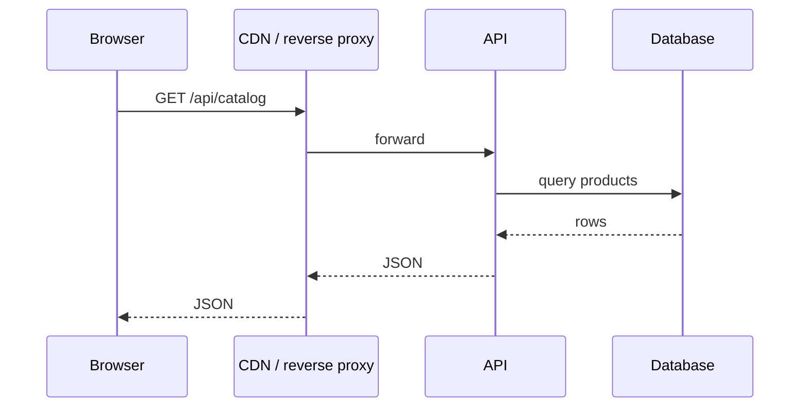
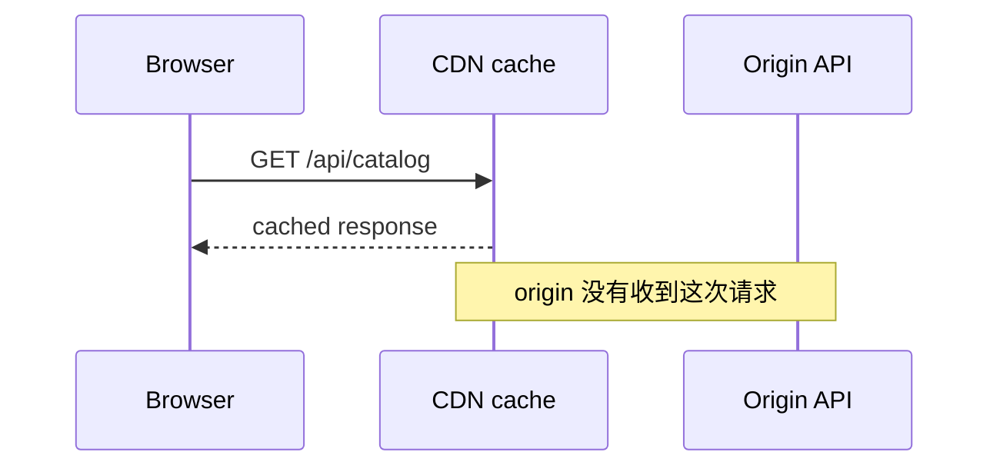
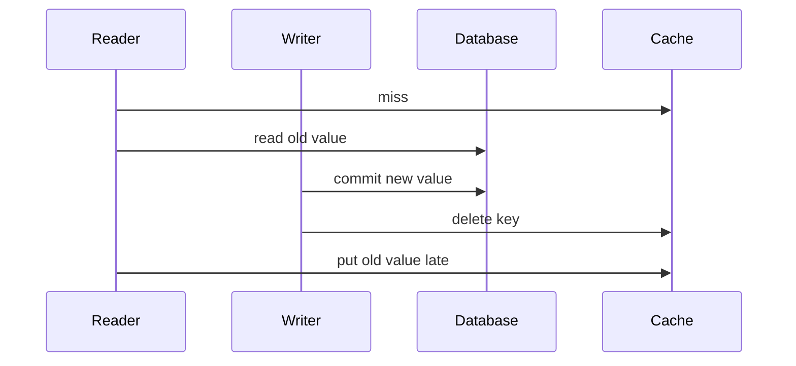

# HTTP 缓存、CDN、重新验证、缓存键与失效

假设商品目录 10 分钟没有变化，却有 10 万个用户反复打开同一页面。如果每次请求都经过公网、应用服务器和数据库，系统其实在重复回答同一个问题。

缓存做的事很朴素：**保存以前的响应，在规则允许时拿它回答后来的请求**。它省下的不只是数据库查询，还可能省下网络往返、TLS 连接、JSON 序列化和源站计算。

但缓存也引入一个根本矛盾：副本离用户越近、保存越久，访问通常越快；源数据变化后，副本也越可能暂时是旧的。因此缓存不是“打开后性能自动变好”的开关，而是一份关于以下问题的合同：

- 哪些响应可以保存？
- 谁可以保存，是当前用户的浏览器，还是所有用户共享的 CDN？
- 可以直接复用多久？
- 过期后如何确认它有没有变化？
- 哪些请求必须形成不同副本？
- 数据变化后，最多允许用户看到多久旧数据？

> 本课规范基准是 RFC 9110 与 RFC 9111。这里实现的是 HTTP 缓存合同，不会把某家 CDN 的 purge API 当成 HTTP 标准。

## 1. 先看没有缓存时，系统重复做了什么



同一个目录请求重复 1000 次，若没有可复用响应，这条链就走 1000 次。数据库即使很快，网络和排队也仍有成本。

有新鲜缓存时：



这叫 cache hit。若没有合适副本，缓存把请求转发到源站，叫 miss。这里的 **origin（源站）** 是响应的权威服务器；CDN、反向代理和浏览器保存的只是副本。

## 2. HTTP 缓存与应用缓存不是一回事

“缓存”这个词常把不同层混在一起：

| 层 | 通常缓存什么 | 谁决定如何复用 |
| --- | --- | --- |
| 浏览器 HTTP cache | 完整 HTTP response | HTTP method、headers 与浏览器实现 |
| CDN / reverse proxy | 多用户可共享的 HTTP response | HTTP 合同、CDN 配置与缓存键 |
| 应用进程 cache | 函数结果、对象、查询结果 | 应用代码 |
| Redis 等共享 cache | 序列化对象、session、计算结果 | 应用代码和数据结构 |
| database buffer pool | table/index pages | 数据库引擎 |

本课聚焦前两层。它们理解 `Cache-Control`、`ETag`、`Vary`、`Age` 等 HTTP 字段。应用内 `Map` 或 Redis 不会因为响应里有 `Cache-Control` 就自动删除 key。

这一区别很重要：CDN 命中时请求根本到不了 FastAPI/Spring Boot；Redis 命中仍然需要请求进入应用，由应用查 Redis、反序列化并组装响应。

## 3. private cache 与 shared cache

RFC 9111 区分两类参与者：

- **private cache**：只服务一个用户，典型是浏览器缓存；
- **shared cache**：复用响应给多个用户，典型是 CDN、反向代理或企业代理。

“private”描述缓存的共享范围，不等于数据已经加密，也不等于响应一定含隐私。

例如公开商品目录可以让 CDN 保存：

```http
Cache-Control: public, max-age=10, s-maxage=60
```

用户个人资料只能由私有缓存保存：

```http
Cache-Control: private, no-cache
```

支付密钥一类敏感响应通常不应存储：

```http
Cache-Control: no-store
```

如果把 Alice 的个人资料错误标成 `public`，共享缓存可能把它发给 Bob。这不是“偶尔旧一点”，而是数据泄漏。

## 4. 存储、直接复用与重新验证是三个动作

学习 `Cache-Control` 最容易犯的错，是把“能保存”和“能直接用”混为一谈。

1. **store**：把响应存入缓存；
2. **reuse**：不联系源站，直接用副本回答；
3. **validate**：询问源站，已有副本是否仍有效。

因此：

- `no-store`：不要存；
- `no-cache`：可以存，但每次复用前必须成功验证；
- `max-age=60`：在规定条件下，生成后的 60 秒内可以直接复用；
- `must-revalidate`：一旦过期，不能随意用旧副本，必须成功验证后再用。

`no-cache` 这个名字很反直觉。把它理解成“no unvalidated reuse（不能未经验证就复用）”更接近真实语义。

## 5. fresh 与 stale 只描述时间状态

缓存记录响应已经存在多久，即 **current age**；源站给出允许直接复用的时间，即 **freshness lifetime**。

RFC 9111 的核心判断可以写成：

```text
freshness_lifetime > current_age  => fresh
freshness_lifetime <= current_age => stale
```

- **fresh**：仍在新鲜期，通常不联系源站就能复用；
- **stale**：新鲜期已经结束，不代表内容必然变化，只代表不能再假设它没变。

例如：

```http
Cache-Control: max-age=60
Age: 12
```

这个副本大约已经 12 秒，仍有约 48 秒新鲜期。`Age` 是缓存估计的响应年龄，不是服务器处理耗时，也不是文件最后修改时间。

### `max-age`、`s-maxage` 与 `Expires`

```http
Cache-Control: public, max-age=10, s-maxage=60
```

- 浏览器等 private cache 使用 `max-age=10`；
- CDN 等 shared cache 优先使用 `s-maxage=60`；
- `Expires` 是绝对 HTTP 日期；现代接口通常更适合使用相对秒数的 `max-age`；
- 明确的新鲜度优先于缓存自己猜测的 heuristic freshness。

这份合同意味着：源数据刚变化时，浏览器副本最多可能直接使用约 10 秒，CDN 副本最多可能直接使用约 60 秒。它提高性能，也明确接受了一个旧数据窗口。

## 6. 过期不等于重新下载：validator 能省下 body

副本过期后，缓存可以带 validator 向源站提问：“我手上的版本还是当前版本吗？”

### 第一次请求

```http
GET /api/catalog HTTP/1.1
```

```http
HTTP/1.1 200 OK
Cache-Control: public, max-age=10
ETag: "abc123"
Content-Type: application/json

{"version":1,"products":[...]}
```

### 过期后的条件请求

```http
GET /api/catalog HTTP/1.1
If-None-Match: "abc123"
```

内容没变时：

```http
HTTP/1.1 304 Not Modified
ETag: "abc123"
Cache-Control: public, max-age=10
```

`304` 没有普通响应 body。缓存保留原来的 JSON，用 304 中的新 metadata 更新副本，再把副本用于当前请求。它仍然访问了源站，所以没有省掉一次网络往返，但省掉了 body 传输和部分生成工作。

内容已经改变时，源站返回新的 `200`、body 和 ETag，缓存替换旧副本。

## 7. ETag 是 representation validator，不只是数据库版本号

**representation（表示）** 是某个 resource 在内容协商后真正发送的字节与 metadata。同一个商品资源可能有中文 JSON、英文 JSON、压缩版本或图片版本。

ETag 应验证所选表示。示例把稳定排序、无多余空白的 JSON 做 SHA-256：

<<< ../../../examples/python/backend-http-cache/cache_api/app.py{61-69}

因果链是：

```text
业务状态
→ 确定字段、语言和序列化方式
→ representation bytes
→ hash
→ ETag
```

若 body 变化而 ETag 不变，缓存可能错误返回 304；若 body 没变但 ETag 每次随机变化，重新验证永远得到 200，validator 失去价值。

### strong 与 weak ETag

- strong ETag，例如 `"abc"`，要求表示字节层面可视为相同，可用于 range 等需要强比较的场景；
- weak ETag，例如 `W/"abc"`，表示语义等价，但字节可能不同。

不要随手去掉引号，也不要把 weak/strong 当普通字符串互换。生产实现还要确保不同实例对同一表示生成一致 validator。

`Last-Modified` + `If-Modified-Since` 也能验证，但时间精度较粗，多个变更可能发生在同一秒，时钟和生成时间也更容易带来边界问题。能稳定生成 ETag 时通常优先 ETag；两者可以同时存在。

## 8. `If-None-Match` 与 `If-Match` 解决不同问题

上一课用 `If-Match` 防止写入覆盖别人的新版本：

```text
PATCH + If-Match: 只有当前版本仍匹配才修改；否则 412
```

本课用 `If-None-Match` 避免重复下载未变化表示：

```text
GET + If-None-Match: 如果当前版本并不不同，则返回 304
```

它们都使用 ETag，但方向和目的不同：一个保护 mutation 的前置条件，一个帮助读取缓存重新验证。

## 9. `Vary` 告诉缓存：同一 URL 还要看哪些请求字段

考虑同一个 URL：

```http
GET /api/greeting
Accept-Language: zh-CN
```

```http
GET /api/greeting
Accept-Language: en
```

若响应随语言变化，只用 URI 当 cache key，英语用户可能收到中文副本。源站必须在所有对应响应上发送：

```http
Vary: Accept-Language
```

缓存随后比较 URI、method 和 `Vary` 指定的请求字段，选择匹配副本。可以把它近似理解成：

```text
cache key = method + target URI + nominated request headers
```

这是帮助理解的简化式；具体 cache key 还可能受实现与 CDN 配置影响。

示例先选语言，再对最终表示生成 ETag：

<<< ../../../examples/python/backend-http-cache/cache_api/app.py{126-143}

关键边界：

- response 会因某个 request header 改变，就评估是否需要把它加入 `Vary`；
- `Vary` 要在该资源的不同结果上一致发送，不能只在中文响应上发送；
- `Vary: *` 表示任何请求信息都可能影响结果，缓存不能在没有重新验证的情况下复用；
- 不要无脑 `Vary` 大量高基数字段，否则副本被切得过碎，命中率下降；
- CDN 自定义 cache key 必须与源站表示选择逻辑一致。

## 10. 登录响应为什么要特别谨慎

示例个人资料合同是：

<<< ../../../examples/python/backend-http-cache/cache_api/app.py{145-158}

```http
Cache-Control: private, no-cache
Vary: Authorization
```

含义是：共享缓存不能保存；私有缓存即使保存，每次复用前也要重新验证；身份不同不能选择同一变体。

RFC 9111 对携带 `Authorization` 的请求还有限制：shared cache 通常不能存储其响应，除非响应用 `public`、`s-maxage` 等明确允许。不要仅依赖框架“看见登录态后应该懂”的猜测，应给出清楚合同。

另一个常见误解是“有 `Set-Cookie` 就绝对不会缓存”。`Set-Cookie` 本身并不是完整的缓存禁止指令。若响应含用户数据，仍要明确设置 `private` 或 `no-store`，并审计共享缓存配置。

## 11. 常用 Cache-Control 指令不要背成同义词

| 指令 | 通俗含义 | 关键边界 |
| --- | --- | --- |
| `max-age=60` | 生成后 60 秒内可直接复用 | private/shared 都适用，除非被更专门规则覆盖 |
| `s-maxage=300` | shared cache 可新鲜 300 秒 | shared cache 优先于 `max-age` |
| `private` | 只允许 private cache 存 | 不是加密，也不是 no-store |
| `public` | 明确允许 shared cache 存 | 不能错误用于用户专属响应 |
| `no-cache` | 复用前必须验证 | 仍可以存储 |
| `no-store` | 不应存储 request/response | 已经存在的旧副本还需通过部署策略处理 |
| `must-revalidate` | stale 后必须成功验证 | 不等于从一开始每次验证 |
| `immutable` | 新鲜期内内容不会改变 | 通常配合内容哈希 URL 和长 `max-age` |

`max-age=0` 通常令响应立即 stale，后续正常需要验证；它与“绝不落盘/内存保存”的 `no-store` 不是一回事。

## 12. 静态资源用“换 URL”解决失效

JavaScript bundle 若 URL 固定为 `/assets/app.js`，给它缓存一年后，发布新版也可能继续看到旧文件。

构建工具通常把内容 hash 放进文件名：

```text
/assets/app.4f3a2c.js
```

内容变化 → hash 变化 → URL 变化。旧 URL 的内容永远不改，于是可以发送：

```http
Cache-Control: public, max-age=31536000, immutable
```

HTML 本身使用较短新鲜期或每次验证；新 HTML 引用新 hash URL。这叫 cache busting，但本质不是“清掉所有缓存”，而是让新内容拥有新 identity。

<<< ../../../examples/python/backend-http-cache/cache_api/app.py{168-174}

不要给会原地更新的 URL 同时设置一年新鲜期和 `immutable`。

## 13. CDN 是共享 HTTP cache，也是独立运行系统

典型路径：

```text
browser private cache
→ CDN edge shared cache
→ origin reverse proxy
→ application
→ database
```

每一层都可能 hit、miss、validate 或拒绝存储。浏览器看到的 `Age`、厂商命中 header 或 RFC 9211 `Cache-Status` 能帮助定位是谁回答了请求。

但 CDN 不只是 RFC 规则的机械实现。工程中还要配置：

- 哪些 host/path/method 进入缓存；
- query 参数是否参与 key、顺序是否规范化；
- 是否尊重源站 `Cache-Control`；
- cookie/authorization 如何处理；
- object size、TTL 上下限与 eviction；
- purge API、预热、origin shield 与 request collapsing；
- 多地区传播时间和观测字段。

这些行为会因供应商与配置变化。上线前必须用实际响应验证，不能只看应用代码认为“应该命中”。

## 14. stale-while-revalidate：先给旧副本，后台更新

RFC 5861 定义：

```http
Cache-Control: max-age=60, stale-while-revalidate=30
```

因果链：

1. 前 60 秒副本 fresh，直接返回；
2. 随后最多 30 秒内，缓存可以立即返回 stale 副本；
3. 同时在后台向源站验证；
4. 验证完成后，后来请求得到更新副本；
5. 超过允许窗口后，不能只靠此指令继续返回旧副本。

它隐藏了验证延迟，但明确扩大了旧数据窗口。不能用于余额、权限撤销等无法容忍旧值的判断。

`stale-if-error=300` 则允许发生网络/服务器错误时，在窗口内用 stale 副本换取可用性。用户可能看到旧商品描述而不是错误页，这可能合理；若旧数据会导致错误授权或错误支付，则不合理。

## 15. 修改数据后，哪些缓存会自动失效

RFC 9111 要求：缓存看到成功的 unsafe request（如 POST、PUT、PATCH、DELETE）经过时，会使 target URI 的已存响应失效；同源 `Location`/`Content-Location` 还可能成为候选。

但这不等于“相关数据全球自动刷新”。例如：

```http
PATCH /api/catalog/products/p-100
```

它的 target URI 不是 `/api/catalog`。缓存不知道商品详情变化会影响目录、搜索、推荐和统计等哪些 URI。更何况 mutation 可能绕过某个 edge cache，其他地区已有副本也看不到这次请求。

工程上通常组合：

- **短 TTL**：最简单，把最坏旧数据时间限制在 TTL 附近；
- **重新验证**：过期后用 ETag 降低传输成本；
- **版本化 URL**：最适合不可变静态资源；
- **CDN purge/ban**：主动清理已知 URI，接受供应商接口和传播延迟；
- **surrogate key/tag**：给多个响应打业务标签后批量清除，通常是厂商能力；
- **事件驱动 invalidation**：数据提交后发事件，消费者清相关 key，需要处理丢失、重复与乱序；
- **不缓存关键读取**：一致性要求高时，性能优化不能凌驾于正确性。

缓存失效不是一个 API 调用，而是对“变化如何传播到所有副本”的设计。

## 16. 更新数据库与清缓存为什么会出现竞态

进入 Redis/cache-aside 后，经典流程是：

```text
read: cache miss → query DB → put cache
write: update DB → delete cache
```

它看起来简单，但并发下可能发生：



最终 cache 反而留下旧值。这是应用数据缓存的一致性问题，不靠 HTTP `no-cache` 自动修好。后续课程会专门讨论 cache-aside、TTL、version token、single-flight、消息失效和 stampede。

此处先记住边界：HTTP 缓存与 Redis 都保存副本，但控制协议、失败窗口和修复手段不同。

## 17. 示例 API 如何让规则可观察

完整示例：

<<< ../../../examples/python/backend-http-cache/cache_api/app.py

它提供五类合同：

| Endpoint | 目的 |
| --- | --- |
| `GET /api/catalog` | private/shared 使用不同 TTL，支持 ETag 验证与 stale 扩展 |
| `PATCH /api/catalog/products/{id}` | 改变表示，使旧 ETag 下一次得到 200 |
| `GET /api/greeting` | 用 `Vary: Accept-Language` 分离中英文表示 |
| `GET /api/me` | 用户数据只允许 private cache，并要求验证 |
| `GET /api/payment-secret` | 敏感一次性数据 `no-store` |
| `GET /assets/app.4f3a2c.js` | 内容寻址静态文件长期 immutable |

`conditional_json()` 的执行过程很短，但每一步都有协议意义：

<<< ../../../examples/python/backend-http-cache/cache_api/app.py{81-93}

1. 先根据当前业务状态生成最终 representation；
2. 根据 representation 生成 ETag；
3. 当前 ETag 与 `If-None-Match` 匹配时返回 304；
4. 304 仍携带 ETag、Cache-Control 和需要的 Vary metadata；
5. 不匹配时返回 200 与完整 body。

教学示例只比较单个 ETag。完整 RFC 语法允许 `If-None-Match` 列表和 `*`，生产代码应使用框架/服务器成熟实现或完整解析，不能用简单字符串比较冒充完全合规。

## 18. 测试要验证合同，不要假装 TestClient 是 CDN

<<< ../../../examples/python/backend-http-cache/tests/test_cache.py

测试验证：

- public/private 与 shared TTL 的 headers；
- 匹配 ETag 得到 bodyless 304，且保留缓存 metadata；
- mutation 后 ETag 改变，旧 validator 得到新 200；
- 中英文表示有 `Vary` 且 ETag 不同；
- 个人资料不会进入 shared cache；
- 敏感响应 `no-store`；
- 内容 hash 静态资源允许长期缓存。

FastAPI `TestClient` 每次仍会调用应用，它不会在内存里模拟浏览器/CDN 的 freshness hit。因此这里能验证 origin 合同和条件请求，不能证明真实 CDN 已缓存。集成环境还要发连续请求，查看 `Age`/`Cache-Status`/厂商字段和源站访问日志。

## 19. 运行与手动观察

<<< ../../../examples/python/backend-http-cache/pyproject.toml

```bash
cd examples/python/backend-http-cache
python3 -m venv .venv
source .venv/bin/activate
python -m pip install -e '.[test]'
python -m pytest
uvicorn cache_api.app:create_app --factory --reload
```

第一次获取并记住 ETag：

```bash
curl -i http://127.0.0.1:8000/api/catalog
```

把真实 ETag 放进条件请求：

```bash
curl -i \
  -H 'If-None-Match: "复制第一次响应中的值"' \
  http://127.0.0.1:8000/api/catalog
```

得到 304 说明源站重新验证逻辑工作；它不代表 curl 自己像浏览器一样完成了新鲜度缓存。

## 20. Vue / JavaScript 开发者最容易混淆的四层

### 浏览器 HTTP cache

由浏览器依据 HTTP 合同管理。普通 `fetch()` 可能直接命中，也可能由浏览器发条件请求；开发者不应把响应 body 自己塞进 `localStorage` 来模拟完整 HTTP cache。

### Service Worker Cache API

它是脚本控制的 request/response storage。写入后是否过期、何时删除通常由你的 service worker 策略决定；它不会自动等价执行所有 HTTP cache freshness 规则。

### Vue Query / Pinia 中的 server state

这是页面运行时的数据副本，`staleTime`、refetch、失效是库/应用语义。它与响应 `Cache-Control: max-age` 可以配合，但不是同一个时钟，也不会自动让 CDN purge。

### CDN cache

位于用户与源站之间，浏览器 JavaScript 通常无法直接控制。它可能服务多个用户，cache key 和 privacy 错误的影响最大。

一个请求可能同时经过这四层。排查“为什么还是旧数据”时，先确认旧副本来自哪一层，再谈失效。

## 21. 常见失败及因果关系

### API 默认全设 `no-store`

结果是最安全但完全放弃复用，公共目录也反复压到源站。应按数据性质分类，不要用一个全局 header 代替设计。

### 用户数据误设 `public`

shared cache 保存 Alice 响应 → Bob 的请求命中同一 key → 隐私泄漏。修复不仅是改 TTL，还要检查 `private/no-store`、identity variance、CDN key 和已存对象清理。

### 响应随语言变化却没有 `Vary`

第一个请求填入中文副本 → 后续英文请求选择同一 URI 副本 → 返回错误语言。

### URL 不变却设置 `immutable`

发布新 JS 仍使用旧 URL → 新鲜期内 client 相信内容永远不变 → 用户长期运行旧代码。应使用内容 hash URL。

### 只删除详情缓存，不删除派生列表

商品更新 → `/products/p-100` 被清理 → `/catalog`、`/search`、`/recommendations` 仍有旧副本。需要依赖关系、tag 或可接受的 TTL 边界。

### 把 304 当“没有响应”

304 是对已有副本的指示，脱离原缓存 body 没法构成完整表示。API client 若自己管理 ETag，也必须保留与该 ETag 对应的 body。

## 22. 缓存策略从业务容忍度倒推

不要先问“TTL 一般设多少”，先问：

1. 数据改变后，用户最多能接受多久旧值？
2. 旧值只影响文案，还是会影响权限、库存、金额和决策？
3. 源站失败时，旧值是否比错误更好？
4. 响应是否包含用户/租户数据？
5. 表示由哪些 headers、query、cookie 或身份决定？
6. 数据变化时，能否枚举所有受影响 URI？
7. purge 失败或延迟时，TTL 能否作为最终修复边界？

示例策略可以是：

```text
内容 hash 静态文件: 1 year + immutable
公共商品目录: browser 10s, CDN 60s, validate with ETag
用户资料: private + validate every reuse
一次性支付密钥: no-store
权限判定: 不依赖可能 stale 的公开响应
```

这些数字只是示例，不是行业默认值。真正 TTL 来自产品一致性要求、更新频率、流量、源站容量和故障策略。

## 23. 观测与上线检查

只测“第二次变快了”不够。至少观察：

- hit、miss、revalidated、stale、bypass 的数量与比例；
- `Age`、剩余 TTL 和分层 `Cache-Status`；
- cache key 的组成，但日志中隐藏 token/cookie；
- origin request rate、latency 与 bandwidth 是否下降；
- purge 成功率、传播时延和积压；
- object eviction、容量与热点；
- 304 比例和重新生成 200 比例；
- 按 status/content-type/tenant 分类，避免总体 hit ratio 掩盖问题；
- 源站错误时 stale 是否按合同被使用。

开发者工具的 “Disable cache” 会改变行为；强制刷新、普通刷新、地址栏导航和程序化 fetch 也可能生成不同 request directives。记录完整 request/response headers 再判断。

## 24. 工程检查清单

- 明确这是 browser、CDN、应用还是 Redis cache；
- response 是否允许存储，private/shared 边界是否正确；
- freshness lifetime 与业务最大旧数据窗口一致；
- `no-cache`、`no-store`、`private` 没有混用概念；
- ETag 对最终 representation 稳定，变化时必然改变；
- 304 无普通 body，并返回更新副本需要的 metadata；
- representation 受 request headers 影响时正确使用 `Vary`；
- 用户/租户/cookie/authorization 不会混入共享副本；
- 内容寻址资源才使用长 TTL + `immutable`；
- mutation 对所有派生 URI 的失效边界明确；
- stale-while-revalidate/stale-if-error 的旧数据风险可接受；
- CDN 自定义 key、TTL、bypass、purge 经过真实环境验证；
- 观测能区分每一层 hit/miss/revalidation；
- 安全响应没有依赖“框架大概不会缓存”的隐含假设。

## 25. 本课结论

- HTTP cache 保存过去的完整响应；命中能让请求不进入源站。
- fresh 表示可以在新鲜期内直接复用；stale 只表示不能继续假设未变化。
- `no-store` 禁止存储，`no-cache` 允许存但复用前必须验证，两者不同。
- ETag + `If-None-Match` 让过期副本用 304 验证，省 body 但不一定省网络往返。
- `Vary` 是表示选择合同的一部分；缺失会把语言、编码甚至身份变体混用。
- CDN 是 shared cache，性能收益大，privacy 和 cache-key 错误的影响也大。
- 失效的本质是让源数据变化传播到所有副本；HTTP 不会自动理解业务依赖图。
- TTL 是一致性边界，不只是性能参数；先决定能容忍多旧，再决定缓存多久。

下一节建议：应用数据缓存与 Redis——cache-aside 的读取/写入因果链、TTL、序列化、穿透、击穿、雪崩、热点 key、single-flight 与一致性竞态。

## 26. 参考资料

- [RFC 9110：HTTP Semantics](https://www.rfc-editor.org/rfc/rfc9110.html)
- [RFC 9111：HTTP Caching](https://www.rfc-editor.org/rfc/rfc9111.html)
- [RFC 5861：stale-while-revalidate 与 stale-if-error](https://www.rfc-editor.org/rfc/rfc5861.html)
- [RFC 8246：immutable Cache-Control Extension](https://www.rfc-editor.org/rfc/rfc8246.html)
- [RFC 9211：Cache-Status](https://www.rfc-editor.org/rfc/rfc9211.html)
- [RFC 9205：Building Protocols with HTTP](https://www.rfc-editor.org/rfc/rfc9205.html)
- [FastAPI：Response Headers](https://fastapi.tiangolo.com/advanced/response-headers/)
