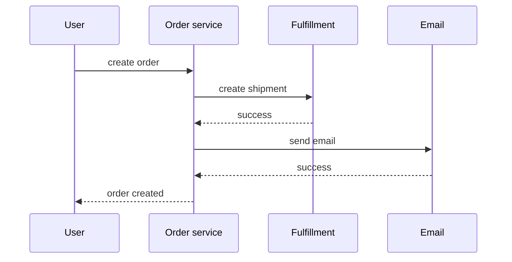
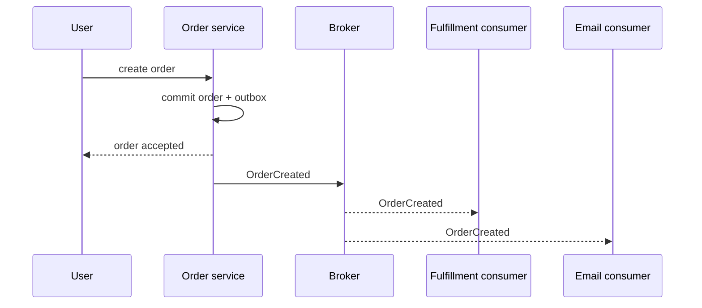
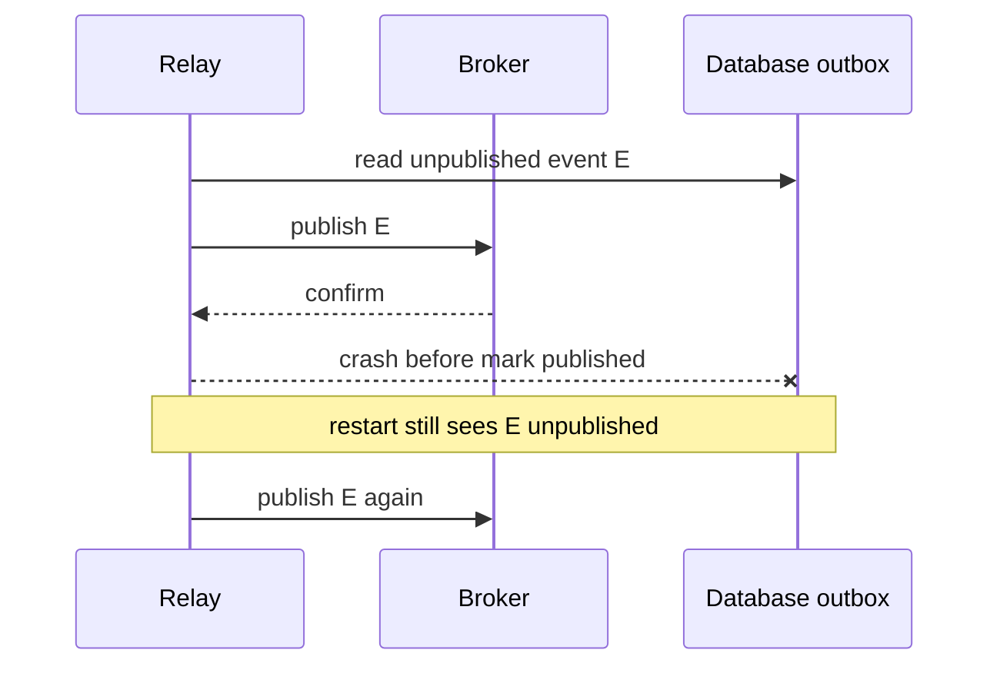

# 消息与事件驱动：broker、确认、重投、幂等消费与 Outbox

下单成功后，系统可能要扣库存、发优惠券、生成物流单、发送邮件并更新分析报表。最直观的实现是在一个 HTTP 请求中依次调用所有服务。

问题是这些调用共享了同一个等待窗口：邮件服务慢，用户下单也慢；分析服务宕机，订单可能一起失败；调用方还必须知道所有后续消费者。系统功能越多，这条同步链越长。

消息系统把“现在必须得到对方回答”改成“先可靠记录一件待处理的事，由接收者按自己的速度处理”。它能解除时间耦合、吸收流量尖峰和增加订阅者，但没有让失败消失。失败变成了积压、重复、乱序、重投和最终一致性。

本课不从 Kafka/RabbitMQ 配置项开始，而是先回答：一条消息在 producer、broker、consumer 和数据库之间如何移动，哪一步失败会留下什么状态。

> 规范与产品基准：RabbitMQ 官方 reliability/acknowledgement 文档、Apache Kafka 4.3 文档与 CloudEvents 1.0.2 规范。教学模型使用 Python 3.11+，不冒充任何具体 broker 的完整实现。

## 1. 同步与异步改变的是依赖时间

同步调用：



调用者必须等待并处理每个依赖的当场结果。异步事件：



用户不再等待物流和邮件，但“下单接口成功”现在只证明订单服务完成了自己的承诺，不证明邮件已经送达。API 必须明确是 completed、accepted 还是 pending，不能用异步掩盖未知状态。

## 2. message、command 与 event 的边界

**message** 是通过 channel 传递的 envelope，是传输总称。

**command** 表达请求某个接收者执行动作：

```text
ReserveInventory
SendOrderEmail
```

它通常有目标、可能被拒绝，不表示动作已经发生。

**event** 表达 producer 已经确认发生的事实：

```text
OrderCreated
InventoryReservationFailed
```

event 用过去式；consumer 不能让既成事实“回滚”。它只能忽略、记录失败或产生新的补偿事实。

“订单已创建”如果其实只是希望订单服务创建订单，就是把 command 假装成 event，会让失败语义混乱。反过来，把所有 event 写成 `DoSomething` 会把 producer 与单一消费者耦合。

## 3. broker 的角色

broker 接受 producer publish，按 routing/subscription 保存并交付给 consumer。它通常负责部分或全部：

- durable storage/replication；
- queue/topic/partition；
- routing 与 subscription；
- delivery、ack、redelivery；
- retention/offset；
- flow control/prefetch；
- dead-lettering 与观测。

producer 把 bytes 写到 socket，不等于 broker 已经承担责任；broker ack/confirm 也不等于 consumer 业务成功。RabbitMQ 官方明确区分 publisher confirm 与 consumer acknowledgement，两者互相不知道对方。

```text
producer --publish/confirm--> broker --delivery/ack--> consumer
```

## 4. queue、topic 与 consumer group

传统 queue 常表示一组竞争消费者共同处理工作：同一消息交给其中一个 worker。

topic/pub-sub 表示多个逻辑订阅者各自收到事件，例如 fulfillment、email、analytics 都需要 OrderCreated。

Kafka 用 consumer group 统一这两种视角：

- 同一 group 内，partition 分配给一个 consumer instance，组内分摊工作；
- 不同 group 是不同逻辑订阅者，各自维护 offset，都能读取同一 record；
- consumer instance 多于 partition 时，多出来的实例不能增加该 topic 的有效并行度。

示例给每个 `(topic, group)` 一个独立 queue：

<<< ../../../examples/python/backend-event-driven/event_learning/model.py{101-146}

它只表达“每个逻辑 group 有一份”；不模拟 Kafka log retention/offset，也不模拟 RabbitMQ exchange/binding。

## 5. event envelope 是跨团队合同

示例 event：

<<< ../../../examples/python/backend-event-driven/event_learning/model.py{12-19}

```json
{
  "event_id": "c8...",
  "event_type": "com.example.order.created.v1",
  "source": "/services/orders",
  "subject": "orders/o-100",
  "occurred_at": "2026-07-16T...Z",
  "data": {
    "order_id": "o-100",
    "customer_id": "c-1",
    "total": "59.90"
  }
}
```

- `event_id` 标识这一个逻辑事件，重投时保持不变，供 dedup；
- `event_type` 决定 schema/处理逻辑，版本边界要稳定；
- `source + event_id` 可形成全局唯一上下文；
- `subject` 指向被影响对象，也常作为 partition key；
- `occurred_at` 是业务事实发生时间，不是 consumer 收到时间；
- `data` 是 consumer 所需的稳定事实，不应直接暴露内部 ORM row。

CloudEvents 提供标准 envelope 属性和 JSON 格式，可减少自创字段，但仍需自己定义 event type、data schema、兼容性和业务语义。

## 6. event notification 与 event-carried state transfer

notification 只告诉 consumer “订单变了”，consumer 再同步查询 producer：

```json
{"order_id":"o-100"}
```

优点是消息小、producer 不重复数据；缺点是 consumer 又依赖 producer 可用性，而且稍后查询可能读到事件之后的新状态，无法重建当时事实。

event-carried state transfer 携带 consumer 所需字段。consumer 可以独立更新 projection，但 schema、隐私、消息大小和复制数据更多。

选择依据是业务语义，不是“event 必须越小越好”。不要把信用卡、token 等敏感字段广播到所有订阅者；topic ACL、加密、retention 和日志脱敏都要设计。

## 7. delivery guarantee 要拆成每一段

常见术语：

- **at-most-once**：可能丢，不重复；
- **at-least-once**：不轻易丢，但可能重复；
- **exactly-once**：在明确边界内，最终业务效果像一次。

“broker 支持 exactly-once”不能自动覆盖 consumer 写任意外部数据库、发邮件或调用支付接口。必须问：producer 到 broker？broker log？offset 与某个 state store？还是端到端业务副作用？

网络 timeout 会造成 unknown outcome：broker 可能已保存消息，但 confirm 丢了。producer 为避免丢失会重发，于是重复是 at-least-once 的正常情况，不是 broker 偶发 bug。

## 8. publisher confirm 只确认 broker 接管

以 RabbitMQ 为例，publisher confirm 表示 broker 对 publish 承担了规定范围的责任；对于 persistent message/durable 或 quorum queue，具体确认点取决于 queue 类型与持久化/复制。

confirm 没回来时 producer 不知道消息未到还是确认丢失，安全重发要求 event id 稳定。confirm 到达也不表示 fulfillment 已创建物流单。

Kafka producer 的 `acks`、idempotent producer 与 transaction 也有清晰产品边界。配置必须结合目标 Kafka 版本核对，不能把 client 默认值当架构合同。

## 9. consumer ack 必须在副作用成功之后

consumer 收到消息后：

```text
deserialize/validate
→ authorize schema/source
→ execute DB transaction
→ commit business effect + inbox marker
→ ack broker
```

若先 ack 再写数据库，ack 后进程崩溃，broker 已删除/推进消息，副作用永久丢失。

若先 commit 再 ack，commit 后进程崩溃，broker 会重投；这会重复，但可以通过幂等消费修复。这就是可靠消费通常选择 at-least-once + idempotency 的原因。

示例只在 projection 成功后 ack：

<<< ../../../examples/python/backend-event-driven/event_learning/model.py{181-201}

临时失败会 nack/requeue。真实 client 还要限制 prefetch/in-flight，避免一个 consumer 拿走大量消息却处理不过来。

## 10. 重试必须区分 transient 与 permanent

可能适合重试：数据库连接瞬断、下游 503、短期限流。

不应无限重试：schema 不支持、必填字段缺失、订单状态不允许、权限永久失败。

同一 poison message 立即 requeue 会形成高速死循环，消耗 CPU 并阻塞后续消息。应组合：

- 有上限 attempts；
- exponential backoff + jitter；
- retry topic/延迟 queue，而非立即热循环；
- 记录 first/last failure、error category；
- 到上限进入 dead-letter storage；
- 告警和人工/自动 remediation；
- 修复后可控 replay，仍保持原 event id。

死信队列不是垃圾桶。没人观察、没有保留期和 replay 工具的 DLQ 只是更安静的数据丢失。

## 11. 幂等消费让重复不等于重复副作用

最直接 inbox pattern：在 consumer 的业务数据库保存已处理 event id，并让 inbox insert 与业务修改处于同一 transaction。

```text
BEGIN
INSERT inbox(event_id)  -- unique
INSERT shipment(...)
COMMIT
ACK
```

重复 event 的 unique conflict 表示已经处理，consumer 可以安全 ack。示例用一个 Lock 模拟同一数据库 transaction：

<<< ../../../examples/python/backend-event-driven/event_learning/model.py{162-178}

幂等 key 通常是稳定 `event_id`，不能用 delivery tag/offset 代替跨重投 identity。inbox 要规划 retention；过早删除后，历史 replay 会再次产生副作用。

有些操作天然幂等，如“把订单状态设置为 SHIPPED 且 revision 条件正确”；“余额减 10”“发送一封邮件”并不天然幂等，需要 operation id、unique constraint 或下游幂等合同。

## 12. 为什么直接“写数据库，然后 publish”不可靠

```text
方案 A: commit DB → publish
```

commit 后进程崩溃，订单存在但事件没发。

```text
方案 B: publish → commit DB
```

publish 后 DB rollback，consumer 却看到一个不存在的订单事实。

数据库和 broker 是两个独立系统，两个操作之间总有 crash window。catch exception 再补发不能覆盖进程断电、机器故障与长时间网络分区。

## 13. transactional outbox 把业务状态和待发送事实一起提交

在同一个本地数据库 transaction 中：

```text
INSERT order
INSERT outbox(event_id, type, payload, published=false)
COMMIT
```

两者一起成功或一起失败。独立 relay 轮询 outbox 或读取 transaction log，把事件 publish 到 broker。

示例数据库：

<<< ../../../examples/python/backend-event-driven/event_learning/model.py{34-68}

这样解决了“订单 commit 但没有任何待发布记录”。它没有让 DB 与 broker 原子化：relay 可能 publish 成功后、标记 published 前崩溃。

## 14. outbox 为什么仍然会重复发布



示例故意制造这个 crash：

<<< ../../../examples/python/backend-event-driven/event_learning/model.py{149-159}

两次消息使用相同 event id，consumer inbox 将第二次识别为重复。因此 outbox 与幂等 consumer 是配套方案，不是二选一。

生产 relay 还需处理并发 claim、batch、锁超时、发布确认、顺序、退避、stuck row、清理与监控。CDC/log tailing 可以替代 polling publisher，但仍有 checkpoint、重复和运维边界。

## 15. 顺序只在明确范围内成立

“broker 保证顺序”必须补全范围：

- Kafka 通常保证一个 partition 内 record 顺序，不保证跨 partition 全局顺序；
- key 决定 partition 时，同一 aggregate 可保持局部顺序；
- consumer 并行处理、失败重试和外部副作用仍可能改变完成顺序；
- 增加 partition 提高并行度，也缩小能自然有序的范围；
- RabbitMQ 多 consumer、requeue 同样可能观察不同完成顺序。

不要依赖 wall-clock timestamp 比较严格因果顺序；机器时钟会偏移。aggregate revision/sequence 更适合检测：

```text
received revision 7, current projection revision 5
→ revision 6 缺失，等待/补查/重建，而非直接应用 7
```

全局单 partition 能获得更强顺序，但吞吐、可用性和并行度代价很大，通常只需 per-order/per-account 顺序。

## 16. event schema 如何演进

事件是存储后延迟消费的合同。旧消息可能在 retention、DLQ 或 replay 中停留很久，因此“所有服务已经升级”不代表旧 schema 消失。

一般兼容做法：

- 新增 optional field，consumer 给合理默认；
- 不删除/改义已有 required field；
- enum consumer 有 unknown fallback；
- event type/version 明确，例如 `.v1`；
- schema registry/CI 做 compatibility check；
- producer 同时支持迁移窗口，必要时 upcaster；
- consumer 不依赖字段顺序与未承诺内部字段。

事件名的业务语义变化应发布新 type，而不是保留名字偷偷改含义。

## 17. event-driven 不等于 event sourcing

- event-driven architecture：组件通过消息/event 协作；服务仍可把当前状态存在普通表；
- event sourcing：event log 是 aggregate 状态的权威来源，当前状态由事件重放得到；
- CDC：从数据库变更日志捕获 row changes；它们不一定是设计良好的 domain event；
- audit log：为审计记录操作，不一定能完整重建状态。

使用 Kafka 和发布 event 不会自动成为 event sourcing。后者改变持久化、版本、重放、删除隐私数据和调试方式，成本远高于增加 broker。

## 18. backpressure 与 consumer lag

broker 能吸收短期峰值，但不能消灭长期容量不足：

```text
arrival rate 1000/s, consume rate 800/s
→ backlog 每秒增加 200
```

积压让处理延迟持续增长，直到 retention/磁盘/业务时限出问题。应观察：

- publish rate 与 consume rate；
- queue depth 或 consumer lag；
- oldest message age，比单纯条数更接近用户等待；
- processing latency、failure、retry、DLQ rate；
- in-flight/prefetch 和 consumer capacity；
- partition skew/hot key；
- outbox unpublished age/count；
- broker disk、replication、under-replicated partition。

扩 consumer 前先看 partition 数、下游 DB 容量和单消息成本；无限扩消费者可能只是把数据库打垮。

## 19. 完整教学模型

<<< ../../../examples/python/backend-event-driven/event_learning/model.py

它展示：

- order 与 outbox 原子记录；
- 每个 consumer group 独立副本；
- explicit ack/nack 与有限重投；
- poison message 进入 dead-letter storage；
- relay crash 产生同 event id 重复消息；
- inbox 与 shipment side effect 原子去重。

它不模拟 broker durability、replication、publisher confirms、partition rebalance、retention 或网络 timeout。真实集成测试必须使用目标 RabbitMQ/Kafka 版本和真实 client。

## 20. 自动化测试

<<< ../../../examples/python/backend-event-driven/tests/test_messaging.py

六项测试不只验证 happy path：

- duplicate order 不会产生第二条 outbox；
- fulfillment 与 analytics group 各收一份；
- relay crash 后重复 publish 且 event id 不变；
- 重复消息只创建一次 shipment；
- commit 前临时失败会 requeue，之后成功；
- 重复临时失败达到上限进入 dead letter；永久 schema 错误不做热重试。

## 21. 运行示例

<<< ../../../examples/python/backend-event-driven/pyproject.toml

```bash
cd examples/python/backend-event-driven
python3 -m venv .venv
source .venv/bin/activate
python -m pip install -e '.[test]'
python -m pytest
```

## 22. Vue / JavaScript 对照

- DOM event/EventEmitter 通常同进程、内存内立即调用；broker message 跨进程、会持久化/重投，不能套用一次回调思维；
- Promise resolve 代表本地异步操作返回，publisher confirm 只代表 broker 接管，不代表最终 consumer 完成；
- WebSocket push 更像 transport channel，不自动提供 durable queue、consumer offset 和 replay；
- 前端收到同一 event 两次也应按 event id/revision 去重，尤其断线重连补消息时；
- optimistic UI 的“已提交”要区分 API accepted 与后端异步 workflow completed；
- TypeScript event union 要为 unknown type/version 设计隔离路径，而非错误执行默认分支。

## 23. 安全与治理

- producer/consumer 使用最小 topic/queue ACL；
- TLS、credential rotation，禁止凭据写 payload；
- schema validation、message/value 大小上限；
- event data 最小化，PII 结合 retention、删除与区域要求；
- 不信任 event 自带的 role/tenant，验证 source 与授权边界；
- trace/correlation/causation id 可观测，但不要混作幂等 id；
- DLQ 权限通常更敏感，因为集中保存失败 payload；
- replay 有审批、速率限制、目标环境和 dry-run；
- 避免 consumer 把未清洗输入拼入 SQL、URL 或日志。

## 24. 工程检查清单

- command 与 event 语气、owner 和失败语义清楚；
- API 成功明确表示 accepted 还是整个 workflow complete；
- envelope 有稳定 event id/type/source/subject/time/schema；
- routing key/partition key 对应所需顺序与负载分布；
- publisher 使用目标 durability 所需 confirm/acks；
- publish timeout 按 unknown outcome 处理并保持 event id；
- consumer 在业务 commit 后 ack；
- inbox unique marker 与副作用处于同一 transaction；
- retry 只用于 transient failure，有 backoff/jitter/上限；
- poison message 不会无限热循环；
- DLQ 有告警、owner、retention、修复与 replay 流程；
- DB + publish 使用 outbox/CDC 等可靠桥接；
- relay duplicate window 已接受，consumer 幂等；
- 顺序保证写明 partition/aggregate/consumer 范围；
- schema 对 retention 内旧消息和滚动升级兼容；
- lag/oldest age/outbox/DLQ/partition skew 可观测；
- consumer 扩容不会超过 partition 或压垮数据库；
- 敏感数据、ACL、replay 与日志经过安全审计。

## 25. 本课结论

- 消息把同步等待改成异步积压，解除时间耦合，但带来最终一致性和运维状态。
- command 请求动作，event 陈述已发生事实；message 是传输 envelope。
- publisher confirm、consumer ack 和业务完成是三件事，不能相互冒充。
- at-least-once 正常产生重复；幂等消费是业务正确性的一部分。
- ack 应在副作用 commit 后，commit 后 ack 前崩溃靠 inbox 去重恢复。
- outbox 原子保存业务数据与待发布事件，但 relay 仍可能重复 publish。
- 顺序通常只在 partition/aggregate 范围内；并行、重试会影响完成顺序。
- DLQ 不是终点，必须有观察、修复和安全 replay 流程。
- broker 只吸收短期峰值；长期生产率高于消费率必然形成不断增长的 lag。

下一节：分布式事务、Saga 与一致性——为什么跨服务 ACID 困难，2PC、local transaction、orchestration/choreography、补偿、reservation、outbox/inbox 和 read-your-writes 如何组合。

## 26. 参考资料

- [RabbitMQ：Reliability Guide](https://www.rabbitmq.com/docs/reliability)
- [RabbitMQ：Consumer Acknowledgements and Publisher Confirms](https://www.rabbitmq.com/docs/confirms)
- [RabbitMQ：Dead Letter Exchanges](https://www.rabbitmq.com/docs/dlx)
- [RabbitMQ：Consumer Prefetch](https://www.rabbitmq.com/docs/consumer-prefetch)
- [Apache Kafka 4.3：Design](https://kafka.apache.org/43/design/design/)
- [Apache Kafka 4.3：Consumer configuration](https://kafka.apache.org/43/configuration/consumer-configs/)
- [Apache Kafka 4.3：Producer configuration](https://kafka.apache.org/43/configuration/producer-configs/)
- [CloudEvents 1.0.2 Specification](https://github.com/cloudevents/spec/blob/v1.0.2/cloudevents/spec.md)
- [Transactional Outbox pattern](https://microservices.io/patterns/data/transactional-outbox.html)
