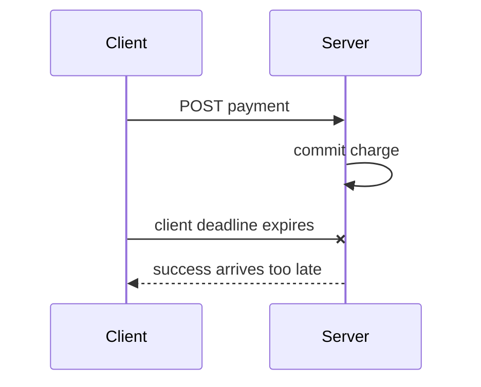
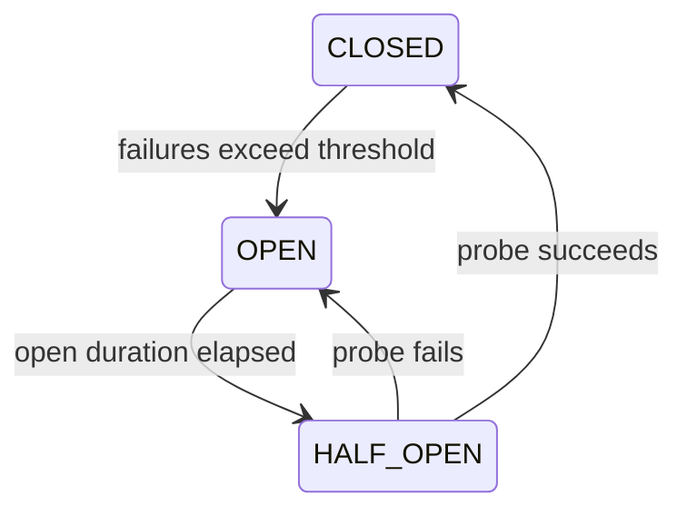

# 弹性治理：deadline、重试、熔断、隔离、限流与过载保护

分布式系统最危险的故障不总是立即报错，而是“还没失败，只是越来越慢”。一个下游变慢，请求开始排队；应用线程和连接池被占满；上游 timeout 后重试，又制造更多请求；最终原本健康的服务也被拖垮。

弹性治理不是让依赖永不失败，而是让失败有边界：最多等多久、最多试几次、最多占多少并发、过载时拒绝谁、何时停止调用已知故障的依赖，以及恢复时如何小心探测。

这些 pattern 解决的问题不同：

- timeout/deadline 限制等待时间；
- retry 重新尝试暂时失败；
- backoff/jitter 避免所有 client 同时重试；
- circuit breaker 暂停调用持续故障的依赖；
- bulkhead 限制一个依赖占用的并发资源；
- rate limit 管理一段时间内的请求配额与公平性；
- load shedding 在容量不足时主动拒绝，保护系统继续处理可承受流量。

第一次只做三件事：给整个请求预算 deadline，给每次下游调用更短 timeout，并限制同时占用的资源。Retry 会增加流量，只用于可重试且幂等的暂时失败；熔断、隔离和限流是在明确故障模式与容量之后继续加的保护层。

> 示例环境为 Python 3.11+，使用手动时钟稳定验证时间边界。协议语义依据 RFC 9110/6585 与 gRPC 官方 deadline/retry 指南；框架实现需按实际 Resilience4j、Spring、gRPC 或 proxy 版本核对。

## 1. 慢为什么会变成级联故障

假设服务有 100 个 worker，每个请求通常占 50ms：

```text
健康时：worker 很快释放
下游变慢到 5s：100 个 worker 很快全部等待
后来请求：只能排队
上游 timeout：发起 retry
retry：也进入同一个队列
```

吞吐不仅没有恢复，排队和 retry 反而增加在途工作。Little's Law 的直觉是：在相同到达率下，平均停留时间越长，系统中并发请求越多。资源总量有限时，必须限制等待和接纳。

## 2. timeout 与 deadline 的区别

**timeout** 常表示一个操作最多持续的 duration，例如“连接最多 200ms”“读取最多 800ms”。

**deadline** 是整个请求不愿再等待的时间点/总预算。调用链传播时应扣除已经消耗的时间：

```text
入口 budget 1000ms
认证消耗 100ms
Service A 处理 200ms
调用 B 时只剩约 700ms
```

如果每一层都重新给下游 1 秒，三层链可能远超用户的总等待预期。gRPC 官方建议显式 deadline，并支持把已流逝时间扣除后传播 timeout，减少 clock skew 问题。

## 3. 不是只有一个 timeout

HTTP/database client 常有不同阶段：

- DNS resolution；
- TCP connect；
- TLS handshake；
- connection-pool acquisition；
- request write；
- response headers/read；
- 整体 call/request；
- server query/statement timeout。

只设置 socket read timeout，可能仍在 pool queue 无限等待；只设置总 timeout，也可能让 connect 消耗全部预算。每个阶段应受总 deadline 约束，且总预算要包含 retry/backoff。

## 4. client timeout 不会自动撤销 server 副作用



client 停止等待，只知道自己没有拿到结果。server 可能继续运行并已经 commit。Cancellation 是尽力通知，不是 transaction rollback。

所以读取 timeout 可考虑重试；写入必须有 idempotency key/status query，沿用上一课的 unknown outcome 处理。

## 5. retry 只适合暂时且可安全重放的失败

可能 retry：连接重置、短暂 503、明确 `UNAVAILABLE`、事务 serialization conflict（通常要重跑完整 transaction）。

通常不 retry：认证失败、validation error、永久业务拒绝、资源确实不存在、`FAILED_PRECONDITION` 未被修复。

还要判断操作是否安全重放：GET 通常可以；POST 扣款只有稳定 idempotency key 才能避免重复副作用。

错误码不是唯一依据。503 后端可能已经完成写入但 response 丢失；业务合同必须说明 operation outcome。

## 6. attempt、retry 与 maxAttempts

术语经常差一：

```text
maxAttempts = 3
= initial attempt 1 + retry 2 次
```

文档和 metrics 应明确统计 attempts 还是 retries。示例 API 使用 `max_attempts`，包含第一次调用：

<<< ../../../examples/python/backend-resilience/resilience_learning/policies.py{53-104}

## 7. exponential backoff 为什么必要

立即 retry 的因果链：

```text
dependency overload
→ requests fail
→ every client retries immediately
→ load increases
→ dependency更难恢复
```

指数退避：

```text
100ms → 200ms → 400ms → 800ms（到 maxBackoff 封顶）
```

它给依赖恢复时间并降低持续压力。但所有 client 在同一时刻失败，使用相同固定序列仍会同一时刻醒来。

## 8. jitter 打散同步重试

jitter 给 backoff 加随机性，例如 full jitter 在 `[0, base]` 取值，或在 base 周围取范围。gRPC retry 官方实现对 backoff 加随机抖动。

随机不是越大越好：delay 仍受 maxBackoff 和总 deadline 限制。测试应注入确定的 jitter 函数，生产再使用可靠随机源；否则时间测试会不稳定。

## 9. 所有 attempt 共享一个 deadline

示例第一次调用 100ms，backoff 200ms，第二次开始只剩 700ms：

```text
deadline 1.0s
attempt 1: 0.1s transient failure
sleep:     0.2s
attempt 2 remaining budget: 0.7s
```

若下一次 backoff 已经会耗尽预算，立即返回 deadline exceeded，不再启动一个注定来不及完成的 attempt。

这也是为什么 timeout 不能简单乘以 attempts 后超过入口 SLA。

## 10. retry amplification

若请求经过三层，每层在失败时最多尝试 3 次：

```text
Gateway attempts 3
× Service A attempts 3
× Service B attempts 3
= leaf 最坏 27 次
```

<<< ../../../examples/python/backend-resilience/resilience_learning/policies.py{191-194}

再加 client SDK、service mesh、load balancer 的隐式 retry，放大会更严重。通常在最了解 idempotency/error 的一层重试，其他层限制透明 retry；用 retry budget/throttling 控制失败期新增流量。

## 11. hedging 不是普通 retry

retry 等失败/timeout 后再发下一次；hedging 在第一请求仍未完成时，延迟一小段后向另一个 replica 发并行请求，以降低 tail latency。

代价是正常情况下也增加流量，只适合可取消、幂等、读多且有独立 replica 的场景。过载时 hedging 可能雪上加霜，必须有 budget，不能当默认优化。

## 12. circuit breaker 解决“持续撞已知故障”

断路器状态：



- CLOSED 正常允许请求并统计结果；
- OPEN 快速拒绝，不再占用下游连接/timeout；
- HALF_OPEN 放少量 probe，判断是否恢复。

<<< ../../../examples/python/backend-resilience/resilience_learning/policies.py{107-148}

breaker 不能让依赖恢复，也不是 retry 替代品。它只让调用者在已知不健康窗口快速失败，并避免继续施压。

## 13. 断路器阈值不是“连续失败 5 次”这么简单

生产实现常使用 sliding window，按 failure rate、slow-call rate、minimum calls 判断。低流量下 2 次失败与高流量下 2/1000 含义不同。

必须定义：哪些异常算 failure，业务 404/decline 是否不算；timeout/slow call 怎么算；每个 host、cluster、tenant 还是 operation 一个 breaker；half-open 允许多少 probe；状态是否每进程独立。

per-instance breaker 不共享状态通常是合理的：每个 client 根据自己的路径保护自己。强行把 breaker 状态放 Redis 又引入新故障依赖。

## 14. fallback 必须语义正确

合理 fallback：商品推荐失败返回空推荐；头像服务失败使用默认头像；公共目录短时用有界 stale cache。

危险 fallback：支付失败假装成功；权限服务失败默认允许；库存失败返回上次“有货”。

fallback 不是 catch 所有异常后返回空对象。必须让用户/调用者区分降级结果，记录原因，并确保不会违反安全和财务不变量。

## 15. bulkhead 限制故障传播的资源面

船舱用隔板避免一个舱进水淹没整船。软件 bulkhead 为依赖分配独立 concurrency/connection/thread budget：

```text
Payment dependency: max 20 in-flight
Recommendation: max 10 in-flight
```

Recommendation 卡住时最多占 10 个 slot，不吃掉所有 worker。

<<< ../../../examples/python/backend-resilience/resilience_learning/policies.py{151-164}

满时应快速拒绝或在很短、有界 queue 等待。无界 executor queue 只是把内存当等待室，会增加 latency 并让超时请求仍占队列。

## 16. concurrency limit 与 rate limit 不同

- rate：单位时间接收多少，例如 100 request/s；
- concurrency：同一时刻有多少在途请求。

100 req/s 若每个 10ms，平均 concurrency 约 1；若每个 5s，约 500。只限 rate 不能保护慢请求占满资源；只限 concurrency 也不能表达租户每分钟配额。常常两者都需要。

## 17. token bucket 如何允许短 burst

桶容量 2、每秒补 1 token：

```text
t=0: 连续两个请求通过，第三个拒绝
t=1: 补回一个，再允许一个
```

<<< ../../../examples/python/backend-resilience/resilience_learning/policies.py{167-188}

capacity 决定可接受 burst，refill rate 决定长期平均。分布式 limiter 还要处理原子计数、clock、shard、fail-open/closed 和 hot tenant。

## 18. 429、503 与 Retry-After

- `429 Too Many Requests`：该 client/subject 超过 rate policy；
- `503 Service Unavailable`：服务整体暂时无法处理，例如 overload/maintenance；
- `504 Gateway Timeout`：gateway 等待 upstream 超时；
- `Retry-After` 可给等待秒数或 HTTP date，429/503 合同可使用。

`Retry-After` 是建议，不是 server reservation。client 应结合 deadline、幂等性、attempt limit 与 jitter；不能所有 client 到同一秒再次冲击。

## 19. load shedding 为什么比排队到死更健康

当系统已超过稳定容量，继续接纳只会让所有请求都慢并最终 timeout。主动拒绝低优先级或新请求，可以让已接纳请求完成并缩短恢复时间。

shedding 决策可以依据 concurrency、queue wait、CPU、memory、dependency saturation 或自适应估计。优先保留健康检查、控制面、关键写入或已开始 workflow，但 priority 必须防止低优先级永久 starvation。

“返回 503”不是失败治理不足；在过载时快速、明确拒绝通常比 30 秒后全部 504 更诚实。

## 20. queue 也要有容量和时间边界

bounded queue 满时必须决定 reject/drop/block。排队中的请求可能 deadline 已过，worker 取到后应先检查剩余预算，避免做没人等待的工作。

异步 broker queue 能吸收短期 burst，但长期 arrival > service rate 时 lag 无限增长。同步请求 queue 与异步 backlog 都需监控 oldest age，而不仅是长度。

## 21. policy 组合顺序影响行为

一种常见思路：

```text
overall deadline
→ rate/concurrency permission
→ circuit breaker permission
→ retry attempts with per-attempt timeout/backoff
→ dependency call
```

但 retry 是否每次重新占 bulkhead、breaker 统计每个 attempt 还是 logical call，要明确。若 breaker 把一次 logical call 的三个失败 attempts 全计入，可能更快 open；不同框架 decorator 顺序结果不同。

不要堆注解后假定语义。画出实际执行顺序，测试 metrics、exception mapping 和 cancellation。

## 22. 完整教学实现

<<< ../../../examples/python/backend-resilience/resilience_learning/policies.py

代码刻意拆开 policy：

- RetryPolicy 不猜业务幂等性，只重试标记 transient 的结果；
- ManualClock 让 deadline/backoff 测试不真实 sleep；
- CircuitBreaker 明确 CLOSED/OPEN/HALF_OPEN；
- Bulkhead 使用非阻塞 semaphore 快速拒绝；
- TokenBucket 管 burst 与 refill；
- worst_case_attempts 展示分层放大。

生产应优先使用成熟库/proxy，重点测试配置与组合，而不是重新发明并发正确的 breaker。教学实现没有 sliding window、线程安全 breaker、异步 cancellation 或分布式 rate limit。

## 23. 自动化测试

<<< ../../../examples/python/backend-resilience/tests/test_policies.py

七项测试证明：

- transient failure 在总 deadline 内退避后成功；
- backoff 会耗尽预算时停止；
- permanent failure 不重试；
- 三层 retry 放大为 27 次；
- breaker open 后快速拒绝，只放一个 half-open probe；
- bulkhead 满后拒绝，释放 slot 后恢复；
- token bucket 允许 burst 并随时间补充。

## 24. 运行示例

<<< ../../../examples/python/backend-resilience/pyproject.toml

```bash
cd examples/python/backend-resilience
python3 -m venv .venv
source .venv/bin/activate
python -m pip install -e '.[test]'
python -m pytest
```

## 25. Vue / JavaScript 对照

- `fetch()` 默认没有业务 deadline，可用 AbortController，但 cancellation 不证明 server 未提交；
- `Promise.race([request, timeout])` 只停止等待，若没有 abort，底层工作继续；
- Axios/interceptor、service worker、gateway 可能都 retry，需避免多层放大；
- UI retry button 对 POST 应复用原 logical operation id，用户主动新操作才换 id；
- 429 读取 `Retry-After` 并显示可理解状态，不用固定 1 秒无限轮询；
- circuit open/fallback 结果应在 UI 区分“真实空数据”和“推荐暂不可用”；
- 页面卸载取消读取可省资源，但已提交 workflow 仍通过 status resource 跟踪。

## 26. 观测

至少同时看 logical calls 与 attempts：

- request/call latency 与 per-attempt latency；
- deadline exceeded、connect/read/pool timeout 分类；
- attempts per call、retry success、retry exhausted、retry budget；
- breaker state transition、rejected、slow/failure rate；
- bulkhead active/max/queue/rejected；
- rate-limit allowed/rejected，按 tenant/route；
- load-shed reason 与 priority；
- downstream concurrency、connection pool wait；
- cancellation 后 server wasted work；
- fallback 使用量，避免长期降级无人发现。

平均 latency 会掩盖 tail；关注 p95/p99 和 deadline miss。metrics label 不要用 raw user/id URL 造成高基数。

## 27. 配置如何从数据得到

timeout 不是“统一 30 秒”。从 end-to-end SLO 分配预算，结合正常 latency distribution、网络、冷启动和下游 SLA，用 load/failure test 验证。

过短会对正常尾部请求误判并制造 retry；过长会让资源被故障请求占据。breaker threshold、bulkhead capacity 与 rate limit 也要结合实际 concurrency、依赖容量、公平策略和恢复测试调整。

配置变更本身需要版本、审核、渐进发布和 rollback。一个全局动态配置错误能同时改变所有 client 行为，形成同步故障。

## 28. 工程检查清单

- 入口有总 deadline，沿链传播并扣除已用时间；
- DNS/connect/TLS/pool/read/query 等关键等待都有界；
- deadline/cancel 不被误解为 server rollback；
- retry 只针对明确 transient 且安全重放的操作；
- write retry 有 idempotency/status confirmation；
- maxAttempts 包含初始 attempt，文档无歧义；
- exponential backoff 有 max、jitter，并受总 deadline 约束；
- 多层 SDK/proxy/service retry 不会放大；
- retry budget/throttle 在故障期限制新增流量；
- breaker failure/slow classification、window、minimum calls 正确；
- half-open probe 有限，fallback 不违反业务/安全语义；
- dependency 有独立 concurrency/pool bulkhead；
- queue bounded，过期工作不继续执行；
- rate limit key 对应 user/tenant/token，防 IP/NAT 误伤和伪造；
- 429/503/504 与 Retry-After 语义准确；
- overload 有快速 shedding，不等到所有请求 timeout；
- policy decorator 顺序经过测试；
- metrics 区分 logical call/attempt/rejection/fallback；
- failure/load test 验证恢复，不只测稳定 happy path。

## 29. 本课结论

- 慢依赖通过排队占满线程、连接和内存，会比立即失败更容易形成级联故障。
- timeout 限单次等待，deadline 管整条请求预算；每层重新计时会突破用户预算。
- retry 是额外负载，只对 transient、安全重放操作使用，并配 backoff、jitter、attempt/deadline budget。
- 多层 retry 相乘，三层各三 attempts 最坏可形成 27 次 leaf 调用。
- circuit breaker 暂停撞击已知故障，half-open 用少量 probe 恢复，不会治疗依赖。
- bulkhead 限并发故障面，rate limit 管时间配额，两者解决不同维度。
- overload 时主动 shedding 能让部分请求成功；无界排队只把失败推迟并扩大。
- cancellation、timeout 和 504 都不能证明有副作用的远程操作没有发生。

下一节：API Gateway、服务发现与配置——一次请求怎样从域名、负载均衡、gateway 路由到实例，认证、限流、超时、header 信任、健康检查和动态配置分别属于谁。

## 30. 参考资料

- [gRPC：Deadlines](https://grpc.io/docs/guides/deadlines/)
- [gRPC：Retry](https://grpc.io/docs/guides/retry/)
- [gRPC：Cancellation](https://grpc.io/docs/guides/cancellation/)
- [gRPC：Status Codes](https://grpc.io/docs/guides/status-codes/)
- [RFC 9110：HTTP Semantics](https://www.rfc-editor.org/rfc/rfc9110.html)
- [RFC 6585：429 Too Many Requests](https://www.rfc-editor.org/rfc/rfc6585.html)
- [Resilience4j：CircuitBreaker](https://resilience4j.readme.io/docs/circuitbreaker)
- [Resilience4j：Bulkhead](https://resilience4j.readme.io/docs/bulkhead)
- [Resilience4j：RateLimiter](https://resilience4j.readme.io/docs/ratelimiter)
- [OpenTelemetry：Signals](https://opentelemetry.io/docs/concepts/signals/)
