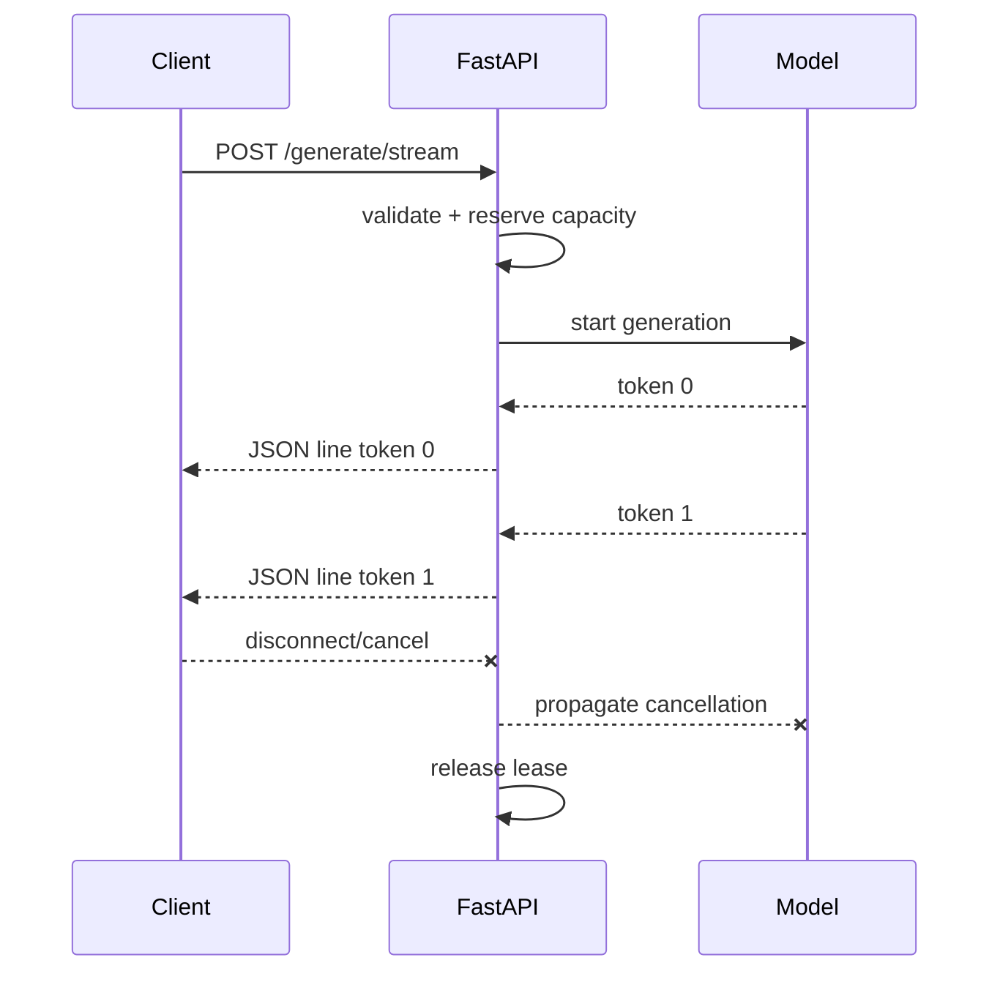

# AI 推理服务、流式响应、模型生命周期、容量、超时、取消与背压

把 `model.generate(prompt)` 放进路由只需几行代码，但这还不是可用的推理服务。模型可能需要数十秒加载并占用大量内存；每个生成请求的成本随输入、输出和并发变化；客户端可能断线；GPU 已满时继续收请求只会扩大排队和超时。

本课不绑定某个模型库，而是先建立所有本地模型、远端模型 API 和推理引擎都共有的控制面：

```text
请求校验
  → admission deadline
  → 取得有限容量
  → execution deadline
  → 逐 token/chunk 生成
  → 网络发送与背压
  → 正常完成 / 超时 / 取消 / 错误
  → 必须释放容量
```

第一次只掌握三条：模型在 lifespan 创建并关闭；请求必须先取得有限执行容量；超时、客户端取消或生成失败都必须释放容量。流式响应改善首 token 等待体验，却不降低总计算成本；batching、KV cache 和 GPU 调度属于具体运行时进阶。

> 版本基准：Python 3.11+、FastAPI 0.139.x、Starlette 1.3.x、Uvicorn 0.51.x。FastAPI 原生 JSON Lines 与通用 streaming API 在 0.134.0 加入。示例使用可控的假模型，因此不需要下载权重或 GPU。

## 1. 为什么普通 CRUD 的并发直觉不够用

数据库 API 的单次响应通常较短，连接池会形成明确容量边界。生成式模型却有不同成本结构：

- 输入 prompt 需要 tokenize 和 prefill；
- 输出逐 token decode，输出越长，占用执行槽越久；
- KV cache 通常随并发序列数和上下文长度增长；
- GPU memory 不足不是“再等一会”就必然恢复；
- batching 可以提高吞吐量，却可能增加单请求排队延迟；
- streaming 缩短 time-to-first-token，不一定缩短总执行时间。

因此 QPS 本身不能描述容量。至少要观察 active sequences、queued requests、input/output tokens、time to first token、inter-token latency、总延迟、timeout/cancel 和 accelerator memory。

## 2. 数据面、控制面与模型运行时

三个边界不要混成一个“大模型接口”：

| 层 | 职责 | 不应承担 |
| --- | --- | --- |
| FastAPI/API 层 | HTTP 合同、认证、校验、错误和流协议 | 自己实现 GPU scheduler |
| 推理服务控制层 | admission、deadline、取消、容量和指标 | 把 prompt 当可信内容 |
| 模型运行时 | tokenize、batch、prefill、decode、cache | 决定租户权限和 HTTP status |

示例的 `InferenceService` 是控制层，`FakeLanguageModel` 是运行时替身。以后换成 Transformers、vLLM、TGI 或远端模型 API 时，HTTP 合同和容量思想仍可保留，但实际 cancellation、batching 和线程安全必须按目标运行时重新核实。

## 3. 模型应属于应用 lifespan

模型是重量级共享资源，不应每个请求加载，也不应在 module import 时偷偷加载。FastAPI 推荐用 lifespan 在接收请求前初始化，在 shutdown 时释放：

<<< ../../../examples/python/fastapi-inference-capacity/inference_api/app.py{50-62}

执行顺序是：

1. Uvicorn 启动 ASGI application；
2. FastAPI 进入 lifespan，`service.start()` 加载模型；
3. 加载成功后越过 `yield`，应用才 ready；
4. 多个请求共享同一模型实例；
5. shutdown 停止接收新流量并等待请求；
6. `finally` 调用 `service.stop()` 释放模型资源。

如果加载失败，应让 startup 失败而不是返回一个表面存活、实际无法推理的实例。若一个进程启动 N 个 Uvicorn workers，lifespan 会执行 N 次，通常也会加载 N 份模型。CPU memory 可能部分 copy-on-write，但 GPU allocation、runtime context 和可变 cache 不能想当然共享。

## 4. liveness、readiness 与 startup 不是同一个信号

<<< ../../../examples/python/fastapi-inference-capacity/inference_api/app.py{64-75}

- **liveness**回答“进程是否需要被重启”；依赖下游瞬时故障不应总让它失败，否则会造成重启风暴；
- **readiness**回答“此实例现在是否应接收流量”；模型没加载、正在 drain 或关键容量不可用时可失败；
- **startup probe**给冷启动较慢的模型足够时间，避免 liveness 在加载期间反复杀进程。

readiness 通过不等于有空闲推理槽。若每次槽位暂满都摘除实例，负载均衡器会抖动；短期过载应由 admission control 快速拒绝或有限排队。

## 5. 输入限制必须基于 token，不只是字符数

示例 Pydantic model 对字符数、输出数和 timeout 做协议级限制：

<<< ../../../examples/python/fastapi-inference-capacity/inference_api/app.py{33-39}

这能拒绝明显异常输入，但真实模型还要在 tokenize 后检查：

```text
input_tokens + requested_output_tokens <= model_context_window
```

字符数与 token 数不是固定比例，语言、空白、代码和 tokenizer 都会改变结果。还要防御：

- 极长输入带来的 tokenizer CPU 和 memory 消耗；
- `max_tokens` 未设上限导致长期占槽；
- 图片/音频的像素、时长、格式和解码炸弹；
- 用户传入任意模型名、adapter 路径或采样参数；
- prompt、生成内容和 embedding 被日志完整记录而泄露数据。

Pydantic 验证 HTTP shape，不替代模型 tokenizer 的资源预算，也不替代内容安全策略。

## 6. `async def` 不会把阻塞模型变成异步

以下代码仍会阻塞 event loop：

```python
@app.post("/generate")
async def generate(payload: Request):
    return model.generate(payload.prompt)  # 同步阻塞调用
```

`async def` 只允许函数在 `await` 处协作让出执行权。若模型库的 Python 调用直到完整结果才返回，event loop 不能处理同进程内其他 coroutine。

选项取决于运行时：

- 真正提供 async client 的远端推理服务：直接 `await`，并设置 connect/read/total timeout；
- blocking I/O adapter：可用专用 thread executor 或 bounded `asyncio.to_thread`；
- 纯 Python CPU 工作：thread 受 GIL 和 library 行为影响，通常使用 process/外部 worker；
- GPU/LLM runtime：优先使用其 scheduler、continuous batching 和 cancellation API，而不是每请求随意开 thread。

`asyncio.to_thread()` 的 await 被取消，不代表底层 thread 中的函数会停止。线程没有安全的强制终止机制；仍在运行的推理可能继续占 GPU。适配器必须明确“取消等待”和“取消底层工作”是不是同一件事。

本课假模型在每个 token 前 `await asyncio.sleep()`，故意提供 cancellation checkpoint：

<<< ../../../examples/python/fastapi-inference-capacity/inference_api/model.py

`finally` 无论正常完成、timeout 还是 cancellation 都递减 active counter。这是在模拟真实运行时应提供的清理合同，不代表所有模型库天然如此。

## 7. 并发限制、速率限制和队列长度的边界

这三个机制经常被统称为“限流”，但控制对象不同：

- **concurrency limit**：同一时刻最多多少个请求占用资源；
- **rate limit**：时间窗口内允许多少请求/token，常用于租户配额；
- **queue bound/deadline**：多少请求、多少时间可以等待容量。

模型容量是稀缺资源，所以示例用 `asyncio.Semaphore` 表示固定 execution slots，并给等待设置 deadline：

<<< ../../../examples/python/fastapi-inference-capacity/inference_api/service.py{34-60}

不能只写 `await semaphore.acquire()`：请求到达速度长期大于完成速度时，等待 task 会无限增长，占用 request body、认证上下文、socket 和 memory，最终所有请求一起超时。

示例等不到容量就返回 `503 Service Unavailable` 和 `Retry-After`。`429 Too Many Requests` 更适合表达某个 client/tenant 超出配额；503 表示当前服务容量暂不可用。实际合同可按 gateway 和 client retry 策略选择，但必须一致。

## 8. Admission deadline 与 execution deadline

一个“总 timeout=30 秒”很难诊断到底花在哪里。至少拆成：

```text
queue/admission time
  + model execution time
  + stream delivery time
  <= client-visible deadline
```

非流式路径先 reserve，再在新的 timeout scope 中生成：

<<< ../../../examples/python/fastapi-inference-capacity/inference_api/service.py{71-94}

`asyncio.timeout()` 到期时会取消当前 task，并在 scope 外转换为 `TimeoutError`。模型 async generator 的 `finally` 先执行，`CapacityLease.__aexit__` 再归还 permit，最后 service 映射成领域错误。

路由把两类错误区分为 503 和 504：

<<< ../../../examples/python/fastapi-inference-capacity/inference_api/app.py{77-100}

**deadline**是绝对或可计算的剩余预算；**timeout**常是某一步最多等多久。服务间调用应传播剩余 deadline，而不是每一层都重新给完整 30 秒，否则五层调用可能把客户端早已放弃的工作继续做很久。

## 9. Cancellation 是控制流，不是普通业务错误

客户端断线、server shutdown、parent task 失败和 timeout 都可能取消 coroutine。Python 用 `asyncio.CancelledError` 注入下一个 cancellation checkpoint。

正确模式是：

```python
try:
    await inference()
except asyncio.CancelledError:
    await cleanup_if_needed()
    raise
```

不要 `except BaseException: pass`，也不要捕获 cancellation 后冒充成功。吞掉它会破坏 `asyncio.timeout()`、TaskGroup 和 graceful shutdown 的所有权语义。

但是“HTTP task 已取消”不保证底层模型已停：

- async remote client 可能关闭 socket，但远端 server 仍在生成；
- thread adapter 可能继续运行 blocking function；
- GPU engine 可能需要显式 `abort(request_id)`；
- batch 中取消一个 sequence 不应破坏其他 sequence。

所以 cancellation 必须沿 API → adapter → runtime 传播，并用 request id 验证真正释放 KV cache/slot。

## 10. Streaming 改善感知延迟，不减少工作量

普通 JSON response 必须等完整文本生成后才发送。流式响应在第一批 token 就绪后发送，降低 time to first token：



FastAPI 支持 JSON Lines、SSE 和原始 `StreamingResponse`：

- JSON Lines：每行一个独立 JSON，适合 typed token、usage、error 和 done event；
- SSE：浏览器 `EventSource`、event/id/retry/keepalive 更方便；
- raw text/bytes：协议最轻，但 error、finish reason 和 metadata 容易变成私有约定；
- WebSocket：需要真正双向消息时使用，部署与状态管理更复杂。

本课选择 `application/jsonl`，每行都有 `type`：

```json
{"type":"token","index":0,"text":"AI"}
{"type":"token","index":1,"text":"回答："}
{"type":"done"}
```

## 11. 为什么流开始前必须完成可失败的 admission

HTTP response headers 一旦发出，status code 就固定了。如果在 body generator 内才等待 semaphore，过载时 header 可能已经是 200，无法再改成 503。

所以流式路由在创建 response 前 reserve：

<<< ../../../examples/python/fastapi-inference-capacity/inference_api/app.py{96-107}

开始 streaming 后发生 inference timeout，示例发送 typed error line：

<<< ../../../examples/python/fastapi-inference-capacity/inference_api/app.py{109-130}

client 必须把 `done` 当作协议成功终态；HTTP 200 但没有 `done` 可能是网络中断，收到 `error` 则是流内失败。不要仅凭 status 200 把不完整文本保存为完成结果。

## 12. 资源所有权要覆盖“generator 尚未开始”的缝隙

路由先拿到 lease，再把 body generator 交给 response。若 response 在 generator 第一次迭代前就被取消，只把 `finally` 写在 generator 内可能无法执行。

示例让 response 本身也拥有 lease：

<<< ../../../examples/python/fastapi-inference-capacity/inference_api/app.py{19-30}

`CapacityLease.release()` 是幂等的：正常流由 service context manager 归还；早期取消或 response 异常由 `LeaseStreamingResponse.__call__` 的 `finally` 兜底。资源 ownership 覆盖从 reserve 成功到 ASGI response 完全结束的整个区间。

## 13. 背压到底从哪里传播

**背压**不是“系统变慢”的同义词，而是下游容量不足时，压力能够有界地向上游传播：暂停生产、限制并发、有限排队或明确拒绝。

流式链路可能是：

```text
模型 runtime → Python generator → ASGI send → socket buffer
→ reverse proxy → browser/network reader → UI render
```

当 client 很慢，ASGI `send` 最终会等待 socket 可写，async generator 暂停迭代；这可以抑制支持按需生成的上游。但很多模型 runtime 会在内部 thread/GPU 持续产 token，并把结果塞进无界 queue。这时网络背压没有传到模型，只是把 memory 问题移到了 queue。

工程上要核实：

- runtime 输出 queue 是否有界；
- queue 满时是暂停 decode、丢 token、阻塞 thread 还是 OOM；
- client disconnect 多久能被观察并 abort sequence；
- proxy 是否 buffer 整个响应，破坏 streaming；
- 每连接最大 duration、idle timeout 和最大输出 token；
- frontend 是否增量批量 render，避免每个 token 触发一次昂贵 DOM 更新。

## 14. Uvicorn 的全局限制不能替代模型 gate

Uvicorn 的 `--limit-concurrency` 限制 concurrent connections/tasks，过限返回 503；`--backlog` 控制尚未 accept 的连接；`--timeout-graceful-shutdown` 限制 shutdown 等待。

它们保护整个 ASGI process，却不知道：

- `/health/live` 很便宜，不应和生成请求争同一种 permit；
- 不同模型有不同 GPU 和 memory 成本；
- embedding 与 generation 的 batch scheduler 不同；
- 一个 streaming request 可能占槽数分钟。

因此通常同时使用 server/global limit、route/model admission gate、tenant quota 和 runtime scheduler。多个 worker 各自的 `Semaphore(2)` 意味着主机总上限约为 workers × 2；若共享同一 GPU，还需要跨进程 scheduler 或只让专用推理 runtime 拥有 GPU。

## 15. Batching：吞吐量与公平性的交换

batching 把多个 sequence 一起执行，提高 accelerator utilization。静态 batching 等齐一批再跑，简单但首个请求要等待；continuous batching 在 decode 过程中动态加入/移除 sequence，吞吐更高但 scheduler 更复杂。

必须定义：

- 最大 batch tokens，而不只最大 request count；
- 长短请求是否 head-of-line blocking；
- tenant fairness 和 priority 是否会导致 starvation；
- prefill 与 decode 如何分配资源；
- batch 失败是单 sequence 失败还是整批失败；
- 取消如何从 batch 移除并回收 cache。

应用层 semaphore 只是粗粒度安全阀，不能替代模型 runtime 的 token-aware scheduler。

## 16. 完整应用代码

<<< ../../../examples/python/fastapi-inference-capacity/inference_api/app.py

服务层把容量、queue deadline、execution deadline 和 lease ownership 集中起来：

<<< ../../../examples/python/fastapi-inference-capacity/inference_api/service.py

这样路由负责协议映射，模型 adapter 负责运行时细节，service 负责跨协议都一致的治理规则。

## 17. 测试要证明失败后资源真的回来

<<< ../../../examples/python/fastapi-inference-capacity/tests/test_inference.py

测试验证：

- lifespan 进入前模型未加载，运行期间 ready，退出后卸载；
- 非流式响应内容符合合同；
- concurrency=1 时第二个请求在 admission deadline 被拒绝，最大 active 始终为 1；
- execution timeout 会取消生成并归还 permit；
- caller cancellation 不会被吞掉，模型计数与 service 计数归零；
- JSON Lines 有 typed token 和明确 `done` 终态。

真实 runtime 还需要 fault injection：client 中途断开、worker 收到 SIGTERM、上游模型 server timeout、GPU OOM、batch 中单请求取消、proxy buffering，以及 shutdown deadline 到期。

## 18. 运行示例

<<< ../../../examples/python/fastapi-inference-capacity/pyproject.toml

```bash
cd examples/python/fastapi-inference-capacity
python3 -m venv .venv
source .venv/bin/activate
python -m pip install -e '.[test]'
python -m pytest
uvicorn inference_api.app:create_app --factory --reload
```

普通生成：

```bash
curl -s http://127.0.0.1:8000/api/v1/generate \
  -H 'Content-Type: application/json' \
  -d '{"prompt":"解释背压","max_tokens":3}'
```

流式生成，`-N` 禁止 curl 自己缓冲：

```bash
curl -N http://127.0.0.1:8000/api/v1/generate/stream \
  -H 'Content-Type: application/json' \
  -d '{"prompt":"解释背压","max_tokens":3,"token_delay":0.2}'
```

## 19. 与 Vue / JavaScript 的对照

浏览器端 `fetch` 默认仍可能等你调用 `.json()` 才看到完整 body。消费 JSON Lines 要读取 `response.body` 的 `ReadableStream`，使用 `TextDecoder` 增量解码并保留跨 chunk 的半行；network chunk 边界不等于 JSON line 边界。

`AbortController.abort()` 会取消浏览器等待并关闭/中止请求，但不能单方面证明 server/GPU 已停止。后端仍需观察 disconnect 并把 request id 传给模型 runtime 的 abort API。

Vue 页面也要做渲染背压：把 token 先聚合到 buffer，按 animation frame 或较粗时间片更新响应式状态。每 token 更新 Markdown parser、syntax highlight 和整个 message component，可能让前端成为最慢的一环。

Promise 没有 Python `CancelledError` 相同的自动注入语义；JavaScript cancellation 常由显式 `AbortSignal` 协议传播。两边都必须让每一层真正接受 signal/request id，而不是只取消最外层 UI。

## 20. 安全、成本与可观测性

推理 endpoint 除了普通 API 安全，还要考虑：

- 按 tenant/model 统计 input/output token 和成本，不能只统计 request count；
- prompt injection 不是传统 SQL injection，但会影响模型行为；外部工具调用仍需独立授权和参数校验；
- 输出不是可信 HTML，前端渲染 Markdown/HTML 时必须 sanitize；
- prompt、附件、embedding 和生成结果可能含 PII/secret，日志默认不记录全文；
- model/version、sampling config、finish reason 和 usage 应进入低风险 metadata；
- cache key 必须包括影响输出的模型版本与参数，并处理跨租户泄漏；
- timeout、cancel、overload、OOM、queue duration、TTFT 和 tokens/s 分开计量。

不要把 raw prompt、user id 或 request id 放进 metric label；用结构化日志/trace 关联具体请求。

## 21. 工程检查清单

- model 在 lifespan 加载和释放，startup failure 不伪装 ready；
- 明确每 process/worker 会加载几份模型；
- 字符、token、媒体大小和输出长度均有上限；
- blocking call 不占用 ASGI event loop；
- admission queue 有 deadline/上限，过载快速且可观测；
- server limit、tenant quota、model gate 和 runtime scheduler 分层；
- queue、execution、downstream 和 client deadline 有清晰预算；
- cancellation 能到达真实 runtime，而不只取消 Python await；
- `CancelledError` 清理后重新抛出；
- streaming 在发 header 前完成认证、验证和 admission；
- 流协议有 token/error/done 等 typed terminal semantics；
- response、generator、model sequence 和 lease 的 ownership 无缝覆盖；
- output queue 有界，慢 client 能传播背压或被终止；
- graceful shutdown 会 drain/abort，并最终释放 GPU、thread 和连接；
- prompt/output 不默认进入日志、metric label 或 trace attribute；
- 测试包含 timeout、cancel、disconnect、overload 与 shutdown。

## 22. 本课结论

- AI endpoint 的难点不是调用模型，而是管理重量级生命周期、可变成本和失败所有权。
- `async def` 不会把 blocking inference 自动变成非阻塞，取消外层 await 也不保证底层停止。
- concurrency、rate 和 queue 是不同限制；无界等待会把过载变成 memory 与 timeout 雪崩。
- admission deadline 决定能否进入，execution deadline 决定能执行多久，二者应分别观测。
- streaming 降低首 token 延迟，但 HTTP 200 后只能用流内 error/done 表达终态。
- 背压必须从慢 client 穿过有界 queue 传到模型 scheduler；否则只是把压力藏进 memory。
- semaphore 是安全阀，不是 token-aware batching scheduler；生产推理运行时仍需专门调度。

下一节：[FastAPI 部署拓扑、容器、多 Worker、代理、迁移、健康检查与优雅停机](/backend/fastapi/deployment-topology-containers-workers-proxies-migrations-health-and-graceful-shutdown)。

## 23. 参考资料

- [FastAPI：Lifespan Events](https://fastapi.tiangolo.com/advanced/events/)
- [FastAPI：Stream JSON Lines](https://fastapi.tiangolo.com/tutorial/stream-json-lines/)
- [FastAPI：Stream Data](https://fastapi.tiangolo.com/advanced/stream-data/)
- [Starlette：StreamingResponse](https://www.starlette.io/responses/)
- [Starlette：Request disconnect](https://www.starlette.io/requests/)
- [Python 3.14：Coroutines and Tasks](https://docs.python.org/3.14/library/asyncio-task.html)
- [Python 3.14：Synchronization Primitives](https://docs.python.org/3.14/library/asyncio-sync.html)
- [Uvicorn：Settings、Resource Limits 与 Timeouts](https://www.uvicorn.org/settings/)
