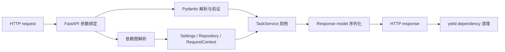
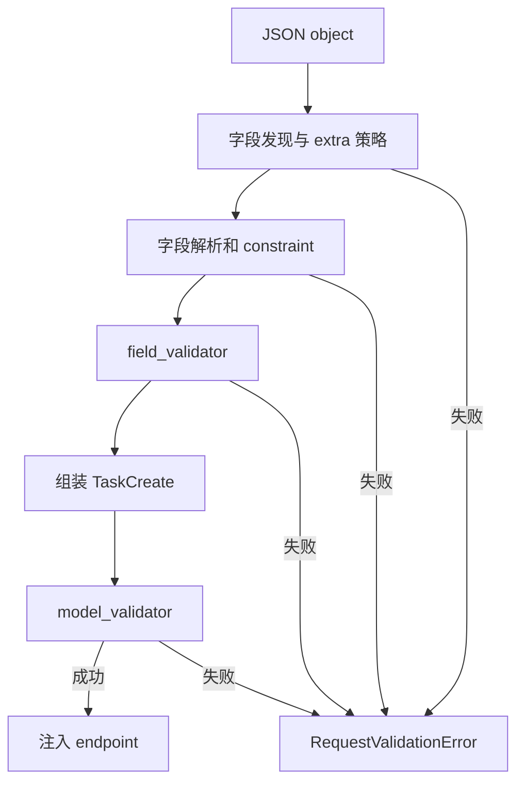
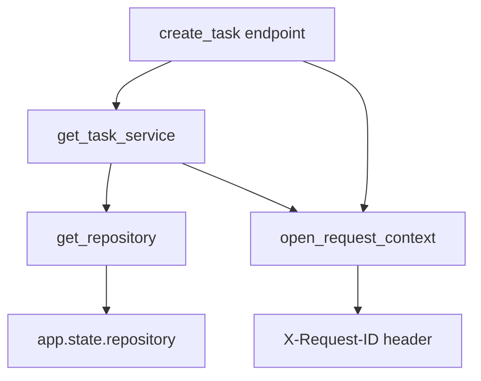
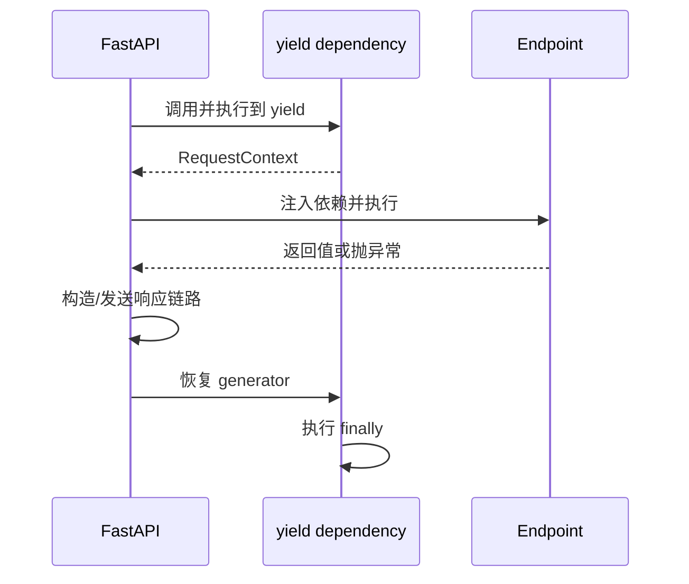
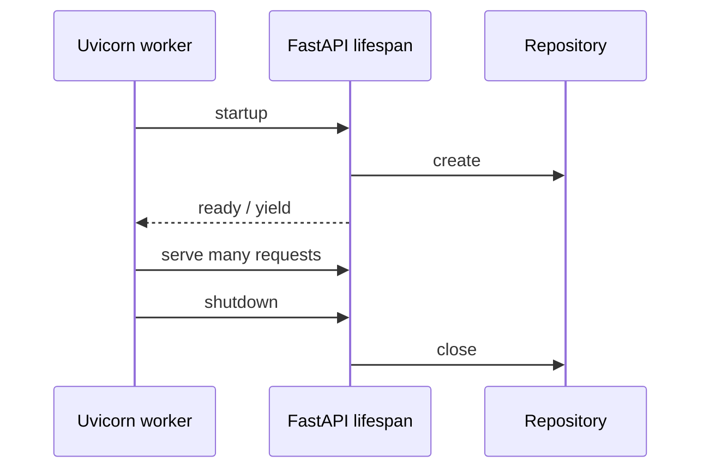

# FastAPI 参数绑定、Annotated、Pydantic、依赖注入、配置与模块化路由

上一课把一个请求从 Uvicorn、ASGI、路由、请求模型一路追踪到响应模型，并用 lifespan 管理了进程级资源。那个单文件应用适合观察完整链路，但功能继续增长后，会立刻出现几个问题：

- 每个 endpoint 都手动从 `request.app.state` 取 repository；
- query、header、path 和 body 的约束散落在函数签名里；
- 配置读取、对象创建、业务编排和 HTTP 路由互相缠绕；
- 测试若想替换 repository，只能改全局状态或深入应用内部；
- 打开连接、建立 request context 后，成功、异常和取消路径都必须可靠清理。

这些并不是“文件太长”造成的，而是**对象从哪里来、谁拥有它、何时创建与释放**没有成为显式模型。本课用参数绑定、Pydantic、dependency injection、`BaseSettings` 和 `APIRouter` 建立这套模型。

> 本课验证环境：CPython 3.13.4；FastAPI 0.139.0、Pydantic 2.13.4、pydantic-settings 2.14.2、Starlette 1.3.1、Uvicorn 0.51.0、httpx2 2.7.0、pytest 9.1.1。项目声明支持 Python 3.11+。

## 1. 本课要解决的核心问题

先看目标请求：

```http
POST /api/v1/tasks HTTP/1.1
Content-Type: application/json
X-Request-ID: request-123

{
  "title": "Understand dependency graphs",
  "priority": 4,
  "tags": ["FastAPI", " Backend "],
  "starts_at": "2026-07-16T09:00:00+08:00",
  "ends_at": "2026-07-16T10:00:00+08:00"
}
```

endpoint 不应同时负责：

1. 识别 header、path、query、body；
2. 把 JSON string 转成 `datetime`；
3. 检查结束时间晚于开始时间；
4. 从应用状态取 repository；
5. 创建一次 request context 并最终清理；
6. 编排业务用例；
7. 决定响应模型、status 和 headers。

合理的边界是：



dependency injection 在这里不是为了“少写两个参数”，而是把隐藏的输入变成可声明、可组合、可替换、具有生命周期的输入。

## 2. 先分清四个相邻概念

### 2.1 类型提示不是运行时验证

```python
def set_priority(priority: int) -> None:
    ...
```

普通 Python 不会因为注解是 `int` 就拒绝 `"4"`。注解主要供阅读者、type checker 和 framework 使用。FastAPI 在启动时读取 signature，并结合 Pydantic 建立运行时解析规则，才会产生 HTTP 422。

### 2.2 解析、验证、序列化不是一件事

- **解析/转换**：把 query string `"4"` 转为 Python `int(4)`；
- **验证**：确认值落在 `1..5`，或 `ends_at > starts_at`；
- **序列化**：把 Python `datetime` 转回 JSON string。

Pydantic 默认倾向于“先转换，再验证”。如果协议要求 JSON number，不能接受 JSON string，就应在该字段使用 `strict=True`。严格与否是每个边界的协议选择，不应机械地全局开启或关闭。

### 2.3 HTTP transport model 不是 domain entity

`TaskCreate` 表示 client 可以提交的 JSON 形状；`TaskRecord` 表示 repository 边界中的记录；未来数据库 ORM model 又承担持久化映射。它们可能字段相似，但责任不同。

复用同一个 class 会让数据库新增的内部字段意外暴露到 API，也会让 HTTP 的可选字段规则污染领域状态。

### 2.4 Dependency 与普通 helper 的区别

普通 helper 由业务代码主动调用；FastAPI dependency 由 framework 读取声明、递归解析子依赖、注入结果、缓存 request-scoped 结果并管理 `yield` 清理。

dependency 仍然只是 callable，不是全局 service locator，也不会让 Python 自动拥有依赖注入能力。

## 3. FastAPI 如何判断参数来自哪里

FastAPI 读取 path operation 的 signature，按声明确定输入来源：

- path template 中同名参数通常来自 path；
- `Query()` 明确来自 query string；
- `Header()` 明确来自 header；
- Pydantic model 参数通常来自 JSON body；
- `Depends()` 的值来自另一个 callable；
- `Request`、`Response` 等已知类型由 framework 注入。

不要依赖“看起来能猜出来”。`Annotated` 可以同时保存 Python 基础类型和 FastAPI metadata：

```python
task_id: Annotated[int, Path(ge=1)]
```

基础类型仍是 `int`，`Path(ge=1)` 是 framework metadata。相较把 `Path()`、`Query()` 放在 default value 位置，`Annotated` 更清楚地分离了“类型是什么”和“framework 如何取得并约束它”。

### 3.1 Path

```python
task_id: Annotated[int, Path(ge=1)]
```

请求 `/tasks/abc` 无法转成 `int`；`/tasks/0` 虽能转成整数，却违反 `ge=1`。两者都在 endpoint 执行前成为 request validation error。

### 3.2 Query model

分页和过滤条件常常一起变化。把它们封装为 model 可以复用约束，并把未知参数策略写清楚：

<<< ../../../examples/python/fastapi-dependencies-settings/modular_api/models.py

`TaskQuery.model_config = ConfigDict(extra="forbid")` 意味着 `?unexpected=true` 会被拒绝，而不是被悄悄忽略。对公共 API，这能更早发现 client 拼写错误。

要让 FastAPI 把一个 model 展开为 query parameters，应明确使用：

```python
query: Annotated[TaskQuery, Query()]
```

若它只是裸 Pydantic model，FastAPI 在不同签名位置可能将其解释为 body；来源声明应当显式。

### 3.3 Header

示例读取 `X-Request-ID`：

```python
x_request_id: Annotated[
    str | None,
    Header(alias="X-Request-ID", min_length=8, max_length=64),
] = None
```

HTTP header name 大小写不敏感。显式 `alias` 让外部协议名称不受 Python identifier 限制。FastAPI 的 `Header` 默认也能把变量名中的 underscore 映射为 hyphen，但在协议边界显式命名更易审查。

### 3.4 Body 与 Field

`Field()` 约束 Pydantic model 中的字段；`Query()`、`Path()`、`Header()` 描述 HTTP 参数来源。它们相邻但不是替代关系。

```python
priority: int = Field(default=3, ge=1, le=5, strict=True)
```

这里 `strict=True` 使 JSON `"4"` 被拒绝，但 JSON `4` 被接受。query string 在网络上天然是文本，FastAPI/Pydantic 必须为 query 做类型解析，所以不能把 body 的 strict 直觉原样套到 query。

## 4. Pydantic 的执行管线

收到 body 后，执行因果链大致是：



这是帮助理解的主路径，而不是所有 validator mode 的固定总顺序。`before`、`after`、`plain`、`wrap` 会改变 validator 所处阶段；同一字段还有 metadata 的排序规则。工程中应选择最小必要模式。

### 4.1 字段级规则

`normalize_tags` 在元素已被验证为 string 之后运行：去除首尾空白、转小写、按首次出现顺序去重，再检查长度。

为什么响应用 `list[str]` 而不是 `set[str]`？`set` 表达唯一性，却不承诺稳定顺序。JSON array 有顺序，前端渲染、snapshot 和 cache key 都可能依赖它。把 set 直接作为响应会形成不稳定合同，因此示例用 list 并显式去重。

### 4.2 跨字段规则

单个 `ends_at` 无法独立判断是否合法，因为它依赖 `starts_at`。这属于 model-level invariant：

```python
@model_validator(mode="after")
def end_must_follow_start(self) -> Self:
    if self.starts_at is not None and self.ends_at is not None:
        if self.ends_at <= self.starts_at:
            raise ValueError("ends_at must be later than starts_at")
    return self
```

选择 `after` 是因为此时两个值已经成为 `datetime`，可以直接比较。若在 `before` 阶段操作，输入可能是 dict、字符串或其他原始对象，错误处理更复杂；更不能在 union validation 尚未决定分支时随意修改共享输入。

### 4.3 默认值并非总会再次验证

Pydantic 对 default 有明确的 validation 配置。不要假设“写进 model 的 default 一定经过与 client input 完全相同的路径”。默认值应由代码保证有效；确需验证默认值时显式配置 `validate_default`。

### 4.4 `model_dump()` 是边界转换，不是无损复制

```python
payload.model_dump()
```

得到 Python-mode dict，其中 datetime 仍可为 `datetime`。`model_dump(mode="json")` 或 JSON serialization 才会产生 JSON-compatible 值。`exclude_unset=True` 常用于 PATCH，因为“client 没传”与“client 明确传 null”是不同状态。

## 5. 统一错误响应中隐藏的序列化陷阱

`RequestValidationError.errors()` 的 detail context 可能保存原始 `ValueError` object。它适合 Python 内部诊断，却不一定能直接作为 JSON 输出。

因此示例先把 `ctx.error` 转成 stable string，再构造 error response。不能因为 `dict` 看起来像 JSON，就假设其中所有深层 value 都可序列化。完整 handler 随后会在 composition root 源码中展示。

还要保持责任边界：这里只映射 request validation。response model validation 或内部构造 Pydantic model 失败通常是 server bug，不应伪装为 client 的 422。

生产 API 还应决定是否返回原始 input。密码、token、个人数据可能出现在 validation detail 中；统一错误结构不等于可以无条件回显原始输入。

## 6. 为什么需要依赖图

任务 endpoint 实际需要的不是一个孤立 `TaskService`：



FastAPI 在 application/route 构造阶段分析 callable signature，建立 dependency graph；每个请求到达后再解析具体值。

执行时：

1. 先解析叶子依赖需要的 header 和 `Request`；
2. 执行 `open_request_context` 到 `yield`；
3. 执行 `get_repository`；
4. 用它们创建 `TaskService`；
5. endpoint 同时请求同一个 request context；
6. FastAPI 命中本请求 dependency cache，不会第二次打开 context；
7. endpoint 和响应处理结束后进入 `finally` 清理。

默认缓存是**每个请求内**的复用，不是跨请求 singleton。它避免同一依赖图中一个 provider 被重复执行。确需每次重新计算时可以使用 `Depends(provider, use_cache=False)`，但这会改变副作用和资源数量，必须有明确理由。

## 7. Provider、type alias 与可见依赖

完整 dependency module：

<<< ../../../examples/python/fastapi-dependencies-settings/modular_api/dependencies.py

这几个边界值得注意：

- `app.state` 仍用于保存 process-owned 实例，但 endpoint 不直接知道 storage key；
- provider 是薄适配层，返回有类型的对象；
- `SettingsDep` 等 alias 减少重复 metadata，却没有隐藏基础类型；
- alias 应保持领域含义明确，不能把整张图压缩成难以追踪的“魔法类型”。

`Request` 是 framework 对当前 ASGI request 的封装。通过它访问 `request.app.state` 不等于 module-level global；每个 app instance 可以拥有不同 state，测试因此能创建彼此隔离的 app。

## 8. `yield` dependency 的生命周期

`open_request_context` 是 async generator dependency：

```python
async def open_request_context(...) -> AsyncIterator[RequestContext]:
    # acquire/setup
    try:
        yield context
    finally:
        # release/cleanup
```

可以把它理解为由 FastAPI 驱动的 async context manager：



`finally` 能覆盖成功和异常路径，是 database session、lock、temporary resource 的正确清理位置。但要注意：

- 清理代码也可能失败，不能吞掉原异常；
- dependency 的 acquisition 若在 `yield` 前失败，`finally` 是否进入取决于资源在哪一步成功取得；
- 多个 yield dependencies 按 stack 逆序释放；
- streaming response 的资源必须活到 stream 消费结束，不能只凭普通 JSON response 的时序直觉判断；
- app lifespan 管 process-level resource，yield dependency 管 request/use-level resource，两者不是替代关系。

## 9. sync 与 async dependency

FastAPI 支持普通 `def` 和 `async def` dependency。普通 `def` 会按 framework 的 threadpool 策略执行；`async def` 在 event loop 中执行。

不要为了形式统一把 blocking database/client 调用塞进 `async def`。`async def` 只表示 callable 可以 await，并不会自动把 blocking I/O 变为 non-blocking。具体 client 的并发模型仍须核对。

## 10. Service 层解决什么问题

<<< ../../../examples/python/fastapi-dependencies-settings/modular_api/service.py

`TaskService` 编排 use case：repository 返回 `None` 时转成 application error，router 再由全局 handler 映射为 HTTP 404。

application error 本身不引用 FastAPI：

<<< ../../../examples/python/fastapi-dependencies-settings/modular_api/errors.py

因果链是：

```text
repository: None
  → service: TaskNotFoundError
  → HTTP adapter: 404 + stable error code
```

这样 repository 不依赖 FastAPI 的 `HTTPException`，未来 CLI、worker 或 message consumer 可以复用它。反过来，也不要为每个一行调用强行创建 service；当 service 没有业务编排职责时，额外层只会增加跳转。

## 11. Repository Protocol 与实现边界

<<< ../../../examples/python/fastapi-dependencies-settings/modular_api/repository.py

`TaskRepository` 是 structural protocol：依赖方关心可调用的方法，而不要求实现继承某个 framework base class。`InMemoryTaskRepository` 只是可运行示例：

- 数据只在当前 Python process 内；
- 多 worker 各有不同数据；
- restart 后全部丢失；
- lock 只协调同一个 event loop/process 中的并发写；
- 它不能替代 transaction、unique constraint 或 durable database。

repository protocol 也不意味着任意两个实现都有完全相同的 transaction、consistency 和 performance 语义。抽象接口必须配合行为合同。

## 12. 配置为什么必须是显式输入

环境变量本质上都是 string。直接在各模块调用 `os.getenv()` 会带来：

- parsing 和 default 分散；
- 拼错名称时静默获得 `None`；
- import-time 读取时机不透明；
- 测试互相污染 process environment；
- secret 可能因随意打印而泄漏。

`BaseSettings` 把 configuration 当作一个需要解析和验证的边界：

<<< ../../../examples/python/fastapi-dependencies-settings/modular_api/config.py

### 12.1 `BaseSettings` 与 `BaseModel`

二者都由 Pydantic 验证；区别在于 `BaseSettings` 还负责从 environment、dotenv、secret files 等 configuration sources 取得值。它不是 secret manager，也不会自动加密 secret。

### 12.2 prefix 与 dotenv

`env_prefix="TASK_API_"` 把 `app_name` 映射为 `TASK_API_APP_NAME`，减少同一 host 上不同应用的名称冲突。

`.env.example` 可以提交以说明键名：

<<< ../../../examples/python/fastapi-dependencies-settings/.env.example

真实 `.env` 已被 `.gitignore` 排除。生产 secret 更适合由 deployment platform 注入环境或 secret file，而不是提交到 Git。

### 12.3 默认 source priority

pydantic-settings 默认优先级从高到低通常是：初始化参数、environment、dotenv、file secrets、field defaults。CLI、JSON/TOML/YAML 或自定义 source 是否参与，取决于配置和 source customization。

因此 deployment environment 可以覆盖 `.env`，测试也能用 `Settings(environment="test")` 显式覆盖外部环境。版本升级后若依赖 source priority，必须查对应 pydantic-settings 官方文档和测试，不要凭印象。

### 12.4 为什么使用 `lru_cache`

读取 dotenv、environment 和验证配置不应在每次请求重复进行。`load_settings()` 的 cache 是当前 Python process 内的 cache；多 worker 各有一个实例。环境改变不会让现有 process 自动刷新，通常通过 restart/redeploy 应用新配置。

示例 application factory 允许传入显式 Settings，所以测试不必清理全局 cache：

```python
app = create_app(Settings(environment="test", max_page_size=5))
```

这也解释了为什么 configuration 应在 composition root 决定，而不应在任意模块 import 时读取。

## 13. 配置约束与请求约束是两层规则

`TaskQuery.limit` 的协议上限是 100；某个部署环境的 `max_page_size` 可能是 5。前者属于稳定 transport schema，后者属于 runtime policy。

```text
limit="6"
  → query string 解析成 int 6
  → Pydantic 确认 1 <= 6 <= 100
  → dependency 读取当前 Settings(max_page_size=5)
  → policy 拒绝并映射为 page_size_exceeded
```

把动态配置硬塞进 `Field(le=...)` 会让 schema construction 与 runtime config 纠缠。示例用子依赖 `enforce_page_size` 组合两个已经验证的输入。

## 14. APIRouter 为什么不只是“把文件拆开”

router 聚合同一 HTTP boundary 的 prefix、tags、dependencies、responses 和 operations：

<<< ../../../examples/python/fastapi-dependencies-settings/modular_api/routers/tasks.py

system router：

<<< ../../../examples/python/fastapi-dependencies-settings/modular_api/routers/system.py

应用组合时再添加版本 prefix：

```python
application.include_router(tasks.router, prefix="/api/v1")
```

最终路径来自 prefix 组合：`/api/v1` + `/tasks` + `/{task_id}`。

`include_router` 不是把 router 作为独立 ASGI application mount。它把 routes 纳入同一个 FastAPI app 的 routing/OpenAPI/exception handling 体系。若需要独立 middleware、lifespan 或 OpenAPI，才考虑 mounted sub-application，并重新审视边界。

### 14.1 router-level dependency

可以在 `APIRouter(dependencies=[Depends(require_auth)])` 设置只为副作用/准入检查而执行的依赖。它的 return value不会出现在 endpoint 参数中。若 endpoint 需要认证主体，应把 dependency 写进参数，避免再次查找或依赖隐藏状态。

### 14.2 文件边界不是架构边界

按 `models.py`、`routers.py`、`services.py` 机械横切，在大项目中会形成巨型目录。更大的系统通常按 feature/domain 组织，再在 feature 内分 transport/use case/repository。当前示例规模小，文件拆分主要用于清楚展示职责。

## 15. Composition root：对象图只在一个地方组装

`create_app()` 是 composition root：读取/接收 settings、声明 lifespan、创建 app、include routers、注册 exception handlers。

它知道具体实现 `InMemoryTaskRepository`；service 和 router 只知道抽象边界。以后换数据库时，具体 wiring 应主要发生在这里或专门的 infrastructure provider 中。

完整应用：

<<< ../../../examples/python/fastapi-dependencies-settings/modular_api/app.py

process lifecycle：



request context 则为每个请求重新创建。把两张生命周期图混在一起，是 connection leak 或“已经关闭的资源被复用”的常见来源。

## 16. Endpoint 现在还负责什么

拆分后 endpoint 仍然是 HTTP adapter，而不是空壳：

- 声明 method、path、status、response model；
- 声明 HTTP parameter sources；
- 调用 use case；
- 设置 `Location`、`X-Request-ID` 等协议 headers；
- 把内部结果映射成 transport response。

`create_task` 同时依赖 `TaskServiceDep` 和 `RequestContextDep`，而 service 本身也依赖同一个 context。这不是重复执行；默认 request cache 使两处获得同一对象。测试记录 `open`/`close` 各一次，直接验证了这一行为。

## 17. Dependency override：替换边界，而非 monkey patch 内部

FastAPI app 提供 `dependency_overrides` mapping。key 必须是原 provider callable，value 是替代 callable：

```python
application.dependency_overrides[get_repository] = FakeRepository
```

请求时 dependency solver 仍解析完整图，但 repository 节点换成 test double。这样可以测试 HTTP + validation + service + error mapping，而不依赖真实 database。

override 是 app-level mutable state：共享 app 的 test suite 应在测试后清理，或像本课一样每测试创建新 app，避免顺序依赖。test double 还必须保持真实 contract；只返回“永远成功”的假对象可能掩盖 transaction 和 failure semantics。

完整测试：

<<< ../../../examples/python/fastapi-dependencies-settings/tests/test_api.py

这些测试覆盖：

- environment source 的解析；
- 显式 Settings 注入；
- body normalization 和跨字段验证；
- query extra forbid；
- deployment-specific page limit；
- request dependency cache 与 yield cleanup；
- repository override；
- router prefix 和 OpenAPI model。

## 18. 目录结构与运行方式

```text
examples/python/fastapi-dependencies-settings/
├── .env.example
├── .gitignore
├── pyproject.toml
├── modular_api/
│   ├── __init__.py
│   ├── app.py
│   ├── config.py
│   ├── dependencies.py
│   ├── errors.py
│   ├── models.py
│   ├── repository.py
│   ├── service.py
│   └── routers/
│       ├── __init__.py
│       ├── system.py
│       └── tasks.py
└── tests/
    ├── __init__.py
    └── test_api.py
```

项目元数据与版本范围：

<<< ../../../examples/python/fastapi-dependencies-settings/pyproject.toml

在示例目录运行：

```bash
python3 -m venv .venv
source .venv/bin/activate
python -m pip install -e '.[test]'
python -m pytest
uvicorn modular_api.app:app --reload
```

访问：

```text
http://127.0.0.1:8000/docs
http://127.0.0.1:8000/openapi.json
```

`--reload` 只用于本地开发。它会启动监视/reloader 相关进程，不能用它推断生产 worker 数、startup 次数或资源容量。

## 19. 一次完整请求的执行过程

以 `POST /api/v1/tasks` 为例：

1. router 根据 method/path 选择 operation；
2. FastAPI 读取 dependency graph 和参数字段；
3. body bytes 被解码为 JSON object；
4. `TaskCreate` 校验 extra、字段类型、范围和长度；
5. tag validator 规范化有序列表；
6. model validator 比较已解析的两个 datetime；
7. header provider取得或生成 request id，并执行到 `yield`；
8. repository provider 从当前 app state 取得实例；
9. service provider 组装 `TaskService`；
10. endpoint 再请求 context 时命中本请求 cache；
11. service 调用 repository 创建 record；
12. endpoint 设置 `Location` 与 response request id；
13. `TaskResponse` 验证并序列化公开字段；
14. response 经 ASGI send 发送；
15. dependency exit stack 恢复 generator，执行 `finally`；
16. 下一请求重新建立自己的 request-scoped cache。

任何 endpoint 前的参数错误都会阻止业务方法执行。任何 dependency acquisition 错误也会阻止依赖它的下游节点执行。cleanup 则沿已成功进入的 dependency stack 逆序发生。

## 20. 与 Vue 2 / JavaScript 的对照

### 20.1 `Annotated` 不是 TypeScript decorator

TypeScript type 在常规编译后擦除，runtime validator 需要 Zod 等工具。Python annotation 可在 runtime 被反射读取，但仍不会自己验证；FastAPI/Pydantic 主动解释它们。

### 20.2 Dependency graph 类似 provide/inject，但生命周期不同

Vue `provide/inject` 常围绕 component tree；FastAPI dependency graph 围绕 request execution，并能解析 HTTP 输入、cache 结果与管理 yield cleanup。两者都能降低直接构造耦合，但不能据此假设作用域相同。

### 20.3 Pydantic model 类似 runtime schema，不是 TS interface

interface 主要用于静态检查；Pydantic 接收不可信 runtime input，执行转换、验证并生成 structured error。前后端都应验证自己边界，不能因为 server 有 model 就取消 browser-side UX validation，也不能因为前端已验证就信任网络输入。

### 20.4 Router module 类似 Vue Router route module，但还参与 schema

FastAPI route 声明同时驱动 runtime binding 和 OpenAPI。更改 parameter model 不只是内部 refactor，可能改变 client-visible API contract。

## 21. 常见误解与失败模式

### 21.1 “用了 Depends 就自动解耦”

provider 若直接创建巨大 concrete object graph、读取 global state 并执行业务副作用，耦合只是转移了位置。依赖边界仍需小而明确。

### 21.2 每个请求重新读取 `.env`

增加 I/O 和不一致窗口。配置通常在 process startup 解析一次，变更通过 restart 生效。

### 21.3 把 request object 传遍业务层

业务函数随之依赖 FastAPI/Starlette，并能任意读取 headers/state。应只抽取业务需要的 `RequestContext`。

### 21.4 用 `HTTPException` 穿透 repository

持久化边界因此绑定 HTTP，worker/CLI 难以复用。repository 返回领域结果或抛 application/infrastructure error，由 transport adapter 映射。

### 21.5 validator 承担外部 I/O

Pydantic validator 应主要做确定性结构和值验证。查询数据库、调用 API 或执行昂贵 I/O 会让错误模型、timeout、并发和测试都变得模糊；这类规则放 service/dependency。

### 21.6 把 normalization 当 authorization

转小写 tag 是格式规范化；检查当前用户能否创建任务是授权。两者发生阶段和失败含义不同。

### 21.7 误以为 dependency cache 跨请求

默认 cache 只保证同一 request dependency resolution 中复用。跨请求 singleton 由 app lifespan/state 或外部 container 管理。

### 21.8 忘记 yield cleanup 的失败路径

只测试 200 无法证明异常时资源被关闭。关键 resource provider 应测试成功、业务异常和 cancellation/streaming 边界。

### 21.9 直接输出 validation error 内部对象

detail 可能含 exception 等非 JSON 值，也可能含敏感 input。必须定义公开 error contract 并清洗。

### 21.10 把 `set` 当稳定 JSON array

唯一性与顺序是两个维度。API 若需要两者，用有序去重策略并在 schema 中输出 list。

## 22. 工程检查清单

- HTTP 参数来源通过 `Path`、`Query`、`Header`、body model 明确；
- `Annotated` 分离基础类型与 framework metadata；
- 区分 parsing、validation、serialization；
- 对 coercion/strict 做协议层选择；
- `extra` 策略明确；
- 单字段规则与跨字段 invariant 分层；
- validator 不做 blocking/external I/O；
- transport、domain、persistence model 不盲目共用；
- response 中集合顺序是有意设计；
- validation details JSON-safe 且不泄密；
- provider 只负责取得/组装依赖；
- dependency graph 没有 cycle；
- 理解 request cache 和 `use_cache=False`；
- yield resource 在成功/异常路径均清理；
- lifespan 与 request scope 不混用；
- sync/async callable 与实际 I/O 模型匹配；
- Settings 有 prefix、constraint 和明确 source priority；
- `.env` 不提交，`.env.example` 不含 secret；
- application factory 支持显式测试配置；
- router prefix 合成后路径符合预期；
- global/router/decorator dependencies 的隐藏执行是有意的；
- dependency override 使用原 callable identity；
- override 不在测试间泄漏；
- OpenAPI 与 runtime test 同时验证；
- in-memory repository 不冒充多 worker database。

## 23. 本课结论

- FastAPI 通过读取 signature、类型和 metadata 建立参数字段与 dependency graph；Python annotation 本身不执行验证。
- `Annotated[T, metadata]` 保留基础类型，并把 HTTP source/constraint 交给 framework。
- Pydantic 负责 runtime parsing、validation 与 serialization；strict/coercion、extra 和 validator mode 都是边界设计。
- field validator 适合单字段规范化，model validator 适合跨字段 invariant；外部 I/O 属于 service/dependency。
- dependency injection 显式描述对象来源、子依赖、request cache 和 cleanup，不等于 global service locator。
- yield dependency 管一次使用/request 生命周期；lifespan 管 worker process 生命周期。
- pydantic-settings 把 string-based configuration 转成经过验证的 Settings；cache 是 per process，配置通常靠 restart 更新。
- APIRouter 聚合 HTTP contract，并在 composition root 组合成同一个应用，而不是独立 sub-application。
- application factory 与 dependency override 让测试替换边界，不必 monkey patch 内部实现。
- error detail 与 collection 都可能暴露 JSON contract 陷阱，必须用失败路径测试验证。

下一节：[FastAPI 使用 SQLAlchemy 2、Session、事务、Repository 与 Alembic](/backend/fastapi/sqlalchemy-session-transactions-repository-and-alembic)。

## 24. 参考资料

- [FastAPI：Query Parameters and String Validations](https://fastapi.tiangolo.com/tutorial/query-params-str-validations/)
- [FastAPI：Query Parameter Models](https://fastapi.tiangolo.com/tutorial/query-param-models/)
- [FastAPI：Path Parameters and Numeric Validations](https://fastapi.tiangolo.com/tutorial/path-params-numeric-validations/)
- [FastAPI：Header Parameters](https://fastapi.tiangolo.com/tutorial/header-params/)
- [FastAPI：Dependencies](https://fastapi.tiangolo.com/tutorial/dependencies/)
- [FastAPI：Sub-dependencies](https://fastapi.tiangolo.com/tutorial/dependencies/sub-dependencies/)
- [FastAPI：Dependencies with yield](https://fastapi.tiangolo.com/tutorial/dependencies/dependencies-with-yield/)
- [FastAPI：Testing Dependencies with Overrides](https://fastapi.tiangolo.com/advanced/testing-dependencies/)
- [FastAPI：Bigger Applications](https://fastapi.tiangolo.com/tutorial/bigger-applications/)
- [FastAPI：Settings and Environment Variables](https://fastapi.tiangolo.com/advanced/settings/)
- [Pydantic：Models](https://docs.pydantic.dev/latest/concepts/models/)
- [Pydantic：Fields](https://docs.pydantic.dev/latest/concepts/fields/)
- [Pydantic：Validators](https://docs.pydantic.dev/latest/concepts/validators/)
- [Pydantic：Strict Mode](https://docs.pydantic.dev/latest/concepts/strict_mode/)
- [Pydantic：Serialization](https://docs.pydantic.dev/latest/concepts/serialization/)
- [pydantic-settings](https://docs.pydantic.dev/latest/concepts/pydantic_settings/)
- [Python：typing.Annotated](https://docs.python.org/3/library/typing.html#typing.Annotated)
- [FastAPI 0.139.0 on PyPI](https://pypi.org/project/fastapi/0.139.0/)
- [Pydantic 2.13.4 on PyPI](https://pypi.org/project/pydantic/2.13.4/)
- [pydantic-settings 2.14.2 on PyPI](https://pypi.org/project/pydantic-settings/2.14.2/)
