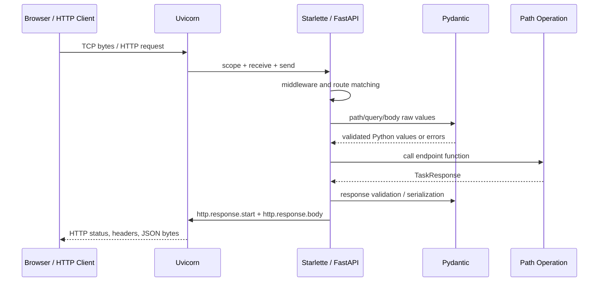

# FastAPI 第一课：ASGI、应用生命周期、路由、请求验证与第一个 API

> 版本基线：FastAPI 0.139.0、Pydantic 2.13.4、Starlette 1.3.1、Uvicorn 0.51.0、httpx2 2.7.0；Python 3.11+。示例已在 CPython 3.13.4 的隔离虚拟环境中完成 6 项 HTTP 测试。

## 1. 为什么第一个 API 不能只从 decorator 开始

下面三行能返回 JSON：

```python
app = FastAPI()

@app.get("/")
async def root():
    return {"hello": "world"}
```

但如果不知道谁监听端口、谁解析 HTTP、为什么调用 `app`、参数怎样从网络变成 Python 对象、异常怎样变成响应，就很容易产生误解：

- 以为 FastAPI 自己就是 production server；
- 在 async route 中调用 blocking SDK，卡住整个 event loop；
- 把静态类型注解当网络输入校验；
- 返回原始 Response 后还以为 response model 会过滤秘密字段；
- 每个 worker 创建独立内存“数据库”，却期待共享数据；
- 测试没执行 lifespan，生产启动才发现资源未初始化；
- 把所有错误都返回 HTTP 200，前端只能解析 message 猜成功与否。

本课先建立请求从 socket 到 response 的完整因果链，再解释每一段代码为什么存在。

第一次阅读只要能说清：Uvicorn 接收连接，FastAPI 匹配路由，Pydantic 校验外部数据，path operation 执行业务，响应模型约束输出；lifespan 在进程启动和关闭时管理共享资源。ASGI 消息细节、严格转换和完整 OpenAPI 边界用于第二遍理解。

## 2. 本课目标

完成本课后，应能解释：

- HTTP server、ASGI server、ASGI application 与 web framework 的边界；
- FastAPI、Starlette、Pydantic、Uvicorn 分别负责什么；
- `scope / receive / send` 如何描述一次 ASGI connection；
- module import、application factory 和 server 启动的执行顺序；
- lifespan 为什么拥有共享资源的创建与释放；
- path operation 如何完成 route matching 和 parameter source inference；
- Pydantic request model 的解析、转换、约束和 extra policy；
- response model 为什么既是 schema 又是运行时输出边界；
- HTTP 201、404、422、Location header 与稳定错误 body 的合同；
- TestClient 如何在不绑定真实端口时执行完整 ASGI 请求；
- process-local store、async lock 和多 worker 的真实限制。

## 3. HTTP 请求经过哪些层



这是逻辑图。HTTP parser、middleware、dependency graph、exception handler 和 serializer 还有更多内部步骤，但职责方向不变。

## 4. 四个核心组件的边界

### Uvicorn

ASGI server：监听 socket，解析 HTTP/WebSocket，把协议事件转换为 ASGI call，并把应用发送的事件写回网络。它管理 server process、event loop、connection 和 graceful shutdown 选项。

### Starlette

ASGI web toolkit：提供 routing、Request/Response、middleware、WebSocket、TestClient、background task 等 web 基础能力。

### Pydantic

数据解析与验证：根据 model schema 把输入转换为 Python 对象、执行约束并产生结构化 validation error；也帮助 response serialization / JSON Schema。

### FastAPI

在 Starlette 和 Pydantic 之上，把 Python type hint、dependency declaration、path operation metadata 连接成请求解析、验证、调用、response model 和 OpenAPI 文档。

FastAPI 官方也明确说明 web 部分依赖 Starlette、数据部分依赖 Pydantic。框架组合不意味着可以忽略传递依赖版本。

## 5. Framework 不是 Server

`FastAPI()` 创建的是 ASGI application object，没有自行监听 8000 端口。运行：

```bash
uvicorn learning_api.app:app --reload
```

含义：

1. shell 启动 Uvicorn；
2. Uvicorn import `learning_api.app` module；
3. 从 module 读取名为 `app` 的 ASGI application；
4. 建立 event loop 和 listener；
5. 执行 lifespan startup；
6. 接受 request 并调用 app；
7. shutdown 时执行 lifespan cleanup。

`--reload` 适合本地开发：watcher 发现文件变化后重启 worker。它不是 production 容错或零停机部署方案，也不应与多 worker 配置随意混用。

## 6. ASGI 是应用与协议服务器的调用合同

ASGI 3 application 的概念形状：

```python
async def application(scope, receive, send):
    ...
```

- `scope`：connection 生命周期内固定的 metadata，如 type、method、path、headers、client/server；
- `receive()`：异步取得 client/connection 发送的 event；
- `send(message)`：异步把 response/WebSocket event 交给 server。

HTTP application 常收到 `scope["type"] == "http"`，再读取 `http.request` event，发送 `http.response.start` 和一个或多个 `http.response.body`。

FastAPI 隐藏了低层 event plumbing，但 middleware、streaming、disconnect 和 deployment troubleshooting 仍需要这套模型。

## 7. ASGI 与 WSGI 的关键差异

WSGI 以同步 callable 为中心，建立在传统 request/response 模型上。ASGI 将 application 定义为 async callable，并用 event message 支持：

- long-lived connection；
- WebSocket；
- streaming；
- application lifespan；
- concurrent async I/O。

ASGI 不保证业务自动非阻塞。若 endpoint 调用 `time.sleep()` 或同步数据库 driver，event-loop thread 仍会卡住。

## 8. HTTP scope 与 request body 不在同一位置

method、path、query string、headers 位于 scope；body 通过 receive events 流入。这解释了为什么大文件上传/streaming 不能被简单理解为“框架一开始就有完整 bytes”。

FastAPI/Pydantic 的普通 body model 通常要求先读取并解析完整 JSON。真正 streaming endpoint 要使用 Request/UploadFile/StreamingResponse 等不同 API，并重新考虑 body size、disconnect、backpressure 和 cleanup。

## 9. Lifespan 解决应用级资源所有权

数据库 pool、HTTP client、model、cache client 应在 worker application 启动时创建一次，在 shutdown 时有序关闭，而不是：

- module import 时连接外部系统；
- 每个 request 创建新 pool；
- process exit 时依赖垃圾回收碰运气。

FastAPI 推荐传入 async context manager：

```python
@asynccontextmanager
async def lifespan(app: FastAPI):
    resource = await open_resource()
    app.state.resource = resource
    try:
        yield
    finally:
        await resource.close()
```

yield 前是 startup；yield 后是 shutdown。只有 startup 成功完成，应用才应开始正常服务。

## 10. Lifespan 与 request scope 不同

Application lifespan 通常覆盖一个 application process 的整个运行期；request dependency/context 只覆盖一次 request。

数据库 **pool** 属于 app lifespan；从 pool checkout 的 **connection/transaction** 通常属于 request/use-case scope。把 connection 放 app.state 让所有 request 共享，会制造并发与事务边界问题。

多个 server worker 是多个 process，每个 worker 都会执行 lifespan 并创建自己的 pool/model/store。因此总连接数约为每 worker pool 容量之和，部署容量必须整体计算。

## 11. 本课 lifespan 实现

完整 application：

<<< ../../../examples/python/fastapi-first-api/learning_api/app.py{python:line-numbers} [app.py]

本课在 startup：

- 创建 TaskStore；
- 绑定到 `application.state.task_store`；
- 把 ready 标记设为 True。

在 shutdown：

- ready 设回 False；
- await store.close 清理内存状态。

`app.state` 是便利的动态 namespace，不提供静态字段合同。规模增大后应通过 dependency function 和 typed container 封装访问；下一课深入 FastAPI dependency injection。

## 12. Application factory 为什么重要

```python
def create_app() -> FastAPI:
    application = FastAPI(...)
    ...
    return application

app = create_app()
```

兼顾两种用途：

- Uvicorn 用 import string 找到 module-level `app`；
- 每个测试调用 create_app 得到隔离 routing/state/lifespan。

如果所有测试共享一个 global app 和内存 store，测试顺序会污染 id/数据。Factory 也允许未来按 settings 构造，但不要把 production secret 默认硬编码进函数。

## 13. Import-time side effect 的风险

module-level `app = create_app()` 会在 import 时建立 route table，却没有连接数据库；真正 resource acquisition 在 lifespan 才发生。这条边界很重要：

- CLI、test collector、type checker 可以 import module；
- reload process import 不会抢占外部资源；
- startup 失败能由 server lifecycle 正确报告；
- shutdown 有对应清理。

Route registration 是可接受的本地构造；网络连接、后台 task、migration 不应藏在 import top level。

## 14. Route 是 method + path pattern 的匹配合同

```python
@application.get("/api/tasks/{task_id}")
```

只有 GET 且 path 符合 pattern 才匹配。HTTP method 不是函数命名装饰：

- GET 读取 resource，通常应安全且幂等；
- POST 创建/执行命令，通常不天然幂等；
- PUT 以完整 representation 替换，语义上幂等；
- PATCH 部分更新；
- DELETE 删除，语义上通常幂等。

真实 API 要按 resource semantics 设计，不以“前端调用方便”把所有操作写 POST。

## 15. Route 顺序可能影响匹配

固定 path 与动态 path：

```python
@app.get("/users/me")
@app.get("/users/{user_id}")
```

通常必须先声明固定 `/users/me`，否则动态 route 可能把 `me` 当 user_id。不要依赖 validation 失败后自动尝试下一条 route。

本课 tasks 没有冲突，但大型项目应通过 prefix、router 和明确 path 设计减少 ambiguity。

## 16. FastAPI 如何判断参数来源

```python
async def get_task(task_id: int, request: Request) -> TaskResponse:
```

- 名称出现在 path template：path parameter；
- scalar type 且不在 path：默认 query parameter；
- Pydantic model：默认 request body；
- Request/Response 等 framework type：framework 注入；
- `Depends(...)`：dependency graph；
- Header/Cookie/Body/Query/Path：显式 metadata 改变来源/约束。

这是框架对 signature 的解释，不是 Python 自身调用规则。重命名参数可能改变绑定是否成功。

## 17. Path parameter 从字符串开始

HTTP path `/api/tasks/42` 中的 `42` 是 URL 文本。FastAPI/Pydantic 根据 `task_id: int` 尝试解析为 Python int：

1. route pattern 匹配 path segment；
2. validation layer 接收字符串；
3. 转换成功，endpoint 得到 int 42；
4. `not-an-integer` 转换失败，endpoint 不执行；
5. RequestValidationError 进入 handler，返回 422。

类型注解触发的是框架构建的运行时 pipeline；离开 FastAPI 直接调用 `get_task("x", request)`，Python 不会自动转换。

## 18. Request body 为什么用 Pydantic model

<<< ../../../examples/python/fastapi-first-api/learning_api/models.py{python:line-numbers} [models.py]

`TaskCreate` 同时表达：

- title 必填且是 str；
- strip 首尾 whitespace；
- 长度 1–120；
- priority 默认 1；
- priority 范围 1–5；
- 未声明字段拒绝。

从网络 JSON 到 endpoint：JSON parser 得到普通 Python value → Pydantic 根据 core schema 验证/转换 → 成功创建 TaskCreate → endpoint 执行。失败时 endpoint 根本不会被调用。

## 19. Coercion 与 strict validation

Pydantic 默认在很多场景尝试合理转换，例如某些数字字符串到数字。方便不等于所有 API 都应该宽松。

边界选择：

- query/path 本质来自文本，转换到 int 通常合理；
- JSON body 若合同要求 number，是否接受 string number 要明确；
- 身份、金额、安全字段可能需要 strict type；
- 空白规范化应显式；
- 不能把“Pydantic 接受了”当领域规则已满足。

本课用 Field range 和 extra forbid 建立明显合同；后续会系统讲 strict model、validator 和 domain mapping。

## 20. `extra="forbid"` 为什么重要

默认忽略未知字段可能隐藏前端 typo：

```json
{"title": "Learn", "priorty": 5}
```

如果 `priorty` 被忽略，priority 默认为 1，request 看似成功却语义错误。forbid 让 schema 漂移尽早暴露，测试确认错误 type 为 `extra_forbidden`。

兼容 public API 升级时，是否拒绝 extra 是产品合同选择；不是所有场景都必须 forbid，但不能无意识使用默认值。

## 21. Pydantic model 不是 Domain Entity

TaskCreate/TaskResponse 属于 HTTP transport contract；TaskRecord 是 store 内部 record。分离原因：

- client 不应控制 id/completed；
- response 不应泄漏 internal fields；
- database schema 与 public API 可独立演进；
- domain invariant 可能比单 request model 复杂；
- input/output 字段 required/optional 语义不同。

小例子可以少层，但要知道何时 coupling 会失控。不要把 ORM entity 直接作为所有 request body 和 response。

## 22. Response model 是输出防火墙

`response_model=TaskResponse` 或 return annotation 让 FastAPI：

- 建立 OpenAPI response schema；
- 验证/序列化返回数据；
- 过滤未声明字段；
- 若 server 返回不满足合同的数据，暴露 server-side bug，而不是给 client 一份半正确 JSON。

Response validation 失败通常是 500 类服务端问题，不应包装成“客户端输入 422”。输入错误与服务端输出缺陷的责任方不同。

## 23. 直接返回 Response 会改变 pipeline

若 endpoint 直接返回 `JSONResponse`，FastAPI 会把它视为已经构造好的 response，通常不会再按 response_model 转换、验证或过滤。

本课需要设置 Location header，但仍希望保留 response model，因此：

```python
async def create_task(..., response: Response) -> TaskResponse:
    response.headers["Location"] = location
    return TaskResponse.model_validate(task)
```

注入的 Response object 用于 status/header metadata，返回值仍走 FastAPI serialization。只有 streaming/file/custom media 等场景才应有意返回 Response subclass，并自行承担内容合同。

## 24. `from_attributes=True` 的边界

TaskResponse 使用：

```python
model_config = ConfigDict(from_attributes=True)
```

所以 `model_validate(task_record)` 可从 dataclass/object attributes 读取字段，而非只接收 mapping。

这不是任意 ORM lazy relation 的安全序列化器。访问 attribute 可能触发 database query、session detached error 或 N+1；数据访问课程会用明确 query/projection 控制。

## 25. HTTP status 是机器可读协议

本课：

- `200 OK`：health/get 成功；
- `201 Created`：新 Task 创建成功；
- `404 Not Found`：目标 Task 不存在；
- `422 Unprocessable Content`：method/content syntax 可处理，但参数/body validation 不满足合同。

不要所有情况返回 200 + `{success:false}`。browser/fetch、proxy、monitor、generated client 和 retry policy 都依赖 status class。

## 26. 201 与 Location header

POST 创建 resource 后，201 body 返回 representation，同时：

```http
Location: /api/tasks/1
```

告诉 client 新 resource URI。Location 可以是相对 reference；是否要求 absolute 取决于 API/HTTP 使用环境。测试同时验证 status、header 和 body，因为三者共同组成合同。

201 不代表数据已跨所有异步系统最终一致；如果仅接受后台处理，可能更适合 202 Accepted + status resource。

## 27. 404 与空结果

单 resource `GET /api/tasks/999` 不存在时返回 404。不要返回 200 + null，除非 API 明确定义 null representation。

Collection query 没有元素通常是 `200 []`，不是 404，因为 collection resource 本身存在，只是结果为空。相邻概念不同：单项 identity lookup 与列表 filter。

## 28. 422 与 400 的边界

FastAPI 对 request parameter/body validation 默认使用 422。HTTP 规范中 422 当前名称是 Unprocessable Content。Malformed HTTP/JSON、media type 和业务冲突可能使用其他 status。

项目可定制 validation response，但需要：

- client SDK/前端统一约定；
- OpenAPI 同步；
- 不把 server bug 误标 client error；
- upgrade 时检查框架默认行为。

本课保留 422，只统一 body envelope。

## 29. Domain exception 与 HTTP exception

TaskStore 抛 `TaskNotFoundError`，不知道 HTTP。Application exception handler 把它转换为 404 ErrorResponse。

```text
TaskStore: task id 不存在
       ↓ domain/infrastructure error
FastAPI adapter: 映射 HTTP 404 + stable body
```

深层代码到处抛 HTTPException 会让领域逻辑绑定 transport，CLI/message consumer 无法复用。简单 endpoint 可直接 HTTPException；有明确 service/domain 层时优先在 HTTP boundary 映射。

## 30. Stable error envelope

本课 error：

```json
{
  "error": {
    "code": "task_not_found",
    "message": "Task 999 was not found",
    "details": null
  }
}
```

- code：client 稳定分支依据，不随文案变化；
- message：人类可读但不应暴露 secret/internal traceback；
- details：字段级结构化信息，可选。

前端不应解析英文 message 判断错误类别。国际化时 message 可变化，code 保持。

## 31. RequestValidationError 与 ValidationError

FastAPI 的 RequestValidationError 表示 client request 解析/校验失败，适合返回 422。业务代码/response serialization 内发生的 Pydantic ValidationError 往往意味着服务端数据或代码缺陷，应记录并返回受控 500，而不是把责任推给 client。

本课只注册 RequestValidationError handler。宽泛捕获所有 ValidationError 并返回 422 会掩盖 server bug。

## 32. `jsonable_encoder` 为什么出现

Validation detail 可能含 datetime、enum 或 Pydantic value，不一定能直接交给标准 json encoder。本课把 ErrorResponse 交给 `jsonable_encoder` 再作为 JSONResponse content。

如果正常返回 Pydantic model，FastAPI 已处理 encoding；只有手工构造 Response 时才需要自己负责 JSON-compatible conversion。

不要在 error body 返回 `error.body` 原请求，它可能包含 password/token/个人数据。

## 33. Store 完整实现

<<< ../../../examples/python/fastapi-first-api/learning_api/store.py{python:line-numbers} [store.py]

TaskStore 用 asyncio.Lock 保护：读取 next id → 建立 record → 保存 → increment 这一 compound transition。即使单 event-loop thread，两个 request 也能在 await 点交错；明确 lock 让未来 transition 增加 async operation 时边界可见。

当前 get 没有 await 内部切换，dict read 在同 loop 中直接完成。保留 async signature 是为了与未来 database adapter 对齐，但不应因此误称内存读取真正异步 I/O。

## 34. In-memory store 的严格限制

它只用于第一课：

- process 重启数据丢失；
- 每个 worker 独立一份；
- 多 instance 部署彼此不可见；
- 无 transaction、durability、query；
- health ready 不等于外部数据库可用；
- lock 只保护当前 event loop 中的该 store instance。

不能用它做 production authentication、任务状态或跨 worker queue。后续使用数据库和 migration。

## 35. Health、Liveness 与 Readiness

本课 `/health` 返回 ready，只用于展示 lifespan 已运行。生产通常区分：

- liveness：process/event loop 是否需要重启；
- readiness：是否应接收流量；
- startup probe：慢启动应用何时完成初始化。

Readiness 检查外部依赖时要有短 timeout/cache，避免健康检查本身压垮数据库。Liveness 不应因为短暂数据库故障不断重启所有实例。

## 36. `async def` 与 `def` path operation

FastAPI 官方建议：调用支持 await 的 async library 时写 async def；调用没有 await 支持的 blocking library 时可写普通 def，FastAPI 会在线程池执行普通 path operation/dependency，避免直接阻塞 event loop。

边界：

- async def 内直接调用 blocking function 仍阻塞 loop；
- async def 调用普通 helper 不会自动转线程池；
- def route 中不能直接 await；
- thread pool 也需要容量和 timeout；
- CPU-heavy 工作不应长期占用 web worker。

本课 store API 是 async，因此 route 用 async def。

## 37. OpenAPI 从哪里产生

FastAPI 汇总：

- path/method；
- function parameter source/type/constraint；
- request Pydantic JSON Schema；
- response_model；
- status、tags、responses metadata；
- application title/version。

生成 `/openapi.json`，Swagger UI `/docs` 和 ReDoc `/redoc` 消费该 schema。OpenAPI 也是 generated client、contract testing 和 API governance 的基础。

## 38. OpenAPI 不自动保证实现正确

若手工声明 `responses={404: {"model": ErrorResponse}}`，只是 documentation metadata；实际 handler 仍可能返回其他 shape。测试必须验证 runtime response。

反过来，实际返回 404 但未声明，client generation 不知道这个合同。文档与实现需要双向验证。

本课测试检查 paths 和 TaskCreate/TaskResponse/ErrorResponse component schema 都出现。

## 39. API docs 的生产边界

Swagger UI 方便本地理解和手工调用，但：

- 不是自动化测试替代品；
- production 是否开放需安全策略；
- docs route 可能泄漏内部 endpoint/schema；
- reverse proxy root path/host 会影响 Try it out URL；
- OAuth flow 需要正确配置。

不要仅因为 `/docs` 能调用就认为 proxy、CORS、auth 和 deployment 已正确。

## 40. TestClient 没有启动真实 TCP server

Starlette TestClient 通过 in-process ASGI transport 调用 application，提供同步 HTTP client 风格：

```python
with TestClient(app) as client:
    response = client.get("/health")
```

它能验证 routing、validation、handler、serialization 和 lifespan，但不验证：

- Uvicorn socket/config；
- proxy headers/TLS；
- 多 worker process；
- network timeout；
- production container signal；
- 跨服务实际连接。

因此它是 application integration test，不是完整 E2E。

## 41. 为什么 TestClient 必须作为 context manager

要让 lifespan startup/shutdown 执行，测试必须进入 TestClient context。仅 `client = TestClient(app)` 后直接请求，在不同版本/用法下不能假设 lifespan 已运行。

本课 setUp `__enter__`，tearDown `__exit__`，每个 test 都有新 app/store。更常见 pytest 写 fixture `with TestClient(...) as client: yield client`，原理相同。

## 42. Test client 依赖的现实版本变化

本课核对时：

- FastAPI 0.139.0 解析 Starlette 1.3.1；
- Starlette TestClient 优先导入 httpx2；
- 只安装 httpx 0.28.1 仍能 fallback，但发出 StarletteDeprecationWarning；
- 安装 httpx2 2.7.0 后 warning 消失；
- FastAPI testing 教程页面当时仍写安装 httpx。

因此 pyproject 使用 `httpx2>=2.7,<3`。这是 2026-07-15 的已验证组合，不是永久规则。升级时查看 FastAPI/Starlette release notes，并在 clean environment 运行测试。

## 43. 完整测试代码

<<< ../../../examples/python/fastapi-first-api/tests/test_api.py{python:line-numbers} [test_api.py]

六项测试验证：

- lifespan 使 health ready；
- POST 201、Location、body normalization；
- 随后 GET 得到同一 representation；
- extra body field 返回稳定 422 envelope；
- path int 转换失败使用同一 envelope；
- missing resource 返回 404 domain error；
- OpenAPI paths/components 存在。

最后两项在一个测试中同时覆盖 schema paths 和 components，因此 unittest 总数仍为 6。

## 44. Project configuration

<<< ../../../examples/python/fastapi-first-api/pyproject.toml{toml:line-numbers} [pyproject.toml]

版本范围固定 minor line：

- FastAPI `>=0.139,<0.140`；
- Uvicorn `>=0.51,<0.52`；
- test extra 中 httpx2 `>=2.7,<3`。

范围不是 lockfile。应用部署仍应使用统一 lock/constraints，把 transitive Starlette/Pydantic/AnyIO 也解析成可重现版本，并在升级 PR 中运行测试。

## 45. Package export

<<< ../../../examples/python/fastapi-first-api/learning_api/__init__.py{python:line-numbers} [__init__.py]

Uvicorn 推荐直接 import `learning_api.app:app`，因为 package `__init__` 只是 public convenience。不要让多个不同 import path 各自创建不一致 application instance。

## 46. 安装和运行

```bash
cd examples/python/fastapi-first-api
python3 -m venv .venv
source .venv/bin/activate
python -m pip install -e '.[test]'
uvicorn learning_api.app:app --reload
```

验证 health：

```bash
curl -i http://127.0.0.1:8000/health
```

创建 task：

```bash
curl -i \
  -H 'Content-Type: application/json' \
  -d '{"title":"Learn ASGI","priority":3}' \
  http://127.0.0.1:8000/api/tasks
```

打开：

- `http://127.0.0.1:8000/docs`
- `http://127.0.0.1:8000/redoc`
- `http://127.0.0.1:8000/openapi.json`

## 47. 运行测试

```bash
.venv/bin/python -m unittest discover -v
.venv/bin/python -m compileall -q learning_api tests
```

本课实际安装版本：

```text
FastAPI  0.139.0
Pydantic 2.13.4
Starlette 1.3.1
Uvicorn  0.51.0
httpx2   2.7.0
```

`.venv` 已由 `.gitignore` 排除，不进入提交。

## 48. 请求成功路径完整因果链

POST `/api/tasks`：

1. Uvicorn 收到 HTTP bytes；
2. 建立 ASGI HTTP scope/event；
3. FastAPI/Starlette 匹配 POST route；
4. 读取 JSON body；
5. Pydantic 验证 TaskCreate，strip title；
6. endpoint 获取 lifespan store；
7. store lock 内分配 id 并保存；
8. endpoint 设置 Location header；
9. 返回 TaskResponse；
10. FastAPI 按 response model 验证/序列化；
11. server 发送 201、headers 和 JSON body。

任何一步失败都应在对应边界转换，而不是返回半完成结果。

## 49. 请求失败路径完整因果链

GET `/api/tasks/not-an-integer`：

1. route path pattern 匹配；
2. Pydantic 无法把 segment 解析为 int；
3. endpoint/store 完全不执行；
4. FastAPI 产生 RequestValidationError；
5. custom handler 构造 ErrorResponse；
6. jsonable_encoder 生成 JSON-compatible 内容；
7. 返回 422。

GET `/api/tasks/999` 则不同：int validation 成功，endpoint/store 执行，store 抛 TaskNotFoundError，domain handler 返回 404。

422 与 404 的差异来自失败发生的阶段和责任方。

## 50. 前端 fetch 对照

```javascript
const response = await fetch('/api/tasks', {
  method: 'POST',
  headers: { 'Content-Type': 'application/json' },
  body: JSON.stringify(payload)
})

const body = await response.json()
if (!response.ok) {
  handleApiError(body.error.code, body.error.details)
}
```

`fetch` 对 404/422 不会自动 reject；只有网络层失败通常才 reject。前端必须检查 `response.ok/status`，再按 stable error code 处理。

Vue form validation 改善 UX，但不能替代后端校验：client 可绕过，版本可过期，恶意调用者不受 UI 限制。

## 51. Node/Express 对照

- Uvicorn 类似 HTTP server/runtime adapter，FastAPI 更像带 schema/DI 的 application framework；
- Express middleware/router 与 Starlette middleware/router 有相似 pipeline 概念；
- TypeScript interface 默认不验证 JSON，Pydantic model 会执行 runtime validation；
- Node event loop 与 asyncio 都怕 blocking CPU/sync I/O；
- Express 直接 `res.status().json()` 类似返回 JSONResponse，会由开发者自行承担 response shape；
- FastAPI response_model 提供额外输出验证/过滤。

不要把 Pydantic 当 TypeScript compiler，也不要把 OpenAPI 当真实请求测试。

## 52. 与 Spring Boot 第一课对照

- Uvicorn + ASGI application 对应 servlet container/web server + Spring application 的部分边界，但 runtime model 不同；
- FastAPI lifespan 类似 application-level resource lifecycle，Spring Bean lifecycle 由 container 管理；
- Pydantic request model 类似 DTO + Bean Validation，但 conversion/error semantics 不同；
- exception handler 类似 `@ControllerAdvice`；
- response_model 同时影响 OpenAPI 和输出过滤，Spring 常由 Jackson DTO serialization + OpenAPI library 组合；
- FastAPI dependency system 与 Spring IoC 都能注入，但 scope、discovery 和 proxy 完全不同。

对照用于理解职责，不追求注解一一翻译。

## 53. 常见反模式

### 53.1 在 module import 时连接数据库

reload/test/import 都触发，且无可靠 cleanup。放 lifespan。

### 53.2 async route 调同步 blocking client

event loop 卡住。使用 async client，或明确普通 def/thread adapter 并限制容量。

### 53.3 input model 直接作为 response

可能暴露 client 不该见字段，且 read/write contract 无法独立演进。分开 TaskCreate/TaskResponse。

### 53.4 直接返回 JSONResponse 又依赖 response_model

response validation/filtering 被绕过。返回 model/value，或明确承担 Response 内容合同。

### 53.5 捕获所有 ValidationError 返回 422

把 server response/内部数据 bug 伪装成 client 错误。只映射 request validation。

### 53.6 全部错误 HTTP 200

proxy、monitor、frontend 和 generated client 无法按协议判断。使用准确 status。

### 53.7 app.state 变成全局杂物箱

依赖不可见、类型不清、测试难替换。通过小 dependency/provider 封装。

### 53.8 把内存 store 当多 worker database

每 process 独立且重启丢失。生产状态放外部持久系统。

## 54. 工程检查清单

- Framework 与 ASGI server 分离；
- 理解 scope/receive/send；
- import-time 只做本地 application/route 构造；
- 外部资源由 lifespan 创建和关闭；
- 多 worker 资源容量按总 process 数计算；
- route method/path 体现 resource semantics；
- 固定 route 优先于可能冲突的 dynamic route；
- path/query/body 来源清楚；
- request model 明确 extra、strict/coercion 和 value constraint；
- transport model 与 domain/database model 分离；
- response_model 验证并过滤输出；
- 直接 Response 是有意绕过，不是默认捷径；
- 201 返回 Location；
- 404、422、500 责任边界正确；
- stable error code 不依赖 message 文案；
- request validation 不泄漏敏感 body；
- OpenAPI documentation 与 runtime test 同步；
- TestClient 使用 context 执行 lifespan；
- 每测试使用新 app/state；
- application test 不冒充 Uvicorn/proxy E2E；
- async route 内没有 blocking call；
- in-memory store 限制写入文档；
- dependency/transitive 版本在 clean venv 验证；
- 弃用 warning 当升级信号处理；
- `.venv` 不提交。

## 55. 本课结论

- FastAPI 是 ASGI application framework，Uvicorn 是监听网络并调用应用的 ASGI server。
- ASGI 通过 scope、receive、send 解耦 protocol server 与 async application。
- Starlette 提供 web primitives，Pydantic 提供数据解析/验证，FastAPI 把类型声明连接到请求、响应与 OpenAPI。
- Lifespan 拥有 process-level resource lifecycle；每个 worker 都有独立实例。
- Path operation signature 决定 path/query/body/framework 注入来源，但这是 FastAPI 运行时解释，不是 Python 自动强制。
- Request model 在 endpoint 前解析输入；response model 在 endpoint 后验证/过滤输出。
- 直接返回 Response 会绕过正常 response-model pipeline，设置 header 时可注入 Response 后仍返回 model。
- HTTP status、headers、body 和 error code 共同组成 API 合同。
- RequestValidationError 是 client request 问题；内部/response ValidationError 通常是 server bug。
- TestClient 验证 in-process ASGI application，不验证真实 socket、proxy 和多 worker。
- 当前 FastAPI/Starlette 组合已迁移 TestClient backend 到 httpx2，版本升级必须结合实际 dependency graph 验证。

下一节：[FastAPI 参数绑定、Annotated、Pydantic、依赖注入、配置与模块化路由](/backend/fastapi/annotated-pydantic-dependencies-settings-and-modular-routing)。

## 56. 参考资料

- [FastAPI 官方文档](https://fastapi.tiangolo.com/)
- [FastAPI：First Steps](https://fastapi.tiangolo.com/tutorial/first-steps/)
- [FastAPI：Concurrency and async / await](https://fastapi.tiangolo.com/async/)
- [FastAPI：Lifespan Events](https://fastapi.tiangolo.com/advanced/events/)
- [FastAPI：Request Body](https://fastapi.tiangolo.com/tutorial/body/)
- [FastAPI：Response Model](https://fastapi.tiangolo.com/tutorial/response-model/)
- [FastAPI：Handling Errors](https://fastapi.tiangolo.com/tutorial/handling-errors/)
- [FastAPI：Testing](https://fastapi.tiangolo.com/tutorial/testing/)
- [ASGI Specification](https://asgi.readthedocs.io/en/latest/specs/main.html)
- [ASGI HTTP and WebSocket Specification](https://asgi.readthedocs.io/en/latest/specs/www.html)
- [ASGI Lifespan Specification](https://asgi.readthedocs.io/en/latest/specs/lifespan.html)
- [Uvicorn Settings](https://www.uvicorn.org/settings/)
- [Pydantic Models](https://docs.pydantic.dev/latest/concepts/models/)
- [Pydantic Fields](https://docs.pydantic.dev/latest/concepts/fields/)
- [Pydantic Configuration](https://docs.pydantic.dev/latest/api/config/)
- [Starlette TestClient](https://www.starlette.io/testclient/)
- [FastAPI 0.139.0 on PyPI](https://pypi.org/project/fastapi/)
- [Pydantic 2.13.4 on PyPI](https://pypi.org/project/pydantic/)
- [Uvicorn 0.51.0 on PyPI](https://pypi.org/project/uvicorn/)
- [httpx2 2.7.0 on PyPI](https://pypi.org/project/httpx2/)
