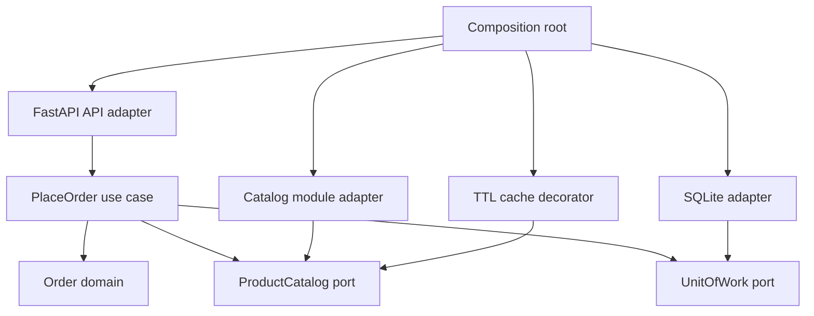
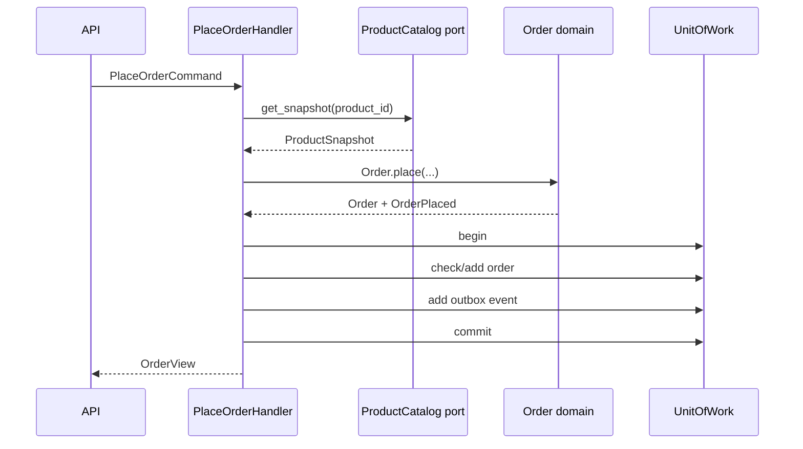

# 后端架构、分层、模块边界、领域模型、Repository、事件、缓存与演进

项目变大后，把所有 path operation 拆进 `routers/` 只能解决“文件太长”，不能解决业务规则散落、事务边界不清和模块互相修改数据库的问题。真正的架构不是目录名称，而是：一次业务变化需要改哪些地方、哪些依赖被允许、状态由谁拥有、失败后哪些修改必须一起回滚。

本课用“商品目录 + 订单”模块建立一个演进式模块化单体：



箭头表示代码依赖。核心业务不知道 FastAPI、SQLite 或另一个业务模块的内部类型；最外层 composition root 认识所有实现并完成连接。

> 版本基准：Python 3.11+、FastAPI 0.139.x、Pydantic 2.13.x、Uvicorn 0.51.x。示例用标准库 SQLite 展示 transaction/UoW，不重复 SQLAlchemy 教程。生产 schema 仍应由独立 Alembic migration 管理。

## 1. 为什么需要架构，而不是为什么需要更多文件夹

架构的直接价值是降低变化传播和错误半径。例如“下单时冻结商品名称与价格”包含这些决定：

- HTTP body 怎样校验；
- 商品不存在或已下架如何表达；
- 订单实体必须满足什么 invariant；
- 商品价格快照保存在哪里；
- 订单与 `order.placed` 事件能否原子提交；
- 重复 order id 映射为何种协议错误；
- 商品读取是否缓存、缓存旧值能接受多久。

如果 route 直接查表、算价格、写订单、发消息和构造 response，任何一个变化都会穿透整个函数。测试也只能通过 HTTP + 真数据库验证所有规则，反馈慢且失败原因含混。

但小型 CRUD 也不需要先创造十层 abstraction。判断依据不是代码行数，而是业务规则、团队并行、变化频率、外部依赖和一致性复杂度。架构是为了管理真实耦合，不是追求 pattern 数量。

## 2. Coupling 与 cohesion

**cohesion（内聚）**描述相关职责是否聚在一起；**coupling（耦合）**描述一个部分变化时其他部分被迫变化的程度。

按技术类型全局分目录：

```text
routers/
services/
models/
repositories/
```

看似分层，但一个订单功能散落在四个全局目录；团队需要跨越整个仓库理解它。按业务能力先分模块：

```text
catalog/
orders/
identity/
billing/
```

每个模块内部再放 domain、application、adapter，更容易让订单变化主要留在订单边界内。

高内聚不等于“所有订单代码必须在一个文件”；低耦合也不等于“模块之间完全不通信”。目标是通过窄而稳定的合同通信。

## 3. 模块化单体、分层单体和微服务

准确区分：

- **单体**：作为一个 deployment unit 发布，不表示代码一定混乱；
- **分层单体**：通常按 presentation/service/data 横向分层；
- **模块化单体**：同一进程/发布单元内，按业务能力建立所有权与依赖规则；
- **微服务**：模块成为独立进程、独立发布和网络边界，带来分布式失败与数据一致性成本。

模块化单体保留进程内调用、单步调试和本地事务的简单性，又能训练清晰边界。它不是“以后一定拆微服务”的临时失败品；很多系统长期保持模块化单体更经济。

微服务的独立部署只有在团队自治、扩缩容差异、故障隔离或合规边界确有价值时才抵消网络、observability、版本兼容、消息、幂等和运维成本。

## 4. 四类代码职责与依赖方向

本课使用四个角色，而非要求固定四层目录：

| 角色 | 负责 | 不负责 |
| --- | --- | --- |
| Presentation/API | HTTP parsing、认证入口、status、DTO | 业务 invariant、SQL |
| Application/use case | 编排一次业务动作、transaction boundary | HTTP、具体数据库 |
| Domain | entity、value、invariant、domain event | FastAPI、Pydantic、SQLite |
| Infrastructure/adapter | repository、cache、broker、外部 API | 决定业务政策 |

依赖方向指向更稳定的业务核心：

```text
API → application → domain
infrastructure → application/domain ports
composition root → all concrete implementations
```

“底层”这个词容易误导。数据库在运行拓扑上是底层基础设施，但在 source dependency 上，业务核心不应依赖具体 database API。

## 5. Dependency Injection 与 Dependency Inversion 不相同

**Dependency Injection**是“对象不自己创建依赖，由外部传入”的构造方式。FastAPI `Depends` 能解析 request-scope dependency graph。

**Dependency Inversion Principle**是 source dependency 的方向：高层业务规则依赖抽象合同，具体数据库也依赖/实现该合同。

可以使用 DI 却没有 inversion：

```python
class OrderService:
    def __init__(self, repository: SqliteOrderRepository): ...
```

它虽然从外部注入，但 application 仍直接依赖 SQLite class。示例 handler 依赖自己模块定义的 `ProductCatalog` 与 `UnitOfWorkFactory` Protocol：

<<< ../../../examples/python/fastapi-modular-monolith/modular_api/orders/ports.py

Python `Protocol` 提供 structural typing：实现者不必继承基类，只要静态类型上具有所需成员。Protocol 不会自动验证业务语义；测试仍要证明 transaction、错误和生命周期合同。

## 6. Domain model 的边界

领域模型表示业务概念和必须始终成立的规则，不是数据库表的别名，也不是 Pydantic request model。

<<< ../../../examples/python/fastapi-modular-monolith/modular_api/orders/domain.py

`Order.place()` 建立因果链：

1. quantity 与 price 先通过 invariant；
2. 创建 `placed` 状态订单；
3. total 从 unit price × quantity 得到；
4. 记录 `OrderPlaced` domain event；
5. 由 application layer 决定怎样持久化和发布意图。

### Entity、Value Object 与 Aggregate

- **entity**由 identity 和生命周期区分；两个字段相同的订单，order id 不同仍是不同 entity；
- **value object**由值本身定义，通常 immutable，例如 Money、Address；示例简化为 `Decimal`；
- **aggregate**是一组由 aggregate root 保护一致性的对象；外部通过 root 修改；
- **invariant**是在 transaction/状态转换边界必须成立的条件。

不是每个 table 都是 aggregate，也不是每个 dataclass 都是 value object。aggregate 不应无限扩大，否则每次操作都锁住大量状态。

示例使用 `Decimal` 而非 float 表示价格，但完整 Money value object 还应携带 currency、rounding 和最小货币单位规则。

## 7. DTO、Domain Object 与 Persistence Model 不应混用

三种模型服务不同边界：

- request/response DTO 定义外部 HTTP contract；
- domain object 承载业务行为与 invariant；
- persistence model/row 定义数据库映射和加载策略。

把 SQLAlchemy object 直接作为 response 会让 lazy loading、内部 column、relationship 和 schema evolution 泄漏进 API。把 Pydantic request object 传遍 domain 则让业务规则依赖 HTTP shape。

示例 API 显式映射：

<<< ../../../examples/python/fastapi-modular-monolith/modular_api/orders/api.py

重复映射代码不是天然浪费；它把边界变化隔离。可以抽取稳定 mapper，但不要用“自动映射一切”重新耦合所有模型。

## 8. Application service / Use case 负责编排

`PlaceOrderHandler` 描述一个完整业务动作：

<<< ../../../examples/python/fastapi-modular-monolith/modular_api/orders/application.py

执行过程：



application service 不应只是给 repository CRUD 换名字。它定义 transaction boundary、调用顺序、权限后的业务动作、错误语义和 port 协作。

商品读取在订单 transaction 前完成，避免把潜在远程调用放进数据库 transaction 长时间持锁。代价是读取后商品可能变化；订单保存 price/name snapshot，明确下单时看到的报价。真实系统还要决定报价版本、有效期和库存并发策略。

## 9. Repository 是 aggregate 集合抽象，不是万能 DAO

Repository 让 application 以业务概念加载/保存 aggregate。它不一定要提供所有表的通用：

```text
create / get / list / update / delete / filter / raw_query
```

“万能 GenericRepository”往往把 ORM query language 偷渡回 application，并隐藏不同 aggregate 的加载、锁和性能语义。

订单 port 只声明当前 use case 需要的 `get()` 和 `add()`。复杂 read model 可以使用专门 query service/SQL projection，不必强迫所有查询先重建完整 aggregate。这是 CQRS 思想的轻量形式：command model 与 query model可以不同，不表示必须引入两个数据库或消息系统。

SQLite adapter 完成 row 与 domain 的映射：

<<< ../../../examples/python/fastapi-modular-monolith/modular_api/orders/sqlite.py{42-65}

## 10. Unit of Work 把 transaction boundary 显式化

Unit of Work 代表“一组必须一起提交或一起回滚的修改”。SQLAlchemy `Session` 本身具有 unit-of-work 行为，但 application 仍需要知道一次业务 use case 的 transaction scope。

<<< ../../../examples/python/fastapi-modular-monolith/modular_api/orders/sqlite.py{87-114}

本例 context manager 的因果链：

1. `__enter__` 打开 connection 和 transaction；
2. 构造共享同一 connection 的 order repository 与 outbox；
3. handler 完成所有写入；
4. 只有显式 `commit()` 才提交；
5. exception 或未 commit 时 `__exit__` rollback；
6. connection 无论成功失败都关闭。

注意标准库 `sqlite3.Connection` 的 context manager 管理 transaction，但**不会关闭 connection**。示例的初始化/计数用 `contextlib.closing`，UoW 在 `__exit__` 显式 `close()`；第一轮测试正是通过 `ResourceWarning` 检出了这一边界。

生产 SQLAlchemy 常用 `with Session.begin():` 管理 transaction，同时 Session 生命周期也要由 context manager/依赖关闭。不要把一个 Session 作为全局 singleton 跨 request 共享。

## 11. Domain Event、Integration Event 与消息发布

`OrderPlaced` 首先是 domain 内发生事实的表示。相邻概念：

- **domain event**：描述本领域已发生的业务事实，可在同一进程内触发规则；
- **integration event**：对模块/服务外发布的稳定、版本化合同；
- **message**：运输载体，可能承载 event 或 command；
- **outbox row**：尚待可靠 relay 的发布意图。

不要直接把 domain dataclass 序列化成永久外部协议；domain 字段会随内部重构变化。跨模块/服务发布前应映射为明确的 integration schema。

示例在同一 UoW 中写 order 与 outbox：

<<< ../../../examples/python/fastapi-modular-monolith/modular_api/orders/sqlite.py{68-84}

如果 outbox adapter 失败，整个 transaction 回滚，测试证明 order 不会单独留下。relay、至少一次交付和消费端幂等沿用第 7 课结论。

## 12. 模块之间如何同步协作

订单模块需要商品信息，但不能直接读取 catalog table 或 import catalog repository。否则 catalog 无法改变 schema，订单也绕开商品可见性规则。

订单模块声明 consumer-owned port：

```python
class ProductCatalog(Protocol):
    def get_snapshot(self, product_id: str) -> ProductSnapshot | None: ...
```

composition boundary 中的 adapter 同时认识 catalog public service 与 orders snapshot：

<<< ../../../examples/python/fastapi-modular-monolith/modular_api/adapters.py{8-21}

这叫 **anti-corruption/translation boundary**：不是说 catalog 很“腐败”，而是防止一个模型的概念和变化直接侵入另一个模型。

同进程同步调用仍要遵守 module API；“没有网络”不等于“可以随便 import internals”。以后拆服务时 adapter 可换成 HTTP/message client，但 network timeout、partial failure 和 eventual consistency 不会自动解决。

## 13. 同步调用还是事件

选择依据是业务时间关系和一致性，不是“event-driven 更高级”：

- 下单必须立即知道商品是否存在：同步 query 合理；
- 下单成功后更新 analytics：异步 event 合理；
- 扣库存是否必须与订单强一致：需要明确 aggregate/transaction ownership，不能仅换成消息后忽略 oversell；
- client 需要立即结果：同步 API 或 job status contract；
- downstream 暂时失败不应阻止核心 transaction：outbox + async consumer。

event 会降低时间耦合，却增加 schema version、ordering、duplicate、lag、replay 和 observability 成本。同步调用简洁，却让 availability/latency 链相乘。

## 14. Composition Root 是唯一“知道太多”的地方

composition root 负责创建 concrete object graph：

<<< ../../../examples/python/fastapi-modular-monolith/modular_api/bootstrap.py

它：

1. 创建 catalog repository 和 service；
2. 用 adapter 转成 orders 所需 port；
3. 在 port 外包装 TTL cache；
4. 创建 SQLite database/UoW factory；
5. 将这些注入 `PlaceOrderHandler`；
6. 返回应用 container。

composition root import 两个模块和 infrastructure 是职责所在，不是依赖泄漏。不要让每个 use case 内部读取环境变量、创建 engine、实例化 HTTP client；那会把 object graph 分散到业务代码。

FastAPI lifespan 建 container，`APIRouter` 只从 `app.state` 取得已组装 handler：

<<< ../../../examples/python/fastapi-modular-monolith/modular_api/app.py

FastAPI `Depends` 在 presentation boundary 很合适；domain 不需要也不应知道 `Depends`。

## 15. `APIRouter` 是路由模块化工具，不是业务边界本身

FastAPI 官方使用 `APIRouter` 组织大型多文件应用。示例 catalog 和 orders 各自拥有 router，再由 app include：

```text
catalog/api.py → catalog router
orders/api.py  → orders router
app.py         → include both
```

但 router prefix/tag 只影响 HTTP 组织。若 orders route 仍直接操作 catalog table，换两个 router 并没有建立 module ownership。

反过来，一个业务模块也可以有 HTTP、message consumer、CLI 和 scheduled job 多个 inbound adapters；模块边界由 use case、state ownership 和 dependency rules 决定，不由 URL prefix 决定。

## 16. Cache 是派生副本，不是无条件的性能开关

缓存加入了另一份可能过期的状态。必须先回答：

- source of truth 是谁；
- key 是否包含 tenant、locale、permission、model/version 等所有影响结果的维度；
- stale 多久可接受；
- 更新后怎样 invalidate；
- cache miss/negative result 是否缓存；
- 同一 hot key 过期时怎样防 stampede；
- cache 故障是 bypass、fail-closed 还是 degrade；
- memory 是否有 size/eviction bound。

示例 cache 是 `ProductCatalog` port 的 decorator：

<<< ../../../examples/python/fastapi-modular-monolith/modular_api/adapters.py{22-52}

读链是：

```text
PlaceOrderHandler
→ TtlProductCatalog
→ CatalogModuleAdapter
→ CatalogService
→ ProductRepository
```

TTL 到期保证“最多大约旧一段时间”，不是精确一致性。显式 `invalidate(product_id)` 可在同进程更新后清理，但多 worker 需要 broadcast/versioned key/共享 cache；消息也可能延迟或丢，仍要有 TTL safety net。

示例也缓存 `None`，这是 negative caching，能保护不存在 hot key，却可能让刚创建商品在 TTL 内仍不可见。是否接受取决于业务合同。

## 17. Cache-aside、write-through 与 event invalidation

- **cache-aside**：应用先查 cache，miss 再查 source 并填充；简单但并发 miss 会 stampede；
- **write-through**：写 source 同时更新 cache；双写仍有失败顺序；
- **write-behind**：先写 cache 后异步落库，风险和复杂度更高；
- **event invalidation**：source commit 后发布变更事件，各实例删 key；存在 event lag，需幂等和 TTL。

缓存一致性不能比 source transaction 更强。把 cache update 放在 DB commit 前，transaction 回滚会留下不存在的新值；放在 commit 后，进程可能在更新 cache 前崩溃。常见选择是 commit 后 invalidate + outbox event + TTL。

## 18. 错误在每层怎样变化

每层用自己边界内的语言：

```text
domain: InvalidOrderError
application: ProductNotAvailableError / OrderAlreadyExistsError
infrastructure: sqlite3.IntegrityError / timeout
presentation: HTTP 404 / 409 / 422 / 503
```

不要让 domain 抛 `HTTPException`，否则相同 use case 无法自然用于 message consumer/CLI。也不要把所有异常变成 500；可预期业务冲突、输入错误、暂时基础设施失败和未知 bug 需要不同 retry/observability 合同。

示例先查询 duplicate 以给出友好错误，但并发下两个 transaction 仍可能同时看不到记录。最终正确性依赖 database unique constraint；infrastructure 还应把 unique violation 映射为 application conflict。教学 SQLite 示例覆盖顺序重复，生产 adapter 必须补并发映射。

## 19. 事务边界不能跨越任意网络

单体中 orders/outbox 同一 SQLite transaction 很容易原子提交。若 catalog 和 orders 分库/分服务，普通 local transaction 不能覆盖两边。

可选设计包括：

- 调整 aggregate ownership，让强一致状态归同一 transaction；
- snapshot/version/optimistic concurrency；
- reservation + expiry；
- saga/process manager 与 compensating action；
- outbox/inbox 和 eventual consistency；
- 在业务上接受短暂 stale/oversell 并明确补偿。

不要把“Repository abstraction”误认为它能让跨数据库 transaction 自动原子。abstraction 隐藏 API，不改变物理一致性边界。

## 20. 测试按边界提供不同证据

<<< ../../../examples/python/fastapi-modular-monolith/tests/test_architecture.py

本课测试分为：

- domain test：不启动 FastAPI/DB，证明 invariant、total 和 event；
- use case/integration test：证明 order/outbox transaction；
- API component test：证明 DTO 和 201/404/409 映射；
- cache test：证明 stale、invalidate 和更新读取；
- architecture test：AST/source rule 防 domain import FastAPI/SQLite、防 orders import catalog internals。

architecture test 不是完美静态分析，但把团队约定变成自动反馈。大型项目可使用 import-linter、type checker、package API 和 CI rule；code review 不能是唯一防线。

mock 适合隔离 policy，但只用 mock repository 无法证明 SQL constraint、transaction rollback、locking 和 mapping。每种测试都要写清它没有证明什么。

## 21. Circular import 往往是边界反馈

Python circular import 表面是 module 初始化顺序问题，架构上常说明两个模块双向依赖：orders import catalog，同时 catalog 又 import orders。

解决方式不是把 import 移进函数隐藏，而是检查：

- 哪个模块拥有这个概念；
- 是否需要 consumer-owned port；
- 是否应抽成真正稳定的 shared kernel；
- 是否应该通过 event/application API；
- composition root 是否可以承担 concrete wiring。

`shared/` 很容易变成新垃圾场。只有确实由多个模块共同拥有且变化协调的 value/protocol 才进入 shared kernel；业务名相同不等于模型语义相同。

## 22. 从贫血模型到过度建模

**anemic domain model**通常只有 getter/setter，业务规则全在 service；entity 可以被任意方式改成非法状态。把 invariant 和状态转换放回 domain 能改善。

但并非所有 CRUD 都需要 rich domain model。报表、简单配置表和无复杂状态转换的数据可用 transaction script/query service。对每个字段创建 value object、factory、specification 和 domain service 会降低可读性。

判断准则：规则是否复杂、是否频繁变化、非法状态是否昂贵、多个入口是否需要共享相同行为。架构应随复杂度演进。

## 23. 何时拆微服务

模块边界成熟后，仍只有在具体压力存在时拆：

- catalog 和 orders 必须由不同团队独立发布；
- resource profile 差异巨大，需要独立扩缩；
- failure/security/compliance 必须隔离；
- release cadence 冲突造成持续组织阻塞；
- 数据所有权已经清晰，跨边界合同可版本化。

拆分前检查调用图。如果 place order 同步调用六个新服务，availability 和 tail latency 会相乘。原本本地 transaction 变为 saga/outbox，原本 function exception 变为 timeout/unknown outcome。

合理演进路径常是：

```text
清晰单体
→ 模块化单体
→ 用测试/ports 强制边界
→ 观测真实调用和变化
→ 只抽取有独立价值的模块
```

不要先创建分布式系统，再期待网络自动产生好边界。

## 24. 完整目录与运行过程

```text
modular_api/
├── app.py                 # FastAPI composition
├── bootstrap.py           # object graph
├── adapters.py            # cross-module adapter/cache
├── catalog/
│   ├── domain.py
│   ├── application.py
│   ├── in_memory.py
│   └── api.py
└── orders/
    ├── domain.py
    ├── ports.py
    ├── application.py
    ├── sqlite.py
    └── api.py
```

运行配置：

<<< ../../../examples/python/fastapi-modular-monolith/pyproject.toml

```bash
cd examples/python/fastapi-modular-monolith
python3 -m venv .venv
source .venv/bin/activate
python -m pip install -e '.[test]'
python -m pytest
uvicorn modular_api.app:create_app --factory --reload
```

创建订单：

```bash
curl -i -X POST http://127.0.0.1:8000/api/v1/orders \
  -H 'Content-Type: application/json' \
  -d '{"order_id":"order-1","product_id":"book-1","quantity":2}'
```

## 25. 与 Vue 前端架构的对照

前端熟悉的 component、composable、Pinia store、API client 也面临相同依赖问题：

- Vue component 类似 presentation adapter，不应拥有所有业务政策；
- composable/store 可以承载 application orchestration，但浏览器不是最终业务一致性边界；
- TypeScript interface 类似 port，但 runtime response 仍需 validation；
- API client 是 outbound adapter，不应散落在每个 component；
- router module 不等于业务 module，正如 APIRouter 不自动产生 domain boundary；
- frontend cache（TanStack Query/Pinia）也是 source 的副本，同样有 key、stale、invalidate 和 tenant 边界；
- build composition/plugin registration 类似后端 composition root。

关键差异是：前端规则可以改善 UX，但价格、权限、库存和订单 invariant 必须在可信后端再次执行。

## 26. 常见错误

- 只创建 routers/services/repositories 文件夹就声称完成分层；
- domain import FastAPI、Pydantic request 或 SQLAlchemy Session；
- application 直接实例化 repository/client；
- GenericRepository 暴露任意 query；
- 一个 request 一个超大 transaction，里面等待多个网络调用；
- domain event 直接作为永久外部 schema；
- 模块互相读对方 table；
- shared 目录承载所有循环依赖；
- cache key 忽略 tenant/permission/version；
- cache 更新与 DB commit 双写却不处理失败窗口；
- mock test 全绿却从未测试真实 transaction；
- 为简单 CRUD 堆满 pattern；
- 因为“未来可能拆”提前微服务化；
- abstraction 名称掩盖物理 transaction 和 failure boundary。

## 27. 工程检查清单

- module 按业务能力而非只按技术类型划分；
- state/table/schema 有单一 owner；
- presentation 只做协议转换和 dependency entry；
- domain 不依赖 framework/infrastructure；
- use case 明确 transaction、调用顺序和错误语义；
- port 由需要它的核心侧定义，接口保持窄；
- concrete wiring 集中在 composition root；
- DTO、domain object、persistence row 显式分边界；
- repository 面向 aggregate/query need，不是万能 CRUD；
- UoW 在异常、未 commit 和资源关闭路径可测试；
- domain event 映射为稳定 integration event；
- 跨模块同步/event 选择有一致性理由；
- cache 有 source、key、TTL、invalidate、stampede 和 failure policy；
- architecture rule 自动检查 imports；
- domain/component/integration/E2E 各自提供明确证据；
- 拆服务由独立价值驱动，并提前计算分布式成本。

## 28. 本课结论

- 架构的衡量标准是变化传播、状态所有权和失败边界，不是文件夹数量。
- 模块化单体用同一 deployment 保留简单性，同时用业务模块和依赖规则建立自治。
- domain 维护 invariant；application 编排 use case/transaction；adapter 处理 HTTP、DB、cache 和外部系统。
- DI 是对象装配机制，dependency inversion 是 source direction；二者相关但不相同。
- Repository 隔离 aggregate persistence，Unit of Work 明确一次业务提交的原子范围。
- domain event 与 integration event 边界不同；可靠外发仍需 transaction outbox。
- cache 是可能 stale 的派生状态，性能收益必须连同一致性、容量和失效策略评估。
- 微服务不是模块化的起点；先建立可检查的单体边界，再按真实组织/容量需求抽取。

至此 FastAPI 专题从 ASGI 请求执行、Pydantic/DI、数据事务、安全、可观测性、异步消息、AI streaming、部署一直推进到架构边界，形成了一条完整的生产后端主线。

下一阶段建议：进入独立“后端架构”专题，系统学习 API 设计、缓存、消息、分布式一致性、微服务、网关、弹性与容量规划，并用 Java/Spring Boot 和 Python/FastAPI 对照实现。

## 29. 参考资料

- [FastAPI：Bigger Applications - Multiple Files](https://fastapi.tiangolo.com/tutorial/bigger-applications/)
- [FastAPI：Dependencies](https://fastapi.tiangolo.com/tutorial/dependencies/)
- [FastAPI：Dependencies with yield](https://fastapi.tiangolo.com/tutorial/dependencies/dependencies-with-yield/)
- [Python：Modules](https://docs.python.org/3/tutorial/modules.html)
- [Python：Protocols](https://typing.python.org/en/latest/spec/protocol.html)
- [SQLAlchemy 2.0：Session Basics 与 Unit of Work](https://docs.sqlalchemy.org/en/20/orm/session_basics.html)
- [SQLAlchemy 2.0：Transactions and Connection Management](https://docs.sqlalchemy.org/en/20/orm/session_transaction.html)
- [Python：sqlite3 Connection context manager](https://docs.python.org/3/library/sqlite3.html#how-to-use-the-connection-context-manager)
- [Transactional Outbox pattern](https://microservices.io/patterns/data/transactional-outbox)
