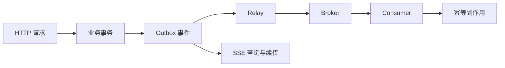
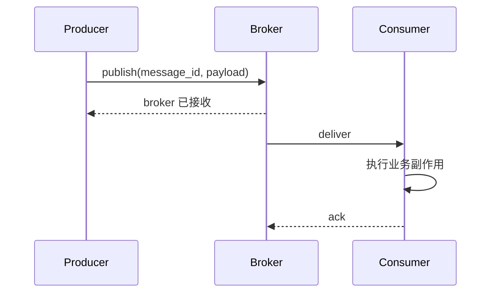
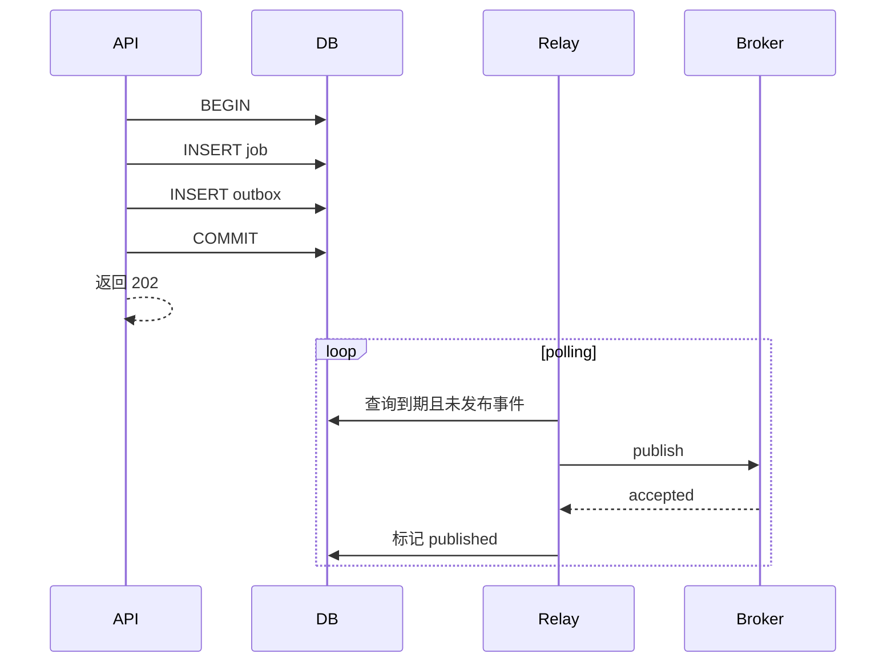

# 后台任务、消息队列、幂等、重试、Transactional Outbox 与 SSE

前面的课程让一次 HTTP 请求能够校验、访问数据库、认证、授权和被观测。但真实系统还有一类工作不适合让用户一直等待：发送邮件、生成报表、调用模型、转码、搜索索引和事件通知。

“把函数放到后台”只改变**何时执行**；可靠异步系统还必须回答：任务存在哪里、进程退出后能否恢复、失败由谁重试、重复执行是否安全，以及业务数据和任务能否保持一致。本课沿着这条因果链建立完整模型。

> 这是进阶课。第一次只比较三种结果：请求内完成、响应后但只存在当前进程、写入可恢复队列后由独立 worker 完成。先承认 at-least-once 会重复，再引入幂等；先看见业务提交与发消息的双写窗口，再学习 Outbox。SSE 只是把进度推给客户端，不负责可靠执行任务。

> 版本基准：Python 3.11+、FastAPI 0.139.x、Uvicorn 0.51.x。FastAPI 原生 SSE API 从 0.135.0 加入。示例用 SQLite 和内存 broker 暴露机制，不把它伪装成生产消息系统。

## 1. 先区分三个经常混淆的目标

假设创建订单后要发送通知：

1. **降低响应延迟**：先返回，再执行通知；
2. **隔离执行资源**：通知不占用 API worker；
3. **保证最终执行**：API 进程崩溃后，通知仍能恢复。

`BackgroundTasks` 可以满足第一个目标，却不自动满足后两个。消息 broker 加独立 worker 可以隔离资源和保存消息，但业务数据库与发消息之间仍可能出现“双写不一致”。Transactional Outbox 用一个数据库事务消除这段不一致窗口。



这里的边界很重要：

- **后台任务**描述响应之后执行，不代表持久化；
- **job queue**偏向“请执行某项工作”，**event**偏向“某件事已经发生”；
- **异步**不等于并行，也不等于另一个进程；
- **返回 202 Accepted**只表示请求已接受，不能谎称工作已完成。

## 2. FastAPI `BackgroundTasks` 到底何时运行

FastAPI 的 `BackgroundTasks` 来自 Starlette。path operation 把函数及参数加入 response；响应开始发送后，Starlette 在**同一个应用进程**内运行它。普通 `def` 与 `async def` 都可以注册，但它们仍分别受线程池和 event loop 的规则约束。

<<< ../../../examples/python/fastapi-outbox-sse/outbox_api/app.py{44-47}

这适合短小、失败可容忍、需要共享本进程对象的工作。例如尽力而为的审计补充或缓存清理。它不是 durable queue：

- worker 在执行前被终止，内存中的任务会消失；
- 没有跨进程 claim、ack、可见性超时和死信队列；
- 多个 Uvicorn worker 不共享 Python list 或内存状态；
- 响应已成功后，后台异常无法再改写这次 HTTP response；
- CPU 密集函数仍会争用进程资源，`async def` 中的阻塞 I/O 仍会阻塞 event loop。

因此“发账单、扣款、训练任务”不能仅靠 `BackgroundTasks`。FastAPI 官方也建议重计算或跨进程/跨服务器工作考虑 Celery 等队列工具。

## 3. 消息队列不是魔法：publish、delivery 与 ack

一个典型队列包含 producer、broker 和 consumer：



关键窗口位于“副作用完成”和“ack 到达”之间。若 consumer 已写数据库，随后在 ack 前崩溃，broker 无法判断副作用是否发生，只能再次交付。于是常见可靠配置提供的是 **at-least-once delivery（至少一次）**：消息不会轻易丢，但可能重复。

三个术语的准确边界：

- **at-most-once**：最多处理一次，允许丢失；
- **at-least-once**：至少尝试到成功，允许重复；
- **exactly-once**：必须说明范围。broker 内部去重不等于数据库写入、邮件或第三方扣款也恰好一次。

工程上通常采用“至少一次交付 + 幂等消费”，而不是笼统承诺端到端 exactly-once。

## 4. HTTP 幂等与消费端幂等不是一回事

**幂等**表示同一操作执行一次或多次，系统的目标效果相同。它不是“函数只被调用一次”，也不是“每次返回都必须逐字相同”。

### 4.1 HTTP 写请求的幂等键

客户端可能因 timeout 不知道服务器是否提交成功。它重试 `POST` 时携带 `Idempotency-Key`，服务端在同一事务中保存键和响应：

<<< ../../../examples/python/fastapi-outbox-sse/outbox_api/storage.py{47-84}

执行链如下：

1. `BEGIN IMMEDIATE` 建立写事务；
2. 若 key 已存在且请求指纹相同，回放首次响应；
3. 若 key 已存在但请求不同，抛出冲突；
4. 否则写 job、outbox 和幂等记录；
5. 三者一起 commit，任一步异常则一起 rollback。

路由把请求内容变化映射为 `409 Conflict`，并用 header 告诉客户端是否为回放：

<<< ../../../examples/python/fastapi-outbox-sse/outbox_api/app.py{31-42}

幂等键在生产中还必须：

- 按租户/认证主体和 operation scope 隔离，不能全站共用一个裸 key；
- 存储 method、route 和 canonical request hash，防止误复用；
- 对并发首次请求使用唯一约束，而非“先查再写”后相信没有竞争；
- 明确 TTL、清理策略和过期后的合同；
- 限制长度与速率，避免成为无限增长或探测接口。

### 4.2 consumer 的 inbox/去重记录

消费端要把“已经处理 message id”和业务副作用放在**同一个本地事务**里：

<<< ../../../examples/python/fastapi-outbox-sse/outbox_api/storage.py{114-133}

若 `(consumer, event_id)` 已存在，`INSERT OR IGNORE` 不插入，consumer 直接确认重复；若是首次处理，去重记录和 notification 一起提交。若副作用是外部邮件或支付 API，本地事务无法回滚远端系统，还需要远端 idempotency key、状态机或补偿流程。

## 5. 双写为什么必然产生不一致窗口

最直觉的 producer 代码是：

```python
save_job()
broker.publish("job.accepted")
```

但数据库事务和 broker publish 不属于同一个原子提交：

- DB 先提交，publish 前进程崩溃：有 job、无消息；
- 先 publish，DB 随后回滚：有消息、无 job；
- publish 成功但 client timeout：producer 不知道能否安全重发。

调换顺序不能消除问题，只会交换失败类型。分布式事务在部分系统可用，但会增加协议、可用性和运维复杂度，也不是默认答案。

## 6. Transactional Outbox 的因果链

Outbox 的核心不是一张特殊表，而是一个原子性安排：**业务行和待发布事件写入同一个数据库事务**。

<<< ../../../examples/python/fastapi-outbox-sse/outbox_api/storage.py{11-32}



如果业务事务回滚，job 与 outbox 都不存在；如果事务提交，事件永久留在 outbox，relay 以后仍能找到它。这样修复了“业务状态与发布意图”的原子性。

但是 outbox **没有消除重复**。relay 可能已经 publish，随后在标记 `published` 前崩溃；重启后会再次 publish。这正是消费端幂等不可省略的原因。

## 7. Relay、轮询和多实例竞争

示例 relay 每次取一条到期事件：

<<< ../../../examples/python/fastapi-outbox-sse/outbox_api/worker.py

`FakeBroker` 只保留 delivery，便于测试“publish 后、确认前崩溃”。生产 relay 还需要解决：

- 多实例 claim：PostgreSQL 常见做法是短事务配合 `FOR UPDATE SKIP LOCKED`；
- 不要在等待 broker 网络 I/O 时长期持有数据库锁；
- batch size、公平性和 backlog 指标；
- aggregate 内顺序与跨 aggregate 无序的边界；
- retention/归档，避免 outbox 无限增长；
- relay 的 leader election 或并发分区策略；
- schema version、trace context 与敏感数据最小化。

除了 polling publisher，也可以用数据库日志/CDC 读取提交变化。CDC 降低轮询压力，但引入 connector、offset、schema evolution 和运维边界；它仍不自动让下游副作用恰好一次。

## 8. 重试：只对暂时性失败，并给系统恢复时间

“捕获所有异常后立即重试”会把一次故障放大成 retry storm。重试策略至少包含：

1. **分类**：timeout、连接中断、限流通常可能暂时恢复；校验失败、权限失败通常不会；
2. **上限**：最大次数或总 elapsed time；
3. **退避**：失败越多，等待越久；
4. **jitter**：多个 worker 不在同一时刻一起醒来；
5. **死信/终止态**：永久失败可检查和重放；
6. **幂等**：每次尝试都可能在未知位置失败。

示例采用上限 60 秒的指数退避，并把下一次到期时间持久化：

```text
第 1 次失败：1 秒后
第 2 次失败：2 秒后
第 3 次失败：4 秒后
...
最多：60 秒
```

教学代码没有加入随机 jitter 和最大尝试次数，目的是保持因果链可测试；生产实现必须补齐。Celery 的 `retry` 与 broker 的重新投递也不是同一概念：前者由 task 主动安排新尝试，后者常由 ack/连接状态触发，两者都要求任务能安全重做。

## 9. SSE：交付通道不是消息持久层

Server-Sent Events 是基于 HTTP 的**服务器到客户端单向文本事件流**。浏览器原生 `EventSource` 支持它，适合进度、通知、日志和 AI token；需要双向低延迟交互、binary frame 或客户端频繁发消息时才更偏向 WebSocket。

SSE 每个事件可包含：

```text
event: job.accepted
id: 42
retry: 3000
data: {"job_id":42,"name":"index data"}

```

FastAPI 0.135+ 提供 `EventSourceResponse` 和 `ServerSentEvent`：

<<< ../../../examples/python/fastapi-outbox-sse/outbox_api/app.py{49-62}

浏览器断线重连时会发送最后收到的 `id` 作为 `Last-Event-ID`。服务端查询 `id` 更大的事件，从而续传。这里 outbox 暂时兼作有限事件日志；真实系统必须定义 retention：如果客户端给出的 id 已早于最老保留事件，应返回“需要全量同步”的明确协议，而不是静默漏数据。

SSE 仍需处理：

- 每个连接的认证、租户过滤和事件授权；
- proxy buffering、idle timeout、keepalive 和负载均衡；
- 慢客户端造成的 backpressure 和每用户连接上限；
- generator cancellation、数据库 cursor/连接释放；
- 多 worker 下不能用进程内 list 作为广播中心；
- 原生浏览器 `EventSource` 难以设置任意 header，认证常选择安全 cookie、短期签名 URL 或支持 fetch streaming 的 client；不要把长期 bearer token 放 URL。

FastAPI 原生实现会设置 `Cache-Control: no-cache`、`X-Accel-Buffering: no`，并在空闲时发送 keepalive ping；但 ingress、CDN 和 load balancer 仍要按部署环境验证。

## 10. 完整应用与生命周期

应用把数据库 store 放入 `app.state`，用 lifespan 在应用退出时关闭连接。不要在请求内创建永久连接，也不要依赖 module global 在多 worker 之间共享。

<<< ../../../examples/python/fastapi-outbox-sse/outbox_api/app.py

示例 SQLite 只有一个连接并用进程内 `Lock` 串行化写事务。这是可运行的机制演示，不适合高并发服务：跨进程锁无效，真实项目应使用 connection pool、短事务和数据库级并发控制。

## 11. 测试要主动制造“不确定窗口”

只测顺利 publish 无法证明可靠性。测试覆盖五条关键性质：

<<< ../../../examples/python/fastapi-outbox-sse/tests/test_outbox.py

- 同 key 同 request 回放，同 key 不同 request 冲突，且只创建一条业务记录；
- commit 前失败时 job 与 outbox 一起回滚；
- relay 在 publish 后崩溃会产生两次 delivery；
- consumer 对重复 event 只产生一次业务副作用；
- 退避到期前不再次发布；
- `Last-Event-ID` 只续传后续事件；
- `BackgroundTasks` 确实在测试响应之后运行，但这个测试不证明崩溃恢复。

生产系统还应使用真实 PostgreSQL、broker、worker 进程和故障注入做 integration test；mock broker 无法证明 ack、redelivery、partition 或网络 timeout 行为。

## 12. 与 Vue / JavaScript 的对应关系

前端经验可以帮助理解协议，但边界不同：

- Vue click handler 的防抖只减少重复点击，不能替代服务端幂等；刷新、代理重试和多标签页仍会重复请求；
- Promise resolve 只说明当前调用完成，不代表后台 job 完成；202 response 应返回 job id，页面另查状态或监听事件；
- `setTimeout(fn, 1000)` 是进程内调度，不是 durable retry；
- `EventSource` 的 `message`/named event 类似事件监听，但来源是持续 HTTP response；
- Pinia/Vuex 状态不是消息 offset。断线恢复要保存 last event id，并在历史过期时重新拉取权威状态；
- 前端收到重复 event 也应按 event id 去重，但最终业务一致性必须由后端保障。

## 13. 运行完整示例

<<< ../../../examples/python/fastapi-outbox-sse/pyproject.toml

```bash
cd examples/python/fastapi-outbox-sse
python3 -m venv .venv
source .venv/bin/activate
python -m pip install -e '.[test]'
python -m pytest
uvicorn outbox_api.app:create_app --factory --reload
```

创建任务并重复请求：

```bash
curl -i -X POST http://127.0.0.1:8000/api/v1/jobs \
  -H 'Content-Type: application/json' \
  -H 'Idempotency-Key: request-123' \
  -d '{"name":"index data"}'

curl -N http://127.0.0.1:8000/api/v1/events \
  -H 'Last-Event-ID: 0'
```

## 14. 工程决策清单

- 任务是可丢的 response-after work，还是必须恢复的 durable work；
- 202 response 是否提供 job id、状态查询和错误终态；
- idempotency scope、request fingerprint、TTL 和并发唯一约束是否明确；
- 业务数据和 outbox 是否同事务提交；
- relay 多实例如何 claim、排序、退避和清理；
- consumer 去重记录和本地副作用是否同事务；
- 外部副作用是否支持 idempotency key 或补偿；
- retry 是否只覆盖 transient error，并有 backoff、jitter、上限和 DLQ；
- message 是否有稳定 id、schema version、correlation/trace id；
- queue depth、oldest message age、attempts、DLQ 和 processing latency 是否可观测；
- SSE 是否授权、限流、续传，并处理 retention gap 和慢客户端；
- shutdown 是否停止接单、等待/归还 claim 并关闭资源。

## 15. 本课结论

- `BackgroundTasks` 是响应后的同进程执行机制，不是持久化任务队列。
- broker 的 ack 窗口使可靠系统通常选择至少一次交付，因此重复是正常输入，不是罕见异常。
- HTTP 幂等保护 client retry；consumer 幂等保护 message redelivery，两层不能互相替代。
- Transactional Outbox 原子保存业务状态和发布意图，但 relay 仍可能重复 publish。
- 重试必须建立在错误分类、幂等、退避、jitter、上限与终止态之上。
- SSE 是实时交付协议；`id` 与 `Last-Event-ID` 支持续传，但持久历史、授权和过期策略仍由应用负责。

下一节：[AI 推理服务、流式响应、模型生命周期、容量、超时、取消与背压](/backend/fastapi/ai-inference-streaming-model-lifecycle-capacity-timeout-cancellation-and-backpressure)。

## 16. 参考资料

- [FastAPI：Background Tasks](https://fastapi.tiangolo.com/tutorial/background-tasks/)
- [FastAPI：Server-Sent Events](https://fastapi.tiangolo.com/tutorial/server-sent-events/)
- [Starlette：Background Tasks](https://www.starlette.io/background/)
- [Celery：Tasks、retry 与 acknowledgement](https://docs.celeryq.dev/en/stable/userguide/tasks.html)
- [Transactional Outbox pattern](https://microservices.io/patterns/data/transactional-outbox)
- [Polling Publisher pattern](https://microservices.io/patterns/data/polling-publisher.html)
- [Idempotent Consumer pattern](https://microservices.io/patterns/communication-style/idempotent-consumer.html)
- [MDN：Using server-sent events](https://developer.mozilla.org/en-US/docs/Web/API/Server-sent_events/Using_server-sent_events)
