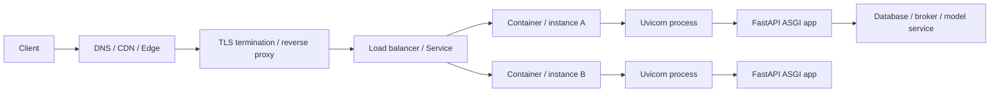
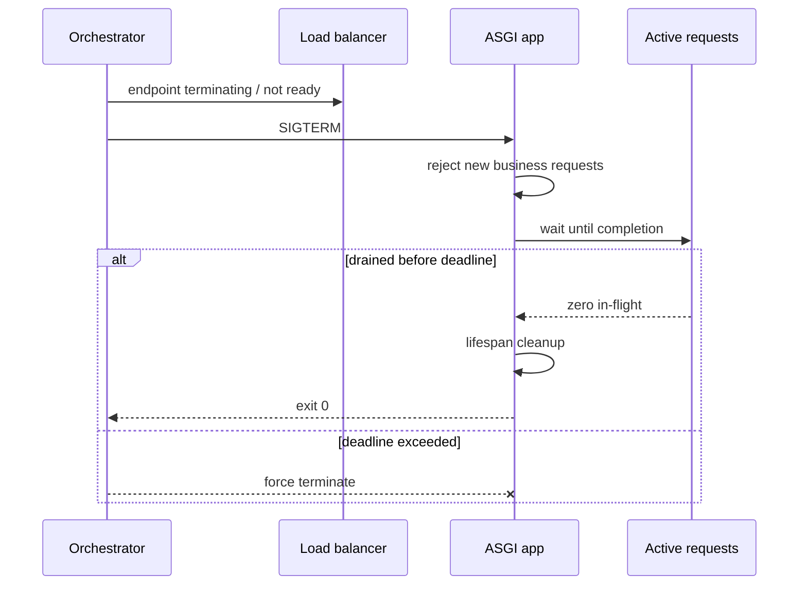

# FastAPI 部署拓扑、容器、多 Worker、代理、迁移、健康检查与优雅停机

本地执行 `uvicorn app:app --reload` 只证明应用能启动。生产部署还必须回答：谁终止 TLS、谁选择实例、一个实例有几个进程、配置从哪里来、schema 何时升级、旧版本和新版本能否同时工作，以及进程收到终止信号时怎样不切断正在发送的响应。

这些不是互不相关的工具清单，而是一条连续的请求和发布链：



任一层配置错误都可能表现为“FastAPI 有问题”：proxy buffering 让流式响应不流；错误信任 forwarded header 让 client IP 可伪造；每个 worker 各建连接池导致数据库连接耗尽；所有副本同时迁移导致 DDL 竞争；termination grace 太短则长请求被强制切断。

> 版本基准：Python 3.11+、FastAPI 0.139.x、Starlette 1.3.x、Uvicorn 0.51.x。容器和编排行为以当前 FastAPI、Uvicorn、Docker 与 Kubernetes 官方文档为依据。本课不修改仓库部署配置，示例只实现应用自身必须承担的生命周期合同。

## 1. “部署”不是把开发服务器搬到公网

生产系统至少要覆盖 FastAPI 官方总结的几类问题：

- HTTPS 与证书更新；
- 机器或容器启动时自动运行；
- 进程崩溃后的重启；
- replication 与负载分配；
- CPU、memory、socket 和连接池容量；
- 启动前只应执行一次的步骤，例如数据库迁移；
- 日志、指标、追踪和告警；
- 发布、回滚和数据兼容性。

Uvicorn 是 ASGI server，负责 socket、HTTP parsing、ASGI lifespan、concurrency limit 和 graceful shutdown。它不是 TLS 证书管理器、cluster scheduler、secret manager 或数据库迁移协调器。

## 2. 先画清请求实际经过的层

一个常见请求过程是：

1. client 用 DNS 找到 edge/load balancer；
2. edge 或 reverse proxy 完成 TLS handshake；
3. proxy 根据 host/path 选择 backend service；
4. load balancer 只从 ready endpoints 中选实例；
5. Uvicorn 接收连接并构造 ASGI scope；
6. FastAPI middleware、routing、dependency 和 handler 运行；
7. response 经相反路径返回。

每层都有不同 timeout：client timeout、edge idle timeout、load balancer response timeout、Uvicorn keep-alive/graceful timeout、应用 deadline 和下游 timeout。最外层 30 秒、内层却允许数据库等 60 秒，会产生 client 已离开但 server 仍做无效工作的“幽灵请求”。

不要写一个模糊的“timeout=30s”。应记录它控制 connect、queue、first byte、between bytes、total request 还是 graceful shutdown。

## 3. Reverse proxy、TLS termination 与 forwarded headers

生产 HTTPS 常在 reverse proxy 或云 load balancer 终止。proxy 到 Uvicorn 可以位于可信私网，但是否再次 TLS 取决于威胁模型与平台。

终止 TLS 后，Uvicorn 看到的直接 peer 是 proxy，原始 scheme/client 信息通常通过 `X-Forwarded-Proto`、`X-Forwarded-For` 等 header 传递。Uvicorn 提供 `--proxy-headers` 和 `--forwarded-allow-ips`。

安全因果链是：

```text
任意公网 client 可写 X-Forwarded-For
→ 应用若无条件信任
→ client IP、HTTPS 判断、redirect 和审计可被伪造
```

所以只信任明确的 proxy IP/network/Unix socket。`*` 不是“更兼容”的无害配置，除非应用网络边界确保只能由可信 proxy 连接。

若应用发布在 `/api` 等 path prefix 下，proxy 是否 strip prefix、ASGI `root_path` 如何设置、OpenAPI docs URL 怎样生成必须一起测试。proxy route rewrite 和 FastAPI router prefix 是相邻但不同的概念：一个改变外部到内部路径映射，一个定义应用内部路由。

## 4. Proxy buffering 会让“流式接口”看起来不流

上一课的 JSON Lines/SSE 从 application 逐块发送，但链路中任一 proxy 都可能缓冲：

```text
generator yield
→ ASGI send
→ Uvicorn socket
→ ingress/proxy buffer
→ client
```

如果 proxy 等到 buffer 满或 response 完成才转发，服务端日志显示逐 token 生成，浏览器却最后一次性收到。还要对齐 idle timeout、maximum response duration、HTTP/2 行为、compression buffering 和 CDN 支持。

应用内 TestClient 不经过真实 proxy，不能证明生产 streaming。必须在发布拓扑上用 `curl -N` 或真实 client 测 time-to-first-byte 和 inter-chunk timing。

## 5. Process、worker、container 与 replica 的准确边界

- **process**：操作系统进程，有独立 Python interpreter 和 memory；
- **Uvicorn worker**：运行同一 ASGI application 的一个进程；
- **container**：隔离的进程、filesystem 和 network 运行环境，不是轻量 VM 的同义词；
- **replica**：编排层维护的相同 workload 实例，通常是多个 container/Pod；
- **thread/task**：进程内部的执行单位，不提供跨进程 memory 共享。

`uvicorn ... --workers 4` 会启动四个 worker。每个 worker 都执行 lifespan、创建数据库 pool、加载 cache/model，并拥有独立 module globals、Semaphore 和 in-memory session。

如果每个 worker 的数据库 pool 上限为 10，3 个 replica 每个 4 workers，理论连接预算已是：

```text
3 replicas × 4 workers × 10 connections = 120 connections
```

还未计算 overflow、迁移任务、管理工具和其他服务。连接池参数必须按**全局乘法**预算。

## 6. 多 worker 不一定提高容量

多进程可以利用多个 CPU core，并隔离单个 worker 故障，但代价包括：

- 每进程重复 memory 和 startup work；
- 数据库/HTTP pools 成倍增加；
- in-memory state 不一致；
- long-lived connection 的分布不均；
- 模型/GPU 可能被重复加载而 OOM；
- 同一主机 CPU 已受 quota 限制时继续加 worker 只增加 context switch。

FastAPI 官方明确说明多个进程通常不共享 memory；1 GB 模型乘 4 workers 至少可能消耗约 4 GB。真实共享程度还受 allocator、fork 时机、copy-on-write、native runtime 与 GPU context 影响，不能用“Linux 会共享”作为容量保证。

worker 数应通过压测得出，不是固定使用 `2 × CPU + 1` 公式。I/O bound、CPU bound、model memory、database capacity 和 tail latency 会给出不同答案。

## 7. 一容器一进程还是容器内多 worker

在 Kubernetes 等已经提供 replication、health replacement 和 load balancing 的平台，FastAPI 官方通常建议每个 container 一个 Uvicorn process，再扩多个 replicas：

- memory/request 更容易估算；
- 每个实例独立滚动、限额和故障隔离；
- cluster scheduler 能在多机器分配；
- 不再嵌套两层 process management。

在单机或简单 Docker Compose 场景，container 内多个 workers 可能合理。它不是绝对禁令；关键是只让一个明确层负责 replication，并理解 memory/pool 的乘法。

旧的 `tiangolo/uvicorn-gunicorn-fastapi` base image 已被 FastAPI 官方标为 deprecated。当前 Uvicorn/`fastapi` CLI 自己能管理 workers，container image 应从合适的官方 Python base 自行构建并锁定依赖。

## 8. Container image、container 与持久数据

**image**是静态文件和 metadata；**container**是 image 的运行实例。运行期间写入 container writable layer 的数据不会自动成为新 image，container 被替换后也不应视为持久数据。

工程边界：

- source、依赖和启动命令进入 image；
- config 由 runtime environment/config mount 注入；
- secret 由 secret manager/file descriptor/mounted secret 注入，不 bake 进 layer；
- database/object storage 保存持久业务数据；
- stdout/stderr 交给日志收集器；
- temporary files 有大小、生命周期和清理策略；
- application process 使用非 root 用户和最小 filesystem 权限。

dependency install 与 source copy 分层可以利用 build cache；最终 image 不应包含 compiler、test cache、`.env`、Git credentials 或模型下载 token。

## 9. PID 1、exec form 与信号传播

container 的主进程通常是 PID 1。Docker shell-form command 会通过 `/bin/sh -c` 启动，shell 可能不把 SIGTERM 正确传给 Uvicorn。Docker 和 FastAPI 官方都建议 exec/JSON form：

```dockerfile
CMD ["uvicorn", "deployment_api.app:create_app", "--factory", "--host", "0.0.0.0", "--port", "8000"]
```

这只是教学片段，不是本仓库部署文件。若必须使用 entrypoint script，最后用 `exec "$@"` 替换 shell，使 Uvicorn 接管 PID 1 并收到信号。

信号链必须贯通：

```text
orchestrator sends SIGTERM
→ container PID 1 receives
→ Uvicorn stops accepting new work / starts graceful shutdown
→ active ASGI requests finish within deadline
→ FastAPI lifespan cleanup runs
→ process exits
→ deadline exceeded 才强制终止
```

如果 shell 吞信号，后面所有优雅清理设计都不会启动。

## 10. Runtime config 必须在 startup 边界验证

示例只读取三项非敏感配置，并用 Pydantic 在 startup 前验证类型、范围和 release 格式：

<<< ../../../examples/python/fastapi-deployment-lifecycle/deployment_api/settings.py

配置的几个相邻概念：

- **build-time config**改变 artifact 内容，例如 dependency/version；
- **runtime config**同一 image 在环境间变化，例如 DB URL、log level；
- **secret**是需要访问控制、轮换和禁止日志输出的 runtime value；
- **feature flag**是可动态改变行为的受控决策，不应代替 schema compatibility。

不要给 production 缺失 secret 一个方便的开发默认值；应 fail fast。也不要在 validation error、debug endpoint 或 config dump 中回显 secret。环境变量适合简单值，但它们仍可能出现在 process inspection、crash report 或错误日志；平台 secret mechanism 和最小权限同样重要。

`APP_RELEASE` 进入 response header，便于滚动发布时确认由哪个 revision 服务：

```text
X-App-Release: 2026.07.16-abc123
```

release 是低基数 build metadata，不应由 client 提供。

## 11. 数据库迁移不能由每个 worker 随手执行

如果在 lifespan 中执行 `alembic upgrade head`，4 workers × 3 replicas 可能同时尝试 DDL。即使 migration tool 有 version table，也不表示所有数据库、DDL 和 data migration 并发执行都安全。

正确发布链通常把 migration 作为**单独的、一次性受协调步骤**：

```text
build immutable image
→ 在目标环境执行一个 migration job
→ migration 成功
→ rollout application replicas
```

FastAPI 官方将 migration 归为 “previous steps before starting”，在多 container 场景建议单独 container/job/init step，而不是每个 replicated worker 重复运行。

但“migration 完成后再启动新版本”还不足以零停机，因为 rollout 期间旧版本和新版本会并存。

## 12. Expand–migrate–contract 保证版本共存

危险 migration：直接 rename/drop 旧版本仍在读取的 column。安全演进通常分阶段：

1. **expand**：增加 nullable column/table/index，旧代码仍可工作；
2. 发布兼容代码：必要时 dual write，并能读新旧格式；
3. **migrate/backfill**：分批迁移历史数据，限速并可恢复；
4. 切换 read path，观测完整性；
5. 所有旧实例退出后 **contract**：删除旧 column/constraint；
6. 移除 dual-write compatibility code。

DDL 是否锁表、`CREATE INDEX` 是否在线、transactional DDL、rollback 能力都依数据库和具体版本而变。Alembic 生成 migration script 不等于 script 已安全；autogenerate 结果必须人工审查。

data migration 往往比 schema migration 更慢，应有 checkpoint、幂等、batch、限速和独立观测。不要让数小时 backfill 占住一次部署 transaction。

## 13. 三类健康探针解决不同问题

示例暴露：

<<< ../../../examples/python/fastapi-deployment-lifecycle/deployment_api/app.py{37-45}

- **liveness**：进程是否已坏到需要重启；失败会触发 restart；
- **readiness**：是否应接收新流量；失败会从 load-balancing endpoints 移除；
- **startup**：慢启动是否已经完成；成功前暂缓 liveness/readiness，防止模型加载时被反复重启。

常见误解是“health 要检查所有下游”。如果 liveness 每次都同步查询数据库，数据库短暂故障会让所有 API replicas 一起重启，对数据库制造更大连接风暴。liveness 通常应浅；readiness 是否依赖关键下游要权衡 fail-closed 与剩余实例过载。

probe 必须廉价、超时短、不要求外部身份 token，也不能泄露内部版本、stack trace 或 secret。业务 synthetic check 和 probe 不是同一层；前者可以更深但不应控制每次 restart。

## 14. Readiness false 不等于所有旧流量瞬间消失

readiness 失败后，controller、EndpointSlice、load balancer 和 proxy 需要传播时间：

```text
instance marks not ready
→ control plane observes probe
→ endpoint 更新
→ load balancer 收敛
→ 已存在 keep-alive / HTTP/2 / stream 仍可能继续
```

所以 graceful termination 不能只 `ready=false` 后立即 exit。Kubernetes 删除 Pod 时会把 terminating endpoint 的 ready condition 置 false，但仍必须给 endpoint propagation 和 active connections 留时间。

## 15. 优雅停机的目标不是无限等待

正确目标是：停止接收新业务请求，让已接收请求在有限 deadline 内完成，释放资源，然后退出；超时后允许平台强制终止。



长时间 streaming、WebSocket、background task 和 message consumer 要分别定义策略：允许完成、主动发送 shutdown event、断开让 client reconnect、停止 claim 新消息，或把未完成任务退回 broker。

## 16. 应用级 draining 状态机

示例状态保存 ready、draining、in-flight 和最后 drain 结果：

<<< ../../../examples/python/fastapi-deployment-lifecycle/deployment_api/lifecycle.py

状态变化的因果链：

```text
startup success: ready=true, draining=false
business request begin: in_flight += 1
business response fully ends: in_flight -= 1
shutdown begins: ready=false, draining=true
new business request: 503 + Retry-After
in_flight becomes 0: drain succeeds
deadline expires: record failure and continue shutdown
```

deadline 必须小于编排层 `terminationGracePeriodSeconds`，为连接池关闭、telemetry flush 和 process exit 留余量。Uvicorn 的 `--timeout-graceful-shutdown` 与平台 grace 也要对齐；不能让内层等待比外层强杀时间更长。

## 17. 为什么普通 HTTP middleware 容易漏算 streaming

`call_next(request)` 返回 `StreamingResponse` 不表示最后一个 body chunk 已发送。若 middleware 在 `finally` 立刻 `in_flight -= 1`，drain 可能看到 0 并退出，而 client 仍在收流。

示例使用 pure ASGI middleware，`await self.app(scope, receive, send)` 覆盖完整 ASGI response lifetime：

<<< ../../../examples/python/fastapi-deployment-lifecycle/deployment_api/middleware.py

它还遵守三个边界：

- health endpoint 不进入业务 in-flight 计数，draining 时仍可观察；
- draining 后新业务请求得到 503 和 `Retry-After`；
- release header 在 `http.response.start` 时追加，streaming 与 JSON response 一致。

`Connection: close` 是 HTTP/1.1 hop-by-hop header，在 HTTP/2 中不应发送；示例没有用它强行控制连接。停止接受连接和 protocol-specific draining 应由 ASGI server/proxy 配合。

## 18. Lifespan 与 server graceful shutdown 的分工

<<< ../../../examples/python/fastapi-deployment-lifecycle/deployment_api/app.py{13-32}

Uvicorn 通常先停止接收/等待 active request，然后发送 ASGI lifespan shutdown；因此应用 lifespan 里的 in-flight 常已接近 0。示例 drain 是额外的应用不变量和可测试合同，不应误以为它能代替 Uvicorn/platform 的连接管理。

shutdown cleanup 应：

- 停止产生新 background work；
- 关闭 DB/HTTP/broker pools；
- flush telemetry，但设置短 timeout，不能永久卡住退出；
- 对 message consumer 停止 claim 并正确 ack/nack；
- 对模型 abort/drain sequence 后释放 GPU；
- 清理 temporary resource。

不要在 SIGTERM handler 里直接执行复杂 async cleanup；让 Uvicorn 接收 signal 并驱动 ASGI lifespan，ownership 更清晰。

## 19. Uvicorn 的关键生产边界

当前 Uvicorn 提供的相关选项包括：

- `--workers`：多进程 replication；
- `--limit-concurrency`：并发 connection/task 上限，过限返回 503；
- `--backlog`：尚未 accept 的 connection queue 上限；
- `--limit-max-requests` 与 jitter：worker 服务一定请求数后轮换；
- `--timeout-keep-alive`：空闲 keep-alive 等待；
- `--timeout-graceful-shutdown`：graceful shutdown 最长等待；
- `--proxy-headers` / `--forwarded-allow-ips`：可信 proxy metadata；
- `--root-path`：submount prefix。

server concurrency limit 保护整个进程，不替代 per-route/model/database 的容量门；max-requests 可以限制长期 memory leak 影响，却不是修复 leak；worker restart 需要足够 replicas 避免同时掉容量，因此 jitter 有助于错开轮换。

`--reload` 面向开发，不能与多 workers 同时作为生产策略，也不应在 production 扫描源文件。

## 20. 滚动发布不是“新版本启动就结束”

一个健康 rollout 至少验证：

1. migration 与新旧版本 schema 兼容；
2. 新 replica startup 成功但未 ready 前不接流量；
3. readiness 成功后逐步加入；
4. error rate、latency、resource、业务指标按 release 对比；
5. 旧 replica 标记 terminating，停止新流量并 drain；
6. 新版本稳定后完成；异常则停止 rollout/rollback；
7. destructive contract migration 远晚于旧版本完全退出。

rollback application binary 不自动 rollback database。若新 migration 已删除旧版本所需字段，代码 rollback 会失败，这正是 expand–contract 的价值。

canary 是让少量流量先进入新版本；blue-green 是两套环境切换。二者都不能替代兼容 migration、健康探针和可靠 observability。

## 21. 测试生命周期而不假装测试了 Kubernetes

<<< ../../../examples/python/fastapi-deployment-lifecycle/tests/test_deployment.py

自动测试证明：

- runtime config 在 startup boundary 被验证；
- lifespan 期间 ready，退出时 draining 且 drain 成功；
- draining 拒绝业务请求，但 liveness/readiness 仍可观察；
- response 带 serving release；
- pure ASGI middleware 在首 chunk 后仍保持 in-flight=1，直到最终 chunk；
- drain 有 deadline，不会无限等待。

这些测试不证明真实 SIGTERM、proxy、EndpointSlice、keep-alive 或 container PID 1 行为。还需要 deployment-level smoke/chaos test：发布期间持续发请求、打开长 stream、删除实例，检查错误率、重复处理、连接迁移和 grace deadline。

## 22. 运行应用示例

<<< ../../../examples/python/fastapi-deployment-lifecycle/pyproject.toml

```bash
cd examples/python/fastapi-deployment-lifecycle
python3 -m venv .venv
source .venv/bin/activate
python -m pip install -e '.[test]'
python -m pytest

APP_ENV=production \
APP_RELEASE=2026.07.16-abc123 \
SHUTDOWN_DRAIN_SECONDS=10 \
uvicorn deployment_api.app:create_app --factory \
  --host 0.0.0.0 --port 8000 \
  --limit-concurrency 100 \
  --timeout-graceful-shutdown 15
```

本地发送 `Ctrl+C` 会让 Uvicorn 驱动 shutdown。验证 endpoints：

```bash
curl -i http://127.0.0.1:8000/health/live
curl -i http://127.0.0.1:8000/health/ready
curl -i http://127.0.0.1:8000/api/v1/work
curl -N http://127.0.0.1:8000/api/v1/stream
```

## 23. 与 Vue 前端部署的对照

Vue 静态资源常由 CDN/edge 缓存，FastAPI response 是动态执行；但二者都要解决 artifact version、runtime config、proxy path、cache 和 rollback。

- 前端 build-time `VITE_*` 会被打入 bundle，部署后修改环境变量不会自动改变已构建 JS；后端 runtime environment 通常在进程启动时读取；
- SPA base path 与 ASGI `root_path` 都涉及外部 prefix，但发生在不同运行时；
- frontend release hash 和 backend `X-App-Release` 能帮助定位兼容问题；
- browser retry 必须尊重 idempotency 和 `Retry-After`，不能对所有 503 立即无限重试；
- rolling deployment 会让同一页面短时间访问不同 backend revisions，API contract 必须向后兼容；
- WebSocket/SSE 断线后 client 应指数退避重连和恢复状态，不能假设实例永不替换。

前端页面与后端 API 的发布不必原子同时发生，因此 API evolution 通常采用先兼容扩展、再切前端、最后移除旧字段。

## 24. 常见错误

- production 使用 `--reload`；
- 无条件信任任意 `X-Forwarded-*`；
- proxy buffer 导致 streaming 假流式；
- 把 worker 数等同于 CPU 数而不测 memory/DB；
- in-memory session、queue 或 lock 当成多 worker 共享；
- 每个 worker startup 都执行 migration；
- migration 直接 drop 旧版本字段；
- liveness 深查所有下游，引发集体重启；
- readiness false 后立即退出，不留 endpoint propagation/drain；
- shell-form entrypoint 吞 SIGTERM；
- app shutdown timeout 比 platform grace 还长；
- 普通 middleware 在 streaming response 完成前减少 in-flight；
- secret bake 进 image、写入 log 或 health response；
- rollback 只考虑 code，不考虑 schema/data；
- TestClient 通过就声称 proxy/container rollout 已验证。

## 25. 工程检查清单

- 请求拓扑、TLS termination、proxy、LB 和 ASGI 层有明确 owner；
- forwarded headers 只信任已知 proxy；
- path prefix/root_path/OpenAPI/redirect 在真实 proxy 后测试；
- streaming 的 buffering 与 idle timeout 已端到端验证；
- replication 只由明确层管理，worker/replica memory 已测量；
- DB/HTTP pool 按 workers × replicas 计算；
- image immutable、依赖锁定、非 root、无 secret 和 build credential；
- PID 1 能收到 SIGTERM，命令使用 exec form；
- runtime config startup fail-fast，secret 不回显；
- migration 单独协调，采用 expand–migrate–contract；
- startup/liveness/readiness 的失败含义不同；
- readiness 和 termination propagation 留有时间；
- in-flight 追踪覆盖最终 streaming body；
- Uvicorn、应用和 platform shutdown deadlines 从内到外留余量；
- queue consumer、background task、WebSocket、SSE 和模型各有 drain 策略；
- rollout 按 release 观测，可停止并安全 rollback；
- deployment smoke test 真正经过 proxy/container/orchestrator。

## 26. 本课结论

- 部署是一条从 TLS/proxy 到进程、应用、数据库和发布协调的完整因果链，不是一个启动命令。
- worker 是独立进程；memory、lifespan、pool、global state 和模型都会按 worker 复制。
- cluster 已管理 replication 时通常每 container 一个 process；简单单机场景可按测量选择多 workers。
- forwarded header 只有来自可信 proxy 才可信，streaming 必须穿过真实 proxy 验证。
- migration 是一次性协调步骤，零停机还要求新旧代码通过 expand–contract 共存。
- liveness 决定重启，readiness 决定接流量，startup 给慢初始化留时间，三者不能互换。
- graceful shutdown 是“停止新请求 → 有限等待 in-flight → cleanup → exit”；无限等待和立即强杀都不是优雅。
- streaming 请求必须追踪到最后 ASGI body，不能在返回 Response 对象时误判完成。

下一节：[后端架构、分层、模块边界、领域模型、Repository、事件、缓存与演进](/backend/fastapi/backend-architecture-layers-modules-domain-repository-events-cache-and-evolution)。

## 27. 参考资料

- [FastAPI：Deployment Concepts](https://fastapi.tiangolo.com/deployment/concepts/)
- [FastAPI：Server Workers](https://fastapi.tiangolo.com/deployment/server-workers/)
- [FastAPI：FastAPI in Containers](https://fastapi.tiangolo.com/deployment/docker/)
- [FastAPI：About HTTPS](https://fastapi.tiangolo.com/deployment/https/)
- [Uvicorn：Settings](https://www.uvicorn.org/settings/)
- [Docker：Dockerfile reference、exec 与 shell form](https://docs.docker.com/reference/dockerfile/)
- [Kubernetes：Liveness、Readiness 与 Startup Probes](https://kubernetes.io/docs/concepts/workloads/pods/probes/)
- [Kubernetes：Pod Lifecycle 与 Termination](https://kubernetes.io/docs/concepts/workloads/pods/pod-lifecycle/)
- [Alembic 1.18：Documentation](https://alembic.sqlalchemy.org/en/latest/)
- [Alembic 1.18：Cookbook](https://alembic.sqlalchemy.org/en/latest/cookbook.html)
