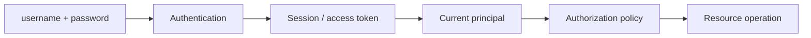
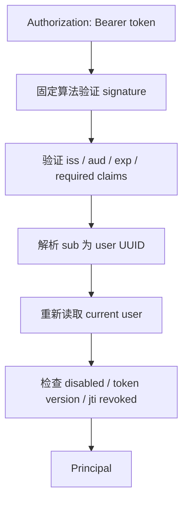
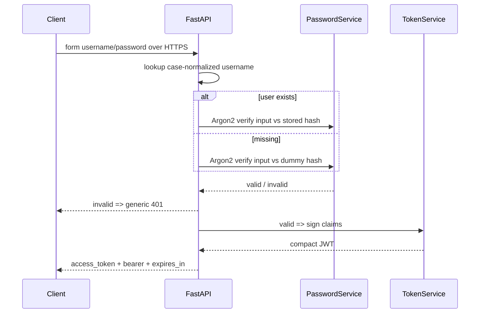

# FastAPI 身份认证、密码存储、JWT、Session、授权与 Web 安全

身份系统不是“校验密码后返回一个 JWT”。攻击者会窃取数据库、猜测密码、重放 token、利用过期权限访问资源，浏览器还会带来 XSS、CSRF、Cookie 和 CORS 边界。安全设计必须先明确攻击面，再选机制。

本课实现一个可运行的最小系统：注册、Argon2 password hash、OAuth2 password form 登录、短期 Bearer JWT、`iss/aud/exp/jti` 验证、单 token logout、token version 全局失效，以及 document owner/admin 授权。

> 验证环境：CPython 3.13.4；FastAPI 0.139.0、pwdlib 0.3.0、argon2-cffi 25.1.0、PyJWT 2.13.0、python-multipart 0.0.32、Pydantic 2.13.4、pytest 9.1.1。示例仅用于解释机制，production identity system 还需持久化、rate limit、MFA、审计、密钥轮换和恢复流程。

## 1. 先分清四个概念

### 1.1 Identification

主体声称“我是 alice”，只是标识声明。

### 1.2 Authentication

系统验证该声明，例如核对 password hash、WebAuthn credential 或外部 identity provider assertion。

### 1.3 Session/token management

认证成功后，后续请求如何持续证明主体身份。password 不应每次请求重传，因此需要 session id 或 token。

### 1.4 Authorization

已认证的 alice 是否能读取 document 7。Authentication 回答“是谁”，authorization 回答“能做什么、对哪个 resource、在什么条件下”。



## 2. 威胁模型决定设计

本课至少考虑：

- user database 泄漏后的离线 password guessing；
- 不存在 username 与错误 password 的枚举差异；
- JWT 被篡改、过期、发错 issuer/audience；
- access token 被窃取后重放；
- user 被 disabled 或权限撤销后旧 token 继续使用；
- 用户 A 猜中 document B 的 id；
- 多 worker 下本地撤销状态不一致；
- 浏览器 XSS/CSRF 和跨 origin 请求。

没有 threat model，“使用 JWT”“使用 bcrypt”只是技术名词，不是安全结论。

## 3. Password 为什么不能加密后保存

登录只需判断输入是否匹配，不需要还原原 password。可逆 encryption 意味着持有 key 的攻击者能得到所有明文；快速 hash（SHA-256/MD5）又让攻击者每秒尝试大量候选。

password storage 需要专用、slow、adaptive、memory-hard hash。示例使用 pwdlib 推荐配置的 Argon2id：

```text
password + random salt
  → Argon2id(memory, iterations, parallelism)
  → encoded hash string（含算法、参数、salt、digest）
```

salt 不需要保密，每个 hash 唯一，阻止相同 password 产生相同预计算结果。pepper 是另一个可选 server-side secret，必须与 database 分离，并有 rotation/recovery 设计；它不能替代 salt 或现代 hash。

## 4. Hash、verify 与升级参数

安全实现：

<<< ../../../examples/python/fastapi-auth-jwt-authorization/secure_api/security.py

注册时只保存 encoded hash。登录时 library 从 encoded string 读取算法参数并 verify。

work factor 不是越高越安全：合法登录也消耗 CPU/memory，过高会成为 denial-of-service 放大器。应在 production hardware benchmark，结合并发、登录 rate limit 和容量选择；算法/参数过时后在成功登录时 rehash，逐步升级存量。

## 5. 防止 username 枚举的时间差

若 username 不存在就立即返回，而存在用户才运行昂贵 Argon2，攻击者可从响应时间推断账号。本课在 missing-user 分支仍 verify 一个启动时生成的 dummy hash。

这只能减少明显时间差，不保证网络上绝对 constant-time。还要统一外部错误文案、status，并防止日志、注册/找回流程和 rate limit key 泄漏账号状态。

登录失败统一返回：

```http
401 Unauthorized
WWW-Authenticate: Bearer
```

不告诉 client 是 username 还是 password 错误。

## 6. OAuth2 password form 的准确边界

FastAPI `OAuth2PasswordRequestForm` 解析 `application/x-www-form-urlencoded` 的 `username`、`password` 等字段，因此需要 `python-multipart`。它同时让 OpenAPI/Swagger UI 知道 token endpoint。

这不是说应用自动变成完整 OAuth authorization server，也不代表 password grant 适合第三方 public client。现代多应用/第三方登录通常采用外部 IdP 的 Authorization Code + PKCE / OpenID Connect。当前流程只用于同一可信 first-party application 学习直接账号认证。

无论何种 flow，生产必须 HTTPS；OAuth2 本身不替代 transport encryption。

## 7. Bearer 的含义

Bearer token 的持有者通常无需再次证明 possession：谁拿到 token，谁就能使用。它应像临时 password 一样保护，不能写进 URL、analytics、普通 log 或 error message。

浏览器存在哪里是 threat tradeoff：

- JS 可读 storage 易受 XSS 窃取；
- HttpOnly Cookie 降低 JS 读取风险，但浏览器自动附带 cookie，必须处理 CSRF、SameSite、Secure、Domain/Path；
- memory storage 减少持久暴露，但 reload/多 tab 体验不同。

不存在“JWT 放 localStorage 永远正确”的通用答案。

## 8. JWT 是签名容器，不是加密容器

JWT 常见 compact form：

```text
base64url(header).base64url(payload).base64url(signature)
```

header/payload 可被任何持有者 decode。signature 证明内容未被不知道 key 的人修改，不隐藏内容。不要放 password、secret、敏感个人数据或频繁变化的大权限集合。

## 9. 本课验证哪些 claims

TokenService 生成：

- `sub`：`user:<UUID>`，唯一标识主体；
- `iss`：谁签发；
- `aud`：哪个 API 可以接受；
- `iat`：签发时间；
- `exp`：失效时间；
- `jti`：本 token 唯一 id；
- `ver`：用户的 token version。

decode 同时要求这些 claims，并传入固定 `algorithms=["HS256"]`。不能从攻击者控制的 token header 动态决定接受算法。

因果链：



## 10. Secret 与 algorithm 边界

HS256 是 symmetric MAC：issuer 与 verifier 共享同一 secret；能验证的一方也能签发。单体内部 API 可用，但多 service/第三方 verifier 常更适合 asymmetric signing，让 verifier 只持 public key。

secret 必须随机、足够长、由 secret manager 注入、支持 rotation。示例允许 development secret 便于运行，但 `environment=production` 会拒绝默认 secret：

<<< ../../../examples/python/fastapi-auth-jwt-authorization/secure_api/config.py

真正 rotation 常需 key id (`kid`) 和新旧 keys 短期并存；不要直接换 key 让所有请求在无计划时瞬间 401。

## 11. Access token 越短，泄漏窗口越小

本课 access token 默认 15 分钟。`exp` 之后 decoder 拒绝。clock skew 可给很小 leeway，但过大 leeway 会扩大有效期。

短 access token 通常与 refresh/session mechanism 配合。refresh token 应更严格保护、rotation、reuse detection、server-side revocation。不能把一个有效 30 天的 JWT 改名为 refresh token 就算完成设计。

## 12. JWT logout 的真实矛盾

完全自包含 JWT 在到期前无需查 server state，代价是 server 很难即时撤销。logout 若只让 browser 删除 token，窃取的副本仍可用。

本课用 `jti → exp` denylist：logout 写入当前 jti，每次认证检查。过期 entry 可清理。它恢复即时撤销，但也恢复了 server-side lookup。

<<< ../../../examples/python/fastapi-auth-jwt-authorization/secure_api/repositories.py

示例 store 在 memory，仅单 process 有效；多 worker 各有副本，production 必须使用共享 durable/TTL store。若不需要跨服务 self-contained token，opaque random session id + server-side session store 往往更简单、安全且易撤销。

## 13. Token version 解决“全部登出”

每个 user 有 `token_version`，JWT 保存签发时版本。改 password、账号恢复、权限重大变化或“退出所有设备”时递增 database version，所有旧 token 随即不匹配。

这要求每次请求读取 current user，因此不再是零状态验证。示例有意选择 current correctness：JWT 中不存 roles，而是使用 current user roles，避免权限撤销要等 token 过期。

## 14. Authentication dependency

<<< ../../../examples/python/fastapi-auth-jwt-authorization/secure_api/dependencies.py

`OAuth2PasswordBearer` 负责从 Authorization header 取得 bearer credential并生成 OpenAPI security scheme；它不验证 signature。TokenService、user lookup、disabled/version/revocation checks 才完成 authentication。

`Principal` 同时保存 current user 和 validated claims，后续 logout 需要 jti/exp，authorization 需要 user/roles。

## 15. 401 与 403

- **401 Unauthorized**：缺失、无效、过期或已撤销 credential；通常带 `WWW-Authenticate` challenge；
- **403 Forbidden**：身份已确认，但 policy 拒绝该 action/resource。

历史名称容易误导：401 实际常表示 unauthenticated。不要用 401 表示“alice 不是 document owner”，否则 client 会误以为重新登录能解决。

某些系统对无权知道存在性的 resource 返回 404，减少 identifier enumeration。这是 intentional disclosure policy；无论外部 403 还是 404，内部审计仍应记录真实 denial reason。

## 16. RBAC、ABAC 与资源级授权

### 16.1 RBAC

role → permissions，例如 admin 可以读取所有 documents。role 不应散落为字符串 if；大系统应集中 permission mapping、default deny、审计变更。

### 16.2 Resource/relationship-based

`record.owner_id == principal.user.id`。只检查 role 而不检查 target resource，会产生 IDOR/BOLA：登录用户改 URL id 就访问别人数据。

### 16.3 ABAC

结合 subject、resource、action、environment，例如部门、敏感级别、时间、MFA strength。表达力更强，也更难审计和测试。

本课 policy：owner 或 current role 中含 admin，其他 authenticated user 得到 403。

## 17. 完整 application

<<< ../../../examples/python/fastapi-auth-jwt-authorization/secure_api/app.py

完整 HTTP/data models：

<<< ../../../examples/python/fastapi-auth-jwt-authorization/secure_api/models.py

注册 response 永不包含 `password_hash`。response model 是防止 secret accidental exposure 的第二道边界；日志、repr、trace 也必须过滤 password/token。

## 18. 一次登录的执行过程



password 只用于登录请求，但 HTTPS termination、proxy/logging/body capture 都必须防止记录它。

## 19. 一次受保护资源请求

1. bearer extractor 取得 token；
2. fixed algorithm 验签；
3. issuer/audience/expiration/required claims 校验；
4. `sub` 严格解析 UUID；
5. repository 读取 current user；
6. disabled、token version、denylist 检查；
7. endpoint 读取 document；
8. owner/admin policy；
9. 允许返回或拒绝 403。

认证成功不是授权结束，而是授权开始。

## 20. Session Cookie 与 JWT 怎么选

| 维度 | Opaque server session | Self-contained JWT |
|---|---|---|
| credential | random session id | signed claims |
| server lookup | 通常每次 | 可不查，但本课为 current state 会查 |
| 即时撤销 | 简单 | 需 denylist/version/短 TTL |
| claim 泄漏 | id 本身信息少 | payload 可读 |
| 跨 service | 共享 store/网关 | public-key verify 较方便 |
| 状态大小 | server store | token/header 传输 |

JWT 不是 session 的升级版。单体浏览器应用常用 HttpOnly secure session cookie 更简单；跨 service delegation 才更能体现 signed token 的价值。

## 21. Cookie、CSRF、CORS、XSS 的边界

### 21.1 CSRF

浏览器会自动附带 matching cookies，攻击站点可诱导 state-changing request。使用 SameSite、CSRF token、Origin/Referer validation，并避免 GET 改状态。Bearer header 若只能由 JS 显式设置，经典 CSRF 风险较低，但 XSS 风险仍在。

### 21.2 CORS

CORS 是 browser 对 frontend JavaScript 读取跨 origin response 的限制，不是 server authentication，也不阻止 curl/server-to-server/某些 simple request 到达。不要把允许 origin 当 authorization。

credentialed CORS 不能用随意 wildcard；精确列出 trusted origins、methods、headers。

### 21.3 XSS

攻击脚本运行在 trusted origin，能以用户身份发请求；HttpOnly 只阻止读取 cookie，不阻止脚本触发同源 authenticated request。需要 output encoding、CSP、依赖治理和避免 unsafe DOM API。

## 22. Rate limit、lockout 与 MFA

Argon2 让每次猜测昂贵，也让 authentication endpoint 成为 CPU/memory target。按 account、IP/device/risk 多维 rate limit，设置 progressive delay 和 monitoring。

永久 account lock 容易被攻击者用于 denial of service。恢复流程本身是 authentication boundary，不能比登录更弱。

高风险 action 应 step-up/MFA。role `admin` 不意味着“输入过一次 password 后永远足够”。

## 23. 测试证明了什么

<<< ../../../examples/python/fastapi-auth-jwt-authorization/tests/test_security.py

测试覆盖：

- stored value 是 Argon2 encoded hash 且不含明文；
- missing user 返回 generic 401 + Bearer challenge；
- issuer/audience/subject claims；
- expired 与 wrong-audience token 拒绝；
- logout jti denylist；
- owner 成功、其他 user 403；
- token version 改变后旧 token 401。

测试没有证明 Argon2 参数适合 production hardware、没有证明抗真实 side channel，也没有验证 distributed denylist。security test 必须明确证明范围。

## 24. 运行配置

<<< ../../../examples/python/fastapi-auth-jwt-authorization/pyproject.toml

<<< ../../../examples/python/fastapi-auth-jwt-authorization/.env.example

```bash
python3 -m venv .venv
source .venv/bin/activate
python -m pip install -e '.[test]'
cp .env.example .env
python -m pytest
uvicorn secure_api.app:app --reload
```

production secret 可用 `openssl rand -hex 32` 等 CSPRNG 生成，通过 secret manager 注入；不要复制文档固定值。

## 25. 常见错误

### 25.1 保存明文或 SHA-256 password

数据库泄漏后可直接使用或高速离线猜测。使用专用 password hashing library。

### 25.2 JWT payload 放 password/secret

payload 可读。最小 claims，并把敏感/current state 留在 server。

### 25.3 只验 signature

来自错误 issuer、发给其他 audience 或过期 token 仍可能被接受。验证完整 token contract。

### 25.4 接受 token header 指定的算法

造成 algorithm confusion 风险。verifier 配置允许列表。

### 25.5 Access token 长期有效且不可撤销

窃取后长期重放。短 TTL，加 refresh/session rotation 和撤销策略。

### 25.6 roles 写入长期 JWT 后不查 current state

权限撤销延迟到 token 到期。根据业务风险选择短 TTL、token version/introspection/current lookup。

### 25.7 认证后不做 object authorization

任意登录用户修改 URL id 访问别人数据。每个 resource/action 都执行 policy。

### 25.8 多 worker 使用 memory denylist

logout 只对接收该请求的 worker 生效。使用 shared store 或 server-side session。

### 25.9 把 CORS 当 security firewall

非浏览器 client 不受 CORS。server 仍必须 authentication/authorization。

### 25.10 日志记录 form/body/token

monitoring 系统变成 credential database。redact headers/body/query 和 exception context。

## 26. 工程检查清单

- password 只保存 modern adaptive hash；
- Argon2 参数按 production hardware/capacity benchmark；
- 每个 hash 独立 salt；pepper 若使用则独立 secret lifecycle；
- missing/existing user 失败路径相近且错误统一；
- authentication endpoint 有 rate limit、monitoring、MFA/恢复策略；
- 全链路 HTTPS，proxy 不记录 credential；
- bearer token 不进 URL/log；
- JWT 固定 algorithm allowlist；
- 校验 signature、iss、aud、exp 与 required claims；
- sub 全局/issuer 内唯一且类型严格；
- access token 短期；refresh token rotation/reuse detection；
- logout/revocation 在所有 workers 一致；
- disabled、password reset、role change 的旧 token policy 明确；
- 401 带 challenge，403 表示已认证但拒绝；
- default deny，资源级授权不只检查登录；
- Cookie 设置 Secure/HttpOnly/SameSite 并有 CSRF 防护；
- CORS 精确配置且不冒充授权；
- XSS/CSP/依赖风险纳入 browser token design；
- secret 支持 rotation，不提交 repository；
- 审计登录、撤销、授权拒绝但不记录 secret；
- security failure paths 有自动测试。

## 27. 本课结论

- authentication、session/token management、authorization 是连续但不同的边界。
- password 应用 Argon2id 等 slow adaptive hash，不可逆加密或快速通用 hash。
- JWT 通常签名但不加密；payload 可读，必须验证 algorithm、issuer、audience、expiration 和 claims shape。
- Bearer token 被窃取即可重放，短 TTL、storage、revocation 和 rotation 共同决定风险。
- `jti` denylist支持单 token logout，token version 支持批量失效；两者都引入 server state。
- opaque session 与 JWT 各有取舍，JWT 不是天然更安全或更 scalable。
- 401 是 credential 问题，403 是已认证主体不满足 policy。
- RBAC 不能替代 resource ownership/ABAC；每个 action 都要防止 IDOR/BOLA。
- Cookie/CSRF、CORS 与 XSS 分属不同 browser security 边界，不能相互替代。

下一节：[FastAPI 测试、结构化日志、Metrics、Tracing 与生产可观测性](/backend/fastapi/testing-structured-logging-metrics-tracing-and-observability)。

## 28. 参考资料

- [FastAPI：OAuth2 with Password and JWT](https://fastapi.tiangolo.com/tutorial/security/oauth2-jwt/)
- [FastAPI：Security](https://fastapi.tiangolo.com/tutorial/security/)
- [RFC 7519：JSON Web Token](https://www.rfc-editor.org/rfc/rfc7519)
- [RFC 8725：JWT Best Current Practices](https://www.rfc-editor.org/rfc/rfc8725)
- [RFC 6750：OAuth 2.0 Bearer Token Usage](https://www.rfc-editor.org/rfc/rfc6750)
- [OWASP：Password Storage Cheat Sheet](https://cheatsheetseries.owasp.org/cheatsheets/Password_Storage_Cheat_Sheet.html)
- [OWASP：Authentication Cheat Sheet](https://cheatsheetseries.owasp.org/cheatsheets/Authentication_Cheat_Sheet.html)
- [OWASP：Session Management Cheat Sheet](https://cheatsheetseries.owasp.org/cheatsheets/Session_Management_Cheat_Sheet.html)
- [OWASP：Authorization Cheat Sheet](https://cheatsheetseries.owasp.org/cheatsheets/Authorization_Cheat_Sheet.html)
- [OWASP：CSRF Prevention Cheat Sheet](https://cheatsheetseries.owasp.org/cheatsheets/Cross-Site_Request_Forgery_Prevention_Cheat_Sheet.html)
- [PyJWT Usage](https://pyjwt.readthedocs.io/en/stable/usage.html)
- [pwdlib](https://frankie567.github.io/pwdlib/)
- [PyJWT 2.13.0 on PyPI](https://pypi.org/project/PyJWT/2.13.0/)
- [pwdlib 0.3.0 on PyPI](https://pypi.org/project/pwdlib/0.3.0/)
