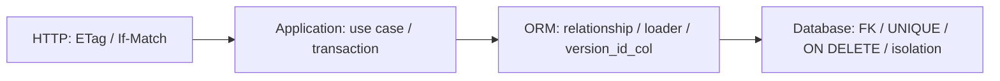
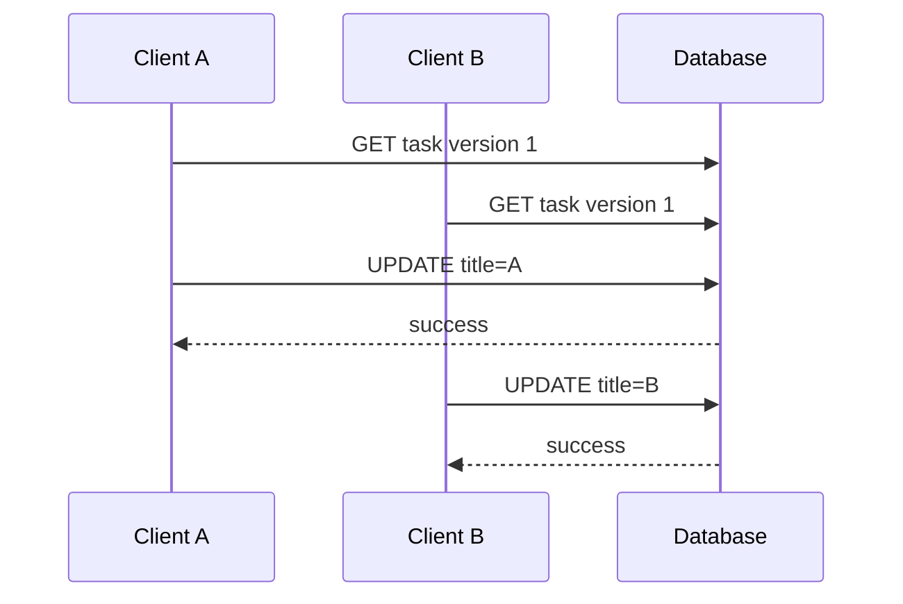

# SQLAlchemy relationship、加载策略、更新删除、并发控制与隔离级别

上一课把单表 task 写入数据库，并建立了 Session 与 transaction boundary。真实后端很快会遇到更难的问题：task 属于 project；删除 project 时 child rows 怎么办；返回多个 project 及 tasks 时为什么突然发出上百条 SQL；两个人同时编辑同一 task 时，后提交者为什么会悄悄覆盖前一个结果。

这些问题的共同点是：**单个 object 看起来正确，不代表多个 row、多个 query 和多个 transaction 组合后仍正确。**

本课建立 `Project 1 → N Task` 模型，并从数据库约束、ORM object graph、HTTP conditional request 三层解决它们。

> 验证环境：CPython 3.13.4；FastAPI 0.139.0、SQLAlchemy 2.0.51、Alembic 1.18.5、Pydantic 2.13.4、SQLite、pytest 9.1.1。SQLAlchemy 2.1 当时仍为 prerelease，本课使用稳定 2.0 line。

## 1. 为什么需要本课

考虑页面：

```text
Project A
  - Task 1
  - Task 2
Project B
  - Task 3
```

至少包含四类合同：

1. 每个 task 的 `project_id` 必须引用真实 project；
2. query 必须有意决定何时加载 tasks；
3. 删除 project 后不能遗留 orphan task；
4. PATCH 必须避免 stale client 覆盖新版本。

仅写 `project.tasks` 属性没有解决这些合同。正确模型是：



每层都负责不同问题，不能互相冒充。

## 2. Foreign key 与 relationship 不是一回事

### 2.1 Foreign key 是数据库约束

`tasks.project_id → projects.id` 由 database schema 强制。不存在 parent id 时，INSERT 应失败；删除 parent 时由 `ON DELETE` policy 决定 restrict、set null 或 cascade。

### 2.2 relationship 是 ORM 映射

`ProjectRow.tasks` 和 `TaskRow.project` 让 Python object graph 能沿关联导航，并告诉 SQLAlchemy 如何同步 object state。它不会单独在数据库里创建可靠 referential integrity；最终 schema 仍需要 `ForeignKey` 与 migration。

### 2.3 direction 也不同

foreign key 位于 many side：`tasks.project_id`。ORM 却可以同时提供：

- one-to-many：`project.tasks`；
- many-to-one：`task.project`。

`back_populates` 明确连接两侧，使同一 Session 内的 object graph 能协调变化。

完整 mapping：

<<< ../../../examples/python/fastapi-sqlalchemy-relationships-concurrency/relationship_api/orm.py

## 3. Cardinality 来自 schema，不只来自类型注解

`Mapped[list[TaskRow]]` 表达 one-to-many collection，但数据层 cardinality 还取决于 constraint：

- task 的 `project_id` non-null：每个 task 必须有 project；
- 没有 `UNIQUE(tasks.project_id)`：一个 project 可被多个 task 引用；
- composite unique `(project_id, title)`：同一 project 内 title 唯一，不同 project 可复用 title。

如果要 one-to-one，通常还需 foreign-key column 上的 unique constraint。只把 Python annotation 改成 scalar 并不能阻止数据库出现多行。

## 4. SQLite 必须显式开启 foreign key enforcement

SQLite 支持 foreign key syntax，但每个 connection 必须启用 `PRAGMA foreign_keys=ON` 才执行约束。本课在 Engine `connect` event 中配置每条新 DBAPI connection：

<<< ../../../examples/python/fastapi-sqlalchemy-relationships-concurrency/relationship_api/database.py

因果链：

```text
pool 创建 SQLite connection
  → connect listener 执行 PRAGMA
  → connection 进入 pool
  → Session 借用该 connection
  → FK/ON DELETE 真正生效
```

只在某个 test connection 手工执行一次不能保证 pool 后续 connection 也开启。测试直接查询 pragma 值，避免 migration 中写了 FK、运行时却没执行的假安全。

## 5. N+1 是怎样产生的

relationship 默认常采用 lazy select。若先查 N 个 projects，再逐个访问 `project.tasks`：

```text
SELECT projects ...               # 1
SELECT tasks WHERE project_id=1   # +1
SELECT tasks WHERE project_id=2   # +1
...
SELECT tasks WHERE project_id=N   # +N
```

总数从 1 变为 `1 + N`。问题不只是慢：

- SQL 在 property access 时隐式发生；
- serialization loop 可能成为数据库 query loop；
- Session 关闭后 lazy load 会失败；
- async ORM 中隐式 I/O 更受限制；
- load 增长随 parent 数量变化，测试小数据时不明显。

## 6. 为什么本课使用 `lazy="raise"`

mapping 将 relationship 设为 `lazy="raise"`。如果 query 没有预加载，访问属性直接报错，而不是偷偷发 SQL。

这是一种工程 guardrail：迫使 repository 在每个 use case 显式选择 loading strategy。它不是说 lazy loading 永远错误；单对象、短 Session 的场景可能合理。但 API serialization 通常更需要可预测 query count。

## 7. `selectinload` 的执行原理

repository 使用：

<<< ../../../examples/python/fastapi-sqlalchemy-relationships-concurrency/relationship_api/repository.py

`selectinload(ProjectRow.tasks)` 通常执行：

```sql
SELECT ... FROM projects ORDER BY projects.id;
SELECT ... FROM tasks WHERE tasks.project_id IN (?, ?, ...);
```

第二条 SQL 收集第一条结果中的 parent keys，一次加载所有 collections。因此对 3 个或 30 个 parent，常见简单情形都是 2 条 SELECT，而不是 `N+1`。

本课用 SQLAlchemy `before_cursor_execute` event 计数，3 个 projects 的访问严格断言为 2 条 SELECT。性能结论若没有 observation/test，很容易在一次 refactor 后退化。

## 8. `joinedload`、`selectinload` 与 lazy 的边界

### 8.1 `selectinload`

通常适合 one-to-many/many-to-many collection。parent query 不被 join row multiplication 改形，但会多一次或分批 IN query；composite key 与特定 backend 有限制。

### 8.2 `joinedload`

把关联放进同一 SELECT JOIN。many-to-one 常很合适；collection 会让每个 parent row 按 child 数量重复，传输数据膨胀。SQLAlchemy 2 collection joined eager load 还需要对 Result 使用 `unique()` 去重语义。

### 8.3 lazy loading

只在属性被访问时查询，未访问就不付成本；但 query count 隐式且易 N+1。

### 8.4 没有全局最佳策略

选择取决于 cardinality、page size、过滤、列宽、backend 与调用是否真正需要 relationship。loader strategy 应按 use case/query 设置，而不是把整个应用所有 relationship 一律 joined。

## 9. Response serialization 也是数据访问设计的一部分

Pydantic `from_attributes=True` 会读取 `ProjectRow.tasks`。若它未加载，serialization 可能触发 lazy SQL 或失败。因此：

```text
response shape
  → 决定需要哪些 relationships
  → repository 选择 loader strategy
  → transaction/session 保持到 mapping 完成
  → 输出纯 transport model
```

不要在 Session 已关闭后把任意 ORM graph 交给 serializer，并期待它自动知道加载什么。

HTTP models 与 PATCH 规则：

<<< ../../../examples/python/fastapi-sqlalchemy-relationships-concurrency/relationship_api/models.py

## 10. PATCH 与 PUT 的边界

PUT 通常表达替换目标 representation；PATCH 表达部分修改。本课 PATCH 只修改 client 明确提交的 fields：

```python
payload.model_dump(exclude_unset=True)
```

这区分：

- 字段缺席：不修改；
- 字段显式 null：client 要求设为 null。

本课 columns 不允许 null，因此 validator 拒绝显式 null；空 object 也被拒绝。不能用普通 `if payload.title:` 判断，因为 false/zero/empty 与未提交是不同状态。

## 11. Lost update 为什么发生

两个 client 都读取 version 1：



若 UPDATE 只按 id 匹配，B 静默覆盖 A。这叫 lost update。单次 UPDATE 都成功，不代表跨 transaction 语义正确。

## 12. HTTP ETag 与 `If-Match`

GET/成功 PATCH 返回强 entity tag：

```http
ETag: "1"
```

client 修改时带：

```http
If-Match: "1"
```

server 当前 representation 已是 version 2 时，precondition 不成立，返回 `412 Precondition Failed`。这比 generic 409 更准确表达 conditional request 失败。

示例只接受单个 quoted positive integer，不实现 `*` 或 tag list；这是当前 API 明确的受限合同，不是完整 HTTP `If-Match` grammar。

header dependency：

<<< ../../../examples/python/fastapi-sqlalchemy-relationships-concurrency/relationship_api/dependencies.py

## 13. Application pre-check 仍有 race window

service 读取 row 后比较：

```python
if row.version != expected_version:
    raise VersionConflictError
```

它能快速拒绝已明显过期的 request，但比较完成后、flush 前，另一个 transaction 仍可能提交。只做这个 check 仍有 TOCTOU race。

## 14. `version_id_col` 如何关闭 race

SQLAlchemy mapper 配置 version column 后，flush 的 UPDATE 逻辑类似：

```sql
UPDATE tasks
SET title = ?, version = 2
WHERE id = ? AND version = 1;
```

database atomic 判断 version。若另一个 transaction 已更新为 2，affected row count 为 0，SQLAlchemy 抛 `StaleDataError`。

```mermaid
sequenceDiagram
    participant A as Session A
    participant B as Session B
    participant D as Database
    A->>D: load id=1 version=1
    B->>D: load id=1 version=1
    A->>D: UPDATE ... WHERE version=1
    D-->>A: 1 row; version=2; COMMIT
    B->>D: UPDATE ... WHERE version=1
    D-->>B: 0 rows
    B-->>B: StaleDataError + rollback
```

该机制发生在 ORM flush 单 row tracking 中。绕过 object state 的 bulk/multi-row UPDATE 不会自动获得同样 version check。

事务与 stale mapping：

<<< ../../../examples/python/fastapi-sqlalchemy-relationships-concurrency/relationship_api/service.py

## 15. 两道并发防线各自负责什么

- `If-Match`：让 HTTP client 明确声明它编辑的 representation，支持友好 412；
- `version_id_col`：在 database UPDATE 时 atomic 检测 flush race。

只使用后者而不暴露 precondition，client 不知道如何避免覆盖；只用前者做 Python compare，又留有并发窗口。两者组合形成端到端 optimistic concurrency。

乐观锁没有阻塞其他 reader/writer；它允许竞争发生，再检测并拒绝 loser。失败后 client 要 reload、merge 或提示用户，不能无限盲重试覆盖业务冲突。

## 16. Update endpoint 的完整流程

<<< ../../../examples/python/fastapi-sqlalchemy-relationships-concurrency/relationship_api/router.py

1. FastAPI 验证 path/body；
2. dependency 解析 quoted `If-Match`；
3. service 开 transaction；
4. Session load current row/version；
5. application pre-check；
6. 只应用 `exclude_unset` fields；
7. flush 发出带 old version predicate 的 UPDATE；
8. row count 为 0 则 rollback 并映射 412；
9. 成功则 version increment、commit；
10. response 返回新 body 和新 ETag。

## 17. Delete cascade 有两个控制面

mapping 使用：

```text
ORM relationship: cascade="all, delete-orphan", passive_deletes=True
Database foreign key: ON DELETE CASCADE
```

### 17.1 ORM cascade

描述 Session 中 parent/child object operations 如何传播。`delete-orphan` 表示 child 从 parent collection 脱离时可被标记删除；通常用于 child 只能由该 parent 独占拥有的关系。

### 17.2 Database cascade

`ON DELETE CASCADE` 在 database 内删除 referencing rows，覆盖绕过 ORM 的 DELETE，并且无需 ORM 先加载所有 children。

### 17.3 `passive_deletes=True`

当 collection 未加载时，SQLAlchemy 信任 database cascade，不先 SELECT children 再逐行 DELETE。已加载 children 的 in-memory tracking 仍可能需要 ORM 处理；passive 并不表示 Session 完全不知道 cascade。

不要在 many-to-many 两侧无边界配置 delete cascade，否则删除可能沿 graph 扩散。ownership 必须先建模。

## 18. Migration 才是实际 schema

<<< ../../../examples/python/fastapi-sqlalchemy-relationships-concurrency/migrations/versions/20260716_01_projects_tasks.py

migration 顺序先建 parent，再建 child；downgrade 反向执行。它同时包含 FK、composite unique、check 和 index。

metadata 与 migration 必须一致，但职责不同：metadata 驱动当前 application mapping；migration 记录环境演化历史。

Alembic environment：

<<< ../../../examples/python/fastapi-sqlalchemy-relationships-concurrency/migrations/env.py

Alembic 配置：

<<< ../../../examples/python/fastapi-sqlalchemy-relationships-concurrency/alembic.ini

## 19. 事务隔离解决的是另一类并发问题

optimistic version counter 保护特定 row 的 stale update；isolation level 控制 transaction 之间能观察到什么。常见异常包括：

- dirty read：读到对方未提交数据；
- non-repeatable read：同 transaction 两次读同 row 得到不同 committed value；
- phantom：同 predicate 两次查询 row set 改变；
- write skew：两个 transaction 读取共同条件后更新不同 rows，合起来破坏 invariant。

`READ COMMITTED`、`REPEATABLE READ`、`SERIALIZABLE` 名称及具体保证依 backend 而异。不能只凭 level 名称推断所有 database 行为。

## 20. Version counter 不等于 Serializable

version column 只能检测 ORM 对该 versioned row 的 UPDATE/DELETE。它不能自动保护：

- 跨多 rows aggregate invariant；
- bulk UPDATE；
- 未参与 versioning 的 table；
- “值班人员至少一人在线”这类 write skew；
- 外部 API side effect。

复杂 invariant 可能需要 database constraint、explicit lock (`SELECT ... FOR UPDATE`)、serializable transaction、advisory lock 或重新建模。选择要基于冲突概率、成本和 retry semantics。

## 21. Isolation level 设置时机

isolation 通常配置在 Engine，或在 transaction 真正开始前对 Connection 设置。database 往往不能在 transaction 已进行后随意改变 isolation。

高 isolation 不等于免费 correctness：可能增加 blocking、serialization failure 和 retry。retry 必须重放整个 transaction，并保证外部 side effect/idempotency；不能只重跑最后一条 SQL。

SQLite locking/isolation 与 PostgreSQL MVCC 不同。本课 SQLite 并发测试验证 version predicate，不声称证明 PostgreSQL 所有隔离行为。

## 22. 完整 application 与错误映射

<<< ../../../examples/python/fastapi-sqlalchemy-relationships-concurrency/relationship_api/app.py

公开错误区分：

- 404 resource not found；
- 409 unique conflict；
- 412 stale entity tag；
- 400 malformed `If-Match`；
- 422 request parameter/body validation。

application errors：

<<< ../../../examples/python/fastapi-sqlalchemy-relationships-concurrency/relationship_api/errors.py

不要把 `StaleDataError`、constraint SQL、table name 和 driver message直接泄漏给 client。内部 log 保留 cause 与 request context，外部使用 stable code。

## 23. 完整测试如何证明结论

API tests：

<<< ../../../examples/python/fastapi-sqlalchemy-relationships-concurrency/tests/test_api.py

数据库机制 tests：

<<< ../../../examples/python/fastapi-sqlalchemy-relationships-concurrency/tests/test_database.py

fixtures 真实执行 migration：

<<< ../../../examples/python/fastapi-sqlalchemy-relationships-concurrency/tests/conftest.py

关键证据不是“页面 JSON 看起来正确”，而是：

- statement event 证明多个 parents 仍为 2 SELECT；
- 两个独立 Session 证明 stale flush 抛 `StaleDataError`；
- PRAGMA query 证明 SQLite FK enforcement 已开启；
- 删除 parent 后 GET child 为 404；
- stale HTTP update 返回 412 且最终 title 未被覆盖。

## 24. 运行方式与完整配置

<<< ../../../examples/python/fastapi-sqlalchemy-relationships-concurrency/pyproject.toml

<<< ../../../examples/python/fastapi-sqlalchemy-relationships-concurrency/.env.example

```bash
python3 -m venv .venv
source .venv/bin/activate
python -m pip install -e '.[test]'
alembic upgrade head
alembic check
python -m pytest
uvicorn relationship_api.app:app --reload
```

application 不在 startup 调用 `create_all()`；必须先 upgrade migration。

## 25. 与 Vue/JavaScript 的对照

### 25.1 N+1 类似 component loop 内偷偷 fetch

template 对每个 item 访问属性看似 O(N)，若每次访问都触发 network/database I/O，实际请求数也是 N。ORM lazy loading 让这件事更隐蔽。

### 25.2 PATCH 要保留 absent 与 null

JavaScript object 没有 key、key 为 `undefined`、JSON 中 key 为 `null` 不完全等价。JSON 不表示 `undefined`。前后端 patch contract 必须明确，而不是用 truthy 判断。

### 25.3 ETag 是 server-side compare-and-set token

它类似前端保存的 revision。client 提交“只有仍为 revision 1 才修改”；database version predicate 完成 atomic compare-and-set。

### 25.4 后端 state 不能靠最后写入者获胜默认解决

表单保存成功并不说明没有覆盖别人。冲突 UX 是产品行为：reload、diff、merge、force overwrite 都需显式设计。

## 26. 常见错误

### 26.1 有 relationship 没有 FK

Python 导航能工作，database 却允许 orphan rows。relationship 与 constraint 两边都要配置。

### 26.2 在 serializer 中接受隐式 lazy SQL

query count 随 response item 数增长。使用显式 loader 和 SQL count/observability。

### 26.3 collection 一律 `joinedload`

row multiplication 可能比额外 SELECT 更昂贵。按 cardinality 和 workload 选择。

### 26.4 SQLite migration 有 FK 就以为已启用

未对每条 connection 开 PRAGMA，约束可能不执行。

### 26.5 PATCH 用 `model_dump()` 覆盖所有字段

default `None` 会把未提交字段误当成更新。使用 `exclude_unset=True`。

### 26.6 只在 Python 比 version

compare 与 UPDATE 之间仍有 race。UPDATE predicate/`version_id_col` 才完成 atomic check。

### 26.7 捕获 stale 后自动无限 retry

重试可能再次冲突，也可能覆盖用户需要人工合并的修改。规定 retry budget 和语义。

### 26.8 bulk UPDATE 以为自动 version-check

mapper versioning依赖 flush 中的 individual object state；bulk statement 不自动获得同样保护。

### 26.9 ORM cascade 与 DB cascade 配置矛盾

Session object state、SQL emission 和 database effects 不一致。明确 ownership、cascade 与 passive deletes。

### 26.10 把 isolation 名称当跨数据库统一标准实现

核对当前 backend/driver 文档并做 concurrency integration test。

## 27. 工程检查清单

- relationship 与 foreign key constraint 同时存在；
- cardinality 有 unique/nullability 支撑；
- SQLite 每条 connection 开启 FK enforcement；
- response shape 驱动 loader strategy；
- N+1 有 statement count/trace 证据；
- collection joinedload 评估 row multiplication；
- pagination/order 与 eager load 组合经过验证；
- serializer 不在 Session 外触发 lazy load；
- PATCH 区分 absent/null/false/zero；
- write 使用完整 use-case transaction；
- client 通过 ETag/If-Match 声明旧版本；
- database UPDATE atomic 检查 version；
- StaleDataError rollback 后映射 412；
- bulk DML 不假设 mapper versioning；
- delete ownership、ORM cascade、DB ON DELETE 一致；
- passive deletes 行为对 loaded/unloaded collection 清楚；
- isolation level 按 backend 语义选择；
- serialization failure/retry 可重放整个 transaction；
- migration 包含 FK、index、unique、check；
- production database 有真实并发测试。

## 28. 本课结论

- foreign key 保护数据库引用，relationship 管 ORM object graph；二者相邻但不能替代。
- lazy relationship 会在 property access 隐式发 SQL，循环中形成 N+1。
- `selectinload` 常用两阶段查询加载 collection；`joinedload`、lazy 各有适用边界。
- `lazy="raise"` 能让遗漏的 loading plan 尽早失败。
- PATCH 必须使用 fields-set/`exclude_unset` 区分未提交与显式值。
- ETag/If-Match 提供 HTTP precondition，`version_id_col` 在 UPDATE 时 atomic 检测 race。
- optimistic versioning 保护特定 row lost update，不等于 serializable isolation。
- ORM cascade 描述 Session 行为，ON DELETE 描述数据库行为；`passive_deletes` 协调两者。
- 结论应由 statement count、独立 Sessions、constraint 和最终 database state 测试证明。

下一节建议：FastAPI 身份认证、密码存储、JWT/session、授权模型与常见 Web 安全边界。

## 29. 参考资料

- [SQLAlchemy：Working with ORM Related Objects](https://docs.sqlalchemy.org/en/20/tutorial/orm_related_objects.html)
- [SQLAlchemy：Relationship Configuration](https://docs.sqlalchemy.org/en/20/orm/relationships.html)
- [SQLAlchemy：Relationship Loading Techniques](https://docs.sqlalchemy.org/en/20/orm/queryguide/relationships.html)
- [SQLAlchemy：Cascades](https://docs.sqlalchemy.org/en/20/orm/cascades.html)
- [SQLAlchemy：Configuring a Version Counter](https://docs.sqlalchemy.org/en/20/orm/versioning.html)
- [SQLAlchemy：Transactions and Connection Management](https://docs.sqlalchemy.org/en/20/orm/session_transaction.html)
- [SQLAlchemy：SQLite Foreign Key Support](https://docs.sqlalchemy.org/en/20/dialects/sqlite.html#foreign-key-support)
- [MDN：If-Match](https://developer.mozilla.org/en-US/docs/Web/HTTP/Reference/Headers/If-Match)
- [MDN：412 Precondition Failed](https://developer.mozilla.org/en-US/docs/Web/HTTP/Reference/Status/412)
- [RFC 9110：Conditional Requests](https://www.rfc-editor.org/rfc/rfc9110.html#name-conditional-requests)
