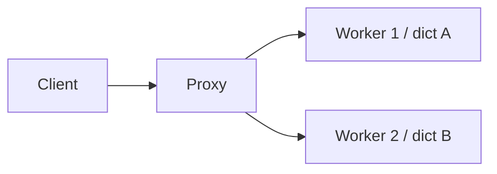
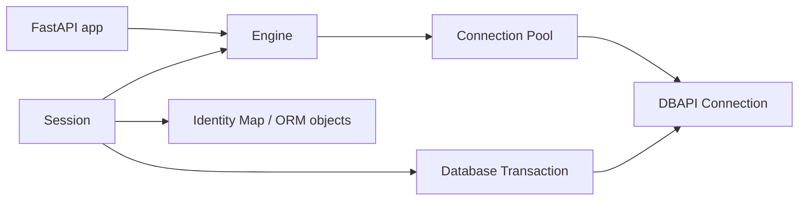
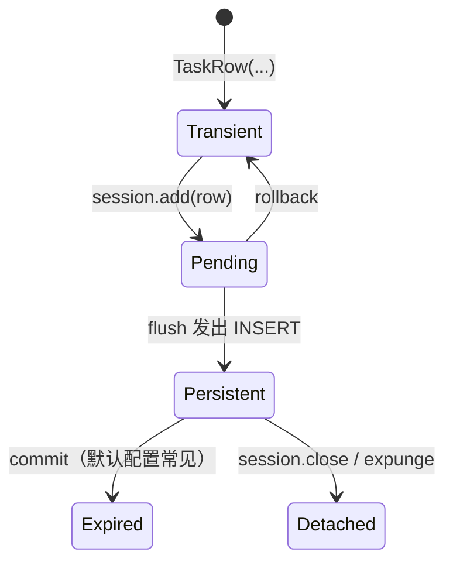
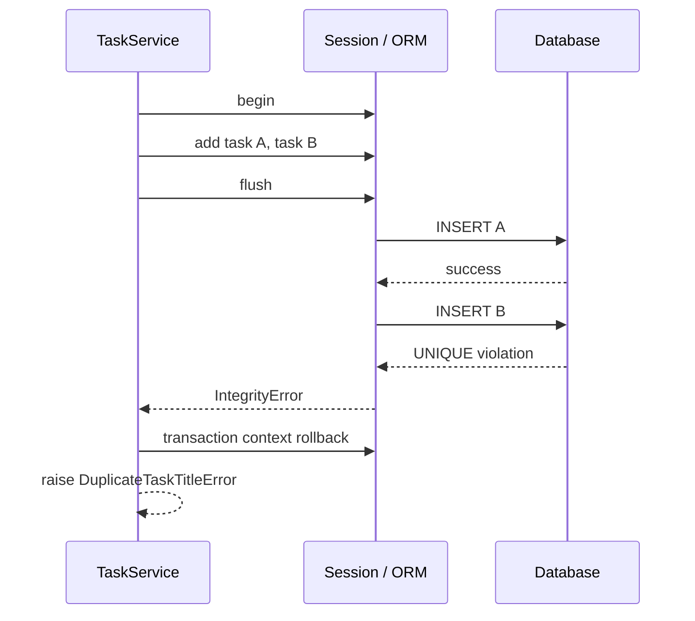
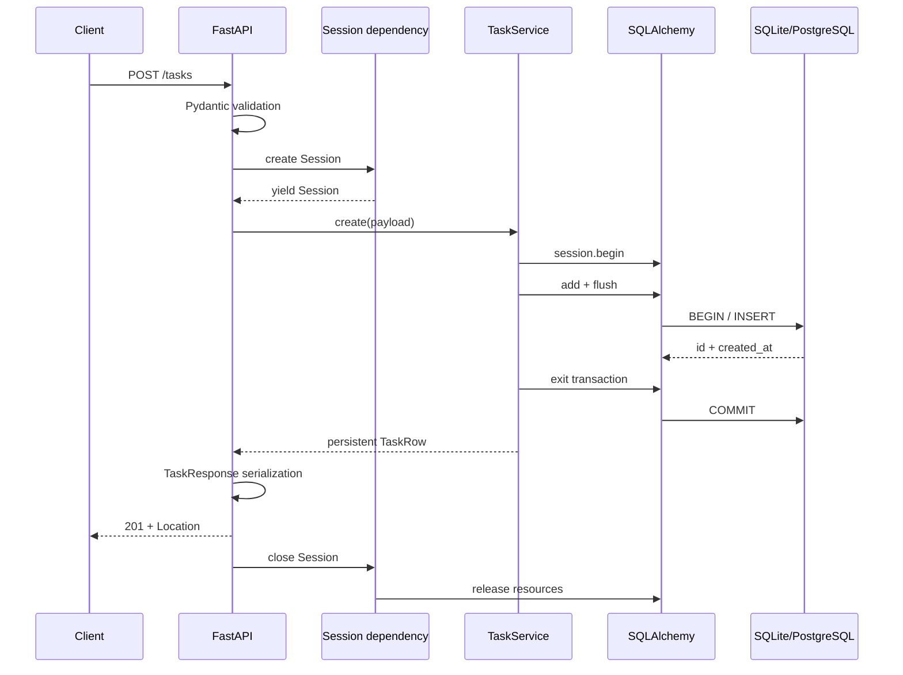

# FastAPI 使用 SQLAlchemy 2、Session、事务、Repository 与 Alembic

前两课的 task repository 都把数据放在 Python process 的 memory 中。它适合学习请求链路，却不具备后端系统真正需要的性质：process restart 后数据消失，多 worker 看见不同副本，两个并发请求可能破坏唯一性，一组相关写入也无法保证“全部成功或全部失败”。

本课把 task API 接到关系数据库，并重点回答四个问题：

1. 为什么 Pydantic validation 之后还需要 database constraint？
2. SQLAlchemy `Engine`、connection、transaction、`Session` 和 ORM object 分别是什么？
3. `flush()`、`commit()`、`rollback()` 为什么不能互换？
4. ORM class 改了以后，为什么 production database 不会自动安全升级？

> 本课验证环境：CPython 3.13.4；FastAPI 0.139.0、SQLAlchemy 2.0.51、Alembic 1.18.5、Pydantic 2.13.4、pydantic-settings 2.14.2、Starlette 1.3.1、Uvicorn 0.51.0、SQLite（Python 标准库驱动）、httpx2 2.7.0、pytest 9.1.1。项目声明支持 Python 3.11+。

示例选择同步 SQLAlchemy API 和 SQLite，是为了先看清事务与对象状态。生产可以换 PostgreSQL；async database API 会在后续并发与容量部分建立在相同事务语义之上。

## 1. 为什么内存 dict 不够

假设两个 worker 各有一个 dict：



第一次 `POST` 到 worker 1，第二次 `GET` 被分发到 worker 2，就可能得到 404。加 lock 也无济于事，因为 `asyncio.Lock` 只能协调同一个 process/event loop 中的 coroutine，无法让两个独立 memory space 共享状态。

关系数据库把 durable state 移出 application process，并提供：

- 明确 schema；
- primary key、unique、not-null、check、foreign key 等一致性约束；
- transaction isolation 和 atomic commit/rollback；
- concurrent client 协调；
- query、index、backup、replication 和 recovery 能力。

数据库不是“更大的 dict”。它是独立的状态系统，有自己的 protocol、连接容量、transaction 和 failure modes。

## 2. 关系模型的最小边界

### 2.1 Table、row、column

`tasks` table 描述一类 relation；每个 row 是一条 task record；column 定义名称和数据库类型。

### 2.2 Primary key

`id` 唯一标识 row。primary key 不等于业务可见编号，也不自动保证跨系统全局唯一。不要让 client 通过“最大 id + 1”生成主键。

### 2.3 Constraint

本课 schema 同时包含：

- `PRIMARY KEY (id)`；
- `UNIQUE (title)`；
- `CHECK (priority >= 1 AND priority <= 5)`；
- `NOT NULL`；
- status enum/check 语义。

Pydantic 已经限制 priority，为什么 database 还要 check？因为写数据库的不只当前 HTTP endpoint：migration、admin script、其他 service、旧版本 application 都可能写入。Pydantic 保护 transport boundary，constraint 保护 durable state boundary。

### 2.4 Index

index 是额外数据结构，用 storage 和 write cost 换取特定查询的访问效率。示例为 `status` 建 index，但“有 index”不等于 query 必然使用它；optimizer 会根据 predicate、数据分布和 cost 决定 execution plan。

unique constraint 常由数据库用 unique index 实现，但 constraint 的语义是数据规则，index 的语义是访问结构，不应仅因某个数据库内部实现相似就混为一谈。

## 3. ORM 解决什么、不解决什么

ORM 把 table/column/relationship 映射为 Python class/object，并把表达式编译为 SQL。它减少手写映射，不会消除：

- SQL execution model；
- transaction isolation 和 lock；
- index/query plan；
- connection pool 容量；
- N+1 query；
- backend dialect 差异。

把 ORM 当成“无需理解 SQL 的数据库 API”会制造最难定位的性能和一致性问题。

SQLAlchemy 由 Core 与 ORM 等层组成。Core 提供 Engine、Connection、SQL expression；ORM 在其上提供 declarative mapping、Session、identity map、unit-of-work style flush。

## 4. 五个经常混淆的对象



### 4.1 Engine

Engine 是 application-facing connection source 和 SQL dialect 入口。它通常是 process-level long-lived object，不是一次 HTTP request 创建一个。

Engine 通常延迟取得真实 connection；`create_engine()` 本身不等于已连接数据库。

### 4.2 Connection pool

pool 保存/调度可复用 DBAPI connections。`connection.close()` 在常见 pool 模式下通常表示归还 pool，而不是物理 TCP connection 必然关闭。

每个 Uvicorn worker 是独立 process，通常拥有独立 Engine 和 pool。总最大连接数近似为：

```text
worker 数 × 每 worker pool 容量 + overflow/运维连接
```

不能只看单 worker 配置就判断 database 是否承受得住。

### 4.3 DBAPI connection

这是 Python database driver 提供的底层 connection。SQLite 使用标准库 `sqlite3`；PostgreSQL 则需要对应 driver。SQLAlchemy dialect 把通用 expression 翻译为后端 SQL，并适配 driver 行为，但不能抹平所有差异。

### 4.4 Transaction

transaction 是一组数据库操作的 atomic boundary。commit 让结果成为已提交状态；rollback 撤销当前未提交 transaction 中的效果。

### 4.5 Session

`Session` 是 ORM 与 database conversation 的可变工作区：

- 跟踪 ORM object state；
- 维护 identity map；
- 执行 select/insert/update/delete；
- 在需要时从 Engine 取得 connection；
- 管理当前 logical transaction。

Session 不是 connection，也不是 thread-safe cache。它是 mutable、stateful object；一个 `Session` 或 `AsyncSession` 不能被多个并发 thread/task 共享。

## 5. Declarative mapping 是数据库模型

完整 mapping：

<<< ../../../examples/python/fastapi-sqlalchemy-transactions/sql_task_api/orm.py

### 5.1 `DeclarativeBase`

所有 mapped class 继承 `Base`，其 `metadata` 收集 table definitions。Alembic autogenerate 会比较这份 metadata 与当前 database schema。

metadata 是 schema 的 Python 描述，不是 database schema 本身。修改 class 不会让已存在数据库凭空改变。

### 5.2 `Mapped[T]` 与 `mapped_column()`

`Mapped[int]` 同时参与 type checking 和 SQLAlchemy mapping。`mapped_column(String(120))` 给出数据库 column detail。

Python `str`、Pydantic string、SQLAlchemy `String(120)` 和数据库实际 varchar/text type 位于不同层，不能假定所有 backend 都用完全相同方式存储和比较。

### 5.3 Python default 与 server default

`status` 使用 Python-side default；`created_at` 使用 `server_default=func.current_timestamp()`：

- Python default 通常在 ORM 生成 INSERT 时参与；
- server default 写在数据库 schema，由 database 在 INSERT 未提供该 column 时计算。

server default 能覆盖绕过 ORM 的写入，更接近 durable invariant。不同数据库的 time zone 与 timestamp 类型语义不同；SQLite 没有 PostgreSQL 那样完整的 timestamp-with-time-zone type，开发测试不能证明 production timestamp 行为完全一致。

## 6. Transport model 与 ORM model 必须分开

<<< ../../../examples/python/fastapi-sqlalchemy-transactions/sql_task_api/models.py

`TaskCreate` 不允许 client 提交 `id`、`status`、`created_at`；`TaskResponse` 可以输出它们；`TaskRow` 则描述 persistence mapping。

如果直接把 ORM model 当 request model，client 可能获得不应控制的 persistence fields。反过来，如果 repository 依赖 FastAPI request model，domain/persistence 边界也会与 HTTP contract 耦合。当前小型示例为减少转换代码让 repository 接受 `TaskCreate`，但更大系统通常会在 application layer 引入 command/domain value object。

`from_attributes=True` 允许 response model 从 ORM object attributes 读取数据。它不是深度 lazy-load 策略；若序列化时访问已 detached/expired relationship，仍可能触发错误或意外 query。

## 7. ORM object 的状态变化

一次创建不是“构造 object 后自动进数据库”：



简化边界如下：

- **transient**：普通 Python object，尚未加入 Session；
- **pending**：已加入 Session，通常还没 INSERT；
- **persistent**：对应当前 Session identity map 中的 database identity；
- **expired**：属性值被标记需下次访问时重新加载；
- **detached**：曾被持久化，但当前不属于 Session。

还有 deleted 等状态。理解这些状态，才能解释为什么“已经 `add()` 却查不到 id”“关闭 Session 后访问 relationship 报错”“rollback 后 object 状态改变”。

## 8. Identity map 不是通用 query cache

同一 Session 中按同一 primary key 加载 row，identity map 尽量保证得到同一 Python object identity。这让对象修改跟踪和 relationship consistency 可管理。

但 identity map 不会缓存任意 query result，也不会自动知道其他 transaction 已提交的新值。长生命周期 Session 可能持有 stale objects，因此 web application 通常采用 request/use-case scoped Session，而不是 global Session。

## 9. `add`、`flush`、`commit` 的因果链

示例创建两条 task：

```text
TaskRow(...)
  → session.add(): row 进入 pending
  → session.flush(): unit of work 排序并发出 INSERT
  → database 检查 NOT NULL / CHECK / UNIQUE
  → INSERT 成功，id/server default 回填，transaction 仍未提交
  → transaction context 正常退出
  → COMMIT
```

### 9.1 `flush()`

flush 把 Session 中 pending changes 同步到当前 transaction 中的 database。它可以取得 generated primary key，并提早暴露 constraint error。

flush **不等于 commit**。同一个 transaction 的当前 connection 能看到自己的写入，不代表其他 transaction 已能看到；随后 rollback 仍能撤销。

### 9.2 `commit()`

commit 会先 flush 必要 changes，再提交 transaction。提交成功之后，数据库才把这一组写入作为 completed transaction 对外呈现，具体可见性还受 isolation level 影响。

### 9.3 `rollback()`

rollback 结束失败的 transaction，撤销其中未提交的 database effects，并使 Session 中相关 object state 发生调整。

发生 flush error 后，底层 transaction 已失败。必须 rollback/退出 transaction context，不能捕获 `IntegrityError` 后继续用同一个 failed transaction 发 SQL。

## 10. Transaction boundary 应放在哪里

最危险的两个极端：

- repository 每个 method 都 commit：一个 use case 的多步写入无法 atomic；
- request dependency 在 `yield` 后无条件 commit：endpoint 看不见 commit failure，read request 也被隐式纳入 policy，事务边界藏在清理阶段。

本课把 transaction 放在 service use case：

<<< ../../../examples/python/fastapi-sqlalchemy-transactions/sql_task_api/service.py

`create_batch()` 的 `with session.begin()` 具有明确行为：block 正常结束就 commit；抛异常就 rollback 后继续向外传播。



由于 rollback 覆盖整个 transaction，A 即使已经执行过 INSERT，也不会留下。这就是 atomicity，不是“在 Python list 中删除 A”模拟出来的。

## 11. 为什么 catch 发生在 transaction context 外

代码结构是：

```python
try:
    with session.begin():
        ...
        session.flush()
except IntegrityError as error:
    raise DuplicateTaskTitleError from error
```

`IntegrityError` 离开 `with` 时，context manager 先 rollback；之后才映射 application error。若在 failed transaction 内捕获后直接返回，Session 仍处于需要 rollback 的状态。

当前示例把所有 `IntegrityError` 映射成 duplicate title，是基于 schema 中本 use case 唯一可能触发的 integrity rule。真实系统可能还有 foreign key、not-null、check 等错误；不能把所有 integrity failure 都误报为 duplicate。更稳健的做法是结合已知 constraint name/backend error code，并保留原异常作为内部日志 cause，但不要把原始 database message 暴露给 client。

application errors：

<<< ../../../examples/python/fastapi-sqlalchemy-transactions/sql_task_api/errors.py

## 12. `autobegin` 与 read transaction

SQLAlchemy Session 初始通常还没有 transaction。一旦 `add()`、`execute()`、query 或 persistent object mutation 需要工作，就 autobegin。

因此 GET 并不意味着“绝对没有 transaction”。数据库 read 往往也发生在 transaction context 中；Session close 时未提交 transaction 会 rollback 并归还 connection。rollback 一个纯读 transaction 不是业务失败，而是结束其 database transaction scope。

保持 transaction short 的含义是：不要在 transaction 中等待用户输入、远程 AI inference、长时间 network call 或无界 CPU 工作。持有 transaction 越久，connection、snapshot、row lock 与 contention 风险越大。

## 13. Session factory 配置

<<< ../../../examples/python/fastapi-sqlalchemy-transactions/sql_task_api/database.py

### 13.1 `sessionmaker`

`sessionmaker` 是配置好的 Session factory，不是 Session instance。Engine 和 factory 可为 process-level，实际 Session 则每个 request/use case 创建。

### 13.2 `autoflush=False`

默认 autoflush 会在部分 query 前自动 flush，使 query 看到 pending changes，也可能在看似 read 的位置触发 INSERT/constraint error。本课关闭它，并在 write transaction 中显式 `flush()`，让 SQL emission point 更易观察。

关闭 autoflush 不表示永远不 flush；commit 仍会 flush，示例也主动 flush 以便在 transaction block 内取得 id/default 并暴露 constraint failure。

### 13.3 `expire_on_commit=False`

SQLAlchemy Session 默认常在 commit 后 expire ORM attributes，下次访问时 reload，以减少把旧值当新值的风险。示例设为 false，让 write transaction commit 后能在 Session 关闭前稳定构造 response，而不发隐式 SELECT。

代价是 object 可能保留 stale value。这个配置不是普遍最佳实践；需要结合对象离开 transaction 后的使用方式决定。

### 13.4 `pool_pre_ping=True`

取用 pooled connection 时检查 stale connection，有助于处理数据库/网络已关闭的连接；它增加少量 round trip/driver cost，且不能替代 retry、timeout 或 transaction failure handling。

## 14. SQLite 的 `check_same_thread=False`

FastAPI 对同步 dependency 和同步 endpoint 使用 threadpool execution。一次 request 的不同同步调用不应依赖“永远在同一个 OS thread”这一假设。SQLite driver 默认限制 connection 只能在创建它的 thread 使用，因此官方示例常对 FastAPI 设置 `check_same_thread=False`。

这只关闭 driver 的 thread identity guard，不会让 SQLAlchemy Session 自动 thread-safe。示例仍保证一个 request 的 dependency graph 顺序使用自己的 Session，不把它提交给并发 thread/task。

SQLite 适合可复制课程和许多本地/轻量 workload，但它的 concurrent write、type、DDL、isolation 与 PostgreSQL 不相同。SQLite tests 不能替代 production database integration tests。

## 15. Request-scoped Session dependency

<<< ../../../examples/python/fastapi-sqlalchemy-transactions/sql_task_api/dependencies.py

执行过程：

1. `get_session` 从 app state 取得 factory；
2. `factory()` 创建一个 Session；
3. `yield` 注入 repository 与 service；
4. 同一 request dependency cache 复用该 Session；
5. response 完成后退出 `with`，Session close；
6. close 释放 identity map，并把 transaction/connection resource 归还 Engine/pool。

dependency 只负责 Session lifecycle，不决定业务 commit。这样 `GET`、单条 create、batch create 可以拥有各自清晰的 transaction policy。

## 16. Repository 负责 query 与 persistence vocabulary

<<< ../../../examples/python/fastapi-sqlalchemy-transactions/sql_task_api/repository.py

### 16.1 SQLAlchemy 2 style `select()`

现代 ORM query 使用 `select(TaskRow)`，再由 `Session.scalars()` 取得 mapped objects。它比 legacy `session.query()` 更统一地连接 Core/ORM expression model。

### 16.2 `Session.get()`

按 primary key 查找应优先理解 `Session.get()`：它可先利用 identity map，再按需发 SELECT。它与任意 WHERE query 的行为边界不同。

### 16.3 分页必须有稳定 order

SQL table 本身没有隐含 row order。使用 `offset/limit` 却不加 `order_by`，相邻页面可能重复或漏项。示例明确按 id 排序。

offset pagination 在深页可能昂贵，并且并发插入时页面会漂移。大数据/高并发 feed 常用基于唯一稳定 sort key 的 keyset/cursor pagination。

### 16.4 count 与 page 是两条 statement

`total` 和 items 在当前示例中由两个 SELECT 得到。它们是否看见完全相同 snapshot 取决于 database 和 isolation/transaction。接口若要求严格一致，应明确 transaction/isolation；不要因为共用 Session 就自动假设两条 query 原子。

## 17. FastAPI endpoint 为什么使用普通 `def`

<<< ../../../examples/python/fastapi-sqlalchemy-transactions/sql_task_api/router.py

标准同步 SQLAlchemy/SQLite driver 会 blocking。若把这些调用直接放入 `async def` endpoint，它们会阻塞 event loop，其他 request/cancellation/timer 都受影响。

本课 endpoint 和数据库 providers 使用普通 `def`，FastAPI 将同步 callable 放到 threadpool。这不是让 database 变成 async，只是把 blocking work 移出 event loop；threadpool 和 database pool 仍有容量限制。

另一条完整路线是 SQLAlchemy `AsyncEngine`、`AsyncSession` 加 async driver。不能只把 `Session` 改名为 `AsyncSession`：API 需要 `await`，pool/driver、transaction context、lazy loading 和测试方式都要一起改变。一个 `AsyncSession` 仍不能被多个 concurrent tasks 共享。

## 18. Application composition 与 Engine lifespan

<<< ../../../examples/python/fastapi-sqlalchemy-transactions/sql_task_api/app.py

application factory：

1. 接收经过验证的 settings；
2. 创建 process-level Engine；
3. 创建 Session factory；
4. 存入 app state；
5. include router 和 handlers；
6. shutdown 时 `engine.dispose()`。

`dispose()` 处理 Engine 当前 pool 中的 connections。它不负责提交各 request 未完成 transaction；每个 Session 必须先结束自己的 scope。

健康检查执行 `SELECT 1`，证明 connection/query path 可用，但不证明 migrations 已到 head，也不证明业务 table/权限/replica freshness 正常。生产 readiness 应按真实可服务条件定义，同时避免健康检查制造过大 database load。

## 19. Database constraint 到 HTTP error 的边界

重复 title 的因果链：

```text
client payload 合法
  → Pydantic validation 通过
  → INSERT 到 database
  → UNIQUE constraint 拒绝
  → SQLAlchemy IntegrityError
  → transaction context rollback
  → service 映射 DuplicateTaskTitleError
  → FastAPI handler 返回 409 duplicate_task_title
```

这里 HTTP 409 比 422 更贴近语义：payload 结构和值范围有效，但与当前 resource state 冲突。

不要在写入前只做 `SELECT title` 来保证唯一：两个并发 transaction 都可能先查到“不存在”，随后同时写入。pre-check 可以改善错误 UX，但最终 correctness 必须依靠 database unique constraint，并处理冲突异常。

## 20. Schema evolution 为什么需要 migration

第一次运行 application 时调用 `Base.metadata.create_all()` 看似方便，但 production schema evolution 不只是“创建缺少的 table”：

- rename column 不能安全推断；
- backfill data 需要顺序与批次；
- add NOT NULL column 可能需要先 nullable、填充、再加 constraint；
- large index creation 可能 lock table；
- rolling deployment 中新旧 application 要短暂兼容同一 schema；
- downgrade 可能丢数据，未必可逆。

因此 application startup 不执行 `create_all()`。部署流程先运行已审查的 Alembic revisions，再启动/切换 application traffic。

## 21. Alembic 的 revision graph

Alembic 不只是按文件名排序 SQL script。每个 revision 有：

- `revision`：当前节点 id；
- `down_revision`：父节点；
- `upgrade()`：向前变化；
- `downgrade()`：向后变化。

这组成 revision graph，可能出现 branch 和 merge。database 的 `alembic_version` table 记录当前 revision/head 状态。

初始 migration 完整源码：

<<< ../../../examples/python/fastapi-sqlalchemy-transactions/migrations/versions/20260716_01_create_tasks.py

注意 migration 是部署历史，已在环境执行后通常不应回头修改。修复要新增 revision，否则不同环境可能声称 revision id 相同、实际 schema 却不同。

## 22. Alembic environment 如何连接 metadata

<<< ../../../examples/python/fastapi-sqlalchemy-transactions/migrations/env.py

关键是：

```python
target_metadata = Base.metadata
```

autogenerate 将当前 database schema 与 metadata 比较，产出**候选 migration**。它能发现许多 table/column/index/constraint 变化，但不是完美 schema diff：rename 常被看成 drop + add，data migration 无法从类型声明推断，backend-specific DDL 也需要人工调整。

正确工作流：

```text
修改 ORM metadata
  → alembic revision --autogenerate
  → 人工审查 upgrade/downgrade
  → 在空数据库测试 upgrade
  → 在已有数据副本测试升级
  → 检查 schema 与 migration head
  → 按部署策略执行
```

`alembic.ini`：

<<< ../../../examples/python/fastapi-sqlalchemy-transactions/alembic.ini

示例允许测试代码覆盖 `sqlalchemy.url`。生产 connection URL 可能包含密码，不应提交到 ini 或打印到日志；应由 secret/configuration system 注入。

## 23. Offline migration 与 online migration

Alembic online mode 连接数据库并执行 DDL；offline `--sql` mode 生成 SQL text，不实际连接。offline output 可供 DBA 审查，但生成 SQL 所针对的 dialect 和运行环境必须明确。

DDL 是否 transaction-safe 取决于 backend 和具体 operation。不要假设 migration 失败后所有数据库都能像普通 DML 一样完整 rollback。

## 24. 配置与依赖版本

<<< ../../../examples/python/fastapi-sqlalchemy-transactions/sql_task_api/config.py

可提交的配置样例：

<<< ../../../examples/python/fastapi-sqlalchemy-transactions/.env.example

项目版本范围：

<<< ../../../examples/python/fastapi-sqlalchemy-transactions/pyproject.toml

SQLAlchemy 2.1 在本课验证时仍为 prerelease，因此示例固定稳定 2.0 minor line：`>=2.0.51,<2.1`。Alembic 的中间版本号可能包含显著变化，本课固定 `>=1.18,<1.19`。

## 25. 运行 migration 与 application

在示例目录执行：

```bash
python3 -m venv .venv
source .venv/bin/activate
python -m pip install -e '.[test]'

alembic upgrade head
alembic current
alembic check

uvicorn sql_task_api.app:app --reload
```

顺序很重要：先 upgrade schema，再接受 traffic。访问：

```text
http://127.0.0.1:8000/docs
http://127.0.0.1:8000/api/v1/health
```

查看将执行的 SQL 可以在本地设置：

```bash
TASK_DB_SQL_ECHO=true uvicorn sql_task_api.app:app --reload
```

SQL log 可能包含参数或敏感数据，production 不应无审查地长期打开。

生成新的候选 revision：

```bash
alembic revision --autogenerate -m "describe schema change"
```

生成后必须阅读文件，不要把“命令成功”当作 migration 正确。

## 26. 测试为什么必须真的跑 migration

若 test fixture 直接 `Base.metadata.create_all()`，测试验证的是“当前 ORM metadata 能创建 schema”，没有验证：

- migration 文件能否从空数据库到 head；
- revision imports 是否正确；
- constraint/index 是否实际存在；
- `alembic_version` 是否记录预期 revision。

本课每个 API test 先在临时 SQLite file 上运行 `alembic upgrade head`：

<<< ../../../examples/python/fastapi-sqlalchemy-transactions/tests/conftest.py

独立 migration test：

<<< ../../../examples/python/fastapi-sqlalchemy-transactions/tests/test_migrations.py

API/transaction tests：

<<< ../../../examples/python/fastapi-sqlalchemy-transactions/tests/test_api.py

最关键的失败测试不是“返回 409”，而是冲突之后查询 database，确认 batch 第一条 INSERT 也不存在。这直接证明 transaction rollback 的 atomicity。

临时 database 让测试彼此隔离。生产 PostgreSQL 特性仍需 PostgreSQL integration test；SQLite 只能验证共享的那部分 contract。

## 27. 一次成功写入的完整执行过程



BEGIN 是否作为独立 SQL 文本可见、generated values 如何返回、commit protocol 如何实现取决于 dialect/driver/backend，但 logical transaction sequence不变。

## 28. 一次失败 batch 的完整执行过程

输入包含“新 title”和“已存在 title”：

1. 两个 `TaskCreate` 都通过 Pydantic；
2. 两个 TaskRow 进入 pending；
3. flush 发出第一个 INSERT；
4. flush 发出第二个 INSERT；
5. database unique constraint 拒绝第二个；
6. SQLAlchemy 抛 `IntegrityError`；
7. `session.begin()` context rollback 整个 transaction；
8. service 映射为 application error；
9. handler 返回 HTTP 409；
10. request dependency close Session；
11. 下一 request 查询只看见冲突前已提交的数据。

如果每个 repository `add()` 都自行 commit，第一个 INSERT 已无法随第二个失败 rollback，这就是 transaction boundary 不能下沉到单条 repository method 的原因。

## 29. 与 JavaScript/Vue 开发经验对照

### 29.1 Session 不是 Pinia/Vuex store

前端 store 常是长生命周期 UI state；Session 是短生命周期、带 transaction/connection 行为的 ORM 工作区。global Session 会产生 stale state、连接泄漏和并发安全问题。

### 29.2 `await fetch()` 成功不等于 transaction 已成功

浏览器只会看到 server 已发送的 response。server 若在返回 201 后才隐式 commit，commit failure 就无法正确告诉 client。因此关键 write commit 应在构造成功 response 之前完成。

### 29.3 ORM object 不是 reactive object

修改 mapped attribute 会被 Session instrumentation 追踪，但它不是 Vue reactivity。flush 时 SQLAlchemy unit of work 收集变化；database constraint 和 transaction 才决定是否能持久化。

### 29.4 Migration 类似不可变发布历史

它不是每次启动重新计算的 schema snapshot，而是环境按 revision graph 执行的演化记录。修改已经发布的 revision 类似重写其他环境已经消费的 protocol history。

## 30. 常见错误与原因

### 30.1 Global Session

跨 request 共享 mutable transaction/identity map，造成并发错误、stale object 和 connection scope 不清。共享 Engine/factory，不共享 Session instance。

### 30.2 `async def` 中直接调用同步 Session

阻塞 event loop。使用同步 endpoint/threadpool，或完整采用 AsyncEngine/AsyncSession/async driver。

### 30.3 Repository 内随处 commit

破坏跨多步操作的 atomicity，让 service 无法决定 transaction boundary。

### 30.4 只 flush 不 commit

当前 request 内似乎获得 id，Session close 后 rollback，下一请求看不见数据。

### 30.5 flush 失败后继续 query

transaction 仍处于 failed state，需要 rollback。先让 transaction context 退出，再映射异常。

### 30.6 用 SELECT 代替 unique constraint

存在 check-then-act race。数据库 constraint 才是并发 correctness boundary。

### 30.7 把 `create_all()` 当 migration

无法可靠表达 rename、backfill、分阶段 constraint 和 rolling compatibility。

### 30.8 不审查 autogenerate

column rename 可能变成 drop/add，造成 data loss；data migration 和 backend operation 也不能自动推断。

### 30.9 offset pagination 不排序

SQL 不承诺自然顺序，page 结果不稳定。

### 30.10 序列化时触发 lazy loading

response 看似只是读 attributes，却额外发 N+1 query，或 Session 已关闭后失败。query loading strategy 与 response mapping 必须显式设计。

### 30.11 用 SQLite 证明 PostgreSQL 行为

两者的 type、constraint、DDL、locking、isolation、concurrent writes 均有差异。单元测试快，不代表 production dialect 已验证。

### 30.12 transaction 中调用慢外部 API

长时间占用 connection/snapshot/lock。通常先缩短 database transaction，并通过 outbox/idempotency 等模式协调外部 side effect；数据库 transaction 无法直接 rollback 已发送的 email 或第三方 HTTP call。

## 31. 工程检查清单

- durable state 不保存在 worker-local memory；
- transport validation 与 database constraint 双层防护；
- primary/unique/check/foreign key 的语义明确；
- index 由真实 query plan 和 workload 驱动；
- Engine 是 process-level，Session 是 request/use-case scoped；
- Session 不跨 concurrent thread/task 共享；
- transaction boundary 位于完整 business use case；
- commit 在 success response 构造前成功；
- flush 与 commit 不混淆；
- flush failure 后 rollback；
- IntegrityError 按已知 constraint 细分，不泄露 DB message；
- read transaction 也能及时结束；
- transaction 中没有无界 network/CPU 等待；
- autoflush 与 expire_on_commit 配置有明确理由；
- query 使用 SQLAlchemy 2 `select()` style；
- pagination 有唯一稳定 order；
- count/page snapshot 一致性要求明确；
- sync Session 不阻塞 event loop；
- pool size 按所有 workers 总量计算；
- SQLite `check_same_thread=False` 不冒充 Session thread safety；
- application startup 不用 `create_all()` 替代 migration；
- ORM metadata 与 migration revision 同步；
- autogenerate output 人工审查；
- migration 在空库和已有数据场景测试；
- production dialect 有真实 integration test；
- migration/SQL logs 不泄露 connection secret 或业务数据；
- rollback 失败路径有测试；
- Engine 在 lifespan shutdown dispose。

## 32. 本课结论

- 关系数据库提供独立 durable state、constraint、concurrency coordination 和 transaction，不是 process-local dict 的简单替换。
- SQLAlchemy Engine 管理 dialect/connection source；Session 管理 ORM conversation、identity map 和 logical transaction；二者生命周期不同。
- ORM object 经 transient、pending、persistent、expired/detached 等状态变化，`add()` 不等于已 INSERT。
- flush 把 changes 发到当前 transaction，commit 才提交；rollback 能撤销同一 transaction 的全部未提交 effects。
- transaction boundary 属于完整 use case，不应由每个 repository method 随意 commit，也不应隐藏在 response 后的 dependency cleanup。
- database constraint 是并发 correctness 的最终边界；pre-check 和 Pydantic 不能替代 unique/check/foreign key。
- 同步 SQLAlchemy 放在同步 FastAPI callable/threadpool；AsyncSession 需要完整 async stack，且仍不可并发共享。
- Alembic revision 是 schema 演化历史；autogenerate 只产出候选，必须人工审查和真实升级测试。
- 测试应运行 migrations，并直接验证 rollback 后 database state，而不只检查 HTTP status。

下一节建议：FastAPI 数据访问进阶——relationship、foreign key、N+1、loading strategy、update/delete、optimistic concurrency 与 transaction isolation。

## 33. 参考资料

- [FastAPI：SQL Databases](https://fastapi.tiangolo.com/tutorial/sql-databases/)
- [SQLAlchemy 2.0：ORM Quick Start](https://docs.sqlalchemy.org/en/20/orm/quickstart.html)
- [SQLAlchemy 2.0：Session Basics](https://docs.sqlalchemy.org/en/20/orm/session_basics.html)
- [SQLAlchemy 2.0：Transactions and Connection Management](https://docs.sqlalchemy.org/en/20/orm/session_transaction.html)
- [SQLAlchemy 2.0：State Management](https://docs.sqlalchemy.org/en/20/orm/session_state_management.html)
- [SQLAlchemy 2.0：ORM Querying Guide](https://docs.sqlalchemy.org/en/20/orm/queryguide/)
- [SQLAlchemy 2.0：Engine Configuration](https://docs.sqlalchemy.org/en/20/core/engines.html)
- [SQLAlchemy 2.0：Connection Pooling](https://docs.sqlalchemy.org/en/20/core/pooling.html)
- [SQLAlchemy 2.0：SQLite Dialect](https://docs.sqlalchemy.org/en/20/dialects/sqlite.html)
- [SQLAlchemy 2.0：Asyncio](https://docs.sqlalchemy.org/en/20/orm/extensions/asyncio.html)
- [Alembic：Tutorial](https://alembic.sqlalchemy.org/en/latest/tutorial.html)
- [Alembic：Auto Generating Migrations](https://alembic.sqlalchemy.org/en/latest/autogenerate.html)
- [Alembic：Cookbook](https://alembic.sqlalchemy.org/en/latest/cookbook.html)
- [SQLite：Transactions](https://www.sqlite.org/lang_transaction.html)
- [SQLAlchemy 2.0.51 on PyPI](https://pypi.org/project/SQLAlchemy/2.0.51/)
- [Alembic 1.18.5 on PyPI](https://pypi.org/project/alembic/1.18.5/)
