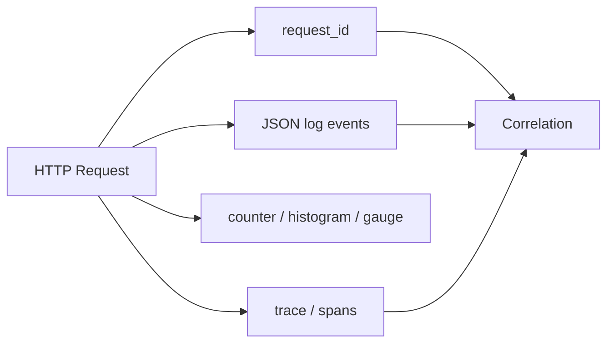

# FastAPI 测试、结构化日志、Metrics、Tracing 与生产可观测性

系统返回 500 时，“去服务器看日志”不是可操作的诊断方案。多 worker、多实例和下游服务中，同一请求会产生大量并发事件；只有能回答**发生了什么、影响多少请求、慢在哪里、完整因果链是什么**，系统才真正可观测。

本课把一个 HTTP 请求同时映射为：

- request ID：面向用户支持与日志检索的相关 id；
- structured log：离散事件与诊断字段；
- metric：聚合趋势、SLO 与告警；
- trace/span：单次分布式请求的时序和因果关系。

第一次先做到两件事：失败路径有自动化测试；一条请求能用安全的 request ID 串起响应和日志。Metric 用于看总体趋势，trace 用于看一次跨组件时序，它们不能用“多打日志”替代。采集器、exporter 和完整 OpenTelemetry 配置属于部署阶段。

> 验证环境：CPython 3.13.4；FastAPI 0.139.0、OpenTelemetry SDK 1.43.0、semantic conventions 0.64b0、prometheus-client 0.25.0、pytest 9.1.1。OpenTelemetry traces/metrics 已稳定，logs 状态与相关 package 仍需按当前版本核对；示例使用 Python logging 输出 JSON。

## 1. 为什么四种信号不能互相替代



- log 适合“某次失败的 error type 和业务阶段”；
- metric 适合“过去 5 分钟 5xx rate 是否超过 SLO”；
- trace 适合“这次 1.8 秒中 database、HTTP、AI inference 各花多久”；
- request ID 方便 support 从 client response 定位日志，但不描述跨服务 parent-child causal graph。

把每次请求都写成 metric label 会爆炸；把所有 latency 只写日志又难做可靠 percentile。选择信号必须服从数据模型。

## 2. Request ID 的执行边界

client 可发送 `X-Request-ID`，server 校验只允许 8–64 个安全字符；无效或缺失则生成 UUID hex。原因是外部 header 不可信：超长值、换行或任意字符可能污染日志和存储。

middleware 将 id 放进 `ContextVar`，返回 response header，并在 `finally` 用 token reset：

```text
set(request_id)
  → endpoint / nested coroutine 读取
  → success 或 exception
  → finally reset(token)
```

若忘记 reset，复用 execution context 时可能把上一个请求 id 带到后续日志。`ContextVar` 支持 async context propagation，但不是跨 process/service 的网络传播协议。

## 3. 结构化日志不是把字符串伪装成 JSON

完整 telemetry helpers：

<<< ../../../examples/python/fastapi-observability/observable_api/telemetry.py

JSON formatter 输出固定 keys：level、message、request_id、trace_id、fields。这样 collector 不必正则解析自然语言。

message 应是稳定 event name，例如 `request.completed`；动态值放 fields。否则同一类事件因文案变化无法聚合。

## 4. 敏感数据清洗必须在出口集中

示例递归 redact `authorization/cookie/password/token/secret`。这是最后一道防线，不代表上游可以任意记录 request body。

生产还需处理：

- key 变体，如 `access_token`、`client_secret`；
- nested model、exception repr 与 URL query；
- email/IP 等个人数据；
- database SQL parameter；
- trace attributes 与 baggage。

优先采用 allowlist：只记录诊断必需字段。blacklist 永远可能漏掉新名称。

## 5. Trace ID 与 Request ID 的区别

trace id 由 tracing system 建立，并通过 W3C `traceparent` 跨网络传播；span id 标识 trace 内一步。request id 常是应用/网关自定义字符串。

两者都写进 log，可以从 support ticket 的 request id 进入 log，再跳到完整 trace。不要强行让二者相同：trace sampling、fan-out、message processing 和重试的语义不同。

## 6. OpenTelemetry context propagation

incoming `traceparent`：

```text
00-<trace-id 32 hex>-<parent-span-id 16 hex>-<flags>
```

server extract parent context，创建 `SpanKind.SERVER` span；内部工作创建 child span。调用下游时需要 inject current context 到 outgoing headers，instrumentation library 通常自动完成。

完整 middleware/application：

<<< ../../../examples/python/fastapi-observability/observable_api/app.py

不要接受 client 自报的 arbitrary trace attributes 作为可信身份或授权信息。propagation 是诊断因果链，不是 security credential。

## 7. Span 要记录什么

Server span 命名使用低基数 route template：`GET /api/v1/work/{item_id}`，不是 `GET /api/v1/work/92731`。attributes 记录 route、status 等标准/稳定字段。

exception path：

1. record exception event；
2. status 设置 ERROR；
3. structured error log；
4. metrics status 500；
5. re-raise，由 FastAPI/Starlette error middleware生成 response。

Observability 不应吞异常或改变业务 error mapping。

## 8. Prometheus 三种核心 metric

### 8.1 Counter

`http_server_requests_total` 只递增，按 method、route、status 聚合。可计算 request rate/error rate。

### 8.2 Histogram

duration histogram 把 observation 放入 buckets，可在多个 instances 汇总计算 quantile。bucket 必须贴合 workload/SLO；默认 buckets 不一定适合 AI streaming 或低延迟 API。

### 8.3 Gauge

in-progress 可升可降，观察当前并发。它不是 queue length，也不直接等于 resource saturation。

## 9. Cardinality 为什么会毁掉 metric system

每种 label combination 是独立 time series。若 route label 使用 raw URL、user id、request id、exception message：

```text
users × paths × status × instances × ... → 无界 series
```

memory、storage 和 query cost 爆炸。metrics label 只能使用有限集合，如 method、route template、status class。user/request/document id 放 log/trace，不放 metric labels。

本课测试请求 `/work/7` 与 `/work/999`，断言只出现同一 `{item_id}` series，counter 为 2。

## 10. `/metrics` 的生产边界

Prometheus client 可作为 ASGI endpoint 暴露。生产中 metrics 往往包含内部 route、runtime 和容量信息，应由内网、sidecar、network policy 或 authentication 限制，不直接公开互联网。

多 process worker 的 Python Prometheus metrics 需要 multiprocess 模式与专门目录/lifecycle。单 process 示例不能直接复制为多 worker 聚合方案。

## 11. Sampling 与 exporter

每次请求生成 trace 有 CPU、allocation、network 和 storage cost。head sampling 在 trace 开始决定，tail sampling 可根据完整 trace/error/latency 决定但需要 collector buffering。

错误 sampling 可能丢掉罕见失败；100% sampling 又可能成本过高。metrics 应覆盖总体，traces 抽样解释个体。

示例测试用 `SimpleSpanProcessor + InMemorySpanExporter`，确定性强；production 常用 `BatchSpanProcessor + OTLP exporter → OpenTelemetry Collector`，避免请求同步等待 telemetry backend。

## 12. 测试体系不是只有 TestClient

### 12.1 Unit test

验证 redaction、request-id validation、业务 pure functions。快、定位准，不验证 ASGI wiring。

### 12.2 Component/application test

TestClient 运行 in-process ASGI，验证 middleware、routing、error、telemetry correlation。本课属于这一层。

### 12.3 Integration test

真实 database、Redis、collector/exporter contract。避免用 mock 证明 driver/protocol 行为。

### 12.4 End-to-end

真实 socket、proxy、TLS、deployment、multiple workers 和 external systems。数量少但验证 production path。

测试金字塔不是“unit 越多越好”的配额，而是按 failure risk 选择最低成本、足以证明结论的层级。

## 13. 可观测性测试本身要验证什么

完整测试：

<<< ../../../examples/python/fastapi-observability/tests/test_observability.py

覆盖：

- valid request id 回传；invalid id 替换；
- request 后 ContextVar 恢复 None；
- JSON log 关联同一 trace/request id；
- Authorization value 不进入 log；
- raw resource id 不进入 metric label；
- incoming traceparent 的 trace/parent span id 保留；
- 500 同时生成 error span、error log、status metric。

只测试成功路径会让 telemetry 在最需要它的异常时失效。

## 14. 中间件顺序与计时边界

Middleware nesting 决定计时包含哪些工作、exception 是否已经转换为 response、CORS/request-id header 是否覆盖 error response。

本课 middleware 从进入到 response/exception 覆盖 application processing，但 TestClient timing 不代表真实 proxy/network latency。必须明确 SLI measuring point：load balancer、ASGI server、application 还是 downstream client。

streaming response 更特殊：`call_next` 返回 Response 不表示 body 已发送完。若 SLI 是完整 stream duration，需要 ASGI send-level instrumentation，不能沿用普通 JSON endpoint 计时结论。

## 15. RED、USE 与 SLO

Service 常看 RED：Rate、Errors、Duration；resource 常看 USE：Utilization、Saturation、Errors。

SLO 示例不是“平均延迟 < 200ms”，而是某个窗口内 99% eligible requests 在阈值内且成功率达到目标。average 会掩盖 long tail。

告警应基于用户影响/error-budget burn，而不是每次异常都发通知。日志用于诊断，不等于告警策略。

## 16. 与 Vue/JavaScript 对照

- 浏览器 correlation id 应读取 response header并在反馈中携带，但不能把它当授权 token；
- frontend performance trace 与 backend trace 需通过 W3C context/受控 gateway 连接；
- `console.log(object)` 不是稳定 structured logging contract；
- dynamic URL 放 metric label 类似把每个 component instance 建一条永久 time series；
- 前端错误上报同样要 scrub token、cookie、form 与 source map 中的敏感数据。

## 17. 运行与版本

<<< ../../../examples/python/fastapi-observability/pyproject.toml

```bash
python3 -m venv .venv
source .venv/bin/activate
python -m pip install -e '.[test]'
python -m pytest
uvicorn observable_api.app:app --reload
```

访问 `/api/v1/work/7` 与 `/metrics`。示例未配置 production exporter，因此不会向外部 backend 发送 spans。

## 18. 常见错误

- 用 raw path、user id、request id 作为 metric label；
- 把 password/token/body 记录到 log 或 span；
- 日志只写自然语言，字段靠正则解析；
- 只在 success response 记录 metrics，exception 全丢；
- 忘记 reset ContextVar，跨请求污染；
- traceparent 当可信业务身份；
- 同步 exporter 阻塞 request；
- 每个 worker 独立 metrics 却按单进程抓取；
- `/metrics` 暴露公网；
- TestClient latency 冒充 production latency；
- streaming completion 使用普通 response timing；
- 采集一切但没有 SLO、dashboard、retention 和告警 owner。

## 19. 工程检查清单

- request id 校验、回传并 finally reset；
- log 使用稳定 event name 与 typed fields；
- secret/PII allowlist/redaction 覆盖 log、trace、error；
- trace/log 写入 correlation ids；
- W3C context 在 incoming/outgoing 正确传播；
- span name 和 metric route 使用 template；
- metric labels 有界；
- counter/histogram/gauge 语义正确；
- exception path 记录且不吞异常；
- exporter batching、timeout、backpressure 与 failure policy 明确；
- sampling 与成本/SLO 对齐；
- metrics endpoint 受保护；
- multi-worker metrics 模式已配置；
- unit/component/integration/E2E 各自证明范围明确；
- telemetry failure 不影响核心请求；
- dashboard、alert、runbook 与 owner 配套。

## 20. 本课结论

- Logs、metrics、traces 与 request id 回答不同问题，通过 correlation 形成诊断闭环。
- ContextVar 适合进程内 async context，W3C Trace Context 负责跨服务传播。
- Metrics 必须低基数；resource id 属于 log/trace，不属于 label。
- JSON 格式不自动安全，敏感数据必须在采集前最小化与清洗。
- Exception path、ContextVar reset、route template 和 parent context 都应自动测试。
- TestClient 验证 application，不验证 proxy、socket、多 worker 与 production latency。
- 可观测性的终点是 SLO、告警、runbook 和改进决策，不是收集最多数据。

下一节：[后台任务、消息队列、幂等、重试、Transactional Outbox 与 SSE](/backend/fastapi/background-tasks-queues-idempotency-retries-outbox-and-sse)。

## 21. 参考资料

- [OpenTelemetry Python](https://opentelemetry.io/docs/languages/python/)
- [OpenTelemetry Python Instrumentation](https://opentelemetry.io/docs/languages/python/instrumentation/)
- [OpenTelemetry Context Propagation](https://opentelemetry.io/docs/languages/python/propagation/)
- [W3C Trace Context](https://www.w3.org/TR/trace-context/)
- [Prometheus Python Client](https://prometheus.github.io/client_python/)
- [Prometheus ASGI](https://prometheus.github.io/client_python/exporting/http/asgi/)
- [OpenTelemetry SDK 1.43.0 on PyPI](https://pypi.org/project/opentelemetry-sdk/1.43.0/)
- [prometheus-client 0.25.0 on PyPI](https://pypi.org/project/prometheus-client/0.25.0/)
