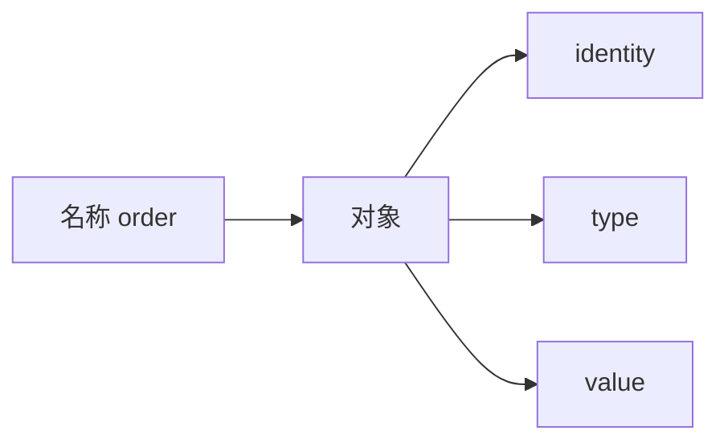
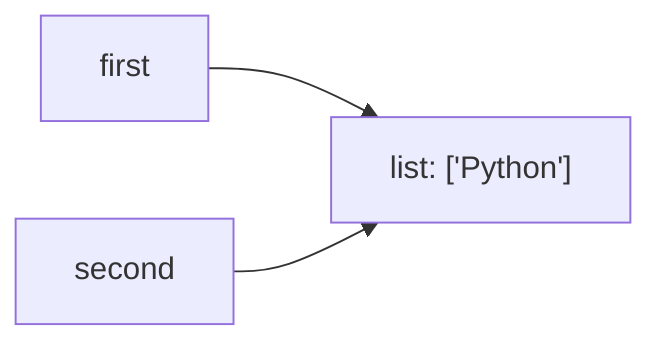
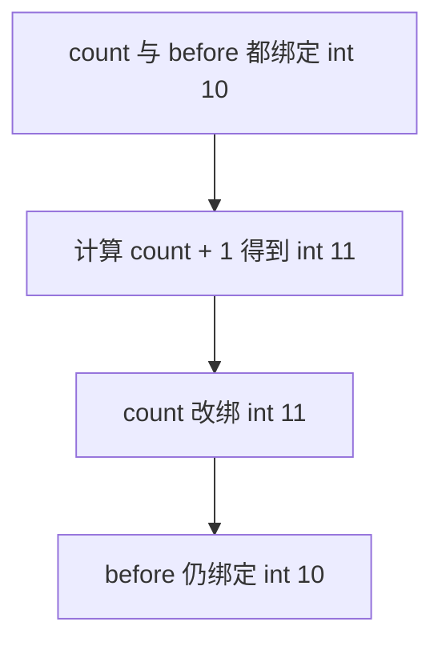
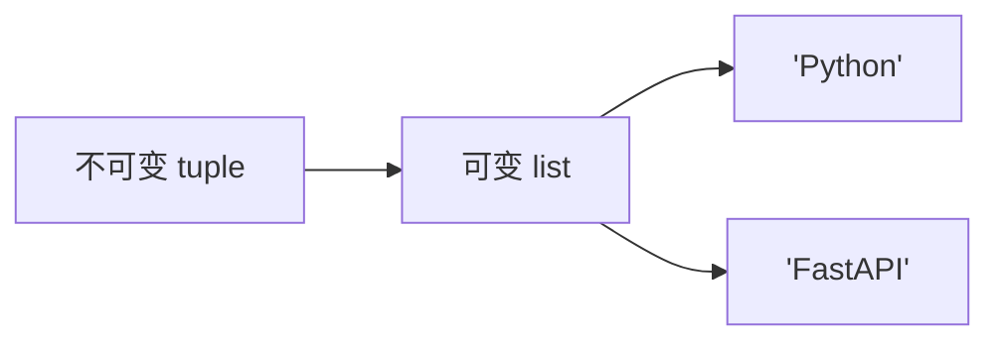
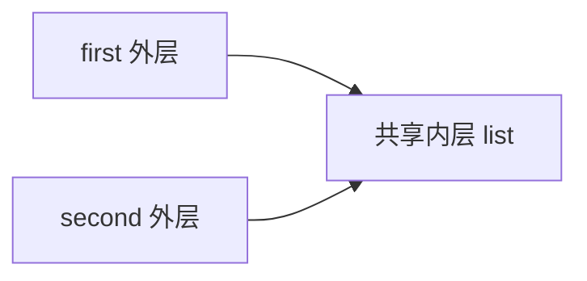
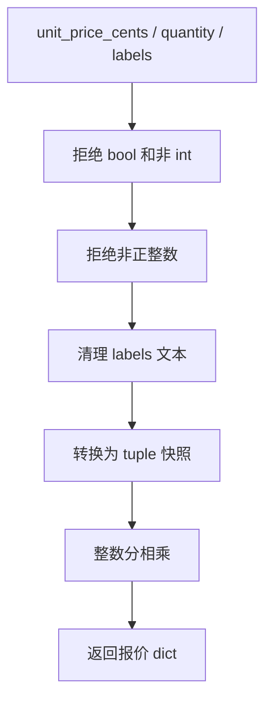

# Python 基础语法与对象模型：名称绑定、可变性、数字、字符串与真值

> 官方语义基线：Python 3.14.6。示例兼容 Python 3.11+，已在 CPython 3.13.4 验证。

## 1. 为什么语法课必须从对象模型开始

从 JavaScript 或 Java 转到 Python，下面代码看起来很普通：

```python
second = first
second.append("new")
```

但要预测 `first` 是否变化，必须先回答：变量里“装”的是什么、赋值是否复制、对象能否原地变化。

类似地：

- `a == b` 与 `a is b` 为什么可能不同？
- `value or default` 为什么会吞掉合法的 `0`？
- `True` 为什么能通过整数类型检查？
- `-7 // 3` 为什么是 `-3` 而不是 `-2`？
- 字符串不可变，为什么 `text += suffix` 又能工作？
- tuple 不可变，为什么其中的 list 仍能变化？

若只背 API，这些现象像例外；建立“名称绑定对象，对象具有身份、类型和值”的模型后，它们是同一套规则的结果。

## 2. 本课目标

完成本课后，应能解释：

- 名称、绑定、对象、值、类型和身份的边界；
- 赋值为什么通常不复制对象；
- 可变与不可变描述的是对象，不是变量；
- `==`、`is`、`id()` 分别比较什么；
- 浅拷贝为什么仍可能共享状态；
- `int`、`float`、`bool` 的重要工程行为；
- `str`、Unicode code point 与 bytes 的区别；
- `None` 的正确判断方式；
- 真值测试和短路求值如何运行；
- `and` / `or` 为什么不保证返回 bool；
- 运算符、链式比较、解包和增强赋值的准确语义。

## 3. Python 中一切数据都由对象表示

Python 数据模型规定，每个对象具有：

1. **identity 身份**：对象创建后保持不变；
2. **type 类型**：决定支持的操作和可能的值；
3. **value 值**：对象所表示的数据，其中一些对象的值可以变化。



名称不是对象内部的一块固定存储槽；名称存在于命名空间中，并绑定对象。

## 4. 赋值的核心是建立绑定

```python
price = 1_299
```

可以理解为：

1. 求值右侧整数表达式，得到整数对象；
2. 在当前命名空间中，让名称 `price` 绑定该对象。

随后：

```python
price = "1299"
```

不是把整数对象“变成”字符串，而是让 `price` 改为绑定另一个字符串对象。

### 4.1 动态类型不是没有类型

Python 对象有确定类型，但名称可以在不同时间绑定不同类型的对象：

```python
value = 42
value = "forty-two"
```

动态发生的是绑定，类型没有消失。`42 + "1"` 仍会因不兼容操作抛出 `TypeError`。

### 4.2 注解不改变默认运行时规则

```python
count: int = 3
count = "three"
```

CPython 默认不会仅根据注解阻止第二次绑定。静态类型检查器可以报告问题，但运行时校验仍需要明确代码或框架。

## 5. 多个名称可以绑定同一个对象

```python
first = ["Python"]
second = first
```

第二行不会复制列表：



执行：

```python
second.append("FastAPI")
```

`append` 改变列表对象本身，因此通过 `first` 也能观察到：

```python
["Python", "FastAPI"]
```

这不是 second “影响” first，而是两个名称一直指向同一个对象。

## 6. 身份相等与值相等

### 6.1 `==` 比较值语义

```python
first = [1, 2]
second = [1, 2]
first == second  # True
```

列表按元素比较，因此值相等。

### 6.2 `is` 比较对象身份

```python
first is second  # False
```

它们是分别创建的两个列表对象。

### 6.3 `id()` 的边界

`id(obj)` 返回对象生命周期内唯一的身份整数。CPython 当前通常使用内存地址表达，但这是实现细节，不应写入数据库或作为跨进程业务 ID。

对象销毁后，其 id 数值未来可能被另一个对象复用。

### 6.4 不要用 `is` 比较字符串或数字

CPython可能缓存或复用某些不可变对象：

```python
a = 256
b = 256
a is b  # 结果不能作为值判断契约
```

值比较使用 `==`。身份判断主要用于 `None` 等明确单例，或确实关心同一对象的场景。

## 7. 可变性描述对象的值能否变化

### 7.1 常见不可变类型

- `int`、`float`、`complex`、`bool`；
- `str`、`bytes`；
- `tuple`；
- `frozenset`；
- `NoneType`。

不可变表示对象创建后值不再变化。运算看似“修改”时，通常创建或得到另一个对象，并重新绑定名称。

### 7.2 常见可变类型

- `list`；
- `dict`；
- `set`；
- `bytearray`；
- 大多数普通用户类实例。

可变对象可以在身份不变时改变内部值。

### 7.3 变量没有固定的可变性

```python
data = (1, 2)
data = [1, 2]
```

名称 `data` 先绑定不可变 tuple，再绑定可变 list。因此“可变变量”不是准确表述。

## 8. 不可变对象的“修改”实际是重新绑定

```python
count = 10
before = count
count += 1
```

整数 10 没有被改成 11。结果是：



因此 `before` 仍是 10。

## 9. 增强赋值需要看左侧对象类型

`x += y` 并不总等价于简单的 `x = x + y` 观察效果。

整数：

```python
x = 1
alias = x
x += 1
```

整数不可变，`x` 改绑新对象，`alias` 仍是 1。

列表：

```python
x = [1]
alias = x
x += [2]
```

列表实现会原地扩展，`alias` 也看到 `[1, 2]`。

所以看到 `+=` 时，要问：对应类型是否提供原地操作，以及操作是否返回同一对象。

## 10. tuple 不可变不代表内部对象都不可变

```python
container = (["Python"], "backend")
container[0].append("FastAPI")
```

tuple 的元素引用序列没有变化：第一个元素仍引用同一个 list。但该 list 自身是可变对象，值发生了变化。



若需要深层不可变结构，必须确保整个对象图中的组成部分也不可变，或通过封装禁止变更。

## 11. 赋值、浅拷贝与深拷贝

### 11.1 赋值不是拷贝

```python
second = first
```

两个名称共享同一顶层对象。

### 11.2 浅拷贝只复制外层容器

```python
first = [["a"]]
second = first.copy()
```

外层 list 不同，但内部元素仍是同一个 list：



`second[0].append("b")` 会被 first 观察到。

### 11.3 深拷贝不是默认正确答案

`copy.deepcopy` 尝试递归复制对象图，但可能：

- 成本高；
- 复制本应共享的对象；
- 无法合理复制文件、锁、连接；
- 与自定义对象的复制协议交互。

更稳健的工程策略常是：在边界创建明确的不可变快照，而不是任意深拷贝整个领域图。

## 12. 函数参数也通过对象绑定工作

```python
def add_tag(tags: list[str]) -> None:
    tags.append("new")
```

调用时，形参 `tags` 绑定调用者传入的同一个 list。函数原地修改对象，调用者可见。

若函数执行：

```python
tags = ["replacement"]
```

只是让局部名称改绑新 list，不会让调用者的名称也改绑。

因此“Python 参数是传值还是传引用”常导致争论。更准确的模型是：**调用会把对象绑定给函数的局部参数名称**。对象是否可变、函数是改对象还是改绑定，决定外部观察结果。

## 13. 不要使用可变默认参数

危险写法：

```python
def collect(item: str, result: list[str] = []) -> list[str]:
    result.append(item)
    return result
```

默认值在函数定义执行时创建一次，不是每次调用创建。多次未传 result 的调用会共享同一 list。

常见写法：

```python
def collect(item: str, result: list[str] | None = None) -> list[str]:
    actual = [] if result is None else result
    actual.append(item)
    return actual
```

这里 `None` 表示“调用者未提供”，不会与有效的空 list 混淆。

## 14. `None` 是缺失语义的单例

`None` 的类型是 `NoneType`，表示“没有值”或“没有结果”等上下文语义。

判断应写：

```python
if value is None:
    ...
```

而不是：

```python
if value == None:
    ...
```

原因不仅是风格：`==` 可由对象自定义，`is` 不可重载，能准确表达与单例的身份判断。

### 14.1 `None` 不等于 false、0 或空字符串

这些对象的真值都为 false，但业务含义不同：

```text
None  → 未提供
0     → 明确提供数值零
""    → 明确提供空文本
False → 明确关闭
```

后端请求更新时尤其不能混为一谈。

## 15. 真值测试如何决定条件分支

任何对象都可出现在 `if`、`while` 或布尔操作中。内置 falsey 值主要包括：

- `None`；
- `False`；
- 数值零：`0`、`0.0` 等；
- 空序列和集合：`""`、`[]`、`()`、`{}`、`set()`；
- `range(0)`。

其他对象默认 truthy，除非类型的 `__bool__()` 返回 false，或没有 `__bool__` 而 `__len__()` 返回 0。

### 15.1 真值测试不是类型转换副作用

```python
if items:
    ...
```

表达“items 的真值为真”，不会要求它必须是 bool。若业务需要明确布尔值，可用 `bool(items)`，但不要过早丢失原对象信息。

## 16. `and` 和 `or` 返回操作数

官方语义：

```text
x or y  → x 为 truthy 时返回 x，否则返回 y
x and y → x 为 falsey 时返回 x，否则返回 y
```

例如：

```python
"ready" and {"status": "ok"}  # 返回 dict
"" or "fallback"               # 返回 str
```

它们短路求值：只有需要时才求值第二个操作数。

### 16.1 合法的默认值陷阱

```python
timeout = supplied_timeout or 30
```

当调用者明确传 0 时，也会得到 30。若只有 `None` 表示缺失，应写：

```python
timeout = 30 if supplied_timeout is None else supplied_timeout
```

这也是本课测试专门覆盖的失败模式。

### 16.2 短路适合保护后续求值

```python
user is not None and user.is_active
```

当 user 为 None 时，右侧不会执行。但复杂逻辑使用清晰的 `if` 往往比堆叠 `and/or` 更易维护。

## 17. `bool` 与 `int` 的特殊关系

Python 中：

```python
isinstance(True, int)  # True
True + True            # 2
```

`bool` 是 `int` 的子类，`False` 与 `True` 在很多数值上下文表现为 0 与 1。官方不建议依赖这种关系表达普通数值业务。

后端校验的陷阱：

```python
if not isinstance(quantity, int):
    raise TypeError(...)
```

`True` 会通过。若字段必须是整数且不能是布尔值：

```python
if isinstance(quantity, bool) or not isinstance(quantity, int):
    raise TypeError(...)
```

完整示例正是这样处理：

<<< ../../../examples/python/python-object-model-basics/object_model_basics/quote.py{python:line-numbers} [quote.py]

## 18. Python 整数的关键行为

Python `int` 支持任意精度，大小主要受可用内存限制：

```python
10 ** 100
```

这与 Java `int` 的固定 32 位范围不同，也与 JavaScript Number 的安全整数范围不同。

任意精度不意味着没有成本：整数越大，内存占用和运算时间越高。Python 还会限制超长十进制字符串与整数转换，以降低拒绝服务风险。

### 18.1 下划线改善数字可读性

```python
unit_price_cents = 1_299
```

下划线不改变数值，适合按千位或位段分组。不要用逗号，因为 `1,299` 在 Python 中会构成 tuple。

## 19. 除法、整除与余数

```python
7 / 2   # 3.5，/ 总是产生浮点除法结果
7 // 2  # 3，向负无穷方向取整
7 % 2   # 1
```

负数是迁移陷阱：

```python
-7 // 3  # -3
-7 % 3   # 2
```

Python 保持：

```text
a == (a // b) * b + (a % b)
```

Java 整数除法和 JavaScript `Math.trunc` 更接近向零截断，因此负数结果可能不同。

## 20. 浮点数不是精确十进制小数

CPython `float` 通常使用平台 C double，即 IEEE 754 二进制双精度：

```python
0.1 + 0.2 == 0.3  # False
```

0.1 无法用有限二进制小数精确表示，运算误差不是 Python 独有。

### 20.1 金额为什么使用整数分或 Decimal

本课报价使用整数 cents：

```python
total_cents = unit_price_cents * quantity
```

需要任意小数位和明确舍入规则时可使用 `decimal.Decimal`，并从字符串构造：

```python
from decimal import Decimal

price = Decimal("12.99")
```

不能只换类型名而忽略币种、舍入模式、税率和数据库列精度。

### 20.2 浮点比较

测量或科学计算通常使用 `math.isclose` 的相对和绝对容差，而不是随意 `round` 后比较。容差应来自领域精度要求。

## 21. 字符串是不可变 Unicode 文本序列

Python `str` 表示 Unicode 文本，不是字节数组。字符串不可原地修改：

```python
text = "Python"
# text[0] = "J"  # TypeError
text = "J" + text[1:]
```

最后一行创建新字符串并重新绑定 text。

### 21.1 单引号与双引号

`'text'` 与 `"text"` 语义相同，选择能减少转义并保持项目风格一致的形式。

三引号字符串允许跨行，也常用于 docstring，但缩进和换行会成为实际内容的一部分。

### 21.2 转义与 raw string

```python
"line1\nline2"
r"C:\users\name"
```

raw string减少反斜杠转义，但并不意味着内容来自外部时自动安全；它只影响源码字面量解析，并且不能以奇数个反斜杠结束。

## 22. `repr` 与 `str`

- `str(obj)` 面向用户可读表达；
- `repr(obj)` 面向开发与调试，尽可能明确。

REPL 通常显示表达式的 repr，`print` 默认使用 str。因此：

```python
text = "a\nb"
text        # 'a\nb'
print(text) # 实际换行
```

日志中使用 repr 可能暴露转义和边界，但也可能泄漏敏感内容。不能因为是调试表示就记录 Token 或密码。

## 23. Unicode code point 不等于用户看到的字符

Python 字符串按 Unicode code point 组织。`len(text)` 统计 code point 数，不保证等于：

- 字节数；
- 用户感知的字素簇数；
- 屏幕宽度。

一个 emoji 可能由多个 code point 组合；带重音字符也可能有预组字符和组合字符两种表示。

这会影响：

- 用户名长度校验；
- 截断；
- 数据库列容量；
- 搜索与相等比较；
- UI 对齐。

若业务要求用户感知字符，应使用支持 Unicode grapheme cluster 的专门能力，而不是假设 `len()` 等于肉眼字符数。

## 24. `str` 与 `bytes` 必须分开

```python
text = "你好"                  # str
payload = text.encode("utf-8") # bytes
restored = payload.decode("utf-8")
```

编码把文本转换成字节，解码把字节按指定编码解释成文本。

网络、文件和加密最终处理 bytes；JSON、业务名称和自然语言通常处理 str。Python 3 不允许无意把二者拼接：

```python
"prefix" + b"data"  # TypeError
```

这比 JavaScript 在某些场景的隐式转换更早暴露边界错误。

## 25. f-string 是表达式插值

```python
name = "小明"
message = f"你好，{name}"
```

花括号中是 Python 表达式，会在运行时求值并格式化。f-string 适合用户文本和受控日志模板，但不能用来安全拼接：

- SQL；
- Shell 命令；
- HTML；
- 正则表达式；
- URL 查询参数。

这些上下文都有自己的转义或参数化规则。字符串格式化不是注入防护。

## 26. 比较运算不会像 JavaScript 宽松相等那样强制转换

```python
1 == "1"  # False
```

Python没有 JavaScript `==` 的同类隐式数字字符串转换。但这不意味着所有跨类型比较都报错：数值类型之间可能按数值规则比较，用户类型也可自定义 `__eq__`。

排序比较若无合理语义通常抛 `TypeError`：

```python
1 < "2"  # TypeError
```

后端输入应先解析成领域类型，再比较，而不是依赖偶然的跨类型行为。

## 27. 链式比较只求值中间项一次

```python
0 < quantity <= 100
```

语义类似：

```python
0 < quantity and quantity <= 100
```

但中间表达式只求值一次。它能清楚表达范围，不过不要写过长链条掩盖不同业务规则。

## 28. 运算符优先级与括号

常见优先级从高到低大致包括：

- 幂 `**`；
- 一元运算；
- 乘除 `* / // %`；
- 加减；
- 比较、`is`、`in`；
- `not`；
- `and`；
- `or`。

一个典型细节：

```python
-3 ** 2    # -(3 ** 2) == -9
(-3) ** 2  # 9
```

不要靠记忆挑战代码审阅者。业务公式中使用括号明确意图。

## 29. `in` 表达成员关系

```python
"admin" in roles
"user_id" in payload
```

对 dict，`in` 默认检查键，不检查值：

```python
"admin" in {"admin": True}  # True
```

不同容器的复杂度不同：list 通常线性扫描，set 和 dict 通常基于 hash 提供平均常数时间查找。选择容器应表达语义，而不是只追求短代码。

## 30. 解包赋值先求值右侧

```python
left, right = right, left
```

右侧先求值并形成待解包结果，然后分别绑定左侧名称，因此无需临时变量。

```python
head, *middle, tail = values
```

星号目标收集为新 list。元素数量不匹配会抛 `ValueError`，这比静默丢数据更安全。

## 31. 删除名称不等于立即销毁对象

```python
del name
```

删除当前命名空间中的绑定。若其他名称或容器仍引用对象，对象继续存在。

CPython主要使用引用计数并辅以循环垃圾回收，但资源释放不应依赖实现时机。文件、锁、数据库连接应使用 `with` 等明确资源管理，后续异常课详细学习。

## 32. 本课工程示例：创建报价快照

`build_quote` 的输入与状态变化：



为什么 labels 输入是 list，输出却是 tuple？调用者以后修改原 list 时，报价的标签快照不应随之变化。

返回 dict 自身仍是可变的，因此这只是明确解决标签别名问题，不声称整个返回对象深度不可变。

## 33. 可运行行为报告

<<< ../../../examples/python/python-object-model-basics/object_model_basics/report.py{python:line-numbers} [report.py]

运行：

```bash
cd examples/python/python-object-model-basics
python3 -m object_model_basics
```

报告通过稳定布尔结论展示身份与共享，不输出具体 `id()` 数字，因为具体地址每次运行可能不同，不适合成为快照契约。

## 34. 测试关注哪些风险

<<< ../../../examples/python/python-object-model-basics/tests/test_object_model.py{python:line-numbers} [test_object_model.py]

测试分别证明：

- 两个 list 可值相等但身份不同；
- 赋值会共享可变 list；
- 浅拷贝仍共享内层 list；
- 报价标签是不可变快照；
- True 不能冒充业务整数；
- `or` 会错误覆盖合法 0；
- `-7 // 3` 确实为 -3；
- `python -m object_model_basics` 输出合法 JSON 且状态为 0。

这比只断言 happy path 总价更接近真实迁移风险。

## 35. 运行全部验证

```bash
cd examples/python/python-object-model-basics
python3 -m venv .venv
source .venv/bin/activate
python -m unittest discover -v
python -m object_model_basics
python -m compileall -q object_model_basics
```

项目只有标准库依赖，无需联网安装第三方包。

## 36. 与 JavaScript 的关键对比

| Python | JavaScript | 边界 |
| --- | --- | --- |
| `None` | `null` / `undefined` | Python 普通缺失值主要是一个 None 单例 |
| `is` | `===` 不是对应物 | Python is 只比较身份，不比较值与类型 |
| `==` | `===` 更接近但不等价 | Python 对象可重载相等语义 |
| `and/or` | `&&/||` | 都可能返回操作数并短路 |
| `//` | 无直接同义运算符 | Python 对负数向负无穷取整 |
| 任意精度 `int` | Number / BigInt | Python int 不受 Number 安全整数范围限制 |
| `str` | string | Unicode 索引细节和长度语义并不完全一致 |
| list | Array | 都是可变引用对象，但 API 和稀疏数组语义不同 |
| 不隐式拼接 str/bytes | 某些操作会强制转换 | Python 更早抛 TypeError |

尤其不要把 `is` 当作 Python 的 `===`。Python 中 `value is 1` 既不表达正常值比较，也可能触发警告。

## 37. 与 Java 的关键对比

| Python | Java | 边界 |
| --- | --- | --- |
| 名称动态绑定对象 | 变量有声明类型 | Python 注解默认不强制运行时赋值 |
| int 任意精度 | int/long 固定宽度 | Java 需 BigInteger 才有类似能力 |
| `==` 调用值语义协议 | 对引用类型 `==` 比引用 | Java 常用 equals 比值 |
| `is` 比身份 | 引用类型 `==` 更接近 | 但 None/null 判断风格不同 |
| str 不可变 | String 不可变 | 这点相似，但 Unicode内部与 API 不同 |
| list 可异构 | 泛型 List 通常静态同质 | Python 类型提示可声明同质但默认运行时允许混合 |
| truthiness | 条件必须 boolean | Python允许容器、数字、自定义对象参与条件 |

Java 开发者尤其容易把 Python `==` 误认为 Java 引用比较。Python 内置容器通常按值比较。

## 38. 常见错误与因果排查

### 38.1 修改副本却影响原数据

检查：

1. 是赋值还是实际复制；
2. 复制是浅层还是深层；
3. 内层是否仍共享 list/dict；
4. API 是否应该在边界建立不可变快照。

### 38.2 判断相等却偶尔变化

检查是否错误使用 `is` 比较字符串、数字或容器。对象缓存和常量折叠不属于值相等契约。

### 38.3 默认值把 0 或空字符串覆盖了

查找 `value or default`。确认业务真正想判断的是 falsey，还是仅判断 `None`。

### 38.4 类型检查放过 True

检查整数校验是否只使用 `isinstance(value, int)`。若布尔值不合法，必须显式排除。

### 38.5 金额出现小数尾差

检查是否使用 float 表示十进制金额。改用整数最小货币单位或 Decimal，并定义舍入规则。

### 38.6 用户名长度与界面显示不一致

检查业务需要的是 code point、UTF-8 字节、数据库容量，还是 grapheme cluster。不要假设一个 `len()` 同时回答所有问题。

## 39. 工程检查清单

- 用名称绑定模型解释赋值，而不是假设自动复制；
- 明确 API 是否会修改调用者传入的可变对象；
- `==` 比值，`is` 主要用于 None 与真实身份判断；
- 不依赖小整数或字符串驻留；
- 浅拷贝前检查嵌套共享；
- 不使用可变默认参数；
- 区分 None、0、False、空文本和空容器；
- `and/or` 返回值按操作数类型理解；
- 业务整数校验显式处理 bool；
- 金额不使用未经设计的 float；
- 文本与 bytes 在 I/O 边界明确编码；
- Unicode 长度校验说明计量单位；
- 复杂公式使用括号表达意图；
- 边界快照优先于无目的全图深拷贝；
- 测试共享、空值、零、负数和错误类型。

## 40. 本课结论

- Python 名称绑定对象，赋值通常不复制对象。
- 每个对象都有身份、类型和值，可变性由类型决定。
- `==` 比较值语义，`is` 比较不可重载的身份语义。
- 可变对象能被多个名称共同观察，不可变对象的运算通常产生新绑定。
- tuple 只保证自己的引用序列不变，不保证组成对象深度不可变。
- 浅拷贝复制外层，嵌套元素仍可能共享。
- `None` 是单例，应使用 `is None`，且不能与其他 falsey 值混淆。
- `and/or` 短路并返回操作数，不保证返回 bool。
- bool 是 int 子类，严格业务整数校验必须显式排除。
- Python int 任意精度；`//` 对负数向负无穷取整；float 不能精确表达多数十进制小数。
- str 是不可变 Unicode 文本，bytes 是编码后的字节，两者不能隐式混用。
- 可靠后端代码要把对象共享、缺失语义和数值边界写进测试。

下一节：[Python 容器与迭代协议：切片、推导式、迭代器、生成器与惰性求值](/backend/python/containers-slicing-comprehensions-iterators-generators-and-laziness)。

## 41. 参考资料

- [Python 3.14 Data Model：Objects, Values and Types](https://docs.python.org/3.14/reference/datamodel.html#objects-values-and-types)
- [Python 3.14 Built-in Types](https://docs.python.org/3.14/library/stdtypes.html)
- [Python 3.14 Truth Value Testing](https://docs.python.org/3.14/library/stdtypes.html#truth-value-testing)
- [Python 3.14 Boolean Operations](https://docs.python.org/3.14/library/stdtypes.html#boolean-operations-and-or-not)
- [Python 3.14 Comparisons](https://docs.python.org/3.14/library/stdtypes.html#comparisons)
- [Python 3.14 Expressions](https://docs.python.org/3.14/reference/expressions.html)
- [Python 3.14 Assignment Statements](https://docs.python.org/3.14/reference/simple_stmts.html#assignment-statements)
- [Python Tutorial：Numbers, Text and Lists](https://docs.python.org/3.14/tutorial/introduction.html)
- [Python：Floating-Point Arithmetic](https://docs.python.org/3.14/tutorial/floatingpoint.html)
- [Python：Unicode HOWTO](https://docs.python.org/3.14/howto/unicode.html)
- [Python：copy — Shallow and Deep Copy](https://docs.python.org/3.14/library/copy.html)
