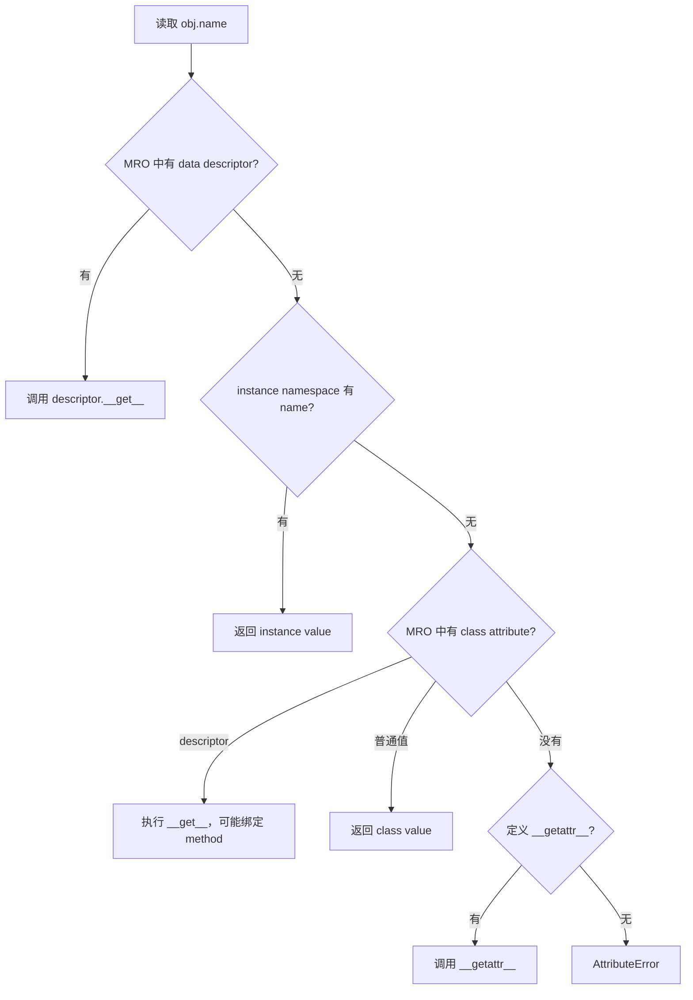

# Python 类、实例、属性查找、数据类、协议与面向对象建模

> 官方语义基线：Python 3.14.x。示例兼容 Python 3.11+，仅使用标准库，已在 CPython 3.13.4 实际运行验证。

## 1. 为什么字典加函数终究会遇到边界

小程序用字典表示任务很自然：

```python
task = {"id": "task-1", "title": "Learn Python", "status": "pending"}
```

随着系统增长，问题开始出现：

- 任意代码都能写入不存在的状态；
- `id`、`title` 只是约定，拼写错误到运行路径深处才暴露；
- “完成任务”涉及状态、完成时间、持久化和通知，却散落在多个函数；
- 测试若依赖真实数据库和消息服务会变慢；
- 不同任务形状的字典之间缺少清晰边界。

类的价值不是把函数缩进到一个名字下面，而是创建一种新的对象类型，让相关状态、行为和不变量拥有明确边界。数据类减少值对象样板代码；协议描述协作者必须提供的行为；组合则把对象连接成可替换的系统。

类也不是默认答案。无状态转换、只有少量字段的临时数据，函数、tuple、`TypedDict` 或普通 mapping 可能更直接。本课目标是理解机制后做建模选择，而不是把所有名词变成类。

第一次学习先掌握 `class`、实例、`self`、`__init__`、实例属性与组合。descriptor、MRO 和 `__new__` 用来解释 Python 对象机制的边界，不需要在开始 FastAPI 前熟练运用。

## 2. 本课目标

完成本课后，应能解释：

- `class` 语句执行时如何创建 namespace 和 class object；
- class、instance 与 type 的关系；
- `__new__` 和 `__init__` 分别负责创建与初始化；
- instance attribute、class attribute 为什么会产生不同共享语义；
- `obj.method` 为什么是已经绑定 `self` 的 method object；
- descriptor 如何驱动方法、property 与属性查找；
- `__dict__`、`__slots__`、`getattr` 与 `__getattr__` 的边界；
- 继承的 MRO 与 `super()` 为什么是协作式调用；
- composition、inheritance、duck typing、ABC 与 Protocol 的区别；
- `dataclass` 自动生成什么，又绝不自动保证什么；
- 如何建模值对象、实体、领域服务和基础设施适配器。

## 3. Python 中 class 本身也是对象

执行：

```python
class Task:
    kind = "learning"

    def complete(self) -> None:
        ...
```

不是向编译器提交一份静态类声明后就结束。概念过程是：

1. 求值基类和 class header 中的关键字；
2. 选择 metaclass，并准备 class namespace；
3. 在这个新 namespace 中执行 class body；
4. `kind` 绑定字符串，`def` 创建 function object 并绑定 `complete`；
5. metaclass 使用名称、基类和 namespace 创建 class object；
6. 外层作用域把名称 `Task` 绑定到这个 class object。


因此 class body 中可以调用函数、写条件，甚至失败并抛出异常。工程上仍应保持 class body 可预测，避免网络请求或重 I/O 等导入副作用。

## 4. class、instance、type 三个概念

- **class object**：如 `Task`，描述实例的行为并可被调用来创建实例；
- **instance object**：如 `task = Task(...)`，保存某个具体任务的状态；
- **type / class of an object**：通过 `type(task)` 或 `task.__class__` 观察。

普通用户类默认继承 `object`。默认情况下，创建 `Task` 的 metaclass 是 `type`，所以：

```python
isinstance(task, Task)       # True
isinstance(Task, type)       # True
issubclass(Task, object)     # True
```

“class 是对象”不等于“class 与 instance 是一回事”。两者拥有不同 namespace、职责和生命周期。

## 5. 实例化：先 `__new__`，后 `__init__`

调用 `Task(...)` 时，由 class 的调用协议协调：

1. `__new__(cls, ...)` 创建并返回实例；
2. 若返回的是该 class 的实例，再调用 `__init__(self, ...)`；
3. `__init__` 在已有实例上建立有效初始状态，必须返回 `None`；
4. class call 的结果是那个实例，不是 `__init__` 的返回值。

`__init__` 常被口语称作构造器，但严格说它是 initializer；真正创建对象的是 `__new__`。普通业务类几乎总是只需定义 `__init__`。不可变内建类型的子类、缓存实例或高级框架才常需要重写 `__new__`。

如果初始化可能失败，抛出异常，不要留下一个“半有效对象”再要求调用者额外调用 `init()`。

## 6. `self` 只是明确的第一个参数

```python
class Counter:
    def increment(self, amount: int) -> None:
        self.value += amount
```

`self` 不是关键字，但它是必须遵守的通用命名约定。显式写 `self.value` 能区分实例状态与局部变量。

这两次调用在语义上对应：

```python
counter.increment(2)
Counter.increment(counter, 2)
```

前者在属性访问时生成绑定方法，自动保存 `counter`；后者直接从 class 取 function 并手动传实例。

## 7. 绑定方法不是“复制一份函数”

```python
transition = task.complete
transition(at=now)
```

`transition` 是 method object，保存两项关键引用：

- `transition.__func__`：class 中的原 function；
- `transition.__self__`：读取该属性的 instance。

以后调用它仍使用原 instance。函数 descriptor 的 `__get__` 在属性读取时完成绑定，不会为每个实例复制函数源码。

本课测试显式验证：

```python
self.assertIs(transition.__self__, task)
```

## 8. instance attribute 与 class attribute

```python
class Task:
    category = "learning"       # class attribute

    def __init__(self, title: str) -> None:
        self.title = title       # instance attribute
```

`category` 通常被所有实例共享；`title` 属于具体实例。读取 `task.category` 时即使 instance 没有该名称，也能从 class 找到。

给 instance 赋值：

```python
task.category = "work"
```

通常是在 instance namespace 创建同名属性，遮蔽 class attribute，并没有修改 `Task.category`。

## 9. 可变 class attribute 的经典陷阱

```python
class BrokenTask:
    tags: list[str] = []
```

这个 list 在 class body 执行时创建一次，所有未遮蔽它的实例读取到同一个 list。一个实例 append，其他实例也看到变化。

普通类应在 `__init__` 中为每个实例创建容器；数据类使用 `field(default_factory=list)`。共享 cache 或常量若确实属于 class，可以有意使用 class attribute，但要写清并发与生命周期。

## 10. 属性查找不是简单的两个字典

对普通新式对象读取 `obj.name`，核心由 `object.__getattribute__` 协调。简化优先级是：

1. 按 class MRO 查找 **data descriptor**；
2. 查 instance dictionary（若存在）；
3. 按 MRO 查 non-data descriptor 或普通 class attribute；
4. 若仍未找到，再让 `__getattr__` 处理；
5. 否则抛出 `AttributeError`。



真实实现还涉及 metaclass、特殊方法查找和定制钩子。这张图用于普通 instance 属性读取，不能机械套到 class attribute 或隐式运算符查找。

## 11. descriptor 是属性行为的底层协议

在 class namespace 中，定义 `__get__`、`__set__` 或 `__delete__` 的对象参与 descriptor protocol：

- data descriptor：定义 `__set__` 或 `__delete__`，优先于 instance dictionary；
- non-data descriptor：通常只定义 `__get__`，可被 instance attribute 遮蔽。

Python function 是 non-data descriptor，所以 `task.complete` 会变成绑定方法。`property` 是 data descriptor，可控制读取和写入。许多 ORM 字段、校验字段和缓存属性也建立在这套协议上。

descriptor 是“放在 class 上、管理 instance 属性行为的对象”，不要与 decorator 混淆：decorator 在定义阶段接收并替换对象，descriptor 在属性访问阶段参与协议。一个对象可以同时由 decorator 创建并实现 descriptor，例如 `@property`。

## 12. property：行为接口伪装成属性语法

本课模型：

```python
@property
def is_completed(self) -> bool:
    return self.status is TaskStatus.COMPLETED
```

调用者写 `task.is_completed`，但值在读取时计算。property 适合：

- 派生值；
- 需要保持属性式公共 API；
- 轻量、无惊讶副作用的读取。

网络请求、数据库写入或昂贵计算更适合显式方法。不要因为 property 能拦截赋值，就把复杂业务工作藏进 `obj.value = x`。

## 13. `__getattribute__` 与 `__getattr__`

`__getattribute__` 对每次实例属性读取都会运行，重写时极易递归：

```python
def __getattribute__(self, name: str):
    return object.__getattribute__(self, name)
```

`__getattr__` 只在普通查找失败后运行，适合受控的动态 fallback。二者都不应把拼写错误默默转换成 `None`，否则 `AttributeError` 消失，`hasattr`、调试器和框架行为都会失真。

日常业务类优先使用 property 或明确方法，只有代理、ORM 等基础设施才经常需要全面定制属性访问。

## 14. `__dict__` 与动态属性

普通 instance 常用 `__dict__` 保存属性：

```python
task.__dict__
```

但语言不保证每个对象都有它。内建类型、使用 slots 的 class、扩展类型可能采用其他布局。`vars(obj)` 通常返回对象的 `__dict__`，没有时会失败。

不要把直接修改 `__dict__` 当普通业务 API，它绕开 property setter、descriptor 和不变量维护。

## 15. `__slots__` 的边界

class 可声明预期 instance attributes：

```python
class Point:
    __slots__ = ("x", "y")
```

在合适继承结构下，它可以避免为每个实例创建普通 `__dict__`，减少内存并阻止随意新增未声明属性。但：

- slots 不是私有或安全机制；
- 它不自动让对象不可变；
- inheritance、weak reference、序列化和框架集成需要额外考虑；
- 性能收益要用真实规模测量。

本课数据类使用 `slots=True` 明确字段布局，主要用于展示语义，不声称微型示例因此出现有意义的性能提升。

## 16. 三类方法的接收者不同

### 16.1 Instance method

```python
def complete(self, *, at: datetime) -> Task:
    ...
```

需要具体 instance 状态，是默认选择。

### 16.2 Class method

```python
@classmethod
def parse(cls, raw: str) -> TaskId:
    return cls(raw)
```

接收实际调用的 class，适合替代构造入口和尊重 subclass 的工厂。

### 16.3 Static method

```python
@staticmethod
def normalize(raw: str) -> str:
    return raw.strip()
```

不自动接收 instance 或 class，只是放在 class namespace 的函数。若函数是领域通用操作而不需要 class 组织边界，module-level function 通常更简单。

## 17. 特殊方法让对象参与语言协议

`__str__`、`__repr__`、`__eq__`、`__hash__`、`__iter__`、`__enter__` 等被称为 special methods。语言语法会触发它们：

- `str(value)` → `__str__`；
- `a == b` → equality protocol；
- `for item in value` → iteration protocol；
- `with value` → context-manager protocol。

特殊方法通常通过 type 查找，而不是完全走 `instance.__dict__` 的普通路径。因此给单个 instance 动态塞入 `__len__`，通常不会让 `len(instance)` 使用它。

不要随意发明 `__something__` 名称；双下划线命名空间保留给语言演进和明确协议。

## 18. `repr`、`str` 与日志边界

- `__repr__` 面向开发者，目标是明确、无歧义，可能尽量可重建；
- `__str__` 面向用户可读展示；
- 未定义 `__str__` 时通常退回 `__repr__`。

数据类会生成字段式 repr，调试方便，但其中可能包含密码、token 或个人数据。生产领域模型应对敏感字段使用 `field(repr=False)` 或自定义安全表示；repr 不是自动安全日志。

## 19. 相等性、身份与 hash

- `is` 比较是否同一个对象身份；
- `==` 调用相等性协议，比较的语义由类型定义；
- hashable 对象可以作为 dict key / set member，并要求相等对象具有相同 hash。

可变对象若参与 hash，字段改变后会落入错误的 hash bucket，因此通常不可 hash。冻结值对象更适合做 key，但其所有参与字段也必须可 hash。

本课 `TaskId` 是 frozen dataclass，按值相等并可作为 repository 字典 key；`Task` 虽也 frozen，但其语义仍包含实体身份和状态，工程上不应仅因自动 hash 可用就随意当集合 key。

## 20. 数据类解决的是样板，不是建模

```python
@dataclass
class Point:
    x: int
    y: int
```

`@dataclass` 根据带注解字段生成 `__init__`、`__repr__`、`__eq__` 等方法。是否生成和具体选项由 decorator 参数控制。

它不会：

- 自动在运行时检查 `x` 真的是 int；
- 自动验证业务不变量；
- 自动深拷贝字段；
- 自动把嵌套 dict 转成目标对象；
- 自动提供数据库持久化；
- 判断这个对象应是 entity 还是 value object。

类型注解首先给静态工具和读者使用，运行时验证必须明确实现或由专门框架承担。

## 21. 字段发现与生成方法

数据类主要把 class namespace 中有类型注解的名称识别为 fields，`ClassVar` 和 `InitVar` 有特殊语义。默认生成行为包括：

- `init=True`：生成 initializer；
- `repr=True`：生成 representation；
- `eq=True`：按字段顺序比较，并要求对象类型相同；
- `order=False`：默认不生成大小排序；
- `unsafe_hash=False`：根据 eq/frozen 等条件决定 hash；
- `frozen=False`、`slots=False`、`kw_only=False`。

不要凭感觉组合 `eq`、`order`、`frozen` 与 `unsafe_hash`。尤其 `unsafe_hash=True` 名字已经提醒：只有理解可变性和 hash 合同后才使用。

## 22. 默认值与 `default_factory`

错误想法：

```python
@dataclass
class Task:
    tags: list[str] = []
```

所有实例会共享同一默认 list。数据类会拒绝一部分不可 hash 默认值来防止常见错误，但这不是完美的“可变性检测”。正确写法：

```python
from dataclasses import field

tags: list[str] = field(default_factory=list)
```

factory 在每次实例创建时调用。不可变 tuple 默认值 `()` 本身可安全共享，本课因此使用 `tuple[str, ...] = ()`。

## 23. `__post_init__` 建立不变量

生成的 `__init__` 在字段赋值后调用 `self.__post_init__()`。它适合：

- 跨字段验证；
- 值规范化；
- 从输入字段计算派生字段；
- 处理 `InitVar` 提供的仅初始化参数。

本课要求：标题非空、优先级 1–5、pending 不能带完成时间、completed 必须带完成时间。这些约束使任何成功创建的 `Task` 都处于可解释状态。

若对象允许先非法、后调用 `validate()`，每个使用点都必须猜它是否验证过，这会扩散状态空间。

## 24. frozen 是受控不可变模拟

`@dataclass(frozen=True)` 生成阻止普通字段赋值/删除的方法：

```python
task.title = "new"  # FrozenInstanceError
```

但 Python 没有真正不可突破的对象私有边界。初始化内部可用 `object.__setattr__`，反射或可变嵌套对象也可能改变可观察状态：

```python
@dataclass(frozen=True)
class Box:
    items: list[str]

box.items.append("changed")  # frozen 没有冻结 list 内部
```

所以 frozen 不是安全沙箱。要获得稳定值语义，应同时使用不可变字段类型，并避免泄漏内部可变引用。

## 25. 完整领域模型

<<< ../../../examples/python/python-classes-dataclasses-protocols/task_domain/models.py{python:line-numbers} [models.py]

设计因果链：

1. `TaskId` 去除首尾空白并拒绝空标识；
2. frozen + order 让它按值相等、可 hash、可排序；
3. `Task` 在 `__post_init__` 一次建立所有跨字段不变量；
4. `complete()` 不修改旧 instance，而用 `dataclasses.replace` 生成新值；
5. 新值仍经过生成的 initializer 和 `__post_init__`，不会绕过验证；
6. 重复完成直接返回当前 instance，让状态转换本身幂等。

`object.__setattr__` 只用于初始化期间的规范化，不应成为业务代码随意修改 frozen 对象的后门。

## 26. Entity 与 Value Object

这不是 Python 语法分类，而是领域建模概念：

- **Value Object** 由值定义相等性，通常不可变；例如 `TaskId("a")` 与另一个同值实例可互换；
- **Entity** 跨时间由 identity 连续识别，即使状态变化仍是“同一个业务对象”；例如 id 相同的 pending 和 completed task 表示同一任务的两个状态版本。

数据类默认按所有字段比较，很适合许多 value object，却未必符合 entity 的业务 equality。大型模型可能为 entity 自定义 equality，仅按身份比较，或明确避免用 `==` 表达领域身份。

本课为了测试状态快照保留数据类字段相等；文档同时明确它不是所有 entity 的普遍规则。

## 27. 不可变状态转换的收益与代价

`pending.complete(at=now)` 返回新对象：

- 旧值可安全用于比较、审计和失败恢复；
- 不会存在某方法执行到一半留下部分 mutation；
- 测试可以直接对照 before / after；
- 并发推理更简单一些。

代价是创建新对象、更新引用，并需要 repository 正确保存新版本。不可变对象也不自动解决两个请求同时读取旧版本后覆盖的问题；持久层仍需 optimistic locking/version 或事务隔离。

## 28. Inheritance 表达“is-a”替换关系

```python
class EmailNotifier(BaseNotifier):
    ...
```

继承意味着 subclass 应能在 base class 被需要的位置保持合同。仅仅“想复用几行代码”不是足够理由。错误继承会把内部实现绑死，并让 base class 修改波及所有 subclass。

Python 方法默认可被覆盖。base method 内调用 `self.step()` 时，可能动态调用 subclass 覆盖的版本；这是多态，也是脆弱基类问题的来源。

## 29. MRO：多继承不是简单找最近父类

class 的 `__mro__` 保存 method resolution order：

```python
MyClass.__mro__
```

Python 使用 C3 linearization，为多继承建立一致、单调且尊重局部父类顺序的线性查找序列。一个菱形结构中的公共祖先不会被普通 MRO 查找重复访问。

不应把规则简化成“永远深度优先从左到右”。简单结构看起来可能如此，但 cooperative multiple inheritance 必须以实际 MRO 为准。

## 30. `super()` 是 MRO 的下一个，不是“我的父类”

```python
class Child(Base):
    def save(self) -> None:
        prepare()
        super().save()
```

零参数 `super()` 根据当前 class 和 receiver，在 MRO 中从当前 class 之后继续查找。多继承中它不一定指向源码里直觉上的唯一父类。

可协作 mixin 应统一方法签名，并继续调用 `super()`，让链条完整。某一层硬编码 `Base.save(self)` 可能绕过 MRO 中其他协作者。

多继承适合小而正交、明确协作合同的 mixin；领域状态层级通常优先组合。

## 31. Composition 表达“has-a”协作

本课 `TaskService` 拥有 repository、notifier 和 clock：

```text
TaskService
├── TaskRepository
├── TaskNotifier
└── Clock
```

service 不继承数据库，也不继承时钟。它通过 constructor 接收协作者，把业务编排与基础设施实现分开。替换通知渠道或存储时，不必修改 Task 的继承树。

组合不是永远优于继承的口号：稳定的 subtype 关系适合继承，不同生命周期的能力组合适合依赖注入。

## 32. Duck typing：行为可用即可

Python 常用鸭子类型：“如果对象提供所需行为，就使用它”。调用 `notifier.task_completed(task)` 不必先问它是否继承某个名为 Notifier 的 class。

动态 duck typing 的优点是低耦合，缺点是错误可能到相关路径运行时才暴露。类型提示的 `Protocol` 把这种结构合同写给静态检查器，同时保留无需继承的实现自由。

## 33. Protocol 与 nominal inheritance

<<< ../../../examples/python/python-classes-dataclasses-protocols/task_domain/ports.py{python:line-numbers} [ports.py]

`InMemoryTaskRepository` 没有写 `(TaskRepository)`，只要方法结构兼容，静态类型检查器就可以把它视为满足协议。这叫 structural subtyping。

普通 base class / ABC 更偏 nominal subtyping：实现者显式继承或注册，身份关系本身是合同的一部分。

选择边界：

- 内部依赖、第三方对象适配、测试替身：小 Protocol 往往自然；
- 需要共享实现、注册机制或运行时类别身份：base class / ABC 可能更合适；
- 只有一个简单 callable：`Callable[...]` 可能比单方法 Protocol 更小。

## 34. Protocol 主要是静态合同

Python 运行时不会因为参数标注为 `TaskRepository` 就自动验证传入对象。必须运行 mypy、Pyright 等静态检查器才会发现多数签名不兼容。

`@runtime_checkable` 可让 Protocol 支持有限的 `isinstance` / `issubclass` 检查，但它主要检查属性是否存在，不验证完整类型签名，而且可能有性能成本。不要把它误当运行时 schema validator。

本示例不需要运行时检查：service 直接使用依赖，错误会在不满足行为时自然显现；项目 CI 则应增加静态类型检查，这会在后续“类型提示与测试”课程系统展开。

## 35. Interface segregation：协议应由消费者定义

`TaskService` 只需 `get` 和 `save`，所以 `TaskRepository` 不应顺手包含分页、删除、统计、事务管理等所有数据库能力。

小协议的因果收益：

1. service 的真实依赖一眼可见；
2. 测试替身只需实现两种行为；
3. 更换基础设施时适配面更小；
4. 不相关方法变化不会让所有消费者重新实现。

协议通常放在使用它的应用/领域边界，而不是由具体 adapter 定义“别人应该怎样依赖我”。

## 36. Concrete repository adapter

<<< ../../../examples/python/python-classes-dataclasses-protocols/task_domain/repository.py{python:line-numbers} [repository.py]

`_tasks` 的单下划线表示 non-public API 约定，不是访问控制。repository 用 `TaskId` 作 dict key，依赖其稳定 hash。

缺失 key 的 `KeyError` 在 repository 边界翻译为 `TaskNotFoundError`，同时用 `from error` 保留 cause。这衔接上一课的异常建模：对象边界和错误边界共同构成 API。

内存 repository 只适合示例/测试：进程退出会丢数据，不支持并发事务，也不提供跨进程一致性。

## 37. Application service 完整实现

<<< ../../../examples/python/python-classes-dataclasses-protocols/task_domain/service.py{python:line-numbers} [service.py]

执行 `service.complete(id)`：

1. repository 读取当前 Task；
2. clock 提供显式时间，避免领域方法偷偷依赖系统全局时间；
3. Task 决定合法状态转换；
4. 若产生新状态，repository 保存；
5. notifier 接收完成事件；
6. 重复完成时 `completed is current`，不重复保存/通知；
7. 返回最终 Task。

这里使用 object identity 检测“是否生成新版本”，因为 `complete` 明确承诺无变化时返回自身。这是局部 API 合同，不应被泛化成所有领域对象都靠 `is` 检测变更。

真实系统还需考虑保存成功、通知失败的跨资源一致性。数据库事务不能原子覆盖外部消息服务，常见方案是 transactional outbox；后端架构课程再展开。

## 38. Dependency injection 不需要容器框架

```python
service = TaskService(repository, notifier, clock)
```

这已经是 constructor injection。依赖注入的本质是对象不在内部硬编码创建其外部协作者，而由 composition root 负责组装。

框架 DI container 可以管理大量对象生命周期，但不是理解 DI 的前提。初学时显式 constructor 更容易追踪所有权和测试替换。

## 39. 测试替身为何无需继承

测试定义 `FixedClock` 和 `RecordingNotifier`，它们没有继承 ports：

<<< ../../../examples/python/python-classes-dataclasses-protocols/tests/test_task_domain.py{python:line-numbers} [test_task_domain.py]

只要行为形状满足 service 所需，就能参与测试。`FixedClock` 让时间成为确定输入，而不是在断言里容忍“现在附近”；`RecordingNotifier` 把副作用记录为可检查状态。

测试验证的不只是 getter/setter，而是：

- 规范化和不变量；
- value equality；
- frozen 阻止普通 mutation；
- 状态转换返回新对象；
- 绑定方法保存 receiver；
- 协议的结构实现可工作；
- 重复命令不会重复通知；
- repository 翻译异常并保留 cause。

## 40. 封装不是“把字段全改成 private”

Python 没有 Java 风格强制 private instance field：

- `_name`：约定为 non-public，外部不应依赖；
- `__name`：在 class body 进行 name mangling，主要避免 subclass 名称冲突；
- `__name__`：语言定义的特殊名称，不是“更私有”。

`__secret` 通常变为 `_ClassName__secret`，仍能访问，绝不是安全边界。封装的核心是保持不变量、缩小公共 API 和允许内部实现变化，而不是机械给每个字段写 getter/setter。

## 41. Name mangling 的正确边界

双前导下划线适合基类内部不希望与 subclass 偶然冲突的名称。它不适合：

- 储存秘密；
- 阻止反射；
- 让普通业务代码看起来“更面向对象”；
- 替代清晰文档。

多数应用内部字段使用单下划线已足够。公共库若需要兼容承诺，应明确哪些名字稳定。

## 42. 常见贫血模型与上帝对象

**贫血模型**只有字段和 getter/setter，所有状态规则散落 service；**上帝对象**则把持久化、HTTP、邮件、日志和所有业务都塞进一个 class。

本课的折中：

- Task 拥有自身合法性与状态转换；
- repository 拥有存取边界；
- notifier 拥有通知能力；
- service 编排一次 use case；
- composition root 负责实例化具体实现。

拆分标准是变化原因和不变量所有权，不是追求文件或 class 数量。

## 43. JavaScript / Vue 对照

JavaScript class 也有 constructor、instance method、static method、getter 和 inheritance，但底层建立在 prototype chain 上。Python class 查找建立在 type、MRO 与 descriptor protocol 上，不能把 prototype 细节直接套用。

对 Vue 2 经验尤其要区分：

- Vue 2 对 data property 做响应式转换，是框架观察机制；
- Python property/descriptor 控制属性访问，不会自动产生 UI 响应式依赖追踪；
- JS object 常被当开放 record；Python domain object 可通过 dataclass/slots/invariant 缩小合法状态；
- TypeScript structural typing 与 Python Protocol 思路相近，但静态工具、variance 和运行时擦除细节不同。

## 44. Java 对照

- Java class 通常在编译期形成固定结构；Python class body 运行并创建对象；
- Java `this` 隐式可用；Python 方法显式声明 `self`；
- Java private 由语言/JVM 强制；Python 多数 non-public 边界依靠约定；
- Java interface 是 nominal 声明；Python Protocol 支持结构化匹配；
- Java record 与 frozen dataclass 都减少值载体样板，但生成方法、不可变深度和相等性细节不同；
- Java 单 class inheritance + 多 interface；Python 允许多 class inheritance，并用 C3 MRO；
- Java annotation 和 Python type hint 都不自动等于完整运行时验证。

对比的重点是建立边界，不是寻找一一对应语法。

## 45. 运行完整示例

```bash
cd examples/python/python-classes-dataclasses-protocols
python3 -m unittest discover -v
```

无需第三方依赖。预期 7 项测试全部通过。

也可观察对象状态：

```bash
python3 - <<'PY'
from datetime import UTC, datetime
from task_domain.models import Task, TaskId

pending = Task(TaskId("task-1"), "  Learn classes  ", tags=("python",))
completed = pending.complete(at=datetime(2026, 7, 15, tzinfo=UTC))
print(pending)
print(completed)
print(pending is completed)
PY
```

预期最后一行是 `False`，且只有新对象为 completed。这里的 heredoc 仅便于展示；项目代码仍位于 package 文件中。

## 46. 何时不用 class

优先函数或简单数据结构的情形：

- 纯输入到输出，无持续状态；
- 数据只在一个很小局部流动；
- 没有不变量或身份；
- 一个 class 只有 `run()` 且不保存依赖，module function 更直接；
- 为了模仿 Java 而创建大量只有 getter/setter 的 wrapper。

优先 class 的信号：

- 多个行为共享并维护同一状态；
- 创建时必须建立不变量；
- 对象有明确生命周期或 identity；
- 多个实现需要共同的行为边界；
- 希望通过组合替换协作者。

## 47. 工程检查清单

- class 代表清晰概念，而非仅作 namespace；
- initializer 成功后对象立即有效；
- 区分 instance state 与有意共享的 class state；
- 可变默认值由每个 instance 单独创建；
- 理解绑定方法自动携带 self；
- 不直接篡改 `__dict__` 绕过不变量；
- property 保持轻量、可预测；
- slots 用于明确布局或经测量的内存需求，不作安全承诺；
- value object 使用稳定值 equality 和不可变字段；
- entity equality 根据业务 identity 明确设计；
- dataclass 注解不等于运行时验证；
- `__post_init__` 验证跨字段不变量；
- frozen 不等于深不可变；
- hash 与 equality 合同一致；
- inheritance 只用于可信的 substitutability；
- 多继承以 MRO 和 cooperative super 为准；
- 不同生命周期能力优先组合；
- Protocol 小而由消费者需求定义；
- Protocol 静态合同需要类型检查器执行；
- runtime_checkable 不验证完整签名；
- constructor injection 优先显式；
- non-public 命名是 API 约定，不是安全边界；
- repr/log 不泄漏敏感字段；
- 测试状态转换、不变量、协作副作用和失败路径。

## 48. 本课结论

- `class` 是可执行语句：建立 namespace、执行 body，再由 metaclass 创建 class object。
- 实例化通常先由 `__new__` 创建对象，再由 `__init__` 建立有效状态。
- function descriptor 把 instance 与 class function 绑定成 method object，因此自动传入 self。
- 普通属性查找涉及 data descriptor、instance namespace、MRO class attribute 和 `__getattr__`，不是简单读一个字典。
- dataclass 自动生成样板方法，不自动类型检查、深冻结或选择领域模型。
- `__post_init__` 可建立不变量；frozen + 不可变字段有助于稳定值语义。
- value object 按值定义，entity 按跨时间 identity 定义，两者不是 dataclass 参数自动决定的。
- inheritance 表达可替换 subtype；composition 表达协作者所有权，二者解决不同问题。
- Protocol 把 duck typing 写成静态结构合同，实现者无需显式继承。
- 应用 service 负责编排，domain object 负责自身规则，adapter 负责外部边界。

下一节：[Python 类型提示、泛型、类型收窄、静态分析与自动化测试](/backend/python/type-hints-generics-narrowing-static-analysis-and-automated-testing)。

## 49. 参考资料

- [Python Tutorial：Classes](https://docs.python.org/3.14/tutorial/classes.html)
- [Python Language Reference：Data Model](https://docs.python.org/3.14/reference/datamodel.html)
- [Python Language Reference：Class Definitions](https://docs.python.org/3.14/reference/compound_stmts.html#class-definitions)
- [Python Standard Library：dataclasses](https://docs.python.org/3.14/library/dataclasses.html)
- [Python Standard Library：typing.Protocol](https://docs.python.org/3.14/library/typing.html#typing.Protocol)
- [Python Standard Library：runtime_checkable](https://docs.python.org/3.14/library/typing.html#typing.runtime_checkable)
- [Python Descriptor Guide](https://docs.python.org/3.14/howto/descriptor.html)
- [Python Data Model：Customizing attribute access](https://docs.python.org/3.14/reference/datamodel.html#customizing-attribute-access)
- [Python Data Model：Special method lookup](https://docs.python.org/3.14/reference/datamodel.html#special-method-lookup)
- [Python Tutorial：Inheritance](https://docs.python.org/3.14/tutorial/classes.html#inheritance)
- [Python MRO HOWTO](https://docs.python.org/3.14/howto/mro.html)
- [PEP 544：Protocols: Structural subtyping](https://peps.python.org/pep-0544/)
- [PEP 557：Data Classes](https://peps.python.org/pep-0557/)
