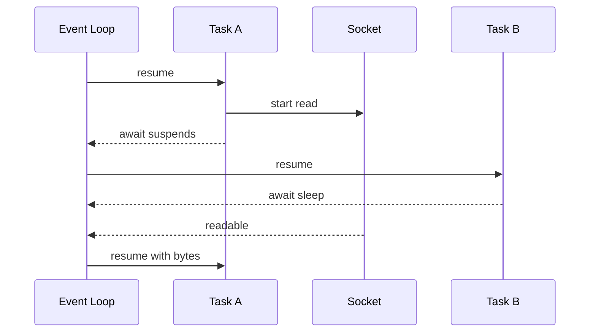

# Python 并发模型：线程、进程、GIL、asyncio 与结构化异步 I/O

> 官方语义基线：Python 3.14.x。示例兼容 Python 3.11+，仅使用标准库，已在 CPython 3.13.4 验证。默认 CPython 与 free-threaded build 的行为必须区分；进程启动方法也具有平台和版本差异。

## 1. 为什么“让任务同时跑”不是一个问题

后端服务经常同时等待数据库、HTTP、文件、消息队列，也可能执行图片处理、加密或模型前后处理。把所有工作串行执行会浪费等待时间；但随意创建线程或 task 又会带来：

- 共享状态竞态；
- 连接数和内存失控；
- 一个任务失败，其他任务成为孤儿；
- timeout 返回了，底层工作仍在运行；
- event loop 被 blocking code 卡死；
- 多进程在开发环境可用，部署平台却无法启动；
- benchmark 测到的是启动开销而非真实吞吐。

选择并发模型前，必须先知道工作在等待什么、状态由谁拥有、怎样取消、失败传到哪里，以及系统容量边界在哪里。

## 2. 本课目标

完成本课后，应能解释：

- concurrency、parallelism、asynchrony 的准确边界；
- OS process、thread、coroutine、Task、Future 的区别；
- 默认 CPython GIL 限制什么、不保证什么；
- free-threaded build 为什么不能被假设为默认环境；
- I/O-bound 与 CPU-bound 如何影响模型选择；
- ThreadPoolExecutor 的提交、完成、异常和取消过程；
- lock、event、condition、semaphore、queue 分别表达什么协调关系；
- ProcessPoolExecutor 的序列化、进程启动和主模块要求；
- event loop 在哪个点切换 task；
- TaskGroup、ExceptionGroup、timeout 和 cancellation 如何协作；
- 如何做 backpressure、资源清理、并发测试与工程容量设计。

## 3. Concurrency、Parallelism、Asynchrony

### 3.1 Concurrency：时间上重叠管理多个进行中任务

任务 A 等待网络时处理任务 B，即使某一瞬间只有一个任务执行，也属于并发。

### 3.2 Parallelism：同一时刻真正执行多个工作

多个 CPU core 同时运行不同进程，或 free-threaded 环境中多个线程同时执行 Python code，是并行。

### 3.3 Asynchrony：调用者不必同步阻塞等待完成

async/await 是组织异步操作的一种模型。异步可以在单线程 event loop 上提供 concurrency，不必 parallel。

```text
concurrency：怎样组织多个进行中的工作
parallelism：怎样同时使用多个执行资源
asynchrony：等待完成时怎样把控制权交还调度者
```

三者有交集，但不是同义词。

## 4. 先判断 workload：I/O-bound 还是 CPU-bound

### I/O-bound

大部分 wall-clock time 用于等待网络、磁盘、数据库或其他进程。线程或 asyncio 能在等待期间推进其他任务。

### CPU-bound

大部分时间执行 Python 运算。默认 CPython 中线程受 GIL 限制，纯 Python CPU workload 通常不能通过多线程使用多个 core；多进程或会释放 GIL 的 native library 更合适。

“这个服务是 I/O-bound”可能过于粗糙。一条请求可以先异步读网络，再 CPU-heavy 解析，再调数据库。应按阶段定位瓶颈，用 profiler/metrics 验证，不根据函数名字猜测。

## 5. 三种执行单位

| 单位 | 内存 | 调度者 | 切换特点 | 常见用途 |
|---|---|---|---|---|
| Process | 默认隔离 | OS | 开销较大，可跨 core | CPU 并行、故障隔离 |
| Thread | 共享进程内存 | OS + runtime | 可在许多点抢占 | blocking I/O、兼容同步库 |
| asyncio Task | 同线程共享对象 | event loop | 在 suspend point 协作切换 | 大量异步 I/O |

asyncio task 不是 OS thread。process 也不是“更重的 thread”：地址空间、序列化和资源继承模型根本不同。

## 6. GIL 的准确边界

默认 CPython build 有 Global Interpreter Lock。简化说，在一个 interpreter 中同一时刻通常只有一个线程执行 Python bytecode。它的作用与 CPython object model / memory management 实现有关。

它意味着：

- 多线程通常不能让纯 Python CPU loop 线性利用多个 core；
- blocking I/O 和部分 C extension 会释放 GIL，其他线程可推进；
- thread concurrency 对 I/O workload 仍有价值。

它不意味着：

- 业务数据天然线程安全；
- 多步读改写不会交错；
- dict/list 的某个当前实现行为可当长期同步合同；
- 不需要 lock；
- 代码在 free-threaded build 中仍会偶然安全。

GIL 是解释器实现约束，不是应用互斥锁。

## 7. Free-threaded Python 的版本边界

Python 3.13+ 提供可禁用 GIL 的 free-threaded CPython build，但官方文档明确：它不是默认构建。是否启用可由运行环境和 build 决定，部分 extension module 导入时还可能重新启用 GIL。

因此不能写“Python 3.13 已经没有 GIL”。正确表述是：

- 普通默认 build 仍有 GIL；
- free-threaded build 可实现 thread parallel execution；
- 第三方 extension 必须确认兼容；
- 正确使用同步原语的代码更容易跨两种构建工作；
- performance 要在目标 build、依赖和 workload 上测量。

free threading 也不消除 data race，反而让过去被 GIL 时序掩盖的问题更容易显现。

## 8. Race condition 是因果链被交错

```python
completed += 1
```

概念上包含：读取旧值、计算新值、写回。两个线程可能都读到 0，再各自写 1，最终丢失一次更新。

不要争论某个 CPython 版本的一条 bytecode 是否“碰巧原子”。业务 invariant 往往跨多个 operation：

```python
if task_id not in tasks:
    tasks[task_id] = task
```

检查与写入之间就有竞争窗口。同步必须覆盖整个 invariant transition。

## 9. Lock 保护临界区

本课计数器：

```python
with self._lock:
    self._completed += 1
```

Lock 同一时刻只允许一个 thread 进入临界区。context manager 保证异常路径释放。

锁粒度权衡：

- 太小：invariant 跨区间，仍有 race；
- 太大：无关工作串行，吞吐下降；
- 持锁执行网络 I/O：其他线程长时间等待；
- 多锁无统一顺序：可能 deadlock。

先明确共享状态所有权，再决定 lock；不要在每行旁边随意加锁。

## 10. RLock、Condition、Event、Semaphore、Queue

### RLock

同一 thread 可重复 acquire，必须对应次数 release。适合同一锁保护的方法嵌套调用，但也可能掩盖设计过度递归。

### Condition

让线程在“某个共享状态条件成立”前等待。检查 predicate 必须在关联 lock 下，并通常用循环/`wait_for`，因为醒来不等于条件必然仍成立。

### Event

共享布尔信号，常用于请求 worker graceful stop；不是传递任务数据的 queue。

### Semaphore

允许最多 N 个持有者，适合限制连接、文件句柄或并发请求。它限制同时进入数量，不保证速率、顺序或公平。

### queue.Queue

thread-safe producer/consumer channel，提供 blocking put/get 和有界容量。bounded queue 能把下游容量压力反馈给 producer。

选择 primitive 要表达协调意图，而非全部用 Lock 模拟。

## 11. Deadlock、Livelock 与 Starvation

- **deadlock**：A 等 B、B 等 A，永不推进；
- **livelock**：双方持续响应彼此，却没有有效进展；
- **starvation**：某任务长期得不到锁或执行资源。

常见预防：

- 多锁采用全局固定获取顺序；
- 临界区短小，不在锁内等网络；
- 等待有 timeout 和诊断；
- 避免 worker 在同一个耗尽的 pool 中等待另一个 future；
- 记录 queue depth、active workers、wait duration。

Timeout 只能让调用者脱离等待，未必修复底层 deadlock 或停止 worker。

## 12. 原始 Thread 生命周期

`Thread.start()` 安排 `run()` 在新 thread 执行；`join()` 阻塞调用者直到线程终止或 timeout。`join(timeout)` 永远返回 None，要再查 `is_alive()` 才知道是否超时。

未捕获异常通过 `threading.excepthook` 处理，不会自动在创建线程的调用栈重新抛出。相比之下，Future 把结果/异常保存起来，调用 `result()` 时能在 owner 边界重抛。

daemon thread 在只剩 daemon 时会被 abruptly stopped，文件、事务等资源可能来不及释放。服务应使用 non-daemon worker + stop signal + join 完成 graceful shutdown。

## 13. 为什么优先 ThreadPoolExecutor

为每个请求创建无界 thread 会增加 stack memory、调度开销和下游压力。pool 提供固定 worker 上限与 Future API：

```python
future = executor.submit(callable, argument)
result = future.result()
```

Future 是未来结果的 handle，可能处于 pending、running、finished 或 cancelled。worker 正常返回则保存 value，抛异常则保存 exception；`result()` 取值或重新抛出。

Future 不是 coroutine，ThreadPoolExecutor 也不是 event loop。

## 14. `submit`、`map` 与 `as_completed`

- `submit`：逐个获得 Future，便于关联 metadata、处理不同 callable；
- executor `map`：按输入顺序产生结果，某个位置异常在迭代到它时抛出；
- `as_completed`：按完成顺序产生 Future，适合尽快处理完成项。

本课用 `as_completed` 尽早接收结果，但保存原 index，最终恢复输入顺序。完成顺序、消费顺序、返回顺序是三个不同合同。

## 15. Thread pool 完整实现

<<< ../../../examples/python/python-concurrency-asyncio/concurrency_lab/blocking.py{python:line-numbers} [blocking.py]

执行过程：

1. 建立最多 `max_workers` 个 thread 的 pool；
2. 每个 Job 通过 submit 入队，得到 Future；
3. worker 执行 blocking sleep，等待期间其他 thread 可运行；
4. Future 完成后由 `as_completed` 交回；
5. `future.result()` 显式传播 worker exception；
6. 成功结果按原 index 保存；
7. 失败时尝试取消其他 Future；
8. context manager shutdown，等待已运行工作收尾；
9. 返回 input-ordered tuple。

这不是 fail-fast 强制停止：已经 running 的 thread callable 无法被 Future.cancel 杀掉。

## 16. Thread cancellation 必须协作

`future.cancel()` 只在工作尚未开始时成功。Python 没有安全通用 API 从外部强杀某个 thread；在任意指令处终止可能让 lock、事务和对象处于破坏状态。

长期 worker 应周期性检查 `threading.Event` 或 deadline：

```python
while not stop_event.is_set():
    process_one_chunk()
```

但 blocking library call 是否可中断取决于它自己的 timeout/cancellation API。因此每个网络操作仍需设置 connect/read timeout，不能只依赖外层 Future timeout。

## 17. Future timeout 不等于工作停止

```python
future.result(timeout=0.1)
```

超时只说明等待方不再等待，worker 可能继续占用 thread、connection 并产生副作用。若随后重试非幂等操作，旧请求与新请求可能同时成功。

完整 timeout budget 应向下游传播，并配合：

- operation-level timeout；
- cooperative cancellation；
- idempotency key；
- bounded retry；
- late result handling。

## 18. Pool 内等待同 Pool Future 的死锁

一个 max_workers=1 的 worker 再 submit 到同 pool 并 `result()`：新工作没有空 worker，当前 worker 又不退出，形成 deadlock。两个 worker 互相等待也一样。

原则：worker 不应同步等待需要同一受限 pool 执行的下游 future。改为组合 owner 层 orchestration、增加独立 executor，或重新设计 dependency graph；简单增加 worker 数只能推迟问题。

## 19. Process 隔离解决了什么

每个 process 有独立 interpreter 和 address space，默认不直接共享普通 Python object。多个进程可在多个 CPU core 同时执行纯 Python CPU code，从而绕开单 interpreter GIL。

代价：

- 创建进程更昂贵；
- 参数与结果通常要 serialize/pickle；
- 大对象复制/传输成本高；
- exception 跨进程重建有边界；
- connection/file descriptor 继承因平台/start method 不同；
- shutdown 和 crash recovery 更复杂。

进程池不是让任意函数“自动更快”。小任务可能完全被启动和 IPC 开销淹没。

## 20. Picklability 与 top-level callable

ProcessPool worker 必须能 import callable 所在 module，并接收可序列化参数。lambda、nested function、打开的 socket/lock、某些 framework object 通常不适合作为 payload。

本课 `count_primes` 定义在 module top level，输入/输出都是 int，边界清楚：

<<< ../../../examples/python/python-concurrency-asyncio/concurrency_lab/cpu.py{python:line-numbers} [cpu.py]

把 database connection 从 parent 直接传入 child 通常是错误所有权。child 应按自己的 process lifecycle 初始化资源，或 parent 只传数据/标识。

## 21. `if __name__ == "__main__"` 为什么重要

spawn/forkserver child 会 import main module。若 module 顶层在 import 时再次创建 pool，就会递归创建子进程。

可执行入口应：

```python
def main() -> int:
    ...

if __name__ == "__main__":
    raise SystemExit(main())
```

library module 顶层也不应在 import 时启动 process/thread。

本课 process pool 从 unittest runner 的受保护入口执行，worker callable 则位于可导入 package module。

## 22. Start method 的平台和版本差异

- spawn：启动全新 interpreter，Windows/macOS 默认；启动较慢但继承更少；
- fork：复制当前 process 状态，仅 POSIX；fork multithreaded process 存在安全问题；
- forkserver：由单线程 server fork child，部分 POSIX 支持。

Python 3.14 中 fork 不再是任何平台默认；支持 forkserver 的 POSIX 默认改为 forkserver。macOS 自 Python 3.8 起默认 spawn。

不要依赖“我在 Linux 上默认就是 fork”。library 若强制 context 会与应用冲突，最好允许调用者注入 multiprocessing context，并记录支持范围。

## 23. Process pool 的错误与 shutdown

child function exception 会通过 Future 在 parent `result()`/map iteration 时报告。worker abrupt exit 可能导致 `BrokenProcessPool`。调用者必须把这些视为基础设施失败，而不是空结果。

process terminate/kill 比 thread cancellation 强，但可能破坏 queue、lock、临时文件和事务。优先 graceful protocol，硬终止作为超时后的最后手段，并让工作幂等/可恢复。

## 24. Shared memory 不会让 process 变 thread

multiprocessing 提供 Queue、Pipe、Value、Array、Manager、shared_memory 等 IPC。共享内存减少复制，却重新引入同步、生命周期和资源泄漏问题。

优先消息传递和不可变小 payload。只有 profile 证明 serialization 是瓶颈时，才引入 shared memory，并明确：

- owner 谁创建/关闭/unlink；
- data layout；
- lock/atomic protocol；
- crash 后清理；
- version compatibility。

## 25. Coroutine function、coroutine object、Task

```python
async def fetch() -> str:
    ...
```

- `fetch`：coroutine function；
- `fetch()`：coroutine object，仅创建后不会自动运行；
- `asyncio.create_task(fetch())`：将 coroutine 安排进当前 event loop 的 Task；
- `await fetch()`：当前 coroutine 等待它完成。

忘记 await/create_task 通常产生“coroutine was never awaited”警告，实际工作没有按期执行。

Task 是 asyncio Future-like object，但 concurrent.futures.Future 属于 thread/process executor API；两者不能无条件互换。

## 26. Event loop 的因果模型

单线程 event loop 概念上反复：

1. 取 ready callback/task；
2. 执行到完成或遇到真正 suspend 的 await；
3. 注册 I/O/deadline completion；
4. 执行下一个 ready task；
5. I/O ready 后把对应 task 放回 ready queue。



asyncio concurrency 是 cooperative：一个 task 不交还控制权，其他 task 就不能运行。

## 27. `async def` 不会自动把 blocking code 变异步

```python
async def broken() -> None:
    time.sleep(5)
```

`time.sleep` 阻塞 event-loop thread，所有 task 停顿。CPU-heavy loop 同样阻塞。应使用 async-aware library：

```python
await asyncio.sleep(5)
```

无法替换的短期 blocking I/O 可桥接：

```python
result = await asyncio.to_thread(blocking_call, argument)
```

to_thread 使用 thread，不会让默认 CPython 的纯 Python CPU 工作自动 parallel；适合 blocking I/O。并发数仍需限制，不能每个请求无限派发。

## 28. `await` 是可能切换点，不是一定切换

await 会把控制交给 awaitable。如果 awaitable 已完成，执行可能立即继续。数据 race 分析不能简单说“每个 await 都必然切换”，但应把跨 await 的共享 mutable invariant 视为可能被其他 task 修改。

```python
current = cache[key]
await refresh()
cache[key] = current + 1
```

await 前读到的状态可能过期。单线程不等于无 race；它避免 simultaneous bytecode execution，却仍有 logical interleaving。

## 29. `asyncio.run` 拥有顶层 loop 生命周期

同步入口通常：

```python
asyncio.run(main())
```

它创建 event loop、运行 coroutine、完成 async generator shutdown 并关闭 loop。不能在同一 thread 已运行 event loop 内再次调用；Notebook、ASGI server 等环境已经拥有 loop，应 await 或交由 framework 管理。

library 不应随意内部调用 asyncio.run，它会抢夺 loop ownership，使调用者无法组合。

## 30. 并发创建：裸 coroutine、gather、TaskGroup

```python
first = fetch("a")
second = fetch("b")
await first
await second
```

仅创建 coroutine object 不保证并发；第一个 await 完成后才开始第二个。

`asyncio.gather` 会并发安排 awaitables 并按输入顺序返回结果，但默认一个异常传播给等待者时，不会自动取消其他已提交 awaitable。

`TaskGroup` 提供结构化 ownership：进入 scope 创建 child tasks，退出前等待所有 child；某 child 首次以非 CancelledError 失败，取消其余 child，最终将非取消异常组合成 ExceptionGroup。

## 31. Structured concurrency 解决 orphan task

若随处 `create_task` 后丢掉 reference：

- 谁等待结果不清楚；
- parent 返回后 child 可能继续副作用；
- exception 可能只成为 loop warning；
- shutdown 不知道要取消谁。

TaskGroup 让 child lifetime 嵌套在 lexical scope：scope 不结束，child ownership 不结束。类似 resource context manager，但管理的是并发任务集合。

真正的 background service task 也应由应用 lifespan/supervisor 持有，而不是 fire-and-forget。

## 32. TaskGroup 失败传播

本课两个 task：failure 很快抛 JobError，sibling 正在 sleep。

1. TaskGroup 观察 failure；
2. 请求取消 sibling；
3. sibling 的 await 抛 CancelledError；
4. sibling finally 清理 active state；
5. group 等待 sibling 完成清理；
6. 非取消 JobError 放入 ExceptionGroup；
7. group scope 向调用者抛出。

这就是结构化失败：不是第一个异常一出现就遗留尚未清理的 sibling。

## 33. CancelledError 是控制流

`asyncio.CancelledError` 直接继承 BaseException，而不是 Exception。coroutine 通常用 `try/finally` 清理；若捕获 CancelledError，清理后应重新抛出：

```python
try:
    await operation()
except asyncio.CancelledError:
    rollback()
    raise
```

吞掉 cancellation 会破坏 TaskGroup/timeout 等组件，它们依赖 cancellation 实现结构化控制流。只有非常明确的 API 才应抑制，并需理解 task cancellation state / `uncancel()` 的影响。

## 34. Cancellation 是请求，不是瞬间终止

`task.cancel()` 安排 CancelledError 在下一个可取消 suspend point 注入。若 coroutine 长时间不 await、屏蔽取消或在 blocking C call 内，它不能及时响应。

清理也可能 await；需要根据协议选择 finally 中的 async cleanup、timeout 或 shield。`asyncio.shield` 只保护 inner awaitable 不因调用者取消而被取消，调用者自身仍收到 cancellation；滥用会制造脱离 owner 的工作。

## 35. Timeout 的真实机制

```python
async with asyncio.timeout(1.0):
    await operation()
```

deadline 到达后 context manager 取消当前 task，内部处理产生的 CancelledError，并在 context 外转换成 built-in TimeoutError。因此 TimeoutError 应在 `async with` 外捕获。

本课 timeout 包住整个 TaskGroup：parent 被取消，group 取消 child 并等待 finally，随后调用者看到 TimeoutError。

timeout 仍是 cooperative。若 child 阻塞 event loop，deadline callback 也无法按时运行。

## 36. Semaphore 做 bounded concurrency

同时给十万个 URL create task 可能耗尽 memory、socket、DNS 或下游 quota。`asyncio.Semaphore(N)` 允许最多 N 个 task 进入区域：

```python
async with semaphore:
    await fetch()
```

它控制 in-flight concurrency，不等于 requests-per-second rate limit。若 operation 很快，仍可能每秒执行很多次；真正 rate limiting 需要 token bucket/window 等时间模型。

semaphore 数值应来自容量：connection pool、下游限制、memory 和 latency，而不是越大越好。

## 37. Async pipeline 完整实现

<<< ../../../examples/python/python-concurrency-asyncio/concurrency_lab/async_pipeline.py{python:line-numbers} [async_pipeline.py]

关键所有权：

- run_async 拥有 semaphore、TaskGroup 和 child task references；
- TaskGroup 拥有 child lifetime；
- timeout 拥有整个 batch deadline；
- `_fetch_async` 拥有 enter/exit 配对；
- finally 无论成功、JobError 或 CancelledError 都 exit；
- task list 按输入创建，scope 成功后按该顺序读取 result。

Probe 仅用于测试观察，不是生产 metrics 实现。它在单 event-loop thread 中且每次修改间没有 await；若跨 thread 使用就需同步。

## 38. Async synchronization primitives

asyncio.Lock/Event/Condition/Semaphore 面向 event-loop task，不是 thread-safe。等待它们会 suspend task，而非 blocking OS thread。

若 async task 与 worker thread 共享对象，asyncio.Lock 不能保护 thread 侧访问。应通过 loop-safe message passing、`call_soon_threadsafe`，或在线程边界使用 threading primitive，并避免在 event loop blocking acquire。

选择同步原语必须与执行域一致。

## 39. Async Queue 与 backpressure

producer/consumer pipeline 使用 `asyncio.Queue(maxsize=N)`。queue 满时 `await put()` 暂停 producer，这才形成 backpressure。

常见 shutdown 协议：

- 明确数量的 sentinel；
- TaskGroup cancel + finally；
- queue join/task_done（必须每个 get 正确配对）；
- framework lifespan stop signal。

无限 queue 只是把下游过载变成 memory growth，不能解决吞吐不足。

## 40. ContextVar 与 thread-local

request id、trace context 等上下文不宜放 global mutable variable。threading.local 按 thread 隔离，但一个 async thread 内有很多 tasks，会互相覆盖。

`contextvars.ContextVar` 能随 async task context 传播；`asyncio.to_thread` 会传播当前 context 到 worker thread（以官方具体 API 合同为准）。它适合 context metadata，不应存放可随意修改的大型 request object 来隐藏依赖。

## 41. ExceptionGroup 与 `except*`

多个 sibling 可能在取消生效前同时失败，TaskGroup 会保留多个异常：

```python
try:
    async with asyncio.TaskGroup() as group:
        ...
except* TimeoutError as group:
    handle_timeout_group(group)
```

`except*` 按类型拆出匹配 subgroup，未匹配部分继续传播。不要只读取 `group.exceptions[0]` 丢弃其他失败；日志和错误映射需要遍历/递归理解结构。

KeyboardInterrupt/SystemExit 在 TaskGroup 有特殊重新抛出语义，不作为普通 ExceptionGroup leaf 处理。

## 42. 结果顺序与完成顺序

本课三种实现都返回 input order，但内部完成顺序不同：

- thread：as_completed 完成序，按 index 重排；
- process executor.map：结果 iterator 保持输入序；
- asyncio：Task 列表按输入创建，group 成功后按列表读 result。

input order 会让慢的早期任务延迟消费后续已完成结果。如果业务可流式处理，完成顺序可能降低 latency；若 API 要稳定顺序，则需明确重排和 memory 成本。

## 43. 失败策略必须是 API 合同

批量任务可选择：

- fail-fast：首错取消其余；
- collect-all：所有任务结束后返回 successes/errors；
- best-effort：记录个别失败继续；
- quorum：满足一定成功数量即可；
- transactional：全部成功才提交状态。

TaskGroup 默认更接近 structured fail-fast，但 cancellation 是协作式。`gather(return_exceptions=True)` 更接近 collect-all，却把 exception 放进结果集合，调用者必须逐项处理。

不要让底层 library 偶然默认决定业务策略。

## 44. Retry 与 concurrency 的放大效应

100 个并发请求各自重试 3 次，故障时可瞬间变成 300 个下游操作。正确策略包括：

- global concurrency limit；
- exponential backoff + jitter；
- per-attempt timeout 与 overall deadline；
- retry budget；
- only transient classification；
- idempotency；
- circuit breaker/load shedding。

取消后不应无条件重试；它通常表示 caller deadline 或 shutdown 正在推进。

## 45. 测试并发代码的原则

不要主要依赖 `sleep(0.1)` 猜调度顺序。测试应观察 protocol：

- bounded maximum active；
- owner 返回前 active 回到 0；
- sibling 收到 cancellation；
- finally 完成清理；
- exception 在调用边界可见；
- result order 符合合同；
- process callable 能实际 serialize/execute。

短 sleep 在本课只是模拟 I/O duration，不用于断言精确毫秒 timing。

## 46. Async 测试隔离

`unittest.IsolatedAsyncioTestCase` 为测试提供隔离的 event-loop lifecycle，并允许 `async def test_...`。每个测试结束应没有遗留 task。

测试 timeout/cancel 时：

- deadline 留出 CI scheduling margin；
- 被测 operation 明显长于 timeout；
- 断言 cleanup state，而不只断言 TimeoutError；
- debug 模式可帮助发现 slow callback/unawaited coroutine；
- teardown 检查 background ownership。

## 47. 完整测试代码

<<< ../../../examples/python/python-concurrency-asyncio/tests/test_concurrency.py{python:line-numbers} [test_concurrency.py]

八项测试验证：

- thread 完成乱序但结果输入有序；
- lock 保护 compound count；
- Future.result 重抛 worker exception；
- prime function 基线；
- process pool 实际执行并保持输入序；
- semaphore 最大 active 为 2；
- timeout 取消 task 且 finally 清理；
- TaskGroup 失败取消 sibling 并抛 ExceptionGroup。

Process test 在受限 sandbox 首次因 `os.sysconf("SC_SEM_NSEMS_MAX")` PermissionError 无法创建 pool；在获准的本地非沙箱执行中通过。这属于测试环境权限差异，不能改写成代码失败，也不能把该测试跳过后声称多进程已验证。

## 48. 运行完整示例

项目运行与版本配置：

<<< ../../../examples/python/python-concurrency-asyncio/pyproject.toml{toml:line-numbers} [pyproject.toml]

Package public exports：

<<< ../../../examples/python/python-concurrency-asyncio/concurrency_lab/__init__.py{python:line-numbers} [__init__.py]

输入/结果模型：

<<< ../../../examples/python/python-concurrency-asyncio/concurrency_lab/models.py{python:line-numbers} [models.py]

在项目目录：

```bash
cd examples/python/python-concurrency-asyncio
python3 -m unittest discover -v
python3 -m compileall -q concurrency_lab tests
```

若执行环境禁止创建 semaphore/process，process test 会失败；应在 CI runner/容器权限中解决，而不是把生产需要的 multiprocessing 验证静默删除。

## 49. 如何选择模型

### 同步即可

请求量低、执行简单、没有并行等待，优先最简单同步代码。

### Thread pool

已有 blocking library，主要等待 I/O，任务数量可界定；配置 worker/queue/timeout。

### Process pool

纯 Python CPU-heavy，可序列化 chunk 足够大，目标平台允许 process；测量 IPC 与 startup。

### Asyncio

大量并发 I/O，整个依赖链有 async API，团队能维护 cancellation/lifespan/backpressure。

### 混合

ASGI event loop + async database/HTTP + bounded to_thread legacy call + process/外部 worker CPU job 很常见。混合模型必须明确每次 crossing 的 context、serialization、timeout 与 ownership。

## 50. Capacity 设计而不是只调 worker 数

用 Little's Law 的直觉：并发中的平均数量约等于吞吐率乘平均停留时间。目标 100 requests/s、下游平均 0.2s，光等待就约有 20 个 in-flight；tail latency、重试和 burst 需要额外预算。

但 worker=100 不代表能承受 100：还受 database pool、socket、memory、CPU、downstream quota 限制。最小瓶颈决定系统容量。

监控至少包括：

- active/queued tasks；
- queue wait 和 service time；
- timeout/cancel/retry counts；
- pool saturation；
- event-loop lag；
- CPU/memory/file descriptors；
- downstream latency/error rate。

## 51. Observability 与 task/thread naming

ThreadPool 可设置 `thread_name_prefix`，asyncio TaskGroup `create_task(..., name=...)` 可命名 task。名称用于日志/调试，不是唯一持久 identity。

日志需要 request/task correlation id，并避免多个 concurrent context 写入共享可变字段。异常日志应在 owner boundary 记录一次；child 捕获后若无法恢复，附加 context 并传播。

## 52. Graceful shutdown

服务收到停止信号后应：

1. 停止接收新任务；
2. 设置 stop/deadline；
3. 等待 in-flight 在 grace period 内完成；
4. 取消 async children / 通知 threads；
5. 关闭 queue、executor、connection pool；
6. 超时后按策略强制终止；
7. 确保幂等恢复未完成工作。

只依赖 process exit 或 daemon thread 会丢失清理。executor、TaskGroup 和 async context manager 都应由应用 lifespan owner 管理。

## 53. JavaScript / Node.js 对照

- 浏览器/Node 常见 JS event loop 与 Python asyncio 都是 cooperative async I/O，但 task/microtask phase、API 和 cancellation 不同；
- JS Promise 创建后通常 executor 立即开始，Python 调用 async function 只创建 coroutine object；
- `Promise.all` 与 `asyncio.gather`/TaskGroup 的 sibling cancellation/error grouping 语义不同；
- AbortController 是显式取消信号，Python task cancellation 通过注入 CancelledError；
- Node worker_threads/cluster 与 Python thread/process 的 memory/GIL 模型不同；
- `await` 前后共享状态都可能被其他任务改变，两端都存在 logical race。

不要因为有 Vue/JS async-await 经验，就假设 Python create_task、TaskGroup 或 cancellation 与 Promise 完全一致。

## 54. Java 对照

- Java thread 可在多 core 并行执行 JVM code；默认 CPython thread 受 GIL，除非 free-threaded/native release；
- Java ExecutorService/Future 与 concurrent.futures 概念相近，但取消、中断和 memory model 不同；
- Java synchronized/Lock 与 Python threading.Lock 都保护临界区，GIL 不等价于 synchronized；
- Java virtual threads 适合大量 blocking-style I/O，Python asyncio 用 coroutine/event loop，成本和调度协议不同；
- Java structured concurrency API 的版本状态需查目标 JDK；Python TaskGroup 自 3.11 提供明确 scope；
- JVM process 外并行与 Python multiprocessing 都有 IPC/serialization 边界。

## 55. 常见反模式

### 55.1 为 CPU loop 增加 thread 数

默认 CPython 下可能更慢。profile 后选择 process/native vectorization/free-threaded target。

### 55.2 async function 内调用 blocking SDK

event loop 卡死。使用 async client 或 bounded `to_thread` adapter。

### 55.3 无界 create_task/submit

把等待压力转成 memory、socket 和 downstream overload。使用 bounded queue/semaphore。

### 55.4 吞掉 CancelledError

破坏 timeout/TaskGroup shutdown。清理后重新抛出。

### 55.5 timeout 后认为 operation 已停止

thread/process/remote service 可能继续。设计 cooperative deadline 与 idempotency。

### 55.6 多进程传巨大 mutable object

serialization 成本和 ownership 不清。传小而明确 payload，child 自建资源。

### 55.7 依赖默认 start method

平台/Python 升级后行为改变。若确实依赖，文档化并由应用选择 context。

### 55.8 只用 sleep 验证竞态

容易 flaky 且不证明协议。加入 barrier/event/probe 和状态断言。

## 56. 工程检查清单

- 区分 concurrency、parallelism 与 async；
- 先 profile I/O/CPU 阶段；
- 默认 CPython GIL 与 free-threaded build 明确区分；
- 不把 GIL 当业务锁；
- 共享 invariant 用正确临界区保护；
- lock 顺序固定，锁内不做慢 I/O；
- thread pool/queue/connections 全部 bounded；
- Future.result 显式传播 worker exception；
- 理解 cancel 对 pending/running work 的差异；
- process callable 可 import、payload 可 serialize；
- 可执行入口保护 multiprocessing 启动；
- 不依赖跨平台默认 start method；
- async stack 避免 blocking calls；
- library 不抢占 asyncio.run ownership；
- child task 有明确 owner，优先 TaskGroup；
- CancelledError 清理后传播；
- timeout 包含整个业务 deadline，并向下游传递；
- semaphore 限 concurrency，不冒充 rate limit；
- async primitive 不跨 thread 使用；
- queue 有 maxsize/backpressure；
- 失败策略 fail-fast/collect-all 明确；
- retry 有 budget/backoff/jitter/idempotency；
- shutdown 停止接收、等待、取消、关闭资源；
- 测试 result order、exception、cancel 和 cleanup；
- 监控 queue wait、saturation、loop lag 和 downstream health；
- benchmark 在目标平台、Python build 和真实 payload 上运行。

## 57. 本课结论

- Concurrency 管理重叠工作，parallelism 同时执行，async 是非同步等待组织方式。
- 默认 CPython GIL 限制同 interpreter 的纯 Python thread CPU parallelism，但不提供业务线程安全。
- Free-threaded build 自 3.13 可用但非默认，extension 与性能需在目标环境验证。
- ThreadPool 适合 blocking I/O；Future 保存结果/异常，但不能强停 running thread。
- ProcessPool 可跨 core 执行纯 Python CPU work，代价是 process lifecycle、serialization 和平台差异。
- Python 3.14 的 POSIX 默认 start method 已从 fork 改为 forkserver（受平台支持条件限制），fork 不再是任何平台默认。
- Asyncio event loop 在 coroutine suspend 时切换；async def 内的 blocking code 仍会卡住整个 loop。
- TaskGroup 建立 child ownership：首个非取消失败会取消 sibling，等待清理后以 ExceptionGroup 传播。
- Cancellation 是协作式控制流；finally 与重新抛出 CancelledError 是资源安全核心。
- Timeout 通过 cancellation 实现，不代表所有底层外部副作用已停止。
- Bounded concurrency、backpressure、deadline、幂等与 graceful shutdown 必须一起设计。

下一节：[FastAPI 专题第一课——ASGI、应用生命周期、路由、请求验证与第一个 API](/backend/fastapi/asgi-lifespan-routing-validation-and-first-api)。

## 58. 参考资料

- [Python Standard Library：threading](https://docs.python.org/3.14/library/threading.html)
- [Python Standard Library：concurrent.futures](https://docs.python.org/3.14/library/concurrent.futures.html)
- [Python Standard Library：queue](https://docs.python.org/3.14/library/queue.html)
- [Python Standard Library：multiprocessing](https://docs.python.org/3.14/library/multiprocessing.html)
- [Python Standard Library：multiprocessing start methods](https://docs.python.org/3.14/library/multiprocessing.html#contexts-and-start-methods)
- [Python Standard Library：asyncio](https://docs.python.org/3.14/library/asyncio.html)
- [Python Standard Library：Coroutines and Tasks](https://docs.python.org/3.14/library/asyncio-task.html)
- [Python Standard Library：Task Groups](https://docs.python.org/3.14/library/asyncio-task.html#task-groups)
- [Python Standard Library：asyncio synchronization primitives](https://docs.python.org/3.14/library/asyncio-sync.html)
- [Python Standard Library：asyncio queues](https://docs.python.org/3.14/library/asyncio-queue.html)
- [Python Standard Library：Event Loop](https://docs.python.org/3.14/library/asyncio-eventloop.html)
- [Python HOWTO：Python support for free threading](https://docs.python.org/3.14/howto/free-threading-python.html)
- [PEP 703：Making the GIL Optional](https://peps.python.org/pep-0703/)
- [PEP 654：Exception Groups and except*](https://peps.python.org/pep-0654/)
