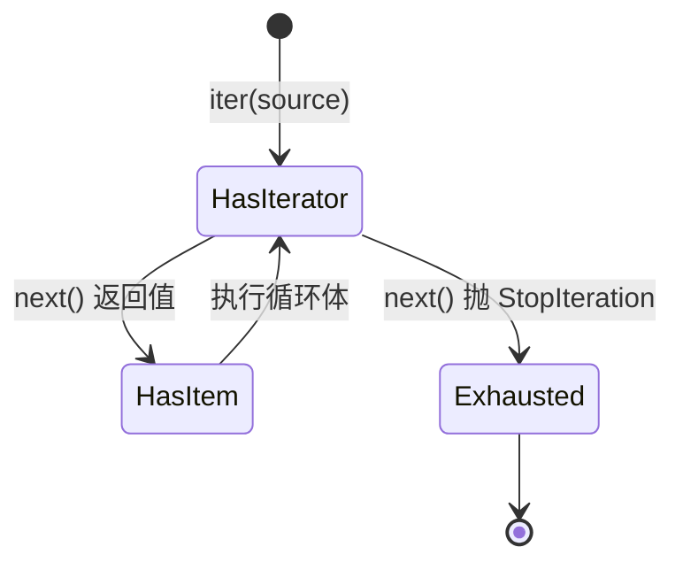
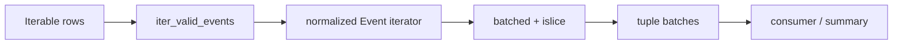

# Python 容器与迭代协议：切片、推导式、迭代器、生成器与惰性求值

> 官方语义基线：Python 3.14.6。示例兼容 Python 3.11+，已在 CPython 3.13.4 验证。

## 1. 为什么容器不只是四种括号

后端程序不断处理一组数据：请求列表、数据库行、配置映射、唯一用户、消息流。选择容器时，真正的问题不是“哪个写起来最短”，而是：

- 是否需要保持顺序？
- 是否允许重复？
- 是否按位置还是按 key 查找？
- 是否允许修改？
- 数据是否能全部放进内存？
- 是否需要重复遍历？
- 遇到错误应在构造阶段还是消费阶段发生？

`list`、`tuple`、`dict`、`set` 和 generator 分别表达不同契约。混用会造成重复数据、顺序不稳定、内存峰值或“一次消费后为空”等问题。

## 2. 本课目标

完成本课后，应能解释：

- sequence、mapping、set、iterable 与 iterator 的边界；
- list、tuple、dict、set 各自适合表达什么；
- 索引、切片、负索引与步长如何计算；
- 为什么切片是浅拷贝；
- dict 插入顺序与 set 无序的工程含义；
- hashable 为什么是 dict key 和 set 元素的前提；
- 推导式和 generator expression 的求值时机；
- `for` 如何调用 `iter()`、`next()` 和处理 `StopIteration`；
- generator 函数调用时为什么还没有执行函数体；
- 惰性管道的内存优势、延迟错误和一次性消费代价；
- 遍历时修改容器为什么危险。

## 3. 容器、可迭代对象与迭代器不是同义词

### 3.1 容器 container

容器持有或组织其他对象，例如 list、tuple、dict 和 set。它常支持成员判断、长度或迭代，但具体能力由类型决定。

### 3.2 可迭代对象 iterable

可迭代对象能提供 iterator。通常调用：

```python
iterator = iter(iterable)
```

list、tuple、dict、set、str、range、文件对象和 generator 都可迭代。

### 3.3 迭代器 iterator

迭代器是带当前位置状态的对象，支持：

```python
iter(iterator) is iterator
next(iterator)
```

每次 `next` 返回下一个元素；耗尽后抛 `StopIteration`，并应持续保持耗尽。

### 3.4 一个关键区别

list 通常可重复迭代：每次 `iter(list)` 创建新的 iterator。generator 本身就是 iterator，通常只能沿自己的状态前进一次。

## 4. 用能力选择容器

| 类型 | 顺序 | 重复 | 访问方式 | 可变 | 典型用途 |
| --- | --- | --- | --- | --- | --- |
| list | 有 | 允许 | 整数索引 | 是 | 有序动态序列 |
| tuple | 有 | 允许 | 整数索引 | 否 | 固定记录、快照、复合 key |
| dict | 插入顺序 | key 唯一 | hashable key | 是 | key 到 value 的映射 |
| set | 不提供位置顺序 | 自动去重 | 成员关系 | 是 | 去重、集合运算 |
| frozenset | 不提供位置顺序 | 自动去重 | 成员关系 | 否 | 不可变集合、复合 key |
| range | 数值顺序 | 由参数决定 | 索引/迭代 | 否 | 惰性整数等差序列 |
| generator | 产生顺序 | 由逻辑决定 | 顺序消费 | 状态前进 | 流式转换 |

“dict 有序”表示保持插入顺序，不表示按 key 自动排序。“set 无序”表示不提供基于位置的顺序契约，不应把某次打印顺序当作稳定结果。

## 5. list：有序、可变、允许重复

```python
events = ["login", "view", "view"]
```

list 适合：

- 保留到达顺序；
- 按索引访问；
- 允许重复；
- 在末尾追加或删除；
- 需要重复遍历。

### 5.1 常见操作的复杂度边界

对 CPython list，可建立以下工程直觉：

- `items[i]`：通常 O(1)；
- `append`：摊销 O(1)；
- `pop()` 末尾：O(1)；
- `insert(0, x)` / `pop(0)`：O(n)，需要移动后续元素；
- `x in items`：O(n) 线性查找；
- 切片：与复制元素数量相关。

复杂度是算法模型，不是具体耗时保证。对象比较、内存分配和缓存局部性仍会影响实际性能。

### 5.2 队列不要长期使用 pop(0)

需要频繁从两端进出时使用 `collections.deque`，它表达双端队列语义并避免反复移动整个 list。

## 6. 原地修改方法通常返回 None

```python
items = [3, 1, 2]
result = items.sort()
```

`items.sort()` 原地修改 list，返回 `None`。因此 result 不是排序结果。

Python 内置可变集合中，纯修改方法通常返回 None，帮助区分：

- `items.sort()`：改变原对象；
- `sorted(items)`：返回新 list，接受任意 iterable。

不要写链式调用：

```python
items.sort().reverse()  # None 没有 reverse
```

## 7. tuple：固定引用序列

```python
coordinate = (120.1, 30.2)
```

tuple 适合表达：

- 固定数量的相关值；
- 不希望增删位置的快照；
- 所有元素均 hashable 时作为 dict key；
- 函数多返回值的底层打包结果。

### 7.1 单元素 tuple 的逗号

```python
single = ("admin",)
not_tuple = ("admin")
```

构成 tuple 的关键是逗号，不是括号。

### 7.2 tuple 不保证深度不可变

若 tuple 中包含 list，该 list 仍可修改；且此 tuple 不能 hash。hashability 与对象图中参与相等比较的值是否稳定有关。

## 8. range：不预先保存所有整数

```python
numbers = range(0, 1_000_000, 2)
```

range 保存 start、stop、step 等描述，不创建一百万个整数的 list。它支持长度、索引、切片和高效成员判断。

```python
10 in range(0, 1_000_000, 2)  # True
```

需要真实 list 时才显式 `list(range(...))`。无目的物化会增加内存。

## 9. 索引与负索引

序列从 0 开始：

```python
items[0]   # 第一个
items[-1]  # 最后一个
```

索引越界抛 `IndexError`。负索引不是循环取模；超出负向边界仍报错。

后端代码不要用 `items[0]` 假设查询必有结果，除非上游已经建立非空不变量。否则应显式判断或选择能表达缺失的 API。

## 10. 切片的半开区间

```python
items[start:stop:step]
```

包含 start，不包含 stop。半开区间使长度通常等于 `stop - start`，相邻片段也容易拼接：

```python
items[:middle] + items[middle:]
```

### 10.1 省略边界

```python
items[:3]   # 从开头到索引 3 之前
items[3:]   # 从索引 3 到结尾
items[:]    # 整个序列的浅拷贝（对 list）
items[::2]  # 每隔一个元素
items[::-1] # 反向新序列
```

切片边界超出范围通常会被收缩，而单个索引越界会报错。不要利用过宽切片掩盖分页边界错误。

### 10.2 切片是浅层

对 list，切片创建新外层 list，但元素引用被复制。嵌套可变对象仍共享，这与上一课的 shallow copy 完全一致。

### 10.3 切片分配新容器

`items[:100]` 会创建 list；在超大序列管道中反复切片可能造成复制。流式批处理可使用 iterator + `itertools.islice`。

## 11. dict：从 hashable key 映射到 value

```python
counts = {"view": 3, "login": 1}
```

dict 适合：

- 按业务 key 查找；
- 聚合计数；
- 表达结构化记录；
- 去除同 key 的旧值；
- 保留首次插入顺序。

### 11.1 读取缺失 key

```python
counts["logout"]       # KeyError
counts.get("logout")  # None
counts.get("logout", 0)
```

`get` 返回 None 时无法区分“key 不存在”和“key 存在且值为 None”。需要区分时使用 `in` 或独立 sentinel。

### 11.2 聚合计数的状态变化

```python
counts[event_type] = counts.get(event_type, 0) + 1
```

过程是：读取旧值或 0、加一、重新写回对应 key。并发环境下这不是自动原子业务事务。

更复杂计数可使用 `collections.Counter`，分组集合可用 `defaultdict`，但应先理解普通 dict 语义。

## 12. dict 插入顺序的边界

Python语言保证 dict 按插入顺序迭代：

```python
mapping = {"login": 1, "view": 2}
list(mapping)  # ["login", "view"]
```

更新已有 key 不会把它自动移动到末尾；删除后重新插入会成为新的末尾位置。

插入顺序不等于排序。需要跨输入稳定的字典序输出时，显式：

```python
for key in sorted(mapping):
    ...
```

## 13. dict key 为什么必须 hashable

dict 通过 hash 快速缩小候选位置，再用相等比较确认 key。

一个对象要作为 key，必须在其参与 dict 的生命周期内保持 hash 与相等语义稳定。常见可用 key：

- str、int、bytes；
- 元素全部 hashable 的 tuple；
- frozenset；
- 正确实现 hash 协议的不可变用户对象。

list、dict、set 可变，因此不可作为普通 dict key。

### 13.1 相等数值 key 的陷阱

`1`、`1.0` 和 `True` 值比较相等且 hash 兼容，会定位同一个 dict 条目。若业务必须区分类型，不应直接把它们混作 key。

## 14. set：唯一 hashable 元素的集合

```python
users = {"u-1", "u-2"}
```

set 适合：

- 去重；
- 快速成员判断；
- 交集、并集、差集；
- 已处理 ID 追踪。

常用运算：

```python
left | right  # union
left & right  # intersection
left - right  # difference
left ^ right  # symmetric difference
```

### 14.1 空 set 的写法

```python
empty_set = set()
empty_dict = {}
```

`{}` 始终创建空 dict。

### 14.2 不要依赖 set 遍历顺序

set 不提供位置或插入顺序契约。要输出稳定 JSON、测试快照或分页结果，应先 `sorted(users)`。

set 能去重，但会丢失原始重复次数和顺序。若这些信息有业务意义，不能仅用 set 替代 list。

## 15. frozenset：不可变集合

frozenset 支持集合查询与运算，但不能增删元素。因为不可变且 hashable，它可作为 dict key或 set 元素。

例如缓存权限组合：

```python
cache_key = frozenset({"read", "write"})
```

它表达“顺序无关的能力集合”，比排序 tuple 更直接。

## 16. 遍历 dict 的正确方式

```python
for key in mapping:
    ...

for value in mapping.values():
    ...

for key, value in mapping.items():
    ...
```

`items()` 产生 key/value 对，可直接解包。不要在只需 value 时反复通过 key 二次查找，也不要为了遍历先无目的转换 list。

## 17. enumerate 与 zip

需要位置时：

```python
for position, row in enumerate(rows, start=1):
    ...
```

这比手工维护 `index += 1` 更不易错。

并行遍历：

```python
for name, score in zip(names, scores, strict=True):
    ...
```

默认 zip 以最短 iterable 为止，可能静默丢弃较长输入尾部。长度必须一致时使用 `strict=True`，不一致会抛 `ValueError`。

## 18. 不要在遍历时改变 dict 或 set 大小

危险代码：

```python
for key in mapping:
    mapping[key + "-copy"] = mapping[key]
```

通常抛出 `RuntimeError: dictionary changed size during iteration`。即使某些 list 修改没有立刻报错，也可能跳过或重复处理元素。

安全策略：

- 遍历快照 `list(mapping.items())`；
- 先收集待修改项，循环后统一应用；
- 构建新容器；
- 明确使用 queue/deque 表达动态工作队列。

## 19. 推导式的结构

list comprehension：

```python
normalized = [text.strip() for text in values if text.strip()]
```

执行顺序：

1. 从 values 取一个元素绑定 text；
2. 计算过滤条件；
3. 条件为真时计算输出表达式；
4. 追加到新 list；
5. 重复到耗尽。

### 19.1 其他推导式

```python
unique = {value.strip() for value in values}
mapping = {event["id"]: event for event in events}
coordinates = tuple(x * 2 for x in values)
```

最后一行不是 tuple comprehension；括号产生 generator expression，再交给 tuple 消费。

### 19.2 何时不要用推导式

若包含多层分支、异常处理、日志或多种副作用，普通 for 循环更清楚。推导式应服务于“从 iterable 构造新容器”的单一表达。

不要用 `[side_effect(x) for x in items]` 只为了副作用，它会额外创建无用 list。

## 20. 推导式拥有自己的作用域

Python 3 中推导式循环变量不会泄漏到外围作用域：

```python
name = "outside"
values = [name.upper() for name in ["a", "b"]]
print(name)  # outside
```

但推导式仍可读取外围变量。闭包延迟绑定等更深层行为会在函数与作用域课程讨论。

## 21. generator expression 不立刻产生全部结果

```python
squares = (number * number for number in numbers)
```

这里创建 generator iterator。每次 `next(squares)` 才取一个输入并计算一个平方。

对比：

```python
list_values = [transform(x) for x in source]  # 立即全部计算
lazy_values = (transform(x) for x in source)  # 消费时逐个计算
```

## 22. for 循环的协议因果链

下面代码：

```python
for item in source:
    process(item)
```

可近似理解为：

```python
iterator = iter(source)
while True:
    try:
        item = next(iterator)
    except StopIteration:
        break
    process(item)
```



实际 for 循环由解释器优化实现，但协议模型准确解释自定义 iterable 与 generator。

## 23. iterable 与 iterator 的复用差异

```python
items = [1, 2]
list(items)  # [1, 2]
list(items)  # [1, 2]
```

list 每次创建新 iterator。

```python
iterator = iter(items)
list(iterator)  # [1, 2]
list(iterator)  # []
```

同一个 iterator 已耗尽。文件、数据库 cursor、generator 等也常具有一次消费特征。

函数签名接收 `Iterable[T]` 时，不应暗中假设可以遍历两次；若需要复用，要明确物化或要求 Sequence。

## 24. generator 函数何时执行

包含 `yield` 的函数是 generator function：

```python
def produce():
    print("start")
    yield 1
```

调用：

```python
generator = produce()
```

只创建 generator 对象，不打印 start。第一次 `next(generator)` 才进入函数体并运行到 yield。

yield 会：

1. 把值交给调用者；
2. 暂停执行；
3. 保留局部名称绑定、指令位置、求值栈和异常状态；
4. 下次 next 从暂停位置继续。

函数 return 或执行完毕后，generator 通过 StopIteration 表示耗尽。

## 25. 惰性求值的收益

### 25.1 有界内存

处理百万行时，生成器可以一次保留当前行和有限缓冲，而不是完整中间 list。

### 25.2 组合管道

```python
normalized = normalize(rows)
valid = filter_valid(normalized)
batches = batched(valid, 100)
```

各层都可逐个拉取，最终消费者决定执行速度。

### 25.3 提前终止

只找第一个匹配值时，后续数据无需读取或计算。

## 26. 惰性求值的代价

- 错误延迟到消费位置；
- generator 通常只能消费一次；
- 调试时看不到全部内容；
- 资源生命周期可能跨越 yield；
- 多次遍历需要重新创建管道；
- 下游不消费，上游逻辑根本不会执行。

“更省内存”不等于所有场景更优。小数据需要排序、随机访问和多次遍历时，list 更直接。

## 27. 延迟错误为什么重要

本课：

```python
events = iter_valid_events(rows)
```

不会立刻验证全部 rows。第一次 next 只验证第一行，第二行错误直到第二次 next 才出现。

这有利于流式处理，但 API 设计必须说明：函数返回 iterator 不等于工作已经成功完成。事务提交、文件关闭和 HTTP 响应不能忽略后续消费失败。

## 28. 完整惰性事件管道

<<< ../../../examples/python/python-containers-iteration/container_iteration/pipeline.py{python:line-numbers} [pipeline.py]

处理链：



### 28.1 为什么输入声明 Iterable

函数不需要索引和长度，只需逐个取值。因此它接受 list、tuple、generator、文件或其他 iterable，契约比 Sequence 更宽但仍准确。

### 28.2 为什么批次是 tuple

每个批次创建后不应被批处理函数继续修改。tuple表达固定批次快照；其中 Event dict 本身仍可变，这不是深度不可变承诺。

### 28.3 为什么用 islice

`itertools.islice(iterator, size)` 从现有 iterator 最多取 size 个元素，不要求源支持普通切片，也不物化剩余所有数据。

### 28.4 海象运算符的作用

```python
while batch := tuple(islice(iterator, size)):
```

先计算并绑定 batch，再测试 tuple 真值。空 tuple 表示耗尽，非空尾批仍会 yield。复杂赋值表达式应谨慎使用，避免降低可读性。

## 29. 聚合为何需要显式物化状态

`summarize_events` 虽然流式读取输入，仍需要保存：

- counts dict：每个事件类型的计数；
- users set：所有唯一用户；
- total int。

惰性处理不等于零内存。聚合状态大小由唯一 key 数量决定，而不是总事件数；若唯一用户也极多，set 仍可能耗尽内存，需要数据库、外部聚合或近似算法。

## 30. 确定性输出

完整报告：

<<< ../../../examples/python/python-containers-iteration/container_iteration/report.py{python:line-numbers} [report.py]

counts 利用 dict 保留事件类型首次出现顺序；unique_users 从 set 转成 sorted list，避免依赖 set 顺序。

稳定输出对以下场景很重要：

- JSON API 契约；
- 测试快照；
- 缓存 key；
- 内容 hash；
- 可重复构建。

如果协议声明对象 key 无序，就不应让客户端依赖 JSON 字段顺序；若业务本身需要顺序，应使用数组明确表达。

## 31. 全部测试

<<< ../../../examples/python/python-containers-iteration/tests/test_pipeline.py{python:line-numbers} [test_pipeline.py]

测试覆盖成功与失败：

- validation 的延迟发生；
- generator 消费一次后为空；
- 5 个事件按 2 分批得到 2、2、1；
- size 不能为 0 或 bool；
- dict 聚合保持首次出现顺序；
- set 去重后排序；
- list 不能作为 dict key；
- 遍历中改变 dict 大小抛 RuntimeError。

## 32. 运行示例

```bash
cd examples/python/python-containers-iteration
python3 -m venv .venv
source .venv/bin/activate
python -m unittest discover -v
python -m container_iteration
python -m compileall -q container_iteration
```

项目仅使用标准库。

## 33. 常用 iterator 工具

### 33.1 any 与 all

```python
any(predicate(x) for x in items)
all(predicate(x) for x in items)
```

二者短路。`any([])` 为 False，`all([])` 为 True；后者来自数学上的空真，业务中应确认空集合是否真的算“全部满足”。

### 33.2 sum、min、max

这些函数消费 iterable。空 iterable 的 `min/max` 会报错，除非提供 default；sum 空输入默认 0。不要对同一个 generator 连续调用多个聚合并期待重新开始。

### 33.3 itertools

`chain`、`islice`、`takewhile`、`groupby` 等提供惰性组合。尤其注意 `groupby` 只聚合相邻相同 key，通常需要先按相同 key 排序，与 SQL GROUP BY 语义不同。

## 34. 排序的 key 模型

```python
sorted(users, key=lambda user: user["created_at"], reverse=True)
```

key 函数为每个元素生成比较键。Python排序稳定：key相等时保留原相对顺序，便于多级排序。

不要使用 comparator 风格反复进行昂贵提取；key 通常每个元素计算一次。不同不可比较类型混在同一 key 空间会抛 TypeError。

## 35. 内存与复杂度不是唯一选择标准

set 成员判断通常快于 list，但若需要：

- 保存重复次数；
- 保持输入顺序；
- 按位置访问；
- 输出与输入一致；

list 更符合语义。可以组合 list + set 同时保持顺序和快速查重，但需要维护两个状态一致。

数据结构首先表达不变量，其次才优化热点。优化前应用真实数据测量。

## 36. 与 JavaScript 对比

| Python | JavaScript | 关键区别 |
| --- | --- | --- |
| list | Array | Python list 没有 JS 稀疏数组的同类常用语义 |
| tuple | 无完全内置对应 | JS Array 即使 const 仍可修改 |
| dict | Object / Map | Python key 必须 hashable，普通 dict key 不限字符串 |
| set | Set | 都去重，但相等与迭代规则不同 |
| generator | Generator | 都有一次消费和 yield 状态暂停概念 |
| comprehension | map/filter/数组方法 | Python推导式可构造 list/set/dict |
| `for item in iterable` | `for...of` | 都基于迭代协议，但接口名称不同 |

Python dict 不是 JavaScript plain object 的简单同义词。JSON 对象最终只允许字符串 key，而 Python dict 可有 tuple、int 等 key；序列化前必须处理边界。

## 37. 与 Java 对比

| Python | Java | 关键区别 |
| --- | --- | --- |
| list | ArrayList/List | Python运行时不强制元素泛型 |
| tuple | record/不可变组合近似 | tuple 只有位置语义，不提供字段名 |
| dict | HashMap/LinkedHashMap | Python dict 语言保证插入顺序 |
| set | HashSet | 都要求稳定 hash/equals 语义 |
| iterator | Iterator | Python通过 next + StopIteration 结束 |
| generator | Stream/Iterator 的部分能力 | yield 保存函数执行帧，Java普通方法无直接同义语法 |

Python generator 与 Java Stream 都可能惰性且一次消费，但 API、并行模型和资源关闭规则不同，不能只凭“流”字迁移假设。

## 38. 常见故障的因果排查

### 38.1 第二次遍历结果为空

检查对象是否 iterator/generator，而不是可重复 iterable。若需两次处理，重新创建 generator 或在可控规模下物化 list。

### 38.2 错误没有在调用函数时出现

检查函数是否含 yield 或返回 generator expression。真正执行发生在 next、for、list、sum 等消费操作。

### 38.3 输出顺序在环境间变化

检查是否来自 set、无序外部源或显式并发。需要稳定顺序就排序或使用具有顺序语义的数据源。

### 38.4 list 作为 dict key 报 unhashable

确认 key 是否会变化。固定有序组合可用元素全部 hashable 的 tuple；顺序无关集合可用 frozenset；业务实体通常应使用稳定 ID。

### 38.5 遍历时 RuntimeError

检查是否增删 dict/set key。构建修改计划或遍历快照，不要捕获 RuntimeError 后继续使用半修改状态。

### 38.6 内存仍然很高

即使用 generator，也检查下游是否执行 list、sorted、set 或保存所有聚合 key。管道只有在每一层保持有界状态时才真正流式。

## 39. 工程检查清单

- 用顺序、重复、查找方式和可变性选择容器；
- 不用 list 模拟高频队列头操作；
- 不把原地修改方法的 None 当结果；
- 不依赖 set 顺序；
- dict 插入顺序不等于排序；
- key 与 set 元素保持 hash/equality 稳定；
- 切片视为浅复制和内存分配；
- 长度必须一致时使用 zip(strict=True)；
- 不在迭代时改变 dict/set 大小；
- 推导式不承载复杂副作用；
- 明确 API 接受 Iterable 还是可重复 Sequence；
- generator 的延迟错误纳入事务和资源边界；
- 多次聚合前确认 iterator 是否已耗尽；
- 惰性管道逐层检查是否偷偷物化；
- 稳定输出对 set 显式排序；
- 测试空输入、尾批、无效项和一次消费。

## 40. 本课结论

- list 表达有序可变序列，tuple 表达固定引用序列，dict 表达 key/value 映射，set 表达唯一成员集合。
- 容器、iterable 和 iterator 是不同抽象；iterator 包含前进状态。
- for 通过 iter、next 与 StopIteration 工作。
- list 能重复产生新 iterator；generator 通常就是一次性 iterator。
- 切片采用半开区间，并对 list 产生浅层新容器。
- dict 保持插入顺序；set 不提供位置顺序；稳定输出要显式处理。
- dict key 和 set 元素必须 hashable，hash 与 equality 必须稳定一致。
- 推导式立即构造容器，generator expression 按消费惰性计算。
- yield 暂停并保存函数局部状态，调用 generator function 本身不会立即执行函数体。
- 惰性求值降低中间内存并支持提前结束，同时带来延迟错误和一次消费约束。
- 真正的流式系统要求整个管道维持有界状态，而不是只在第一层使用 generator。

下一节建议：Python 函数、参数模型、作用域、闭包、装饰器与函数式抽象。

## 41. 参考资料

- [Python Tutorial：Data Structures](https://docs.python.org/3.14/tutorial/datastructures.html)
- [Python Built-in Types：Iterator Types](https://docs.python.org/3.14/library/stdtypes.html#iterator-types)
- [Python Built-in Types：Sequence Types](https://docs.python.org/3.14/library/stdtypes.html#sequence-types-list-tuple-range)
- [Python Built-in Types：Mapping Types](https://docs.python.org/3.14/library/stdtypes.html#mapping-types-dict)
- [Python Built-in Types：Set Types](https://docs.python.org/3.14/library/stdtypes.html#set-types-set-frozenset)
- [Python Expressions：Displays for Lists, Sets and Dictionaries](https://docs.python.org/3.14/reference/expressions.html#displays-for-lists-sets-and-dictionaries)
- [Python Expressions：Generator Expressions](https://docs.python.org/3.14/reference/expressions.html#generator-expressions)
- [Python Expressions：Yield Expressions](https://docs.python.org/3.14/reference/expressions.html#yield-expressions)
- [Python Functional Programming HOWTO](https://docs.python.org/3.14/howto/functional.html)
- [Python：itertools](https://docs.python.org/3.14/library/itertools.html)
- [Python：collections](https://docs.python.org/3.14/library/collections.html)
