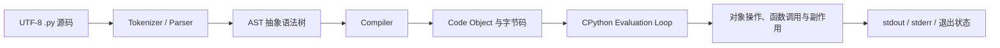

# Python 开发环境、解释器、虚拟环境、执行模型与第一个程序

> 官方文档基线：Python 3.14.6。配套代码兼容 Python 3.11+，并已在 macOS、CPython 3.13.4 上实际运行。不同操作系统的启动命令和安装路径可能不同。

## 1. 为什么第一课不能只写 `print("Hello")`

一行 `print` 能证明“某个 Python”运行了代码，却回答不了后端开发很快会遇到的问题：

- 终端中的 `python` 和编辑器选中的 Python 是同一个吗？
- `pip install` 把包安装给了哪个解释器？
- 为什么项目在自己电脑能运行，换一台机器就缺包？
- `.py` 文件是逐字符解释，还是先编译？
- `python file.py` 与 `python -m package` 有什么不同？
- 虚拟环境隔离了 Python 版本，还是只改变包和命令的查找位置？
- 程序失败后为什么终端或 CI 能知道它失败了？

这些不是安装细节，而是后续 FastAPI、测试、部署与 AI 工具链是否可靠的地基。

第一次学习只抓住一条线：**当前终端究竟启动了哪个解释器，这个解释器能看到哪些包，它怎样执行当前项目。** AST、code object 和字节码用于解释过程，不要求现在记忆；能创建虚拟环境并用 `python -m` 稳定运行程序，就完成了主线。

## 先做一次“解释器身份检查”

在终端执行：

```bash
python -c "import sys; print(sys.executable); print(sys.version)"
python -m pip --version
```

两条输出应指向同一套解释器环境。`python -m pip` 的因果关系是：先确定当前 `python`，再让这个解释器加载 pip module；单独运行 `pip` 时，shell 可能找到另一套安装目录中的命令。

创建虚拟环境后：

```text
python -m venv .venv
  → 生成项目专用解释器入口和 site-packages
  → 激活脚本把 .venv/bin（Windows 为 Scripts）放到 PATH 前面
  → 后续 python/pip 优先指向该环境
```

虚拟环境不会下载另一份完整 Python 语言规范，也不是 Docker。它主要隔离“这个项目使用哪个解释器入口、能 import 哪些已安装 distribution”。操作系统库、CPU 架构和环境变量仍可能影响程序。

## 从命令到代码执行的最小链路

```text
shell 查找 python 命令
  → 操作系统启动 CPython 进程
  → CPython 读取目标 module/source
  → parse 为 AST
  → compile 为 code object/bytecode
  → evaluation loop 执行
  → 正常返回 exit code 0，未处理异常通常返回非 0
```

这解释了两个常见现象：Python 是“解释型语言”不代表源码不编译；出现 `__pycache__` 也不代表生成了可脱离解释器运行的机器码程序。

第一课真正的验收不是看到 Hello，而是能指出当前 `sys.executable`、用 `python -m` 启动包，并让失败通过非零退出码传给终端或 CI。

## 2. 本课目标

完成本课后，应能准确解释：

- Python 语言、CPython 和解释器进程的区别；
- `python`、`python3`、`py` 与绝对路径为何可能指向不同解释器；
- REPL、脚本、`-c` 和 `-m` 四种执行入口；
- 源码、AST、code object、字节码与 Python 虚拟机之间的因果关系；
- `__name__ == "__main__"` 为什么成立；
- `venv` 隔离什么、不隔离什么；
- 为什么优先使用 `python -m pip`；
- 如何组织一个具有业务逻辑、CLI 适配层、错误处理和测试的最小项目。

## 3. 先划清五个容易混淆的概念

### 3.1 Python 语言

Python 是一套语言语法和语义规范，例如缩进如何组成代码块、函数调用如何求值、异常如何传播。

“Python 支持什么”首先是语言层问题，但某些性能、内存和字节码细节属于具体实现，不能当作所有实现的永久承诺。

### 3.2 Python 实现

实现是让 Python 程序真正运行的软件。最常见的是 **CPython**，由 Python 社区维护，核心主要使用 C 实现。

其他实现包括 PyPy、Jython 等。它们可以实现相同语言的大部分语义，但垃圾回收、JIT、扩展兼容性和性能特征可能不同。

本课程没有特别说明时，运行原理以 CPython 为边界。

### 3.3 Python 版本

`3.14.6` 包含：

- `3`：主版本；
- `14`：次版本，可能增加语法、标准库能力或改变部分行为；
- `6`：维护版本，通常包含错误和安全修复。

项目声明 `>=3.11` 是兼容性约束，不代表在所有未来 Python 版本上自动正确。生产环境仍应锁定并验证具体版本系列。

### 3.4 解释器可执行文件

它是磁盘上的程序，例如：

```text
/usr/local/bin/python3.14
/Library/Frameworks/Python.framework/Versions/3.13/bin/python3
C:\Users\name\AppData\Local\Python\pythoncore-3.14-64\python.exe
```

Shell 输入的 `python3` 只是命令名。Shell 会根据 PATH 找到一个可执行文件。改变 PATH、激活虚拟环境或切换终端，结果都可能变化。

### 3.5 解释器进程

执行 `python3 app.py` 会由操作系统启动一个进程。这个进程拥有自己的：

- 内存地址空间；
- 模块缓存 `sys.modules`；
- 全局解释器状态；
- 文件描述符和环境变量视图；
- 退出状态。

同一个可执行文件启动两次，会得到两个独立进程。变量不会天然共享。

## 4. 为什么命令名不等于版本契约

在不同系统上：

- `python` 可能不存在；
- `python` 可能指向 Python 3；
- `python3` 可能指向 3.11、3.13 或 3.14；
- Windows 可能通过 `py` 启动器选择版本；
- 激活 venv 后，同一命令名会优先找到环境内解释器。

因此第一步不是猜，而是观察：

```bash
python3 --version
python3 -c "import sys; print(sys.executable)"
```

第一条回答语言版本，第二条回答实际可执行文件路径。两者缺一不可。

在程序内还可以检查：

```python
import platform
import sys

print(platform.python_implementation())
print(platform.python_version())
print(sys.executable)
```

## 5. 安装 Python 时真正要得到什么

一个可用于开发的 Python 安装通常提供：

- 解释器；
- 标准库；
- `venv`；
- `ensurepip` / pip；
- 开发所需的头文件或工具（取决于发行方式）；
- TLS、SQLite 等可选系统能力。

### 5.1 macOS

可以使用 python.org 官方安装包，也可以使用受控的包管理器。不要删除或覆盖操作系统组件依赖的 Python。项目应通过自己的版本和虚拟环境建立边界。

### 5.2 Windows

官方 Python Install Manager / 安装方式可提供 `python`、版本化命令或 `py` 启动能力。安装完成后应重新打开终端并验证 `sys.executable`，不要只相信安装界面的成功提示。

### 5.3 Linux

发行版仓库的 Python 可能服务于系统工具。安装额外版本时要遵循发行版规则，避免把系统包环境当作应用的全局 pip 目录。

### 5.4 为什么不推荐全局修改系统 Python

系统工具与项目可能需要不同版本和依赖。全局升级或删除包会把一个项目的决定扩散到整台机器，导致：

```text
项目 A 升级某包 → 系统工具或项目 B 读取到新版本 → 非局部故障
```

虚拟环境的价值就是缩小这个影响范围。

## 6. 四种常见执行入口

### 6.1 REPL

直接运行解释器：

```bash
python3
```

出现 `>>>` 后进入 Read-Eval-Print Loop：读取输入、求值、打印表达式结果，再等待下一次输入。

REPL 适合快速验证对象或 API，不适合保存正式程序。退出进程后，之前定义的变量随进程内存一起消失。

### 6.2 执行脚本文件

```bash
python3 inspect_runtime.py
```

解释器把文件作为顶层程序执行。`sys.argv[0]` 通常是脚本路径，脚本所在目录会影响模块搜索路径。

### 6.3 使用 `-c`

```bash
python3 -c "import sys; print(sys.version)"
```

适合短诊断命令。复杂程序写进 shell 字符串会同时受到 shell 引号和 Python 语法影响，不利于维护。

### 6.4 使用 `-m`

```bash
python3 -m learning_backend --name 小明
```

`-m` 先按模块系统定位 `learning_backend`，再把它作为顶层程序执行。对于包，它会执行 `learning_backend/__main__.py`。

工具命令也常使用这种形式：

```bash
python3 -m pip --version
python3 -m unittest discover -v
python3 -m venv .venv
```

最大好处是：`pip`、`unittest`、`venv` 明确由命令开头的那个解释器运行。

## 7. 源代码如何变成运行结果

“Python 是解释型语言”是方便但不完整的描述。以 CPython 为例，典型因果链是：



### 7.1 读取与解析

Python 3 源文件默认使用 UTF-8。解析器根据 token 和语法规则构造抽象语法树。若语法不合法，程序还没有进入正常执行就抛出 `SyntaxError`。

### 7.2 编译为 code object

CPython 会把 AST 编译成 code object，其中包含字节码、常量、名称等执行信息。这是“编译”，但不是通常所说的直接生成独立本机机器码可执行文件。

### 7.3 执行字节码

CPython 的执行循环读取字节码指令，操作 Python 对象栈并调用底层实现。具体指令名称和优化属于实现细节，可能随 CPython 次版本变化。

### 7.4 缓存 `.pyc`

导入模块时，CPython可能把可复用字节码写入 `__pycache__`：

```text
__pycache__/greeting.cpython-313.pyc
```

`cpython-313` 表示解释器实现和缓存标签。`.pyc` 是加载优化，不是源码保护，也不是跨所有 Python 版本稳定的发布格式。

## 8. “解释执行”不等于“每行机械翻译一次”

常见误解包括：

- Python 完全不编译；
- Python 永远按源码文本逐行读取；
- 生成 `.pyc` 后就不需要解释器；
- 所有 Python 实现都执行相同字节码。

更准确的说法是：Python 语言允许不同实现；CPython 通常先把源码编译成自己的字节码，再由运行时执行。实现可能加入自适应优化，其他实现也可能使用 JIT。

## 9. 名称、对象与动态类型的第一印象

Python 变量更准确地说是“名称绑定”：

```python
value = 42
value = "forty-two"
```

第一次把名称 `value` 绑定到整数对象，第二次改为绑定字符串对象。类型属于对象，而不是像 Java 局部变量声明那样固定属于名称。

这不表示 Python “没有类型”。对象的类型在运行时真实存在：

```python
type(42)       # int
type("42")     # str
```

动态类型意味着许多不兼容操作在运行到对应表达式时才报错。类型提示和静态检查器可以提前发现一部分问题，但不会把 Python 自动变成 Java 的静态类型模型。

## 10. 缩进为什么是语法

JavaScript 和 Java 使用 `{}` 表示代码块，Python 使用缩进：

```python
if authenticated:
    print("允许访问")
else:
    print("拒绝访问")
```

冒号开始复合语句的 suite，缩进决定语句归属。缩进不一致可能产生 `IndentationError`，也可能更危险地形成语法合法但逻辑错误的代码。

工程中通常使用 4 个空格，不混用 Tab。格式化工具不仅改善美观，也减少块结构误读。

## 11. 第一个最小函数

本课把业务逻辑放在独立函数中：

<<< ../../../examples/python/python-environment-first-program/learning_backend/greeting.py{python:line-numbers} [greeting.py]

执行过程：

1. 调用者传入 `name` 和可选 `topic`；
2. `strip()` 创建去除首尾空白的新字符串；
3. 空字符串在布尔上下文中为 false；
4. 无效输入抛出 `ValueError`；
5. 有效输入由 f-string 组成结果并返回。

函数没有读取终端、没有 `print`、也没有直接退出进程，因此容易单元测试和复用到未来的 HTTP 接口。

### 11.1 类型提示的边界

`name: str` 和 `-> str` 是类型注解。CPython 默认不会仅因为注解就阻止调用者传入其他对象。

它们用于：

- 编辑器补全；
- 静态类型检查；
- 文档；
- 框架运行时读取元数据。

输入校验与类型提示不是一回事。来自 HTTP、命令行或数据库的数据仍需在运行时验证。

### 11.2 为什么抛 ValueError

空白名称违反函数的值约束，但参数类型仍是字符串，所以 `ValueError` 比返回空字符串或悄悄使用默认值更准确。

函数通过异常把失败交给边界层决定如何呈现：CLI 转成 stderr 和退出码，FastAPI 将来可以转成 HTTP 400/422。

## 12. CLI 是输入输出适配层

完整 CLI：

<<< ../../../examples/python/python-environment-first-program/learning_backend/cli.py{python:line-numbers} [cli.py]

`argparse` 负责：

- 读取命令行字符串；
- 识别 `--name` 和 `--topic`；
- 生成帮助信息；
- 缺少参数或参数错误时写 stderr；
- 以状态 2 表示命令行使用错误。

`main(argv=None) -> int` 让核心入口可测试。测试可以直接传列表，而不必修改整个进程的 `sys.argv`。

## 13. 为什么入口使用 SystemExit

包入口如下：

<<< ../../../examples/python/python-environment-first-program/learning_backend/__main__.py{python:line-numbers} [__main__.py]

`main()` 返回整数，`SystemExit` 把它转换为进程退出状态：

```text
0     成功
非 0 失败或特定异常状态
```

Shell、CI、容器编排和父进程不能只靠阅读中文输出判断成功，退出状态才是机器间契约。

`raise SystemExit(main())` 比在深层业务函数直接调用 `sys.exit()` 更清晰：业务逻辑可复用，只有最外层决定结束进程。

## 14. `__name__ == "__main__"` 到底是什么

Python 执行模块时会提供若干模块级全局名称。`__name__` 表示模块身份：

- 文件作为顶层入口执行时，`__name__` 是 `"__main__"`；
- 文件被导入时，`__name__` 是可导入模块名。

因此：

```python
if __name__ == "__main__":
    ...
```

表达的是“只有本模块作为程序入口时才执行”，不是字符串魔法，也不是声明一个 Java `main` 方法。

导入模块会执行模块顶层语句，所以顶层应避免不可控的网络请求、线程启动和数据修改。定义函数和类通常是安全的顶层行为。

## 15. 模块与包的边界

**模块 module** 是一个可加载的 Python 执行单元，常见形式是一个 `.py` 文件。

**包 package** 是能包含子模块的模块。本课目录：

```text
learning_backend/
├── __init__.py
├── __main__.py
├── cli.py
└── greeting.py
```

`__init__.py` 在导入包时执行，并定义包的公开表面：

<<< ../../../examples/python/python-environment-first-program/learning_backend/__init__.py{python:line-numbers} [__init__.py]

`from .greeting import ...` 中的点表示相对当前包导入。包内相对导入与直接把文件当脚本运行的上下文不同，这也是推荐从项目根目录使用 `python -m learning_backend` 的原因之一。

## 16. Import 的运行过程

第一次执行 `import learning_backend.greeting` 时，CPython 大致会：

1. 检查 `sys.modules` 是否已有模块；
2. 通过 import machinery 在搜索路径中寻找规格；
3. 创建模块对象；
4. 将其放入 `sys.modules`；
5. 执行模块顶层代码以初始化命名空间；
6. 把结果绑定到导入方名称。

同一进程内后续普通 import 通常复用 `sys.modules` 中的模块，不会自动重新执行全部顶层代码。

这解释了为什么模块级可变单例会跨请求共享，也解释了循环导入时可能看到“部分初始化模块”。后续模块课会深入处理。

## 17. 模块搜索路径从哪里来

`sys.path` 通常综合：

- 入口脚本目录或当前执行入口；
- `PYTHONPATH`；
- 标准库目录；
- 当前环境的 `site-packages`；
- `.pth` 等环境配置。

不要通过在业务代码里随意 `sys.path.append(...)` 修复包结构。它会让代码依赖当前工作目录和启动方式，测试、IDE 与生产环境容易出现不同结果。

## 18. 什么是虚拟环境

虚拟环境是建立在一个基础 Python 安装之上的隔离执行环境。创建命令：

```bash
python3 -m venv .venv
```

其中 `.venv` 是约定目录名，不是语法要求。

环境通常包含：

- 指向或复制基础解释器的可执行文件；
- 环境自己的 `site-packages`；
- 激活脚本；
- `pyvenv.cfg`；
- 通常可用的 pip。

### 18.1 venv 主要隔离什么

- 项目安装的第三方包；
- 包版本；
- 命令入口脚本；
- `sys.prefix` 所代表的环境前缀。

### 18.2 venv 不隔离什么

- 操作系统进程、网络和文件权限；
- 环境变量和秘密；
- 数据库；
- CPU、内存与端口；
- 基础解释器的大版本能力；
- 容器级依赖或系统动态库。

venv 不是虚拟机，也不是 Docker 容器，更不是安全沙箱。

## 19. 创建和激活虚拟环境

创建：

```bash
python3 -m venv .venv
```

macOS / Linux 激活：

```bash
source .venv/bin/activate
```

Windows PowerShell 通常使用：

```powershell
.venv\Scripts\Activate.ps1
```

激活后验证：

```bash
python --version
python -c "import sys; print(sys.executable); print(sys.prefix); print(sys.base_prefix)"
```

### 19.1 激活究竟做了什么

激活脚本主要修改当前 Shell 的 PATH，使 `.venv` 中的命令排在前面，并改变提示符。它不会启动一个一直驻留的 Python 进程。

因此不激活也能使用虚拟环境：

```bash
.venv/bin/python -m unittest discover -v
```

CI 和自动化脚本使用绝对或明确相对路径，往往比依赖交互式激活更可靠。

### 19.2 如何识别当前在 venv

CPython 常用判断：

```python
sys.prefix != sys.base_prefix
```

本课提供完整检查脚本：

<<< ../../../examples/python/python-environment-first-program/inspect_runtime.py{python:line-numbers} [inspect_runtime.py]

`base_prefix` 指向基础安装，`prefix` 指向当前环境。不要只通过终端提示符中的 `(.venv)` 推断，因为提示符可以被关闭或伪造。

## 20. 为什么 venv 不应提交 Git

虚拟环境包含：

- 本机绝对路径；
- 特定操作系统可执行文件；
- 可能依赖 CPU 架构的二进制扩展；
- 可从依赖声明重新安装的大量文件。

提交它会造成巨大仓库、跨平台失效和不可审计更新。应提交依赖声明与锁定信息，而不是环境目录本身。

本课 `.gitignore`：

<<< ../../../examples/python/python-environment-first-program/.gitignore{text:line-numbers} [.gitignore]

## 21. pip 为什么应写成 `python -m pip`

直接执行：

```bash
pip install package
```

Shell 可能找到另一个 Python 安装生成的 pip。随后：

```text
pip 给 Python A 安装包
python 启动 Python B
Python B import 失败
```

使用：

```bash
python -m pip install package
```

能明确表达“使用这个 python 解释器加载 pip 模块”。仍需先用 `sys.executable` 确认 `python` 本身正确。

查看绑定关系：

```bash
python -m pip --version
```

输出会同时显示 pip 位置和对应 Python 版本。

## 22. pyproject.toml 解决什么问题

本课项目元数据：

<<< ../../../examples/python/python-environment-first-program/pyproject.toml{toml:line-numbers} [pyproject.toml]

`pyproject.toml` 可以声明：

- 构建系统；
- 项目名称与版本；
- Python 版本约束；
- 运行依赖与可选依赖；
- 格式化、测试、类型检查等工具配置。

`requires-python = ">=3.11"` 让安装工具在版本不满足时尽早拒绝。它不会自动下载正确 Python，也不会证明代码确实兼容每个允许版本，因此仍需要 CI 版本矩阵。

本课运行不依赖第三方包，所以无需为了“看起来专业”制造空 requirements 文件。

## 23. 依赖声明、解析与锁定不是一件事

概念边界：

- 声明：项目允许哪些依赖范围；
- 解析：在给定索引和平台上选出一组具体版本；
- 锁定：记录这组可重复安装的具体结果；
- 环境：把这些分发包真正安装到某个解释器可见的位置。

`pyproject.toml` 的宽范围适合库表达兼容性；部署应用通常还需要锁文件或带 hash 的确定版本策略。后续包管理课程再选择具体工具，不在第一课把多个生态工具混为标准库能力。

## 24. 退出状态、stdout 与 stderr

一个命令行程序有三个独立输出契约：

1. stdout：正常结果，便于管道处理；
2. stderr：诊断与错误；
3. exit status：机器判断成功或失败。

成功调用：

```bash
python3 -m learning_backend --name 小明
```

预期 stdout：

```text
你好，小明！欢迎开始学习 Python 后端。
```

预期退出状态为 0。

失败调用：

```bash
python3 -m learning_backend --name "   "
```

`argparse` 把错误写入 stderr，退出状态为 2。把错误也打印到 stdout 会污染 JSON、CSV 或其他管道结果。

## 25. 异常如何传播到进程边界

当函数抛出异常：

1. 当前表达式停止；
2. 查找当前调用帧匹配的 `except`；
3. 没找到则弹出调用帧，继续向调用者查找；
4. 一直未处理则到达解释器顶层；
5. 解释器把 traceback 写入 stderr，并以非零状态结束。

本课 CLI 只捕获它能合理转换的 `ValueError`。不要使用裸 `except:` 吞掉编程错误，否则拼写错误、内存问题和退出信号都可能被伪装成成功。

## 26. Traceback 应该怎样读

Traceback 通常按调用链展示文件、行号和函数，最后一行给异常类型与消息。排错顺序：

1. 先读最后一行，确认异常类型；
2. 从最靠近自己代码的底部 frame 开始；
3. 追踪传入值如何形成；
4. 区分根因与清理期间产生的后续异常；
5. 不要仅删除报错行来让错误消失。

语法错误的箭头指出解析器无法继续的位置，真正遗漏的括号或引号可能在前一行。

## 27. 最小示例为什么仍然要分层

本课只有一句问候，仍分为：

```text
__main__.py  → 进程入口与退出状态
cli.py       → 命令行输入、帮助与错误呈现
greeting.py  → 可复用业务规则
```

这不是为了目录数量，而是为了分离变化原因：

- 将来改成 HTTP 输入，问候规则不必重写；
- 将来修改文案，命令行解析不必变化；
- 测试规则时无需创建子进程；
- 端到端测试仍可证明真实入口正确。

这与 Spring Boot 中 Controller、应用服务和领域逻辑的分层目标一致，只是 Python 不要求用类表达每一层。

## 28. 测试同时证明函数和进程行为

完整测试：

<<< ../../../examples/python/python-environment-first-program/tests/test_greeting.py{python:line-numbers} [test_greeting.py]

前 3 个测试直接调用纯函数，定位快；后 2 个用 `subprocess.run` 启动新的 Python 进程，验证：

- 使用当前测试解释器 `sys.executable`；
- `-m` 入口可定位；
- stdout/stderr 分离；
- 成功状态为 0；
- 无效输入状态为 2。

只测函数不能证明 `__main__.py`、参数解析和退出状态正确；只测子进程则失败定位较慢。两层测试服务于不同风险。

## 29. 运行完整项目

```bash
cd examples/python/python-environment-first-program
python3 --version
python3 -m venv .venv
source .venv/bin/activate
python -m unittest discover -v
python -m learning_backend --name 小明 --topic "Python API"
python inspect_runtime.py
```

Windows PowerShell 把激活命令换成对应 `Activate.ps1`，其余 `python -m ...` 思路相同。

本课没有第三方运行依赖，因此创建 venv 是为了建立正确工作流，不是因为程序必须安装某个包。

## 30. 与 JavaScript / Node.js 对比

| Python / CPython | JavaScript / Node.js | 关键区别 |
| --- | --- | --- |
| `python` 可执行文件 | `node` 可执行文件 | 都可能因 PATH 指向不同版本 |
| REPL | Node REPL | 都适合短期探索，不保存进程状态 |
| `python -m package` | `node file.js` / 包 scripts | Python `-m` 通过模块系统定位入口 |
| venv | 项目 `node_modules` + Node 版本工具 | venv 也提供环境内 Python 命令和 site-packages |
| `pyproject.toml` | `package.json` | 职责有交集，但构建与锁定生态不同 |
| 动态类型对象 | 动态类型值 | Python 与 JS 的强制转换、真值和对象模型不同 |
| 缩进代码块 | 花括号代码块 | Python 缩进直接属于语法 |
| `None` | `null` / `undefined` | Python 没有完全对应 JS `undefined` 的普通值语义 |

不要把 `pip install` 简单理解成 `npm install`：Python 环境、构建分发格式和依赖锁定的默认工作流不同。

## 31. 与 Java / JVM 对比

| Python / CPython | Java / JVM | 关键区别 |
| --- | --- | --- |
| Python 源码 | Java 源码 | 都需要运行时处理，不等于 CPU 直接执行文本 |
| CPython bytecode | JVM bytecode | 格式、兼容承诺和运行时完全不同 |
| Python interpreter | JVM + Java launcher | Java 通常先显式 javac 编译，Python 常在运行/导入时编译 |
| venv | JDK 选择 + Maven 本地仓库/classpath | venv 是环境目录，不等同 Maven 仓库 |
| 动态名称绑定 | 静态变量类型 | Python 错误更可能推迟到执行路径 |
| duck typing | 接口/类静态约束 | Python 类型提示可增强静态分析但默认不强制 |

`.pyc` 不能类比成可随意跨版本分发的 `.class` 契约。CPython 字节码属于实现细节，缓存标签会随版本变化。

## 32. 常见环境故障的因果排查

### 32.1 `python: command not found`

检查：

- 系统使用 `python3`、`python` 还是 Windows `py`；
- Python 是否真正安装；
- 新终端是否加载了更新后的 PATH；
- 命令路径是否被 shell alias 覆盖。

### 32.2 `ModuleNotFoundError`

按顺序检查：

1. 当前 `sys.executable`；
2. `python -m pip --version`；
3. 包是否安装到同一环境；
4. 当前工作目录与模块入口；
5. 包名和 import 名是否不同；
6. 是否被同名本地文件遮蔽；
7. IDE 是否选择另一个解释器。

### 32.3 激活后仍使用错误 Python

运行：

```bash
command -v python
python -c "import sys; print(sys.executable)"
```

Windows 可用 `Get-Command python`。若不一致，检查激活是否在当前 Shell 执行、PATH 缓存和 IDE 独立配置。

### 32.4 删除并重建 venv 后正常

这通常说明环境是可丢弃产物，但还应找出根因：基础 Python 升级、二进制包平台变化、锁定不完整或手工安装造成漂移。不能把“删环境”当作依赖治理策略。

### 32.5 直接运行包内文件时相对导入失败

如果执行：

```bash
python learning_backend/cli.py
```

该文件被当成顶层脚本，包上下文与 `python -m learning_backend` 不同，相对导入可能失败。应从项目根目录按模块运行，而不是通过修改 `sys.path` 掩盖入口错误。

## 33. 工程环境检查清单

- 记录支持的 Python 次版本；
- 用 `sys.executable` 确认真实解释器；
- 每个项目使用独立 venv；
- venv 不提交 Git；
- 使用 `python -m pip`；
- 提交 `pyproject.toml` 等依赖元数据；
- 应用部署使用可重复锁定策略；
- CI 覆盖实际支持的 Python 版本；
- 不依赖 IDE 隐式添加路径；
- 程序区分 stdout、stderr 与退出状态；
- 入口只负责适配，业务逻辑保持可测试；
- 生产环境不使用系统 Python 的全局 site-packages；
- 安装第三方包时核对来源、版本和供应链风险。

## 34. 本课结论

- Python 是语言，CPython 是实现，解释器文件和解释器进程又是不同层级。
- 命令名由 PATH 解析，必须用版本和 `sys.executable` 验证真实运行时。
- CPython 通常把源码解析、编译成 code object / bytecode，再由运行时执行。
- `.pyc` 是缓存，不是源码加密或稳定独立可执行文件。
- `python -m` 通过模块系统运行入口，也能保证 pip、venv、unittest 隶属当前解释器。
- venv 隔离项目包和命令查找，不是容器、虚拟机或安全沙箱。
- 动态类型不等于没有类型；类型属于对象，名称在运行时绑定对象。
- 业务逻辑、输入输出适配和进程退出应分离。
- stdout、stderr 和退出状态共同构成 CLI 契约。
- 环境问题应沿“命令 → 可执行文件 → prefix → site-packages → import path”逐层诊断。

下一节：[Python 基础语法与对象模型：名称绑定、可变性、数字、字符串与真值](/backend/python/basic-syntax-object-model-mutability-numbers-strings-and-truthiness)。

## 35. 参考资料

- [Python 3.14 Documentation](https://docs.python.org/3.14/)
- [Python Tutorial：Using the Python Interpreter](https://docs.python.org/3.14/tutorial/interpreter.html)
- [Python Setup and Usage](https://docs.python.org/3.14/using/)
- [Python Command Line and Environment](https://docs.python.org/3.14/using/cmdline.html)
- [Python Tutorial：Modules](https://docs.python.org/3.14/tutorial/modules.html)
- [Python：venv](https://docs.python.org/3.14/library/venv.html)
- [Python：The Import System](https://docs.python.org/3.14/reference/import.html)
- [Python：Execution Model](https://docs.python.org/3.14/reference/executionmodel.html)
- [Python Packaging User Guide：Installing Packages](https://packaging.python.org/en/latest/tutorials/installing-packages/)
- [Python Packaging User Guide：pyproject.toml](https://packaging.python.org/en/latest/guides/writing-pyproject-toml/)
