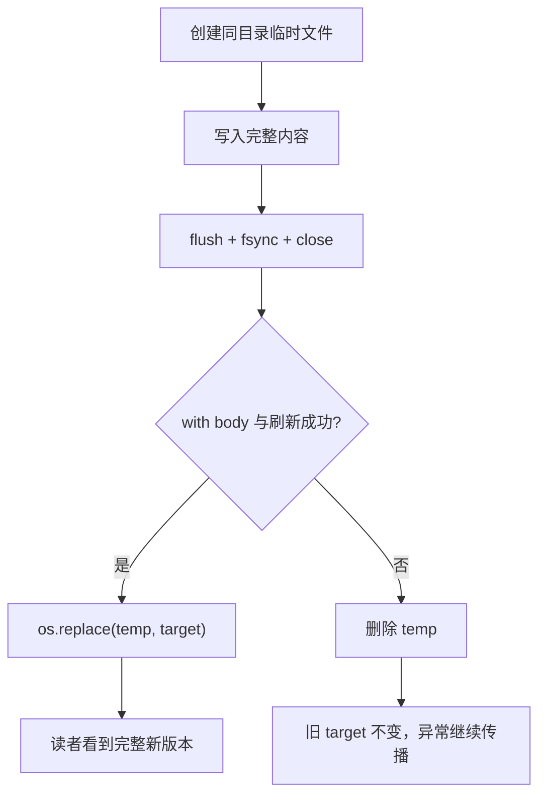

# Python 异常、错误建模、上下文管理器、文件 I/O 与资源安全

> 官方语义基线：Python 3.14.x。示例兼容 Python 3.11+，仅使用标准库，已在 CPython 3.13.4 实际运行验证。

## 1. 为什么后端程序不能只写“成功路径”

后端代码不断跨越不可靠边界：用户输入可能非法，文件可能不存在，磁盘可能写满，JSON 可能只写了一半，数据库连接可能中断。失败不是成功流程之外的偶发事件，而是接口契约的一部分。

如果只在最外层写一个宽泛的 `except`，通常会同时制造三个问题：

- 调用者不知道哪些失败可以恢复；
- 日志丢失真正的底层原因；
- 文件、锁和连接没有按所有控制流释放。

本课用一个原子 JSON 配置存储建立完整模型：底层错误怎样传播，领域边界怎样翻译错误，`with` 怎样保证清理，以及为什么“关闭文件”和“不会留下半个文件”不是同一件事。

它与 Java 异常课的主线相同：正常结果用 `return`，无法履行函数契约时用异常沿调用栈传播，真正能补充语义或恢复的边界才捕获。第一次先掌握 `raise`、窄范围 `except`、保留 cause 和 `with`；fsync、`ExitStack` 与 `ExceptionGroup` 属于更高可靠性场景。

## 2. 本课完成后的能力

你应能解释：

- 语法错误、异常、错误返回值与进程退出状态的边界；
- `BaseException`、`Exception` 与具体异常类型的继承关系；
- 抛出、匹配、栈展开、清理和继续传播的因果链；
- `try / except / else / finally` 各自处理哪个阶段；
- `raise`、重新抛出和 `raise ... from ...` 的区别；
- 如何设计稳定的领域异常，而不泄漏基础设施细节；
- context manager 的 `__enter__` / `__exit__` 协议；
- 文件关闭、flush、fsync、原子替换分别解决什么问题；
- `ExitStack`、异步上下文管理器和 `ExceptionGroup` 何时需要。

## 3. 先区分四种失败表达

### 3.1 SyntaxError：程序尚未正常开始

解析器无法把源码构造成合法语法时会产生 `SyntaxError`。它通常是开发阶段缺陷，不应被业务代码当成“用户输错配置”处理。

### 3.2 Exception：正常执行期间的非正常控制流

例如 `int("x")` 产生 `ValueError`，打开不存在的文件产生 `FileNotFoundError`。异常是对象，携带类型、消息和 traceback；它不是某种特殊返回值。

### 3.3 返回值：预期结果的一部分

“搜索不到元素”若是常态，可以返回 `None`；“配置文件是系统启动必需品但不存在”更适合抛出异常。关键不是机械规则，而是调用契约：调用者是否应把这种结果当作普通分支。

### 3.4 退出状态：进程边界的协议

CLI 成功通常返回 `0`，失败返回非零值。Python 函数里的异常不能直接充当 shell 协议，入口层应将已知领域错误映射为 stderr 消息和退出码。


## 4. 异常继承树决定捕获边界

简化结构如下：

```text
BaseException
├── SystemExit
├── KeyboardInterrupt
├── GeneratorExit
└── Exception
    ├── OSError
    │   └── FileNotFoundError
    ├── ValueError
    │   └── json.JSONDecodeError
    └── ConfigError                 # 本课领域异常
        ├── ConfigNotFoundError
        ├── ConfigFormatError
        └── ConfigWriteError
```

日常可恢复的应用异常继承 `Exception`。`KeyboardInterrupt` 和 `SystemExit` 直接位于 `BaseException` 分支，宽泛的 `except Exception` 不会拦截它们，这通常正是期望行为。

不要把自定义业务异常继承自 `BaseException`。也不要习惯性写 `except BaseException`；它会吞掉用户中断与正常退出。资源清理代码有时需要在包括中断在内的所有离开路径执行，本课的底层 context manager 因此用 `except BaseException` **只做清理后立即重新抛出**，而不是把失败当成功。

## 5. 抛出后运行时发生什么

假设 `load_config()` 内部打开文件失败：

1. `Path.open` 创建 `FileNotFoundError` 并抛出；
2. 当前普通语句停止执行；
3. Python 在当前 `try` 的 `except` 子句中按从上到下寻找匹配类型；
4. 找到匹配后执行 handler；
5. handler 用 `raise ConfigNotFoundError(...) from error` 建立新抽象；
6. 新异常沿调用栈继续向上，期间每层 `finally` 和 context manager 清理逻辑都会运行；
7. CLI 捕获 `ConfigError`，向 stderr 输出并返回 `2`；
8. `__main__.py` 用 `SystemExit(2)` 把函数返回值变成进程退出状态。

没有匹配 handler 时，异常持续传播；直到线程顶层仍未处理，解释器才打印 traceback 并以失败状态结束该执行路径。

## 6. except 是类型匹配，不是字符串匹配

```python
try:
    value = int(raw)
except ValueError as error:
    ...
```

`except ValueError` 也匹配它的子类。多个 handler 必须从具体到宽泛：

```python
try:
    ...
except FileNotFoundError:
    ...
except OSError:
    ...
```

如果反过来，`FileNotFoundError` 会先被 `OSError` 捕获，具体分支永远到不了。

可以用元组表示同一种恢复策略：

```python
except (TimeoutError, ConnectionError) as error:
    ...
```

不要解析异常消息字符串来判断类型；消息面向人且可能变化，类型和结构化属性才是程序接口。

## 7. try、except、else、finally 的职责

```python
try:
    value = parse(raw)
except ParseError:
    recover()
else:
    persist(value)
finally:
    release_observation_handle()
```

- `try`：只包住确实可能产生目标异常的最小区域；
- `except`：处理匹配异常；
- `else`：`try` 正常结束后运行；
- `finally`：无论正常返回、异常、`break` 或 `continue` 都在离开前运行。

`else` 不只是语法装饰。若把 `persist(value)` 放在 `try` 中，持久化产生的同类型异常也可能被误当作解析失败。缩小 `try` 或使用 `else` 能让错误归因准确。

### 7.1 finally 中的危险控制流

不要在 `finally` 中 `return`、`break` 或 `continue`。它可能覆盖原返回值，甚至丢弃正在传播的异常：

```python
def broken() -> int:
    try:
        raise RuntimeError("lost")
    finally:
        return 1
```

`broken()` 返回 `1`，原异常消失。清理逻辑应完成清理，让既有控制流继续。

## 8. raise 的三种重要形态

### 8.1 创建并抛出

```python
raise ConfigFormatError("configuration root must be an object")
```

### 8.2 保留原 traceback 重新抛出

```python
except ConfigError:
    record_metric()
    raise
```

裸 `raise` 重新抛出当前异常。不要写 `raise error` 来代替；后者会改变 traceback 的呈现位置。

### 8.3 翻译并建立显式因果链

```python
except FileNotFoundError as error:
    raise ConfigNotFoundError(f"missing: {path}") from error
```

外层得到稳定的领域类型，调试者仍可通过 `__cause__` 和 traceback 看到原始 `FileNotFoundError`。

`raise NewError(...) from None` 会抑制界面上自动显示的上下文，适用于底层细节对调用者无帮助的公共界面；异常对象的内部上下文并非因此凭空不存在。默认优先保留原因，只有明确的展示需求才抑制。

## 9. `__context__` 与 `__cause__`

在处理异常时又抛出另一个异常，Python 会自动记录 `__context__`。使用 `from error` 会明确设置 `__cause__`，表达“新异常是对旧异常的有意翻译”。

显式 cause 比偶然 context 更清楚：代码审查者能知道这是设计的抽象边界，而不是 handler 自己又出错了。

## 10. 自定义异常是稳定 API

调用者不应知道配置底层恰好用 JSON 和本地文件。定义一组小而稳定的领域异常：

<<< ../../../examples/python/python-errors-context-managers/safe_config/errors.py{python:line-numbers} [errors.py]

基类 `ConfigError` 允许入口层统一处理；子类允许需要恢复的调用者精细区分。异常层级不应复制所有底层库异常，只表达调用者真正能采取不同动作的类别。

常见误区是为每条消息创建一种类型，或反过来全项目只有 `AppError`。合理粒度由恢复策略决定：如果调用者对两种失败永远做同一件事，它们通常不需要两个公共类型。

## 11. 边界翻译，而非层层捕获

理想分层是：

- 文件/JSON 层产生标准库异常；
- 配置存储边界翻译为 `ConfigError` 家族；
- 业务层决定恢复、重试或继续传播；
- CLI/HTTP 边界最后转换成退出码或响应。

每一层都捕获、打印再抛出会产生重复日志。一般由“拥有足够上下文且决定终止”的边界记录一次；中间层若不能恢复或补充抽象，就让异常自然传播。

## 12. EAFP 与 LBYL：检查不能消除竞争

Python 常见 EAFP（先执行，失败再处理）：

```python
try:
    with path.open(encoding="utf-8") as stream:
        ...
except FileNotFoundError:
    ...
```

LBYL（先检查再执行）看似直观：

```python
if path.exists():
    with path.open(encoding="utf-8") as stream:
        ...
```

但 `exists()` 与 `open()` 之间文件仍可能被删除或权限改变，这是 TOCTOU 竞争。预检查可改善界面或验证静态约束，却不能替代对实际操作失败的处理。

EAFP 也不是“用异常代替所有 if”。对空字符串、枚举成员等纯内存且预期频繁的输入验证，直接条件判断通常更清晰。

## 13. context manager 解决的是成对生命周期

资源常有成对动作：打开/关闭、加锁/解锁、开始事务/提交或回滚。任何中间语句都可能异常，手写顺序很容易漏掉释放。

```python
with path.open("r", encoding="utf-8") as stream:
    data = json.load(stream)
```

`with` 的关键保证是：若进入成功，退出协议会在离开 suite 时执行，包括 suite 抛出异常的情况。它不是异步机制，也不自动让任意对象“线程安全”。

## 14. `__enter__` / `__exit__` 的执行协议

概念上：

```python
manager = expression
value = manager.__enter__()
try:
    target = value
    suite
except BaseException as error:
    suppress = manager.__exit__(type(error), error, error.__traceback__)
    if not suppress:
        raise
else:
    manager.__exit__(None, None, None)
```

真实语言语义对特殊方法查找等细节更精确，这段伪代码用于理解因果链。

`as target` 接收 `__enter__` 的返回值，不一定是 manager 自身。`__exit__` 返回真值会抑制 suite 的异常；返回假值或 `None` 则继续传播。除非 context manager 的明确职责就是处理该异常，否则不要抑制，否则失败会悄悄变成成功。

## 15. `@contextmanager`：用生成器表达协议

`contextlib.contextmanager` 把单次 `yield` 前后代码转换为进入/退出协议：

```python
@contextmanager
def managed():
    resource = acquire()
    try:
        yield resource
    finally:
        release(resource)
```

- `yield` 前：进入阶段；
- yield 的值：`as` 目标；
- `with` body：在 yield 暂停期间运行；
- body 正常或异常离开：生成器恢复，执行清理；
- body 的异常会在 yield 点重新抛入生成器。

因此若捕获了该异常，必须重新抛出，除非确实要抑制它。

## 16. 文件对象也是 context manager

文本文件应显式指定编码：

```python
with path.open("r", encoding="utf-8") as stream:
    text = stream.read()
```

不要依赖平台默认编码。`"r"` 读取、`"w"` 截断后写入、`"a"` 追加、`"x"` 要求新建；加 `b` 是字节模式。文本流在字节与 `str` 之间做编码转换，二进制流处理 `bytes`。

文件对象离开 `with` 后关闭。关闭保证 Python 不再持有该流，并尝试刷新用户态缓冲；它不等价于断电后数据必然持久，也不保证读者从未看到半份内容。

## 17. 为什么直接 `open(..., "w")` 有破坏窗口

```python
with path.open("w", encoding="utf-8") as stream:
    json.dump(config, stream)
```

打开 `w` 时旧文件已被截断。若序列化到一半异常、磁盘写满或进程终止，目标可能只剩半个 JSON。`with` 会关闭文件，却忠实地保留这份不完整结果。

所以有两个独立目标：

1. **资源安全**：所有路径都关闭 stream；
2. **状态原子性**：观察者只看到旧版本或完整新版本，不看到应用级半成品。

## 18. 临时文件 + 同文件系统替换

本课采用：

1. 在目标目录创建唯一临时文件；
2. 将完整 JSON 写到临时文件；
3. flush Python 缓冲；
4. `fsync` 请求操作系统刷新该文件数据；
5. 关闭临时文件；
6. 用 `os.replace` 替换目标；
7. 任一步失败则删除临时文件，旧目标保持不变。



同目录非常重要：跨文件系统移动不能依赖相同的原子替换语义。`os.replace` 在成功时替换现有目标；具体原子性和持久性仍受操作系统与文件系统语义约束。

## 19. 原子写入 context manager 完整实现

<<< ../../../examples/python/python-errors-context-managers/safe_config/storage.py{python:line-numbers} [storage.py]

注意几处设计：

- `mkstemp` 安全创建唯一文件，并返回底层 file descriptor；
- `os.fdopen` 把 descriptor 包装成文本流；若包装本身失败，显式关闭 descriptor；
- body 失败时跳过 `os.replace`；
- `except BaseException` 只负责删除临时文件，随后裸 `raise`；
- `missing_ok=True` 让清理能容忍临时文件已不存在；
- `save_config` 只把 `OSError` 翻译成写入领域错误，不会误把编程缺陷全部伪装成磁盘错误。

## 20. `flush`、`fsync`、`close`、`replace` 不可混为一谈

- `flush()`：把 Python 用户态缓冲交给操作系统；
- `os.fsync(fd)`：请求操作系统把该文件的缓冲同步到存储设备；
- `close()`：结束文件描述符生命周期，通常也会 flush；
- `os.replace()`：切换目录项，使目标名称指向新文件。

本示例没有对父目录执行 fsync，因此不能宣称在所有突然断电场景下目录项都已持久化。网络文件系统、特殊挂载、硬件缓存和不同操作系统也可能有额外语义。这里保证的是常见本地文件系统上的失败隔离示范，不是跨平台数据库事务。

若多进程同时写同一目标，“每次写入完整”也不等于“不会丢更新”。原子替换避免部分文件，却不提供并发版本检查或锁。

## 21. 加载路径的错误建模

`load_config` 分三层处理：

1. 文件不存在：`ConfigNotFoundError`；
2. JSON 词法/语法无效：`ConfigFormatError`，并带行列位置；
3. JSON 合法但根不是对象或值不是字符串：同样是领域格式错误。

第三类不会由 JSON parser 自动发现，因为 `[1, 2]` 是合法 JSON，却违反本应用的 `dict[str, str]` 契约。语法有效与领域有效是两个验证阶段。

`_validated_copy` 返回新字典，使调用者得到的对象不与传入 mapping 偶然共享容器身份。类型提示能帮助工具，却不会在运行时自动验证 JSON。

## 22. CLI 是异常到外部协议的边界

<<< ../../../examples/python/python-errors-context-managers/safe_config/cli.py{python:line-numbers} [cli.py]

成功数据写 stdout，错误说明写 stderr。这样用户可以把 stdout 管道给其他程序，同时仍在终端看到错误。

入口文件：

<<< ../../../examples/python/python-errors-context-managers/safe_config/__main__.py{python:line-numbers} [__main__.py]

`main()` 返回整数便于单元测试，只有最外层用 `SystemExit` 转换为进程退出状态。不要在深层业务函数到处调用 `sys.exit()`，否则复用和测试困难。

## 23. 运行完整示例

在示例目录执行：

```bash
cd examples/python/python-errors-context-managers
python3 -m unittest discover -v
```

手动运行成功路径：

```bash
python3 -c 'from pathlib import Path; from safe_config import save_config; save_config(Path("demo.json"), {"model": "gpt", "mode": "study"})'
python3 -m safe_config demo.json
```

预期 stdout：

```text
{"mode": "study", "model": "gpt"}
```

失败路径：

```bash
python3 -m safe_config missing.json
echo $?
```

错误消息进入 stderr，退出状态为 `2`。shell 的 `$?` 只代表紧邻的上一条命令。

## 24. 测试验证的不只是“抛异常”

<<< ../../../examples/python/python-errors-context-managers/tests/test_storage.py{python:line-numbers} [test_storage.py]

测试分别验证：

- 保存/读取的实际数据契约；
- 领域异常类型；
- `__cause__` 是否保留标准库原异常；
- JSON 错误位置是否进入消息；
- 合法 JSON 但错误 shape 是否被拒绝；
- body 中途失败后旧文件内容不变；
- 临时文件是否清理；
- CLI 是否返回非零并写 stderr。

只断言“发生了某种 Exception”过于宽泛，会让错误类型退化而测试仍通过。

## 25. 多个动态资源：`ExitStack`

资源数量在运行时才知道时，静态嵌套多个 `with` 不方便：

```python
from contextlib import ExitStack

with ExitStack() as stack:
    streams = [
        stack.enter_context(path.open(encoding="utf-8"))
        for path in paths
    ]
    consume(streams)
```

`ExitStack` 按注册的反向顺序执行退出回调，类似一叠 LIFO 清理动作。进入第三个资源失败时，前两个已进入资源仍会被清理。

它也能用 `callback()` 登记没有 context-manager 接口的清理函数。不要因为方便就把生命周期不相关的全局资源塞进一个巨大 stack；所有权仍需清晰。

## 26. 锁与事务中的同一模式

锁：

```python
with lock:
    mutate_shared_state()
```

数据库事务通常根据退出原因提交或回滚：正常结束提交，异常离开回滚，然后异常继续传播。具体行为由数据库库的 context manager 契约决定，不能假设所有连接对象行为相同。

这说明 `with` 不只是“自动 close”的语法糖，而是通用的生命周期与退出策略协议。

## 27. 异步 context manager

`async with` 使用 `__aenter__` / `__aexit__`，二者可以等待异步操作，适合异步 HTTP session、连接和锁：

```python
async with client.stream("GET", url) as response:
    ...
```

普通 `with` 的退出方法不能 `await`。`contextlib.asynccontextmanager` 与 `@contextmanager` 思路相同，但装饰 async generator。异步 I/O 会在后续课程系统展开。

## 28. `ExceptionGroup` 与 `except*`

并发任务可能多个同时失败。Python 3.11 引入 `ExceptionGroup`，让多个无关异常作为一个结构传播，`except*` 可按类型选择其中匹配子组：

```python
try:
    run_concurrent_jobs()
except* TimeoutError as group:
    handle_timeouts(group.exceptions)
```

它不是普通异常列表的花哨包装：剩余未匹配异常会继续传播，嵌套结构也会保留。单文件同步配置示例不需要它；等到 `asyncio.TaskGroup` 再深入更有上下文。

## 29. 异常消息与敏感信息

错误消息应包含操作与必要标识，例如目标路径、无效字段或远端服务；但不要写入密码、token、完整请求体和个人数据。

给终端用户的消息与给运维调试的 traceback 不是同一层。生产 HTTP 响应通常返回受控错误码和安全说明，详细 cause 进入受访问控制的日志。

## 30. 重试不是默认异常处理

只有同时满足以下条件才适合自动重试：

- 失败被分类为暂时性；
- 操作幂等，或有幂等键/去重机制；
- 有次数上限、退避和抖动；
- 总超时预算明确；
- 最终失败仍被报告。

格式错误、权限错误通常不会因立刻重试而恢复。盲目重试会放大故障并掩盖根因。

## 31. JavaScript 对照

JavaScript 也有 `throw`、`try/catch/finally` 和 `Error.cause`，但有几个重要差异：

- JavaScript 可以 `throw` 任意值；Python 只能抛出 `BaseException` 实例或子类；
- JavaScript `catch` 没有 Python 这种按异常类声明的多个 handler；
- 现代 JS 有 `using` / `await using` 的显式资源管理，但支持度和对象协议需结合运行环境；Python `with` 是长期稳定的语言协议；
- Promise rejection 必须在异步链上处理，Python coroutine/task 也有对应异步传播边界，但模型不能简单等同。

不要把前端常见的 `catch (error) { console.log(error) }` 原样搬到后端。记录后继续返回成功会让调用方收到错误的协议结果。

## 32. Java 对照

Java 有 checked exception 与 unchecked exception；Python 不在函数签名中强制声明异常。Python 的动态特征不代表异常契约不重要，公共 API 仍应在文档和类型层级中说明可预期领域异常。

Python `with` 类似 Java try-with-resources，但协议不同：Java 依赖 `AutoCloseable.close()`，Python context manager 的退出方法还能看到异常信息并决定是否抑制。

Java 异常链常用 constructor cause；Python 用 `raise ... from ...` 明确建立 cause。

## 33. 常见反模式与修正

### 33.1 吞掉所有异常

```python
try:
    do_work()
except Exception:
    pass
```

修正：只捕获能恢复的具体异常；不能恢复就传播。

### 33.2 捕获后返回伪造默认值

配置损坏后返回 `{}` 可能让服务以错误安全策略启动。只有契约明确允许缺省，且缺省行为安全时才能这样做。

### 33.3 重复打印 traceback

每层 `logger.exception` 再 `raise` 会造成同一失败多次报警。中间层补充 cause，终止边界记录一次。

### 33.4 用异常控制高频普通分支

异常清晰度优先，不必迷信性能；但“缓存未命中”等普通结果应按 API 语义建模，而不是为了 EAFP 口号制造异常。

### 33.5 只关闭文件就声称原子

关闭解决资源生命周期，不解决目标被提前截断。需要临时文件和替换协议。

### 33.6 `finally` 覆盖失败

清理中也可能失败。必须决定保留主异常、组合异常还是让清理异常替代；不要用 `return` 无声丢弃两者。

## 34. 工程检查清单

- 区分预期结果、领域错误、编程缺陷与进程退出；
- 自定义应用异常继承 `Exception`；
- handler 从具体类型排到宽泛类型；
- `try` 范围尽可能小；
- 正常后续逻辑需要与 handler 隔离时使用 `else`；
- `finally` 只清理，不覆盖控制流；
- 翻译错误使用 `raise ... from ...` 保留 cause；
- 无法恢复、无法增加抽象时让异常传播；
- 日志在拥有处置上下文的边界记录一次；
- 文件显式 encoding，文本与 bytes 不混淆；
- 生命周期使用 `with`；
- 区分 close、flush、fsync 与 atomic replace；
- 原子临时文件放在目标同一文件系统；
- 原子替换不等于并发锁或事务隔离；
- 错误输出走 stderr，成功数据走 stdout；
- CLI 用非零退出状态表达失败；
- 测试异常类型、cause、副作用和清理结果；
- 错误消息不泄露秘密；
- 重试只针对明确暂时且安全的操作。

## 35. 本课结论

- 异常是运行时的结构化非正常控制流，不是特殊返回值。
- `Exception` 是应用可恢复错误的通常根；不要无差别捕获 `BaseException`。
- 抛出后 Python 沿栈寻找匹配 handler，并在展开过程中执行 `finally` 与退出协议。
- `else` 隔离成功路径，`finally` 保证清理，但其中的 return 会覆盖既有结果或异常。
- 领域异常给调用者稳定接口；`raise ... from ...` 同时保留底层诊断原因。
- `with` 用 enter/exit 协议表达资源所有权，退出方法只有明确返回真值才会抑制异常。
- 正确关闭文件不保证内容原子；临时文件、刷新、关闭和同文件系统替换共同缩小破坏窗口。
- 原子文件替换仍不是数据库事务，也不自动解决并发丢更新和所有断电持久性问题。
- 入口边界应把领域异常转换成 stderr、退出码或受控 HTTP 响应。

下一节：[Python 类、实例、属性查找、数据类、协议与面向对象建模](/backend/python/classes-instances-attribute-lookup-dataclasses-protocols-and-object-modeling)。

## 36. 参考资料

- [Python Tutorial：Errors and Exceptions](https://docs.python.org/3.14/tutorial/errors.html)
- [Python Reference：The try statement](https://docs.python.org/3.14/reference/compound_stmts.html#the-try-statement)
- [Python Reference：The with statement](https://docs.python.org/3.14/reference/compound_stmts.html#the-with-statement)
- [Python Standard Library：Built-in Exceptions](https://docs.python.org/3.14/library/exceptions.html)
- [Python Standard Library：contextlib](https://docs.python.org/3.14/library/contextlib.html)
- [Python Standard Library：Reading and Writing Files](https://docs.python.org/3.14/tutorial/inputoutput.html#reading-and-writing-files)
- [Python Standard Library：open](https://docs.python.org/3.14/library/functions.html#open)
- [Python Standard Library：os.replace and os.fsync](https://docs.python.org/3.14/library/os.html)
- [Python Standard Library：tempfile](https://docs.python.org/3.14/library/tempfile.html)
- [Python Standard Library：json](https://docs.python.org/3.14/library/json.html)
- [Python Reference：raise statement](https://docs.python.org/3.14/reference/simple_stmts.html#the-raise-statement)
- [PEP 654：Exception Groups and except*](https://peps.python.org/pep-0654/)
