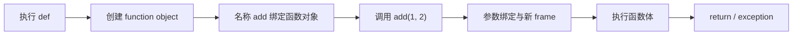
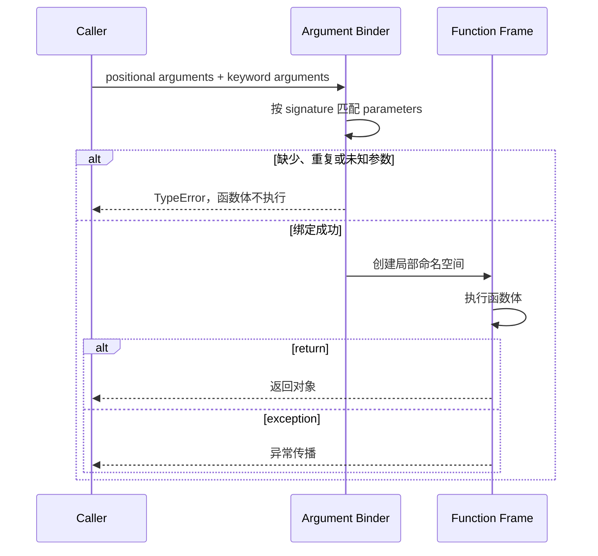
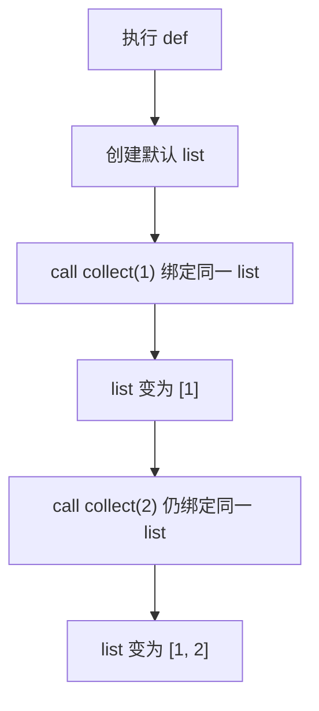
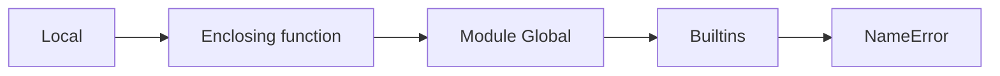
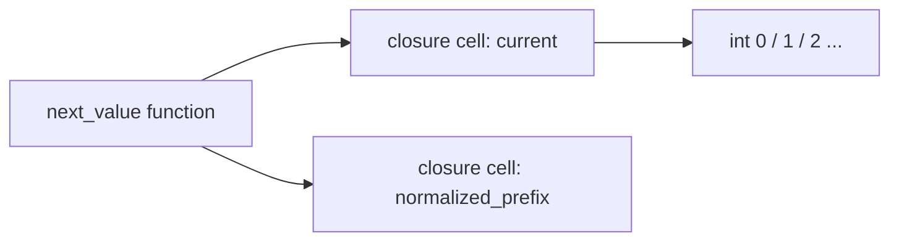
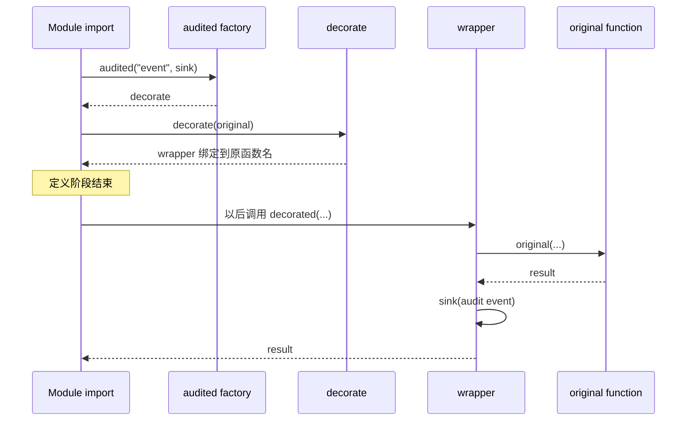

# Python 函数：参数模型、作用域、闭包、装饰器与函数式抽象

> 官方语义基线：Python 3.14.6。示例兼容 Python 3.11+，已在 CPython 3.13.4 验证。Python 3.14 默认延迟求值注解，旧版本边界会单独说明。

## 1. 为什么函数不只是重复代码的工具

后端中的函数同时承担多种契约：

- 接收什么参数，允许怎样调用；
- 在什么作用域读取和写入名称；
- 是否修改外部状态；
- 成功返回什么，失败抛什么；
- 能否作为参数传递或作为结果返回；
- 是否被认证、事务、重试、日志等装饰器包装。

如果只会写 `def name(...):`，很容易遇到：

- 默认 list 在多个请求间共享；
- 参数顺序写错但没有及时暴露；
- 循环创建的回调全部使用最后一个值；
- 局部赋值造成 `UnboundLocalError`；
- 装饰器让框架看不到原函数名称和签名；
- wrapper 吞掉异常却记录“成功”；
- `*args/**kwargs` 把公共 API 变成无法理解的参数袋。

本课从函数对象的创建和调用开始，把这些现象放进同一执行模型。

## 2. 本课目标

完成本课后，应能解释：

- `def` 执行时和函数调用时分别发生什么；
- parameter 与 argument 的区别；
- positional-only、positional-or-keyword、keyword-only 的边界；
- `*args`、`**kwargs` 与调用侧解包；
- 默认参数为何只求值一次；
- return、隐式 None、异常和副作用如何组成函数契约；
- LEGB 名称解析与 `UnboundLocalError`；
- `global`、`nonlocal` 分别改变哪一层绑定；
- closure 保存的是什么；
- 循环晚绑定为什么发生；
- decorator 表达式在什么时候求值、如何替换名称；
- `functools.wraps` 为什么是工程必需；
- lambda、partial、高阶函数的适用边界。

## 3. `def` 是可执行语句

```python
def add(left: int, right: int) -> int:
    return left + right
```

解释器执行到 `def` 时：

1. 创建函数对象；
2. 函数对象关联代码、默认值、注解信息、全局命名空间和闭包等；
3. 把名称 `add` 绑定该函数对象；
4. 不执行函数体。

只有之后调用 `add(1, 2)` 才创建调用 frame 并执行函数体。



## 4. 函数是一等对象

函数可以：

- 绑定给另一个名称；
- 放入 list 或 dict；
- 作为参数传入；
- 从另一个函数返回；
- 拥有属性；
- 被装饰器包装。

```python
operation = add
operations = {"add": add}
result = operations["add"](1, 2)
```

名称不是函数本体。`operation` 与 `add` 可以绑定同一个函数对象。

## 5. Parameter 与 Argument

**parameter 形参** 出现在函数定义中：

```python
def greet(name):
    ...
```

`name` 是 parameter。

**argument 实参** 出现在调用中：

```python
greet("小明")
```

字符串对象是 argument。调用阶段把 argument 按签名规则绑定到 parameter 名称。

中文资料常都称“参数”，阅读错误信息时应分清定义侧与调用侧。

## 6. 一次函数调用发生什么



参数错误发生在进入函数体之前，因此函数内部日志可能完全看不到这类失败。

## 7. 三类显式参数

完整形状：

```python
def function(positional_only, /, positional_or_keyword, *, keyword_only):
    ...
```

### 7.1 Positional-only

`/` 之前只能按位置传入：

```python
def parse(value, /):
    ...

parse("42")       # 正确
parse(value="42") # TypeError
```

适用场景：

- 参数名不属于公共 API；
- 参数位置具有自然语义；
- 未来希望改内部参数名而不破坏调用者；
- 需要允许 `**kwargs` 中出现同名 key。

### 7.2 Positional-or-keyword

没有 `/` 或 `*` 限制的普通 parameter 可按位置或关键字传：

```python
def greet(name): ...
greet("小明")
greet(name="小明")
```

### 7.3 Keyword-only

`*` 之后必须写参数名：

```python
def connect(host, *, timeout, tls=True):
    ...

connect("db", timeout=3, tls=True)
```

布尔开关、多个同类型数字和单位相关参数特别适合 keyword-only：

```python
calculate_total(1_000, 2, discount_basis_points=1_500)
```

调用点能直接看出 1_500 的含义。

## 8. 本课的精确签名契约

<<< ../../../examples/python/python-functions-scope-decorators/function_patterns/pricing.py{python:line-numbers} [pricing.py]

```python
def calculate_total(unit_price_cents, quantity, /, *, discount_basis_points=0):
```

这意味着：

- 价格与数量必须按位置；
- 折扣只能按名称；
- 折扣有默认值；
- 第三个位置参数会被拒绝；
- `unit_price_cents=` 关键字也会被拒绝。

签名本身承担输入 API 的一部分校验，减少函数体里的手工分支。

## 9. 参数不能重复绑定

```python
def greet(name): ...
greet("小明", name="小红")
```

同一 parameter 同时收到位置和关键字 argument，调用阶段抛 `TypeError: got multiple values`。

未知关键字、缺少必需参数、位置参数过多同样在 binder 阶段失败。

## 10. `*args` 收集额外位置参数

```python
def join_messages(prefix: str, *messages: str) -> str:
    return prefix + ": " + ", ".join(messages)
```

`messages` 在函数体内是 tuple。没有额外参数时是空 tuple。

`*args` 不是特殊固定名称，星号才决定语义；但遵循 args 约定便于阅读。

### 10.1 `*args` 后的参数自动 keyword-only

```python
def write(*values: str, separator: str = ","):
    ...
```

separator 必须按关键字传，否则会被收进 values。

### 10.2 不要滥用

如果函数实际只接受 2 或 3 个有明确业务意义的值，应写出名称。`*args` 会隐藏数量和语义，降低静态检查和自动文档质量。

## 11. `**kwargs` 收集额外关键字参数

```python
def configure(**options: object):
    ...
```

`options` 是 dict，保留调用时关键字顺序。

适合：

- 透明转发 wrapper；
- 兼容层；
- 真正开放的配置扩展点。

不适合用来绕开明确 API。若函数只支持 timeout 与 retries，应把它们写在 signature 中，让拼写错误立即失败。

## 12. 调用侧 `*` 与 `**` 是解包

```python
positionals = [1_000, 2]
options = {"discount_basis_points": 1_500}
calculate_total(*positionals, **options)
```

调用侧：

- `*iterable` 展开位置 arguments；
- `**mapping` 展开字符串 key 的 keyword arguments。

定义侧收集与调用侧展开方向相反，但都使用星号语法。

多个来源出现同名 keyword 仍会抛重复参数错误，不会自动以后者覆盖。

## 13. 默认参数在定义时求值一次

```python
def collect(value, values=[]):
    values.append(value)
    return values
```

定义执行时创建一次 list，并保存在函数对象的 defaults 中。每次省略 values 都绑定同一个 list。



修复：

```python
def collect(value, values=None):
    actual = [] if values is None else values
    actual.append(value)
    return actual
```

### 13.1 默认值捕获定义时的对象

```python
limit = 10

def allowed(value, maximum=limit):
    return value <= maximum

limit = 20
allowed(15)  # False
```

maximum 默认值仍是定义时绑定的 10。

## 14. 默认值只应用于“未提供”

调用者显式传 None 时，Python不会自动改用默认值：

```python
def connect(timeout=3): ...
connect(timeout=None)  # timeout 确实是 None
```

若 None 有特殊含义，函数体必须明确处理。默认参数和业务缺失值是两个层级。

## 15. Return、隐式 None 与多返回值

`return expression` 先求值 expression，再结束当前调用并把对象返回调用者。

没有执行 return 的函数仍返回 None：

```python
def log_message(message):
    print(message)
```

所谓“返回多个值”：

```python
return total, discount
```

实际创建并返回 tuple，调用侧可解包。

公共 API 若返回字段较多，使用 dataclass、NamedTuple 或明确对象通常比位置 tuple 更易演进。

## 16. 纯计算与副作用

**纯函数**在同样输入下返回同样输出，且不修改外部可观察状态。

副作用包括：

- 写数据库、文件和网络；
- 打印与日志；
- 修改传入 list；
- 更新全局变量或闭包状态；
- 读取当前时间与随机数。

副作用不是错误，后端没有副作用就无法持久化数据。关键是把它放在清晰边界，并通过参数注入时间、存储或 sink，使核心规则可测试。

## 17. 函数调用创建新的局部作用域

每次普通函数调用都会创建新的局部命名空间/frame。递归调用同一函数也有独立局部名称。

参数首先绑定到这个局部空间，函数体内赋值默认也绑定局部名称。

函数执行结束后，frame 通常可释放；但 closure、traceback 或 generator 可能继续引用其中状态。

## 18. LEGB 名称解析

常用心智模型：

1. Local：当前函数局部；
2. Enclosing：外层函数局部；
3. Global：当前模块；
4. Builtins：内置名称。



这是一种实用概括；类体、注解作用域和 exec 等存在更细规则，不能把四个字母当完整语言规范。

## 19. 为什么会出现 UnboundLocalError

```python
count = 10

def increment():
    print(count)
    count += 1
```

编译函数体时发现 count 有赋值，因此整个函数块中 count 被判定为局部名称。`print(count)` 读取局部绑定，但赋值尚未发生，抛 `UnboundLocalError`。

它不是按执行顺序先读 global、之后才变 local。名称绑定范围在代码块层面确定。

## 20. `global` 修改模块级绑定

```python
count = 0

def increment():
    global count
    count += 1
```

global 声明让当前函数对 count 的绑定操作指向模块全局。

它不创建跨模块宇宙级变量，也不提供线程安全。全局可变状态会造成：

- 测试相互影响；
- 并发竞争；
- 初始化顺序依赖；
- 隐藏输入输出。

优先通过对象、参数、返回值或依赖注入表达状态。

## 21. `nonlocal` 修改最近外层函数绑定

完整闭包：

<<< ../../../examples/python/python-functions-scope-decorators/function_patterns/closures.py{python:line-numbers} [closures.py]

`make_sequence` 调用时创建 `current = 0`，返回 `next_value`。外层调用已经结束，但内层函数仍保留对 current 所在 closure cell 的引用。



`nonlocal current` 表示赋值目标是最近外层函数作用域中已有的 current，而不是创建内层局部。

每次调用 `make_sequence` 都创建新 closure cells，因此两个序列独立计数。

## 22. Closure 捕获绑定而不是冻结值快照

闭包自由变量在调用内层函数时解析对应 cell 的当前内容。

循环晚绑定陷阱：

```python
functions = []
for factor in [2, 3, 4]:
    functions.append(lambda value: factor * value)
```

三个 lambda 都引用同一个 factor 绑定；循环结束后 factor 是 4，因此调用结果都乘 4。

### 22.1 正确建立独立绑定

本课使用函数工厂：

```python
def multiplier_for(factor):
    def multiply(value):
        return factor * value
    return multiply
```

每次工厂调用产生独立 factor cell，语义清楚。

也可用默认参数 `lambda value, factor=factor: ...` 捕获定义时对象，但这会让内部实现参数出现在签名中，函数工厂往往更易解释。

## 23. Closure 的适用与边界

适合：

- 小型配置化函数；
- 回调工厂；
- 装饰器；
- 封装少量私有状态；
- 注入依赖而不创建类。

不适合：

- 状态很多且生命周期复杂；
- 需要序列化或显式检查状态；
- 多方法共享不变量；
- 并发修改需要同步；
- 团队难以理解隐式捕获。

复杂状态通常用类或明确服务对象更合适。

## 24. Lambda 是单表达式函数

```python
key_function = lambda user: user["created_at"]
```

lambda 创建函数对象，但函数体只能是一个 expression。它适合短小、就地、含义明显的 key/callback。

需要注解、docstring、多步校验、异常处理或复用时使用 def。lambda 不是更函数式或更高性能的保证。

## 25. 高阶函数

高阶函数接收函数或返回函数：

```python
def apply(operation, value):
    return operation(value)
```

`sorted(..., key=...)`、`map`、`filter`、装饰器与 closure 工厂都是高阶函数应用。

Python 中 list comprehension 往往比 map/filter + lambda 更可读，但命名函数特别适合复用复杂规则。

## 26. Decorator 的本质是函数替换

```python
@decorator
def operation():
    ...
```

大致等价：

```python
def operation():
    ...

operation = decorator(operation)
```

decorator 接收原函数并返回 callable，名称 operation 最终绑定返回值。

### 26.1 发生时间

decorator expression 在函数定义执行时求值，不是每次调用时才创建 wrapper。

wrapper 函数体则在调用被装饰函数时执行。

## 27. 参数化装饰器有三层函数

本课：

<<< ../../../examples/python/python-functions-scope-decorators/function_patterns/decorators.py{python:line-numbers} [decorators.py]

执行结构：

```text
audited(event_name, sink)  → 返回 decorate
decorate(function)         → 返回 wrapper
wrapper(*args, **kwargs)   → 调用原函数并记录事件
```



## 28. 为什么必须使用 functools.wraps

没有 wraps，装饰后：

- `__name__` 变成 wrapper；
- `__doc__` 丢失；
- 注解和其他元数据难以检查；
- `__wrapped__` 不可用；
- FastAPI、测试工具、inspect 和文档生成可能理解错误。

`@wraps(function)` 把重要元数据更新到 wrapper，并设置 `__wrapped__`。

它不会自动让运行时 wrapper 真实签名变成原签名；但 inspect 通常会沿 `__wrapped__` 查看原函数，静态 typing 仍需 ParamSpec 等表达。

## 29. ParamSpec 与 TypeVar 为什么出现

装饰器若写成：

```python
Callable[..., object]
```

类型检查器会丢失原函数参数与返回类型。

本课使用：

- `ParamSpec P`：捕获参数列表；
- `TypeVar R`：捕获返回类型；
- wrapper 的 `*args: P.args` / `**kwargs: P.kwargs`；
- 返回 `Callable[P, R]`。

这样类型层表达“装饰前后调用签名类型相同”。运行时仍由 Python binder 和实际 wrapper 执行。

## 30. 装饰器的异常语义必须明确

本课只在原函数成功返回后写审计事件：

```python
result = function(*args, **kwargs)
sink(...)
return result
```

若原函数抛异常，sink 不执行，因此事件名是 `operation.succeeded` 时语义正确。

如果要审计所有尝试，需要 try/except/finally 并分别记录成功和失败。不能在 finally 中无条件写“成功”。

装饰器还必须决定：

- sink 失败是否让业务失败；
- 是否记录敏感参数；
- 同步 I/O 是否拖慢请求；
- 重试装饰器与事务装饰器的顺序；
- 异步函数是否需要 async wrapper。

## 31. 多个装饰器的应用顺序

```python
@outer
@inner
def operation():
    ...
```

等价于：

```python
operation = outer(inner(operation))
```

调用时通常先进入 outer wrapper，再进入 inner wrapper。

顺序会改变事务、授权、缓存、重试和指标语义。例如缓存放在授权外层可能让未经授权请求命中不该访问的结果。必须根据因果链选择，而不是按美观排列。

## 32. Decorator 不等于 Java Annotation

Java 注解本身主要是元数据，需要编译器、框架、代理或反射解释。Python decorator 在定义阶段直接调用 callable，并把返回对象重新绑定到名称。

Spring `@Transactional` 的使用外观像 Python decorator，但其运行机制通常依赖 Spring AOP 代理；Python decorator wrapper 就是实际绑定的 callable 链。

## 33. functools.partial

partial 可预先绑定部分 arguments：

```python
from functools import partial

ten_percent_total = partial(calculate_total, discount_basis_points=1_000)
```

它适合把通用函数适配成更具体 callback。若需要额外校验、清晰名称、docstring 或业务概念，显式 def 往往更好。

partial 绑定对象引用，不会深拷贝可变 argument。

## 34. 函数注解的版本边界

注解是元数据，默认不改变调用语义。Python 3.14 默认延迟求值注解；Python 3.11–3.13 可使用：

```python
from __future__ import annotations
```

使注解不在定义阶段急切解析为普通对象。这有助于前向引用，也意味着直接依赖 `__annotations__` 具体内容的旧代码需使用 `typing.get_type_hints` 等合适 API并注意执行任意注解代码的安全边界。

框架可能主动读取注解并实施运行时行为，但那是框架能力，不是注解自身自动校验。

## 35. Callable 类型与真实能力

```python
from collections.abc import Callable

operation: Callable[[int], str]
```

表达可用一个 int 调用并返回 str。类实例实现 `__call__` 后也可以是 callable，不限普通函数。

`callable(value)` 只能判断对象看起来可调用，不能证明特定参数组合一定成功。签名检查与实际调用仍可能失败。

## 36. 完整组合示例

<<< ../../../examples/python/python-functions-scope-decorators/function_patterns/report.py{python:line-numbers} [report.py]

该示例组合：

- 精确参数签名的价格函数；
- 保存独立序列状态的 closure；
- 避免循环晚绑定的函数工厂；
- 参数化 audit decorator；
- wraps 保留的名称和 docstring；
- list.append 作为注入的 AuditSink callable。

这展示了函数作为值在各层之间传递，但没有为了函数式风格消除清晰的业务名称。

## 37. 完整测试

<<< ../../../examples/python/python-functions-scope-decorators/tests/test_functions.py{python:line-numbers} [test_functions.py]

测试覆盖：

- `/` 与 `*` 确实拒绝错误调用方式；
- 每个 closure 工厂调用拥有独立状态；
- 2/3/4 倍回调没有都绑定为 4；
- decorator 成功记录并保留元数据；
- 原函数失败时不会记录成功事件；
- 可变默认 list 在第二次调用中保留第一次值。

最后一个测试故意定义错误函数作为行为证据，不代表推荐工程写法。

## 38. 运行示例

```bash
cd examples/python/python-functions-scope-decorators
python3 -m venv .venv
source .venv/bin/activate
python -m unittest discover -v
python -m function_patterns
python -m compileall -q function_patterns
```

项目只使用标准库。

## 39. API 设计建议

### 39.1 参数数量

参数过多通常说明：

- 函数承担多个职责；
- 多个值属于同一领域对象；
- 配置应封装；
- 依赖应由服务对象持有。

不要仅用 `**kwargs` 隐藏复杂度。

### 39.2 布尔参数

```python
process(data, True, False)
```

调用点无法理解含义。至少使用 keyword-only：

```python
process(data, validate=True, persist=False)
```

若不同模式改变整个控制流，拆分两个命名函数或使用 enum 更清楚。

### 39.3 单位进入名称

`timeout_seconds`、`price_cents`、`discount_basis_points` 比 `timeout`、`price`、`discount` 更少歧义。类型都是 int 时，签名名称尤其重要。

## 40. 测试函数副作用

核心策略：把外部能力作为 callable 或对象参数注入：

```python
def publish(event, send):
    send(event)
```

测试传入 list.append 或 fake；生产传入消息客户端 adapter。

但过度注入每个简单内置函数会增加噪声。注入时间、随机数、网络、持久化和不可控副作用，纯计算直接调用即可。

## 41. 递归的边界

每次递归创建新 frame。Python 有递归深度限制，且不保证尾调用优化。深树或不可信深度输入可能导致 `RecursionError`。

递归适合天然递归且深度可控的结构；大规模线性处理通常用迭代器和显式 stack 更可靠。

不要通过随意提高递归限制处理算法错误，这可能转化为 C stack 风险。

## 42. 与 JavaScript 对比

| Python | JavaScript | 关键区别 |
| --- | --- | --- |
| def 创建 function object | function/arrow | 都是一等函数 |
| positional + keyword arguments | 主要按位置 + object options | JS没有同等内建 keyword binder |
| `/` 与 `*` 签名边界 | 无直接对应 | Python可在函数签名强制调用形式 |
| `*args` tuple | rest parameter Array | 容器类型与语法位置不同 |
| `**kwargs` dict | options object / rest properties | Python由调用 binder 处理关键字 |
| closure | closure | 都有晚绑定类陷阱，但作用域规则不同 |
| decorator | 新/旧 decorator 提案语义不同 | 不应按语法外观假设完全一致 |
| None | undefined return | Python无 return 时返回 None |

JavaScript 常用 options object 模拟关键字参数；Python已有 keyword-only，应优先用签名表达固定选项。

## 43. 与 Java 对比

| Python | Java | 关键区别 |
| --- | --- | --- |
| 默认参数 | 方法重载/构建器 | Java无同类默认参数语法 |
| keyword argument | 无 | Java调用主要按位置 |
| 一等函数 | functional interface/lambda | Java函数值需目标接口类型 |
| closure nonlocal | 捕获 effectively final 局部 | Python可用 nonlocal 重绑外层状态 |
| decorator wrapper | annotation + proxy/AOP近似 | Python定义阶段直接替换绑定 |
| 动态参数绑定 | 编译期重载解析 | Python多数调用错误在运行时出现 |

Python没有 Java 方法重载的常规签名分派。后定义的同名函数会重新绑定名称，而不是保留多个 overload 实现。

## 44. 常见故障排查

### 44.1 多次调用累积旧数据

检查默认参数是否是 list/dict/set 或可变实例。默认值定义一次；改用 None sentinel 并在调用内创建。

### 44.2 UnboundLocalError

检查函数块中是否存在对该名称的任何赋值、增强赋值、import 或异常目标绑定。决定是局部新值、nonlocal，还是应通过参数返回。

### 44.3 循环回调都使用最后一个值

检查 closure 是否共享同一循环变量 cell。通过函数工厂建立独立绑定，不要靠调用时侥幸。

### 44.4 装饰后框架参数解析错误

检查是否使用 wraps、是否保留 `__wrapped__`、typing 是否用 ParamSpec、wrapper 是否同步/异步类型匹配。

### 44.5 Decorator 顺序改变行为

把 `@a @b` 展开成 `a(b(function))`，分别画出定义阶段和调用阶段顺序，再判断事务、缓存、授权或重试应在哪层。

### 44.6 Mock 没有记录调用

检查依赖是否在定义/装饰阶段已经捕获旧 callable。patch 发生得太晚时，closure 仍引用原对象。优先显式依赖注入。

## 45. 工程检查清单

- 用 signature 表达调用契约；
- 参数名不应公开时使用 positional-only；
- 布尔、单位和多个同类型选项使用 keyword-only；
- 不用 `*args/**kwargs` 隐藏固定 API；
- 不使用可变默认参数；
- 区分未提供与显式 None；
- 核心函数优先返回值而不是只 print；
- 副作用放在边界并可注入；
- 理解赋值使名称成为局部的块级规则；
- 避免可变 global；
- nonlocal 状态保持小而清楚；
- 循环创建 closure 时处理晚绑定；
- decorator 使用 wraps；
- decorator 明确成功、失败和异常语义；
- 多 decorator 展开检查顺序；
- async 函数使用 async-aware wrapper；
- 类型装饰器保留 ParamSpec 与返回类型；
- 测试错误调用、默认值共享和元数据。

## 46. 本课结论

- def 是可执行语句，执行时创建函数对象并绑定名称，调用时才执行函数体。
- 调用先按 signature 绑定 arguments，绑定失败时函数体不会运行。
- `/`、普通参数与 `*` 分别表达 positional-only、混合和 keyword-only。
- `*args` 收集 tuple，`**kwargs` 收集 dict；调用侧星号执行解包。
- 默认值在定义时求值一次，可变默认值会跨调用共享。
- 函数每次调用创建局部 frame，名称通常按 Local、Enclosing、Global、Builtins 查找。
- global 指向模块绑定，nonlocal 指向最近外层函数绑定。
- closure 保留对外层 cells 的引用，不是自动冻结每个值。
- 循环晚绑定来自多个函数共享同一名称绑定，函数工厂可建立独立 cell。
- decorator 在定义阶段包装并替换函数名称，参数化 decorator 通常有三层 callable。
- wraps 保留元数据，ParamSpec/TypeVar 保留类型层调用契约。
- 高阶函数和 closure 是工具；清晰的输入、输出和副作用边界比追求函数式形式更重要。

下一节：[Python 模块、包、导入系统、pyproject 与依赖管理](/backend/python/modules-packages-import-system-pyproject-and-dependency-management)。

## 47. 参考资料

- [Python Tutorial：Defining Functions](https://docs.python.org/3.14/tutorial/controlflow.html#defining-functions)
- [Python Tutorial：Default Argument Values](https://docs.python.org/3.14/tutorial/controlflow.html#default-argument-values)
- [Python Tutorial：Keyword Arguments](https://docs.python.org/3.14/tutorial/controlflow.html#keyword-arguments)
- [Python Tutorial：Special Parameters](https://docs.python.org/3.14/tutorial/controlflow.html#special-parameters)
- [Python Tutorial：Unpacking Argument Lists](https://docs.python.org/3.14/tutorial/controlflow.html#unpacking-argument-lists)
- [Python Execution Model：Naming and Binding](https://docs.python.org/3.14/reference/executionmodel.html#naming-and-binding)
- [Python Execution Model：Resolution of Names](https://docs.python.org/3.14/reference/executionmodel.html#resolution-of-names)
- [Python Compound Statements：Function Definitions](https://docs.python.org/3.14/reference/compound_stmts.html#function-definitions)
- [Python Expressions：Lambda](https://docs.python.org/3.14/reference/expressions.html#lambdas)
- [Python：functools](https://docs.python.org/3.14/library/functools.html)
- [Python：typing ParamSpec](https://docs.python.org/3.14/library/typing.html#typing.ParamSpec)
