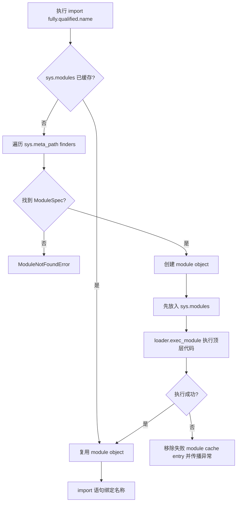
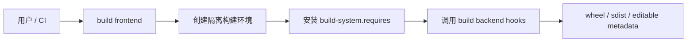

# Python 模块、包、导入系统、pyproject 与依赖管理

> 官方语义基线：Python 3.14.6。示例兼容 Python 3.11+，已在 CPython 3.13.4 验证。构建示例采用 setuptools backend；包管理工具本身会持续演进，命令以对应官方文档为准。

## 1. 为什么“本机能 import”远远不够

把几个 `.py` 文件放在同一目录后，程序可能运行正常；换到测试目录、安装后的 wheel、容器或 IDE 中却出现：

- `ModuleNotFoundError`；
- 误导入同名本地文件；
- JSON 模板找不到；
- 循环导入只得到部分初始化模块；
- 编辑源码后 console script 仍使用旧元数据；
- `pip install` 成功但当前 Python 看不到；
- 部署安装了不同的传递依赖版本。

根因往往不是 import 拼写，而是混淆了：

- import package；
- distribution package；
- module search path；
- 当前工作目录；
- 安装环境；
- 构建产物；
- 依赖声明与依赖锁定。

本课建立从源码到可安装分发包的完整模型。

## 2. 本课目标

完成本课后，应能解释：

- module、regular package、namespace package 与 distribution 的区别；
- import 为什么同时包含搜索/加载和名称绑定；
- `sys.modules`、finder、ModuleSpec、loader 如何协作；
- 模块顶层代码何时执行；
- `sys.path` 如何形成，以及当前目录为什么会造成偶然成功；
- absolute import 与 relative import 的边界；
- `__init__.py`、`__all__`、`__main__.py` 分别负责什么；
- `src` layout 为什么迫使开发环境正确安装包；
- `pyproject.toml` 中 build-system、project、scripts、package-data 的职责；
- build frontend、build backend、sdist、wheel、editable install 的区别；
- 直接依赖、传递依赖、版本范围与 lock 的边界；
- 包资源为什么应使用 `importlib.resources`；
- 如何诊断导入错位、循环导入和依赖漂移。

## 3. Module 是独立命名空间与执行单元

一个 Python module 是具有独立全局命名空间的可加载执行单元。常见来源：

- `.py` 源文件；
- 扩展模块 `.so` / `.pyd`；
- 内置或 frozen module；
- package；
- zip 中的可导入内容；
- 自定义 import hook 提供的来源。

module 不只是文件。加载后它是 module object，名称存放在 `module.__dict__`。

## 4. Regular package

通常具有 `__init__.py` 的目录：

```text
learning_config/
├── __init__.py
├── service.py
└── plugins/
    ├── __init__.py
    └── uppercase.py
```

package 本身也是 module，但具有 `__path__`，允许 import machinery 在其中继续寻找 submodule。

导入 `learning_config.service` 时，Python 先加载父 package，再加载子 module。

## 5. Namespace package

namespace package 可由多个目录贡献同一个逻辑 package，通常没有普通 `__init__.py`。它适合大型分发拆分和插件命名空间，但搜索、打包与工具兼容性更复杂。

初学项目若不需要跨 distribution 合并 package，使用显式 `__init__.py` 的 regular package 更清楚。不要把漏写 `__init__.py` 后偶然可导入当作有意 namespace 设计。

## 6. Import package 与 Distribution package

这是 Python 包管理最重要的边界之一。

**Import package** 是代码中的导入名称：

```python
import learning_config
```

**Distribution package** 是 pip 和包索引管理的安装单位：

```text
learning-backend-config 0.1.0
```

两者名称可以不同。一个 distribution 可以提供多个 import package；import package 也可能由 namespace 中多个 distribution 共同贡献。

因此：

```bash
python -m pip install some-name
```

并不保证 `import some_name` 是正确拼写，必须查看该 distribution 文档。

## 7. Import 语句执行两类操作

```python
import learning_config.service
```

概念上包括：

1. 查找并加载 module；
2. 在当前作用域绑定名称。

```python
from learning_config import build_config
```

会把 `build_config` 绑定到当前命名空间。它没有复制函数代码；名称绑定原对象。

## 8. Import 的完整因果链



## 9. 为什么先检查 `sys.modules`

`sys.modules` 是从全限定 module name 到 module object 的映射。

```python
import sys
import learning_config.service

sys.modules["learning_config.service"]
```

同一进程内普通重复 import 通常返回同一对象，不重新执行顶层代码。

这带来：

- 性能缓存；
- module-level singleton 状态共享；
- import side effect 通常只发生一次；
- 测试之间可能共享模块状态。

删除 `sys.modules` entry 不保证旧 module object 销毁，其他地方可能仍持有引用。随意操作缓存会产生两个同名不同身份的 module，不是可靠热更新方案。

## 10. Finder、ModuleSpec 与 Loader

如果 cache 未命中：

- finder 判断能否找到全限定名称；
- 找到后返回 `ModuleSpec`；
- spec 描述名称、loader、origin、subpackage 搜索位置等；
- loader 创建或接受 module object，并执行 module 初始化代码。

默认 `sys.meta_path` 通常包含处理 built-in、frozen 和 path-based import 的 finder。

业务开发通常不需要实现 import hook，但理解 finder/loader 能避免把 import 简化成“拼接文件路径”。

## 11. 为什么 module 要在执行前放入 cache

加载器执行顶层代码前，import machinery 先把 module object 放入 `sys.modules`。这样 module 间接 import 自己时不会无限创建新对象。

代价是：循环 import 可能观察到**部分初始化 module**。

```text
a 开始初始化 → import b
b 开始初始化 → import a
b 得到 cache 中尚未执行完的 a
b 访问 a 后面才定义的名称 → AttributeError / ImportError
```

## 12. Module 顶层代码会在首次加载时执行

顶层不仅包括赋值，还包括：

- 函数与类定义语句；
- 装饰器求值；
- 文件读取；
- 网络连接；
- 线程启动；
- 日志配置；
- 注册插件。

顶层重副作用会导致 import：

- 变慢；
- 依赖环境顺序；
- 测试难隔离；
- 循环导入更严重；
- CLI 仅查看 `--help` 也可能连接数据库。

推荐顶层以定义、常量和轻量注册为主，把 I/O 放进显式函数和应用启动流程。

## 13. `sys.path` 从哪里来

path-based finder 搜索 `sys.path`。它通常综合：

- 输入脚本目录，或交互/`-m` 情况下的当前目录；
- `PYTHONPATH`；
- 标准库路径；
- 当前环境的 site-packages；
- `.pth` 与 site 配置；
- 实现和启动参数产生的路径。

可观察：

```python
import sys
for entry in sys.path:
    print(entry)
```

不要把某台机器具体顺序写成所有环境的契约。

## 14. 当前目录为何可能遮蔽标准库或第三方包

若项目中创建：

```text
json.py
typing.py
fastapi.py
```

并且项目目录排在搜索路径前面，`import json` 可能导入本地文件而非标准库。

症状常是“partially initialized module”“没有某属性”或循环导入。

诊断：

```python
import json
print(json.__file__)
print(json.__spec__)
```

命名模块时避开标准库与重要依赖名称。

## 15. 不要在业务代码中修改 `sys.path`

```python
sys.path.append("../src")
```

它把项目结构问题转成启动目录依赖：

- IDE 与命令行路径不同；
- 测试与生产路径不同；
- relative path 随 cwd 改变；
- 可能意外导入错误版本。

正确做法是安装项目、使用 `python -m`、配置测试工具或由运行环境设置明确路径。源码模式中的 `PYTHONPATH` 只适合作为明确诊断/受控运行方式，不应成为分发方案。

## 16. Absolute import

```python
from learning_config.service import build_config
```

从顶层 package 名称开始，清晰且不依赖当前 module 层级。跨 package 边界通常使用 absolute import。

## 17. Explicit relative import

包内部：

```python
from .service import build_config
from .plugins import uppercase
```

一个点表示当前 package，两个点表示父 package。relative import 基于当前 module 的 package 上下文，不基于文件系统字符串路径。

过深的 `....` 表明 package 层级可能过于耦合。跨顶层 package 不应用 relative import。

## 18. 为什么直接运行包内文件会失败

```bash
python src/learning_config/cli.py
```

cli.py 作为顶层 `__main__` 执行时，可能没有正确 package 上下文，`from .service` 无法解析。

安装后使用：

```bash
python -m learning_config
```

或 console script。`-m` 让 import machinery 建立正确 module/package 身份。

## 19. `__init__.py` 负责什么

本课：

<<< ../../../examples/python/python-modules-packaging/src/learning_config/__init__.py{python:line-numbers} [__init__.py]

它可以：

- 标记 regular package；
- 执行轻量初始化；
- 重导出稳定公共 API；
- 提供版本访问；
- 定义 `__all__`。

不要把所有子模块都急切导入到 `__init__`，否则 import package 会加载整个应用、扩大循环依赖和启动成本。

## 20. `__all__` 的准确边界

`__all__` 主要控制：

```python
from learning_config import *
```

导出哪些名称，并向读者/工具表达公共表面。它不是安全访问控制，用户仍可显式导入内部名称。

生产代码一般避免 wildcard import：来源不清、名称冲突、静态分析困难。`__all__` 仍可用于文档化 public API。

## 21. `__main__.py` 与模块入口

<<< ../../../examples/python/python-modules-packaging/src/learning_config/__main__.py{python:line-numbers} [__main__.py]

安装 package 后：

```bash
python -m learning_config
```

import machinery 找到 package 并执行其 `__main__.py`。入口只负责调用 CLI main 并把返回值转换为进程状态。

## 22. Flat layout 与 src layout

Flat layout：

```text
project/
├── learning_config/
└── pyproject.toml
```

从项目根运行时，根目录天然在 `sys.path`，即使包从未安装也可能 import 成功。

Src layout：

```text
project/
├── pyproject.toml
├── src/
│   └── learning_config/
└── tests/
```

项目根没有顶层 learning_config，迫使开发者安装项目或明确配置源码路径。这能更早发现：

- package discovery 配置错误；
- package data 未包含；
- 分发产物缺文件；
- 测试意外读取仓库文件而非安装文件。

代价是开发前多一步 editable install。

## 23. 本课项目结构

```text
python-modules-packaging/
├── pyproject.toml
├── src/
│   └── learning_config/
│       ├── __init__.py
│       ├── __main__.py
│       ├── cli.py
│       ├── defaults.json
│       ├── plugin_loader.py
│       ├── service.py
│       └── plugins/
│           ├── __init__.py
│           └── uppercase.py
└── tests/
    └── test_package.py
```

测试不放进 import package，避免把测试代码作为运行分发内容发现。

## 24. `pyproject.toml` 是什么

<<< ../../../examples/python/python-modules-packaging/pyproject.toml{toml:line-numbers} [pyproject.toml]

它是标准化项目配置入口，可以包含：

- `[build-system]`：如何构建；
- `[project]`：核心 metadata 与依赖；
- `[project.scripts]`：console entry point；
- `[tool.<name>]`：具体工具配置。

它不是 Python 解释器配置的万能文件，也不等于 lockfile。

## 25. Build frontend 与 build backend

**Build frontend** 发起构建或安装，例如 pip、`python -m build`。

**Build backend** 按标准 hook 生成 metadata、wheel、sdist，例如 setuptools、Hatchling、Flit Core。



`setuptools>=77` 是构建依赖，不是应用运行时依赖。安装项目时 frontend 可能联网解析它，因此离线构建需要预先准备可信 wheelhouse/cache。

## 26. `[build-system]`

```toml
[build-system]
requires = ["setuptools>=77"]
build-backend = "setuptools.build_meta"
```

requires 告诉 frontend 创建隔离构建环境需要哪些 distribution；backend 指定 hook 实现。

不要假设当前 venv 已安装 backend 就能省略声明。构建隔离的目标正是让构建依赖可声明和可复现。

## 27. `[project]` metadata

```toml
[project]
name = "learning-backend-config"
version = "0.1.0"
requires-python = ">=3.11"
dependencies = []
```

- name 是 distribution name；
- version 是 distribution version；
- requires-python 限制安装解释器；
- dependencies 是直接运行依赖。

本课只有标准库，因此 dependencies 为空。标准库模块不写成 PyPI 依赖。

## 28. Console script entry point

```toml
[project.scripts]
learning-config = "learning_config.cli:main"
```

安装工具在环境的 scripts/bin 目录生成命令 wrapper。运行：

```bash
learning-config --environment test
```

会导入 `learning_config.cli` 并调用 main。

修改脚本名称或 entry point 属于 metadata 变化，editable install 后也通常需要重新安装。修改普通 `.py` 源码通常立即可见。

## 29. Distribution version 应从安装 metadata 获取

源码目录名和 package 常量可能与实际安装 distribution 漂移。标准库：

```python
from importlib.metadata import version
version("learning-backend-config")
```

本课 `__init__` 在 distribution 未安装的受控源码模式下返回 `0+uninstalled`，而不是谎称安装版本为 0.1.0。

正式安装后读取 metadata 应得到 `0.1.0`。这个 fallback 是诊断边界，不应用于发布制品的版本决策。

## 30. Regular install

```bash
python -m pip install .
```

frontend 构建并安装项目，效果更接近用户和生产看到的 distribution。源码随后变化不会自动反映到安装副本。

CI 与部署应优先验证 wheel/regular install，而不是只验证仓库源码。

## 31. Editable install

```bash
python -m pip install -e .
```

editable install 让环境中的 import 解析回开发源码，适合开发迭代。具体实现由 build backend 决定，可能使用 `.pth`、import hook 等机制。

边界：

- 普通源码修改通常无需重装；
- metadata、entry point、依赖或构建配置变化需要重装；
- 含本机扩展代码可能仍需重建；
- editable 与 regular install 行为可能有差异；
- editable 不是生产部署方式。

## 32. sdist 与 wheel

**sdist** 是源码分发归档，安装时通常需要在目标环境构建 wheel。

**wheel** 是构建好的分发格式，安装通常只需解包和记录 metadata；纯 Python wheel 可跨多个平台，含二进制扩展的 wheel 带平台/ABI 标签。

发布流程通常构建两者，并在干净环境测试 wheel 内容。仓库中存在文件不代表 wheel 自动包含它。

## 33. 为什么包资源不能用当前工作目录

危险：

```python
open("defaults.json")
```

相对路径基于 process cwd，不是 module 文件位置。测试、systemd、Docker 和用户启动目录都可能不同。

也不要总用 `Path(__file__).parent` 假设资源一定是普通磁盘文件；package 可能来自 zip 或其他 loader。

使用 `importlib.resources`：

<<< ../../../examples/python/python-modules-packaging/src/learning_config/service.py{python:line-numbers} [service.py]

```python
files("learning_config").joinpath("defaults.json").read_text(...)
```

资源与 package 绑定，而不是与 cwd 绑定。

## 34. Package data 必须进入 wheel

本课配置：

```toml
[tool.setuptools.package-data]
learning_config = ["defaults.json"]
```

否则源码树测试可能能读文件，构建 wheel 后却缺失。这是 src layout + regular install 测试要发现的典型问题。

敏感秘密不应作为 package data，因为 wheel 内容可被安装者读取。资源适合模板、静态默认值、schema 等非秘密内容。

## 35. 动态 import

<<< ../../../examples/python/python-modules-packaging/src/learning_config/plugin_loader.py{python:line-numbers} [plugin_loader.py]

`importlib.import_module(full_name)` 适合运行时按配置加载插件。

加载后仍要验证协议：示例检查 `transform` 存在且 callable。

### 35.1 安全边界

module 名称若由不可信用户任意控制，import 会执行目标 module 顶层代码，相当于代码执行能力。插件列表必须来自受控配置、allowlist 或可信安装环境，不能把 HTTP 参数直接交给 import_module。

成熟插件生态常使用 distribution entry points 发现插件，比猜 module 路径更稳定，但仍需信任和版本兼容治理。

## 36. Circular import 为什么出现

常见结构：

```text
api.py imports service.py
service.py imports api.py
```

根因通常是模块职责和依赖方向不清，而不只是 import 放错位置。

解决优先级：

1. 抽取双方共同依赖的第三个低层模块；
2. 反转依赖，通过参数或协议注入；
3. 移除 `__init__` 中过度 re-export；
4. 类型注解使用 TYPE_CHECKING 和前向引用；
5. 最后才考虑局部 import 作为延迟加载。

把 import 移到函数里可能暂时绕开初始化顺序，但会隐藏架构循环。

## 37. `import module` 与 `from module import name`

```python
import settings
settings.TIMEOUT
```

每次通过 module 属性读取，reload 或测试替换属性时更直观。

```python
from settings import TIMEOUT
```

把当时对象绑定到当前模块名称。之后 `settings.TIMEOUT` 改绑不会自动更新本地 TIMEOUT。

这也影响 mock patch 位置：应 patch 使用方查找的名称，而不只是定义方原名称。

## 38. Reload 不是可靠应用热更新

`importlib.reload(module)` 复用 module object 并重新执行模块代码，但：

- 其他模块 `from x import name` 的旧绑定不自动更新；
- 旧类实例仍属于旧 class object；
- module dict 中部分旧名称可能残留；
- 外部资源、副作用和线程不会自动回滚；
- 依赖模块不会自动按图重载。

开发服务器热重载通常选择重启进程，重新建立一致状态，而不是任意 reload 生产模块图。

## 39. 直接依赖与传递依赖

若应用直接 import FastAPI，应把 FastAPI 作为直接依赖，即使另一个包碰巧也依赖它。

传递依赖是直接依赖为了自身运行引入的包。应用不应依赖其偶然存在，因为上游可能随时移除或改变版本范围。


声明“我直接使用什么”，解析器再计算完整环境。

## 40. 版本规范

常见表达意图：

```toml
dependencies = [
  "some-library>=2,<3"
]
```

过宽范围可能引入不兼容更新；严格 `==` 在可复用库中会阻碍依赖解析；应用锁定与库兼容声明应区别处理。

版本号本身不能证明兼容性。测试矩阵和变更日志同样必要。

## 41. 声明、解析、锁定、安装

- 声明：允许的直接依赖范围；
- 解析：选择满足所有约束的完整版本集合；
- 锁定：记录具体版本，可能含文件 hash 与环境 marker；
- 安装：把选中的 distributions 放入具体环境；
- 验证：在目标 Python/平台上运行测试和安全扫描。

`pyproject.toml` 不是自动 lockfile。具体 lock 工具可能是 uv、Poetry、PDM、pip-tools 等；选择后应团队统一，不能同时维护互相冲突的真相来源。

## 42. 环境 marker 与 optional dependencies

依赖可按 Python 版本、平台等条件选择；项目还可声明 dev、test、docs 等 optional groups/extras。

生产运行依赖和开发工具应分层，避免部署格式化器、构建器和测试框架。但测试必须安装真实运行依赖，不能因分组遗漏而产生假通过。

条件依赖会让不同平台解析结果不同，因此跨平台 lock 与 CI 矩阵需要明确策略。

## 43. 供应链安全

安装第三方 distribution 相当于引入代码，构建阶段也可能执行 backend 代码。需要：

- 使用可信 index 与 TLS；
- 防拼写相似包；
- 审核直接依赖和维护状态；
- 锁定并校验 hash；
- 扫描已知漏洞；
- 控制 build dependency；
- 在隔离环境构建；
- 保存 SBOM / provenance（按组织要求）；
- 定期升级并运行回归测试。

不要从未知项目复制 `pip install` 命令后直接在生产权限环境执行。

## 44. 测试源码不等于测试分发产物

最少有三层：

1. 源码模式快速测试；
2. editable install 开发测试；
3. 构建 wheel，在干净 venv regular install 后测试。

第三层能发现 package discovery、resource、entry point 和 metadata 缺失。

本课当前工作环境因外部构建依赖下载授权受限，只完成明确 `PYTHONPATH=src` 的离线源码模式验证；不把它冒充 editable/regular install。正常环境应继续执行后两层。

## 45. 本课完整 CLI

<<< ../../../examples/python/python-modules-packaging/src/learning_config/cli.py{python:line-numbers} [cli.py]

它验证：

- relative import 在 package 上下文工作；
- package resource 读取；
- 动态插件 import；
- distribution version 与未安装状态区别；
- `python -m learning_config` 入口；
- JSON 稳定输出。

安装后还能验证 `learning-config` console script。

## 46. 完整测试

<<< ../../../examples/python/python-modules-packaging/tests/test_package.py{python:line-numbers} [test_package.py]

覆盖：

- package public API；
- 改变 cwd 后资源仍可读取；
- 两次 import 得到同一 module object；
- 动态 plugin 满足 callable 协议；
- 从源码目录之外执行模块入口；
- 版本明确为安装版本或 `0+uninstalled`。

测试主动切换 cwd 后用 finally 恢复，避免失败污染后续测试。

## 47. 标准开发命令

在网络和构建依赖可用时：

```bash
cd examples/python/python-modules-packaging
python3 -m venv .venv
source .venv/bin/activate
python -m pip install --upgrade pip
python -m pip install -e .
python -m unittest discover -v
python -m learning_config --environment test
learning-config --environment test
```

修改 pyproject metadata 后重新执行 editable install。

## 48. Wheel 验证流程

需要安装 build frontend：

```bash
python -m pip install build
python -m build
```

然后在新的 venv 中安装 `dist/*.whl` 并测试。构建和安装依赖联网时，应使用组织批准的 index/cache；离线环境准备 wheelhouse，不要关闭完整性检查来绕过限制。

本线程不执行发布，也不上传 PyPI。

## 49. 与 JavaScript / Node 对比

| Python | JavaScript / Node | 关键区别 |
| --- | --- | --- |
| import package | package/module import | 都有模块缓存但解析规则不同 |
| distribution name | npm package name | Python distribution 与 import 名可不同 |
| `sys.path` | Node resolution paths | 算法与 package metadata 不同 |
| `__init__.py` | package index/exports 近似 | Python package 本身是 module |
| `pyproject.toml` | `package.json` | pyproject 同时服务构建标准和多工具配置 |
| wheel/sdist | npm tarball | Python wheel 可能带 ABI/平台标签 |
| console script | package bin | 都由安装工具生成入口 wrapper |
| editable install | npm link/workspace 的部分目的 | 实现和隔离语义不同 |

Node 开发者常假设目录直接可 import；src layout 会刻意阻止这种偶然路径依赖。

## 50. 与 Java / Maven 对比

| Python | Java / Maven | 关键区别 |
| --- | --- | --- |
| import module | import type | Java import 主要简化类型名，不负责运行时加载全部相同过程 |
| sys.modules | ClassLoader cache 近似 | 身份、重载与隔离模型不同 |
| distribution | Maven artifact | 都可与代码 package 名不同 |
| pyproject | pom.xml 的部分职责 | Python build backend 可替换，依赖/锁定模型不同 |
| wheel | jar 的部分对应 | wheel 可能是平台特定安装格式 |
| site-packages | classpath artifacts | 查找和冲突处理规则不同 |

Java 一个源文件可声明 package，但 Python package/module 与文件系统和 import machinery 联系更直接。

## 51. 常见故障排查

### 51.1 `ModuleNotFoundError`

检查：

1. `sys.executable`；
2. `python -m pip --version`；
3. distribution 是否装在当前环境；
4. import name 是否正确；
5. `sys.path`；
6. src layout 是否尚未安装；
7. package discovery 是否包含目标 package。

### 51.2 导入对象没有预期属性

打印 `module.__file__` 与 `module.__spec__`，检查同名遮蔽、循环导入、安装旧版本或 module/package 名冲突。

### 51.3 资源仅在仓库中可用

检查 wheel 内容和 package-data 配置；使用 importlib.resources，不依赖 cwd。

### 51.4 修改源码没有生效

检查导入的是 editable 源码还是 regular install 副本；查看 `module.__file__`。进程内还可能有 sys.modules cache，需要重启进程。

### 51.5 Console script 不存在或仍指旧入口

确认环境激活、scripts 目录在 PATH、项目已安装；metadata 或 scripts 改动后重新安装。

### 51.6 Circular import

沿双方顶层 import 画依赖图，寻找可下沉的共同模块或应反转的依赖。错误消息中的 partially initialized 是结果，不是根因修复方案。

### 51.7 本机安装成功、CI 解析失败

检查 Python/平台 marker、index、lockfile、build-system.requires、缓存和本机未声明传递依赖。用干净 venv 重现。

## 52. 工程检查清单

- 区分 import package 与 distribution；
- package 使用清晰 `__init__.py`，除非有意 namespace；
- 顶层 import 避免重 I/O 与线程副作用；
- 不在业务代码修改 sys.path；
- 避免与标准库/依赖同名模块；
- 包内使用清楚的 absolute/relative import；
- 用 python -m 执行 package 入口；
- 中大型项目考虑 src layout；
- pyproject 声明 build backend 与 Python 版本；
- 只声明真实直接依赖；
- 区分运行、开发、测试、构建依赖；
- package resource 使用 importlib.resources；
- wheel 明确包含非代码资源；
- editable 只用于开发；
- CI 测试 regular-installed wheel；
- 应用使用统一 lock 策略；
- 安装来源、hash 和漏洞受控；
- 动态 import 只接受可信插件；
- 循环依赖优先通过架构拆分；
- 排错打印 executable、module.__file__、spec 与 sys.path。

## 53. 本课结论

- module 是独立命名空间和执行单元，package 是可包含 submodule 的 module。
- import package 名与 distribution 名属于不同层级。
- import 先检查 sys.modules，再由 finder 返回 spec、loader 执行 module，最后绑定名称。
- module 在顶层代码执行前进入 cache，因此循环 import 可能看到部分初始化状态。
- sys.path 决定 path-based search，当前目录可能让未安装源码偶然 import 成功或遮蔽标准库。
- src layout 用一次安装步骤换取更真实的 import 与打包验证。
- pyproject 的 build-system 声明构建后端，project 声明 metadata/依赖，scripts 声明命令入口。
- editable install 适合开发，regular wheel install 才接近部署行为。
- 资源应随 package 构建并通过 importlib.resources 读取，而不是依赖 cwd。
- 依赖声明、解析、锁定、安装和验证是五个不同阶段。
- 动态 import 会执行代码，输入必须可信。
- 可靠项目要在干净环境测试最终 wheel，而不只测试仓库源码。

下一节：[Python 异常、错误建模、上下文管理器、文件 I/O 与资源安全](/backend/python/exceptions-error-modeling-context-managers-file-io-and-resource-safety)。

## 54. 参考资料

- [Python Reference：The Import System](https://docs.python.org/3.14/reference/import.html)
- [Python Tutorial：Modules](https://docs.python.org/3.14/tutorial/modules.html)
- [Python：The Initialization of sys.path](https://docs.python.org/3.14/library/sys_path_init.html)
- [Python：importlib](https://docs.python.org/3.14/library/importlib.html)
- [Python：importlib.resources](https://docs.python.org/3.14/library/importlib.resources.html)
- [Python：importlib.metadata](https://docs.python.org/3.14/library/importlib.metadata.html)
- [Python Packaging User Guide：pyproject.toml](https://packaging.python.org/en/latest/guides/writing-pyproject-toml/)
- [Python Packaging User Guide：src Layout vs Flat Layout](https://packaging.python.org/en/latest/discussions/src-layout-vs-flat-layout/)
- [Python Packaging User Guide：Packaging Projects](https://packaging.python.org/en/latest/tutorials/packaging-projects/)
- [pip：Local Project Installs](https://pip.pypa.io/en/stable/topics/local-project-installs/)
- [PyPA Specifications：Entry Points](https://packaging.python.org/en/latest/specifications/entry-points/)
- [PyPA Specifications：Dependency Specifiers](https://packaging.python.org/en/latest/specifications/dependency-specifiers/)
