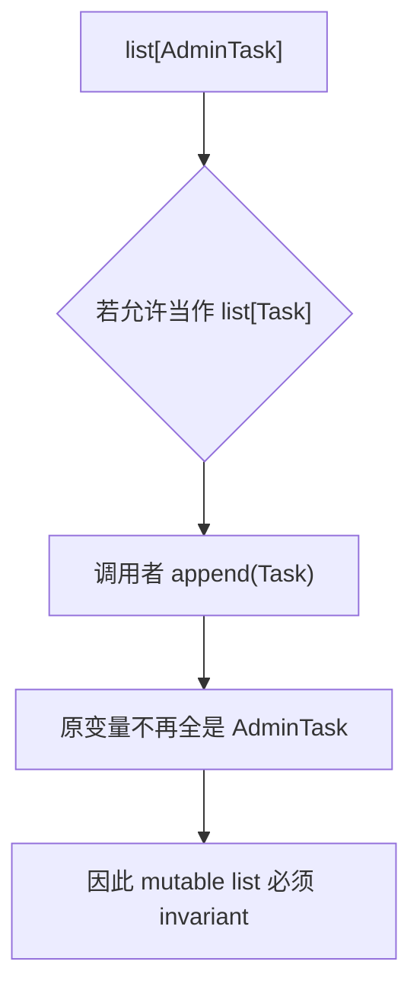

# Python 类型提示、泛型、类型收窄、静态分析与自动化测试

> 官方语义基线：Python 3.14.x。示例兼容 Python 3.11+，运行测试已在 CPython 3.13.4 验证。示例提供 mypy strict 配置；当前工作树未安装 mypy/Pyright，因此本次没有声称完成静态检查器验证。

## 1. 为什么动态语言仍然需要类型设计

Python 允许一个名称先绑定字符串、后来绑定整数。灵活性让小程序启动很快，但后端系统的接口一多，维护者必须不断回答：

- 这个函数接收已经验证的 Task，还是任意 JSON 值？
- 返回 list 中究竟是什么？
- `None` 是合法结果，还是忘记处理失败？
- callback 的参数和返回值是否匹配？
- Repository 换成测试替身后，方法签名是否仍兼容？
- 修改一个字段后，哪些调用点已经不再成立？

类型提示把部分假设变成工具可分析的合同，自动化测试则用真实执行验证行为。二者互补：类型检查覆盖大量可能路径的结构关系，测试覆盖选定输入下的运行语义与副作用。

## 2. 最重要的边界：三个阶段


### 2.1 Annotation

`name: str`、`-> Task` 是源码中的元数据和类型表达。它改善可读性，也可被工具和框架读取。

### 2.2 Static type checker

mypy、Pyright 等工具不执行所有业务路径，而是分析类型关系并报告不兼容。不同检查器、版本和配置在边缘行为上可能不同，项目必须固定工具与规则。

### 2.3 Runtime validation

HTTP JSON 到达时只是运行时对象。类型注解不会拦截 `{"priority": "high"}`；边界代码仍要检查、解析并产生领域对象或受控错误。

“写了类型”不等于“数据已经验证”，“测试通过”也不等于“所有类型关系正确”。

## 3. Python 运行时不强制函数注解

```python
def repeat(value: str, count: int) -> str:
    return value * count

repeat(3, "wrong")
```

调用不会在进入函数前因为注解自动拒绝参数。它会按真实对象执行，随后可能在运算中产生 `TypeError`。检查器若分析这个调用，会在运行前报告参数类型错误。

框架可以主动读取注解并实现运行时转换，但那是框架行为，不是 Python 注解本身的保证。

## 4. Annotation 的运行语义具有版本边界

Python 3.13 及以前默认在定义时求值注解；`from __future__ import annotations` 会把它们字符串化。Python 3.14 起默认采用延迟求值，访问时才求值；若仍使用 future import，则继续采用字符串化语义，官方说明这种 future 行为未来会移除。

本课示例兼容 3.11，因此使用：

```python
from __future__ import annotations
```

这让 class 方法能写 `-> Page[U]` 等 forward reference，而不必手写引号。

需要在运行时读取注解的框架不要盲目直接遍历 `__annotations__` 并 `eval`。Python 3.14 提供 `annotationlib.get_annotations()`；兼容多版本时还需根据支持范围选择 `inspect.get_annotations()`、`typing.get_type_hints()` 或兼容库。求值 annotation 可能执行任意代码，不能把不可信代码的注解当纯数据。

## 5. 为输入选择抽象容器类型

```python
def total(values: Sequence[int]) -> int:
    return sum(values)
```

若函数只需要读取、长度和索引，参数写 `Sequence[int]` 比 `list[int]` 更诚实，也接受 tuple 等实现。若会 append，则应明确需要 mutable sequence 或具体 list。

常用边界：

- `Iterable[T]`：只能承诺可迭代；
- `Iterator[T]`：还具有 `__next__`，通常一次消费；
- `Sequence[T]`：有顺序、长度和整数索引；
- `Collection[T]`：可迭代、可取长度、支持成员判断；
- `Mapping[K, V]`：只读 mapping 接口；
- `MutableMapping[K, V]`：允许修改。

返回类型则可更具体，让调用者知道所有权和能力。参数接受尽可能合适的抽象，不等于所有地方都写最宽泛的 `Iterable`。

## 6. Built-in generics 与版本兼容

现代 Python 使用：

```python
list[str]
dict[str, int]
tuple[str, ...]
```

而不是旧式 `typing.List`、`typing.Dict`。`collections.abc` 中的 `Iterable`、`Callable` 等也支持下标。

`tuple[int, str]` 表示固定长度异构 tuple；`tuple[int, ...]` 表示任意长度、元素全为 int。裸 `tuple` 近似 `tuple[Any, ...]`，会丢失信息。

## 7. Union、None 与 Optional

```python
def find_task(task_id: str) -> Task | None:
    ...
```

`Task | None` 表示两种可能类型。`Optional[Task]` 与它等价，不表示参数可省略；是否可省略由默认参数决定：

```python
def fetch(limit: int | None = None) -> None:
    ...
```

调用者必须在访问 Task 属性前排除 None。不要为逃避检查而写 `cast(Task, result)`，应依据业务语义处理未找到分支。

## 8. `Any`、`object` 与未知值

这是最容易被混淆的一组：

- `Any`：静态检查的逃生口，几乎允许任意操作，并把不确定性继续传播；
- `object`：所有 Python 对象的共同静态上界，但直接只能执行 object 保证的操作；
- 未注解值：检查器如何处理取决于配置，可能推断，也可能成为 Any。

外部 JSON 的解析入口写 `object` 很有价值：调用者必须通过 `isinstance` 等证据缩窄后才能做字符串、mapping 或 list 操作。若一开始写 Any，拼错方法也可能静态通过。

Any 并非绝对禁止。无类型第三方库、逐步迁移和高度动态框架可能需要它；关键是把 Any 隔离在 adapter 边界，尽快转换成已知类型。

## 9. `Never` 与不可返回路径

`Never` 表示没有值属于该类型，可用于：

- 永不正常返回的函数；
- exhaustiveness 检查辅助函数；
- 不可能出现的分支。

`NoReturn` 主要用于永不返回函数，是历史上较早的形式。不要把正常返回 None 的函数标成 NoReturn：`-> None` 仍会正常返回，只是结果值为 None。

## 10. Literal、Final 与 ClassVar

```python
TaskStatus = Literal["pending", "completed"]
MAX_PAGE_SIZE: Final = 100

class Settings:
    version: ClassVar[str] = "1"
```

- `Literal` 限制为特定值，有助于穷举状态；
- `Final` 告诉检查器名称不应重新绑定，不是运行时常量锁；
- `ClassVar` 表明属性属于 class 而非 dataclass instance field。

它们都是静态语义工具，不会给字符串或变量增加安全封印。

## 11. Type alias 与 NewType 不同

```python
TaskIds = list[str]                 # alias：完全等价
TaskId = NewType("TaskId", str)   # 静态上区分
```

Alias 为复杂表达式提供名字，不创造新类型。Python 3.12+ 推荐 `type TaskIds = list[str]`；为兼容 3.11，本课使用赋值或旧式 TypeAlias 语法。

`NewType` 让检查器区分 `TaskId` 与普通 str，减少把 UserId 传给 Task API 的逻辑错误。运行时 `TaskId(raw)` 基本返回原对象，不进行格式验证，也不是可用来 `isinstance(value, TaskId)` 的真正 class。

如果标识需要非空校验、规范化、方法和真正运行时身份，上一课的 frozen dataclass value object 更合适。

## 12. TypedDict 描述 dict shape，但不会创建对象

<<< ../../../examples/python/python-typing-generics-testing/typed_tasks/models.py{python:line-numbers} [models.py]

`TaskPayload` 告诉检查器：已受信任 dict 应有哪些 key 和 value type。运行时仍是普通 dict：

```python
payload: TaskPayload = {...}
type(payload) is dict
```

它不会验证 `json.loads()` 的结果。`NotRequired` 表示某 key 可以缺失；这与 value 类型包含 None 不同：

- key 可缺失：`NotRequired[str]`；
- key 必须存在但 value 可空：`str | None`。

外部输入先按 `object` 验证，再转成 domain object。不要用 `cast(TaskPayload, json.loads(text))` 冒充校验。

## 13. Generic 表达“类型之间的关系”

没有泛型时，只能写：

```python
def first(values: list[object]) -> object:
    return values[0]
```

调用 `first(list[Task])` 后只知道 object。TypeVar 表达输入元素与输出属于同一未知类型：

```python
T = TypeVar("T")

def first(values: Sequence[T]) -> T:
    return values[0]
```

若输入 `Sequence[Task]`，检查器推断返回 Task；输入 `Sequence[str]`，返回 str。泛型不是“可以放任何东西”的 Any，而是保存多个位置之间的约束关系。

## 14. PEP 695 新语法与兼容语法

Python 3.12+ 可以写：

```python
def first[T](values: Sequence[T]) -> T:
    ...

class Page[T]:
    ...
```

本课兼容 Python 3.11，使用：

```python
T = TypeVar("T")

class Page(Generic[T]):
    ...
```

两种语法表达相似目标，但 type parameter scope、variance inference 和运行时对象等细节并非只是字符替换。项目应根据最低 Python 版本统一风格，不要在兼容 3.11 的源码中使用 3.12 syntax。

## 15. Generic Page 的因果链

`Page[T]` 保存 `tuple[T, ...]`，而 `map` 接收 `Callable[[T], U]` 并返回 `Page[U]`：

```text
Page[int]
   │ map(int -> str)
   ▼
Page[str]
```

分页 metadata 不改变，item 类型从 T 变成 U。检查器可以推导：

```python
numbers: Page[int]
labels = numbers.map(str)  # Page[str]
```

运行时 `Page[int]` 不会检查 tuple 中每个值。`__post_init__` 只验证 total/offset/limit 等业务不变量；元素类型仍主要由静态检查与创建边界保证。

## 16. TypeVar 的 bound 与 constraints

Bound 表示类型变量必须是某上界的 subtype，同时保留具体 subtype：

```python
TTask = TypeVar("TTask", bound=Task)
```

Constraints 表示在列出的几个精确类别中选择：

```python
TextOrBytes = TypeVar("TextOrBytes", str, bytes)
```

`bound=str | bytes` 与 constraints `(str, bytes)` 在 subtype 推断上不完全相同。不要为了让错误消失随意加 bound；先描述真实关系。

## 17. Variance 为什么存在

假设 `AdminTask` 是 `Task` 的 subtype：

- 只读 `Sequence[AdminTask]` 可安全当 `Sequence[Task]` 读取，Sequence 是 covariant；
- 可变 `list[AdminTask]` 不能当 `list[Task]`，否则调用者可能 append 普通 Task，破坏原列表承诺，list 因而 invariant；
- consumer callback 的参数方向相反，常涉及 contravariance。



Variance 描述参数化类型之间的 subtype 关系，不表示容器运行时自动转换元素。

## 18. Callable、Protocol 与 callback

简单 callback 可写：

```python
predicate: Callable[[Task], bool]
```

复杂 keyword-only signature、overload 或属性要求，使用带 `__call__` 的 Protocol 更清楚。装饰器若要保存原函数完整参数，需要 `ParamSpec`；只用 `Callable[..., R]` 会丢失参数约束。

本课 predicate 仅一个 Task 参数和 bool 返回，Callable 足够。不要为了展示高级类型而引入 ParamSpec、Concatenate 和 overload，使公共 API 比业务本身更难理解。

## 19. Narrowing：从证据减少可能类型

```python
value: object
if isinstance(value, str):
    print(value.strip())
```

检查器在 if 分支把 object 缩窄为 str。常见证据：

- `isinstance` / `issubclass`；
- `value is None`；
- 对 Literal union 的相等判断；
- pattern matching；
- `TypeGuard` / `TypeIs` 函数；
- 某些检查器理解的 `assert`。

缩窄必须与真实运行时判断一致。错误的用户自定义 guard 会欺骗检查器，产生比不写类型更危险的信心。

## 20. TypeGuard 的运行与静态两层语义

本课：

```python
def is_string_list(value: object) -> TypeGuard[list[str]]:
    return isinstance(value, list) and all(isinstance(item, str) for item in value)
```

运行时它就是返回 bool 的函数；静态上，检查器在 true branch 把 value 视为 `list[str]`。TypeGuard 通常只对正分支提供目标缩窄，而且规范允许目标类型并非输入类型的严格 subtype，这带来表达力，也让错误实现更危险。

Python 3.13 加入 `TypeIs`。它要求 narrowed type 与输入类型兼容，并能对 true/false 两侧做交集/排除式缩窄。示例最低版本为 3.11，因此使用 TypeGuard；需要 TypeIs 且兼容旧版本时可评估 `typing_extensions`。

## 21. `cast` 不做任何转换或验证

```python
status = cast(TaskStatus, raw)
```

运行时 `cast` 原样返回第二个参数。它只告诉检查器“这里已有外部证据”。本课先检查：

```python
if value not in ("pending", "completed"):
    raise ValidationError(...)
```

然后 cast。若没有前置证据，cast 只是压住报警。真正转换字符串到 int 应写 `int(raw)` 并处理异常；真正验证 payload 应逐字段检查。

## 22. `assert` 不是公共输入验证

检查器可以用 `assert value is not None` 缩窄类型，但 Python 以优化模式运行时可能移除 assert。它适合表达程序内部“如果前置逻辑正确，这里必然成立”的 invariant 检查，不适合验证 HTTP 参数、权限或账务规则。

外部输入错误必须使用普通条件并抛出明确异常。

## 23. Runtime parser 完整实现

<<< ../../../examples/python/python-typing-generics-testing/typed_tasks/parsing.py{python:line-numbers} [parsing.py]

执行链：

1. 输入类型是 object，禁止未经证据的操作；
2. `_as_string_mapping` 检查 mapping 与 key 类型；
3. required string 检查存在、类型、非空并规范化；
4. priority 明确排除 bool；
5. tags 用 TypeGuard 检查每个元素；
6. status 先验证 literal set，再 cast；
7. 最终构造强类型 Task。

为什么 `isinstance(True, int)` 是 True？因为 Python 的 bool 是 int subtype。若领域要求 JSON boolean 不能作为优先级，仅检查 int 会误收，因此代码额外排除 bool。

解析后内部代码可依赖 Task 合同，不必在每一层重复猜测 dict shape。

## 24. Generic paginate

<<< ../../../examples/python/python-typing-generics-testing/typed_tasks/query.py{python:line-numbers} [query.py]

`Sequence[T]` 表明函数只切片和取长度，不修改输入。返回 `Page[T]` 保存输入元素类型。offset/limit 是真实运行时值，因此即使标注 int，仍需验证非负/正数的数值范围。

类型系统通常表达“是 int”，不会自动表达“1 到 100 的 int”。静态类型与领域 value range validation 属于不同层。

## 25. Typed application service

<<< ../../../examples/python/python-typing-generics-testing/typed_tasks/service.py{python:line-numbers} [service.py]

`TaskSource.read() -> Iterable[object]` 很关键：source 返回的可能是外部反序列化结果，尚未可信。service 立即 `parse_task`，随后集合才成为 `tuple[Task, ...]`。

若 source 错写 `Iterable[Task]`，相当于在没有验证的地方提前宣布安全；若写 `Iterable[Any]`，不安全操作又会扩散而不报警。

predicate 接收 Task，因此调用者不能在 strict 检查下传只接受无关类型的函数。

## 26. 静态检查器如何进入项目

Package 的公共导出集中在 `__init__.py`，使调用者不必依赖内部 module 布局：

<<< ../../../examples/python/python-typing-generics-testing/typed_tasks/__init__.py{python:line-numbers} [__init__.py]

这只是明确 public import surface，不会让被导出的对象获得额外运行时类型保护。

本课 `pyproject.toml`：

<<< ../../../examples/python/python-typing-generics-testing/pyproject.toml{toml:line-numbers} [pyproject.toml]

`strict = true` 是一组严格规则的集合，具体内容随 mypy 版本演进，所以项目要固定可接受版本范围并在升级时审查结果。

安装 optional dependency 后可运行：

```bash
python3 -m pip install -e '.[typecheck]'
python3 -m mypy
```

本次环境未安装 mypy/Pyright，也未下载依赖，因此只验证了运行测试与编译。课程不能把 pyproject 中存在配置误报为“静态检查已通过”。

生产项目应在 lock/约束策略中固定 type checker 版本，并让本地命令与 CI 使用同一 Python 和配置。

## 27. Gradual typing：从边界开始

旧项目不必一次注解全部代码。高收益顺序通常是：

1. 外部 API 与核心领域模型；
2. 跨 module 的公共函数；
3. 数据解析和 None/error 分支；
4. 复杂容器与 callback；
5. 内部简单局部变量由推断承担。

目标不是最高 annotation 密度，而是降低错误状态空间。`x: int = 1` 这种显而易见局部注解收益很低；一个公开函数返回 `dict[str, object] | None` 的边界则值得写清。

## 28. `# type: ignore` 是带债务的局部豁免

若确实需要忽略，优先带 error code 和原因：

```python
legacy_call(value)  # type: ignore[arg-type]  # upstream stub is wrong
```

裸 ignore 可能同时隐藏未来新增的其他错误。定期启用 unused-ignore 检查，依赖修复后删除豁免。不要用 ignore 代替理解错误；有时错误揭示的正是真实 None path 或 variance bug。

## 29. 类型检查器不证明程序正确

以下代码可完全通过类型检查：

```python
def add(a: int, b: int) -> int:
    return a - b
```

类型关系正确，业务算法错误。检查器通常也不证明：

- SQL 事务边界正确；
- HTTP 服务实际可用；
- 重试不会重复扣款；
- JSON 字段值范围合法；
- 并发没有 race；
- 权限策略满足业务规则。

这些需要测试、运行时防护、代码审查、形式化约束或生产观测。

## 30. 为什么自动化测试需要分层

测试按真实依赖范围常分：

- **unit test**：一个小行为单元，依赖由 fake/stub 等隔离，快速且定位清楚；
- **integration test**：验证多个真实组件边界，例如 repository 与实际数据库；
- **end-to-end test**：从外部协议穿过完整系统，置信度高但更慢、更脆弱。

这不是按文件名决定。使用真实 SQLite 的单个函数测试也可能是 integration；测试整个纯函数 pipeline 仍可能是 unit。

只写 unit test 会漏掉配置、SQL、序列化和网络契约；只写 E2E 则失败定位困难且反馈慢。风险决定组合比例。

## 31. 测试的因果结构

一个清晰测试通常含：

1. Arrange：建立输入、依赖与初态；
2. Act：执行一个可观察行为；
3. Assert：验证输出、状态变化或协作；
4. Cleanup：释放外部资源，通常由 context manager/fixture 管理。

不要把 Act 淹没在十几行 setup 中。若多个测试重复复杂 setup，可创建有领域意义的 factory/helper，但不要隐藏测试关键差异。

## 32. unittest discovery 与生命周期

```bash
python3 -m unittest discover -v
```

默认发现符合命名约定的 test module 和 `unittest.TestCase` 方法。每个 test method 使用独立 TestCase instance；`setUp()` 在每个测试前运行，`tearDown()` 在之后运行。

class/module 级 setup 能节省昂贵资源，却增加共享状态风险。资源清理优先使用 `addCleanup`、context manager 或框架 fixture，确保 setup 中途失败也能清理。

测试不能依赖执行顺序。随机顺序或单独运行某个测试仍应通过。

## 33. Assertion 应表达业务差异

```python
self.assertEqual(actual, expected)
self.assertIs(value, sentinel)
self.assertRaises(ValidationError)
```

使用专用 assertion 能得到更清楚的失败信息：

- equality 与 identity 不混淆；
- float 使用近似比较；
- exception 同时检查类型，必要时检查稳定消息片段或结构属性；
- collection 若顺序不属于合同，不应强行按顺序断言。

一个测试可以有多个 assertion，只要它们共同描述同一行为。机械坚持“一测试一 assertion”常让 setup 重复且语义碎片化。

## 34. `subTest` 参数化相同行为

本课把多个非法 payload 放入 cases：

```python
for payload, message in cases:
    with self.subTest(payload=payload):
        ...
```

某个 case 失败时其余 case 仍可运行，报告包含参数上下文。它适合共享同一行为和 setup 的小表格。

若每个 case 的原因、动作或断言差异很大，拆成独立命名测试更清晰。

## 35. Test double 的准确边界

术语在不同社区略有差异，常用含义：

- **stub**：返回预设答案；
- **fake**：简化但可工作的实现，如内存 repository；
- **spy**：记录调用供断言；
- **mock**：围绕预期交互配置和验证；
- **dummy**：只为填参数，不被真正使用。

重要的不是术语争论，而是测试为什么替换依赖、验证状态还是验证 interaction。

## 36. Fake 优先展示行为

本课 `FakeSource` 返回两个 payload，测试通过最终 Page 判断过滤结果。它具有真实 Python 方法，重构时易读，失败也接近业务语义。

对有状态 repository、clock、message collector，小型 fake 往往比大量 chained mock 更稳。fake 也可能偏离真实实现，所以 repository contract 仍需用 integration test 验证真实 adapter。

## 37. Mock 用于重要的协作合同

`create_autospec(TaskSource, instance=True)` 根据目标 API 限制 mock，错误方法名或调用签名更可能立即失败。测试验证 `read()` 恰好调用一次。

autospec 仍不是静态检查器，也不会理解所有动态属性。mock 的对象必须是“被测代码实际查找的名称”；使用 patch 时要 patch 使用方 module 中绑定的名称，而不是原始定义所在位置，这是最常见的 patch 失效原因。

只对业务重要 interaction 断言次数和参数。若每个内部 helper call 都被锁死，安全重构也会导致测试失败。

## 38. 不要 mock 你真正需要验证的边界

如果目标是验证 SQL 与 schema 兼容，却 mock database driver，测试已经绕开风险。如果目标是验证 JSON response，却只断言 service method 被调用，也没有验证协议。

Mock 适合隔离：

- 不可控外部服务；
- 慢或付费依赖；
- clock、random、UUID；
- 需要精确验证的一次通知协作。

而 serializer、repository query、framework routing 等关键 adapter 应有真实 integration test。

## 39. 确定性来自显式输入

易抖动来源：

- 当前时间；
- 随机数；
- 网络；
- 共享数据库；
- 文件系统残留；
- locale/timezone；
- unordered collection 展示；
- 并发调度时序。

传入 Clock、Random 或 ID generator，比在深层 patch 全局函数更清晰。临时文件用 `TemporaryDirectory`，时间用 timezone-aware fixed datetime，数据库每测试建立隔离事务或独立 schema。

不能为了“稳定”移除所有并发和真实 I/O 测试；应将它们放进合适层级并控制环境。

## 40. 测试隔离与共享状态

每个测试必须能独立运行。常见污染：

- module-level mutable list；
- singleton cache 未清空；
- 环境变量修改未恢复；
- monkey patch 未退出；
- 固定文件路径冲突；
- 数据库事务未回滚。

资源所有权应在 fixture/context 内，清理发生在异常路径。若测试只能在整套顺序下通过，它验证的是隐藏全局状态，不是目标行为。

## 41. Coverage 是未执行代码提示，不是正确性分数

Line coverage 100% 仍可能没有验证任何结果，或漏掉边界组合。Branch coverage 能揭示未走过的 if/else，但也不证明断言正确。

Coverage 适合：

- 找出从未触发的错误路径；
- 防止关键模块覆盖大幅倒退；
- 引导风险讨论。

不适合：

- 作为唯一质量 KPI；
- 为数字而测试 trivial getter；
- 排挤集成、安全、性能和故障恢复测试。

## 42. Property-based 与 example-based testing

本课测试给出具体 example，失败时直观。Property-based testing 会生成大量输入来验证 invariant，例如分页永不超过 limit、parse 后 title 永不空白。

Python 常用第三方 Hypothesis；本示例不引入依赖，也没有声称执行 property tests。它尤其适合解析器、序列化、数学性质和状态机，但需要写真正的 property，而不是把一个普通 case 随机化。

## 43. 类型测试也是 API 测试

库作者有时需要验证某调用应通过/应失败，或用 `assert_type`、`reveal_type` 检查推断。这类测试由 type checker 执行，不是 unittest runtime test。

不要把故意类型错误的示例混入正常 package 再要求 strict check 全绿。可放在 checker 专用目录，使用对应工具的预期错误机制，并固定工具版本。

## 44. 完整自动化测试

<<< ../../../examples/python/python-typing-generics-testing/tests/test_typed_tasks.py{python:line-numbers} [test_typed_tasks.py]

九项测试覆盖：

- 不可信 payload 解析和规范化；
- bool/int subtype 边界；
- 多组无效输入；
- TypeGuard 的真实 predicate 行为；
- generic pagination metadata；
- `Page[int] -> Page[str]` 的 map 行为；
- 非法 limit；
- fake source 的状态结果；
- autospec mock 的协作次数。

运行测试只能证明这些具体执行行为。`Page[int] -> Page[str]` 的静态推断仍必须由 mypy/Pyright 验证。

## 45. 运行完整示例

```bash
cd examples/python/python-typing-generics-testing
python3 -m unittest discover -v
python3 -m compileall -q typed_tasks tests
```

预期 9 项测试通过。

若已按项目配置安装 mypy：

```bash
python3 -m mypy
```

不要直接运行一个不确定属于哪个环境的 `mypy` 命令；`python3 -m mypy` 能明确绑定当前解释器环境。

## 46. 推荐 CI 因果顺序

一个小型 Python 服务可按反馈速度组织：

1. syntax/import/compile smoke check；
2. formatter/linter；
3. strict type check；
4. 快速 unit tests；
5. integration tests；
6. package/wheel install test；
7. 安全与依赖扫描；
8. 必要的 E2E、性能和部署验证。

某一步失败应终止发布，但不一定要阻止所有诊断任务并行运行。CI 使用的 Python、lockfile、环境变量和外部服务版本应可复现。

## 47. JavaScript / TypeScript 对照

- TypeScript 与 Python typing 都主要在运行前检查，默认不验证 JSON；
- TS interface 常是 structural，Python Protocol 与其理念接近；
- TS `any` 与 Python Any 都会传播检查盲区；`unknown` 更接近 Python 中用 object 强迫 narrowing 的设计意图；
- TS union narrowing 与 Python `isinstance` / Literal narrowing 相似，但控制流分析规则不同；
- TS generic `Page<T>` 与 Python `Page[T]` 都表达类型关系；variance 默认和 mutation 规则不要假设完全一致；
- Jest/Vitest mock 与 unittest.mock 都可能过度绑定实现。

Vue 前端常把 API response 直接 `as SomeType`。Python 的 cast 也有同样风险：它只改变检查器认识，不改变网络数据。两端都需要 schema/runtime parser。

## 48. Java 对照

- Java 类型通常由编译器/JVM 更强制，Python annotation 默认不阻止错误运行时值；
- Java generic 有 type erasure，Python typing generic 也主要服务静态分析，但运行时保留形式和反射细节不同；
- Java wildcard variance 与 Python covariant/contravariant TypeVar/容器声明方式不同；
- Java record/class 是真实运行时类型，Python NewType 不是 wrapper class；
- JUnit 与 unittest 都有 test lifecycle/assertion/mock 生态，测试隔离原则相同；
- checked compile 不替代 Java 测试，正如 Python type check 不替代 unittest。

## 49. 常见反模式

### 49.1 一切写 Any

代码表面“有注解”，实际失去检查。改用 object + narrowing，或在 adapter 内局部 Any 后立即转换。

### 49.2 cast 外部 JSON

cast 不验证。使用 parser/schema validator，失败返回结构化错误。

### 49.3 为通过检查改变真实语义

例如把可能缺失的 lookup 标成必有 Task。应修正 API 为 `Task | None` 或明确抛异常，而不是对检查器撒谎。

### 49.4 Generic 只为炫技

若 T 只出现一次且没有关系可保存，generic 可能没有价值。先问类型参数连接了哪些位置。

### 49.5 Mock 每个内部函数

测试变成实现复制，重构困难。优先验证公共行为，只 mock 慢/不稳定/重要协作边界。

### 49.6 只测成功路径

后端可靠性主要取决于无效输入、依赖失败、重复调用、边界值和资源清理。错误路径必须是一等测试对象。

### 49.7 追逐覆盖率数字

没有有意义 assertion 的执行不提供行为置信度。

### 49.8 本机通过即结束

环境、依赖、Python 版本、timezone 与服务配置差异仍可能失败。CI 需要干净、可复现环境。

## 50. 工程检查清单

- 明确 annotation、static analysis 与 runtime validation 三层；
- 外部不可信值从 object/unknown boundary 开始；
- Any 被隔离而非扩散；
- 参数使用所需最小抽象能力；
- Optional 表示可为 None，不表示可省略；
- alias 与 NewType 不混淆；
- TypedDict 不冒充 runtime parser；
- TypeVar 连接至少两个类型位置；
- 理解 mutable generic invariance；
- guard 的实现与声明真实一致；
- cast 前存在可审查的证据；
- assert 不处理安全和外部输入；
- checker 版本与 strict 配置进入项目契约；
- ignore 带 error code 与原因；
- unit/integration/E2E 按风险组合；
- 测试遵循清晰 Arrange/Act/Assert；
- 每个测试独立、确定、可重复；
- fake 用于可读状态测试；
- mock 使用 spec/autospec 并只验证重要协作；
- patch 使用方查找位置；
- clock/random/ID 作为显式依赖；
- coverage 用于发现空白，不作为正确性证明；
- 运行测试和静态检查都在 CI 执行；
- 未实际执行的检查不写成已通过。

## 51. 本课结论

- Python runtime 不强制类型注解；检查来自独立静态工具，外部数据仍需运行时验证。
- Python 3.14 默认延迟求值 annotation，兼容旧版本与 future import 时必须明确语义边界。
- object 保留安全的不确定性，Any 放弃大量检查，应限制传播。
- TypedDict 描述 dict shape，NewType 提供低成本静态区分，都不自动验证输入。
- Generic/TypeVar 保存输入、输出和容器元素间关系，而不是 Any 的另一种拼法。
- Variance 由读写能力决定；可变 list 的 invariance 防止写入破坏元素承诺。
- Narrowing 必须来自真实证据；TypeGuard、TypeIs、cast 和 assert 的能力与风险不同。
- 自动化测试验证运行行为，静态检查验证类型关系，任何一方都不能替代另一方。
- Fake 更适合可读状态行为，mock 只应锁定重要协作合同。
- Coverage 是风险线索，不是正确性百分比。

下一节建议：Python 并发模型、线程、进程、GIL、asyncio 与结构化异步 I/O。

## 52. 参考资料

- [Python Standard Library：typing](https://docs.python.org/3.14/library/typing.html)
- [Python Typing Specification](https://typing.python.org/en/latest/spec/)
- [Python Typing：Generics](https://typing.python.org/en/latest/spec/generics.html)
- [Python Typing：Type narrowing](https://typing.python.org/en/latest/spec/narrowing.html)
- [Python Standard Library：annotationlib](https://docs.python.org/3.14/library/annotationlib.html)
- [Python HOWTO：Annotations Best Practices](https://docs.python.org/3.14/howto/annotations.html)
- [PEP 484：Type Hints](https://peps.python.org/pep-0484/)
- [PEP 544：Protocols](https://peps.python.org/pep-0544/)
- [PEP 589：TypedDict](https://peps.python.org/pep-0589/)
- [PEP 647：TypeGuard](https://peps.python.org/pep-0647/)
- [PEP 742：TypeIs](https://peps.python.org/pep-0742/)
- [PEP 695：Type Parameter Syntax](https://peps.python.org/pep-0695/)
- [Python Standard Library：unittest](https://docs.python.org/3.14/library/unittest.html)
- [Python Standard Library：unittest.mock](https://docs.python.org/3.14/library/unittest.mock.html)
- [Python unittest.mock：Where to patch](https://docs.python.org/3.14/library/unittest.mock.html#where-to-patch)
