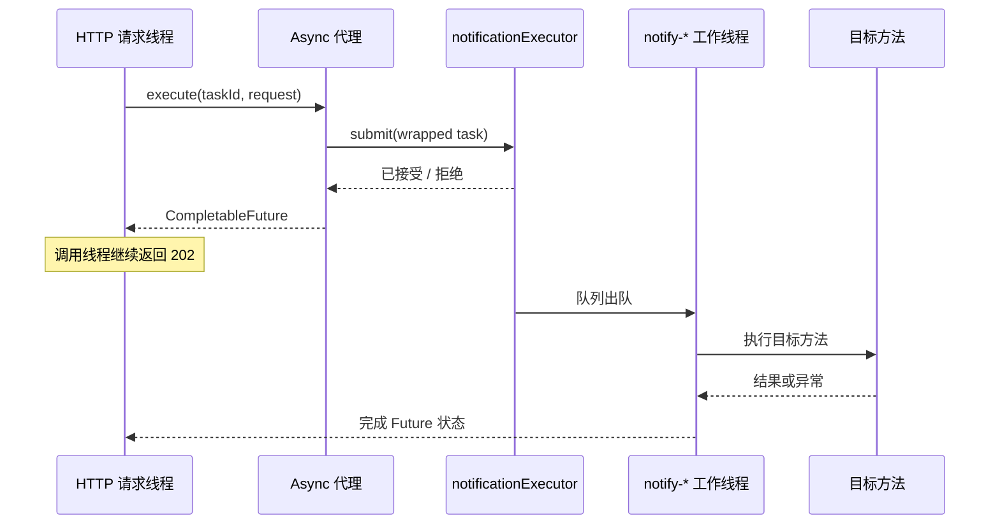
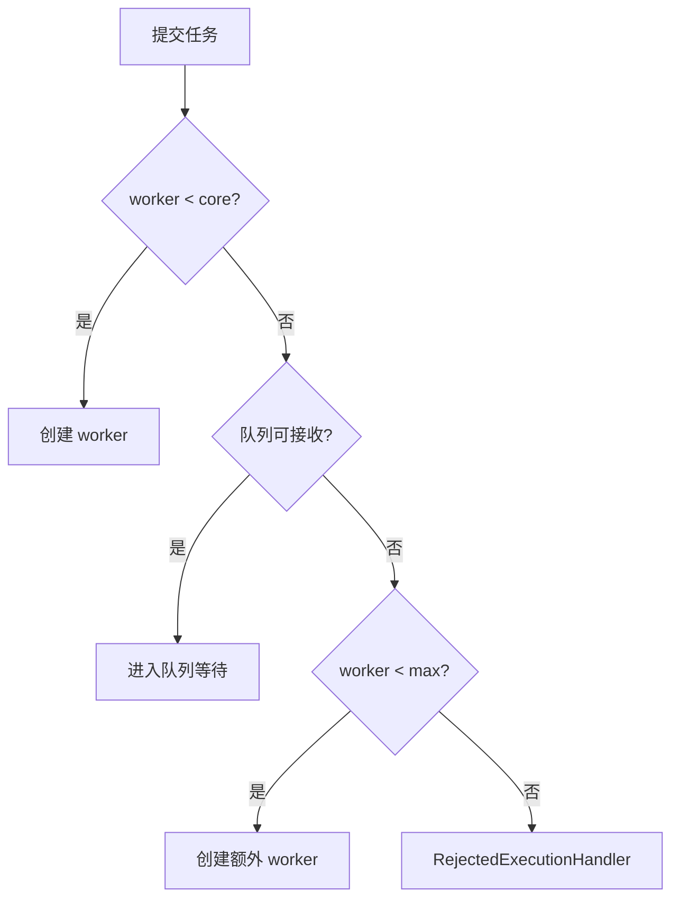
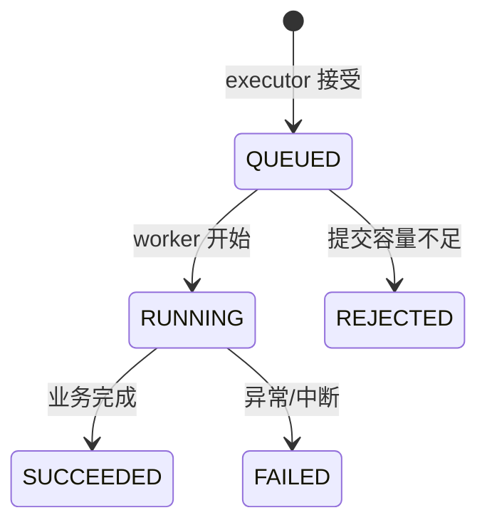
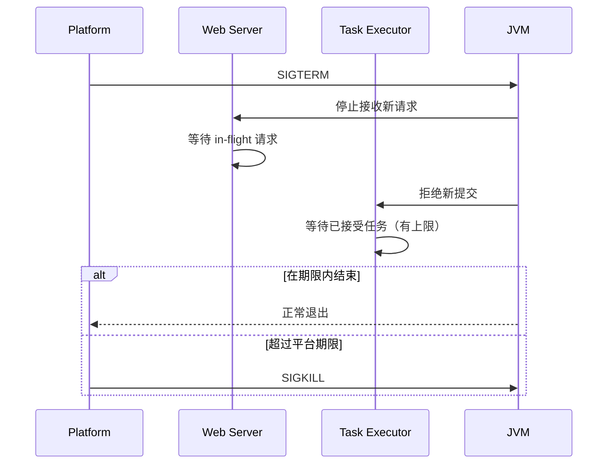

# Spring Boot 异步任务、线程池、定时调度、上下文传播与优雅停机

上一课用缓存减少重复工作，本课处理另一类延迟：一项工作确实要执行，但客户端不一定需要在当前 HTTP 请求中等待它结束。例如发送通知、生成报表、转码、同步搜索索引和批量对账。

把方法标记为 `@Async` 看似只是一行代码，实际却改变了调用线程、异常返回、事务边界、日志上下文、容量控制和应用关闭行为。如果这些边界没有被设计清楚，“异步”往往只是把失败从请求日志搬到后台，或把过载从连接池搬到无限队列。

第一次学习先分清“请求已经被接受”和“任务已经完成”。能丢失的短小辅助工作才适合进程内异步；必须恢复的工作应进入持久化任务或消息系统。线程池细节、上下文传播与多实例调度都从这个可靠性选择继续展开。

## 1. 版本、环境与学习目标

本课示例基于：

- Spring Boot 4.1.0。
- Spring Framework 7.0.8。
- Java 17 编译目标；本机可使用更新 JDK 构建运行。
- Maven 3.9.16。
- Servlet Web 应用与平台线程池。
- 示例端口 `18088`。

完成后应能解释：

- 并发、并行、异步和调度的区别。
- `@Async` 从调用到线程池执行的完整链路。
- core size、max size、queue capacity 和拒绝策略怎样共同工作。
- 为什么无界队列会让 max pool size 失去作用。
- `void`、`Future`、`CompletableFuture` 的失败可见性差异。
- 为什么 HTTP 接受任务应该返回 202，而不是伪装成已完成。
- ThreadLocal、MDC、SecurityContext 和事务为什么不会自动跨线程。
- `TaskDecorator` 应复制什么，又绝不能复制什么。
- fixed delay、fixed rate、cron 和动态调度的语义边界。
- 为什么多实例会让同一定时任务执行多份。
- graceful shutdown 能保证什么，不能保证什么。
- 何时应该从进程内异步升级到消息队列、outbox 或任务平台。

## 2. 为什么需要异步

同步请求的执行链通常是：

```text
客户端 → HTTP 工作线程 → 业务调用 → 外部 I/O → 返回响应
```

只要外部 I/O 没结束，请求线程就被占用。若通知网关需要 800ms，100 个并发请求会长期占用大量 Tomcat 线程和内存。

异步提交把链路拆成两个阶段：

```text
请求阶段：校验 → 记录任务 → 提交 executor → 202 + taskId
后台阶段：取出任务 → 执行业务 → 持久化成功或失败状态
```

客户端等待时间变短，但工作量没有消失。它被放入另一个容量有限的系统：线程池与队列。

## 3. 异步不等于更快

假设一项工作需要 500ms CPU：

- 同步执行，服务器花 500ms。
- 放入线程池，服务器仍花约 500ms，外加提交、排队和线程切换。

异步改善的是调用方等待方式、吞吐隔离或任务组合，不会减少固有计算量。若 CPU 已经饱和，增加线程反而会增加上下文切换并降低吞吐。

对 I/O 阻塞任务，多线程可在一部分线程等待网络时让其他线程工作；对 CPU 密集任务，线程数通常应接近可用核心数，并通过基准测试校准。

## 4. 并发、并行、异步、调度的边界

| 概念 | 核心问题 | 例子 |
| --- | --- | --- |
| 并发 | 多项工作在时间上推进 | 两个请求交替占用 CPU |
| 并行 | 多项工作在同一时刻执行 | 两个核心分别计算图片 |
| 异步 | 调用方不在原调用栈等待完成 | 提交通知后返回 taskId |
| 调度 | 在指定时间或规则下触发工作 | 每 30 秒扫描待处理任务 |

异步任务可能只在一个工作线程上串行执行，并不一定并行；定时任务也可以同步执行，只是触发时间由 scheduler 决定。

## 5. 进程内异步的准确边界

本课的任务存在于当前 JVM 的内存和线程池中：

- 进程崩溃会丢失尚未完成的任务。
- 部署重启会清空内存状态。
- 任务状态只在当前实例可见。
- 负载均衡后的 GET 可能落到另一实例而查不到 taskId。

因此它适合：

- 可重试、可重新触发的低价值后台工作。
- 仅用于并发执行且调用方仍持有 Future 的内部计算。
- 开发、原型或单实例服务。

支付、订单、邮件合规通知等不能丢的工作，应先把任务意图持久化，再由消息队列、outbox、工作流引擎或任务平台可靠消费。

## 6. Spring 的两个抽象

Spring 分别提供：

- `TaskExecutor`：现在提交，稍后在线程中执行。
- `TaskScheduler`：在指定时间或周期触发执行。

常见实现：

- `ThreadPoolTaskExecutor` 包装 JDK `ThreadPoolExecutor`。
- `ThreadPoolTaskScheduler` 包装 `ScheduledThreadPoolExecutor`。
- `SimpleAsyncTaskExecutor` 为每项任务启动线程，不复用传统线程池。

`@Async` 和 `@Scheduled` 是注解入口，底层仍依赖这些执行器。

## 7. 为什么需要显式启用

```java
@Configuration
@EnableAsync
@EnableScheduling
class TaskInfrastructureConfiguration {
}
```

`@EnableAsync` 注册查找 `@Async` 的处理器，`@EnableScheduling` 注册查找 `@Scheduled` 的处理器。没有启用时，注解只是元数据，方法仍按普通同步调用执行。

示例完整配置：

<<< ../../../examples/java/spring-boot-async-scheduling/src/main/java/learning/backend/tasks/config/TaskInfrastructureConfiguration.java{java:line-numbers} [TaskInfrastructureConfiguration.java]

这里显式命名两个资源：

- `notificationExecutor` 只处理通知任务。
- `taskScheduler` 只负责调度触发。

避免所有异步、MVC async、WebSocket 和定时任务无意共享同一个池，造成故障相互传染。

## 8. `@Async` 的真实执行链



调用线程只完成“提交”，不是完成业务。executor 接受任务也不表示任务最终成功。

## 9. 代理边界与同类自调用

默认 `@Async` 使用 Spring AOP 代理。只有从代理外部进入的调用才会被拦截：

```text
Controller → AsyncService 代理 → executor → 目标方法
```

同一个目标对象内部：

```java
public void outer() {
    this.asyncMethod();
}
```

`this` 直接指向目标对象，不经过代理，因此 `asyncMethod()` 会在当前线程同步执行。

解决方式是提取独立 Bean，让调用跨 Bean。不要用 self injection 或 `AopContext.currentProxy()` 掩盖职责混乱。

这与上一课 `@Cacheable`、事务课 `@Transactional` 的代理边界完全相同。

## 10. 哪些方法不能可靠代理

代理模式下要特别注意：

- `private` 方法不能成为外部代理入口。
- `final` 方法不能被基于子类的代理覆盖。
- 对象必须由 Spring 容器创建，手工 `new` 的对象没有代理。
- 构造方法与过早的生命周期回调不适合依赖完整代理链。
- 调用者拿到的必须是容器中的代理引用。

看到日志仍在 `http-nio-*` 线程执行时，应先检查调用路径，而不是盲目增大线程池。

## 11. 线程池不是“线程数量”一个参数

示例配置：

```text
corePoolSize = 2
maxPoolSize = 2
queueCapacity = 2
rejection = AbortPolicy
```

JDK `ThreadPoolExecutor.execute` 的因果顺序：

1. 当前工作线程少于 core：创建线程执行。
2. 已达到 core：优先尝试放入队列。
3. 队列已满且线程少于 max：再创建线程。
4. 队列已满且线程达到 max：执行拒绝策略。



## 12. 为什么无界队列让 maxPoolSize 几乎失效

如果 queue 永远能接收任务，到达 core 后所有新任务都会排队，第三步“队列满后扩展到 max”永远不会发生。

结果可能是：

```text
生产速率 > 消费速率
→ 队列持续增长
→ 等待时间从毫秒变成分钟
→ 队列对象占满堆
→ Full GC / OOM
```

服务没有立即报错，却在积累无法兑现的承诺。有限队列让过载可观察、可拒绝，也让上游能够退避。

## 13. 用 Little's Law 理解容量

稳定系统近似满足：

```text
系统中平均任务数 L = 到达速率 λ × 平均停留时间 W
```

若每秒进入 100 个任务，每个任务从进入到完成平均 2 秒，系统中平均约有 200 个任务。若线程和队列总容量只有 20，持续流量必然被拒绝；若容量设为 10 万，只是把等待时间与内存风险藏起来。

容量规划需要实测：

- 到达速率及突发分布。
- 服务时间 P50/P95/P99。
- 外部依赖并发上限。
- 可接受排队时间。
- 单任务内存占用。
- 超时、重试带来的流量放大。

## 14. core 与 max 怎么估算

CPU 密集任务可从以下起点实验：

```text
threads ≈ CPU cores 或 cores + 1
```

阻塞 I/O 任务常用近似：

```text
threads ≈ cores × (1 + wait time / compute time)
```

这只是起点。线程过多会消耗栈内存、连接池、文件描述符，并把压力推给数据库或下游 API。

线程池大小必须与下游容量一起看：executor 有 100 个线程而数据库池只有 10 条连接，只会让 90 个线程在连接池等待。

## 15. 四种拒绝策略

### 15.1 AbortPolicy

抛出拒绝异常，让调用方明确知道任务没有被接受。本例选择它，并映射为 HTTP 503。

### 15.2 CallerRunsPolicy

由提交线程执行任务，形成反馈控制：生产者会变慢。但在 HTTP 请求中，它可能让本应快速返回的请求突然执行数秒后台工作；在 scheduler 线程中还可能阻塞其他调度。

### 15.3 DiscardPolicy

静默丢弃。只有业务明确允许丢失，且另有指标能发现时才可能使用。通知、订单等任务不应静默丢弃。

### 15.4 DiscardOldestPolicy

丢掉队列最老任务，再尝试提交新任务。它通常破坏先来先服务和业务承诺，很少适合通用任务。

拒绝是容量契约，不是偶发异常。API 要给出稳定错误、重试建议和指标。

## 16. 示例为何返回 202

HTTP 状态语义：

- 200/201 通常表示本次请求的同步业务结果已经产生。
- 202 Accepted 表示服务器接受了处理请求，但处理尚未完成。
- 503 表示当前没有容量接受任务，客户端可按策略稍后重试。

示例提交接口：

```http
POST /api/notifications
```

返回 taskId 和 `QUEUED`，客户端再查询：

```http
GET /api/notifications/{taskId}
```

不能在提交瞬间返回“发送成功”，因为工作线程尚未调用通知网关。

## 17. 任务状态机



示例状态定义：

<<< ../../../examples/java/spring-boot-async-scheduling/src/main/java/learning/backend/tasks/notification/TaskSnapshot.java{java:line-numbers} [TaskSnapshot.java]

真实系统通常还需要：

- retrying、cancel-requested、cancelled、timed-out。
- attempt count 与 nextAttemptAt。
- 幂等键。
- 错误分类，而非只保存异常文本。
- 状态版本避免并发覆盖。

## 18. 内存 Registry 的边界

示例用 `ConcurrentHashMap` 让状态线程安全可见：

<<< ../../../examples/java/spring-boot-async-scheduling/src/main/java/learning/backend/tasks/notification/TaskRegistry.java{java:line-numbers} [TaskRegistry.java]

这只适合教学：

- 没有 TTL，长期运行会不断占内存。
- 重启后状态丢失。
- 多实例不共享。
- create 与真正 enqueue 不是原子持久操作。

生产实现可使用数据库任务表、Redis（若可接受其持久性边界）或消息系统的状态存储，并定期清理终态记录。

## 19. `void` 异步方法为什么危险

`@Async void send()` 无法把后台异常返回给调用方。异常只能交给 `AsyncUncaughtExceptionHandler`，如果没有可靠日志和告警，很容易“请求成功、任务静默失败”。

返回 `CompletableFuture<T>` 时：

- 成功值进入 completed 状态。
- 异常进入 exceptionally completed 状态。
- 调用方可以 `join/get`、组合、超时或恢复。

本例返回 Future，并同时写任务状态。对于真正的 fire-and-forget，也必须有持久状态、重试和 dead-letter 机制，不能只依赖日志。

## 20. 示例异步方法

<<< ../../../examples/java/spring-boot-async-scheduling/src/main/java/learning/backend/tasks/notification/NotificationTaskService.java{java:line-numbers} [NotificationTaskService.java]

执行过程：

1. `@Async` 代理把调用提交给 `notificationExecutor`。
2. worker 读取已经传播的 correlationId。
3. Registry 从 QUEUED 变为 RUNNING。
4. 正常完成后变为 SUCCEEDED。
5. 业务异常变为 FAILED，并让 Future 异常完成。
6. `InterruptedException` 恢复中断标记，再记录失败。

恢复中断标记很重要：吞掉 `InterruptedException` 会让上层关闭与取消逻辑误以为线程没有被要求停止。

## 21. Future 的两层含义

`@Async` 目标方法本身返回 `CompletableFuture`，代理也立即返回一个 Future。Spring 会把目标的异步完成结果连接到调用方持有的 Future。

调用方应避免：

```java
taskService.execute(...).join();
```

如果紧接着在 HTTP 线程 join，就把异步重新变成同步，还增加一次线程切换。

合理使用包括：

- `thenCompose` 组合依赖步骤。
- `thenCombine` 合并独立结果。
- `orTimeout` 限制等待。
- `exceptionally` 转换已知失败。
- 返回 taskId，让其他请求查询持久状态。

## 22. 不要无意使用 commonPool

以下调用若不显式传 executor，常进入 JVM 共享 `ForkJoinPool.commonPool()`：

```java
CompletableFuture.supplyAsync(this::load)
```

整个进程的不同模块共享 commonPool，阻塞 I/O 可能占住其 worker，容量与线程名也难以按业务隔离。

在 Spring 应用中优先注入命名 executor：

```java
CompletableFuture.supplyAsync(this::load, notificationExecutor)
```

并为不同下游或风险域建立舱壁，而不是创建大量没有容量预算的小池。

## 23. ThreadLocal 为什么不会自动传播

`ThreadLocal` 的值绑定在线程对象上：

```text
http-nio-1: correlationId = abc
notify-1:   correlationId = null
```

提交 Runnable 只传递对象引用，不会自动复制调用线程的 ThreadLocalMap。

常见上下文包括：

- 日志 MDC。
- 请求 correlation/trace id。
- Spring Security `SecurityContext`。
- Locale。
- OpenTelemetry/Micrometer observation context。

每种上下文都要有明确传播协议。

## 24. 为什么不能直接共享请求对象

不要把以下对象原样带到后台线程：

- `HttpServletRequest` / `HttpServletResponse`。
- JPA EntityManager、Session 或受管理 Entity。
- 当前数据库 Connection。
- 绑定请求生命周期的 InputStream。
- 可变且缺乏线程安全保证的对象。

HTTP 请求可能已经结束，事务也已经关闭。正确做法是在提交前提取不可变 DTO、资源 ID、tenantId 和必要安全声明，后台任务重新建立自己的事务与连接。

## 25. TaskDecorator 的捕获与恢复

示例 decorator 在提交线程捕获 correlationId 和 MDC，在 worker 执行前安装，结束后恢复 worker 原上下文：

<<< ../../../examples/java/spring-boot-async-scheduling/src/main/java/learning/backend/tasks/context/ContextCopyingTaskDecorator.java{java:line-numbers} [ContextCopyingTaskDecorator.java]

必须在 finally 中清理或恢复。线程池会复用 worker：

```text
任务 A 设置 tenant=A
→ 未清理
→ 同一 worker 执行任务 B
→ B 错误继承 tenant=A
```

这不仅是日志问题，也可能成为跨用户数据泄露。

## 26. 框架级 ContextPropagatingTaskDecorator

Spring 提供 `ContextPropagatingTaskDecorator`，配合 Micrometer Context Propagation 捕获已注册的上下文访问器，适合 observation、trace 和 MDC。

它有包装成本，不适合大量微小任务盲目启用。自定义上下文仍要注册相应 accessor，不能认为加一个 decorator 就会自动理解所有 ThreadLocal。

本例手写最小 decorator，目的是看清捕获、安装、finally 恢复的因果链。

## 27. Correlation ID 的 HTTP 生命周期

Filter 从 `X-Correlation-ID` 读取调用方值，无值或非法时生成 UUID：

<<< ../../../examples/java/spring-boot-async-scheduling/src/main/java/learning/backend/tasks/context/CorrelationIdFilter.java{java:line-numbers} [CorrelationIdFilter.java]

它同时：

1. 写入请求线程 RequestContext。
2. 写入 MDC 供日志格式读取。
3. 回写响应头，便于客户端关联。
4. 请求结束后清理。

客户端提供的 ID 仍是不可信输入，应限制长度和字符；不要直接把任意 header 注入日志以免日志伪造。

## 28. 安全上下文传播边界

如果后台任务需要用户身份，可以使用 Spring Security 提供的 delegating executor/context wrapper，或显式传入经过校验的主体标识。

但要先回答：

- 任务执行时是否仍应使用提交者权限？
- 权限后来被撤销时，任务是否还能继续？
- 应使用用户身份还是服务身份访问下游？
- 安全凭证是否会在队列中存放过久？

复制 `SecurityContext` 不是业务授权策略。长任务通常保存提交者 ID，在真正执行敏感动作时重新做授权或使用受限服务账号。

## 29. 数据库事务不会跨线程

Spring 声明式事务通常把资源绑定到当前线程。请求线程上的事务：

```text
http thread: TransactionSynchronizationManager + Connection
```

不会自动出现在 `notify-*` worker：

```text
worker thread: 无原事务
```

因此：

- `@Async` 方法需要数据库写入时，应在 worker 中开启自己的事务。
- 不能把未提交 Entity 传给 worker 并期待它继续受管理。
- 调用方事务随后回滚，并不会撤销已经启动的异步副作用。

## 30. 事务提交后再启动异步工作

危险顺序：

```text
事务内保存订单
→ 提交异步发送
→ worker 立即读取订单但事务尚未提交
→ 查不到或读到旧值
→ 调用方事务回滚，但通知已发送
```

改进方式：

- `@TransactionalEventListener(AFTER_COMMIT)` 提交后再触发异步 Bean。
- 更可靠：同事务写 outbox，由独立 relay 发布消息。

第一种仍有“commit 成功后进程在 submit 前崩溃”的窗口；不能丢的工作必须持久化任务意图。

## 31. 异步不是事务传播类型

`REQUIRES_NEW` 仍可在同一线程同步执行；`@Async` 切换线程但不自动创建事务。两者解决不同问题：

- transaction propagation 决定数据库事务加入、挂起或新建。
- async execution 决定在哪个线程、何时执行。

在 async worker 中调用 `@Transactional` Bean，会为 worker 建立新事务。这一事务的提交结果需要独立处理。

## 32. 超时与取消

`Future.cancel(true)` 只是请求中断：

- 任务尚未开始时，可能从队列取消。
- 已运行时，对 worker 调用 interrupt。
- 业务代码必须响应中断才会及时停止。
- 阻塞库是否响应中断取决于其实现。
- 已发送到外部系统的副作用不能靠线程中断撤销。

超时也不等于取消。`orTimeout` 可以让 Future 超时完成，但底层任务可能继续运行。需要显式取消协议、幂等步骤和补偿行为。

## 33. 重试为何会放大流量

下游变慢时，如果每个任务立即重试三次：

```text
原始 100 req/s → 最坏约 400 次尝试/s
```

这会进一步压垮下游。重试需要：

- 只针对瞬时、可重试错误。
- 指数退避与随机抖动。
- 总尝试上限和截止时间。
- 幂等键，防止重复副作用。
- dead-letter 或人工处理。
- retry budget 与指标。

线程池队列不是重试系统，任务失败后不会自动重新排队。

## 34. 定时调度解决什么

Scheduler 根据时间规则触发 Runnable。典型用途：

- 扫描待处理记录。
- 清理过期数据。
- 定期同步外部状态。
- 生成周期性报表。
- 刷新本地参考数据。

它不是持久任务队列。应用停机期间错过的触发是否补跑、是否只执行一次、执行历史如何保存，都需要额外机制。

## 35. fixedDelay 的准确语义

```java
@Scheduled(fixedDelayString = "PT30S")
```

下一次计划时间从**上一次执行完成后**开始计算：

```text
start ── work 8s ── finish ── delay 30s ── next start
```

它适合不希望同一触发链重叠、且频率应受实际处理时间影响的轮询任务。

## 36. fixedRate 的准确语义

fixed rate 从计划开始时间计算节拍：

```text
t0, t0+30s, t0+60s ...
```

若任务耗时超过 period，后续触发可能延迟、紧接执行，具体并发还受 scheduler 与方法配置影响。不要把 fixed rate 当作精准实时钟；JVM 暂停、系统负载和时钟变化都会造成漂移。

## 37. cron 的准确边界

Cron 表达式适合日历时间，例如工作日 02:30。必须显式考虑：

- `zone` 时区。
- 夏令时跳过或重复的本地时间。
- 应用停机期间错过的 fire。
- 多实例每台都会触发。
- cron 修改与版本发布的兼容性。

对结算等关键日历任务，使用有持久触发记录和 misfire 策略的 Quartz 或外部调度平台通常更合适。

## 38. `@Scheduled` 方法签名

传统 imperative scheduled 方法通常：

- 无参数。
- 返回 void，返回值会被忽略。
- 依赖通过构造注入获得。

Spring Framework 也支持特定 reactive Publisher，但调度的是订阅；`CompletableFuture` 并非适合这种 deferred subscription 的 reactive 定时返回类型。不要看到“返回 Future”就默认 scheduler 会等待它完成。

## 39. 示例调度任务

<<< ../../../examples/java/spring-boot-async-scheduling/src/main/java/learning/backend/tasks/scheduling/ReconciliationJob.java{java:line-numbers} [ReconciliationJob.java]

默认初始延迟一小时，避免示例启动后频繁产生噪声；之后每次完成 30 秒后再触发。

真实对账任务应把扫描游标、批次状态和幂等信息持久化。内存中的 `AtomicLong` 只用于观察执行次数。

## 40. Scheduler 默认只有一个线程

`ThreadPoolTaskScheduler` 默认 pool size 为 1。一个慢任务会阻塞所有其他定时任务：

```text
schedule-1 执行报表 10 分钟
→ 清理任务、心跳任务、同步任务全部等待
```

示例显式设置 2，但线程数仍应由任务耗时和隔离需求推导。高风险任务可使用独立 scheduler，或让 scheduler 只负责短暂地把持久任务投递到 worker 系统。

## 41. 同一实例内会不会重叠

- fixedDelay 从上次完成后计时，同一触发链自然不重叠。
- fixedRate、cron、多条 repeatable `@Scheduled` 声明可能在足够多 scheduler 线程下重叠。
- 手工 API 与 scheduler 同时调用同一逻辑也会重叠。

若业务不允许重叠，应使用数据库状态机、锁或幂等约束，而不是只依赖当前线程池恰好只有一个线程。

## 42. 多实例必然多次触发

部署三个副本时，每个 JVM 都会扫描 `@Scheduled` 并注册自己的触发器：

```text
pod A → run
pod B → run
pod C → run
```

Spring `@Scheduled` 不提供集群唯一执行。

选择：

- 任务本身幂等，允许每实例执行。
- 使用数据库/Redis 分布式锁，并正确设置租约、续期和 fencing token。
- 只让选主实例调度。
- 使用 Kubernetes CronJob、Quartz 集群或外部调度平台。

简单 `SETNX` 锁若没有过期、所有权校验和故障语义，也可能造成永久锁或并发执行。

## 43. 定时任务异常会怎样

调度方法抛异常不会返回给用户。Scheduler 的 ErrorHandler 决定日志和后续策略。周期任务通常会继续未来触发，但不能把一条 ERROR 日志当作完整治理。

应记录：

- job name 与 run id。
- scheduled time、start、finish 和 lag。
- 成功/失败计数。
- 处理条数和 checkpoint。
- 异常分类与重试状态。
- 连续失败告警。

关键任务状态应持久化，便于补跑和审计。

## 44. 时间、时区与 Clock

业务代码直接 `Instant.now()` 难以确定性测试。生产项目通常注入 `Clock`：

```java
Instant.now(clock)
```

定时表达式负责“何时触发”，业务记录使用 UTC Instant。展示时才转换用户时区。Cron 的 zone 应在配置中明确，避免依赖容器默认时区。

## 45. 虚拟线程改变了什么

Java 21+ 可启用虚拟线程。Spring Boot 在 `spring.threads.virtual.enabled=true` 时会选择适配的 task executor/scheduler。

虚拟线程的优势主要在大量阻塞 I/O：每个阻塞任务不再长期占用昂贵平台线程。但它不会消除：

- 数据库连接池上限。
- 下游并发限制和 rate limit。
- 内存中的任务对象。
- CPU 密集计算成本。
- ThreadLocal 复制与安全上下文问题。
- 过载时需要背压的事实。

本课保持 Java 17 平台线程，让线程池与队列模型清晰可见。升级虚拟线程后仍要设置业务并发阈值，例如 semaphore/bulkhead。

## 46. 与 JavaScript Event Loop 对照

Node/浏览器常通过 event loop 与 Promise 管理非阻塞 I/O。Spring MVC 的普通业务代码运行在 JVM 请求线程上；调用阻塞 JDBC 会阻塞当前线程。

`@Async` 更像把函数提交给一个显式 worker pool：

```javascript
workerPool.submit(() => sendNotification())
```

关键差异：

- JVM 多个平台线程可以真正并行执行 Java 代码。
- ThreadLocal 上下文与线程绑定。
- 每个线程占用栈和调度资源。
- `CompletableFuture` 回调若不指定 executor 可能进入 commonPool。
- 阻塞调用不会因为返回 Future 自动变为非阻塞实现。

## 47. Controller 的提交路径

<<< ../../../examples/java/spring-boot-async-scheduling/src/main/java/learning/backend/tasks/notification/NotificationController.java{java:line-numbers} [NotificationController.java]

顺序：

1. MVC 在请求线程完成 JSON 绑定与校验。
2. 创建 taskId 和 QUEUED 状态。
3. 调用 Async 代理提交任务。
4. executor 饱和时同步抛 TaskRejectedException。
5. 接受成功返回 202。
6. worker 后续更新 RUNNING 和终态。

注意内存示例在“写 QUEUED”与“submit”之间仍非原子。生产用数据库任务表时可设计状态恢复扫描；用 outbox 时让任务消息与业务事务一起提交。

## 48. 为什么要单独映射拒绝错误

线程池饱和不是 500 未知错误，而是当前容量无法接受更多工作。示例返回：

```json
{
  "code": "TASK_CAPACITY_EXHAUSTED",
  "message": "异步任务暂时过载，请稍后重试"
}
```

客户端应遵守 Retry-After 或指数退避，不应立即无限重试。服务端同时需要拒绝计数、队列深度与下游延迟告警。

## 49. 优雅停机有三层

### 49.1 HTTP 入口

Spring Boot 默认支持嵌入式服务器 graceful shutdown。收到正确关闭信号后停止接受新请求，并给已进入的请求完成时间。

### 49.2 Executor

关闭时不再接收新任务，让已接受任务在有限时间内完成。示例设置 strict early shutdown 与 5 秒 await termination。

### 49.3 平台

Kubernetes、systemd 或其他平台最终可能发送 SIGKILL。平台 termination grace period 必须大于应用各关闭阶段预算，还要留出流量摘除时间。



## 50. graceful shutdown 不能保证不丢任务

以下情况仍会丢：

- 进程崩溃、机器断电、OOM。
- SIGKILL。
- 任务执行时间超过关闭期限。
- 容器在 submit 前后崩溃。
- worker 已调用外部系统但尚未来得及记录成功。

因此“不能丢”不能只靠把 awaitTermination 从 5 秒改成 5 分钟。应使用持久队列、幂等消费者和可恢复 checkpoint。

## 51. 关闭配置的边界

示例：

```yaml
spring:
  lifecycle:
    timeout-per-shutdown-phase: 10s
server:
  shutdown: graceful
```

`timeout-per-shutdown-phase` 是 Spring lifecycle phase 的预算。Executor 自己的 await 时间和平台 grace period也要协调。

IDE 的红色停止按钮可能直接杀进程，不一定发送正常 SIGTERM，因此不能用它证明 graceful shutdown。

## 52. 长任务怎样可恢复

不要让一个 2 小时任务只有“开始/结束”两个状态。可拆成有 checkpoint 的小批次：

```text
读取 100 条 → 幂等处理 → 提交 checkpoint → 下一批
```

重启后从已提交 checkpoint 继续。每批事务短，关闭信号到来时可以在批次边界停止。

关键设计：

- 输入范围与游标持久化。
- 每条或每批幂等键。
- 重放不会重复扣款/发送。
- lease 与 heartbeat 防止永久 RUNNING。
- 超时 worker 由其他实例接管。

## 53. 何时应该使用消息队列

出现以下需求时，应考虑 Kafka、RabbitMQ、云队列或任务平台：

- 任务不能因重启丢失。
- 多实例共享消费。
- 需要 ack、重试、dead-letter。
- 需要削峰和独立扩容 worker。
- 需要消费顺序或 partition key。
- 需要生产者与消费者解耦。

消息队列也不自动保证业务 exactly-once。常见交付语义是 at-least-once，消费者必须幂等。

## 54. 何时使用 Spring Batch

Spring Batch 适合有明确数据集、步骤、读-处理-写、checkpoint、skip/retry 和作业元数据的批处理。它不同于：

- `@Async`：单次方法异步执行。
- `@Scheduled`：时间触发。
- 消息队列：事件/任务传输。

常见组合是 scheduler 触发 Batch Job，或消息触发一个批次。不要用一个巨大 `@Async` 循环重新实现批处理框架。

## 55. 可观测性

线程池至少监控：

- pool size、active threads。
- queue size、remaining capacity。
- submitted、completed、failed、rejected。
- queue wait time 与 execution time。
- 按任务类型的端到端延迟。
- 下游超时和错误率。

Scheduler 至少监控：

- scheduled time 与 actual start 的 lag。
- duration。
- success/failure。
- consecutive failures。
- last successful completion。
- 多实例重复执行。

线程名 `notify-*`、`schedule-*` 让 thread dump 和日志更容易定位，但不能替代指标和 trace。

## 56. 示例项目结构

```text
spring-boot-async-scheduling/
├── pom.xml
└── src
    ├── main
    │   ├── java/learning/backend/tasks
    │   │   ├── config/TaskInfrastructureConfiguration.java
    │   │   ├── context
    │   │   │   ├── CorrelationIdFilter.java
    │   │   │   ├── ContextCopyingTaskDecorator.java
    │   │   │   └── RequestContext.java
    │   │   ├── notification
    │   │   │   ├── NotificationTaskService.java
    │   │   │   ├── TaskRegistry.java
    │   │   │   └── ...
    │   │   └── scheduling/ReconciliationJob.java
    │   └── resources/application.yaml
    └── test/java/.../AsyncSchedulingApplicationTest.java
```

完整依赖：

<<< ../../../examples/java/spring-boot-async-scheduling/pom.xml{xml:line-numbers} [pom.xml]

## 57. 本地运行

```bash
cd examples/java/spring-boot-async-scheduling
mvn clean test
mvn spring-boot:run
```

提交：

```bash
curl -i -X POST http://localhost:18088/api/notifications \
  -H 'Content-Type: application/json' \
  -H 'X-Correlation-ID: demo-async-001' \
  -d '{
    "recipient": "student@example.com",
    "message": "异步课程已发布",
    "simulatedDelayMillis": 500,
    "simulateFailure": false
  }'
```

响应是 202 与 taskId。随后查询：

```bash
curl -sS http://localhost:18088/api/notifications/{taskId}
```

状态应经历 QUEUED/RUNNING，最终成为 SUCCEEDED。

## 58. 自动化测试验证什么

<<< ../../../examples/java/spring-boot-async-scheduling/src/test/java/learning/backend/tasks/AsyncSchedulingApplicationTest.java{java:line-numbers} [AsyncSchedulingApplicationTest.java]

覆盖：

1. `@Async` 确实运行在 `notify-*`，而非测试调用线程。
2. correlationId 从调用线程传播到 worker。
3. Future 异常完成，Registry 保存 FAILED。
4. 两个 worker + 两个 queue slot 填满后，第五项明确拒绝。
5. Scheduler 使用独立 `schedule-*` 线程。
6. HTTP 返回 202，异步状态最终变为 SUCCEEDED。

测试没有声称进程崩溃后任务可恢复，因为内存实现没有这一能力。

## 59. 常见故障：`@Async` 仍同步执行

检查：

1. 是否启用 `@EnableAsync`。
2. 对象是否为 Spring Bean。
3. 是否同类 `this` 调用。
4. 方法是否 private/final。
5. 是否错误地在调用后立即 join/get。
6. 线程名配置是否真的应用到所选 executor。
7. `@Async("name")` 的 Bean 名是否匹配。

## 60. 常见故障：线程数始终不超过 core

最常见原因是 queueCapacity 很大或无界。ThreadPoolExecutor 达到 core 后优先排队，只有队列满才扩到 max。

不要直接把 queue 改成 0 或把 max 改成 1000。先测量服务时间、下游容量和拒绝率，再设计边界。

## 61. 常见故障：日志没有 trace/correlation ID

ThreadLocal/MDC 没有自动跨线程。检查：

- executor 是否安装 TaskDecorator。
- 捕获发生在提交线程还是 worker。
- finally 是否清理。
- CompletableFuture 后续 stage 是否切换到其他 executor。
- Reactor 是否应使用 Reactor Context，而非 ThreadLocal。
- 安全与 observation 上下文是否有对应 accessor/wrapper。

## 62. 常见故障：任务显示 QUEUED 永远不结束

可能原因：

- worker 全被长任务占用。
- 下游调用没有 timeout。
- 任务死锁。
- 状态更新自身失败。
- 进程重启，内存状态与任务都丢失。
- worker 完成但异常路径未记录终态。

需要 queue age、running duration、heartbeat 和 stuck-task 扫描，而不是只看 active thread 数。

## 63. 常见故障：定时任务执行多次

检查：

- 是否部署多个实例。
- 同一方法是否有多个 `@Scheduled`。
- Bean 是否创建多份。
- cron 表达式是否重叠。
- 手工触发与 schedule 是否同时运行。
- 上次执行是否超时后被接管。

使用 job run id、业务幂等键和持久执行记录定位，不能靠日志肉眼猜测。

## 64. 工程清单

- 异步的业务收益和可接受延迟已明确。
- 任务是否允许丢失有书面结论。
- executor 按风险域命名和隔离。
- core/max/queue 由测量推导。
- 队列有界，拒绝策略明确。
- HTTP 接受使用 202，拒绝使用稳定错误。
- 任务有 taskId、状态和终态错误。
- `void @Async` 有可靠异常处理，优先返回 Future。
- Future 不在请求线程立即 join。
- 不无意使用 commonPool。
- ThreadLocal/MDC 通过 decorator 传播并 finally 清理。
- 不跨线程携带 request、EntityManager 或未提交 Entity。
- worker 自己建立事务。
- 事务提交后触发；不能丢时使用 outbox。
- 超时与取消语义分别设计。
- 重试有退避、抖动、上限和幂等。
- fixedDelay/fixedRate/cron 语义与时区明确。
- 多实例调度有幂等、锁或外部调度策略。
- scheduler 异常与连续失败可观测。
- shutdown timeout 与平台 grace period 协调。
- 长任务有 checkpoint 和恢复路径。
- 监控 active、queue、rejection、wait、duration、lag。

## 65. 本节总结

- 异步改变等待关系，不减少工作量。
- `@Async` 通过代理把任务提交给 TaskExecutor，同类自调用会绕过代理。
- 线程池容量由 core、max、queue 和 rejection 共同决定。
- 大或无界队列会隐藏过载，并让 max size 很少生效。
- 202 只表示接受，任务最终成功必须通过 Future 或持久状态表达。
- `void @Async` 的异常不会返回调用方，需专门 handler 与告警。
- ThreadLocal、MDC、安全上下文和数据库事务不会自动跨线程。
- TaskDecorator 应捕获必要不可变上下文，并在 finally 恢复防止串线。
- worker 应创建自己的事务，不能使用请求线程的 EntityManager。
- fixedDelay 从完成后计时，fixedRate 按开始节拍，cron 依赖时区与日历。
- `@Scheduled` 在每个应用实例都会注册，集群唯一执行需额外机制。
- graceful shutdown 只能等待有限时间，无法抵御崩溃与 SIGKILL。
- 不能丢的任务需要持久消息、outbox、幂等消费和恢复状态。

下一节：[Spring Boot 消息驱动、RabbitMQ、Kafka、可靠投递与 Transactional Outbox](/backend/spring-boot/messaging-rabbitmq-kafka-reliability-and-outbox)。

## 66. 参考资料

- [Spring Framework：Task Execution and Scheduling](https://docs.spring.io/spring-framework/reference/integration/scheduling.html)
- [Spring Framework：ThreadPoolTaskExecutor API](https://docs.spring.io/spring-framework/docs/current/javadoc-api/org/springframework/scheduling/concurrent/ThreadPoolTaskExecutor.html)
- [Spring Framework：ThreadPoolTaskScheduler API](https://docs.spring.io/spring-framework/docs/current/javadoc-api/org/springframework/scheduling/concurrent/ThreadPoolTaskScheduler.html)
- [Spring Framework：TaskDecorator API](https://docs.spring.io/spring-framework/docs/current/javadoc-api/org/springframework/core/task/TaskDecorator.html)
- [Spring Framework：ContextPropagatingTaskDecorator API](https://docs.spring.io/spring-framework/docs/current/javadoc-api/org/springframework/core/task/support/ContextPropagatingTaskDecorator.html)
- [Spring Framework：AOP Proxy](https://docs.spring.io/spring-framework/reference/core/aop/proxying.html)
- [Spring Boot：Task Execution and Scheduling](https://docs.spring.io/spring-boot/reference/features/task-execution-and-scheduling.html)
- [Spring Boot：Graceful Shutdown](https://docs.spring.io/spring-boot/reference/web/graceful-shutdown.html)
- [Oracle Java：ThreadPoolExecutor](https://docs.oracle.com/en/java/javase/25/docs/api/java.base/java/util/concurrent/ThreadPoolExecutor.html)
- [Oracle Java：CompletableFuture](https://docs.oracle.com/en/java/javase/25/docs/api/java.base/java/util/concurrent/CompletableFuture.html)
