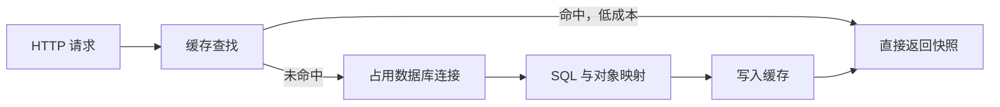
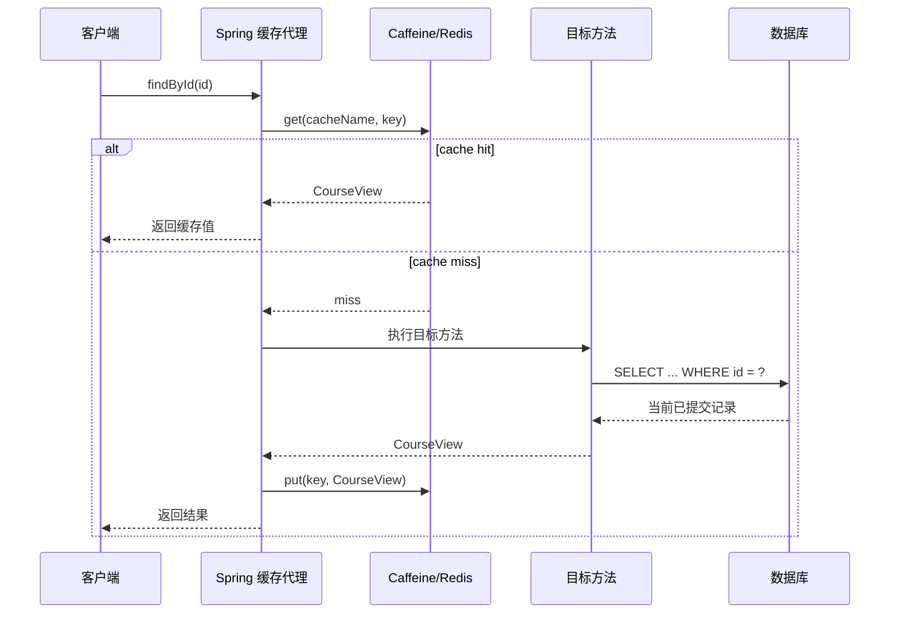
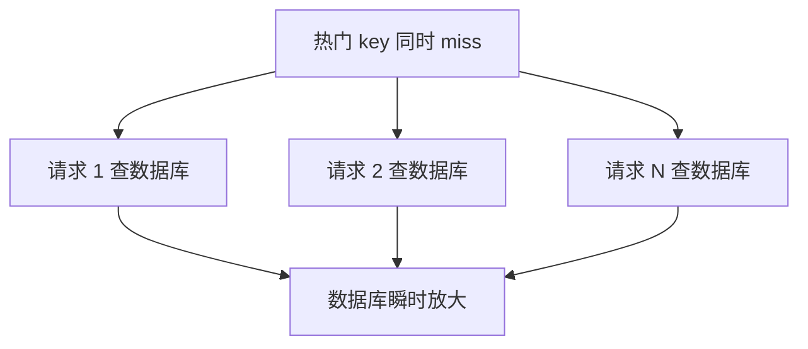
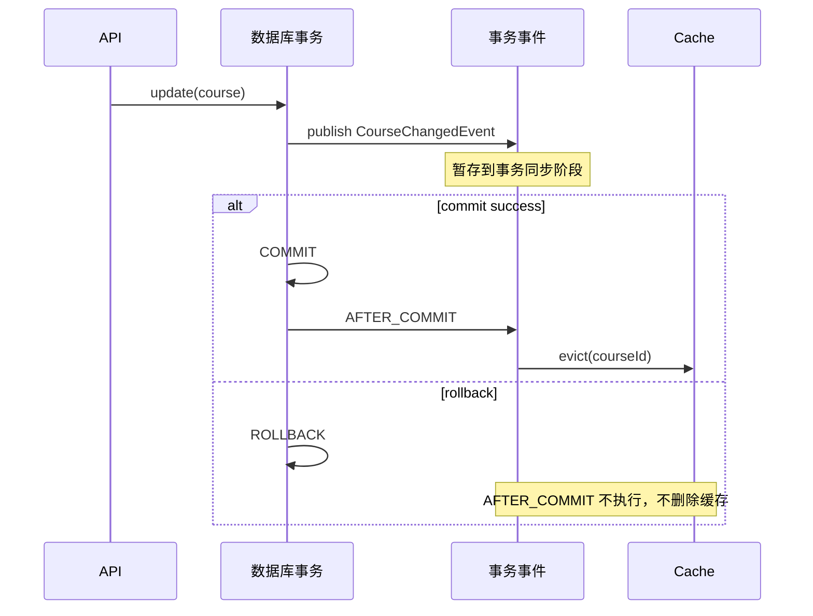

# Spring Boot 缓存抽象、Caffeine、Redis 与缓存一致性

上一课解决了大结果集查询与批量写入，但即使 SQL 和索引正确，频繁读取同一条热门数据仍会重复占用数据库连接、执行计划、CPU 和网络。缓存把一部分重复读取转移到更快的存储，却也引入一个数据库单独使用时不存在的问题：**同一份业务事实出现了多个副本**。

这一课不把 `@Cacheable` 当作“性能注解”背诵，而是沿着真实调用链回答：缓存何时命中、方法为何没有执行、写事务何时才能安全失效缓存、Caffeine 与 Redis 的一致性边界在哪里，以及缓存故障时系统应该怎样退化。

## 1. 版本、环境与学习目标

本课示例基于：

- Spring Boot 4.1.0。
- Spring Framework 7.0.8。
- Spring Data Redis 4.1.0。
- Java 17 编译目标；本地可使用 JDK 25 构建运行。
- Maven 3.9.16。
- 默认缓存实现为进程内 Caffeine；`redis` Profile 切换为 Redis。
- H2 只承担可重复运行的数据源，缓存原理不依赖 H2 方言。

完成本课后，应能解释：

- Cache、Buffer、数据库索引、HTTP 缓存和会话存储的边界。
- cache-aside 一次 miss 和一次 hit 的完整因果链。
- Spring Cache 抽象、`CacheManager` 与具体 provider 的分工。
- 为什么同类内部调用会绕过 `@Cacheable`。
- key、TTL、TTI、容量淘汰分别控制什么。
- Caffeine 与 Redis 在进程、网络和多节点上的差异。
- `@Cacheable`、`@CachePut`、`@CacheEvict` 的准确语义。
- 缓存穿透、击穿、雪崩不是同一个问题。
- 为什么数据库事务与缓存写入不能仅靠注解变成原子操作。
- 怎样在数据库提交后失效缓存，并认识仍然存在的故障窗口。

## 2. 为什么数据库已经有索引还需要缓存

索引减少数据库需要扫描的数据，但一次索引查询仍可能经历：

1. 从连接池借出连接。
2. 客户端把 SQL 与参数发给数据库。
3. 数据库解析或复用执行计划。
4. 访问 buffer pool、索引页和数据页。
5. 执行可见性判断、锁或 MVCC 规则。
6. 序列化结果并通过网络返回。
7. JDBC 转换结果，JPA 创建对象。
8. 归还连接。

如果一门热门课程一分钟被读取十万次，却一天只修改一次，上述大部分工作都在重复计算同一个结果。缓存利用的是这种**局部性**：短时间内相同 key 被反复访问。



缓存提升吞吐的因果链是：

```text
重复 key 多
→ 命中率提高
→ 进入数据库的请求减少
→ 连接池竞争和数据库 CPU 降低
→ 尾延迟更稳定
```

如果 key 几乎从不重复、数据每次都不同，缓存只会多做一次查找和序列化，并消耗内存。

## 3. 缓存的准确边界

### 3.1 Cache 不是数据源

本课使用数据库作为 source of truth，缓存保存的是可丢弃的派生副本。缓存清空后，系统仍应能从数据库重建结果。

如果一份数据只存在 Redis，Redis 就是该数据的数据源，而不只是缓存。此时持久化、备份和恢复要求完全不同。

### 3.2 Cache 不是 Buffer

Buffer 用于协调生产者与消费者速度，数据通常按流向写入和取走；Cache 让相同数据被重复读取，以避免重复计算或 I/O。

消息队列中的待消费消息是 buffer 的典型例子。课程详情按 ID 重复读取是 cache 的典型例子。

### 3.3 Cache 不是数据库索引

索引仍由数据库维护，并参与查询计划和事务可见性。缓存位于数据库之外，命中时甚至不会进入数据库事务，因此无法自动获得数据库最新提交状态。

### 3.4 方法缓存不是 HTTP 缓存

Spring Cache 默认拦截 Java 方法。浏览器、CDN 的 `Cache-Control`、ETag 与条件请求发生在 HTTP 协议层。两者可以同时使用，但 key、失效范围和安全边界不同。

### 3.5 缓存值应是稳定快照

不要把仍受 JPA Persistence Context 管理的 Entity 直接放入分布式缓存：

- 延迟加载代理脱离 Session 后可能失败。
- 双向关联容易产生巨大对象图。
- Entity 内部变化会模糊缓存快照边界。
- 序列化格式与持久化模型耦合。

示例缓存独立的 `CourseView`，它是已经完成装配的读模型。

## 4. 先判断是否值得缓存

适合缓存的候选通常同时具备：

- 读取明显多于写入。
- 计算或 I/O 成本较高。
- key 有重复访问和热点。
- 结果在一段时间内稳定。
- 业务能定义可接受的陈旧窗口。
- 缓存故障时仍有清晰退化路径。

以下场景应谨慎：

- 银行余额扣款前的最终判断。
- 库存最后一件的强一致决策。
- 每个请求都不同的高基数搜索组合。
- 返回值依赖当前用户权限，却没有把权限维度放进 key。
- 数据更新频率高于重复读取频率。
- 单个值很大，序列化与网络成本接近源查询成本。

缓存不是默认优化。应先测量数据库负载、P50/P95/P99、重复 key 比例和可接受陈旧时间。

## 5. Cache-aside：本课采用的模式

Cache-aside 又称 lazy loading：应用先查缓存，miss 时自己读取数据库并回填。



注意：缓存命中时，目标方法不执行。方法里的日志、计数、数据库事务和副作用也不会执行。因此 `@Cacheable` 方法应尽量是无副作用的查询。

## 6. Cache-aside 与相邻模式的区别

### 6.1 Read-through

调用方只面对缓存，缓存实现知道怎样调用 loader。Spring 的 `@Cacheable` 从业务代码观感上类似 read-through，但 miss 后的方法调用由 Spring 拦截器组织，source loader 仍属于应用。

### 6.2 Write-through

写操作同步写缓存和持久存储。它能让缓存快速获得新值，但两个系统间仍可能只成功一个；除非使用同一个事务资源，否则没有天然原子性。

### 6.3 Write-behind

先写缓存，稍后异步写数据库。写延迟低，但缓存故障可能丢失尚未持久化的数据，冲突、重试和顺序要求更高。普通 Spring Cache 注解并不会自动提供可靠 write-behind。

### 6.4 Refresh-ahead

条目到期前异步刷新，减少热门 key 到期时的用户等待。它需要预测热点、处理刷新失败，并不等于普通 TTL。

## 7. Spring Cache 是抽象，不是存储

核心接口是：

- `Cache`：针对一个命名缓存执行 get、put、evict、clear。
- `CacheManager`：按名称取得和管理多个 Cache。
- `KeyGenerator`：将方法参数转换为 key。
- `CacheResolver`：在运行时决定使用哪些 Cache。
- `CacheErrorHandler`：决定缓存读写异常如何处理。

注解描述意图，provider 决定实际能力：

```text
@Cacheable
  ↓
CacheInterceptor / CacheAspectSupport
  ↓
CacheManager
  ↓
CaffeineCache 或 RedisCache
  ↓
本机堆内存 或 Redis 网络命令
```

Spring Cache 不统一规定 TTL、容量算法、持久化、复制或分布式锁。它只提供可替换的调用协议。

## 8. 为什么必须启用缓存

仅添加 `@Cacheable` 不会改变程序行为。`@EnableCaching` 注册必要的基础设施，Spring 才会为符合条件的 Bean 创建代理。

示例把它放在独立配置类，而不是主启动类：

<<< ../../../examples/java/spring-boot-cache-consistency/src/main/java/learning/backend/cache/config/CachingConfiguration.java{java:line-numbers} [CachingConfiguration.java]

独立配置的好处是：测试或特定环境可以明确替换为 `NoOpCacheManager`，不会让缓存成为主类不可拆除的隐式条件。

## 9. 代理执行链与自调用陷阱

默认 `mode=proxy`。外部对象拿到的是代理引用：

```text
Controller → CourseQueryService 代理 → CacheInterceptor → 目标对象
```

若目标类内部调用 `this.findById(id)`：

```text
目标对象 → this.findById(id)
```

这条调用没有重新经过代理，所以缓存、事务、异步等基于代理的 advice 都不会运行。

正确做法是把可缓存查询提取到独立 Bean，让调用天然跨 Bean 边界。不要为了“绕回代理”而依赖 `AopContext.currentProxy()`；它会把业务代码与 AOP 基础设施耦合。

同样要记住：`private`、`final` 方法或无法被代理覆盖的方法不适合作为代理 advice 的连接点。

## 10. 默认 key 怎样生成

Spring 默认 `SimpleKeyGenerator` 规则：

- 无参数：`SimpleKey.EMPTY`。
- 一个参数：直接使用该参数。
- 多个参数：包含全部参数的 `SimpleKey`。

只有当所有影响返回值的输入都进入 key，缓存才正确。以下 key 是错误的：

```java
@Cacheable(cacheNames = "prices", key = "#productId")
Price findPrice(UUID productId, Currency currency)
```

如果 USD 与 CNY 返回不同，`currency` 也必须进入 key。

还要考虑：

- tenantId。
- locale。
- 权限或可见性版本。
- 数据模型/序列化版本。
- 查询条件的标准化顺序。

缓存 key 是协议。发布新版本时随意改变其含义，可能让新旧实例互相读取不兼容值。

## 11. 示例的查询边界

查询服务只负责描述缓存意图：

<<< ../../../examples/java/spring-boot-cache-consistency/src/main/java/learning/backend/cache/catalog/CourseQueryService.java{java:line-numbers} [CourseQueryService.java]

执行顺序：

1. Controller 调用代理。
2. SpEL 从参数取得 `id`。
3. 在 `course-by-id` 中查找该 UUID。
4. hit：直接返回 `CourseView`。
5. miss：只允许一个加载者调用 `CourseLoader`。
6. loader 从数据库读取并创建快照。
7. 成功结果写入缓存。
8. 异常直接抛出，不写入普通值。

`CourseLoader` 单独统计真实数据库加载次数，便于观察缓存是否真的减少 source load：

<<< ../../../examples/java/spring-boot-cache-consistency/src/main/java/learning/backend/cache/catalog/CourseLoader.java{java:line-numbers} [CourseLoader.java]

生产指标不应在业务代码里用 AtomicLong 自制；这里的计数器只为让因果链可观察。

## 12. `@Cacheable` 的边界

`@Cacheable` 表示：命中时跳过方法；miss 时执行方法，并把正常结果放入缓存。

常用属性：

- `cacheNames`：命名缓存区域。
- `key`：SpEL key。
- `keyGenerator`：复杂或复用 key 规则。
- `condition`：调用前判断是否参与缓存。
- `unless`：调用后根据结果否决写入。
- `sync`：请求 provider 对同 key 的加载进行同步。

`condition` 与 `unless` 的时间不同：

```text
condition=false → 不查、不写缓存，直接执行方法
unless=true     → 已执行方法，但不缓存结果
```

`sync=true` 有约束：只能指定一个 cache，不能组合其他缓存操作，也不能使用 `unless`。这不是分布式锁承诺，最终语义仍取决于 provider。

## 13. `@CachePut` 不是“强制刷新 @Cacheable”

`@CachePut` 总会执行方法，并把结果写入缓存。它适合明确的回填流程，但不跳过业务执行。

不要在同一方法上随意组合 `@Cacheable` 与 `@CachePut`：前者可能跳过方法，后者要求方法必定执行，控制流意图冲突。

更新数据库时直接 `@CachePut` 还存在事务时序风险：方法返回结果不代表事务一定已经提交。如果之后提交失败，缓存可能已经保存数据库中不存在的新值。

## 14. `@CacheEvict` 的边界

`@CacheEvict` 删除一个 key 或整个 cache：

- 默认在方法正常返回后执行。
- 方法抛出异常时，默认不删除。
- `beforeInvocation=true` 在方法执行前删除，即使方法失败也已删除。
- `allEntries=true` 清空整个命名缓存，key 会被忽略。

“方法正常返回后”不一定等于“数据库已提交后”。当事务代理和缓存代理叠加时，不应仅凭注解在源码中的视觉顺序推断 advisor 顺序。

## 15. TTL、TTI 和容量淘汰不是一回事

### 15.1 TTL / expire-after-write

从创建或最后一次写入起计时。读取通常不延长寿命。它限制条目最多保留多久，也为失效失败提供最终陈旧上界。

### 15.2 TTI / expire-after-access

每次访问会重置空闲计时。热门条目可以长期存在，冷条目在无人读取后过期。

Redis 原生过期主要是 TTL。Spring Data Redis 的 TTI 类似行为通过读时 `GETEX` 重设 TTL 实现，要求 Redis 6.2+，并要求所有读路径都遵守同一访问规则。

### 15.3 容量淘汰

即使条目没有到期，缓存达到容量约束时也要选择牺牲者。Caffeine 使用基于访问模式的高性能淘汰策略；Redis 的 maxmemory policy 是服务端全局配置。

### 15.4 显式失效

业务写入成功后主动删除 key。它降低正常情况下的陈旧窗口，但不能替代 TTL，因为失效命令本身也可能失败。

## 16. 为什么 TTL 不能独自决定正确性

假设课程标题允许最多陈旧 10 分钟，TTL=10m 可以成为安全网。但如果订单支付状态必须立即反映，10 分钟 TTL 就不能满足业务。

TTL 应从**业务可容忍陈旧时间**推导，而不是从框架默认值或“常用 30 分钟”复制。

同时考虑：

- 短 TTL：命中率降低，数据库 miss 峰值提高。
- 长 TTL：失效失败后的陈旧时间更长。
- 同时到期：大量 key 可能一起回源。
- 永不过期：逻辑错误或失效失败可能永久暴露旧值。

## 17. Caffeine：进程内本地缓存

Caffeine 把值保存在当前 JVM 堆内：

```text
请求线程 → Caffeine → Java 对象
```

优势：

- 没有网络往返。
- 不需要序列化/反序列化。
- 延迟极低。
- Redis 故障不会影响本地查找。

代价：

- 每个实例都有独立副本。
- 重启后缓存全部丢失并重新预热。
- 占用应用堆，可能增加 GC 压力。
- 一个实例失效 key 不会自动通知其他实例。

示例配置固定 cache 名、最大 500 条、写入后 10 分钟到期，并记录 Caffeine stats：

<<< ../../../examples/java/spring-boot-cache-consistency/src/main/java/learning/backend/cache/config/LocalCacheConfiguration.java{java:line-numbers} [LocalCacheConfiguration.java]

这里用 `maximumSize` 限制条目数。如果对象大小差异巨大，应考虑权重而非简单数量。

## 18. Redis：远程共享缓存

Redis 运行在应用进程之外：

```text
请求线程 → Lettuce 连接 → 网络 → Redis → 网络 → 反序列化
```

优势：

- 多个应用实例共享缓存内容。
- 可集中设置内存和淘汰策略。
- 应用重启不必丢失全部热数据。
- 一个实例删除共享 key，其他实例后续读取也会 miss。

代价：

- 每次访问多一次网络调用。
- 需要连接、超时、序列化和容量运维。
- Redis 故障可能进入请求关键路径。
- 热 key 会集中压到同一个 Redis shard。
- 共享不等于数据库与 Redis 原子一致。

示例用 `redis` Profile 切换 provider：

<<< ../../../examples/java/spring-boot-cache-consistency/src/main/java/learning/backend/cache/config/DistributedCacheConfiguration.java{java:line-numbers} [DistributedCacheConfiguration.java]

启动方式：

```bash
mvn spring-boot:run -Dspring-boot.run.profiles=redis
```

此时要求本机 `localhost:6379` 有 Redis。默认模式不连接 Redis，便于无外部服务学习。

## 19. Redis key 前缀为什么重要

示例 key 的逻辑结构是：

```text
learning:v1:course-by-id::<UUID>
```

前缀同时隔离：

- 应用或业务域：`learning`。
- 缓存协议版本：`v1`。
- cache name：`course-by-id`。
- 业务 key：UUID。

不要关闭 cache name 前缀后让两个缓存都写裸 UUID，否则相同 key 可能读取到完全不同类型的值。

## 20. 序列化也是协议

Spring Data Redis 默认使用 String key 和 JDK 序列化 value。本例让 `CourseView` 实现 `Serializable`，确保默认配置可运行：

<<< ../../../examples/java/spring-boot-cache-consistency/src/main/java/learning/backend/cache/catalog/CourseView.java{java:line-numbers} [CourseView.java]

但生产系统不应不加评估地长期使用 Java 原生序列化：

- 非 Java 服务难以消费。
- 类名与 serialVersionUID 形成兼容约束。
- 数据不易人工检查。
- 反序列化不可信数据存在安全风险。

跨语言或长期缓存通常选择有版本契约的 JSON、Protobuf 等格式，并在 key 中加入 schema/version。切换 serializer 前要设计双读、清空或版本前缀迁移，不能让新代码直接读取旧字节。

## 21. 本地与分布式不是简单的开发/生产开关

| 维度 | Caffeine | Redis |
| --- | --- | --- |
| 位置 | 单 JVM 堆 | 独立服务 |
| 访问成本 | 方法调用 | 网络与序列化 |
| 多实例共享 | 否 | 是 |
| 重启保留 | 否 | 通常是 |
| 容量影响 | 应用堆与 GC | Redis 内存 |
| 失效传播 | 需额外机制 | 共享 key 天然可见 |
| 故障模式 | 进程局部 | 基础设施级 |

小型单实例服务可以只用 Caffeine。多实例并不必然只能用 Redis：若数据允许每实例短暂不同，本地 cache 配合短 TTL 仍可能足够。选择由一致性、延迟和运维成本共同决定。

## 22. 缓存击穿：同一个热 key 到期

一个热门 key 到期瞬间，许多请求同时 miss 并回源，叫 stampede 或热点击穿。



示例使用：

```java
@Cacheable(cacheNames = CourseCaches.BY_ID, key = "#id", sync = true)
```

对 Caffeine，这能把当前实例内同 key 的并发加载合并为一个。它不能保证多个 JVM 只回源一次。Redis provider 的 `sync` 也不应被误解为跨集群的业务分布式锁承诺。

多节点热点可考虑：

- 分布式 single-flight/互斥锁，并设置锁 TTL。
- 逻辑过期，后台刷新旧值。
- 提前刷新与随机抖动。
- 对数据库做限流和隔离。
- 允许短时间返回旧值的 stale-while-revalidate。

## 23. 缓存穿透：查询根本不存在的 key

攻击者或错误客户端不断查询随机 UUID，缓存持续 miss，数据库持续收到“不存在”查询，这叫穿透。

本例抛出的 `CourseNotFoundException` 不会被普通 `@Cacheable` 缓存，因此连续查询不存在 ID 会连续回源。测试明确验证这一点。

缓解策略：

- 严格校验 key 格式和访问权限。
- 对不存在结果写短 TTL sentinel。
- 使用布隆过滤器快速排除确定不存在的 key。
- 限流、配额和异常模式告警。

负缓存必须比正缓存更短。否则记录刚创建后仍会被“此前不存在”的 sentinel 遮挡。

## 24. 缓存雪崩：大量 key 或整个缓存同时失效

雪崩不是单个热 key，而是大量 key 在相近时间失效，或 Redis 整体不可用，导致回源流量集中冲击数据库。

缓解策略：

- TTL 加随机抖动，避免整点同时到期。
- 分批预热，而非一次灌满并设置同 TTL。
- 数据库回源限流、舱壁和熔断。
- Redis 高可用与容量告警。
- 对少数极热只读数据保留合理本地一级缓存。
- 明确降级响应，而不是无限等待缓存超时。

缓存故障时“绕过缓存”会把全部流量导向数据库，因此 fail-open 也必须有回源容量保护。

## 25. 一致性问题从哪里产生

没有缓存时，一条数据主要由数据库事务管理。加入 cache-aside 后至少有两个副本：

```text
Database: 新值
Cache:    旧值、空值或新值
```

数据库提交和 Redis/Caffeine 操作属于两个资源。普通本地事务只能控制数据库连接，不能让以下两步天然原子：

1. COMMIT database。
2. DEL cache key。

任何一步之间进程都可能崩溃、网络可能超时。所以“绝对永远一致”需要改变架构或接受更高协议成本，而不是再加一个注解。

## 26. 更新缓存还是删除缓存

Cache-aside 写路径通常选择：

```text
更新数据库 → 提交成功 → 删除缓存
```

而不是：

```text
更新数据库 → 计算并写缓存新值
```

删除更稳健的原因：

- 下一次读取从 source of truth 重建完整快照。
- 写请求不必知道所有读模型形态。
- 不会遗漏由数据库触发器、默认值或其他表共同决定的字段。
- 并发写入时，直接写 cache 更容易让旧事务覆盖新值。
- 只缓存真正被读取的 key。

删除不是万能的。删除失败仍会留下旧值，因此还需要 TTL、重试或可靠事件。

## 27. 为什么“先删缓存，再写数据库”有竞态

考虑顺序：

```text
写线程删除 cache
读线程 miss，读到数据库旧值
读线程把旧值回填 cache
写线程提交数据库新值
```

最终数据库是新值，缓存却是旧值。延迟双删只能缩小某些窗口，不能凭固定 sleep 获得严格正确性。

本课选择提交后删除：读线程最多在提交前回填旧值，提交后的失效会再次删除它。

## 28. 为什么普通 `@CacheEvict` 仍需小心

假设方法上同时有 `@Transactional` 与 `@CacheEvict`。缓存失效发生在方法返回附近，而数据库 commit 由事务拦截器包裹。advisor 顺序若不显式保证，就可能出现：

```text
目标方法返回
→ 删除缓存
→ 另一个读线程 miss 并读到尚未提交的旧值
→ 回填旧值
→ 数据库提交新值
```

所以示例把“业务写入”和“提交后副作用”拆开。

## 29. 示例写路径

命令服务只在数据库事务中修改 Entity，并发布领域变化事件：

<<< ../../../examples/java/spring-boot-cache-consistency/src/main/java/learning/backend/cache/catalog/CourseCommandService.java{java:line-numbers} [CourseCommandService.java]

发布事件时事务尚未提交。事件不是“已经成功”的事实，只是一条候选通知。

## 30. `AFTER_COMMIT` 为什么更准确

失效监听器绑定到 `TransactionPhase.AFTER_COMMIT`：

<<< ../../../examples/java/spring-boot-cache-consistency/src/main/java/learning/backend/cache/catalog/CourseCacheInvalidator.java{java:line-numbers} [CourseCacheInvalidator.java]

执行链：



回滚时缓存仍保留此前已提交值，避免无意义 miss；提交成功后删除，下一次读会装载新值。

## 31. `AFTER_COMMIT` 仍然不是最终可靠消息

仍存在故障窗口：

```text
数据库 COMMIT 成功
→ 进程在删除缓存前崩溃
→ 旧缓存继续存在直到 TTL
```

监听器里的 Redis 调用失败也不能回滚已经完成的数据库事务。示例记录错误，让请求不会假装数据库回滚；TTL 是最终陈旧上界。

更强要求需要：

- Transactional outbox：业务更新与 outbox 行在同一数据库事务提交。
- 独立 relay 重试发布失效事件。
- 消费者幂等删除 cache key。
- 监控 outbox backlog 和最大延迟。
- 或用 CDC 从数据库日志驱动失效。

这仍通常提供最终一致，而不是跨数据库与缓存的线性一致读取。

## 32. 多实例下的失效传播

### 32.1 Redis 共享缓存

所有实例访问同一个逻辑 key。实例 A 删除后，实例 B 下一次访问也会 miss。仍需考虑复制延迟、故障切换和客户端读写拓扑。

### 32.2 每实例 Caffeine

实例 A 只能删除自己的堆内条目；实例 B、C 仍保留旧值。可选策略：

- 短 TTL，接受有界不一致。
- 通过 Kafka/Redis Pub/Sub 广播失效事件。
- 用版本号拒绝旧事件覆盖新状态。
- 改用共享 Redis。
- 两级缓存时同时处理 L1 与 L2 失效顺序。

本例默认 Caffeine 用于单实例学习。不能把测试通过外推为多实例一致。

## 33. 两级缓存为什么更复杂

L1 Caffeine + L2 Redis 的读延迟可能更低：

```text
L1 miss → L2 hit → 返回
L2 miss → DB → 回填 L2 → 回填 L1
```

但写入后必须让所有节点 L1 失效。若只删 Redis，节点仍可能从 L1 返回旧值；若先广播 L1 删除、再删 L2，广播期间又可能从旧 L2 回填。

两级缓存需要明确事件版本、顺序、重复投递、丢失恢复和 TTL。没有数据证明前，不要为了“架构高级”默认增加第二层。

## 34. 数据库事务隔离与缓存读取

缓存命中绕过数据库，因此不参与当前事务隔离级别。即使事务声明 `REPEATABLE_READ`，缓存值也不是数据库为该事务维护的快照。

在一个需要一致快照的写事务中，若先从 cache 读 A、再从数据库读 B，可能组合出数据库中从未同时存在过的状态。

工程上通常：

- 强一致决策直接读数据库并加必要约束/锁。
- 缓存只服务展示、推荐、目录等允许陈旧的读模型。
- 明确区分 query model 与 command validation。

## 35. 并发更新与版本

示例 Entity 使用 `@Version`。两个写事务同时修改课程时，后提交的旧版本会触发乐观锁异常，防止静默覆盖数据库。

但 `@Version` 不会自动清理缓存。成功提交的事务仍要发送失效事件；失败事务不能触发 `AFTER_COMMIT`。

如果失效事件异步传递，事件应携带 entity version 或 updatedAt，让消费者能识别乱序消息。

## 36. 错误处理：缓存失败时该失败还是降级

三种常见选择：

- fail-fast：缓存异常使请求失败，保护数据库但降低可用性。
- fail-open：缓存 get 失败后直接查数据库，提升可用性但可能压垮 source。
- stale fallback：保留最近值，明确标注或限制使用场景。

Spring 可通过 `CacheErrorHandler` 自定义 get、put、evict、clear 异常。不能用一个全局规则处理所有缓存：

- 商品详情可 fail-open。
- 权限撤销缓存不应继续返回旧授权。
- 限流计数器若被误当 cache，失败语义完全不同。

无论选择哪种，都要有超时、指标、日志和回源限流。

## 37. 防止缓存值泄露权限数据

如果响应因用户不同而不同，却只按资源 ID 缓存：

```text
key = documentId
```

管理员首次加载的完整数据可能被普通用户命中。可选解决：

- 缓存不含敏感字段的公共读模型，权限判断始终在缓存之外。
- 把 tenant/permission scope 纳入 key。
- 分离不同安全级别的 cache name。
- 权限撤销使用更严格的失效和短 TTL。

不要把 JWT、密码、私钥、一次性令牌或完整个人敏感信息无边界地放入共享缓存。

## 38. 缓存集合查询为何更难失效

单实体 key：

```text
course-by-id::<id>
```

更新该课程只需删一个 key。若缓存以下列表：

```text
search::category=BACKEND&sort=price&page=0
```

一条课程更新可能影响许多筛选、排序和页面。精确枚举所有受影响 key 很困难。

策略包括：

- 不缓存高基数组合查询。
- 缓存底层实体，列表只缓存 ID。
- 使用短 TTL。
- 用版本化 namespace 一次切换逻辑版本。
- 对小型数据集失效整个区域，但要评估雪崩。

## 39. 预热不是越多越好

预热把数据提前写入 cache，减少发布后的冷启动 miss。但全量预热可能：

- 把永远不会访问的数据装入内存。
- 挤出真正热点。
- 发布时冲击数据库。
- 所有条目同时设置 TTL，制造未来雪崩。

更合理的是根据历史热度分批预热，加入 TTL 抖动，并监控预热命中收益。

## 40. 可观测性要回答什么

至少监控：

- request rate 与请求延迟。
- hit、miss、hit ratio。
- load success、load failure、load duration。
- eviction count 与原因。
- cache size/weight。
- Redis 网络耗时、连接池、超时和错误。
- 数据库 QPS、连接池等待和慢查询。
- 失效事件失败/积压。

`hit ratio=99%` 不一定好：可能缓存了本来只需 50 微秒的计算，却每次支付 Redis 网络成本。必须同时观察端到端延迟和 source load。

示例提供诊断端点，只显示 provider 与数据库加载计数：

```http
GET /api/catalog/courses/cache-diagnostics
```

生产环境应使用 Micrometer/Actuator 指标，并限制管理端点暴露。

## 41. 示例项目结构

```text
spring-boot-cache-consistency/
├── pom.xml
└── src
    ├── main
    │   ├── java/learning/backend/cache
    │   │   ├── CacheConsistencyApplication.java
    │   │   ├── config
    │   │   │   ├── CachingConfiguration.java
    │   │   │   ├── LocalCacheConfiguration.java
    │   │   │   └── DistributedCacheConfiguration.java
    │   │   └── catalog
    │   │       ├── CourseQueryService.java
    │   │       ├── CourseCommandService.java
    │   │       ├── CourseCacheInvalidator.java
    │   │       └── ...
    │   └── resources
    │       ├── application.yaml
    │       └── db/migration
    └── test
        └── java/.../CacheConsistencyApplicationTest.java
```

完整依赖如下：

<<< ../../../examples/java/spring-boot-cache-consistency/pom.xml{xml:line-numbers} [pom.xml]

`starter-cache` 提供 Spring 缓存集成，Caffeine 是默认 provider，`starter-data-redis` 提供 Redis 连接与 `RedisCacheManager`。

## 42. 数据模型与迁移

课程表由 Flyway 创建并插入固定 UUID，确保 curl 和测试可复现：

<<< ../../../examples/java/spring-boot-cache-consistency/src/main/resources/db/migration/V1__create_catalog_course.sql{sql:line-numbers} [V1__create_catalog_course.sql]

应用使用 `ddl-auto=validate`，JPA 只校验映射，不在运行时偷偷修改 schema。

## 43. API 运行过程

Controller 不直接操作 Cache：

<<< ../../../examples/java/spring-boot-cache-consistency/src/main/java/learning/backend/cache/catalog/CourseController.java{java:line-numbers} [CourseController.java]

查询：

```http
GET /api/catalog/courses/40000000-0000-0000-0000-000000000001
```

更新：

```http
PUT /api/catalog/courses/40000000-0000-0000-0000-000000000001
Content-Type: application/json

{
  "title": "Spring Boot 缓存与一致性",
  "priceCents": 15900
}
```

更新成功提交后，事件监听器删除对应 key。下一次 GET 才读取数据库并回填新快照。

## 44. 与 JavaScript/Vue 经验对照

可以把 `@Cacheable` 类比为一个按参数 memoize 的函数包装器：

```javascript
const cachedFind = memoize(findById)
```

但后端缓存有更多边界：

- 多线程可能同时 miss。
- 多个 JVM 进程并不共享堆内 Map。
- Redis 访问需要网络与序列化。
- 数据库事务提交与 cache 操作不是同一原子步骤。
- key 可能包含 tenant、权限、locale。
- 缓存陈旧可能影响所有用户，而非单个浏览器状态。

Vue 的 computed 依赖响应式系统自动追踪依赖；Spring Cache 不知道数据库哪行变了，失效关系必须由应用明确表达。

## 45. 自动化测试验证什么

测试不是只检查 HTTP 200，而是检查缓存执行语义：

<<< ../../../examples/java/spring-boot-cache-consistency/src/test/java/learning/backend/cache/catalog/CacheConsistencyApplicationTest.java{java:line-numbers} [CacheConsistencyApplicationTest.java]

覆盖：

1. 同 key 连续读取只加载数据库一次。
2. 8 个线程同时 miss 时，Caffeine + `sync=true` 只触发一次加载。
3. 提交成功后 cache 被删除，下一读得到新值并回源一次。
4. 事务回滚后 `AFTER_COMMIT` 不执行，缓存保留已提交旧值。
5. 异常默认不作为普通结果缓存，不存在 ID 连续回源。
6. HTTP 404 使用稳定错误结构。

并发测试只证明当前 JVM 内 Caffeine 的行为，不证明多 JVM 或 Redis 集群只加载一次。

## 46. 本地运行

```bash
cd examples/java/spring-boot-cache-consistency
mvn clean test
mvn spring-boot:run
```

连续请求两次：

```bash
curl -sS http://localhost:18087/api/catalog/courses/40000000-0000-0000-0000-000000000001
curl -sS http://localhost:18087/api/catalog/courses/40000000-0000-0000-0000-000000000001
curl -sS http://localhost:18087/api/catalog/courses/cache-diagnostics
```

诊断结果的 `databaseLoads` 应只增加一次。应用重启会重建 H2 和本地 Caffeine，因此计数与缓存都会归零。

## 47. 使用 Redis Profile

先启动 Redis 6.2+，再运行：

```bash
mvn spring-boot:run -Dspring-boot.run.profiles=redis
```

当前配置没有启用 TTI，因此 Redis 6.2 不是本例固定 TTL 的硬要求；只有采用 Spring Data Redis `enableTimeToIdle()` 时才要求 `GETEX` 支持。

不要把 Redis 密码提交到 `application.yaml`。生产环境使用环境变量、配置中心或 secret manager，并开启网络隔离、认证和 TLS（按部署环境要求）。

## 48. 常见故障：注解存在但每次都查数据库

检查：

1. 是否启用了 `@EnableCaching`。
2. Bean 是否由 Spring 管理。
3. 调用是否来自 Bean 外部，而非 `this.findById()`。
4. 方法和类是否可被代理。
5. key 是否每次实际不同。
6. provider 是否是 NoOp。
7. 条目是否立即过期或因容量被淘汰。
8. 返回是否抛异常或被 `unless` 排除。

先记录 source load 与 cache stats，再判断是否“没有命中”。

## 49. 常见故障：更新后仍读到旧值

按顺序检查：

1. 更新是否真的提交，而非随后回滚。
2. 失效 key 与查询 key 是否完全一致。
3. cache name 是否一致。
4. 是否只删除当前实例 Caffeine，而流量落到另一实例。
5. 是否有列表、详情等多个缓存副本。
6. 是否发生提交成功、失效失败。
7. 是否从 Redis replica 读取并存在复制延迟。
8. 是否有旧并发请求在失效后回填旧值。

不要用“手工清 Redis 后好了”替代根因分析。

## 50. 常见故障：Redis 一慢，接口比数据库还慢

原因可能是：

- key 缺乏重复，命中率低。
- value 太大，序列化成本高。
- Redis 与应用跨地域。
- 每次方法调用执行多个 cache name 查找。
- timeout 过长，失败后又回源数据库。
- 连接池耗尽。
- 热 key 或单 shard 达到瓶颈。

缓存查找本身也属于请求预算。为 Redis 设置连接与命令超时，并观察 P99，而不是只看平均值。

## 51. 常见故障：清空 cache 导致数据库报警

全量 `clear` 会把正常 hit 瞬间变成 miss。处理：

- 优先精确 key 失效。
- 大范围版本切换时分批预热。
- 对回源并发限流。
- TTL 加抖动。
- 设计 capacity planning，确认数据库可承受冷启动。

Spring Data Redis 默认清理策略可能使用 `KEYS` + `DEL`；大 keyspace 上 `KEYS` 有性能风险，可配置基于 `SCAN` 的 batch strategy，并验证所用 driver 与集群模式支持。

## 52. 生产设计清单

- 明确 source of truth。
- 记录为何需要缓存和预期收益。
- 为每个 cache 定义 owner 与数据分类。
- key 包含所有影响结果的维度。
- key 有应用、cache、schema 版本前缀。
- value 是独立读快照，不是 JPA Entity。
- TTL 从陈旧容忍度推导，并加入合理抖动。
- 有容量上限和淘汰策略。
- 更新成功后失效，而不是依赖永久 TTL。
- 事务回滚不会发布成功失效。
- 接受并记录 commit 后失效失败窗口。
- 强要求采用 outbox/CDC 和幂等消费。
- 多实例 Caffeine 有失效传播或短 TTL 策略。
- 热 key 有 single-flight 或回源限流。
- 不存在 key 有穿透保护。
- 缓存整体故障有雪崩保护。
- 监控 hit/miss、load、eviction、size 和端到端延迟。
- Redis 有超时、认证、网络隔离和容量告警。
- 敏感/权限数据不会因错误 key 跨用户泄露。
- 发布前验证 serializer 和旧缓存兼容性。

## 53. 本节总结

- 缓存用空间和一致性复杂度换取重复读取的低延迟。
- Spring Cache 是方法级抽象，provider 决定真正存储与并发能力。
- cache hit 会跳过目标方法，所以可缓存方法应无副作用。
- 代理模式下同类自调用绕过缓存 advice。
- key 必须包含所有影响结果的维度，并作为版本化协议管理。
- TTL、TTI、容量淘汰和业务失效解决不同问题。
- Caffeine 延迟低但局限于单 JVM；Redis 可共享但增加网络与运维成本。
- `sync=true` 可合并 provider 支持范围内的同 key 加载，不等于跨节点锁。
- 穿透、击穿和雪崩的流量形态与治理手段不同。
- cache-aside 通常在数据库提交成功后删除 key，而不是直接写新缓存值。
- `AFTER_COMMIT` 避免回滚时错误失效，但无法消除 commit 后崩溃窗口。
- TTL 是安全网；outbox/CDC、重试、幂等和监控用于更可靠的最终一致。
- 强一致业务判断应回到数据库约束与事务，不应相信可能陈旧的缓存副本。

下一节：[Spring Boot 异步任务、线程池、定时调度、上下文传播与优雅停机](/backend/spring-boot/async-execution-scheduling-context-and-graceful-shutdown)。

## 54. 参考资料

- [Spring Framework：Cache Abstraction](https://docs.spring.io/spring-framework/reference/integration/cache.html)
- [Spring Framework：缓存注解](https://docs.spring.io/spring-framework/reference/integration/cache/annotations.html)
- [Spring Framework：缓存存储配置与 Caffeine](https://docs.spring.io/spring-framework/reference/integration/cache/store-configuration.html)
- [Spring Framework：AOP Proxy 与自调用](https://docs.spring.io/spring-framework/reference/core/aop/proxying.html)
- [Spring Framework：Transaction-bound Events](https://docs.spring.io/spring-framework/reference/data-access/transaction/event.html)
- [Spring Boot：Caching](https://docs.spring.io/spring-boot/reference/io/caching.html)
- [Spring Data Redis：Redis Cache](https://docs.spring.io/spring-data/redis/reference/redis/redis-cache.html)
- [Redis：Cache-aside](https://redis.io/docs/latest/develop/use-cases/cache-aside/)
- [Caffeine：Eviction](https://github.com/ben-manes/caffeine/wiki/Eviction)
