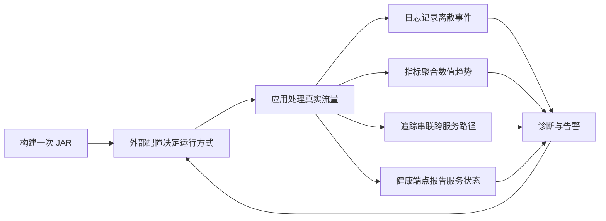
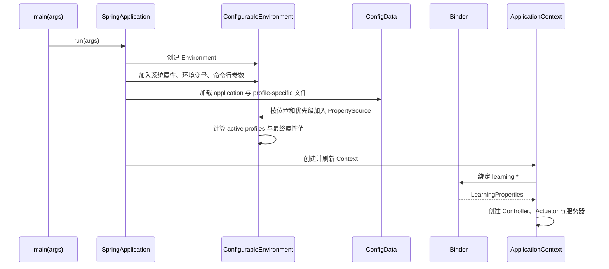

# Spring Boot 配置分层、Profiles、日志、Actuator 与可观测性基础

> 基准环境：Spring Boot 4.1.0、Spring Framework 7.0.8、Maven 3.9.16；Java 17 编译目标。

## 1. 为什么业务 API 写完了还不算“可运行”

上一课的 Controller 能正确接收参数、校验输入并返回错误，但生产服务还必须回答另一组问题：

- 同一份 JAR 如何连接开发、测试和生产环境的不同资源？
- 一个配置同时出现在 YAML、环境变量和命令行时，最终值来自哪里？
- 服务启动失败或请求异常时，怎样留下足够证据？
- 服务进程还在，是否代表它真的能对外服务？
- 延迟变高、错误增多时，怎样在用户投诉前发现？
- 哪些运行信息可以公开，哪些会泄漏密码、路径或内部拓扑？

如果把地址、开关和密码写死在 Java 中，每换环境都要重新编译；如果只打印随意拼接的字符串，机器很难聚合检索；如果监控只看“Java 进程存在”，数据库不可用时流量仍会被送进故障实例。

所以本课不是附加的运维知识，而是在建立后端应用的**运行时控制面和反馈回路**：



## 2. 学习目标

完成本节后，你应该能够：

- 区分配置数据、Spring `Environment`、属性源与 `@ConfigurationProperties`。
- 按优先级解释 YAML、Profile 文件、环境变量、系统属性和命令行参数的覆盖结果。
- 区分 `spring.config.location` 与 `spring.config.additional-location`，理解 `optional:` 的边界。
- 正确使用 Profile、Profile group 和默认配置，不把 Profile 当成秘密管理工具。
- 理解 Boot 日志系统为何早于 ApplicationContext 初始化。
- 正确选择 `TRACE`、`DEBUG`、`INFO`、`WARN`、`ERROR`，避免敏感数据和无界日志量。
- 区分文本日志、结构化日志、指标和分布式追踪。
- 理解 Actuator 的 endpoint、access、exposure 和 HTTP path 是不同概念。
- 添加自定义健康贡献者和 Micrometer Counter。
- 设计低基数指标标签，并理解高基数造成的成本。
- 用测试证明 Profile 覆盖、健康详情和端点暴露边界。

## 3. 完整示例与运行环境

本课项目位于 `examples/java/spring-boot-observability-basics`：

```text
spring-boot-observability-basics/
├── pom.xml
└── src/
    ├── main/
    │   ├── java/learning/backend/observability/
    │   │   ├── ObservabilityApplication.java
    │   │   ├── config/LearningProperties.java
    │   │   ├── health/LearningContentHealthIndicator.java
    │   │   └── runtime/
    │   │       ├── RuntimeInfo.java
    │   │       ├── RuntimeInfoController.java
    │   │       └── RuntimeMetrics.java
    │   └── resources/
    │       ├── application.yaml
    │       ├── application-dev.yaml
    │       ├── application-prod.yaml
    │       └── application-json-logs.yaml
    └── test/java/.../
        ├── ObservabilityEndpointsTest.java
        └── DevelopmentProfileTest.java
```

<<< ../../../examples/java/spring-boot-observability-basics/pom.xml{xml:line-numbers} [pom.xml]

两个 starter 分工明确：

- `spring-boot-starter-webmvc` 提供 MVC 与嵌入式 Servlet 服务器。
- `spring-boot-starter-actuator` 提供生产就绪端点、健康、指标和可观测性自动配置。
- `spring-boot-starter-webmvc-test` 仅在测试范围提供 MockMvc、JUnit 等能力。

Actuator 不是独立监控平台。它在应用进程内产生和暴露运行信息；Prometheus、OpenTelemetry Collector、Grafana 或日志平台负责采集、存储、查询、告警与展示。

## 4. 配置、属性源、Environment 与绑定对象

四个相邻概念不能混用：

| 概念 | 准确边界 | 本课例子 |
| --- | --- | --- |
| 配置数据 | 文件或外部介质中的键值输入 | `application.yaml`、环境变量 |
| `PropertySource` | 一组有名称且有顺序的属性 | system properties、command line |
| `Environment` | 汇总属性源并按优先级查询，也持有 active profiles | Controller 注入的 `Environment` |
| 配置绑定 | 把扁平键转换成类型化 Java 对象 | `learning.*` → `LearningProperties` |

`Environment` 不是操作系统环境变量的别名。OS 环境变量只是它的一个属性源。查询 `learning.greeting` 时，Spring 沿属性源优先级查找，遇到第一个定义就返回；它不会把多个字符串智能合并。

<<< ../../../examples/java/spring-boot-observability-basics/src/main/java/learning/backend/observability/config/LearningProperties.java{java:line-numbers} [LearningProperties.java]

`@ConfigurationProperties("learning")` 把同一命名空间集中成一个 record。相较在很多类中散落 `@Value`，它更适合业务配置：

- 字段形成清晰契约，重命名和查找容易。
- Spring 负责 relaxed binding，例如 `environment-label` 可绑定到 `environmentLabel`。
- 后续可添加类型、默认值与校验。
- 测试可以整体替换配置，而不是逐个 mock 字符串。

入口显式启用这个配置对象：

<<< ../../../examples/java/spring-boot-observability-basics/src/main/java/learning/backend/observability/ObservabilityApplication.java{java:line-numbers} [ObservabilityApplication.java]

## 5. 配置解析的因果链

应用启动时，配置必须早于大部分 Bean 创建，因为自动配置本身也要读取端口、数据源和功能开关。简化过程如下：



因果关系是：配置数据先进入 `Environment`，自动配置和用户 Bean 再查询它，最终才有服务器端口、日志级别和绑定对象。若关键配置无法转换，例如把端口写成 `abc`，启动应失败，而不是带着未知状态继续运行。

## 6. 配置优先级：后加入的高优先级来源覆盖前者

Spring Boot 官方列出了完整 `PropertySource` 顺序。日常排错可先记住这条由低到高的主链：

```text
代码中的默认值
  < 打包进 JAR 的 application.yaml
  < 打包进 JAR 的 application-{profile}.yaml
  < JAR 外的 application.yaml
  < JAR 外的 application-{profile}.yaml
  < 操作系统环境变量
  < Java system property（-D...）
  < 命令行参数（--...）
```

这是实用主链，不替代官方完整列表；测试属性、`SPRING_APPLICATION_JSON`、Servlet 属性等也有各自位置。

本课基础配置：

<<< ../../../examples/java/spring-boot-observability-basics/src/main/resources/application.yaml{yaml:line-numbers} [application.yaml]

开发 Profile：

<<< ../../../examples/java/spring-boot-observability-basics/src/main/resources/application-dev.yaml{yaml:line-numbers} [application-dev.yaml]

执行：

```bash
java -jar target/spring-boot-observability-basics-1.0.0-SNAPSHOT.jar \
  --spring.profiles.active=dev \
  --server.port=18083 \
  --learning.greeting="命令行覆盖成功"
```

最终结果的因果链：

1. 基础 YAML 提供 `environment-label=default` 和默认 greeting。
2. `dev` 激活后，`application-dev.yaml` 把两者改成开发值。
3. 命令行只再次覆盖 greeting。
4. 所以响应中的环境标签是 `development`，问候语是 `命令行覆盖成功`。

```bash
curl http://localhost:18083/api/runtime
```

预期核心字段：

```json
{
  "applicationName": "backend-observability",
  "environmentLabel": "development",
  "greeting": "命令行覆盖成功",
  "activeProfiles": ["dev"]
}
```

这与 Vite 的 `import.meta.env` 有根本差别：Vite 中很多变量在前端**构建时**替换并进入浏览器产物；Boot 外部配置通常在服务**启动时**解析，同一个 JAR 能用不同配置运行。不要把服务器秘密放进前端构建变量。

## 7. 环境变量的 relaxed binding

容器平台常用环境变量注入配置。Spring Boot 可把规范属性名转换为环境变量形式：

```text
learning.greeting
  → 去掉短横线
  → 点号改下划线
  → 转大写
  → LEARNING_GREETING
```

例如：

```bash
LEARNING_GREETING="来自环境变量" \
java -jar target/spring-boot-observability-basics-1.0.0-SNAPSHOT.jar
```

但环境变量不是天然安全的秘密仓库。它可能被进程检查、崩溃报告或平台界面读取。生产秘密应由部署平台的 Secret/KMS/Vault 类能力管理，限制读取权限并支持轮换；应用只负责消费注入结果。

## 8. 配置文件位置：替换与追加不是一回事

Boot 默认从 classpath 和当前目录的标准位置查找 `application.*`。两个常见启动参数边界如下：

- `spring.config.location`：**替换**默认搜索位置。漏写默认位置可能让包内配置不再加载。
- `spring.config.additional-location`：在默认位置之外**追加**位置，追加位置可覆盖默认值。

示例：

```bash
java -jar app.jar \
  --spring.config.additional-location=optional:file:./runtime-config/
```

`optional:` 表示资源不存在时不要终止启动。它适用于“存在则覆盖”的可选目录，不适合数据库密码等必需配置。必需配置缺失应快速失败，避免服务以错误默认值接收流量。

还要区分目录与文件：目录位置应以 `/` 结尾，Boot 会在其中寻找标准文件名并考虑 Profile；明确文件位置则指向那个具体资源。

## 9. Profile 是条件化配置集合，不是环境实体

Profile 表示“当某个名字激活时，启用一组 Bean 定义或配置数据”。它常叫 `dev`、`test`、`prod`，但并不创建环境、隔离网络或保护秘密。

常见误解：

- **Profile 不是 Maven profile。** Spring Profile 在应用运行时影响 Spring 配置；Maven profile 在构建模型阶段改变依赖、插件或构建属性。
- **Profile 不是操作系统环境变量。** 环境变量可以激活 Profile，但两者不是同一层。
- **Profile 不是功能开关系统。** 长期、按用户或动态发布的开关需要专门设计，不能靠重启切 Profile。
- **Profile 不是继承层级。** 多个 Profile 同时激活时，要根据配置文档顺序和属性源顺序判断覆盖，不应依赖猜测。

生产配置如下：

<<< ../../../examples/java/spring-boot-observability-basics/src/main/resources/application-prod.yaml{yaml:line-numbers} [application-prod.yaml]

若没有激活 Profile，`Environment#getActiveProfiles()` 返回空数组；Spring 内部可能使用名为 `default` 的默认 Profile，但这不等于 `default` 出现在 active profiles 中。

## 10. Profile group：给组合起稳定名字

本课基础 YAML 定义：

```yaml
spring:
  profiles:
    group:
      local-observe: dev,json-logs
```

激活 `local-observe` 会同时激活 `dev` 和 `json-logs`：

```bash
java -jar app.jar --spring.profiles.active=local-observe
```

group 适合表达稳定组合，例如“本地开发 + JSON 日志”。不要把 `spring.profiles.active` 或 profile group 声明放到一个只在 Profile 激活后才读取的 profile-specific 文档中；激活条件必须能在决定加载该文档之前获得。

## 11. 不要让 Profile 承担全部环境差异

一个可维护的分层通常是：

1. `application.yaml` 放所有环境都成立的安全默认值和结构。
2. `application-dev.yaml` 放可提交、无秘密的开发便利配置。
3. 部署系统提供环境特有地址、凭据和资源限制。
4. 命令行只用于明确的临时覆盖，避免启动脚本变成第二套配置仓库。

如果 `application-prod.yaml` 包含真实密码，它一旦进入 Git 历史，仅删除当前行还不够；应立即轮换秘密并按安全流程清理历史。

## 12. 日志系统为什么初始化得特别早

Spring Boot 默认 starter 使用 SLF4J API，通常由 Logback 实现。日志必须覆盖配置加载、Context 创建和服务器启动等早期阶段，所以日志系统在 ApplicationContext 完整创建前初始化。

直接后果是：普通 `@PropertySource` 加载得太晚，不能可靠控制 `logging.*` 和 `spring.main.*` 这类早期属性。应使用 Boot 支持的 Config Data、系统属性、环境变量或命令行参数。

默认情况下 Boot 把日志写到控制台，不自动创建文件。需要文件时应明确配置路径，并由容器或宿主机解决轮转、保留、容量和采集。

## 13. Logger、门槛与日志事件

一次日志调用不是必然输出。简化执行链：

```text
业务代码调用 logger.debug(...)
  → 根据 logger 名称查有效级别
  → DEBUG 低于门槛？是：立即丢弃
  → 否：创建日志事件
  → Appender 编码为文本或 JSON
  → 写控制台/文件
  → 采集器读取并发送到日志平台
```

本课 Controller：

<<< ../../../examples/java/spring-boot-observability-basics/src/main/java/learning/backend/observability/runtime/RuntimeInfoController.java{java:line-numbers} [RuntimeInfoController.java]

基础环境包级别为 `INFO`，所以 info 输出、debug 不输出；`dev` 把课程包调为 `DEBUG`，debug 才会创建并编码。参数化写法：

```java
logger.debug("Resolved greeting length: {}", length);
```

比字符串拼接更合适，因为日志被级别过滤时无需先构造最终字符串。对于昂贵计算，仍要使用级别判断或惰性参数。

## 14. 日志级别的工程语义

| 级别 | 应表达什么 | 典型例子 |
| --- | --- | --- |
| `TRACE` | 极细粒度、短期诊断路径 | 框架内部每一步状态 |
| `DEBUG` | 开发和故障定位上下文 | 采用的策略、批次大小 |
| `INFO` | 正常生命周期与重要业务事件 | 启动完成、任务完成 |
| `WARN` | 可恢复但值得关注的异常状态 | 降级、重试后成功、容量逼近 |
| `ERROR` | 当前操作失败且需处置 | 请求处理失败、后台任务终止 |

`ERROR` 不等于必须退出进程，`WARN` 也不等于可以永久忽略。级别是事件严重度和处置需要的约定。

`--debug` 只启用一组核心 logger 的调试输出，并显示更多自动配置诊断；它不会把整个应用所有 logger 都设成 `DEBUG`。生产中不要为了排查一个包而打开 root DEBUG，否则可能制造巨大日志量并暴露内部数据。

## 15. 结构化日志解决什么问题

文本日志适合人临时阅读，但不同消息的字段位置不固定。结构化日志把事件编码成 JSON，使 `timestamp`、`level`、`logger`、业务键值等可稳定索引。

本课使用 SLF4J fluent API 增加键值：

```java
logger.atInfo()
        .addKeyValue("environment", properties.environmentLabel())
        .addKeyValue("activeProfiles", activeProfiles)
        .log("Runtime information requested");
```

对应 Profile 配置：

<<< ../../../examples/java/spring-boot-observability-basics/src/main/resources/application-json-logs.yaml{yaml:line-numbers} [application-json-logs.yaml]

Boot 4.1 支持 ECS、GELF 和 Logstash 等结构化格式。选择格式必须与日志采集平台契约一致，不能只因“JSON 看起来现代”。

## 16. 日志中绝对不应随意记录的内容

- 密码、API key、Cookie、Authorization header。
- 完整身份证号、银行卡号和不必要的个人信息。
- 未脱敏请求体、上传文件内容。
- 可被攻击者控制且未经处理的换行内容，避免日志注入和伪造行。
- 每次请求的大对象序列化结果。

“只在 DEBUG 打印”不是安全边界，因为级别可能在生产排障时被临时打开。应从设计上不记录秘密，必要字段采用允许列表和脱敏。

## 17. 可观测性不是监控的同义词

Spring Boot 文档把可观测性的三根支柱定义为日志、指标和追踪：

| 信号 | 数据形态 | 最适合回答 |
| --- | --- | --- |
| 日志 Logs | 离散事件及上下文 | 某次失败具体发生了什么？ |
| 指标 Metrics | 时间序列聚合数值 | 错误率是否上升？P95 是否恶化？ |
| 追踪 Traces | 一次请求跨组件的 span 图 | 延迟花在哪个服务或查询？ |

监控通常是对已知信号设仪表盘和告警；可观测性更强调能否从外部信号推断系统内部状态。两者互补，不是二选一。

Spring Boot 使用 Micrometer Observation 支撑指标与追踪的统一观测模型。一次 Observation 可以经不同 handler 产生 timer、span 等信号，但是否真正导出取决于 registry、tracer 和 exporter 依赖及配置。本课先落地本地指标，不假装已经拥有完整链路追踪系统。

## 18. Actuator endpoint 的四层边界

讨论“开放 Actuator”时必须拆开：

1. **endpoint 是否作为 Bean 存在/启用。** 不可访问的端点甚至会从 Context 移除。
2. **access 是否允许读写。** Boot 4.1 可用 `management.endpoint.<id>.access` 和全局上限控制。
3. **是否通过某种技术暴露。** HTTP exposure 与 JMX exposure 各自配置。
4. **网络和认证是否允许调用。** 防火墙、反向代理、Spring Security 仍在更外层。

默认只有 `health` 通过 HTTP 和 JMX 暴露。本课为教学显式加入：

```yaml
management:
  endpoints:
    web:
      exposure:
        include: health,info,metrics
```

这只是让三个端点可通过 HTTP 到达，不等于已经完成认证授权。

## 19. 端点路径与发现页

默认 Web base path 是 `/actuator`：

```text
GET /actuator
GET /actuator/health
GET /actuator/info
GET /actuator/metrics
GET /actuator/metrics/{meterName}
```

`/actuator/metrics` 返回 meter 名称目录；查询具体名称才返回该 meter 的 measurements 和 available tags。它不是 Prometheus exposition format。若要让 Prometheus 抓取，应加入对应 registry 并显式暴露 `prometheus` endpoint。

## 20. Health：存活、就绪与依赖健康

健康检查不是“捕获所有异常”的接口。它应快速、稳定，表达自动化基础设施能采取行动的状态。

- **Liveness**：进程是否处于必须重启才能恢复的状态。不要把临时外部依赖故障轻易放进 liveness，否则可能触发重启风暴。
- **Readiness**：实例当前是否应该接收新流量。关键依赖不可用可能使 readiness 拒绝流量。
- **Dependency health**：数据库、磁盘、消息系统等贡献者状态，可组合进不同 health group。

本课自定义贡献者：

<<< ../../../examples/java/spring-boot-observability-basics/src/main/java/learning/backend/observability/health/LearningContentHealthIndicator.java{java:line-numbers} [LearningContentHealthIndicator.java]

其执行链是：请求 `/actuator/health` → health endpoint 收集所有 contributor → 聚合 status → 根据 `show-details` 决定响应可见内容。贡献者详情存在，不代表调用者一定能看到。

基础配置使用 `show-details: never`，只返回：

```json
{"status":"UP"}
```

开发 Profile 使用 `always` 便于学习。生产不要无认证暴露组件详情，它们可能泄漏数据库类型、内部名称和故障信息。

示例的 `health()` 总返回 UP 只是演示扩展点。真实检查需要有意义的状态来源、严格超时和可预测成本；不能在每次探测中执行昂贵全表查询。

## 21. 指标：Counter 为什么不能当当前值

Counter 是单调递增累计量，适合请求数、错误数和完成任务数。当前队列长度、线程数等可升可降的状态应使用 Gauge；耗时和分布通常用 Timer 或 DistributionSummary。

本课定义请求 Counter：

<<< ../../../examples/java/spring-boot-observability-basics/src/main/java/learning/backend/observability/runtime/RuntimeMetrics.java{java:line-numbers} [RuntimeMetrics.java]

Controller 每处理一次 `/api/runtime` 就递增。然后查询：

```bash
curl http://localhost:18083/actuator/metrics/learning.runtime.requests
```

进程重启后 Counter 从零开始，因此告警系统通常计算一段时间的 `rate` 或增量，而不是对累计值本身设固定阈值。

## 22. 标签基数是指标设计的硬边界

标签让同一指标按有限维度切分，例如：

```text
learning.runtime.requests{endpoint="runtime"}
```

每个不同标签组合都会形成一条时间序列。`method=GET`、`result=success|failure` 往往是可控低基数；`userId`、完整 URL、订单号、随机错误消息几乎无限，属于高基数。

高基数的因果链：

```text
不断出现新 userId
  → 创建大量独立时间序列
  → 应用、采集器和时序库占用更多内存/磁盘
  → 查询变慢、费用增加，严重时监控系统先于业务系统失效
```

用户级或请求级细节应进入受控日志或 trace，而不是指标标签。即使 SDK 允许添加，也不代表工程上安全。

## 23. Info endpoint 的边界

本课启用 environment info contributor，并只发布非敏感构建描述：

```yaml
management:
  info:
    env:
      enabled: true
info:
  application:
    name: ${spring.application.name}
    description: 配置与可观测性课程示例
```

不要把整个 `Environment`、所有依赖版本或内部地址复制进 info。`info` 是显式发布的运行元数据，不是调试转储。

## 24. 为什么不暴露 env、configprops 和 loggers

这些端点排障很有用，也更敏感：

- `env` 展示属性及来源，可能暴露部署结构或未正确脱敏的值。
- `configprops` 展示绑定配置对象，可能暴露内部配置。
- `loggers` 可读取并改变日志级别，属于运行时控制能力。
- `heapdump`、`threaddump` 可能包含请求数据、线程和实现细节。

本课 include 允许列表没有它们，因此 `/actuator/env` 返回 404。404 在这里意味着没有通过 Web 暴露，不应误判为 Actuator 未安装。

生产策略应是最小暴露、网络隔离、认证授权、审计和必要时独立 management port。独立端口只是网络拓扑工具，不会自动产生认证。

## 25. 没有 Spring Security 时会怎样

本课没有引入 Security starter，所以被 HTTP 暴露的 `health`、`info` 和 `metrics` 可匿名访问。这是为了让课程聚焦配置和 Actuator，不是生产推荐。

若 Spring Security 在 classpath 且应用没有自定义 `SecurityFilterChain`，Boot 会对 health 之外的 Actuator 应用安全自动配置；一旦应用声明自己的 `SecurityFilterChain`，自动配置会后退，端点规则必须由应用明确负责。后续安全课会完整实现。

## 26. 测试配置覆盖和暴露边界

默认环境测试：

<<< ../../../examples/java/spring-boot-observability-basics/src/test/java/learning/backend/observability/ObservabilityEndpointsTest.java{java:line-numbers} [ObservabilityEndpointsTest.java]

它证明四件事：

1. 没有 active Profile 时绑定基础配置。
2. 默认 health 只公开聚合状态，不公开 components。
3. 业务请求确实使自定义 Counter 增长。
4. 未列入 exposure allowlist 的 `/actuator/env` 不可通过 HTTP 访问。

开发 Profile 测试：

<<< ../../../examples/java/spring-boot-observability-basics/src/test/java/learning/backend/observability/DevelopmentProfileTest.java{java:line-numbers} [DevelopmentProfileTest.java]

`@ActiveProfiles("dev")` 在测试 Context 构建前激活 Profile，所以 `application-dev.yaml` 参与属性解析。测试既检查最终业务响应，也检查开发环境的 health details 策略。

测试不要只断言“Context 能启动”。配置系统最重要的风险是最终值和安全边界与预期不一致，因此需要对可观察结果做断言。

## 27. 本地构建与运行

```bash
cd examples/java/spring-boot-observability-basics
mvn -ntp clean package
```

运行默认配置：

```bash
java -jar target/spring-boot-observability-basics-1.0.0-SNAPSHOT.jar \
  --server.port=18083
```

另一个终端依次调用：

```bash
curl http://localhost:18083/api/runtime
curl http://localhost:18083/actuator/health
curl http://localhost:18083/actuator/info
curl http://localhost:18083/actuator/metrics
curl http://localhost:18083/actuator/metrics/learning.runtime.requests
curl -i http://localhost:18083/actuator/env
```

最后一个请求预期为 404。若使用 `dev` Profile，health 会显示 components；若使用 `local-observe` group，控制台还会切为 Logstash JSON。

## 28. 常见故障的定位顺序

### 28.1 “我改了 YAML，但值没变”

按以下顺序查：

1. 键名和缩进是否正确。
2. 实际激活了哪些 Profile。
3. 是否存在外部同名文件。
4. 环境变量、`-D` 系统属性或命令行是否以更高优先级覆盖。
5. 启动的是不是刚构建的 JAR。

不要通过反复改默认值碰运气。配置问题本质上是“哪个属性源以什么优先级提供了值”。

### 28.2 “加了 @Profile，Bean 还是不存在”

确认注解所在配置或组件被扫描，并在 Context 创建前激活相同拼写的 Profile。Profile 条件不满足时 Bean 定义不会注册，后续注入失败是结果，不是根因。

### 28.3 “日志级别改了仍看不到 DEBUG”

确认 logger 名称是否落在配置的包前缀下，是否被更具体的 logger 设置覆盖，以及配置是否在日志初始化阶段可见。`--debug` 也不代表所有应用包开启 DEBUG。

### 28.4 “Actuator 有 endpoint，URL 却 404”

依次检查依赖、endpoint access/enabled 状态、Web exposure allowlist、base path、management port 和安全/代理规则。“端点存在”不等于“通过当前 URL 暴露”。

### 28.5 “指标里每个用户都有一条序列”

立刻检查 tag 设计并移除高基数字段。仅在展示端隐藏标签不能消除已经创建的时间序列成本。

## 29. 从本课走向生产可观测性

本课建立的是最小闭环，生产还需要：

- 统一日志 schema、采集、保留和脱敏策略。
- 指标 registry 与后端，例如 Prometheus。
- SLI/SLO、基于症状的告警和告警路由。
- Micrometer Tracing 与 OpenTelemetry/Zipkin 等 exporter。
- trace ID 与日志关联，采样策略和跨服务上下文传播。
- liveness/readiness health groups 与平台探针。
- Actuator 网络隔离、认证授权和审计。

不要一次性“打开所有端点、采集所有字段”。每一种信号都需要明确用途、成本、基数、安全和保留期限。

## 30. 本节总结

- Spring `Environment` 汇总有序属性源，查询结果由优先级决定。
- 基础配置、Profile 配置、环境变量、系统属性和命令行形成覆盖链。
- `spring.config.location` 替换默认位置，`additional-location` 追加位置。
- Profile 是运行时条件化配置集合，不是 Maven profile、秘密管理或部署隔离。
- `@ConfigurationProperties` 为分组配置提供类型化边界。
- 日志系统早于 ApplicationContext 初始化，日志配置必须来自早期可用来源。
- 参数化日志、合理级别、结构化字段和敏感信息治理缺一不可。
- 日志、指标和追踪回答不同问题；Actuator 只是应用侧入口，不是完整平台。
- endpoint 存在、access、exposure、网络可达和认证授权是不同层。
- HealthIndicator 的状态聚合与详情展示是不同步骤。
- Counter 表达累计事件，重启归零；趋势通常由监控后端计算 rate。
- 指标标签必须控制基数，用户 ID 和请求 ID 不应成为 tag。
- 测试应验证最终配置结果、运行信号和未暴露端点，而不只验证启动成功。

下一节：[Spring Boot JDBC、连接池、事务边界与 Flyway 数据库迁移](/backend/spring-boot/jdbc-connection-pool-transactions-and-flyway)。

## 31. 参考资料

- [Spring Boot：Externalized Configuration](https://docs.spring.io/spring-boot/reference/features/external-config.html)
- [Spring Boot：Profiles](https://docs.spring.io/spring-boot/reference/features/profiles.html)
- [Spring Boot：Logging](https://docs.spring.io/spring-boot/reference/features/logging.html)
- [Spring Boot：Actuator](https://docs.spring.io/spring-boot/reference/actuator/)
- [Spring Boot：Endpoints](https://docs.spring.io/spring-boot/reference/actuator/endpoints.html)
- [Spring Boot：Monitoring and Management over HTTP](https://docs.spring.io/spring-boot/reference/actuator/monitoring.html)
- [Spring Boot：Observability](https://docs.spring.io/spring-boot/reference/actuator/observability.html)
- [Spring Boot：Metrics](https://docs.spring.io/spring-boot/reference/actuator/metrics.html)
- [Spring Boot：Tracing](https://docs.spring.io/spring-boot/reference/actuator/tracing.html)
- [Spring Boot 4.1 API：Health](https://docs.spring.io/spring-boot/api/java/org/springframework/boot/health/contributor/Health.html)
- [Micrometer：Concepts](https://docs.micrometer.io/micrometer/reference/concepts.html)
