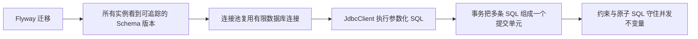
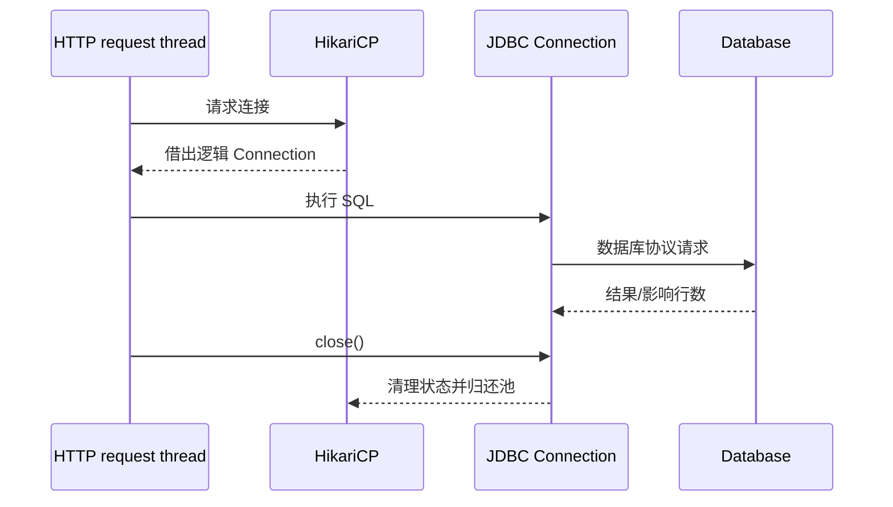
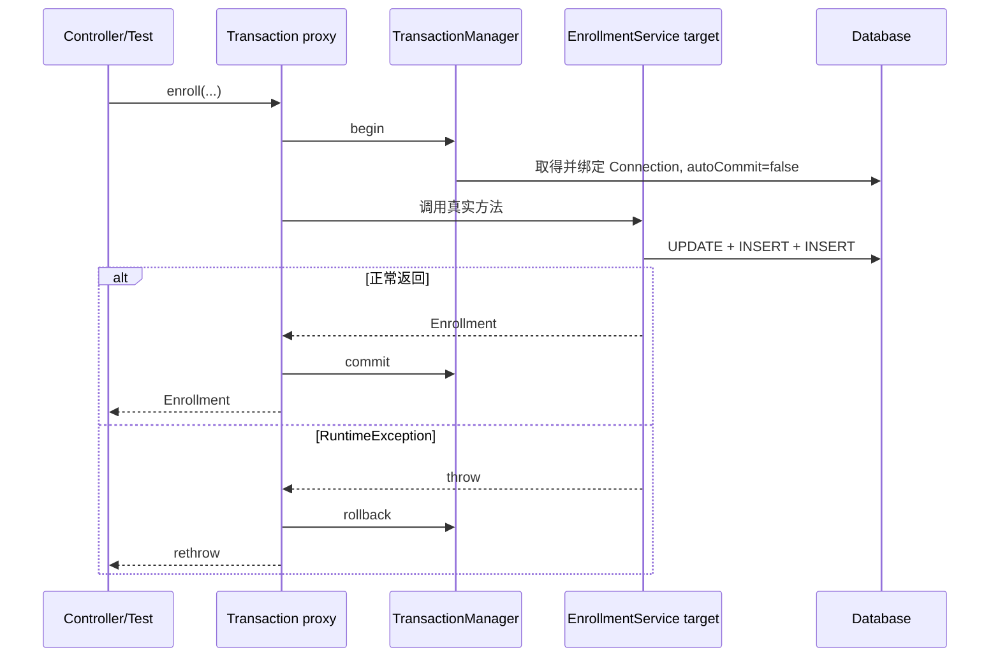

# Spring Boot JDBC、连接池、事务边界与 Flyway 数据库迁移

> 基准环境：Spring Boot 4.1.0、Spring Framework 7.0.8、Maven 3.9.16；Java 17 编译目标。课程使用 H2 2.4 内存数据库演示，生产数据库结论会单独标注边界。

## 1. 为什么内存里的 Repository 不够

前面的 API 示例把数据放在 Java 集合中。这样便于学习 Controller、Bean 和配置，但进程重启后数据消失，多个应用实例也无法共享状态。

真实报名操作还不是“向 List 添加一个对象”这么简单。它至少要同时完成：

1. 从学习账户扣减可用学分。
2. 创建课程报名记录。
3. 创建学分流水，留下审计依据。

如果第一条 SQL 成功而第二条失败，账户少了学分却没有报名；如果两个请求同时读取到 10 学分，再各扣 8 学分，简单的“先读后写”可能让业务约束失效；如果开发者手工修改生产表结构，不同实例又可能看到不同 schema。

这一课要建立三层保障：



事务很重要，但它不是唯一正确性来源。连接池解决连接成本和容量，迁移工具解决 schema 演进，数据库约束兜底数据不变量，参数化 SQL 解决值与 SQL 结构分离；这些机制各有边界。

## 2. 学习目标

完成本节后，你应该能够：

- 区分 JDBC API、JDBC Driver、`DataSource`、连接池、`Connection` 和 Spring JDBC。
- 解释一次请求如何借用连接、加入事务、提交或回滚并归还连接池。
- 使用 Boot 自动配置的 HikariCP 和 `JdbcClient`。
- 使用命名参数执行查询、插入和条件更新，避免拼接 SQL 值。
- 理解 Spring 的 `DataAccessException` 异常转换边界。
- 把事务放在业务服务层，而不是机械地给每个 Repository 方法加注解。
- 解释 `@Transactional` 基于代理生效，以及同类自调用为什么可能绕过代理。
- 准确说明默认回滚规则、`readOnly`、传播行为和隔离级别。
- 理解事务不能自动防止所有并发覆盖、远程调用不一致和外部副作用。
- 使用数据库约束和原子条件更新保护业务不变量。
- 使用 Flyway 建立不可变、可审计、按顺序执行的数据库迁移。
- 用集成测试证明成功提交、异常回滚、唯一约束冲突回滚和迁移顺序。

## 3. 本课业务场景

数据库初始有一个学习账户：

```text
账户 1001：小林，可用学分 10
```

报名 `SPRING-JDBC` 需要 3 学分。成功后的状态应该是：

```text
learning_account.available_credits: 10 → 7
course_enrollment: 新增 1 行
credit_ledger: 新增 delta=-3 的流水
```

这三项变化属于同一个业务承诺：要么全部提交，要么全部撤销。

提供的 HTTP API：

```text
GET  /api/accounts/{accountId}
POST /api/accounts/{accountId}/enrollments
```

## 4. 完整项目结构

```text
spring-boot-jdbc-transactions/
├── pom.xml
└── src/
    ├── main/
    │   ├── java/learning/backend/jdbc/
    │   │   ├── JdbcTransactionsApplication.java
    │   │   ├── account/
    │   │   │   ├── LearningAccount.java
    │   │   │   ├── LearningAccountRepository.java
    │   │   │   └── ...Exception.java
    │   │   ├── enrollment/
    │   │   │   ├── Enrollment.java
    │   │   │   ├── EnrollmentRepository.java
    │   │   │   ├── CreditLedgerRepository.java
    │   │   │   ├── EnrollmentService.java
    │   │   │   └── EnrollmentController.java
    │   │   └── web/DatabaseExceptionHandler.java
    │   └── resources/
    │       ├── application.yaml
    │       └── db/migration/
    │           ├── V1__create_learning_schema.sql
    │           └── V2__seed_learning_account.sql
    └── test/java/.../JdbcTransactionsApplicationTest.java
```

## 5. JDBC、Spring JDBC、Spring Data JDBC 与 JPA 的边界

这些名称都与数据库有关，但不处于同一层：

| 名称 | 解决的问题 | 本课是否使用 |
| --- | --- | --- |
| JDBC | Java 标准数据库访问接口 | 是，底层基础 |
| JDBC Driver | 把 JDBC 调用转换为特定数据库协议 | 是，H2 Driver |
| Spring JDBC | 管理 JDBC 样板、资源与异常转换 | 是 |
| `JdbcClient` | Spring 6.1+ 的流式 JDBC 门面 | 是 |
| Spring Data JDBC | 基于 aggregate/repository 映射对象与关系表 | 否 |
| JPA | ORM 规范，按 Entity 与 persistence context 管理对象 | 否，后续课程 |
| Hibernate | 常见 JPA 实现 | 否 |

`JdbcClient` 不是 ORM。SQL、表名、join、索引和行映射仍由开发者明确控制。它在内部委托 `JdbcTemplate` / `NamedParameterJdbcTemplate` 完成实际执行，并复用 Spring JDBC 的资源管理和异常转换。

如果你需要看见每条 SQL、精确控制查询并建立数据库基础，JDBC 是很好的起点；如果领域模型需要对象关系映射、脏检查和 persistence context，再学习 JPA。不要把“代码更少”直接等同于“更适合业务”。

## 6. Maven 依赖及 Boot 4 模块

<<< ../../../examples/java/spring-boot-jdbc-transactions/pom.xml{xml:line-numbers} [pom.xml]

关键依赖：

- `spring-boot-starter-jdbc`：Spring JDBC、事务基础设施和默认 HikariCP。
- `spring-boot-starter-flyway`：Boot 4 对内存及文件数据库的 Flyway 集成。
- `h2`：本课运行时数据库和 JDBC Driver。
- Web MVC 与 Validation：提供课程 API 输入边界。
- `spring-boot-starter-webmvc-test`：MockMvc、JUnit、AssertJ 等测试能力。

Boot 管理这些依赖的兼容版本，因此 POM 不手写 HikariCP、H2 或 Flyway 版本。生产切换 PostgreSQL 时，除了 PostgreSQL JDBC Driver，Boot 4.1 文档还要求加入 Flyway 对应的 `flyway-database-postgresql` 模块；MySQL 使用对应模块。不要假设只有 `flyway-core` 就覆盖所有数据库。

## 7. 从 JDBC 标准到一次 SQL 执行

不用 Spring 时，一次查询大致需要：

```text
DataSource.getConnection()
  → Connection.prepareStatement(sql)
  → 绑定参数
  → executeQuery()
  → 遍历 ResultSet
  → 转换每一行
  → 关闭 ResultSet
  → 关闭 Statement
  → 关闭/归还 Connection
```

每一步都可能抛 `SQLException`。手工代码若在异常路径忘记关闭资源，会泄漏连接；若所有 Repository 重复同样的 try/finally，又会掩盖真正的 SQL 和行映射。

Spring JDBC 固定资源管理流程，把变化点留给调用方：

- SQL 文本。
- 参数值。
- 每一行如何映射为对象。
- 业务上如何解释影响行数和异常。

它没有替你设计 schema，也没有消除 SQL 的性能和并发语义。

## 8. `DataSource` 不等于一个数据库连接

`javax.sql.DataSource` 是获取连接的工厂/入口。应用注入 DataSource 时，不代表此刻已永久占有一条 Connection。

在本课中，DataSource 的实际实现是 HikariDataSource：

```text
DataSource（接口）
  └── HikariDataSource（连接池实现）
        ├── physical connection 1
        ├── physical connection 2
        └── ... 最大 5 条
```

`Connection.close()` 在池化环境中通常表示把逻辑连接归还连接池，不是每次都关闭底层 TCP 连接。调用方仍必须关闭，因为“归还”正是池能够复用资源的前提。

## 9. 为什么需要连接池

建立数据库物理连接通常涉及网络握手、认证、会话初始化和数据库资源分配。每个 HTTP 请求新建并销毁连接会增加延迟和数据库压力。

连接池预先或按需维护有限连接：



池的容量既是复用机制，也是并发闸门。它限制应用同一时刻能占用多少数据库会话。

## 10. 连接池配置与因果关系

<<< ../../../examples/java/spring-boot-jdbc-transactions/src/main/resources/application.yaml{yaml:line-numbers} [application.yaml]

本课配置：

- `maximum-pool-size: 5`：最多 5 条池内连接。
- `minimum-idle: 1`：尽量保留至少 1 条空闲连接。
- `connection-timeout: 1000`：池耗尽时最多等待 1 秒，再失败。
- `pool-name`：让日志、指标和线程转储更容易识别。

超时时间不是 SQL 查询超时。它只限制“等待从池里拿到连接”的时间；连接拿到后，一条慢 SQL 仍可能执行很久。生产系统还要分别配置 JDBC statement、事务、数据库锁、网络 socket 和上游请求超时。

## 11. 连接池不能只按请求并发量配置

`maximum-pool-size` 不是越大越快。增大池会让更多查询同时进入数据库，可能造成：

- CPU 和磁盘争用。
- 锁等待增多。
- 数据库最大连接数耗尽。
- 多个应用实例共同超过数据库容量。

容量需要联合计算：

```text
每实例连接上限 × 应用实例数
  + 管理任务/迁移/报表连接
  + 其他服务连接
  ≤ 数据库可承受连接预算
```

还要结合查询延迟、事务持续时间和实际负载压测。前端把浏览器请求池开大不会创造后端数据库容量；它只会更快触及连接池等待队列。

## 12. 本课 H2 配置的准确边界

连接 URL：

```text
jdbc:h2:mem:learning;MODE=PostgreSQL;DB_CLOSE_DELAY=-1;DB_CLOSE_ON_EXIT=FALSE
```

- `mem:learning`：数据库只存在当前 JVM 内存中。
- `MODE=PostgreSQL`：让一部分语法更接近 PostgreSQL。
- `DB_CLOSE_DELAY=-1`：最后连接归还后仍保留内存数据库。
- `DB_CLOSE_ON_EXIT=FALSE`：让 Boot/连接池负责关闭顺序。

PostgreSQL mode **不会把 H2 变成 PostgreSQL**。两者在类型、锁、隔离、查询计划、索引、约束、时间语义和 SQL 方言上仍有差异。H2 适合快速课程和部分集成测试；上线前应使用真正生产数据库或 Testcontainers 验证。

在本课锁定的 Boot 4.1.0 依赖组合中，Flyway 会提示 H2 2.4.240 高于它当时已验证的最高版本 2.3.232。这是“尚未由该 Flyway 版本声明验证”的兼容性警告，不等于迁移已经失败；本课仍通过启动、迁移和事务测试验证了示例使用的行为。工程项目不能因此直接忽略所有警告，也不应脱离 Boot 依赖管理随意降级：升级时应重新核对 Boot 管理版本、Flyway 支持范围，并使用目标生产数据库执行迁移测试。

## 13. 为什么 schema 不能靠人工同步

代码版本与数据库结构必须匹配。如果团队通过聊天消息要求“上线前手工加一列”，会出现：

- 某个环境漏执行。
- 多人不知道执行顺序。
- 已执行脚本被修改，无法解释当前结构来源。
- 新实例先启动还是迁移先执行没有明确约定。
- 回滚应用版本时 schema 是否兼容无法判断。

数据库迁移把 schema 变化作为版本化制品放进 Git，并让工具记录执行历史。

## 14. Flyway 的启动因果链

Boot 发现 Flyway starter 和 DataSource 后，应用启动大致经历：

```text
创建 DataSource / HikariCP
  → 创建 Flyway
  → 读取 db/migration 脚本
  → 读取 flyway_schema_history
  → 按版本校验已执行 migration 的 checksum
  → 执行尚未应用的版本
  → 记录成功/失败历史
  → JdbcClient 等数据库使用者开始工作
  → Web 应用完成启动
```

迁移失败时应用应停止启动，而不是让新代码面对旧 schema 接收流量。Boot 会识别 JdbcClient 等数据库使用者对初始化过程的依赖。

## 15. 迁移文件命名与不可变原则

默认目录是 `classpath:db/migration`，版本迁移典型命名：

```text
V1__create_learning_schema.sql
V2__seed_learning_account.sql
V2_1__add_course_index.sql
```

双下划线分隔版本和描述。已经在共享环境成功应用的版本脚本不要直接修改；Flyway 记录 checksum，修改会造成验证失败，也会让“相同版本”在不同环境代表不同结构。

需要改变已发布结构时新增 V3。迁移的 Git 历史和 Flyway history 共同回答“为什么数据库现在长这样”。

## 16. 第一版 schema：约束是数据库最后防线

<<< ../../../examples/java/spring-boot-jdbc-transactions/src/main/resources/db/migration/V1__create_learning_schema.sql{sql:line-numbers} [V1__create_learning_schema.sql]

关键设计：

- 主键保证每行身份唯一。
- foreign key 防止 enrollment/ledger 指向不存在账户。
- `CHECK (available_credits >= 0)` 防止持久化负学分。
- `UNIQUE (account_id, course_code)` 防止一个账户重复报名同一课程。
- 外键列建立索引，支持按账户查报名和流水。

Java 校验改善错误体验，数据库约束抵御并发竞态、遗漏校验和其他写入程序。两者不是重复浪费：Java 提供业务错误，数据库维护最终不变量。

## 17. 种子数据与生产数据不是一回事

<<< ../../../examples/java/spring-boot-jdbc-transactions/src/main/resources/db/migration/V2__seed_learning_account.sql{sql:line-numbers} [V2__seed_learning_account.sql]

本课用 V2 创建固定账户，保证 JAR 启动后可立即调用。生产中迁移适合稳定参考数据或系统必需行，不适合持续变化的用户业务数据。

测试专用数据可以放 `src/test/resources/db/migration` 的高版本迁移，或由测试 fixture 建立。本课测试在每个用例前只重置业务 DML，不重建 schema，以便同时验证 Flyway 真实启动过程。

## 18. 不要混用多套 schema 初始化机制

Boot 还支持 `schema.sql`、`data.sql`，JPA 也能通过 `ddl-auto` 创建表。但官方不建议把基础 SQL 初始化与 Flyway/Liquibase 混在一起，并说明这种混用支持未来会移除。

本课明确设置：

```yaml
spring:
  sql:
    init:
      mode: never
```

schema 只有 Flyway 一个所有者。单一机制让启动顺序、失败行为和历史记录可预测。

## 19. Repository 负责持久化协议，不负责业务事务

账户 Repository：

<<< ../../../examples/java/spring-boot-jdbc-transactions/src/main/java/learning/backend/jdbc/account/LearningAccountRepository.java{java:line-numbers} [LearningAccountRepository.java]

职责只有：

- 把账户查询映射成 `LearningAccount`。
- 以条件更新扣减学分。
- 用影响行数表达更新是否成功。

它不知道“报名”还要写 enrollment 和 ledger，因此不能决定完整业务事务在哪里开始和结束。

## 20. 命名参数与 SQL 注入边界

正确写法：

```java
jdbcClient.sql("SELECT ... WHERE id = :accountId")
        .param("accountId", accountId)
```

参数值通过 PreparedStatement 绑定，不作为 SQL 语法重新解析。错误写法：

```java
String sql = "SELECT ... WHERE course_code = '" + input + "'";
```

字符串拼接把数据和 SQL 结构混在一起，既可能被注入，也会破坏引号和类型处理。

参数化不能动态绑定表名、列名或 `ORDER BY` 方向。此类 SQL 结构必须从服务器端允许列表选择，不能直接拼用户输入。

## 21. 行映射发生了什么

查询返回 ResultSet 后，本课显式映射：

```java
(resultSet, rowNumber) -> new LearningAccount(
        resultSet.getLong("id"),
        resultSet.getString("learner_name"),
        resultSet.getInt("available_credits"))
```

这段代码定义关系行与 Java 值对象的边界。常见错误包括：

- SQL 改了 alias，mapper 仍读取旧列名。
- nullable 列用基本类型 getter 后忽略 `wasNull()`。
- 数据库 timestamp 时区语义与 Java 类型不匹配。
- 一次性查询过多行并全部放进内存。

本课使用 UTC Clock 生成 `LocalDateTime`，只为保持示例简洁。跨时区生产系统应明确数据库列语义，并按协议选择 `Instant`、`OffsetDateTime` 或带时区约定的类型。

## 22. 条件 UPDATE 比“先读再写”更可靠

脆弱流程：

```text
请求 A 读取 credits=10
请求 B 读取 credits=10
A 在 Java 计算 10-8，写回 2
B 在 Java 计算 10-8，写回 2
```

两个请求都以为扣减成功，最终却只减少 8。这是 lost update 的一种表现。

本课把检查和扣减放进同一条 SQL：

```sql
UPDATE learning_account
SET available_credits = available_credits - :credits
WHERE id = :accountId
  AND available_credits >= :credits
```

数据库对单条语句原子执行。影响 1 行表示扣减成功；影响 0 行表示账户不存在或余额不足，Service 再查询以区分业务错误。

事务仍然需要，因为后面还有 enrollment 和 ledger；原子条件更新负责余额并发不变量，事务负责三项变化的整体提交。两者解决不同问题。

## 23. Enrollment 与 Ledger Repository

<<< ../../../examples/java/spring-boot-jdbc-transactions/src/main/java/learning/backend/jdbc/enrollment/EnrollmentRepository.java{java:line-numbers} [EnrollmentRepository.java]

<<< ../../../examples/java/spring-boot-jdbc-transactions/src/main/java/learning/backend/jdbc/enrollment/CreditLedgerRepository.java{java:line-numbers} [CreditLedgerRepository.java]

ID 在 Java 中用 UUID 生成，使插入前就能构造返回对象，不依赖特定数据库的自增键 API。代价是字符串 UUID 占用更大且索引局部性较差；真实项目应根据数据库和访问模式选择 bigint、原生 UUID、时间有序 ID 等方案。

SQL 写在 text block 中保持缩进可读，但最终仍是普通 String。可读性不会自动保证 SQL 正确，测试和数据库约束仍不可少。

## 24. Spring JDBC 的异常转换

JDBC Driver 抛 `SQLException`，其中错误码和 SQLState 带数据库差异。Spring JDBC 将它们翻译为统一的 unchecked `DataAccessException` 层次，例如：

- `DuplicateKeyException`。
- `DataIntegrityViolationException`。
- `DataAccessResourceFailureException`。
- `CannotAcquireLockException`。

本课捕获 `DataIntegrityViolationException` 并转换为业务异常 `DuplicateEnrollmentException`。转换后的异常仍保留 cause，既给上层稳定业务语义，也给日志和诊断保留底层证据。

不要把所有 DataAccessException 统一转成“数据不存在”。连接失败、唯一冲突、语法错误和锁超时需要不同处置，有些是用户错误，有些是系统故障。

## 25. 事务是什么：一个数据库提交单元

在本课的单 DataSource JDBC 场景中，事务控制同一数据库连接上的一组 SQL：

```text
BEGIN / autoCommit=false
  → UPDATE account
  → INSERT enrollment
  → INSERT ledger
COMMIT
```

其中任一步出现符合回滚规则的异常：

```text
UPDATE account
  → INSERT enrollment 违反唯一约束
  → 异常向外传播
  → ROLLBACK
  → 前面的 account UPDATE 也撤销
```

事务不是 Java 对象快照。它由数据库和 JDBC Connection 实现，Spring 负责在正确边界开始、提交、回滚和清理。

## 26. ACID 应理解为属性集合，不是营销缩写

| 属性 | 本课中的含义 | 常见误解 |
| --- | --- | --- |
| Atomicity 原子性 | 三项写入整体提交或回滚 | 每条业务操作天然不可分割 |
| Consistency 一致性 | 事务把数据库从一个满足约束的状态带到另一个 | 数据库自动理解所有业务规则 |
| Isolation 隔离性 | 并发事务的可见性受隔离级别和锁/MVCC 控制 | 并发事务永远等同串行 |
| Durability 持久性 | commit 后按数据库保证抵御故障 | 调用返回后所有外部系统也同步成功 |

一致性仍依赖 schema 约束和业务代码；隔离强度由数据库及事务设置决定；持久性不覆盖尚未写入同一数据库的 Kafka、邮件或远程 HTTP 服务。

## 27. `@Transactional` 的代理执行链

完整 Service：

<<< ../../../examples/java/spring-boot-jdbc-transactions/src/main/java/learning/backend/jdbc/enrollment/EnrollmentService.java{java:line-numbers} [EnrollmentService.java]

Controller 注入的 Service 通常是代理引用。调用 public transactional 方法时：



Spring JDBC 在当前线程查找事务绑定的 Connection，所以多个 Repository 的 JdbcClient 操作加入同一物理事务。方法结束后连接状态被清理并归还 HikariCP。

## 28. 为什么事务边界通常放 Service

一次业务用例跨三个 Repository。若每个 Repository 方法各自提交：

```text
debit() 提交
  → insertEnrollment() 失败
  → 已提交的 debit 无法由后一个事务回滚
```

Service 知道业务操作的完整边界，所以 `enroll` 才是事务入口。Controller 负责 HTTP，Repository 负责 SQL；把事务放 Controller 会让协议层承担业务一致性，把事务只放 Repository 又会切碎用例。

这是常用原则，不是绝对语法规则。批处理、消息消费或应用服务边界不同，但事务应围绕一个需要原子提交的本地业务用例。

## 29. 默认回滚规则必须明确

Spring 声明式事务默认：

- 未处理的 `RuntimeException` 导致回滚。
- `Error` 默认导致回滚。
- checked Exception 默认不导致回滚。

需要 checked Exception 回滚时显式：

```java
@Transactional(rollbackFor = BusinessCheckedException.class)
```

不要为了“保险”给所有方法写 `rollbackFor = Exception.class` 而不定义业务语义。更重要的是异常必须离开代理调用：如果方法内部 catch 后正常返回，代理看到的是成功，就会尝试提交。

## 30. 捕获异常后为什么可能提交

错误示例：

```java
@Transactional
public void enroll(...) {
    try {
        repository.insert(...);
    } catch (DataAccessException error) {
        log.warn("失败", error);
        return;
    }
}
```

如果前面已更新账户，catch 吞掉异常后方法正常返回，事务拦截器可能提交已有变化。处理选择：

- 转换成有语义的 RuntimeException 并继续抛出。
- 在确实需要的低层场景显式标记 rollback-only。
- 重新设计流程，让失败结果和提交语义一致。

本课转换重复报名异常后继续抛出，因此第二次 debit 一起回滚。

## 31. 同类自调用为什么绕过事务代理

```java
public void outer() {
    this.inner();
}

@Transactional
public void inner() {
}
```

外部对象调用代理才会进入事务 advice；`this.inner()` 是目标对象内部的直接 Java 调用，没有再次经过代理，因此 inner 上的事务元数据在默认 proxy mode 下不会开启新事务。

可靠做法：

- 把事务入口设计成由外部协作者调用的 public Service 方法。
- 将需要不同事务语义的操作拆到另一个 Bean。
- 不要为了调用自己而从 ApplicationContext 获取代理。

本课两个 public 方法都由测试/Controller 外部调用，再共同委托 private `performEnrollment`；事务已经在进入 public 方法时建立，private 方法不需要注解。

## 32. `readOnly = true` 不是权限控制

```java
@Transactional(readOnly = true)
public AccountOverview findOverview(...) { ... }
```

readOnly 是给事务管理器、Driver 或数据库的优化提示，具体效果依实现而异。它表达意图，也可能帮助路由只读库或调整 flush 策略，但不能当成“数据库绝不会写入”的安全保证。

权限应由数据库用户、授权规则和应用边界控制。即使 readOnly 方法当前只有 SELECT，也仍要检查慢查询、结果集大小和事务持续时间。

## 33. 传播行为回答“已有事务时怎么办”

默认 `REQUIRED`：

- 没有事务就创建。
- 已有事务就加入同一逻辑事务。

常见其他选项：

- `REQUIRES_NEW`：挂起外层，开始独立物理事务，通常还要另一条连接。
- `NESTED`：在支持的 JDBC manager/Driver 上使用 savepoint，不等于独立提交。
- `SUPPORTS`：有事务则加入，没有则非事务运行。
- `MANDATORY`：必须已有事务，否则失败。
- `NOT_SUPPORTED`：挂起事务，非事务运行。
- `NEVER`：已有事务则失败。

传播行为不是“哪个更高级”。例如每次调用 `REQUIRES_NEW` 做审计，外层线程持有连接又等待新连接，池太小时可能耗尽；而且内层已提交后，外层回滚无法撤销它。

## 34. rollback-only 与 UnexpectedRollbackException

内层 REQUIRED 方法加入外层事务并标记 rollback-only，即使外层 catch 异常并继续返回，最外层提交时也不能违反回滚决定。Spring 会回滚并抛 `UnexpectedRollbackException`，明确告诉调用者没有真正提交。

这不是框架“莫名其妙失败”，而是避免外层得到假成功。设计时应让失败语义自然传播，不要把加入同一事务的内层失败当成可忽略警告。

## 35. 隔离级别与并发现象

隔离级别控制一个事务如何观察其他事务。常见现象：

- dirty read：读到其他事务尚未提交的数据。
- non-repeatable read：同一行两次读取结果不同。
- phantom read：相同条件两次查询出现不同的行集合。
- lost update：并发写入覆盖彼此结果。

Spring 可声明 `READ_COMMITTED`、`REPEATABLE_READ`、`SERIALIZABLE` 等，但实际语义、默认值、MVCC 和锁行为由数据库决定。不要只看枚举名字推断性能与全部异常。

本课条件 UPDATE 避免依赖“先读余额再覆盖写回”；唯一约束解决并发重复报名；事务把后续写入捆绑。这比盲目把所有事务调成 SERIALIZABLE 更有针对性。

## 36. 事务持续时间为什么要短

事务中执行远程 HTTP：

```text
借到数据库连接并更新行
  → 持有事务和可能的锁
  → 等待远程服务 5 秒
  → 连接池可用连接减少
  → 其他请求排队甚至超时
```

数据库事务内应主要执行必要的本地数据库工作。远程调用需要单独的超时、幂等、重试和一致性设计。

不要把 `@Transactional` 放到包含用户交互、长计算、大文件上传或不受控网络调用的宽方法上。

## 37. 数据库事务不会回滚外部副作用

若事务中先发邮件再数据库回滚，邮件不会自动收回；若先提交数据库再发消息失败，状态和通知又可能不一致。

单数据库事务只覆盖其资源。跨数据库、消息和 HTTP 的可靠一致性通常需要：

- transactional outbox。
- 幂等消费者。
- 状态机和补偿动作。
- 明确的最终一致性。

不要用一个 `@Transactional` 注解声称获得分布式事务。后续消息与架构课程会继续展开。

## 38. Controller 和错误响应

<<< ../../../examples/java/spring-boot-jdbc-transactions/src/main/java/learning/backend/jdbc/enrollment/EnrollmentController.java{java:line-numbers} [EnrollmentController.java]

<<< ../../../examples/java/spring-boot-jdbc-transactions/src/main/java/learning/backend/jdbc/web/DatabaseExceptionHandler.java{java:line-numbers} [DatabaseExceptionHandler.java]

协议映射：

| 场景 | HTTP status | code |
| --- | --- | --- |
| 账户不存在 | 404 | `ACCOUNT_NOT_FOUND` |
| 学分不足 | 422 | `INSUFFICIENT_CREDITS` |
| 重复报名 | 409 | `DUPLICATE_ENROLLMENT` |
| 成功报名 | 201 + Location | — |

DatabaseExceptionHandler 不暴露 SQL、表名或 Driver 错误。服务端日志可以保留 cause，客户端只获得稳定业务协议。

## 39. 完整测试为什么不使用测试事务包住所有断言

<<< ../../../examples/java/spring-boot-jdbc-transactions/src/test/java/learning/backend/jdbc/JdbcTransactionsApplicationTest.java{java:line-numbers} [JdbcTransactionsApplicationTest.java]

测试覆盖：

1. DataSource 确实是 HikariDataSource，池参数已绑定。
2. Flyway 成功应用两个版本并创建种子账户。
3. 成功请求提交账户、报名、流水三项变化。
4. debit 后主动抛 RuntimeException，账户恢复到 10。
5. 第二次报名触发唯一约束，第二次 debit 一起回滚。
6. 学分不足返回 422 且没有局部数据。

测试没有在类上加 `@Transactional`。如果外层测试事务包住 Service 的 REQUIRED 事务，Service 会加入外层；发生异常后可能只标记 rollback-only，数据库变化在测试方法结束前仍处在同一个未完成事务中，容易让“回滚后立即查询”的断言误读。

本课让每次 Service 调用拥有真实提交/回滚边界，并在 `@BeforeEach` 重置业务数据，直接观察事务完成后的数据库状态。

## 40. Flyway history 为什么有额外记录

Flyway 的 schema history 可能包含 schema history table 自身创建标记，因此测试不简单断言表总行数，而是过滤：

```sql
WHERE "success" = TRUE
  AND "version" IS NOT NULL
```

这体现一个测试原则：断言真正的业务语义“两个版本迁移成功”，不要依赖工具内部附加行恰好不存在。

Flyway 在 H2 中创建带引号的小写 history 标识符，所以测试也显式引用带引号的列名。这是具体工具/数据库行为，不应复制成所有业务表的命名规则。

## 41. H2 测试通过仍不能证明生产数据库正确

H2 无法完整验证：

- PostgreSQL/MySQL 方言和数据类型。
- 真实查询计划与索引选择。
- MVCC、锁等待、死锁检测和隔离细节。
- 网络抖动、认证、TLS 和连接失效。
- 生产数据量下的延迟。
- 数据库特定 Flyway module 和权限。

推荐测试层次：

```text
普通单元测试
  → H2 快速集成测试
  → Testcontainers 真实数据库集成测试
  → 预发布迁移与容量验证
```

H2 不是没价值；它只是不能承担超过自身边界的证明责任。

## 42. 本地构建与运行

```bash
cd examples/java/spring-boot-jdbc-transactions
mvn -ntp clean package
java -jar target/spring-boot-jdbc-transactions-1.0.0-SNAPSHOT.jar \
  --server.port=18084
```

查看账户：

```bash
curl http://localhost:18084/api/accounts/1001
```

报名：

```bash
curl -i -X POST http://localhost:18084/api/accounts/1001/enrollments \
  -H 'Content-Type: application/json' \
  -d '{"courseCode":"SPRING-JDBC","credits":3}'
```

再次查看，预期 `availableCredits` 为 7，enrollments 有一条记录。重复提交同一 courseCode，预期得到 409，并且余额仍为 7。

由于 H2 是内存数据库，停止 JAR 后所有业务数据消失；再次启动会由 Flyway 重新建立 schema 和种子数据。这是课程环境特性，不是生产持久化方式。

## 43. 常见故障：应用启动时迁移失败

排查顺序：

1. 读取最早的 Flyway 错误和失败 migration 名称。
2. 确认数据库 URL、用户和 schema。
3. 检查数据库特定 Flyway module 是否存在。
4. 检查账号是否有 DDL/DML 权限。
5. 检查已应用脚本是否被修改导致 checksum 不匹配。
6. 在数据库中检查 history，但不要手工删除记录掩盖问题。

共享环境的失败迁移必须根据 Flyway 与数据库的实际状态修复。不要未经评估直接 `repair`，它会改变历史元数据。

## 44. 常见故障：连接池超时

若出现等待连接超时，先判断：

- 是否有连接泄漏，ResultSet/stream 未关闭。
- 是否存在慢 SQL 或锁等待。
- 事务是否包含远程调用或长计算。
- 数据库是否响应变慢。
- 实例数增加后总连接预算是否超限。
- pool size 是否经过真实负载验证。

直接把 pool 从 10 调到 100 可能把应用排队转移成数据库雪崩。先测量 active、idle、pending、acquire time 和 SQL 延迟，再决定修改位置。

## 45. 常见故障：`@Transactional` 看起来没生效

依次检查：

1. 调用是否从 Bean 外部经过代理。
2. 方法是否是适合代理拦截的事务入口。
3. 异常是否被 catch 后吞掉。
4. 抛的是 checked 还是 unchecked 异常，rollback rule 是什么。
5. 多个操作是否真的使用同一个 DataSource/transaction manager。
6. 是否启动了新线程；线程绑定事务不会自动传播过去。
7. 是否把外部副作用误认为数据库事务资源。

不要只看方法上有没有注解。事务是“代理调用路径 + transaction manager + resource participation + rollback rule”的共同结果。

## 46. 迁移上线的工程策略

生产发布通常不能假设“应用和 schema 瞬间同时切换”。滚动部署期间可能同时运行新旧实例，因此采用 expand/contract：

1. Expand：先添加向后兼容的新列/表，不立即删除旧结构。
2. Deploy：代码双读/双写或逐步切换。
3. Backfill：受控迁移历史数据，监控锁和负载。
4. Contract：确认旧实例和旧代码退出后，再删除旧列/约束。

大型表 `ALTER`、索引创建和数据回填可能持锁或产生巨大 IO，不应把所有动作都塞进应用启动的短窗口。迁移脚本仍需版本化，但执行策略可由发布流水线专门控制。

## 47. 数据访问层工程清单

- SQL 值全部参数化，动态结构使用允许列表。
- Service 定义业务事务边界。
- 回滚规则与异常类型一致，并有失败测试。
- 数据库约束维护最终不变量。
- 并发计数使用原子条件 SQL、锁或版本控制，而非脆弱读改写。
- 事务内避免不受控远程调用。
- pool size、连接获取和 SQL timeout 分开配置。
- schema 只有一个迁移机制负责。
- 已发布版本迁移不可变，变化用新版本。
- 使用生产同类数据库验证方言、隔离与迁移。
- 日志不记录密码和完整敏感 SQL 参数。
- 指标观察连接池等待、SQL 延迟、事务失败和数据库错误。

## 48. 本节总结

- JDBC 是 Java 标准访问接口，Driver 实现具体数据库协议，DataSource 是连接入口。
- HikariCP 复用有限物理连接；Connection.close 通常是归还池。
- 池容量必须服从数据库总预算，连接获取 timeout 不等于 SQL timeout。
- JdbcClient 是 Spring JDBC 门面，不是 ORM；SQL 和行映射仍由应用负责。
- 命名参数把数据与 SQL 结构分开，但表名/排序等结构必须使用允许列表。
- DataAccessException 统一数据库异常层次，业务层仍要按语义翻译。
- 条件 UPDATE 和唯一约束处理并发不变量，事务不能替代它们。
- 事务把同一数据库连接上的多条 SQL 组成提交/回滚单元。
- `@Transactional` 默认通过代理生效，同类自调用可能绕过代理。
- RuntimeException/Error 默认回滚；checked Exception 需要明确规则。
- catch 并正常返回可能导致提交；readOnly 只是提示，不是权限边界。
- REQUIRED 加入现有事务，REQUIRES_NEW 使用独立事务并影响连接池容量。
- 隔离级别的实际语义取决于数据库，不能只背枚举名称。
- 数据库事务不会回滚邮件、消息或远程 HTTP 副作用。
- Flyway 在启动时校验并按版本迁移，已应用脚本不应修改。
- H2 快速但不等于生产数据库，关键路径需真实数据库集成测试。

下一节建议：Spring Boot JPA、实体生命周期、关联映射、查询与 N+1 问题。

## 49. 参考资料

- [Spring Boot：SQL Databases](https://docs.spring.io/spring-boot/reference/data/sql.html)
- [Spring Boot：Database Initialization](https://docs.spring.io/spring-boot/how-to/data-initialization.html)
- [Spring Boot：Managed Dependency Coordinates](https://docs.spring.io/spring-boot/appendix/dependency-versions/coordinates.html)
- [Spring Framework：JDBC Core](https://docs.spring.io/spring-framework/reference/data-access/jdbc/core.html)
- [Spring Framework：Data Access](https://docs.spring.io/spring-framework/reference/data-access.html)
- [Spring Framework：Declarative Transaction Management](https://docs.spring.io/spring-framework/reference/data-access/transaction/declarative.html)
- [Spring Framework：Transaction Rollback Rules](https://docs.spring.io/spring-framework/reference/data-access/transaction/declarative/rolling-back.html)
- [Spring Framework：Transaction Propagation](https://docs.spring.io/spring-framework/reference/data-access/transaction/declarative/tx-propagation.html)
- [Spring Framework：Declarative Transaction Implementation](https://docs.spring.io/spring-framework/reference/data-access/transaction/declarative/tx-decl-explained.html)
- [HikariCP：Configuration](https://github.com/brettwooldridge/HikariCP#configuration-knobs-baby)
- [Flyway Documentation](https://documentation.red-gate.com/flyway)
- [H2 Database Documentation](https://h2database.com/html/main.html)
