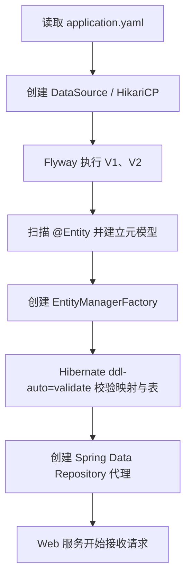
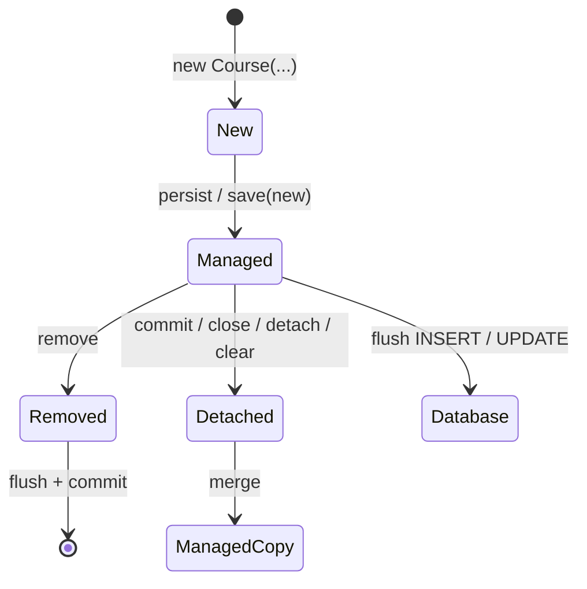

# Spring Boot JPA、实体生命周期、关联映射、查询与 N+1

> 基准环境：Spring Boot 4.1.0、Spring Data JPA 4.1.0、Hibernate ORM 7.4.1.Final、Jakarta Persistence 3.2、Maven 3.9.16；Java 17 编译目标。示例继续使用 H2 2.4 与 Flyway，生产数据库边界会单独说明。

## 1. 为什么写过 JDBC 还需要学习 JPA

上一课使用 `JdbcClient` 明确编写 SQL、绑定参数并映射结果。它的优势是控制直接、执行过程可见，但当业务对象与表关系变多时，开发者还要反复处理：

- INSERT、UPDATE 和 DELETE 的字段同步。
- ResultSet 到对象图的转换。
- 新对象、已加载对象和已脱离对象的状态差异。
- 父子对象的新增、删除和外键维护。
- 相同数据库行在一个业务操作中是否对应同一个 Java 对象。

JPA 试图解决的不是“让数据库消失”，而是提供一套对象持久化规范：应用声明实体如何映射，Persistence Context 跟踪实体状态，provider 在合适时机生成 SQL。

代价也很明确：SQL 不再总是出现在调用位置，读取一个属性可能触发查询，错误可能推迟到 flush，错误的关联抓取容易产生 N+1。学习 JPA 的重点因此不是背注解，而是理解“对象操作如何因果地变成 SQL”。

## 2. 本课学习目标

完成本节后，你应该能够：

- 区分 Jakarta Persistence、JPA、Hibernate、Spring ORM 与 Spring Data JPA。
- 准确定义 Entity、Persistence Context 和 EntityManager。
- 解释 new、managed、detached、removed 四种实体状态。
- 解释 `persist`、`merge`、dirty checking、flush 与 commit 的差异。
- 正确建立 `ManyToOne` 和 `OneToMany`，识别关系所有者。
- 理解 cascade 与 `orphanRemoval` 各自传播的操作。
- 关闭 Open EntityManager in View，并在事务内完成 DTO 映射。
- 识别 N+1 的执行因果链，而不是只看代码行数猜测。
- 使用 EntityGraph、fetch join 或 DTO Projection 设计查询计划。
- 理解 `@Version` 如何检测并发覆盖。
- 避免把 Entity 直接作为 HTTP JSON 协议。
- 使用 Flyway 管理 schema，并让 Hibernate 只做映射验证。

## 3. 本课业务模型

课程目录包含三个概念：

```text
Instructor 1 ──── N Course 1 ──── N Lesson
讲师                课程              课时
```

需求包括：

1. 列表页显示课程、讲师和课时数量。
2. 详情页显示课程及按顺序排列的全部课时。
3. 创建课程时同时创建课时。
4. 修改课程标题时不手写 UPDATE。
5. 从课程中移除课时后删除对应数据库行。
6. 能证明普通懒加载为什么产生 N+1，并验证优化后的 SQL 数量。

## 4. 完整项目结构

```text
spring-boot-jpa-entity-lifecycle/
├── pom.xml
└── src/
    ├── main/
    │   ├── java/learning/backend/jpa/
    │   │   ├── JpaLifecycleApplication.java
    │   │   ├── course/
    │   │   │   ├── Instructor.java
    │   │   │   ├── Course.java
    │   │   │   ├── Lesson.java
    │   │   │   ├── CourseRepository.java
    │   │   │   ├── CourseService.java
    │   │   │   ├── QueryPlanDemoService.java
    │   │   │   ├── CourseController.java
    │   │   │   └── 请求、响应与业务异常
    │   │   └── web/JpaExceptionHandler.java
    │   └── resources/
    │       ├── application.yaml
    │       └── db/migration/
    │           ├── V1__create_course_catalog.sql
    │           └── V2__seed_course_catalog.sql
    └── test/java/.../JpaLifecycleApplicationTest.java
```

## 5. 版本与 Maven 依赖

<<< ../../../examples/java/spring-boot-jpa-entity-lifecycle/pom.xml{xml:line-numbers} [pom.xml]

`spring-boot-starter-data-jpa` 主要带来：

- Jakarta Persistence API：标准接口和注解。
- Hibernate ORM：本课实际使用的 JPA provider。
- Spring ORM：EntityManager、事务和异常转换集成。
- Spring Data JPA：Repository 接口代理与查询派生。

这些不是四个同义名称。POM 不直接锁定 Hibernate 版本，而由 Boot 4.1.0 的依赖管理选择 7.4.1.Final。升级 Boot 可能改变 provider 行为和生成 SQL，升级后必须重新跑集成测试并观察查询计划。

## 6. JPA、Hibernate 与 Spring Data JPA 的准确边界

| 层 | 角色 | 典型类型 |
| --- | --- | --- |
| Jakarta Persistence | 标准规范与 API | `@Entity`、`EntityManager`、`@OneToMany` |
| Hibernate ORM | JPA provider，实现映射、脏检查和 SQL 生成 | `SessionFactory`、Hibernate proxy |
| Spring ORM | 把 provider 接入 Spring 事务和异常体系 | `JpaTransactionManager` |
| Spring Data JPA | 基于接口生成 Repository 实现 | `JpaRepository`、`@Query`、`@EntityGraph` |
| JDBC Driver | 最终执行数据库协议 | H2/PostgreSQL Driver |
| Database | 执行 SQL、约束、锁和事务 | H2/PostgreSQL |

“JPA 查询了数据库”在口语上可以理解，但更准确的执行链是：应用调用 Spring Data 代理，代理使用 EntityManager，Hibernate 生成 SQL，JDBC Driver 把 SQL 发给数据库。

JPA 是规范，不是一个单独运行的软件包；Hibernate 是实现，不等于 JPA 全部；Spring Data JPA 减少 Repository 样板，不取代 provider。

## 7. ORM 不会把关系数据库变成对象数据库

对象模型和关系模型存在结构差异：

- Java 用对象引用表达关联，表用外键值表达关联。
- Java List 有顺序和对象身份，SQL 结果默认没有顺序。
- 对象可以形成任意图，join 后的结果是扁平行集合。
- Java 继承、封装与数据库约束不是同一种机制。

ORM 做的是映射与状态同步。索引、唯一约束、执行计划、锁、事务隔离、数据量和 SQL 方言仍真实存在。

如果一句 Repository 方法隐藏了 300 条 SQL，代码看起来简短并不代表访问成本低。

## 8. Boot 启动时发生什么

本课启动链：



Flyway 是 schema 所有者；Hibernate 只验证实体映射能否匹配现有表。任何迁移或映射错误都会在接收流量前暴露。

## 9. Entity 的准确定义

Entity 是具有持久化身份、可由 Persistence Context 管理并映射到数据库状态的 Java 实例。

它不只是“加了 `@Entity` 的 DTO”：

- 必须有主键。
- 生命周期会被 provider 管理。
- managed 状态变化可能在 flush 时生成 SQL。
- 关联属性可能是代理或持久化集合。
- 相同主键在同一 Persistence Context 内具有身份唯一性。

Entity 也不等于数据库行。一个实体可跨多个表映射，一个查询行也可映射成非实体 DTO；实体对象离开 Persistence Context 后仍存在，但不再自动同步数据库。

## 10. Entity 类的最低结构要求

讲师实体：

<<< ../../../examples/java/spring-boot-jpa-entity-lifecycle/src/main/java/learning/backend/jpa/course/Instructor.java{java:line-numbers} [Instructor.java]

关键点：

- `@Id` 声明持久化身份。
- 无参构造器供 provider 实例化，可以是 protected。
- 实体类和持久化属性不应被 final 限制到 provider 无法代理。
- 数据库列约束仍写在 Flyway；注解中的 nullable/length 用于映射元数据和验证，不替代真实 DDL。

示例没有提供 public 无参构造器，因为业务代码不应创建“没有名字也没有身份”的 Instructor。

## 11. Field access 与 property access

JPA 根据映射注解放置位置选择访问方式：

- `@Id` 放字段上：provider 直接访问字段。
- `@Id` 放 getter 上：provider 通过 JavaBean property 访问。

本课把注解放在字段上，因此 Hibernate 不要求业务 getter 使用 `getTitle()` 命名。`title()` 只是业务读取方法。

同一实体中随意混用字段和 getter 注解会让映射来源不清。确需混合时应显式使用 `@Access`，并说明原因。

这与 Vue 响应式代理不同：JPA 的字段访问、实体代理、持久化集合和脏检查是 provider 的持久化机制，不是 UI 状态订阅。

## 12. Course 实体完整代码

<<< ../../../examples/java/spring-boot-jpa-entity-lifecycle/src/main/java/learning/backend/jpa/course/Course.java{java:line-numbers} [Course.java]

Course 同时展示：

- `@GeneratedValue(strategy = UUID)`。
- `@Version` 乐观锁版本。
- 对 Instructor 的懒加载多对一。
- 对 Lesson 的一对多、级联和 orphan removal。
- 保护双向关系的一致性方法。
- 不直接暴露可修改的内部 List。

构造器建立一个满足业务最低约束的新对象；`rename`、`addLesson` 和 `removeLesson` 表达领域动作，比到处暴露 setter 更容易维护不变量。

## 13. Lesson 为什么保存 Course 引用

<<< ../../../examples/java/spring-boot-jpa-entity-lifecycle/src/main/java/learning/backend/jpa/course/Lesson.java{java:line-numbers} [Lesson.java]

数据库外键 `lesson.course_id` 位于 lesson 表，所以对象关系的 owning side 是 `Lesson.course`。它使用 `@JoinColumn` 指定真实外键列。

Course 的 List 只是关系的反向视图。只向 List 添加一个 Lesson、却不设置 `lesson.course`，可能不会写出期望的外键。

本课通过 Course 内部的 `addLesson` 同时完成两端：

```text
Course.lessons.add(lesson)
Lesson.course = this
```

调用者不能直接修改内部集合，因此不容易制造两端不一致。

## 14. Persistence Context 是什么

Jakarta Persistence 将 Persistence Context 定义为一组被管理的实体实例；对同一个实体类型和持久化身份，其中只有一个 Java 实例。

```text
Persistence Context
├── Course[id=A]  ── 唯一 managed 实例
├── Instructor[id=101]
└── Lesson[id=L1]
```

它承担三项关键职责：

1. identity map：同一事务重复查同一行通常得到同一对象引用。
2. 状态跟踪：记录或检测 managed 实体发生的变化。
3. 写入队列：在 flush 时把状态转换成 INSERT/UPDATE/DELETE。

Persistence Context 不是数据库连接池，也不是应用级永久缓存。典型 Spring 事务只在一个业务调用范围内使用它。

## 15. EntityManager 与 Persistence Context 的关系

EntityManager 是操作 Persistence Context 的标准 API，提供：

- `persist`：让 new 实体变为 managed。
- `find`：按身份加载实体。
- `remove`：把 managed 实体标记为 removed。
- `merge`：把 new/detached 对象的状态复制到 managed 实例。
- `flush`：把当前状态同步到数据库。
- `detach` / `clear`：使实体脱离管理。

EntityManager 是入口，Persistence Context 是它关联的管理空间。不要把 EntityManager 理解成“一个实体对象仓库”，也不要跨线程共享事务绑定的 EntityManager。

## 16. 四种实体状态

| 状态 | 是否有持久化身份 | 是否由当前 Context 管理 | 后续变化自动同步 |
| --- | --- | --- | --- |
| new / transient | 通常尚无 | 否 | 否 |
| managed | 有或即将生成 | 是 | 是 |
| detached | 有 | 否 | 否 |
| removed | 有 | 是，等待删除 | 将执行 DELETE |

典型流转：



`ManagedCopy` 特意强调 merge 返回的可能是另一个 managed 对象；传入的 detached 对象不会因此自动变成 managed。

## 17. 创建实体：persist 的因果链

本课使用 provider 生成 UUID，新 Course 的 id 初始为 null。Spring Data `save` 判断它是新实体后调用 `EntityManager.persist`。

```text
new Course
  → save
  → persist(course)
  → Course 变为 managed，并生成 UUID
  → cascade=PERSIST 传播给 Lesson
  → Lesson 也变为 managed，并生成 UUID
  → flush
  → INSERT course
  → INSERT lesson × N
```

SQL 可能在 persist 后立即执行，也可能延迟到 flush/commit；具体取决于主键策略、flush mode 和 provider。不能把“调用 save 的代码行”机械等同于“数据库已经提交”。

## 18. Spring Data save 不总是 INSERT

Spring Data JPA 的 `save(entity)` 会根据新实体检测选择 persist 或 merge。常见判断依据是 nullable `@Version` 或 id。

- new：通常调用 persist，返回同一个 managed 实例。
- 非 new：通常调用 merge，返回 managed copy。

危险写法：

```java
DetachedCourse detached = ...;
repository.save(detached);
detached.rename("继续修改"); // 修改的可能仍是 detached 原对象
```

应使用 save 的返回值，或者更常见地在事务内先加载 managed 实体，再调用业务方法让 dirty checking 更新。

手工分配非空 ID 会影响新实体判断。确有 assigned ID 需求时，应理解 `Persistable.isNew()` 或自定义 EntityInformation，而不是靠试错猜 INSERT/UPDATE。

## 19. Dirty checking 为什么不需要再次 save

rename 过程：

```text
findDetailById
  → Hibernate 创建 Course managed 实例与初始快照
  → course.rename(newTitle) 只修改 Java 字段
  → flush 比较当前状态与已知状态
  → 发现 title 改变
  → 生成带 version 条件的 UPDATE
```

因此，对已在当前 Persistence Context 中 managed 的实体，修改后不必为了 JPA 再调用 save。

这不是“任何 Java 对象改字段都会更新数据库”。只有 managed 实体、在可同步事务内、并在 flush 前仍受管理时才成立。

## 20. flush 不等于 commit

`flush` 把 Persistence Context 的待处理变化同步成数据库 SQL，但事务仍可能回滚：

```text
Java 状态变化
  → flush
  → SQL 已发送，约束错误可在此暴露
  → 事务尚未结束
  → commit 才确认提交
     或 rollback 撤销 SQL
```

本课在创建、改名和 orphan removal 后显式 flush，目的包括：

- 让生成 ID 与 `@Version` 可在响应映射时观察。
- 让约束错误在 Service 边界内出现。
- 让测试直接验证 SQL 效果。

普通业务不需要每改一个字段就 flush。过度 flush 会打碎批处理机会、增加数据库往返，并让代码误以为 flush 是提交。

## 21. flush 还可能在查询前发生

AUTO flush 模式下，Hibernate 为保证 JPQL 查询看到当前事务内相关修改，可能在查询前自动 flush。

```java
course.rename("新标题");    // 尚未显式 SQL
repository.findCourseCards(); // 查询前可能先 UPDATE，再 SELECT
```

因此“异常发生在查询行”不一定说明 SELECT 有错；可能是查询触发了之前积累修改的 flush。

排查时要从事务开始处检查 entity 状态，而不能只看堆栈最靠近数据库的 Repository 方法。

## 22. detached 状态的边界

事务结束、EntityManager 关闭、调用 clear/detach 或对象跨进程传输后，实体会 detached。

detached 实体：

- 普通已加载字段仍可读取。
- 修改不会自动同步。
- 未初始化懒加载关联不能保证可访问。
- 不能直接传给 `remove`。
- 可以 merge，但 merge 是状态复制，不是重新附着原对象。

不要把前端提交的 JSON 直接反序列化成 Entity，再整体 merge。缺失字段、越权字段和旧版本状态可能覆盖数据库。更安全的流程是读取 managed 实体，再把允许修改的 command 字段应用到它。

## 23. 为什么关闭 Open EntityManager in View

Boot Web 应用默认会注册 OpenEntityManagerInViewInterceptor，使 Persistence Context 延续到 Web 渲染阶段，方便在 Controller/序列化时触发懒加载。

本课显式设置：

```yaml
spring:
  jpa:
    open-in-view: false
```

原因不是“OSIV 永远错误”，而是希望查询边界明确：

- Service 事务内决定要加载什么。
- 在事务内映射成 DTO。
- Controller 只序列化普通值。
- 不让 JSON 序列化悄悄触发 SQL。

关闭后如果 Service 漏加载关联，会尽早出现 LazyInitializationException，从而暴露查询计划缺失，而不是把数据库访问延迟到 HTTP 输出阶段。

## 24. 关联映射回答三个不同问题

看到 `@OneToMany` 时要分别问：

1. 基数：业务上是一对多还是多对多？
2. 所有权：哪个对象字段映射真实外键？
3. 抓取计划：这个用例何时、用几条 SQL 加载关联？

`mappedBy` 回答所有权，不回答抓取性能；`fetch=LAZY` 回答默认时机提示，不决定所有查询形态；cascade 回答操作传播，不代表数据库 `ON DELETE CASCADE`。

把这些注解当成一个“自动关联开关”是常见误解。

## 25. ManyToOne 为什么显式 LAZY

Jakarta Persistence 对 `ManyToOne` 的默认抓取类型是 EAGER。本课覆盖为：

```java
@ManyToOne(fetch = FetchType.LAZY, optional = false)
private Instructor instructor;
```

原因是静态 EAGER 很难在不需要讲师的用例中取消，而且 JPQL 未 fetch join EAGER 关联时，provider 仍可能用额外 SELECT 满足 eager 要求。

LAZY 在规范中对 provider 是提示，实际代理能力和字段类型会影响行为。工程上应观察真实 SQL，而不是看到 LAZY 就宣布“肯定没有查询”。

## 26. OneToMany、mappedBy 与关系所有者

Course：

```java
@OneToMany(
    mappedBy = "course",
    cascade = CascadeType.ALL,
    orphanRemoval = true
)
private List<Lesson> lessons;
```

`mappedBy = "course"` 指向 Lesson 的 `course` 字段，表示 Lesson 端维护 `course_id`。

如果省略 mappedBy，provider 可能把它解释成独立关联并使用 join table，而不是当前 schema 的外键模型。映射必须与 Flyway DDL 共同设计。

## 27. cascade 的准确含义

cascade 表示把 EntityManager 操作从父实体传播到关联实体：

- PERSIST：持久化父时持久化新子。
- MERGE：merge 父状态时递归 merge 子状态。
- REMOVE：删除父时删除子。
- REFRESH：刷新父时刷新子。
- DETACH：分离父时分离子。
- ALL：以上集合。

它不表示：

- 所有查询自动 join。
- Java 对象的普通方法自动传播。
- 数据库外键自动使用 `ON DELETE CASCADE`。
- 任何关联都应该 CascadeType.ALL。

Course 对 Lesson 是生命周期拥有关系，所以使用 ALL 合理；Course 对 Instructor 不使用 cascade，因为删除课程不应删除共享讲师。

## 28. orphanRemoval 与 Cascade REMOVE 的区别

- Cascade REMOVE：删除父实体时，删除关联子实体。
- orphanRemoval：从父的拥有集合/引用中移除子实体时，把失去归属的子实体删除。

本课：

```java
course.removeLesson(lessonId);
// flush 时生成 DELETE FROM lesson WHERE id = ?
```

它适合“子对象只能属于这个父对象”的私有拥有关系。若 Lesson 还能被多个课程共享，就不应把移出集合解释为删除数据库记录。

规范还限定：被 orphan 的 detached/new/removed 实体不保证应用 orphanRemoval 语义。应在 managed 对象图内执行此类操作。

## 29. 为什么不直接返回内部 List

若 `lessons()` 返回可修改 ArrayList，外部代码可以：

```java
course.lessons().clear();
```

在 orphanRemoval 下，这可能变成批量 DELETE，却绕过课程的业务规则。

本课返回 unmodifiable view，并只提供有语义的 add/remove 方法。封装不仅是面向对象形式，它直接保护持久化副作用边界。

生产中还要考虑集合很大时不能整体加载；此时 Lesson 可能需要独立 Repository、分页 API 或批量 DML，而不是永远通过父集合操作。

## 30. Entity 的 equals/hashCode 为什么棘手

如果 equals/hashCode 只用数据库生成 ID：

- new 实体 id 为 null，多个 new 对象可能错误相等。
- 加入 HashSet 后 persist 生成 ID，hashCode 改变会破坏集合定位。

如果使用可变 title：

- 改名后 hashCode 变化，同样破坏 HashSet/HashMap。

本课不重写 equals/hashCode，List 删除时按已加载对象或显式 UUID 匹配。真实领域可使用稳定、不可变且真正唯一的业务键；若使用生成 ID，需要采用经过验证的实体相等策略，并考虑 proxy 类型。

“IDE 自动生成全部字段 equals/hashCode”不适合实体。

## 31. Repository 接口为什么能运行

<<< ../../../examples/java/spring-boot-jpa-entity-lifecycle/src/main/java/learning/backend/jpa/course/CourseRepository.java{java:line-numbers} [CourseRepository.java]

CourseRepository 没有实现类，但启动时 Spring Data：

```text
扫描 Repository 接口
  → 解析泛型 Course / UUID
  → 创建代理
  → 解析方法名或 @Query
  → 调用时取得事务绑定 EntityManager
  → 构造 JPQL/Criteria 查询
  → Hibernate 转成 SQL
```

Repository 代理减少样板，但方法名仍是一份查询定义。长到难读的派生方法、复杂 join、聚合和性能敏感查询更适合显式 `@Query` 或自定义 Repository。

## 32. JPQL 与 SQL 的区别

JPQL 查询实体和属性：

```jpql
SELECT c
FROM Course c
JOIN c.instructor i
WHERE i.displayName = :name
```

SQL 查询表和列：

```sql
SELECT c.*
FROM course c
JOIN instructor i ON i.id = c.instructor_id
WHERE i.display_name = ?
```

JPQL 不是“与数据库无关的免费抽象”。provider 仍要把它翻译成方言 SQL，索引能否使用、join 基数和结果行数仍由数据库决定。

原生 SQL 可表达数据库特有能力，但会增加方言和结果映射成本。按需求选择，而不是把原生查询视为失败。

## 33. N+1 问题的精确定义

N+1 是一种查询形态：

1. 先用 1 条查询加载 N 个主对象。
2. 遍历每个主对象时，访问尚未加载的关联。
3. provider 为关联额外执行最多 N 条查询。

```text
SELECT * FROM course ORDER BY code             -- 1
SELECT * FROM instructor WHERE id = ?          -- +1
SELECT * FROM instructor WHERE id = ?          -- +1
SELECT * FROM instructor WHERE id = ?          -- +1
```

本课三个 Course 分别属于三个 Instructor，因此实际是 4 条 prepared statements。若多个课程共享同一讲师，Persistence Context 的身份映射可能减少重复查询；这不改变潜在查询随数据规模增长的问题。

## 34. N+1 为什么常在 map/序列化时出现

业务代码：

```java
courses.stream()
    .map(course -> course.instructor().displayName())
    .toList();
```

看起来只是内存属性读取，但 `instructor` 可能是未初始化代理：

```text
调用 displayName()
  → proxy 检查是否初始化
  → 当前 Persistence Context 可用
  → 用 instructor_id 执行 SELECT
  → 把结果填入 managed Instructor
  → 返回名字
```

因此查询数量必须结合映射与序列化路径观察。只审查 Repository 那一行看不到完整成本。

## 35. 可运行的 N+1 对照代码

<<< ../../../examples/java/spring-boot-jpa-entity-lifecycle/src/main/java/learning/backend/jpa/course/QueryPlanDemoService.java{java:line-numbers} [QueryPlanDemoService.java]

`loadWithNPlusOne` 使用普通查询后逐个读取 lazy Instructor；`loadWithEntityGraph` 的 Java 映射完全相同，区别只在 Repository 查询计划。

集成测试通过 Hibernate Statistics 清零并计数：

```text
普通 lazy traversal：4 条
EntityGraph：          1 条
```

Hibernate Statistics 适合测试和诊断，生产长期开启有成本。生产可结合 SQL 日志、Micrometer、APM、数据库 slow query 与调用级查询计数，但不要记录敏感 bind 参数。

## 36. EntityGraph 如何修复当前 N+1

Repository：

```java
@EntityGraph(attributePaths = "instructor")
@Query("SELECT c FROM Course c ORDER BY c.code")
List<Course> findAllWithInstructor();
```

EntityGraph 把“本次查询需要 instructor”作为动态 load plan。Hibernate 生成 join，在一条 SQL 中获取 Course 与 Instructor。

它比把映射永久改成 EAGER 更符合用例：

- 列表需要讲师时使用 graph。
- 只处理课程编号时不加载讲师。
- 详情可用另一个 graph 同时加载 lessons。

EntityGraph 是查询计划工具，不改变对象关系所有权，也不自动解决分页和笛卡尔积。

## 37. fetch join 与 EntityGraph 的关系

JPQL 也可写：

```jpql
SELECT c
FROM Course c
JOIN FETCH c.instructor
ORDER BY c.code
```

两者都可让关联随当前查询加载：

- fetch join：查询文本直接表达抓取。
- EntityGraph：抓取计划与过滤 JPQL 可相对分离，也可动态组合。

不存在永远更好的一个。复杂过滤和明确 join 语义常用 fetch join；多种视图复用同一查询时 EntityGraph 可读性更好。最终都要看生成 SQL。

## 38. 为什么“全部改 EAGER”不是修复

EAGER 的语义是 provider 必须保证关联已加载，不等于必然在同一 SQL join。

可能结果：

- 不需要关联的用例也加载。
- JPQL 忽略 EAGER 关联时产生 secondary select。
- 多层 EAGER 扩大对象图和结果集。
- 序列化意外遍历双向关系。

Hibernate 官方建议通常将关联映射为 LAZY，再按查询用例显式 eager fetch。这个建议仍要结合 provider 能否有效代理和实际领域需求。

## 39. 详情查询为什么可以抓取 lessons

本课详情方法：

```java
@EntityGraph(attributePaths = {"instructor", "lessons"})
Optional<Course> findDetailById(UUID courseId);
```

它按单个 Course 主键查询，即使 join lessons 展开成多行，数据量也受单门课程控制。Hibernate 将重复的 Course 行组装成一个实体和 Lesson 集合。

若一次列表查 100 个 Course 并 join 每门 50 个 Lesson，SQL 可能返回 5000 行。数据库、网络和去重成本都上升。“一条 SQL”不是唯一优化目标。

## 40. collection fetch 与分页的危险组合

分页需要数据库先确定父行范围；collection fetch join 又会把每个父展开成多行。provider 可能：

- 在内存分页。
- 发出警告。
- 使用额外查询。
- 在特定组合下拒绝执行。

常用策略：

1. 第一条分页查询只取 Course ID。
2. 第二条按这些 ID 抓取详情关联。
3. 或列表使用 DTO Projection，不加载集合。

不要为了消除 N+1 把所有集合都 join fetch。优化目标是“稳定、受控的查询计划”，不是“SQL 条数绝对最少”。

## 41. DTO Projection 为什么适合列表

CourseCard 只包含列表所需字段：

<<< ../../../examples/java/spring-boot-jpa-entity-lifecycle/src/main/java/learning/backend/jpa/course/CourseCard.java{java:line-numbers} [CourseCard.java]

Repository 使用 JPQL constructor expression：

```jpql
SELECT new ...CourseCard(
    c.id, c.code, c.title, i.displayName, COUNT(l)
)
FROM Course c
JOIN c.instructor i
LEFT JOIN c.lessons l
GROUP BY ...
```

因果链：

```text
数据库 join + count
  → 只返回列表所需列
  → Hibernate 直接构造 CourseCard
  → 不创建 managed Course 对象图
  → JSON 序列化不会触发 lazy load
```

投影适合读取视图，不适合拿来做实体更新。它是 query model，不具有实体生命周期。

## 42. Projection 也不是自动性能保证

Spring Data 支持 interface projection、class/record DTO projection 和 dynamic projection，但要检查：

- 嵌套属性可能触发 join 并物化更宽的数据。
- constructor 参数必须与查询结果匹配。
- count/group by 可能引入排序或临时表。
- projection 减少 Java 字段不代表 SQL 一定使用最佳索引。

本课选择显式 JPQL DTO，让选取列、join 和聚合一眼可见。生产仍应对真实数据执行 EXPLAIN/ANALYZE。

## 43. Service 是 Persistence Context 的使用边界

<<< ../../../examples/java/spring-boot-jpa-entity-lifecycle/src/main/java/learning/backend/jpa/course/CourseService.java{java:line-numbers} [CourseService.java]

Service 负责：

- 定义事务。
- 取得 managed 实体。
- 调用领域动作。
- 必要时 flush。
- 在事务内把 Entity 映射成 DTO。

Repository 负责加载和保存技术；Controller 负责 HTTP；Entity 维护自身状态不变量。这个分工让 lazy load、dirty checking 和异常发生在哪个边界更可预测。

## 44. 创建课程时的 cascade 执行过程

`createCourse`：

```text
检查 code 是否已存在（改善错误体验）
  → 加载 managed Instructor
  → new Course
  → addLesson × N
  → saveAndFlush(course)
  → persist Course
  → cascade persist Lesson
  → INSERT Course + Lesson
  → 映射 CourseDetail
  → commit
```

`existsByCode` 不能替代唯一约束。两个并发请求都可能在检查时得到 false，最终由 `uk_course_code` 阻止重复；通用约束异常返回 409。

应用预检查改善常见错误消息，数据库约束维护并发下最终不变量。

## 45. 改名为什么没有调用 save

`renameCourse`：

```java
Course course = repository.findDetailById(id).orElseThrow(...);
course.rename(newTitle);
entityManager.flush();
```

Course 是当前事务的 managed 实体。rename 改变字段后，flush 通过 dirty checking 生成 UPDATE。

如果这个 Course 是在事务外自行 new 的，或来自上一个已结束事务，rename 只改 Java 内存；不会自动更新数据库。是否 managed 是行为边界。

## 46. @Version 如何阻止静默覆盖

Course 的 `version` 初始为 0。更新 SQL 类似：

```sql
UPDATE course
SET title = ?, version = 1
WHERE id = ?
  AND version = 0
```

并发流程：

```text
事务 A 读取 version=0
事务 B 读取 version=0
A UPDATE ... WHERE version=0 → 1 行，提交 version=1
B UPDATE ... WHERE version=0 → 0 行
Hibernate 抛 OptimisticLockException
```

没有 `@Version` 时，B 可能静默覆盖 A。乐观锁检测冲突，不自动决定业务如何合并；API 可以返回 409、重新读取并要求用户重试。

version 字段不应由客户端任意修改，也不应由业务 setter 改写。

## 47. 乐观锁、悲观锁和条件 UPDATE 的边界

- `@Version`：读取后更新，检测期间是否被别人改过。
- pessimistic lock：查询时请求数据库锁，其他事务可能等待。
- 条件 UPDATE：把业务条件与变更放在一条原子 SQL。

上一课扣学分使用条件 UPDATE 最直接；本课课程编辑使用 `@Version` 保护整个实体更新。高冲突库存、队列领取等场景可能需要锁或原子 DML。

不要把所有问题都改成 SERIALIZABLE，也不要认为加 `@Version` 后跨多表业务就不需要事务。

## 48. Controller 为什么只返回 DTO

<<< ../../../examples/java/spring-boot-jpa-entity-lifecycle/src/main/java/learning/backend/jpa/course/CourseController.java{java:line-numbers} [CourseController.java]

直接返回 Entity 可能导致：

- Jackson 访问 lazy 属性时查询数据库或抛异常。
- Course → Lesson → Course 双向引用递归。
- 新增数据库字段意外改变公开 API。
- 客户端看到 provider proxy 内部结构。
- 输入反序列化越权修改 version、外键或集合。

DTO 将数据库模型与 HTTP 协议分开。本课所有 DTO 在 Service 事务内构造，Controller 不持有 managed Entity。

这类似前端不会把整个 Vue 内部组件实例当作 API payload；边界对象应只包含协议允许的数据。

## 49. 错误响应与约束异常

<<< ../../../examples/java/spring-boot-jpa-entity-lifecycle/src/main/java/learning/backend/jpa/web/JpaExceptionHandler.java{java:line-numbers} [JpaExceptionHandler.java]

映射：

| 场景 | HTTP | code |
| --- | --- | --- |
| Course/Instructor/Lesson 不存在 | 404 | `RESOURCE_NOT_FOUND` |
| 明确发现课程 code 重复 | 409 | `DUPLICATE_COURSE_CODE` |
| flush 时数据库约束冲突 | 409 | `DATA_CONSTRAINT_VIOLATION` |

通用约束响应不暴露 SQL、约束实现和数据值。生产日志应保留异常链与 trace id，再按可识别约束名称转换成更具体业务错误。

## 50. Flyway schema 与 JPA 映射如何配合

<<< ../../../examples/java/spring-boot-jpa-entity-lifecycle/src/main/resources/db/migration/V1__create_course_catalog.sql{sql:line-numbers} [V1__create_course_catalog.sql]

用于复现查询计划的三门课程、三位讲师和六个课时由 V2 建立：

<<< ../../../examples/java/spring-boot-jpa-entity-lifecycle/src/main/resources/db/migration/V2__seed_course_catalog.sql{sql:line-numbers} [V2__seed_course_catalog.sql]

数据库仍负责：

- 主键、唯一约束、外键和 CHECK。
- 列类型、长度和 NULL 边界。
- 外键索引。
- `@Version` 对应列的持久化。

JPA 注解负责告诉 provider 如何读写这些结构。两边含义冲突时，`ddl-auto=validate` 会在启动时发现部分问题，但不能证明所有约束、索引和查询性能都正确。

## 51. 为什么使用 ddl-auto=validate

配置：

<<< ../../../examples/java/spring-boot-jpa-entity-lifecycle/src/main/resources/application.yaml{yaml:line-numbers} [application.yaml]

本课选择：

```yaml
jpa:
  hibernate:
    ddl-auto: validate
```

- create/create-drop：适合短期实验，会创建或重建 schema。
- update：尝试推断修改，历史不可审计，也无法替代生产迁移设计。
- validate：只验证，不修改。
- none：不做 schema 动作。

长期项目应让 Flyway/Liquibase 版本化变更，让 Hibernate validate 映射。不要在生产依赖 update 自动演进表结构。

## 52. show-sql、日志与 Statistics

本课用 `org.hibernate.SQL=DEBUG` 查看生成 SQL，并用 `hibernate.generate_statistics=true` 做查询计数教学。

注意：

- SQL 日志不等于数据库实际执行计划。
- 开启 bind 参数日志可能泄露个人信息、token 或业务秘密。
- Statistics 会增加统计工作，生产开启前要评估。
- 格式化 SQL 便于阅读，但不会改变执行效率。

性能诊断至少要联合应用调用、SQL 数量、SQL 延迟、返回行数、连接池等待、锁和数据库执行计划。

## 53. 集成测试证明了什么

<<< ../../../examples/java/spring-boot-jpa-entity-lifecycle/src/test/java/learning/backend/jpa/JpaLifecycleApplicationTest.java{java:line-numbers} [JpaLifecycleApplicationTest.java]

六项测试覆盖：

1. Flyway 应用两个版本，Hibernate 能完成 schema validate。
2. lazy traversal 是 4 条 statement，EntityGraph 是 1 条。
3. DTO Projection 用 1 条查询输出三张课程卡片。
4. persist Course 时 cascade 创建两个 Lesson。
5. managed Course 改名不调用 save，dirty checking 更新并让 version 0 → 1。
6. 从集合移除 Lesson 后 orphanRemoval 生成 DELETE。

测试不只断言 HTTP 200，而是断言数据库行数、版本变化和 prepared statement 数量。

## 54. H2 测试的边界

H2 能验证基本映射、JPQL、约束、Flyway 和 provider 行为，但不能充分证明：

- PostgreSQL/MySQL 的 UUID、timestamp 与方言细节。
- 真实数据量的 join、group by 和索引计划。
- MVCC、锁等待与死锁。
- 生产数据库 Flyway module 和权限。
- collection fetch 在真实基数下的内存与网络成本。

当前 Boot 4.1.0 组合还会提示 H2 2.4.240 高于 Flyway 当时声明验证的 2.3.232。测试成功证明本课路径可运行，不代表所有 H2/Flyway 行为都已被官方兼容矩阵覆盖。

关键项目应增加 Testcontainers 真实数据库测试和预发布迁移验证。

## 55. 本地构建与运行

```bash
cd examples/java/spring-boot-jpa-entity-lifecycle
mvn -ntp clean package
java -jar target/spring-boot-jpa-entity-lifecycle-1.0.0-SNAPSHOT.jar
```

端口是 18085。课程列表：

```bash
curl http://localhost:18085/api/courses
```

详情：

```bash
curl http://localhost:18085/api/courses/10000000-0000-0000-0000-000000000001
```

创建课程：

```bash
curl -i -X POST http://localhost:18085/api/courses \
  -H 'Content-Type: application/json' \
  -d '{
    "code": "JPA-PRACTICE",
    "title": "JPA 工程实践",
    "instructorId": 101,
    "lessons": [
      {"position": 1, "title": "实体生命周期"},
      {"position": 2, "title": "查询计划"}
    ]
  }'
```

观察日志中的 SELECT、INSERT 与 UPDATE，并把它们对应回 Service 中的对象操作。

## 56. 常见故障：LazyInitializationException

因果链通常是：

```text
事务内加载 Course，但未加载 lessons
  → 事务结束，Course detached
  → Controller/JSON 访问 lessons
  → proxy/collection 需要数据库
  → 已无可用 Persistence Context
  → LazyInitializationException
```

正确修复通常是：

- 明确当前用例需要哪些数据。
- 在事务查询中使用 EntityGraph/fetch join/projection。
- 在事务内映射 DTO。

不应默认通过把关联改 EAGER、重新打开 OSIV 或在 Controller 加事务掩盖查询计划。

## 57. 常见故障：出现意外 INSERT 或 SELECT

检查：

1. save 接收的是 new、managed 还是 detached 实体。
2. ID 是否手工赋值，使 Spring Data 判断成非 new。
3. save 是否走 merge，merge 为寻找 managed copy 可能查询。
4. cascade 是否把操作传播到整个对象图。
5. 查询前是否触发 AUTO flush。
6. getter/mapper/JSON 是否初始化 lazy 关联。

调试 JPA 必须同时看对象状态、事务边界和 SQL，缺一项就容易误判。

## 58. 常见故障：删除集合元素却没有 DELETE

检查：

- 父实体是否 managed。
- `orphanRemoval=true` 是否配置在正确关联。
- 是否修改 owning side。
- 双向关系两端是否同步。
- 是否已到 flush/commit。
- 子对象是否真是父的私有拥有对象。

如果只是对 detached DTO 的 List 做 remove，Persistence Context 不知道这个变化。

## 59. JDBC 与 JPA 如何选择

适合 JPA：

- 聚合有清晰实体生命周期。
- 业务通过加载并修改对象表达。
- 关联和事务用例能被明确设计。
- 团队愿意观察生成 SQL。

适合 JdbcClient/jOOQ/原生 SQL：

- 报表、聚合和复杂窗口查询。
- 批量更新/导入。
- 数据库特定能力很重要。
- 对 SQL 形态有严格控制要求。

同一应用可以混用。写模型使用 JPA、复杂读模型使用 SQL 很常见，但必须共享清晰事务和 DataSource 边界，并避免两个抽象对同一状态产生缓存误解。

## 60. 数据访问工程清单

- Flyway 管 schema，Hibernate 使用 validate。
- Entity 不直接作为 HTTP 请求或响应。
- Service 定义事务，并在事务内完成 DTO 映射。
- 默认关联倾向 LAZY，按用例显式设计 fetch plan。
- 列表优先考虑 projection，详情按受控范围抓取对象图。
- 对 N+1 用 SQL 计数和真实数据验证，不只代码审查。
- 双向关联使用 helper 同步两端。
- cascade 只传播真正拥有的生命周期。
- orphanRemoval 只用于私有子对象。
- managed 实体修改依靠 dirty checking，不机械重复 save。
- 理解 flush 时机，约束错误可能延迟发生。
- 使用 `@Version` 检测并发覆盖，并设计冲突响应。
- 大集合不整体加载，分页与 collection fetch 分开设计。
- 索引、约束、锁和执行计划仍在数据库层验证。
- 日志和 bind 参数遵守敏感数据边界。

## 61. 本节总结

- JPA 是规范，Hibernate 是 provider，Spring Data JPA 是 Repository 抽象。
- Entity 具有持久化身份和生命周期，不是普通 DTO。
- Persistence Context 提供实体身份唯一性、状态跟踪和写入同步。
- new、managed、detached、removed 的差异决定对象变化是否持久化。
- persist 让 new 实体 managed；merge 把状态复制到 managed copy。
- dirty checking 在 flush 时把 managed 变化转换成 UPDATE。
- flush 发送 SQL，但不等于 commit，事务仍可回滚。
- 外键所在的 Lesson 是关系 owning side，mappedBy 指向它。
- cascade 传播 EntityManager 操作，orphanRemoval 删除失去父级归属的私有子对象。
- LAZY 不是“不查询”保证，属性读取可能触发 SQL。
- N+1 是 1 条主查询加随 N 增长的关联查询，本课实际验证 4 对 1。
- EntityGraph/fetch join 按用例抓取关联，DTO Projection 直接建立读取视图。
- 把所有关联改 EAGER 或盲目 join 所有集合都可能制造新问题。
- `@Version` 用条件 UPDATE 检测并发覆盖，但冲突处理仍由业务决定。
- 关闭 OSIV 并使用 DTO，让查询边界和 HTTP 协议都更清晰。

下一节建议：Spring Data JPA 分页、排序、Specification、批量写入与生产数据库测试。

## 62. 参考资料

- [Spring Boot：JPA and Spring Data JPA](https://docs.spring.io/spring-boot/reference/data/sql.html#data.sql.jpa-and-spring-data)
- [Spring Boot：Open EntityManager in View](https://docs.spring.io/spring-boot/reference/data/sql.html#data.sql.jpa-and-spring-data.open-entity-manager-in-view)
- [Spring Boot：Managed Dependency Coordinates](https://docs.spring.io/spring-boot/appendix/dependency-versions/coordinates.html)
- [Spring Data JPA 4.1：Reference](https://docs.spring.io/spring-data/jpa/reference/)
- [Spring Data JPA：Transactionality](https://docs.spring.io/spring-data/jpa/reference/jpa/transactions.html)
- [Spring Data JPA：Query Methods and EntityGraph](https://docs.spring.io/spring-data/jpa/reference/jpa/query-methods.html)
- [Spring Data JPA：Projections](https://docs.spring.io/spring-data/jpa/reference/repositories/projections.html)
- [Jakarta Persistence 3.2 Specification](https://jakarta.ee/specifications/persistence/3.2/jakarta-persistence-spec-3.2)
- [Jakarta Persistence：EntityManager API](https://jakarta.ee/specifications/persistence/3.2/apidocs/jakarta.persistence/jakarta/persistence/entitymanager)
- [Hibernate ORM User Guide：Fetching](https://docs.jboss.org/hibernate/orm/current/userguide/html_single/Hibernate_User_Guide.html#fetching)
- [Hibernate ORM User Guide：Flushing](https://docs.jboss.org/hibernate/orm/current/userguide/html_single/Hibernate_User_Guide.html#flushing)
- [Hibernate Query Language：Join Fetch](https://docs.jboss.org/hibernate/orm/current/querylanguage/html_single/Hibernate_Query_Language.html#joins-fetch)
