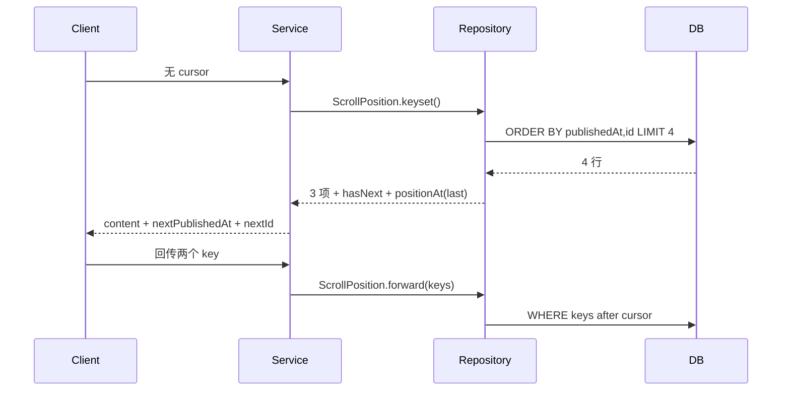

# Spring Data JPA 分页、Specification、批量写入与 Testcontainers

> 基准环境：Spring Boot 4.1.0、Spring Data JPA 4.1.0、Hibernate ORM 7.4.1.Final、Testcontainers 2.0.5、PostgreSQL 17；Java 17 编译目标。默认测试使用 H2 2.4，生产数据库测试使用可选 Docker 容器。

## 1. 为什么“查询能返回结果”还不够

上一课解决了 Entity 生命周期、关联和 N+1，但数据量增加后会出现新的问题：

- 一次查询把几十万行放进内存。
- 前端只需要下一屏，后端却执行昂贵的总数统计。
- 页码越深，数据库跳过的记录越多。
- 多个可选筛选条件组合成大量 Repository 方法。
- 用户把任意字符串当排序字段传入。
- 循环 save 10 万个实体，Persistence Context 持有全部对象。
- JPQL bulk UPDATE 改了数据库，内存中的 managed Entity 仍是旧状态。
- H2 测试通过，但 PostgreSQL 方言、索引和迁移失败。

这节课关注的不是增加更多注解，而是让查询成本随数据规模可预测。

## 2. 学习目标

完成本节后，你应该能够：

- 区分 List、Page、Slice 与 Window 的数据和成本边界。
- 解释 offset pagination 为什么在深页变慢。
- 为分页建立稳定排序和唯一 tie-breaker。
- 使用排序白名单隔离 API 字段与 Entity 属性。
- 使用 Specification 组合可选查询条件。
- 正确转义 LIKE 中的 `%`、`_` 和 escape 字符。
- 使用 keyset ScrollPosition 续读，不依赖深 offset。
- 区分 Hibernate JDBC batching 与 JPQL bulk DML。
- 解释为什么批量 DML 会让 Persistence Context 过期。
- 使用 flush/clear 控制一致性与内存。
- 使用 Testcontainers 和 `@ServiceConnection` 运行真实 PostgreSQL。
- 准确报告“测试跳过”和“测试通过”的区别。

## 3. 本课业务场景

课程目录有 12 条种子数据，字段包括：

```text
id / code / title / category / status / priceCents / publishedAt / version
```

API 支持：

```text
GET /api/catalog/courses
    ?keyword=spring
    &category=BACKEND
    &status=PUBLISHED
    &maxPriceCents=14000
    &page=0
    &size=5
    &sort=publishedAt
    &direction=DESC

GET /api/catalog/courses/scroll
    ?afterPublishedAt=...
    &afterId=...
```

第一个端点适合需要总页数的后台列表，第二个适合无限滚动或批处理续读。

## 4. 完整项目结构

```text
spring-boot-jpa-querying-at-scale/
├── pom.xml
└── src/
    ├── main/
    │   ├── java/learning/backend/jpaquery/
    │   │   ├── JpaQueryApplication.java
    │   │   ├── catalog/
    │   │   │   ├── CatalogCourse.java
    │   │   │   ├── CatalogCourseRepository.java
    │   │   │   ├── CourseSpecifications.java
    │   │   │   ├── CatalogQueryService.java
    │   │   │   ├── CatalogBatchService.java
    │   │   │   ├── CatalogController.java
    │   │   │   └── 查询 DTO 与枚举
    │   │   └── web/QueryExceptionHandler.java
    │   └── resources/
    │       ├── application.yaml
    │       └── db/migration/V1...sql、V2...sql
    └── test/
        ├── .../CatalogQueryApplicationTest.java
        └── .../PostgreSqlCatalogIntegrationTest.java
```

## 5. Maven 依赖与版本边界

<<< ../../../examples/java/spring-boot-jpa-querying-at-scale/pom.xml{xml:line-numbers} [pom.xml]

除了上一课的 JPA、Flyway、H2，本课增加：

- `spring-boot-testcontainers`：将 Container 转成 Boot ConnectionDetails。
- `testcontainers-postgresql`：PostgreSQL 17 容器。
- `testcontainers-junit-jupiter`：JUnit 生命周期集成。
- PostgreSQL JDBC Driver。
- `flyway-database-postgresql`：Flyway 的 PostgreSQL 数据库模块。

Testcontainers 2 使用 `testcontainers-postgresql` 模块；旧教程常见的 artifact 和包名可能属于 1.x。依赖由 Boot 管理时不手写版本，但升级 Boot 后仍应核对模块坐标。

## 6. 本课 Entity 为什么保持简单

<<< ../../../examples/java/spring-boot-jpa-querying-at-scale/src/main/java/learning/backend/jpaquery/catalog/CatalogCourse.java{java:line-numbers} [CatalogCourse.java]

本课故意使用单表实体，避免关联抓取干扰分页结论。所有 keyset 排序字段均非 null：

- `publishedAt`：主要排序键。
- `id`：唯一 tie-breaker。

`@Version` 保留乐观锁语义。bulk UPDATE 会显式将 version 加一，因为 bulk DML 不执行普通实体 dirty checking。

## 7. 不受限制的 List 查询为何危险

`List<CatalogCourse> findAll()` 的含义是“把所有匹配行物化为 Java 对象”。

数据量增加时会同时消耗：

- 数据库扫描和排序资源。
- 网络传输。
- JDBC ResultSet 处理。
- Entity 实例和初始快照内存。
- Persistence Context identity map。

即使最终只把前 20 条返回前端，其余对象也已经付出成本。限制必须进入数据库查询，而不是查询后在 Java 使用 `stream().limit(20)`。

## 8. List、Page、Slice、Window 的边界

| 返回类型 | 内容 | 是否知道总数 | 典型用途 |
| --- | --- | --- | --- |
| List | 当前查询全部结果 | 结果长度 | 小且有上限的集合 |
| Page | 一页内容 + total | 是 | 需要总页数的表格 |
| Slice | 一段内容 + hasNext | 否 | 只需上一页/下一页 |
| Window | 一窗内容 + ScrollPosition | 否 | offset/keyset 连续滚动 |

Page 不是“高级版 List”，它通常需要 count query。Slice 和 Window 减少了总数成本，但不能回答“共多少页”。

## 9. Page 的两条查询因果链

请求第一页、每页 3 条：

```text
SELECT ... WHERE status=? ORDER BY ... FETCH FIRST 3
SELECT COUNT(id) WHERE status=?
```

内容查询回答“这一页是什么”，count 查询回答“总共有多少”。

本课 Hibernate Statistics 实际记录 Page 为 2 条 prepared statement。复杂 join/group by 的 count 可能比内容查询更贵，不能把 total 当成免费字段。

## 10. Page 在最后一页有时为什么不 count

Spring Data 的分页工具在某些能推断总数的情况下可能省略 count，例如第一页返回数量小于 page size。

因此工程测试不应笼统断言“所有 Page 永远两条”。本课选择总数 9、page size 3 的第一页，明确需要 count，才得到稳定的 2 条。

结论应描述条件，而不是把当前实现优化误写成规范保证。

## 11. Slice 如何判断 hasNext

Slice 不查总数，通常请求 `size + 1` 条：

```text
页面 size=3
数据库最多取 4 条
  → 只返回前 3 条
  → 第 4 条存在则 hasNext=true
```

本课实际验证 Slice 只产生 1 条 prepared statement。

它适合移动端信息流、无限滚动和“不显示总页数”的 API。若产品页面必须显示“第 3/42 页”，Slice 无法提供该信息。

## 12. offset pagination 如何执行

page=1000、size=20 通常变成：

```sql
ORDER BY published_at DESC
OFFSET 20000 ROWS
FETCH FIRST 20 ROWS ONLY
```

客户端只收到 20 行，但数据库往往仍需定位、排序或跳过前 20000 行。offset 越深，成本可能越高。

索引可以改善定位，但不会让任意复杂过滤和排序的深页变成零成本。

## 13. 分页必须有稳定排序

如果只按可能重复的 price 排序：

```text
第一页：A(9900), B(9900), C(9900)
并发插入 D(9900)
第二页边界可能重复或遗漏
```

本课 Page 排序在用户字段后追加 `id`：

```java
Sort.by(direction, sortProperty).and(Sort.by("id"))
```

唯一 tie-breaker 给相同主排序值确定顺序。数据库不保证“没有 ORDER BY 时按主键返回”，也不保证相同排序值内部顺序固定。

## 14. 排序字段为何必须白名单

Controller 收到的 `sort` 是外部协议。若直接传给 `Sort.by(userInput)`：

- 用户可探测 Entity 内部字段。
- 拼错字段变成运行时 500。
- 关联路径可能制造额外 join。
- 暴露 version 等不应公开的实现字段。
- `JpaSort.unsafe` 还可能接受函数表达式。

本课只允许：

```text
publishedAt / title / priceCents / code
```

无效字段返回 400。白名单也可以把 API 名称映射为不同实体属性，让数据库重构不破坏公开协议。

## 15. 为什么限制 page 与 size

本课限制：

```text
page >= 0
1 <= size <= 50
```

如果允许 `size=1000000`，分页接口仍会退化成全量查询。前端体验偏好不能越过数据库和内存预算。

生产还要限制最大可访问深页，或在深页切换 keyset/cursor。

## 16. 可选条件为何产生组合爆炸

四个可选字段 keyword、category、status、maxPrice 有 16 种存在组合。

为每个组合声明方法会变成：

```text
findByStatus(...)
findByCategoryAndStatus(...)
findByTitleContainingAndCategoryAndStatus(...)
findByTitleContainingAndCategoryAndStatusAndPriceCentsLessThanEqual(...)
...
```

条件继续增加时方法数量和名称都失控。Specification 将每个条件表达为可组合 predicate。

## 17. Specification 的准确边界

Spring Data `Specification<T>` 是围绕 JPA Criteria API 的查询 predicate：

```java
Predicate toPredicate(
    Root<T> root,
    CriteriaQuery<?> query,
    CriteriaBuilder builder
)
```

它适合：

- 动态存在的筛选条件。
- 可复用 AND/OR 规则。
- 与 Page、Slice 或 Fluent Query 组合。

它不是完整业务规则引擎，也不会自动设计索引、join 与 projection。

## 18. 本课 Specification 完整实现

<<< ../../../examples/java/spring-boot-jpa-querying-at-scale/src/main/java/learning/backend/jpaquery/catalog/CourseSpecifications.java{java:line-numbers} [CourseSpecifications.java]

执行过程：

```text
读取 CourseSearchCriteria
  → 只为非空字段建立 Specification
  → Specification.allOf 组合 AND
  → JpaSpecificationExecutor 构建 CriteriaQuery
  → Hibernate 生成带参数 SQL
```

未提供 category 时，不生成 `category = ?`，而不是写成 `category = NULL`。

## 19. LIKE 参数化仍需处理通配符

PreparedStatement 防止输入变成 SQL 结构，但 `%` 和 `_` 在 LIKE 值内部仍有通配语义：

- `%`：任意长度字符。
- `_`：单个字符。

如果用户搜索字面值 `100%`，直接包成 `%100%%` 会扩大匹配。

本课先转义反斜线、百分号和下划线，再显式声明 escape 字符。SQL 注入防护与业务搜索语义是两层不同问题。

## 20. Criteria 字符串属性的边界

`root.get("priceCents")` 依赖字符串，重命名字段时编译器不会提示。

可选方案：

- 小型项目集中常量并用集成测试覆盖。
- 使用 JPA static metamodel，例如 `CatalogCourse_.priceCents`。
- 使用 Querydsl 生成类型安全 Q 类。
- 复杂读模型改为明确 JPQL/SQL。

Specification 的价值是组合，不意味着必须接受任意字符串。

## 21. Repository 完整代码

<<< ../../../examples/java/spring-boot-jpa-querying-at-scale/src/main/java/learning/backend/jpaquery/catalog/CatalogCourseRepository.java{java:line-numbers} [CatalogCourseRepository.java]

Repository 同时展示：

- `JpaSpecificationExecutor` 动态筛选。
- Page 与 Slice 对照。
- Spring Data keyset Window。
- `@Modifying` bulk UPDATE。

四者共享同一 Entity，但执行与一致性语义不同。

## 22. Query Service 如何定义查询协议

<<< ../../../examples/java/spring-boot-jpa-querying-at-scale/src/main/java/learning/backend/jpaquery/catalog/CatalogQueryService.java{java:line-numbers} [CatalogQueryService.java]

Service 承担：

- page/size 上限。
- 排序白名单。
- 稳定 tie-breaker。
- Criteria 组合。
- Entity → DTO 映射。
- keyset cursor 的输入完整性。

把这些逻辑全部交给通用 Pageable 参数解析器会减少代码，但也可能把内部属性和过大 size 暴露出去。公开 API 应显式定义边界。

## 23. keyset pagination 解决什么

keyset 不说“跳过前 20000 行”，而说“从最后看到的排序键之后继续”。

第一窗：

```sql
WHERE status = 'PUBLISHED'
ORDER BY published_at DESC, id DESC
FETCH FIRST 4 ROWS ONLY
```

第二窗实际生成：

```sql
WHERE status = 'PUBLISHED'
  AND (
    published_at < ?
    OR (published_at = ? AND id < ?)
  )
ORDER BY published_at DESC, id DESC
FETCH FIRST 4 ROWS ONLY
```

复合索引可从已知键附近继续，而不是从结果开头累计 offset。

## 24. 为什么 keyset 需要全部排序键

仅传 `publishedAt` 不够，因为多个 Course 可能同一时刻发布。

cursor 必须包含：

```text
publishedAt + id
```

Spring Data 会把主键补入排序以保证唯一性，但对外 cursor 仍必须保存 Window 提供的完整 keyset。丢字段会重复、遗漏或无法恢复位置。

## 25. keyset 字段为何要求非 null

SQL 中 null 与普通值的比较使用三值逻辑，不满足简单的 `<` / `>` 全序关系。不同数据库还有不同 null 排序规则。

Spring Data 官方明确要求 keyset 排序属性非 null，并建议使用匹配排序的索引。

本课 DDL 将 `published_at` 和 `id` 都定义为 NOT NULL。

## 26. Window 与 cursor 的因果链



Window 的位置是 exclusive：下一窗从 cursor 之后开始。

## 27. cursor 不应永远裸露为两个参数

本课为了教学可见性返回两个字段。生产通常把 keyset、筛选条件版本和方向编码成不透明 token：

```text
base64url(payload) + signature
```

需要防止：

- 客户端篡改 cursor。
- cursor 与不同筛选条件混用。
- schema/排序规则升级后旧 cursor 被错误解释。
- token 泄露敏感内部字段。

cursor 是协议状态，不只是数据库值拼接。

## 28. keyset 不能随机跳到第 100 页

keyset 擅长“继续下一窗”，不擅长按页码随机定位。

产品若要求：

- 跳到指定页：offset/Page 更自然。
- 无限滚动：keyset 更自然。
- 导出全部：WindowIterator 或批处理 reader。
- 显示总数：单独 count 或异步近似统计。

分页形式来自用户体验和成本需求，不是技术潮流选择。

## 29. 并发写入时分页语义

Page 1 返回后若有新记录插入：

- offset 页可能因排序位置移动而重复/遗漏。
- keyset 通常稳定地从已见键之后继续，但不会自动形成数据库快照。

如果业务要求整个导出看到同一时刻快照，需要事务隔离、快照时间条件或导出任务表，而不是只更换 cursor。

## 30. JDBC batching 与 bulk DML 不是一回事

| 机制 | SQL 形态 | Entity 生命周期 | 适用 |
| --- | --- | --- | --- |
| JDBC batching | 多次同构 INSERT/UPDATE 打包发送 | 仍走 persist/dirty checking | 新增多个实体 |
| JPQL bulk DML | 一条 UPDATE/DELETE 影响多行 | 绕过逐实体生命周期 | 条件批量变更 |

二者都叫“批量”，但因果链和风险完全不同。

## 31. Hibernate batching 配置

<<< ../../../examples/java/spring-boot-jpa-querying-at-scale/src/main/resources/application.yaml{yaml:line-numbers} [application.yaml]

关键配置：

```yaml
hibernate:
  jdbc:
    batch_size: 20
  order_inserts: true
  order_updates: true
```

batch_size 让相同 PreparedStatement 的多组参数按批提交；order_inserts/updates 尝试把同表 SQL 排在一起，提高成批机会。

日志仍可能打印每条逻辑 INSERT。要确认 JDBC batch，应观察 `org.hibernate.orm.jdbc.batch`、Driver/数据库指标和网络往返，而不是只数 SQL 日志行。

## 32. 主键策略会影响 insert batching

数据库 identity 主键通常要求每次 INSERT 后立即取得生成值，Hibernate 可能无法把这些 INSERT 延迟为普通 JDBC batch。

本课使用应用/provider 生成 UUID，在发送 INSERT 前已有 ID，适合 batching。

不能因此断言 UUID 永远优于 bigint。索引大小、写局部性、跨服务生成和数据库能力都要一起权衡。

## 33. saveAll 不是内存控制

`saveAll(100000 entities)` 仍可能让当前 Persistence Context 管理 100000 个实体和快照。

即使 JDBC 每 20 条发送一次，Java 堆里的 managed 对象不会因为网络 batch 自动释放。

所以批量写入还需要分块 flush/clear。

## 34. 本课批量插入实现

<<< ../../../examples/java/spring-boot-jpa-querying-at-scale/src/main/java/learning/backend/jpaquery/catalog/CatalogBatchService.java{java:line-numbers} [CatalogBatchService.java]

每 20 条：

```text
persist 20 个 Course
  → flush：执行 INSERT batch
  → clear：20 个 Entity 变 detached，释放 Context 引用
  → 下一块
```

最后再 flush/clear 处理不足 20 的尾块。

clear 前必须 flush，否则尚未同步的变化会丢失。clear 也会分离当前事务中其他 managed 实体，Service 边界必须专门为批处理设计。

## 35. 大事务不一定更快

把百万行放进一个事务会带来：

- 长时间持有连接和锁。
- 回滚日志膨胀。
- 失败后全部重做。
- Persistence Context 和 Driver 缓冲增长。
- 数据库复制延迟。

分块事务降低单次风险，但会产生部分完成状态。需要 job checkpoint、幂等键、失败重试和可观测进度。

批大小必须压测，不是复制 `20` 就获得最优性能。

## 36. bulk UPDATE 为什么快

本课归档旧草稿：

```jpql
UPDATE CatalogCourse c
SET c.status = :targetStatus,
    c.version = c.version + 1
WHERE c.status = :sourceStatus
  AND c.publishedAt < :cutoff
```

数据库一次匹配并更新多行，不需要：

```text
SELECT 所有 Entity
  → 创建对象
  → 循环修改
  → dirty checking 每个对象
```

适合状态迁移、过期标记和受控批量修正。

## 37. bulk DML 绕过了什么

JPQL bulk UPDATE 直接进入数据库，绕过：

- 当前 Persistence Context 中实体字段同步。
- dirty checking。
- `@PreUpdate` 等逐实体回调。
- 普通 `@Version` 自动检查与递增。
- 逐实体 Bean Validation。

本课在 JPQL 中显式 `version = version + 1`，但它仍不等于逐行乐观锁冲突检测。

若业务依赖回调或每行规则，不应直接 bulk。

## 38. managed Entity 为什么会过期

```text
Context 中 Course.status = DRAFT
  → bulk SQL 将数据库改为 ARCHIVED
  → Context 不知道逐行发生了什么
  → 再读原对象仍可能是 DRAFT
```

这会出现同一事务中 Java 对象与数据库不一致。

## 39. flushAutomatically 与 clearAutomatically

Repository 使用：

```java
@Modifying(
    flushAutomatically = true,
    clearAutomatically = true
)
```

- flush before：先同步 Context 中尚未写出的变化，避免 bulk 基于旧数据库状态执行。
- clear after：分离可能过期的 managed Entity，后续查询重新读取。

clear 会影响整个 Persistence Context，不只 bulk 命中的实体。这是正确性措施，也是需要明确的副作用。

## 40. bulk DML 与事务边界

`@Modifying` 只改变查询执行方式，不自动替所有声明查询建立业务事务。

本课由 `CatalogBatchService.archiveDraftsBefore` 的 `@Transactional` 定义事务。更新行数返回给调用方，用于日志、指标和异常判断。

批量写入需要记录：

- 过滤条件。
- 预期与实际影响行数。
- 事务耗时。
- 重试次数。
- job/request 标识。

## 41. Flyway DDL 与索引

<<< ../../../examples/java/spring-boot-jpa-querying-at-scale/src/main/resources/db/migration/V1__create_catalog_course.sql{sql:line-numbers} [V1__create_catalog_course.sql]

keyset 索引：

```sql
(status, published_at DESC, id DESC)
```

它与查询的等值过滤和排序顺序匹配。另一个 `(category, price_cents)` 支持常见分类价格过滤。

索引不是越多越好：每次 INSERT/UPDATE 都要维护索引，占用磁盘和缓存。最终要用生产数据库 EXPLAIN ANALYZE 验证。

## 42. 为什么 H2 测试仍不够

H2 可以快速验证：

- Repository 启动和 Criteria 组合。
- Page/Slice/Window 基本行为。
- flush/clear。
- 迁移的部分 SQL 语法。

它不能证明：

- PostgreSQL 方言完全兼容。
- 真实索引计划。
- timestamp/UUID/collation 行为。
- PostgreSQL 锁、MVCC 和统计信息。
- Flyway PostgreSQL module 与权限。

`MODE=PostgreSQL` 仍然不是 PostgreSQL。

## 43. Testcontainers 提供了什么

Testcontainers 在测试期间启动真实服务容器：

```text
JUnit 启动 PostgreSQL 17
  → Boot @ServiceConnection 提供 JDBC/Flyway ConnectionDetails
  → 覆盖 application.yaml 中 H2 连接
  → Flyway 对 PostgreSQL 执行 V1、V2
  → Hibernate validate
  → Repository 查询真实 PostgreSQL
  → 测试结束销毁容器
```

它减少共享测试库污染，并让每次测试从已知镜像与迁移开始。

## 44. PostgreSQL 测试完整代码

<<< ../../../examples/java/spring-boot-jpa-querying-at-scale/src/test/java/learning/backend/jpaquery/PostgreSqlCatalogIntegrationTest.java{java:line-numbers} [PostgreSqlCatalogIntegrationTest.java]

`@ServiceConnection` 根据 PostgreSQLContainer 创建 JDBC 和 Flyway ConnectionDetails，优先级高于 URL 配置。

测试断言 `SELECT version()` 以 PostgreSQL 17 开头，避免“以为用了容器，实际仍连 H2”。

## 45. disabledWithoutDocker 的准确含义

```java
@Testcontainers(disabledWithoutDocker = true)
```

当前机器没有可用 Docker 时，PostgreSQL 测试被标记 skipped。

这表示：

- 测试代码成功编译。
- 没有运行 PostgreSQL 断言。
- 不能报告“PostgreSQL 测试通过”。

本课当前验证结果就是 6 个 H2 测试通过、1 个 PostgreSQL 测试跳过。CI 应提供 Docker 并把容器测试作为必需检查，而不是长期允许跳过。

## 46. 容器镜像版本为何要固定

使用 `postgres:latest` 会让相同提交在不同日期运行不同数据库版本。

本课固定 `postgres:17-alpine`。更严格的流水线还可以固定 image digest。

升级数据库应作为显式任务：更新镜像、运行迁移、查询和性能回归，再合并。

## 47. 测试分层

推荐：

```text
Specification 纯逻辑/小型单元测试
  → H2 快速 Spring 集成测试
  → PostgreSQL Testcontainers
  → 预发布数据量与 EXPLAIN 验证
  → 生产监控
```

Testcontainers 提高数据库兼容性，但不会自动制造生产数据分布、并发和硬件。

## 48. 本课集成测试

<<< ../../../examples/java/spring-boot-jpa-querying-at-scale/src/test/java/learning/backend/jpaquery/catalog/CatalogQueryApplicationTest.java{java:line-numbers} [CatalogQueryApplicationTest.java]

六项 H2 测试证明：

1. Specification 只组合已提供条件。
2. Page 是 2 条 statement，Slice 是 1 条。
3. 两个 keyset Window 共 6 条且不重复。
4. 未授权排序字段返回 400。
5. bulk UPDATE 后 Context 被 clear，重新查询得到 ARCHIVED。
6. 25 条插入按 20 条分块 flush/clear 并全部提交。

测试使用明确数据规模，避免对不稳定实现细节做无条件断言。

## 49. Controller 与 HTTP 边界

<<< ../../../examples/java/spring-boot-jpa-querying-at-scale/src/main/java/learning/backend/jpaquery/catalog/CatalogController.java{java:line-numbers} [CatalogController.java]

Controller 将外部字符串转换为枚举和 Instant，再交给 Service 校验。

生产 API 还应统一处理：

- 无效枚举格式。
- Instant 解析失败。
- 参数过长。
- cursor 过期或签名失败。
- 查询超时。

不要把 Spring 默认异常页面直接暴露给客户端。

## 50. 本地构建与运行

```bash
cd examples/java/spring-boot-jpa-querying-at-scale
mvn -ntp clean package
java -jar target/spring-boot-jpa-querying-at-scale-1.0.0-SNAPSHOT.jar
```

端口为 18086。

动态筛选：

```bash
curl 'http://localhost:18086/api/catalog/courses?keyword=spring&category=BACKEND&status=PUBLISHED&maxPriceCents=14000&page=0&size=5&sort=publishedAt&direction=DESC'
```

第一窗：

```bash
curl 'http://localhost:18086/api/catalog/courses/scroll'
```

把响应中的 `nextPublishedAt` 和 `nextId` 同时传回取得下一窗。

## 51. 运行 PostgreSQL 容器测试

前提：

- Docker Desktop、Colima 或兼容容器运行时已启动。
- 可以拉取 `postgres:17-alpine`。

```bash
mvn -ntp test
```

观察 Surefire 汇总：PostgreSQL 测试应为 executed，而不是 skipped。

CI 中应缓存 Maven 依赖和容器镜像，并给容器启动设置合理超时；不要把镜像拉取网络故障误判为业务测试失败。

## 52. 常见故障：Page count 很慢

检查：

- count 是否带不必要 fetch join。
- Specification 是否加入多余 join。
- 是否真的需要精确 total。
- 过滤列是否有合适索引。
- 复杂 native query 是否提供正确 countQuery。
- 是否能改用 Slice/Window 或异步统计。

不要仅给内容查询加缓存却忽略每次 count。

## 53. 常见故障：滚动重复或遗漏

检查：

1. ORDER BY 是否稳定。
2. 是否包含唯一 tie-breaker。
3. cursor 是否保存所有排序键。
4. 方向与比较符号是否匹配。
5. 排序字段是否 nullable。
6. cursor 是否和原筛选条件绑定。
7. 并发写入下业务需要的是续读还是一致快照。

## 54. 常见故障：bulk 后对象仍是旧值

原因通常是 bulk DML 绕过 Context。

处理：

- bulk 前 flush。
- bulk 后 clear，或对特定实体 refresh。
- 后续不要继续使用旧引用。
- 将 bulk 放在专用 Service 事务边界。

不要通过再次调用普通 getter 期待 Hibernate 自动知道数据库被 bulk 改了。

## 55. 常见故障：配置 batch_size 但没有 batching

检查：

- 主键是否使用 identity。
- SQL 是否同构且相邻。
- 是否频繁手工 flush。
- Driver 是否支持和启用 batching。
- batch_size 是否实际传给 Hibernate。
- 是否只看 SQL DEBUG 行数。
- 是否存在不同实体类型交错。

用 `org.hibernate.orm.jdbc.batch` TRACE 和数据库指标验证，而不是凭配置文件宣布成功。

## 56. Page、Slice、Window 选择表

| 需求 | 建议 |
| --- | --- |
| 后台表格显示总页数 | Page |
| 上一页/下一页，不显示总数 | Slice |
| 无限滚动、按顺序续读 | keyset Window |
| 小型固定参考数据 | List + 明确上限 |
| 全量离线处理 | WindowIterator/批处理框架 |
| 任意跳页 | offset Page |
| 深页高吞吐 | keyset |

选择取决于产品语义。后端不能同时承诺任意跳页、实时总数、深页低延迟和完全一致快照，却不付出额外成本。

## 57. 工程清单

- 所有列表查询有数据库侧上限。
- Page 只有在需要精确 total 时使用。
- 排序包含稳定唯一 tie-breaker。
- 外部 sort 使用白名单或映射表。
- page/size/cursor 长度有上限。
- Specification 条件只在参数存在时加入。
- LIKE 字面搜索正确转义通配符。
- keyset 字段非 null，并有匹配索引。
- cursor 保存全部 sort key，并防篡改。
- 批量 persist 按块 flush/clear。
- batch_size 通过日志与指标验证。
- bulk DML 明确绕过回调和 Context。
- bulk 前 flush、后 clear，并处理 version。
- 大任务具备 checkpoint、幂等和进度指标。
- H2 用于快速反馈，真实数据库容器用于兼容性。
- CI 不把容器测试长期静默跳过。
- 性能结论由真实数据与 EXPLAIN 支撑。

## 58. 本节总结

- Page 通常执行内容查询和 count，Slice 只多取一条判断 hasNext。
- offset 页越深，数据库跳过数据的成本越明显。
- 稳定排序必须包含唯一 tie-breaker。
- 排序白名单保护协议、性能和内部模型边界。
- Specification 组合动态 predicate，避免 Repository 方法组合爆炸。
- 参数化 LIKE 仍要处理 `%` 和 `_` 的业务通配语义。
- keyset Window 从最后排序键之后续读，适合无限滚动和大结果遍历。
- keyset 需要非 null 排序键、完整 cursor 与匹配索引。
- JDBC batching 是多条同构 DML 成批发送，bulk DML 是一条语句影响多行。
- batch_size 不会自动控制 Persistence Context 内存，仍需分块 flush/clear。
- JPQL bulk 绕过 dirty checking、回调和普通 version 处理。
- `flushAutomatically + clearAutomatically` 解决 bulk 前未同步和 bulk 后旧对象问题。
- Testcontainers 用真实 PostgreSQL 验证 H2 无法证明的方言与迁移。
- skipped 不是 passed；当前无 Docker 环境只能报告 PostgreSQL 测试跳过。

下一节建议：Spring Boot 缓存抽象、Caffeine、Redis、缓存一致性与防击穿。

## 59. 参考资料

- [Spring Data JPA：Specifications](https://docs.spring.io/spring-data/jpa/reference/jpa/specifications.html)
- [Spring Data JPA：Query Methods、Sort 与 Scrolling](https://docs.spring.io/spring-data/jpa/reference/jpa/query-methods.html)
- [Spring Data Commons：Scrolling](https://docs.spring.io/spring-data/commons/reference/repositories/scrolling.html)
- [Spring Data：ScrollPosition API](https://docs.spring.io/spring-data/commons/docs/current/api/org/springframework/data/domain/ScrollPosition.html)
- [Spring Data：Window API](https://docs.spring.io/spring-data/commons/docs/current/api/org/springframework/data/domain/Window.html)
- [Spring Data JPA：Modifying API](https://docs.spring.io/spring-data/jpa/reference/api/java/org/springframework/data/jpa/repository/Modifying.html)
- [Spring Data JPA：Transactionality](https://docs.spring.io/spring-data/jpa/reference/jpa/transactions.html)
- [Spring Boot：Testcontainers](https://docs.spring.io/spring-boot/reference/testing/testcontainers.html)
- [Testcontainers：PostgreSQL Module](https://java.testcontainers.org/modules/databases/postgres/)
- [Testcontainers：Database Containers](https://java.testcontainers.org/modules/databases/)
- [Hibernate ORM User Guide](https://docs.jboss.org/hibernate/orm/current/userguide/html_single/Hibernate_User_Guide.html)
- [Spring Boot：Managed Dependency Coordinates](https://docs.spring.io/spring-boot/appendix/dependency-versions/coordinates.html)
