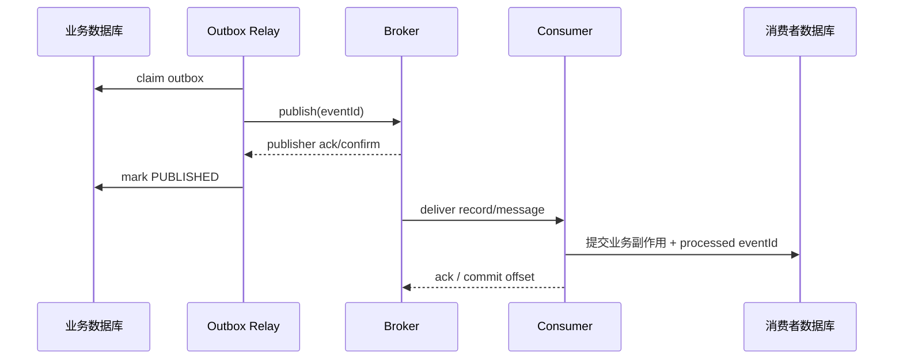
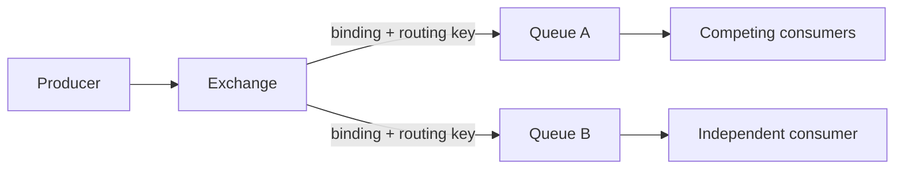
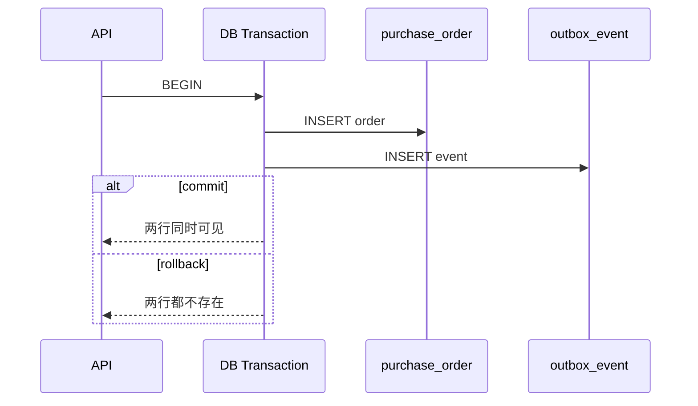
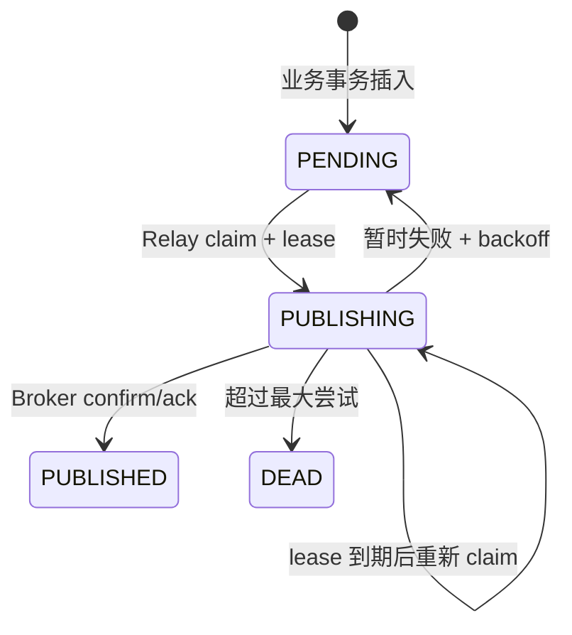
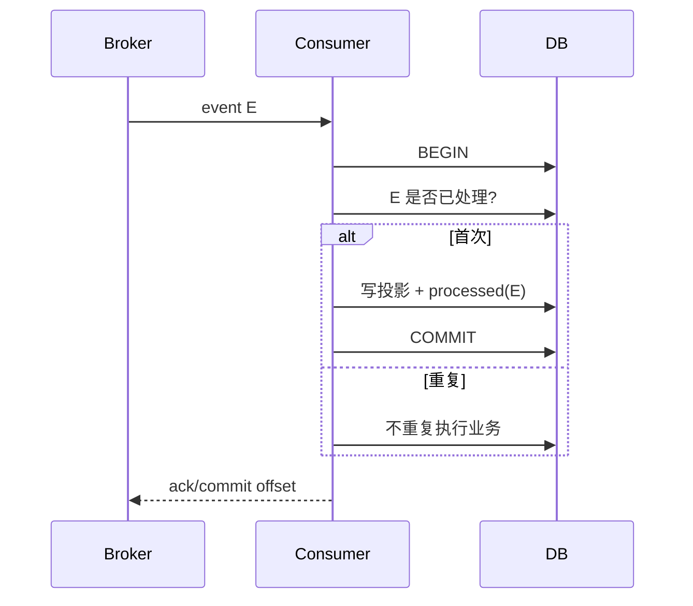

# Spring Boot 消息驱动、RabbitMQ、Kafka、可靠投递与 Transactional Outbox

上一课的进程内线程池可以让请求快速返回，但任务只存在于当前 JVM：进程崩溃、滚动发布或机器故障都可能让已接受任务消失。消息 Broker 把“等待处理的工作或事件”移出应用进程，使生产者和消费者可以独立伸缩、重启与恢复。

Broker 并不会自动让业务获得“恰好一次”。一次消息链路至少包含数据库提交、生产者发送、Broker 接管、消费者读取、业务副作用提交、消费确认六个阶段。任何相邻阶段之间都可能失败，可靠设计必须逐段说明谁拥有消息、失败后谁重试，以及重复发生时怎样保持业务正确。

> 这是进阶课。第一次不要同时记 RabbitMQ 和 Kafka 全部名词，只追踪一条消息从生产者到 Broker、消费者和确认的所有权变化。先接受“可能重复”，再理解幂等；先看见数据库与发送之间的 dual write，才引入 Outbox。

## 先不选 RabbitMQ 或 Kafka：画责任转移

下单成功后要发通知。可靠链路至少是：

```text
OrderApplicationService
  → 本地 transaction 保存订单 + outbox
  → relay 读取 outbox 并 publish
  → broker 确认接管
  → consumer 收到 delivery/record
  → consumer 提交本地业务副作用
  → 最后 ack/commit offset
```

每一步的确认只覆盖自己之前的边界：publisher confirm 不能证明邮件已发送；consumer ack 也不能证明生产者数据库仍然一致。

## 为什么 Spring listener 可能收到同一消息两次

```text
@RabbitListener / @KafkaListener 开始执行
  → 业务写入成功
  → 应用在 ack/offset commit 前崩溃
  → broker 看不到完成确认
  → 重启后再次投递
```

因此 listener 的输入合同必须允许重复。常见本地事务：

```text
插入 processed_message(messageId)
  → 若唯一键已存在：直接结束
  → 否则执行业务写入
  → 去重记录与业务写入一起 commit
  → commit 成功后才让容器确认消费
```

只用内存 Set 去重，重启后会忘记；先确认再提交业务，崩溃会永久丢失；业务提交后没有去重，重投会重复副作用。

## RabbitMQ 与 Kafka 先按读取模型区分

| 关注点 | RabbitMQ 常见 queue 模型 | Kafka append-only log 模型 |
| --- | --- | --- |
| 消费位置 | broker 管 delivery/ack | consumer group 管 partition offset |
| 消费后数据 | 通常从 queue 移除 | 按 retention 保留，可重新读取 |
| 路由 | exchange/binding/routing key | topic/partition |
| 顺序边界 | queue/consumer 配置相关 | 单 partition 内 |

这不是产品优劣表。先从“任务竞争消费”还是“事件流可回放”、顺序范围、保留时间和吞吐需求选择，再学习 Spring AMQP/Kafka 配置。

## Outbox 解决哪一条缝

它只解决“业务数据库 commit”和“待发送事实记录”之间的原子性：两者同一个 transaction。relay 发布后、标记前仍可能崩溃，所以 outbox 仍会重复发布，消费者幂等仍不可省略。

## 1. 版本、环境与学习目标

本课示例基于：

- Spring Boot 4.1.0。
- Spring AMQP 4.1.0。
- Spring for Apache Kafka 4.1.0。
- Java 17 编译目标。
- Maven 3.9.16。
- H2 + JPA + Flyway 演示业务表、Outbox 和消费去重表。
- 默认 Recording Publisher，无需外部 Broker。
- `rabbit` Profile 使用 RabbitMQ。
- `kafka` Profile 使用 Apache Kafka。
- 示例端口 `18089`。

完成后应能解释：

- 消息、事件、命令和任务的边界。
- Queue 与 append-only log 的读取模型差异。
- RabbitMQ exchange、binding、routing key、queue 与 consumer。
- Kafka topic、partition、offset、consumer group 与 ordering。
- publisher confirm、publisher return、consumer ack 分别证明什么。
- Kafka producer ack 与 consumer offset commit 的准确边界。
- at-most-once、at-least-once 和 exactly-once 应怎样理解。
- 为什么数据库更新与 Broker send 构成 dual write。
- Transactional Outbox 解决了什么，没有解决什么。
- Relay 如何 claim、租约、重试、退避和进入 DEAD。
- 为什么消费者必须按 eventId 幂等。
- 消息 schema、key、顺序、重放和毒消息怎样治理。

## 2. 为什么需要消息 Broker

进程内异步：

```text
HTTP → JVM queue → worker
```

Broker 异步：

```text
HTTP → producer → Broker durable storage → consumer
```

Broker 带来的主要能力：

- 任务跨应用重启存活（取决于持久化与复制配置）。
- 生产和消费速率解耦。
- 多个 consumer 实例竞争或分区消费。
- ack/offset 记录处理进度。
- 重试、死信、保留与重放。
- 生产者和消费者独立部署。

代价也很明确：

- 新的网络与存储系统。
- 消息可能重复、延迟、乱序。
- schema 必须长期兼容。
- 故障恢复与积压需要运维。
- 端到端一致性不会自动出现。

## 3. 消息、命令、事件、任务不是同义词

### 3.1 Message

消息是传输 envelope：通常包含 ID、type、key、timestamp、headers 和 payload。它描述传输格式，不直接决定业务语义。

### 3.2 Command

命令表达“请执行某动作”，通常有明确处理者，例如 `ChargePayment`。它可能被拒绝，也可能失败。

### 3.3 Event

事件表达“某事实已经发生”，例如 `OrderCreated.v1`。消费者不应让已发生事实回滚，而应基于事实更新自己的状态。

### 3.4 Task/Job

任务描述需要完成的工作，可能包含状态、重试、截止时间和进度，例如生成报表。

把命令命名成过去式事件会误导消费者；把事件当 RPC 请求又会制造隐式耦合。

## 4. 消息 envelope 为什么要独立于 payload

示例 envelope：

<<< ../../../examples/java/spring-boot-messaging-outbox/src/main/java/learning/backend/messaging/outbox/OutboxMessage.java{java:line-numbers} [OutboxMessage.java]

字段作用：

- `eventId`：全局稳定身份，消费者去重。
- `aggregateType`：业务聚合类别。
- `aggregateId`：路由、分区与相同聚合顺序 key。
- `eventType`：包含显式版本，例如 `OrderCreated.v1`。
- `payload`：事件特有字段。
- `occurredAt`：业务事件产生时间，不是消费者收到时间。

不要用 Broker 自动生成的 delivery tag 或 Kafka offset 作为跨系统事件 ID：它们只在特定 queue/channel 或 topic/partition 中有意义。

## 5. 消息所有权转移

可靠链路可以理解为所有权逐段转移：



每个确认只覆盖相邻边界，不能跨越整条链路。

## 6. Queue 与 Log 的根本差异

### 6.1 传统 Queue 视角

消息进入 queue，由 competing consumers 中一个取得。确认后 Broker 可以删除或推进该消息。它天然适合工作分发。

### 6.2 Kafka Log 视角

消息追加到 partition log，在保留期内不会因某个 consumer 读取就立即删除。每个 consumer group 保存自己的 offset，因此不同 group 可以独立读取、重放同一事件流。

```text
partition: [0][1][2][3][4][5]...
group A offset:       ^
group B offset:             ^
```

RabbitMQ 也有 stream 等模型，Kafka 也能承载任务，但理解产品默认数据模型仍然重要。

## 7. RabbitMQ AMQP 路由模型

AMQP 0-9-1 中 producer 通常不直接“发给 queue”，而是发给 exchange：



核心对象：

- Exchange：根据类型与 binding 路由。
- Routing key：producer 提供的路由字符串。
- Binding：exchange 到 queue 的匹配规则。
- Queue：保存待消费消息。
- Consumer：订阅 queue。

同一消息路由到两个 queue，两个业务消费者都能获得副本；同一 queue 内多个 consumer 通常竞争分担工作。

## 8. RabbitMQ Exchange 类型

- direct：routing key 精确匹配。
- topic：按点分隔词与 `*`、`#` 模式匹配。
- fanout：忽略 routing key，广播给所有 binding。
- headers：按 header 匹配。

示例用 topic exchange：

<<< ../../../examples/java/spring-boot-messaging-outbox/src/main/java/learning/backend/messaging/broker/RabbitTopologyConfiguration.java{java:line-numbers} [RabbitTopologyConfiguration.java]

`purchase-order.*` 可以匹配 `purchase-order.created`。拓扑声明应幂等、版本化，并明确 durable、exclusive、auto-delete。

## 9. RabbitMQ 持久消息的边界

要提高 Broker 重启后的存活概率，通常需要：

- durable exchange。
- durable queue。
- persistent message delivery mode。
- 合适的 quorum queue/复制策略。
- publisher confirm。

只把 delivery mode 设为 persistent，不代表消息已经安全复制到所有期望节点；准确保证取决于 queue 类型、集群和 confirm 时机。

## 10. Rabbit Publisher Confirm 证明什么

Confirm 表示 RabbitMQ 对该 publish 承担了责任或返回 nack。它不证明：

- 消息成功路由到期望 queue（需要 return/mandatory 观察无路由）。
- consumer 已收到。
- consumer 业务已提交。
- 下游副作用成功。

网络中断时可能出现：Broker 已接收并发出 confirm，但 producer 没收到。Producer 重试会产生重复，因此 confirm 支撑的是可靠重传，不是天然去重。

## 11. Rabbit Publisher Return 证明什么

消息到达存在的 exchange，但没有任何 binding 匹配时，mandatory publish 可触发 return。Confirm ack 与“路由到正确 queue”不是同一事实。

示例同时等待 confirm 并检查 returned message：

<<< ../../../examples/java/spring-boot-messaging-outbox/src/main/java/learning/backend/messaging/broker/RabbitOutboxPublisher.java{java:line-numbers} [RabbitOutboxPublisher.java]

等待设置超时，防止 Relay 永久卡在不确定状态。超时后重试仍可能重复。

## 12. Rabbit Consumer Ack 证明什么

Consumer ack 表示消费者愿意承担该 delivery 的完成责任，Broker 可以删除或推进它。正确顺序通常是：

```text
收到消息
→ 开启消费者数据库事务
→ 幂等检查
→ 写业务副作用
→ 提交事务
→ ack
```

若先 ack 再提交数据库，进程在中间崩溃会永久丢失业务处理。若提交后 ack 前崩溃，Broker 会重投，消费者必须去重。

## 13. Rabbit Prefetch 与公平性

Prefetch 控制 consumer 同时持有多少未确认 delivery：

- 太大：慢 consumer 囤积消息，内存增大，重新投递批量放大。
- 太小：网络往返多，吞吐受限。
- 单条耗时差异大时，小 prefetch 更公平。

它不是线程池并发数的别名。Listener container concurrency、prefetch、下游连接池必须一起规划。

## 14. Rabbit Dead Letter 的边界

Reject/nack、TTL 到期、queue 长度等可让消息进入 dead-letter exchange。DLQ 不是垃圾桶：

- 保存原 eventId、错误原因、首次/最后失败时间。
- 有告警和负责人。
- 修复后可受控重放。
- 重放仍走幂等消费者。
- 防止 DLQ 与原 queue 之间无限循环。

## 15. Kafka Topic 与 Partition

Kafka topic 被拆成 partition。每个 partition 是有序追加日志：

```text
topic orders
  partition 0: key A → [0][1][2]
  partition 1: key B → [0][1]
  partition 2: key C → [0][1][2][3]
```

Kafka 只保证 partition 内顺序，不保证整个 topic 全局顺序。增加 partition 能提高并行度，但会改变 key 到 partition 的映射条件，扩容前要评估顺序语义。

## 16. Kafka Message Key 为什么重要

相同 key 通常由 partitioner 路由到同一 partition，因此相同订单的事件可以保持 partition 内顺序。

示例使用 `aggregateId` 作为 key：

<<< ../../../examples/java/spring-boot-messaging-outbox/src/main/java/learning/backend/messaging/broker/KafkaOutboxPublisher.java{java:line-numbers} [KafkaOutboxPublisher.java]

如果 key 为 null，消息可能轮转到不同 partition；`OrderCreated`、`OrderPaid`、`OrderCancelled` 就可能在消费者眼中乱序。

## 17. Kafka Consumer Group

同一个 group 中，一个 partition 在同一时刻交给一个 consumer member：

- partitions=6、consumers=3：每个约处理 2 个 partition。
- partitions=3、consumers=10：最多 3 个活跃，其他空闲。

不同 group 各自读取完整 topic：订单投影、通知和风控应使用不同 group，而不是把三个业务放进同一个 group 互相竞争消息。

## 18. Kafka Offset 是什么

Offset 是 record 在 partition 中的位置。Consumer 有两个相关位置：

- current position：下一次 poll 从哪里读。
- committed offset：故障恢复时 group 从哪里继续。

若业务处理完成前 commit offset，崩溃可能丢处理；若业务提交后 commit 前崩溃，record 会重复。

因此常见可靠语义仍是 at-least-once + idempotent consumer。

## 19. Kafka Producer acks

- `acks=0`：不等待 Broker，应答快但丢失风险高。
- `acks=1`：leader 确认，不等待所有 ISR。
- `acks=all`：等待配置要求的 in-sync replicas，耐久性更强。

`acks=all` 仍要结合 replication factor、`min.insync.replicas` 和 producer 重试。它不证明 consumer 已处理。

示例设置 `acks=all` 和 idempotent producer，但不把它宣传成数据库到消费者的 exactly-once。

## 20. Kafka Idempotent Producer 的边界

Idempotent producer 能在 producer session 与 partition 范围内抑制因网络重试产生的重复写入，并保持序列约束。它不能自动去重：

- 应用主动调用 `send` 两次。
- Outbox relay 重启后再次发布同一 eventId。
- 不同 producer instance 发布同一业务事件。
- 消费者副作用重复。

业务 eventId 仍然必要。

## 21. Kafka Transaction 与 EOS 的边界

Kafka transaction 可以原子完成 Kafka 的 read-process-write：消费输入 record、写出 Kafka record、提交输入 offsets。

Spring Kafka EOS 文档明确其范围是 Kafka read/process/write。若 process 中还写普通关系数据库，数据库事务与 Kafka transaction 仍是两个资源，不能仅凭 EOS 宣称端到端 exactly-once。

可以同步两个 transaction manager，但故障顺序仍需要补偿。Outbox 或数据库幂等通常更容易推理。

## 22. RabbitMQ 与 Kafka 怎么选

| 维度 | RabbitMQ 典型模型 | Kafka 典型模型 |
| --- | --- | --- |
| 数据结构 | Queue + exchange routing | Partitioned retained log |
| 消费后数据 | ack 后可删除 | 按保留策略继续存在 |
| 重放 | 通常需 DLQ/重发设计 | 调整 offset 可重放 |
| 路由 | exchange/binding 灵活 | topic + key/partition |
| 顺序 | queue/consumer 配置相关 | partition 内顺序 |
| 工作分发 | 非常自然 | consumer group 可实现 |
| 多种独立消费 | 多 queue | 多 consumer group |
| 长期事件流 | stream 可做 | 核心能力 |

选择应从读取模型、保留、重放、顺序、吞吐和团队运维经验出发，不应以“Kafka 更大”或“Rabbit 更简单”一刀切。

## 23. Delivery Semantics

### 23.1 At-most-once

消息最多处理一次，可能丢失。典型实现是先确认/提交进度，再执行业务。

### 23.2 At-least-once

消息不会因为可恢复故障永久丢失，但可能重复。典型实现是先提交业务，再确认消息。

### 23.3 Exactly-once

必须先声明范围。Broker 内部日志写入、Kafka read-process-write、数据库业务副作用、外部支付 API 是不同范围。

工程上更常实现：

```text
at-least-once delivery + idempotent effect = effectively once business outcome
```

## 24. 为什么生产者直接 send 有 dual-write 问题

错误方案：

```java
@Transactional
public void createOrder() {
    database.insert(order);
    broker.send(event);
}
```

本地数据库事务不能原子控制 Broker。

失败排列：

1. DB commit 成功，send 失败：订单存在但消费者永远不知道。
2. send 成功，DB rollback：消费者看到一个不存在的订单。
3. send 状态未知，应用重试：可能重复。

调整两行顺序不能消除问题，只会改变哪种不一致更常见。

## 25. 为什么简单 AFTER_COMMIT 仍会丢消息

`@TransactionalEventListener(AFTER_COMMIT)` 能避免数据库回滚时发送事件，但仍有窗口：

```text
DB commit
→ 进程崩溃
→ listener 尚未 send
```

事务事件适合可容忍小概率丢失的本地副作用。不能丢的跨服务事件需要持久化发布意图。

## 26. Transactional Outbox 的核心

在同一个数据库事务中写：

- 业务行。
- outbox_event 行。



这样不会出现“订单已提交但没有待发布记录”。Relay 可以稍后可靠扫描未发布行。

## 27. 示例业务事务

<<< ../../../examples/java/spring-boot-messaging-outbox/src/main/java/learning/backend/messaging/order/OrderApplicationService.java{java:line-numbers} [OrderApplicationService.java]

注意：方法没有直接调用 RabbitTemplate 或 KafkaTemplate。它只依赖本地数据库事务。

`createThenFail` 的测试验证异常后 purchase_order 与 outbox_event 都回滚。

## 28. Outbox 表字段为什么这样设计

<<< ../../../examples/java/spring-boot-messaging-outbox/src/main/resources/db/migration/V1__create_order_and_outbox.sql{sql:line-numbers} [V1__create_order_and_outbox.sql]

关键字段：

- id：eventId。
- aggregate_id：Kafka key/业务顺序。
- event_type：schema 版本。
- payload：不可变事件数据。
- status：PENDING/PUBLISHING/PUBLISHED/DEAD。
- attempts：尝试次数。
- next_attempt_at：退避调度。
- locked_until：claim 租约。
- published_at：确认发布时间。
- last_error：受限长度的诊断信息。

索引服务于“找可发布记录”，不是按习惯给每列建索引。

## 29. Outbox 状态机



PUBLISHED 不等于 consumer 已处理，只表示 Relay 接受了 Broker 的生产确认。

## 30. Claim 为什么需要数据库锁

多个应用实例都运行 Relay 时，若先 SELECT 再 UPDATE，没有锁的实例可能取得同一批记录。

示例用 pessimistic write lock：

<<< ../../../examples/java/spring-boot-messaging-outbox/src/main/java/learning/backend/messaging/outbox/OutboxEventRepository.java{java:line-numbers} [OutboxEventRepository.java]

在同一短事务中：

1. 锁定有限批次。
2. 标为 PUBLISHING。
3. 设置 locked_until。
4. 提交 claim。

然后在事务外进行网络 publish，避免持有数据库锁等待 Broker。

生产 PostgreSQL 常用 `FOR UPDATE SKIP LOCKED` 提高多 relay 并发；JPA 可移植写法与特定数据库能力要分别验证。

## 31. Lease 为什么必要

Relay claim 后可能在 publish 前崩溃。若状态永久停在 PUBLISHING，消息不会再处理。

`locked_until` 到期后，其他 relay 可重新 claim。Lease 必须：

- 长于正常 publish P99。
- 有最大值，避免永久锁。
- 对超长操作支持受控续租。
- 使用统一时钟来源，注意节点时钟偏差。

Lease 过短会让仍在发布的事件被另一实例并发重发。

## 32. Relay 为什么在事务外 publish

若在持有数据库行锁的事务内等待网络：

- Broker 慢会延长 DB transaction。
- 连接池与锁被占用。
- DB deadlock/timeout 风险增加。
- 吞吐受最慢 Broker ack 限制。

示例先 claim 提交，再发布，再用独立短事务标记结果：

<<< ../../../examples/java/spring-boot-messaging-outbox/src/main/java/learning/backend/messaging/outbox/OutboxRelay.java{java:line-numbers} [OutboxRelay.java]

代价是发布与 mark PUBLISHED 之间存在重复窗口，这正是 at-least-once 的来源。

## 33. 无法消除的重复窗口

```text
Broker 接收 event E
→ 返回 ack
→ Relay 进程崩溃
→ outbox 仍是 PUBLISHING
→ lease 到期
→ 新 Relay 再次 publish E
```

生产者无法判断“ack 丢了”还是“Broker 没收到”，安全选择是重发。因此消费者必须按稳定 eventId 去重。

## 34. 重试与指数退避

示例失败后按 attempts 增长 next_attempt_at，并设置上限：

```text
2s → 4s → 8s → 16s → ... capped
```

生产中加入随机抖动，避免 Broker 恢复时所有实例整齐重试造成 thundering herd。

只重试瞬时错误：连接超时、可恢复 nack。Schema 无法解析、目标 exchange 不存在等配置错误需要快速进入 DEAD 并告警，而非永远重试。

## 35. DEAD 状态不是终点管理

DEAD 事件需要：

- 事件与 aggregate 链接。
- 尝试次数和最后错误。
- 首次/最后失败时间。
- 负责人和告警。
- 修复后人工或自动重放入口。
- 重放审计。

清理 Outbox 时不能先删仍需排障的 DEAD。PUBLISHED 的保留期也应满足审计与恢复需求。

## 36. Polling Publisher 与 CDC

### 36.1 Polling

应用定时查询 Outbox、claim、publish。优点是简单、没有 CDC 平台；缺点是轮询延迟、数据库查询负载和状态更新。

### 36.2 CDC/Debezium

Debezium 从数据库事务日志捕获 Outbox INSERT，再通过 Outbox Event Router 路由到 Kafka。优点是减少应用轮询与更新；代价是运行 Kafka Connect/CDC、管理 schema 与 connector offset。

Debezium 默认 Outbox 模型也包含 event id、aggregate type/id、type 和 payload。aggregateId 作为 Kafka key 对顺序很重要。

## 37. 消费者为什么要幂等

重复来源包括：

- producer 未收到 confirm 后重发。
- Relay ack 后、mark PUBLISHED 前崩溃。
- consumer 业务提交后、ack/offset commit 前崩溃。
- rebalance 导致尚未提交 offset 的 record 重读。
- 人工重放。
- 上游业务错误地产生两个同语义事件。

“平时没有重复”不是保证。幂等必须成为持久业务约束。

## 38. Inbox/Processed Message 模式

消费者在同一数据库事务内写：

- 业务副作用。
- `(consumer_name, event_id)` 去重记录。



## 39. 示例幂等消费者

<<< ../../../examples/java/spring-boot-messaging-outbox/src/main/java/learning/backend/messaging/consumer/IdempotentOrderConsumer.java{java:line-numbers} [IdempotentOrderConsumer.java]

数据库还有唯一约束：

```text
UNIQUE (consumer_name, event_id)
```

应用层 exists 检查用于快速识别顺序重复，唯一约束才是并发竞态的最终防线。并发冲突事务回滚后，Broker 重投会进入 duplicate 路径。

## 40. 为什么 consumer_name 也在唯一键

同一事件可被多个逻辑消费者独立处理：

```text
order-projection-v1 + event E
notification-v1     + event E
risk-v2             + event E
```

若只以 eventId 全局唯一，投影先处理后会错误阻止通知消费者。去重作用域必须对应具体消费职责与版本。

## 41. 幂等不是只做去重表

某些副作用需要业务幂等键：

- 支付 API 使用 merchantRequestId。
- 发券表以 `(campaignId, userId)` 唯一。
- 状态转换用期望版本或合法状态条件。
- 邮件供应商使用 provider idempotency key（若支持）。

若消费者提交本地 processed_message 后，调用外部 API 前崩溃，简单去重表会阻止重试外部动作。需要调整状态机、outbox 二次发布、Saga 或下游幂等接口。

## 42. Ack 与数据库事务顺序

推荐：业务事务提交后 ack/commit。

```text
DB commit → crash → no ack → redelivery → duplicate check → ack
```

结果是重复 delivery，但业务只应用一次。

相反：

```text
ack → crash → DB not committed
```

消息已经从 Broker 进度中消失，业务永远未执行。

## 43. Poison Message

某条消息每次都因确定性错误失败，会无限阻塞或重试：

- JSON 无法解析。
- 必填字段缺失。
- schema 不兼容。
- 业务前置数据永久不存在。

处理：

- 有限 retry。
- 区分 retryable/non-retryable。
- 进入 DLQ/DLT。
- 保存原始 bytes、headers 和错误。
- 告警并可受控重放。

Kafka 非阻塞 retry topic 会把失败 record 转发到其他 topic，这可能失去原 topic 的严格顺序，必须明确取舍。

## 44. 消息 Schema 是长期公共 API

事件一旦进入保留日志，旧消费者、重放任务和数据平台可能数月后仍读取。Schema 演进要遵守兼容性：

- 添加可选字段通常比删除/改类型安全。
- 字段语义不能静默改变。
- enum 新值会击穿穷举消费者。
- 时间、金额、时区和精度要明确。
- event type 显式版本化。

不要直接序列化 JPA Entity：关联、代理、内部字段和重构会污染公共契约。

## 45. JSON、Avro、Protobuf

- JSON：可读、生态广，schema 约束需额外治理。
- Avro：紧凑，配合 schema registry 有兼容检查。
- Protobuf：强 schema、跨语言，需要 field number 演进纪律。

选择不只看字节大小，还要考虑治理工具、跨语言、兼容检查和数据平台需求。

示例用 Jackson 3 JSON envelope：

<<< ../../../examples/java/spring-boot-messaging-outbox/src/main/java/learning/backend/messaging/outbox/OutboxMessageCodec.java{java:line-numbers} [OutboxMessageCodec.java]

## 46. Payload 应包含多少数据

### Notification style

事件携带消费者所需快照，减少回查生产者服务。缺点是 payload 大、敏感数据复制与 schema 更多。

### Event-carried state transfer

携带完整状态，消费者本地构建读模型，解耦更强。

### Thin event

只携带 ID，让消费者回调生产者 API。简单但重新产生运行时耦合、N+1 网络和历史重放困难。

选择由数据所有权、敏感性、重放和一致性需求决定。

## 47. 事件时间与处理时间

- occurredAt：生产者业务事务发生时间。
- publishedAt：Relay/Broker 接管时间。
- consumedAt：消费者收到时间。
- processedAt：消费者业务提交时间。

四个时间不同。监控端到端 lag 需要分别记录，不能用 Kafka record timestamp 替代全部业务时间。

## 48. 顺序不是免费属性

要保持同一 aggregate 顺序：

- Outbox 按 aggregate version/created order 生成。
- Kafka 用 aggregateId key。
- Rabbit 需要合适 queue/consumer concurrency 或按 key 分片。
- Consumer 拒绝旧 version 或等待缺口。

全局顺序会严重限制并行度。多数业务只需要“同一订单有序”，不需要“所有订单全局有序”。

## 49. 乱序与版本防护

事件可携带 aggregateVersion：

```text
OrderCreated version=1
OrderPaid    version=2
OrderShipped version=3
```

消费者保存 lastVersion：

- version == last+1：应用。
- version <= last：重复/旧事件。
- version > last+1：出现缺口，暂存、重试或重建。

本课示例聚焦单一 Created 事件，没有实现完整 version state machine，但生产设计必须考虑。

## 50. Backpressure 与 Lag

Broker 能削峰但不是无限容量：

```text
produce rate > consume rate
→ queue depth / consumer lag 增长
→ 业务数据越来越旧
→ 磁盘和保留压力增加
```

监控：

- Rabbit queue ready/unacked、publish/ack rate。
- Kafka consumer lag、records-lag-max、rebalance。
- Outbox PENDING 数与 oldest age。
- Relay publish latency、failure、DEAD。
- Consumer processing latency、retry、DLQ。

只监控 Broker 存活无法发现业务已经落后两小时。

## 51. Consumer 并发与下游容量

增加 listener concurrency 会增加：

- 数据库连接。
- 外部 API 并发。
- 内存与反序列化。
- partition/queue 竞争。

Kafka 并发上限受 partition 数限制；Rabbit concurrency 受 prefetch 与 queue 消费模型影响。Consumer 线程数要与数据库池、HTTP 客户端连接池和下游 rate limit 对齐。

## 52. Rebalance 的影响

Kafka group 成员变化会重新分配 partition。期间可能暂停消费，尚未提交 offsets 的 records 会在新 owner 重读。

长处理应注意 `max.poll.interval.ms`，不要让 consumer 因处理过久被认为失联。可调 batch、暂停 partition、把工作交给有界 executor，但必须维护 offset 与完成顺序。

## 53. 不要在 Listener 中无限阻塞

Listener 线程负责 poll/交付。无限等待外部 API 会：

- 阻塞 partition/queue 进度。
- 触发 Kafka poll timeout/rebalance。
- 积累 Rabbit unacked。
- 延长 shutdown。

所有外部调用要有 timeout。长任务可转换为持久任务状态，但转交后何时 ack 必须保证任务意图已经可靠落库。

## 54. Broker 安全

生产至少考虑：

- TLS 与证书校验。
- 最小权限的 producer/consumer 用户或 ACL。
- 每环境隔离 topic/vhost/cluster。
- Secret 不进 Git。
- 禁止不可信 payload 的原生对象反序列化。
- 限制消息大小与 header。
- 敏感数据分类、加密和保留期。
- 管理端口不暴露公网。

Kafka trusted packages 或 Java serialization 配置不是便利开关，应按明确类型白名单管理。

## 55. Profile 与运行方式

默认模式使用 Recording Publisher，不连接 Broker：

```bash
mvn spring-boot:run
```

RabbitMQ：

```bash
mvn spring-boot:run -Dspring-boot.run.profiles=rabbit
```

Kafka：

```bash
mvn spring-boot:run -Dspring-boot.run.profiles=kafka
```

不要同时启用 `rabbit,kafka`，示例有两个 MessagePublisher，语义不明确。生产配置应使用独立部署或显式 fan-out publisher，并定义部分成功策略。

## 56. Spring Boot 自动配置

Rabbit：

- `spring-boot-starter-amqp`。
- `spring.rabbitmq.*` 配置连接。
- 自动配置 RabbitTemplate、AmqpAdmin 和 listener container factory。
- `@RabbitListener` 创建消费端点。

Kafka：

- `spring-kafka`。
- `spring.kafka.*` 配置 producer/consumer/admin。
- 自动配置 KafkaTemplate 和 listener container factory。
- `@KafkaListener` 创建消费端点。

完整依赖：

<<< ../../../examples/java/spring-boot-messaging-outbox/pom.xml{xml:line-numbers} [pom.xml]

## 57. Broker Listener 适配层

Rabbit listener：

<<< ../../../examples/java/spring-boot-messaging-outbox/src/main/java/learning/backend/messaging/broker/RabbitOrderListener.java{java:line-numbers} [RabbitOrderListener.java]

Kafka listener：

<<< ../../../examples/java/spring-boot-messaging-outbox/src/main/java/learning/backend/messaging/broker/KafkaOrderListener.java{java:line-numbers} [KafkaOrderListener.java]

两者只负责协议适配：decode envelope 后调用同一个幂等业务 consumer。这样 Broker 选择不会侵入核心业务。

## 58. API 演示流程

创建订单：

```bash
curl -sS -X POST http://localhost:18089/api/orders \
  -H 'Content-Type: application/json' \
  -d '{"customerId":"customer-001","totalCents":12900}'
```

响应包含 orderId 与 outboxEventId。此时事件仍是 PENDING。

默认模式手工触发 relay：

```bash
curl -sS -X POST http://localhost:18089/api/outbox/relay
curl -sS http://localhost:18089/api/outbox/status
curl -sS http://localhost:18089/api/recorded-messages
```

生产通常由 scheduled relay 或 CDC 自动发布；手工端点只为观察学习链路，不应无认证暴露。

## 59. 自动化测试验证什么

<<< ../../../examples/java/spring-boot-messaging-outbox/src/test/java/learning/backend/messaging/MessagingOutboxApplicationTest.java{java:line-numbers} [MessagingOutboxApplicationTest.java]

覆盖：

1. 订单与 Outbox 在同一事务同时提交。
2. 事务回滚时两张表都没有数据。
3. Relay 发布成功后标记 PUBLISHED。
4. Broker 临时失败后恢复 PENDING、增加 attempts 并退避。
5. 退避窗口内不会立即再次 claim。
6. 同一 eventId 投递两次只应用一次投影。
7. JSON envelope round-trip 保留身份与 payload。
8. HTTP 创建、手工 Relay 与记录消息端点贯通。

默认测试不需要 RabbitMQ/Kafka。两个真实适配器参与 Java 编译，但没有外部 Broker 时不会声称集成运行通过。

## 60. 为什么 H2 不能证明生产 Claim 正确

H2 可以验证事务与状态机基本行为，但不能证明：

- PostgreSQL/MySQL 的 lock wait 与 SKIP LOCKED。
- 多 relay 高并发吞吐。
- crash 后 lease 恢复。
- Broker confirm、rebalance 和网络分区。
- schema 方言与索引计划。

生产项目前应使用 Testcontainers 运行真实数据库、RabbitMQ/Kafka，加入故障注入与重复投递测试。

## 61. 常见故障：Outbox 越积越多

检查：

- Relay 是否运行。
- oldest PENDING age。
- next_attempt_at 是否在未来。
- PUBLISHING lease 是否永久不释放。
- Broker confirm timeout。
- DB claim 查询是否走索引。
- 单批大小与执行周期。
- DEAD 是否持续增长。

不要只增加 batchSize；若 Broker/consumer 已过载，会把压力向下游扩散。

## 62. 常见故障：Rabbit confirm ack 但没有消费者消息

可能原因：

- routing key 没有匹配 binding。
- publish 未启用 mandatory/returns。
- 消息进入了另一个 queue。
- queue TTL/dead-letter 生效。
- consumer 连接了其他 vhost。
- consumer 反复失败并 requeue。

Confirm ack 只说明 Broker 接管 publish，不代表正确路由和业务完成。

## 63. 常见故障：Kafka 消费顺序错误

检查：

- 相同 aggregate 是否使用相同 key。
- 是否跨 partition 期待全局顺序。
- retry topic 是否打破原 partition 顺序。
- consumer 内部并行是否按完成顺序提交 offset。
- topic partition 数是否改变。
- 是否有多个生产者生成逻辑乱序事件。

## 64. 常见故障：同一业务执行两次

重复是 at-least-once 的正常输入。检查：

- eventId 是否稳定，重试是否重新生成 ID。
- processed_message 是否与业务副作用同事务。
- 唯一约束是否正确包含 consumerName。
- 外部 API 是否使用业务幂等键。
- ack/offset 是否在事务提交后。
- 去重记录是否过早清理。

## 65. 常见故障：消费者一直重试毒消息

需要分类：

- 网络 timeout：退避重试。
- 数据暂未就绪：有限延迟重试。
- JSON/schema 错误：直接 DLT。
- 权限/配置错误：告警并暂停，不做高频重试。
- 业务拒绝：记录业务结果，通常不应当系统异常重试。

无限 requeue 会占满吞吐并制造日志风暴。

## 66. 测试分层

### 单元测试

- schema codec。
- backoff 计算。
- retryable 分类。
- routing key/topic/key 生成。

### 数据库集成测试

- 业务 + Outbox 原子提交/回滚。
- claim 锁与多 relay。
- lease 过期恢复。
- processed_message 唯一约束。

### Broker 集成测试

- Rabbit confirm、return、ack、DLQ。
- Kafka acks、partition key、offset、rebalance、DLT。
- serializer/header。

### 故障测试

- publish 后 mark 前杀进程。
- consumer DB commit 后 ack 前杀进程。
- Broker 暂停/网络分区。
- 重复与乱序注入。

## 67. 生产工程清单

- 消息语义是 command/event/task 已明确。
- 每条消息有稳定 eventId。
- aggregateId 作为适当路由/partition key。
- eventType 显式版本化。
- payload 不直接序列化 Entity。
- DB 业务与 Outbox 同事务。
- Relay claim 有锁、批次和 lease。
- 网络 publish 不长期持有 DB 锁。
- Publisher 等待有限时 confirm/ack。
- Rabbit mandatory return 已处理。
- Kafka acks/replication/min ISR 已匹配耐久要求。
- 发布失败有分类、退避、抖动和 DEAD。
- 监控 oldest pending age，而非只看条数。
- Consumer 业务副作用与 processed ID 同事务。
- 数据库唯一约束是幂等最终防线。
- 外部副作用有业务 idempotency key。
- ack/offset 在业务提交后。
- 毒消息进入 DLQ/DLT 并告警。
- schema registry/兼容规则已定义。
- 顺序范围明确到 aggregate/partition。
- listener 并发不超过下游容量。
- 安全使用 TLS、ACL、secret 与安全反序列化。
- Outbox/Inbox 有归档和保留策略。
- 真实 Broker 与数据库容器测试。
- 故障注入验证重复而非假设 exactly-once。

## 68. 本节总结

- Broker 把任务移出 JVM，提供持久缓冲、独立伸缩与恢复进度。
- RabbitMQ 以 exchange/binding/queue 路由，Kafka 以 retained partition log 与 offset 组织消费。
- Publisher confirm、return、consumer ack 和 Kafka offset 各自只证明局部阶段。
- at-least-once 的正常结果是可能重复，而不是框架缺陷。
- Kafka idempotent producer/EOS 有明确 Kafka 范围，不能覆盖任意数据库与外部 API。
- 数据库更新后直接 send 是 dual write，任何顺序都有不一致窗口。
- Transactional Outbox 让业务行和发布意图在同一 DB 事务提交。
- Relay claim 后在事务外 publish，并用 lease、backoff、DEAD 恢复。
- Broker ack 后、mark PUBLISHED 前崩溃仍会重复发布。
- Consumer 必须按 eventId 幂等，并让业务副作用与 processed record 同事务。
- 消息 schema、key、顺序、重放与安全都是长期公共契约。
- 可靠消息的工程目标通常是 at-least-once delivery + idempotent business effect。

下一节：[Spring Security：认证、授权、过滤器链、密码、Session、JWT、CSRF 与 CORS](/backend/spring-boot/security-authentication-authorization-session-jwt-and-csrf)。

## 69. 参考资料

- [Spring Boot：AMQP / RabbitMQ](https://docs.spring.io/spring-boot/reference/messaging/amqp.html)
- [Spring Boot：Apache Kafka](https://docs.spring.io/spring-boot/reference/messaging/kafka.html)
- [Spring AMQP：AmqpTemplate 与 Publisher Confirms](https://docs.spring.io/spring-amqp/reference/amqp/template.html)
- [RabbitMQ：AMQP Model](https://www.rabbitmq.com/tutorials/amqp-concepts)
- [RabbitMQ：Reliability Guide](https://www.rabbitmq.com/docs/reliability)
- [RabbitMQ：Consumer Acknowledgements and Publisher Confirms](https://www.rabbitmq.com/docs/confirms)
- [Spring Kafka：Transactions](https://docs.spring.io/spring-kafka/reference/kafka/transactions.html)
- [Spring Kafka：Exactly Once Semantics](https://docs.spring.io/spring-kafka/reference/kafka/exactly-once.html)
- [Spring Kafka：Non-blocking Retries](https://docs.spring.io/spring-kafka/reference/retrytopic.html)
- [Apache Kafka Documentation](https://kafka.apache.org/documentation/)
- [Debezium：Outbox Event Router](https://debezium.io/documentation/reference/stable/transformations/outbox-event-router.html)
