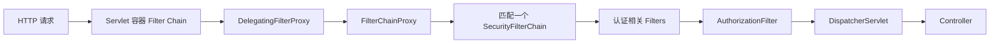
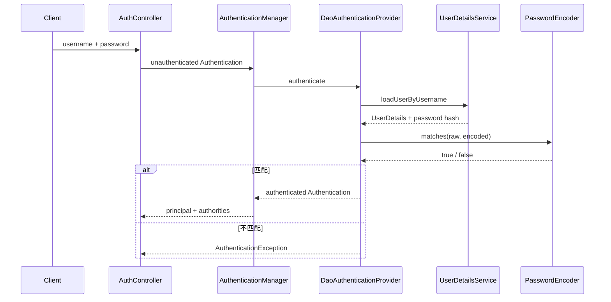
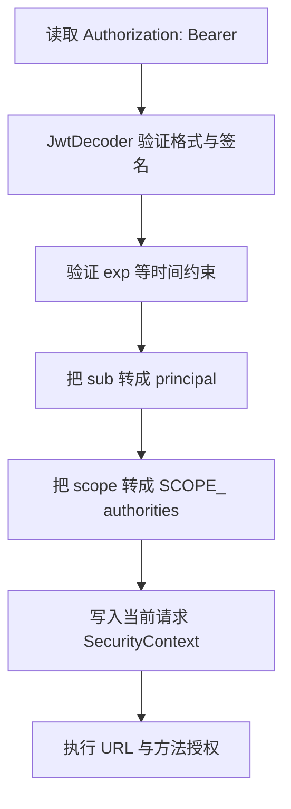
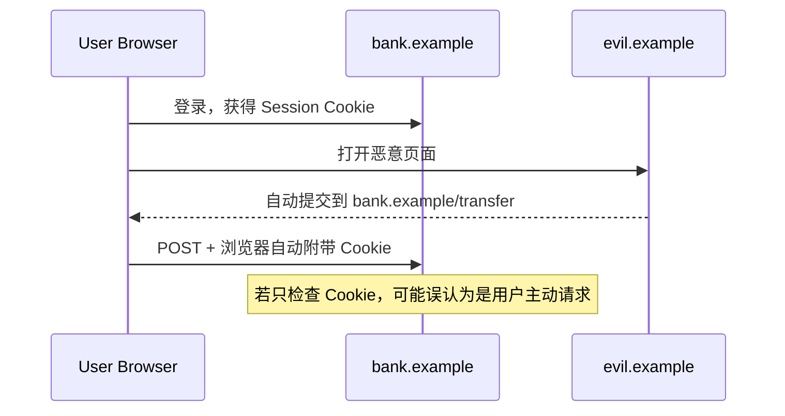

# Spring Security：认证、授权、过滤器链、密码、Session、JWT、CSRF 与 CORS

> 版本边界：Spring Boot 4.1.0、Spring Security 7.0.x、Java 17、Maven 3.9+。示例是 Servlet / Spring MVC 应用，不是 WebFlux 应用。

## 1. 为什么业务功能正确仍然不够

一个订单接口可能在功能上完全正确：参数合法时创建订单，数据写入数据库，响应状态码也准确。但如果任何人都能调用它，或者普通用户能读取别人的订单，那么“功能正确”并不等于“系统正确”。

安全代码需要持续回答四类不同问题：

1. 请求来自谁？
2. 如何证明这个身份？
3. 这个身份能做什么？
4. 即使身份合法，这次请求是否可能由攻击者诱导产生？

它们分别涉及身份、认证、授权和请求伪造防护。把这些问题混成一个 `if (token != null)`，通常就是漏洞的起点。

第一次阅读先沿着一条受保护请求理解：过滤器从凭据恢复身份，把认证结果放进 SecurityContext，再按 URL、方法和业务对象检查权限。密码、Session/JWT、CSRF 与 CORS 是这条链上不同边界，不要把“使用 JWT”当成整套安全设计。

## 2. 本课的学习目标

完成本课后，应能解释：

- Spring Security 为什么工作在 Controller 之前；
- `SecurityFilterChain`、`AuthenticationManager`、`AuthenticationProvider` 和 `SecurityContext` 如何协作；
- 401 与 403 为什么不能互换；
- 密码哈希为什么不是加密，为什么同一个密码会生成不同结果；
- Session Cookie 与 JWT 各自保存什么，服务器如何恢复当前用户；
- 为什么“无状态”不等于“更安全”；
- CSRF 保护何时必要，为什么 CORS 不能替代 CSRF；
- URL 授权、方法授权与对象级授权分别负责什么；
- 如何测试成功路径以及攻击者真正会触发的失败路径。

## 3. 先划清核心概念的边界

### 3.1 身份、凭据与主体

**身份 identity** 是“系统认为你是谁”，例如用户 `reader`。

**凭据 credential** 是用来证明身份的材料，例如密码、一次性验证码、客户端证书或 Bearer Token。凭据不是身份本身。

**主体 principal** 是认证完成后，程序中代表当前身份的对象。Spring Security 的 `Authentication#getPrincipal()` 常保存 `UserDetails` 或 JWT。

常见误解是把用户名和密码一起称为“用户”。用户名通常只是身份声明，密码才是凭据；在认证成功前，系统还不能相信这个身份声明。

### 3.2 认证与授权

**认证 authentication** 判断“你是否真的是所声称的身份”。

**授权 authorization** 判断“已知身份是否允许执行当前操作”。

因果顺序是：

```text
读取凭据 → 验证凭据 → 建立可信 Authentication → 根据权限做授权决策
```

认证成功不意味着拥有全部权限。门禁验证了员工卡是真的，仍然需要检查这张卡是否能进入机房。

### 3.3 Role、Authority、Scope

Spring Security 最终使用 `GrantedAuthority` 字符串做授权判断。

- `ROLE_ADMIN` 是一种带 `ROLE_` 前缀约定的 authority；
- `hasRole("ADMIN")` 实际检查 `ROLE_ADMIN`；
- OAuth 2.0 scope 表示客户端获准访问的能力范围；
- Resource Server 默认把 `scope` / `scp` 转成 `SCOPE_xxx` authority。

Role 通常描述组织角色，scope 通常描述令牌被授予的能力。二者可以映射，但不是同一个协议概念。

### 3.4 401 与 403

- `401 Unauthorized` 的真实语义是“尚未通过认证，或凭据无效”；
- `403 Forbidden` 表示身份已经可信，但权限不足，或请求被 CSRF 等安全规则拒绝。

错误密码、过期 JWT、缺少 JWT 应返回 401。普通用户访问管理员接口应返回 403。

## 4. Spring Boot 加入 Security 后发生什么

当 Security 依赖位于 classpath 且应用没有提供自己的配置时，Spring Boot 会默认保护 Web 应用，并创建一个临时用户。正式项目通常会声明自己的 `SecurityFilterChain`，从而接管路径规则和认证方式。

本课依赖如下：

<<< ../../../examples/java/spring-boot-security-auth/pom.xml{xml:line-numbers} [pom.xml]

`spring-boot-starter-security` 提供 Servlet Security；`spring-boot-starter-oauth2-resource-server` 提供 Bearer Token 和 JWT 验证。后者不是授权服务器，也不会自动提供登录、注册或刷新令牌接口。

## 5. 请求为什么先经过过滤器

Spring MVC 的 Controller 由 `DispatcherServlet` 调用。在请求到达 Servlet 之前，Servlet 容器会先执行 Filter Chain。Spring Security 正是利用这个标准扩展点。



这解释了为什么 Controller 上打断点时，有些请求根本进不来：它们已经在认证、CSRF 或授权阶段被拒绝。

### 5.1 DelegatingFilterProxy

Servlet 容器管理 Filter，Spring 容器管理 Bean。`DelegatingFilterProxy` 连接两套生命周期，把请求委托给 Spring Bean。

### 5.2 FilterChainProxy

`FilterChainProxy` 是 Spring Security 的总入口。它负责：

- 根据请求选择安全链；
- 按确定顺序执行安全过滤器；
- 应用防火墙；
- 在请求结束后清理安全上下文，避免线程复用造成身份泄漏。

### 5.3 SecurityFilterChain

一个 `SecurityFilterChain` 包含：

1. 判断自己是否匹配请求的 `RequestMatcher`；
2. 匹配后需要执行的一组 Security Filter。

当存在多条链时，按 `@Order` 从小到大寻找，**第一个匹配链获胜**，不会把所有匹配链合并。

## 6. 为什么本课使用三条安全链

完整配置如下：

<<< ../../../examples/java/spring-boot-security-auth/src/main/java/learning/backend/security/config/SecurityConfiguration.java{java:line-numbers} [SecurityConfiguration.java]

三条链分别是：

| 顺序 | 匹配路径 | 状态模型 | 认证材料 |
| --- | --- | --- | --- |
| 1 | `/api/**` | `STATELESS` | `Authorization: Bearer ...` |
| 2 | `/session/**` | 服务端 Session | `JSESSIONID` Cookie |
| 3 | 其他路径 | 默认拒绝 | 无 |

这样做不是为了追求配置数量，而是为了让每条链只有一个清晰安全模型。

最后的兜底链采用 `denyAll()`。这叫 fail closed：新增 Controller 如果忘记配置安全策略，默认不可访问，而不是悄悄公开。

## 7. 一次用户名密码认证如何执行

本课的 token 和 session 登录接口都会创建一个“未认证”的 `UsernamePasswordAuthenticationToken`，然后交给 `AuthenticationManager`。



### 7.1 Authentication

`Authentication` 同时表示认证请求和认证结果：

- 认证前包含用户提交的身份与凭据，`isAuthenticated()` 为 false；
- 认证后包含可信 principal 和 authorities，凭据通常被擦除。

不要在业务代码里自己把 `isAuthenticated` 改为 true。可信认证结果应由 `AuthenticationProvider` 创建。

### 7.2 AuthenticationManager 与 ProviderManager

`AuthenticationManager` 是认证入口接口。常用实现 `ProviderManager` 按顺序尝试多个 `AuthenticationProvider`。

这允许同一系统组合用户名密码、LDAP、证书等认证方式。Provider 是否支持某个 `Authentication` 类型，与认证最终成功与否是两个判断。

### 7.3 DaoAuthenticationProvider

它负责用户名密码认证，但不要求用户一定来自数据库：

1. 用 `UserDetailsService` 按用户名加载账户；
2. 检查账户是否锁定、过期或禁用；
3. 用 `PasswordEncoder` 比对密码；
4. 认证成功后生成带权限的 `Authentication`。

本课用 `InMemoryUserDetailsManager` 保持示例聚焦。生产项目通常用数据库实现或外部身份提供方，但过滤器链和 Provider 的因果关系不变。

## 8. 密码为什么绝不能明文保存

数据库泄漏是现实威胁。若保存明文，攻击者立刻得到全部密码，而且用户可能在其他站点复用密码。

密码存储需要**单向、自适应、带盐的密码哈希函数**：

- 单向：不能从保存值还原原密码；
- 自适应：可以调高计算成本，抵抗硬件进步；
- 盐：相同密码也产生不同保存值，抵抗预计算表和批量比对。

### 8.1 哈希不是加密

加密设计目标是持有密钥者能够解密；密码验证不需要恢复原文，只需判断输入是否匹配。因此密码应该 hash，不应该使用可逆 AES 存储。

### 8.2 为什么不能直接比较两个 hash

每次编码会生成新盐：

```text
encode("same-password") → {bcrypt}$2a$10$随机盐A...
encode("same-password") → {bcrypt}$2a$10$随机盐B...
```

两段字符串不同是正确行为。验证必须使用：

```java
passwordEncoder.matches(rawPassword, storedHash)
```

它会从保存值读出算法参数和盐，再完成验证。

### 8.3 DelegatingPasswordEncoder

本课使用 `PasswordEncoderFactories.createDelegatingPasswordEncoder()`，保存格式为：

```text
{id}encodedPassword
```

新密码可以用当前算法编码，旧密码仍可根据 `{id}` 选择历史算法验证。这解决的是算法迁移问题，不代表所有旧算法都安全到可以无限期保留。

BCrypt 等自适应算法应结合服务器容量测量成本。成本过低降低抗破解能力，成本过高则可能被登录洪泛放大为拒绝服务。

## 9. SecurityContext 保存什么

`SecurityContext` 保存当前请求的 `Authentication`。业务代码通过方法参数、`SecurityContextHolder` 或 Spring MVC 参数解析获得当前主体。

默认策略通常使用 `ThreadLocal` 绑定当前线程，因此：

- 同一请求线程中的下游代码能读取当前身份；
- 请求结束必须清理；
- `@Async`、新线程和消息消费者不会自动继承这个身份；
- 不能把 HTTP 用户身份假设为后台任务的永久上下文。

这与上一课讨论的 MDC / ThreadLocal 上下文传播具有相同风险，但安全上下文泄漏的后果更严重。

## 10. Session 登录：状态保存在哪里

本课 Session 登录实现如下：

<<< ../../../examples/java/spring-boot-security-auth/src/main/java/learning/backend/security/auth/AuthController.java{java:line-numbers} [AuthController.java]

成功后发生：

1. 服务器验证用户名密码；
2. 创建包含已认证 `Authentication` 的 `SecurityContext`；
3. `HttpSessionSecurityContextRepository` 把它保存到服务端 Session；
4. 响应通过 `JSESSIONID` Cookie 告诉浏览器 Session 标识；
5. 后续请求带 Cookie，服务器按标识找回安全上下文。

```text
浏览器保存：随机 Session ID
服务器保存：Session ID → SecurityContext / Authentication
```

Cookie 不是把密码存入浏览器，也通常不包含完整用户对象。

### 10.1 Session 的优点

- 服务端可立即注销或强制失效；
- 权限变化可在服务端快速生效；
- 浏览器使用 `HttpOnly`、`Secure`、`SameSite` Cookie 时较自然；
- 不需要前端 JavaScript 读取凭据。

### 10.2 Session 的代价

- 多实例部署需要粘性会话或共享 Session 存储；
- 服务端需要维护状态和过期清理；
- Cookie 会被浏览器自动附带，因此必须认真处理 CSRF。

“使用 Session 就无法扩容”是误解。Spring Session + Redis 等方案可以共享状态，只是引入了额外基础设施和一致性成本。

## 11. JWT：令牌中保存什么

JWT 是一种紧凑声明格式，由三个 Base64URL 部分组成：

```text
header.payload.signature
```

header 描述算法，payload 保存 claims，signature 让验证方检测内容是否被篡改。

**普通签名 JWT 只签名，不加密。** 拿到令牌的人通常能读取 payload，因此不要放密码、身份证号或不必要的隐私数据。

### 11.1 本课如何签发 Token

<<< ../../../examples/java/spring-boot-security-auth/src/main/java/learning/backend/security/auth/TokenService.java{java:line-numbers} [TokenService.java]

本课设置：

- `iss`：签发者；
- `sub`：用户标识；
- `iat`：签发时间；
- `exp`：10 分钟过期时间；
- `scope`：授权范围。
- `authorities`：本课自签发令牌保留的角色与 scope authority。

Resource Server 收到 Bearer Token 后，本课的自定义 converter 从 `authorities` claim 恢复 `ROLE_` 与 `SCOPE_` 权限。接入标准身份提供方时，应根据对方真实的 claim 契约配置映射，而不是假设所有 JWT 都有相同字段。



客户端不能通过修改 payload 给自己增加 scope，因为签名将不再匹配。客户端若偷到一个合法令牌，则可在过期前冒用它，所以 Bearer Token 的含义就是“持有者即可使用”。

### 11.2 为什么 API 链设置 STATELESS

`SessionCreationPolicy.STATELESS` 表示 Spring Security 不用 HTTP Session 保存和恢复该链的认证状态。每个请求都必须重新携带令牌并验证。

无状态解决的是服务器状态管理问题，不自动解决：

- XSS 窃取令牌；
- Token 撤销；
- 密钥泄漏；
- scope 设计错误；
- 过长有效期；
- 刷新令牌重放。

### 11.3 HMAC 示例的边界

本课为了单进程可运行，使用 HS256：签发方与验证方共享同一密钥。生产微服务中，共享密钥意味着每个能验证令牌的服务也可能签发令牌。

常见生产设计是：

- 独立 Authorization Server / 身份提供方负责认证和签发；
- 使用 RSA 或 EC 私钥签名；
- Resource Server 只通过公开 JWK 获取公钥验证；
- 验证 `iss`、`aud`、签名、时间与所需 scope；
- 密钥具有 `kid` 并支持轮换。

本课的 `/api/auth/token` 是帮助理解组件的最小签发端，**不是完整 OAuth 2.0 / OpenID Connect 授权服务器**。

## 12. Session 与 JWT 不是简单的先进和落后

| 维度 | Session | JWT Bearer |
| --- | --- | --- |
| 认证状态 | 服务端 | 令牌 claims 中 |
| 浏览器常见携带方式 | Cookie 自动携带 | Authorization Header |
| 立即撤销 | 相对直接 | 通常需短 TTL、黑名单或内省 |
| 横向扩展 | 共享 Session 或粘性 | 验签即可，但密钥与撤销仍需设计 |
| CSRF | Cookie 自动携带时重点防护 | 只从自定义 Header 读取时风险较低 |
| 泄漏影响 | Session 有效期内可冒用 | Token 有效期内可冒用 |

选择应从部署模型、客户端类型、注销要求和身份系统出发。浏览器同源后台并不会因为“流行 JWT”就必须放弃安全 Cookie Session。

## 13. CSRF 为什么存在

浏览器访问银行站点并建立 Session 后，会自动在后续银行请求中携带 Cookie。攻击者可以诱导用户打开恶意站点，让浏览器向银行发出跨站 POST。攻击者读不到 Cookie，但浏览器仍会自动带上。



CSRF Token 是攻击者站点无法读取的第二份随机材料。服务器要求状态变更请求同时带 Session Cookie 和正确 Token。

### 13.1 为什么 Session 登录接口被单独忽略

示例对 `/session/login` 忽略 CSRF，是为了让 JSON 登录可直接演示；其余 Session POST 仍受保护。工程中还需要考虑 login CSRF、会话固定攻击和登录限流，不能把 `csrf.disable()` 当作解决前后端分离问题的固定模板。

### 13.2 为什么 API JWT 链关闭 CSRF

示例只从 `Authorization` Header 读取 Bearer Token，浏览器不会像 Cookie 那样自动为跨站表单添加这个 Header，因此典型 CSRF 前提不成立。

如果把 JWT 放进 Cookie，浏览器又会自动发送它，CSRF 风险会重新出现。“JWT”这个格式本身不能决定是否需要 CSRF，**凭据如何传输**才是关键。

### 13.3 获取 CSRF Token

示例暴露 `/session/csrf`，返回 Header 名称与 Token：

<<< ../../../examples/java/spring-boot-security-auth/src/main/java/learning/backend/security/web/SecurityDemoController.java{java:line-numbers} [SecurityDemoController.java]

Vue 前端通常先取得 Token，再在会改变状态的请求中设置对应 Header。Cookie 中的 Token 是否允许 JavaScript 读取，需要结合架构与 XSS 风险选择。

## 14. CORS 与 CSRF 的区别

**CORS** 是浏览器对跨源 JavaScript 读取响应和发送某些请求的控制机制。服务器通过 `Access-Control-Allow-*` 明确允许来源、方法和 Header。

**CSRF** 防止浏览器借用用户凭据执行非用户意愿的操作。

CORS 不是认证机制，也不是服务端网络防火墙：

- curl、服务端程序不受浏览器 CORS 限制；
- 某些跨站请求无需读取响应也能造成副作用；
- 配置 `*` 不会让无效 JWT 变有效；
- 允许携带凭据时不能随意使用通配来源。

生产环境应列出可信前端 origin，并区分开发、测试和生产配置。

## 15. URL 授权、方法授权与对象授权

### 15.1 URL 授权

安全链中的 `authorizeHttpRequests` 适合表达粗粒度边界：

```text
/api/public       → permitAll
/api/admin/**     → ROLE_ADMIN
/api/** 其他路径   → authenticated
```

规则按声明顺序匹配，因此通常从具体到一般，最后写 `anyRequest()`。

### 15.2 方法授权

`@EnableMethodSecurity` 启用 `@PreAuthorize`。示例报告接口要求：

```java
@PreAuthorize("hasAuthority('SCOPE_reports.read')")
```

方法授权离业务能力更近，即使该方法未来被另一个 Controller 或服务调用，仍保留保护。

与 `@Transactional` 类似，方法安全依赖 Spring AOP 代理。未经过代理的 self-invocation 不会触发方法拦截，因此关键边界应放在清晰的独立 Bean 公共方法上。

### 15.3 对象级授权

“有 `orders.read` 权限”不代表能读所有订单。还必须检查资源归属：

```text
当前用户 tenantId == 订单 tenantId
或 当前用户是该订单 owner
或 当前用户拥有跨租户管理权限
```

仅用 `/orders/{id}` 的 URL 规则无法自动防止 IDOR / BOLA。对象级检查通常应进入应用服务查询条件，而不是先查出所有对象再在前端隐藏。

## 16. 401 和 403 的 JSON 响应从哪里产生

请求可能在 Controller 之前失败，因此普通 `@ControllerAdvice` 不一定能处理 Security Filter 抛出的异常。

本课分别实现：

<<< ../../../examples/java/spring-boot-security-auth/src/main/java/learning/backend/security/auth/JsonAuthenticationEntryPoint.java{java:line-numbers} [JsonAuthenticationEntryPoint.java]

<<< ../../../examples/java/spring-boot-security-auth/src/main/java/learning/backend/security/auth/JsonAccessDeniedHandler.java{java:line-numbers} [JsonAccessDeniedHandler.java]

- `AuthenticationEntryPoint` 负责需要开始认证的 401；
- `AccessDeniedHandler` 负责已认证但授权失败的 403。

生产 API 可统一为 Problem Details，并添加 traceId，但不要把“用户名存在”“账户被锁”“签名具体失败原因”等敏感内部细节直接返回攻击者。

## 17. 浏览器凭据应该放在哪里

### 17.1 localStorage 的风险

`localStorage` 方便 JavaScript 读取，但任何成功执行的 XSS 脚本也能读取并外传 Token。缩短 Token TTL 只能缩小时间窗口，不能消灭 XSS。

### 17.2 HttpOnly Cookie

`HttpOnly` 阻止普通 JavaScript 读取 Cookie；`Secure` 要求 HTTPS；`SameSite` 降低某些跨站发送场景。但 Cookie 自动携带意味着仍要正确处理 CSRF 和跨域策略。

### 17.3 内存保存

SPA 可将短期 access token 放内存，刷新页面后重新走受控刷新流程。这降低持久窃取面，但增加刷新与多标签页协调复杂度。

没有一个存储位置能替代 CSP、输出编码、依赖治理和避免危险 DOM API。

## 18. JWT 验证不能只检查签名

完整验证至少考虑：

- 签名算法是否被服务端固定允许；
- `iss` 是否是信任的签发者；
- `aud` 是否包含当前 API；
- `exp` 是否过期；
- `nbf` 是否已生效；
- 时钟偏差是否在有限容忍范围内；
- scope 是否满足操作；
- 密钥是否来自受信 JWK Set；
- Token 类型是否符合预期。

只把 JWT Base64 解码并读取用户 ID，不叫验证。永远不要接受令牌自己声明的任意算法，也不要把 access token 当作 ID token 使用。

## 19. Access Token 与 Refresh Token

Access Token 给 Resource Server 使用，应短期有效并限制 audience 与 scope。

Refresh Token 给 Authorization Server 使用，用来获取新的 Access Token，生命周期更长、保护要求更高。Resource Server 一般不接受 Refresh Token 访问业务 API。

刷新令牌轮换通常要求：

1. 每次刷新发新 Token；
2. 旧 Token 立即作废；
3. 旧 Token 再次出现时视为重放；
4. 撤销相关 Token family 并触发风险处理。

这些能力属于完整身份系统，本课没有用一个简单数据库表假装实现。

## 20. OAuth 2.0 与 OpenID Connect 边界

OAuth 2.0 主要解决委托授权：客户端如何获得有限访问能力。OpenID Connect 在 OAuth 2.0 之上增加身份认证协议和 ID Token。

角色边界：

- Resource Owner：资源所有者；
- Client：代表用户访问资源的应用；
- Authorization Server：认证并签发 Token；
- Resource Server：持有 API，验证 Access Token；
- OpenID Provider：提供 OIDC 身份能力的 Authorization Server。

Spring Security Resource Server 验证 Token；OAuth2 Client 完成登录或调用下游；Spring Authorization Server 才负责标准授权服务器能力。不要因为都出现 JWT 就把三个角色混成一个组件。

## 21. 安全响应 Header

测试响应可观察到 Spring Security 默认加入的 Header，例如：

- `X-Content-Type-Options: nosniff`；
- `Cache-Control: no-cache, no-store...`；
- `X-Frame-Options: DENY`。

现代浏览器策略还常需要 Content Security Policy、HSTS 和 Referrer-Policy。HSTS 只应在确认 HTTPS 部署链路后启用；CSP 需要根据实际资源来源逐步收紧，不能盲目复制一段配置。

## 22. 登录接口必须额外防护什么

密码验证正确只是起点，生产登录还需要：

- HTTPS；
- 按账户、IP、设备等维度限流；
- 避免响应暴露用户名是否存在；
- 审计成功、失败、锁定和高风险事件；
- MFA / WebAuthn；
- 密码泄漏检测与重置流程；
- 防 Session Fixation；
- 登录后权限与 Token 生命周期治理。

简单的固定失败次数永久锁定可能被攻击者利用来锁死他人账户。风险控制应结合退避、验证码、通知和解锁流程。

## 23. 配置和秘密

示例配置如下：

<<< ../../../examples/java/spring-boot-security-auth/src/main/resources/application.yaml{yaml:line-numbers} [application.yaml]

默认密钥只为了本地启动。生产环境应：

- 从 Secret Manager、KMS 或受控环境变量注入；
- 不提交真实密钥；
- 不把密钥打印到日志；
- 支持密钥轮换和旧密钥有限验证窗口；
- 将开发、测试、生产身份系统完全隔离。

即便使用环境变量，也要考虑进程检查、崩溃转储和部署平台权限。秘密管理是生命周期，不是换一种字符串位置。

## 24. 错误配置为什么比没有配置更隐蔽

常见错误包括：

1. 把 `anyRequest().permitAll()` 当作临时调试并带进生产；
2. 多条链顺序错误，使宽泛链抢先匹配；
3. 只保护 Controller，遗漏 Actuator 或静态管理接口；
4. 关闭 CSRF 却仍用 Cookie 自动传递认证；
5. CORS 允许任意来源并允许凭据；
6. 只校验 JWT 签名，不校验 issuer/audience；
7. 把用户可控制的 claim 直接映射成管理员权限；
8. 用前端路由守卫代替服务端授权；
9. 日志记录密码、Authorization Header 或完整 Cookie；
10. 只有“管理员”和“非管理员”，没有最小权限设计。

安全配置修改应像数据库迁移一样接受代码审查和自动化回归测试。

## 25. 测试为什么必须包含失败路径

只测管理员成功请求，无法证明普通用户被拒绝。安全测试应形成矩阵：

| 场景 | 预期 |
| --- | --- |
| 公开接口无凭据 | 200 |
| 保护接口无凭据 | 401 |
| 密码错误 | 401，不签发 Token |
| JWT 签名错误或过期 | 401 |
| 已认证但角色不足 | 403 |
| scope 满足 | 200 |
| Session GET 带有效会话 | 200 |
| Session POST 缺 CSRF | 403 |
| 新增未知路径 | 默认拒绝 |

完整测试：

<<< ../../../examples/java/spring-boot-security-auth/src/test/java/learning/backend/security/SecurityApplicationTest.java{java:line-numbers} [SecurityApplicationTest.java]

测试还证明了两点密码性质：编码结果带算法标识；同一原始密码两次编码结果不同，但 `matches` 都能验证。

## 26. 启动项目

进入示例目录：

```bash
cd examples/java/spring-boot-security-auth
mvn clean test
mvn spring-boot:run
```

内置教学账户：

| 用户名 | 密码 | 权限 |
| --- | --- | --- |
| `reader` | `reader-password` | 报表读取 |
| `admin` | `admin-password` | 管理员、报表读写 |

固定教学密码绝不能进入真实环境。

## 27. 调用 JWT API

获取 Token：

```bash
curl -sS -X POST http://localhost:8080/api/auth/token \
  -H 'Content-Type: application/json' \
  -d '{"username":"reader","password":"reader-password"}'
```

响应包含 `accessToken`、`tokenType` 和 `expiresAt`。将 Token 放入 Header：

```bash
curl -sS http://localhost:8080/api/reports \
  -H "Authorization: Bearer $TOKEN"
```

`reader` 访问管理员接口应得到 403：

```bash
curl -i http://localhost:8080/api/admin/audit \
  -H "Authorization: Bearer $TOKEN"
```

不要把真实 Token 复制进工单、聊天记录、命令历史或可公开 CI 日志。

## 28. 调用 Session API

让 curl 保存 Cookie：

```bash
curl -sS -c cookies.txt -X POST http://localhost:8080/session/login \
  -H 'Content-Type: application/json' \
  -d '{"username":"reader","password":"reader-password"}'
```

复用 Session：

```bash
curl -sS -b cookies.txt http://localhost:8080/session/me
```

直接 POST `/session/notes` 会因缺少 CSRF Token 得到 403。实际前端应先获取 `/session/csrf`，再携带返回的 Token Header。课程示例没有用 shell JSON 解析拼出完整命令，避免掩盖真正的请求过程。

## 29. Vue / JavaScript 开发者的对应关系

| 前端概念 | 后端安全边界 |
| --- | --- |
| Vue Router 守卫 | 只影响界面导航，不能替代 API 授权 |
| Pinia/Vuex 当前用户 | UI 状态，不是可信身份来源 |
| Axios interceptor 加 Token | 凭据传输机制，服务端仍须验签授权 |
| 隐藏管理员按钮 | 用户体验，不构成权限控制 |
| localStorage | 可被同源 XSS JavaScript 读取 |
| devServer proxy | 开发便利，不代表生产同源策略 |

浏览器中的任何状态最终都由用户控制。服务端只能信任自己验证过的凭据、签名和数据库状态。

## 30. 排错的因果顺序

### 30.1 总是 401

依次检查：

1. 请求是否命中预期安全链；
2. Authorization Header 是否真被发送；
3. 是否包含 `Bearer ` 前缀；
4. Token 是否过期；
5. 签名密钥、issuer 和 audience 是否一致；
6. 代理是否移除了 Header；
7. 是否把 ID Token 当成 Access Token。

### 30.2 已登录却 403

检查：

1. 403 来自权限不足还是 CSRF；
2. 当前 Authentication 中实际有哪些 authorities；
3. `hasRole("ADMIN")` 是否对应 `ROLE_ADMIN`；
4. scope 是否被转换成 `SCOPE_` 前缀；
5. 方法安全代理是否生效；
6. 对象归属判断是否失败。

### 30.3 Session 登录后仍像未登录

检查：

- 浏览器是否保存并发送 JSESSIONID；
- Cookie 的 Domain、Path、Secure、SameSite 是否匹配；
- 多实例是否共享 Session；
- 安全上下文是否显式保存；
- CORS 是否允许凭据且前端是否设置 credentials；
- 反向代理是否改写 Cookie。

### 30.4 浏览器报 CORS，但 curl 正常

说明 API 本身可能可达，失败发生在浏览器跨源策略。检查 origin 精确值、预检 OPTIONS、允许方法、允许 Header 和 credentials 配置。不要通过关闭认证来“修复”CORS。

## 31. 生产检查清单

- 默认拒绝，新路径必须显式授权；
- 身份认证与业务授权分层；
- 密码使用自适应单向算法和独立盐；
- 登录、重置密码和 MFA 流程均有限流与审计；
- Session Cookie 设置 HttpOnly、Secure、合适 SameSite；
- Cookie 认证的状态变更请求保留 CSRF；
- CORS 只允许明确可信 origin；
- JWT 固定算法并验证 issuer、audience、时间与 scope；
- Access Token 短期有效，Refresh Token 轮换并可撤销；
- 密钥来自受控系统并支持轮换；
- URL、方法和对象级授权都已覆盖；
- 日志不记录密码、Token、Cookie 和敏感 claims；
- 自动测试覆盖 401、403、过期、越权和 CSRF；
- 管理端点、Actuator、文档和错误端点纳入安全边界；
- 依赖定期更新，并关注 Spring Security 安全公告。

## 32. 本课结论

- Spring Security 在 Controller 之前通过 Filter Chain 建立并保护身份上下文。
- 认证证明身份，授权限制能力；认证成功不代表允许所有操作。
- 401 是缺少或无效认证，403 是权限不足或安全策略拒绝。
- 密码应使用带盐、自适应、单向哈希，不能明文或可逆加密保存。
- Session 保存服务端状态，JWT 携带签名 claims；二者各有成本，没有绝对高下。
- JWT 签名不提供保密性，无状态也不自动提供撤销、XSS 或密钥安全。
- CSRF 是否必要取决于浏览器会不会自动携带凭据，而不是令牌名字。
- CORS 控制浏览器跨源访问，不能替代认证、授权或 CSRF。
- 安全测试的价值主要体现在证明不该成功的请求确实失败。

Spring Boot 核心专题至此已覆盖应用结构、容器、MVC、配置、数据访问、缓存、异步、消息与安全。下一阶段进入 [Python 开发环境、解释器、虚拟环境、执行模型与第一个程序](/backend/python/environment-interpreter-venv-execution-model-and-first-program)。

## 33. 参考资料

- [Spring Boot：Spring Security](https://docs.spring.io/spring-boot/reference/web/spring-security.html)
- [Spring Security：Servlet Architecture](https://docs.spring.io/spring-security/reference/7.0/servlet/architecture.html)
- [Spring Security：Authentication Architecture](https://docs.spring.io/spring-security/reference/7.0/servlet/authentication/architecture.html)
- [Spring Security：Authorization](https://docs.spring.io/spring-security/reference/7.0/servlet/authorization/index.html)
- [Spring Security：Password Storage](https://docs.spring.io/spring-security/reference/7.0/features/authentication/password-storage.html)
- [Spring Security：CSRF](https://docs.spring.io/spring-security/reference/7.0/servlet/exploits/csrf.html)
- [Spring Security：CORS](https://docs.spring.io/spring-security/reference/7.0/servlet/integrations/cors.html)
- [Spring Security：OAuth 2.0 Resource Server JWT](https://docs.spring.io/spring-security/reference/7.0/servlet/oauth2/resource-server/jwt.html)
- [Spring Security：OAuth 2.0](https://docs.spring.io/spring-security/reference/7.0/servlet/oauth2/index.html)
- [OWASP：Password Storage Cheat Sheet](https://cheatsheetseries.owasp.org/cheatsheets/Password_Storage_Cheat_Sheet.html)
- [OWASP：Cross-Site Request Forgery Prevention](https://cheatsheetseries.owasp.org/cheatsheets/Cross-Site_Request_Forgery_Prevention_Cheat_Sheet.html)
- [RFC 7519：JSON Web Token](https://www.rfc-editor.org/rfc/rfc7519)
- [RFC 6750：OAuth 2.0 Bearer Token Usage](https://www.rfc-editor.org/rfc/rfc6750)
