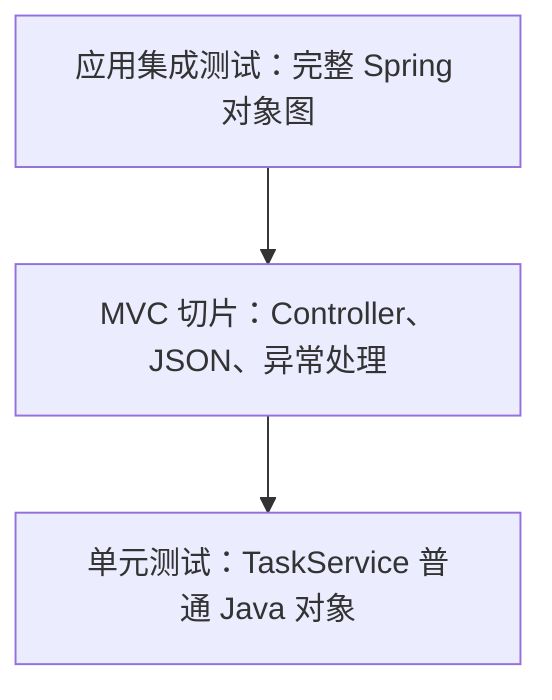

# Spring Boot 测试体系：JUnit、Mockito、切片测试与集成测试

> 版本基线：Spring Boot 4.1.0、Spring Framework 7.0.8、Java 17 编译目标，使用 JDK 25 运行。完整示例不依赖数据库或外部服务。

## 1. 为什么“能启动”不能证明应用正确

应用启动成功，只能说明 Spring 在当前配置下创建了对象。它不能证明：

- 已完成的任务不会被重复保存；
- 找不到任务时会返回 404，而不是 500；
- Java 对象会被序列化成前端约定的 JSON；
- Controller、Service 和 Repository 确实连接在一起；
- 一次重构没有改变原有行为。

人工在浏览器里点几次也不够。人工检查很难稳定覆盖失败路径，结果不能由 Maven 自动判断，也无法在每次提交后快速重复。

自动化测试做的事情可以说得很朴素：

```text
准备一个已知状态
  → 执行一个明确行为
  → 观察结果和副作用
  → 不符合预期就让构建失败
```

难点不在 `assertThat` 的写法，而在于：**这次测试究竟允许多少真实组件参与？**

## 2. 本课只建立三层测试边界

本课按范围从小到大使用三种测试：

| 层级 | 启动 Spring | 主要验证 | 本课工具 |
| --- | --- | --- | --- |
| 单元测试 | 否 | 一个业务对象的分支和协作 | JUnit、AssertJ、Mockito |
| MVC 切片测试 | 只启动 Web 相关 Bean | 路由、JSON、状态码、错误映射 | `@WebMvcTest`、`MockMvc` |
| 应用集成测试 | 启动完整应用上下文 | 真实 Bean 装配和跨层调用 | `@SpringBootTest`、`MockMvc` |

它们不是“低级测试、高级测试”的关系。小测试定位快，大测试覆盖连接处；一个健康测试集通常同时需要它们。



第一次学习请先学会根据风险选择边界，不要先背完整测试注解列表。

## 3. 测试对象：一个学习任务 API

示例只有一条业务主线：

```text
GET /api/tasks/{id}
  → TaskController
  → TaskService
  → TaskRepository
  → 返回任务或抛 TaskNotFoundException
  → ControllerAdvice 转成 JSON 错误
```

完成任务时，Service 还要保证：待完成任务保存新状态，已经完成的任务不重复保存。

完整项目结构：

```text
spring-boot-testing-strategy/
├── pom.xml
└── src/
    ├── main/java/learning/backend/testing/
    │   ├── TestingApplication.java
    │   ├── task/
    │   │   ├── LearningTask.java
    │   │   ├── TaskRepository.java
    │   │   ├── InMemoryTaskRepository.java
    │   │   ├── TaskService.java
    │   │   ├── TaskController.java
    │   │   └── TaskView.java
    │   └── web/ApiExceptionHandler.java
    └── test/java/learning/backend/testing/
        ├── task/TaskServiceTest.java
        ├── task/TaskControllerSliceTest.java
        └── TestingApplicationTest.java
```

## 4. 测试依赖从哪里来

Spring Boot 4 把不同技术的测试支持拆得更聚焦。本例是 Spring MVC 应用，因此使用 `spring-boot-starter-webmvc-test`：

<<< ../../../examples/java/spring-boot-testing-strategy/pom.xml{xml:line-numbers} [pom.xml]

它提供本例需要的 Spring Test、JUnit Jupiter、AssertJ、Mockito 和 MVC 测试支持。测试依赖使用 `test` scope，不会打入生产运行时 classpath。

“测试框架”与“断言库”也不是同一个东西：

- JUnit Jupiter 发现测试、管理生命周期并报告结果；
- AssertJ 提供可读断言；
- Mockito 创建和验证测试替身；
- Spring Test 管理测试 ApplicationContext、依赖注入和 Web 测试设施；
- Spring Boot Test 在此基础上提供自动配置与切片。

## 5. 先让业务对象可以脱离 Spring

`TaskService` 使用构造方法接收 Repository：

<<< ../../../examples/java/spring-boot-testing-strategy/src/main/java/learning/backend/testing/task/TaskService.java{java:line-numbers} [TaskService.java]

虽然生产运行时由 Spring 调用构造方法，但这个类本身没有通过全局容器查找依赖。测试也可以直接执行：

```java
TaskRepository repository = ...;
TaskService service = new TaskService(repository);
```

这就是 IoC 提高可测试性的原因：对象明确声明协作者，测试可以在边界上替换它。

## 6. 测试替身不是只有 mock

常见测试替身可以这样区分：

| 名称 | 作用 | 例子 |
| --- | --- | --- |
| Stub | 为测试提供预设结果 | 查询任务时返回固定对象 |
| Fake | 用简化但可工作的实现替代真实设施 | 内存 Repository 替代数据库 |
| Mock | 预设返回并验证交互 | 验证 `save` 是否被调用 |
| Spy | 包装真实对象并观察或局部替换 | 通常应谨慎使用 |

Mockito 创建的同一个对象可以同时承担 stub 与 mock 的角色。名称不是重点，重点是测试为什么需要它。

不要 mock 值对象、字符串、DTO 或自己正在测试的对象。替身最适合放在昂贵、不稳定或属于边界的协作者上。

## 7. 单元测试：不启动 Spring

完整单元测试：

<<< ../../../examples/java/spring-boot-testing-strategy/src/test/java/learning/backend/testing/task/TaskServiceTest.java{java:line-numbers} [TaskServiceTest.java]

以第一项测试为例，执行过程是：

```text
Mockito 创建 TaskRepository 替身
  → when 规定 findById 返回待完成任务
  → 直接调用 service.complete
  → Service 产生已完成的新对象
  → AssertJ 检查返回状态
  → verify 检查保存副作用
```

这里没有 `ApplicationContext`、端口、HTTP 或 JSON。失败时范围很小：问题基本在 Service 规则或测试准备中。

### 状态断言与交互断言

```java
assertThat(result.completed()).isTrue();
verify(repository).save(result);
```

第一行检查结果状态，第二行检查对协作者的调用。不要对每个内部调用都 `verify`；那会让重构实现细节时大量测试无意义地失败。只验证属于业务合同的副作用。

### 测试名称应描述行为

`doesNotSaveTaskThatWasAlreadyCompleted` 比 `testComplete2` 更有价值。构建失败时，名称应该直接告诉维护者哪条行为被破坏。

## 8. 为什么单元测试仍然不够

单元测试绕过了 Spring MVC，所以它无法发现：

- 路径是不是 `/api/tasks/{taskId}`；
- JSON 字段是否叫 `completed`；
- 找不到任务是否真的映射为 404；
- Advice 是否被 MVC 注册；
- Controller 构造依赖能否满足。

这些风险属于 Web 边界，因此扩大到 MVC 切片。

## 9. `@WebMvcTest` 启动什么

`@WebMvcTest(TaskController.class)` 聚焦 MVC 基础设施与指定 Controller。它会配置 MockMvc、消息转换、ControllerAdvice 等 Web 相关组件，但不会像普通应用一样扫描所有 Service 和 Repository。

这不是“启动一半应用”的模糊说法，而是一种有意收窄的 ApplicationContext。

完整切片测试：

<<< ../../../examples/java/spring-boot-testing-strategy/src/test/java/learning/backend/testing/task/TaskControllerSliceTest.java{java:line-numbers} [TaskControllerSliceTest.java]

### 为什么需要 `@MockitoBean`

Controller 的构造方法需要 `TaskService`，但切片不会扫描普通 Service。`@MockitoBean` 让 Spring Test 在当前测试上下文注册一个 Mockito 替身，并注入 Controller。

它不同于单元测试字段上的 `@Mock`：

- `@Mock`只创建一个 Mockito 对象；
- `@MockitoBean`还把替身放进 Spring ApplicationContext，替换或创建 Bean。

### MockMvc 没有打开真实 TCP 端口

MockMvc 把模拟请求交给 `DispatcherServlet`，因此会经历路由、参数绑定、消息转换和异常处理，但不经过真实网络 socket。

它适合快速验证 MVC 合同；代理、TLS、真实 Server 配置和网络超时需要更外层测试。

## 10. 失败路径应是一等测试对象

切片测试主动让 Service 抛出 `TaskNotFoundException`，再断言：

```text
TaskService 替身抛业务异常
  → Controller 调用中断
  → ApiExceptionHandler 匹配异常类型
  → 返回 HTTP 404
  → ApiError 序列化为稳定 JSON
```

对应生产代码：

<<< ../../../examples/java/spring-boot-testing-strategy/src/main/java/learning/backend/testing/web/ApiExceptionHandler.java{java:line-numbers} [ApiExceptionHandler.java]

只测试 200 会留下最危险的协议空白：真实失败发生时，前端收到的可能是完全不同的状态码和 body。

## 11. `@SpringBootTest` 验证完整对象图

最后一层不替换 Controller、Service 或 Repository：

<<< ../../../examples/java/spring-boot-testing-strategy/src/test/java/learning/backend/testing/TestingApplicationTest.java{java:line-numbers} [TestingApplicationTest.java]

`@SpringBootTest` 从 `@SpringBootApplication` 查找配置，创建完整 ApplicationContext。`@AutoConfigureMockMvc` 让完整上下文仍可通过 MockMvc 发请求，不必打开端口。

这项测试能发现：

- Bean 没有被扫描；
- 构造依赖无法注入；
- 配置互相冲突；
- Controller、Service、Repository 实际没有连通。

它覆盖范围更大，但失败定位也更宽、启动成本更高，因此不应把所有分支都复制成 `@SpringBootTest`。

## 12. 测试范围不是越大越真实

“全部使用完整应用测试”听起来最可靠，实际上会产生：

- 启动大量与当前行为无关的 Bean；
- 一个配置错误让许多测试一起失败；
- 测试执行变慢，开发者更少运行；
- 业务分支难以准备；
- 失败原因难定位。

更实用的选择顺序是：

1. 普通 Java 调用能证明的，就写单元测试。
2. 只关心序列化、路由或 HTTP 错误时，用 MVC 切片。
3. 需要证明 Bean 装配和跨层协作时，用完整上下文。
4. 需要证明真实网络、容器或外部系统时，再扩大边界。

## 13. ApplicationContext 缓存为什么影响速度

Spring Test 会缓存具有相同配置的 ApplicationContext，并在同一测试 JVM 中复用。测试类如果不断改变 profile、property、mock Bean 和配置类，就可能形成不同缓存键，反复启动上下文。

不要为了“清干净”到处使用 `@DirtiesContext`。它会让上下文退出缓存，下一项测试重新构建。更好的方式是让业务 Bean 避免可变全局状态，并在测试边界显式准备和清理数据。

## 14. 测试隔离不是“每项测试单独启动 JVM”

测试必须可以单独运行，也必须可以任意顺序运行。常见污染来源包括：

- 修改 singleton Bean 内部状态但不恢复；
- 使用固定时钟之外的当前时间；
- 共享静态集合；
- 依赖上一项测试创建的数据；
- 使用不受控随机数或真实网络；
- 并行运行时争用同一个文件或端口。

测试应自己准备前置状态，不依赖执行顺序。需要时间时注入 `Clock`，需要随机值时固定 seed，外部资源使用独立命名空间或生命周期管理。

## 15. 关于数据库测试的边界

数据库专题会单独讲真实数据库与 Testcontainers。本课只保留两条原则：

1. 内存 Fake 能测试业务流程，但不能证明 SQL、约束、锁和生产数据库行为。
2. 测试上的 `@Transactional` 默认回滚很方便，但也可能让测试代码始终处在事务中，掩盖生产请求离开事务后才出现的 lazy loading 或提交问题。

Repository 查询与迁移应由真实数据库集成测试覆盖，而不是只依赖 H2 或 Mockito。

## 16. Mock 的常见误用

### 误用一：所有对象都 mock

如果连简单值对象和领域对象都 mock，测试只证明 Mockito 配置与 Mockito 配置相符，没有执行真实规则。

### 误用二：复制实现步骤

测试逐行验证内部调用顺序，会把重构当成失败。优先断言可观察结果和重要副作用。

### 误用三：把 mock 当作外部合同

你可以让 mock 返回任何结构，即使真实 HTTP 服务永远不会这样返回。跨服务边界还需要契约测试或真实适配器测试。

### 误用四：忽略未使用 stub

大量无关 `when` 会掩盖测试究竟依赖什么。每项测试只准备当前行为需要的输入。

## 17. 执行完整示例

确保 Maven 使用课程要求的 JDK：

```bash
java -version
mvn -version
```

然后运行：

```bash
cd examples/java/spring-boot-testing-strategy
mvn clean test
```

预期关键结果：

```text
Tests run: 6, Failures: 0, Errors: 0, Skipped: 0
BUILD SUCCESS
```

本例在 JDK 25.0.3、Maven 3.9.16 上完成验证。

较新 JDK 可能打印 Mockito 动态 agent 提示。这不是业务测试失败，但它提醒团队应依据所用 Mockito 版本的官方说明，在构建中显式配置 agent，而不是永久依赖运行时自附加。不要通过关闭所有 JVM 警告掩盖工具链演进。

## 18. 从前端测试经验迁移

可以做有限类比：

| Vue/JavaScript | Spring Boot |
| --- | --- |
| 测试普通 composable/function | 测试普通 Service 对象 |
| mount 单个组件并 stub 子依赖 | `@WebMvcTest` 加替身 Service |
| 启动应用做页面集成测试 | `@SpringBootTest` 验证对象图 |
| Mock Service Worker 模拟 HTTP | mock HTTP client 或测试替身 Bean |

但 MockMvc 不是浏览器：它不执行 Vue、不进行真实 DNS/TCP/TLS，也不验证反向代理配置。前后端各自的测试边界仍需清楚。

## 19. 测试失败时如何定位

按层级缩小：

1. 编译失败：先看类型、import 与测试 API 版本。
2. 单元测试失败：看输入准备、业务分支和协作者调用。
3. ApplicationContext 启动失败：先找日志中的第一个 `Caused by`，不要只看最后一层包装异常。
4. MockMvc 状态码不符：查看 handler、异常映射和响应内容。
5. 单独通过、整套失败：重点查共享状态、上下文差异、顺序和并行资源。
6. 本机通过、CI 失败：核对 JDK、时区、编码、文件系统、环境变量和外部服务版本。

## 20. 本课完成标志

完成本课后，你应能用自己的话说明：

- 为什么测试范围由参与的真实组件决定，而不是由文件名决定；
- 什么业务适合普通单元测试；
- `@Mock` 与 `@MockitoBean` 的边界；
- `@WebMvcTest` 为什么快、又遗漏什么；
- `@SpringBootTest` 证明了什么、没有证明什么；
- 为什么成功路径、失败路径和副作用都要验证；
- 为什么大量 mock 与大量完整上下文测试都可能让测试失去价值。

## 21. 下一课怎样承接

测试回答“提交前怎样自动证明行为没有被破坏”。下一课进入生产运行：应用怎样打成可执行 JAR、接收外部配置、在容器和代理后启动、暴露健康状态，并在终止信号到达时停止接收请求和完成清理。

## 22. 参考资料

- [Spring Boot 4.1 Testing](https://docs.spring.io/spring-boot/reference/testing/)
- [Spring Boot Testing Spring Boot Applications](https://docs.spring.io/spring-boot/reference/testing/spring-boot-applications.html)
- [Spring Framework Testing](https://docs.spring.io/spring-framework/reference/testing.html)
- [Spring TestContext Context Caching](https://docs.spring.io/spring-framework/reference/testing/testcontext-framework/ctx-management/caching.html)
- [Spring TestContext Transaction Management](https://docs.spring.io/spring-framework/reference/testing/testcontext-framework/tx.html)
- [JUnit 5 User Guide](https://junit.org/junit5/docs/current/user-guide/)
- [Mockito Documentation](https://javadoc.io/doc/org.mockito/mockito-core/latest/org.mockito/org/mockito/Mockito.html)
