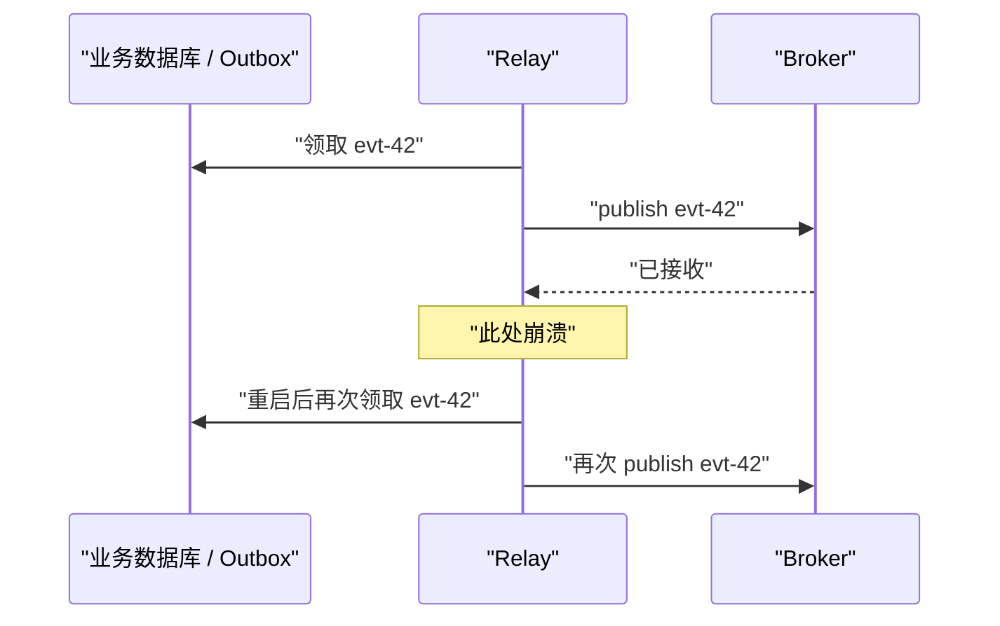

# CDC、Transactional Outbox 与可靠事件传播

一个支付接口需要同时更新订单数据库和通知库存、积分、邮件等下游。最直觉的代码是“先提交数据库，再发送消息”，但进程可能恰好在两步之间崩溃；反过来先发消息，也可能在数据库回滚后留下一个不存在的业务事实。

这不是多写一段重试代码就能消失的偶发 bug，而是两个独立系统之间缺少共同原子提交边界。本课从失败矩阵出发，建立“业务事务 → outbox/binlog/WAL → relay/connector → broker → 幂等消费者 → 对账”的可靠传播链路。

## 先看清双写失败矩阵

假设接口依次执行：

```text
1. COMMIT 订单状态 = PAID
2. publish OrderPaid
```

| 数据库结果 | publish 结果 | 外部观察 | 问题 |
| --- | --- | --- | --- |
| 成功 | 成功 | 订单与事件一致 | 理想路径 |
| 成功 | 失败/未知 | 已支付但下游不知道 | 丢事件或需要补发 |
| 失败 | 成功 | 下游处理了不存在的支付 | 幽灵事件 |
| 超时未知 | 重试成功 | 可能发布多次 | 重复事件 |

网络超时尤其危险：调用方只知道“没收到确认”，不知道服务端是否已经完成操作。把顺序改成“先 publish，再 COMMIT”只是交换哪一类错误发生。

如果数据库和 broker 都支持并正确配置同一种分布式事务协议，可以研究两阶段提交；但它增加协调、阻塞、恢复和产品兼容成本，且许多常见 broker/托管组合并不提供所需的端到端事务。因此不能把它当作默认假设。

## Transactional Outbox：把“要发送的事实”放进同一事务

Outbox 的核心不是一张名为 `outbox` 的表，而是业务变化与待发布事件在**同一个本地数据库事务**中提交：

```sql
BEGIN;

UPDATE orders
SET status = 'PAID', version = version + 1
WHERE id = :order_id
  AND status = 'PAYING'
  AND version = :expected_version;

INSERT INTO outbox_events (
  event_id, aggregate_type, aggregate_id, aggregate_version,
  event_type, schema_version, payload, occurred_at
) VALUES (
  :event_id, 'order', :order_id, :new_version,
  'OrderPaid', 1, :payload, CURRENT_TIMESTAMP
);

COMMIT;
```

事务提交，则订单与 outbox 行都存在；事务回滚，则两者都不存在。relay 稍后读取 outbox 并发布，短暂故障只会造成延迟，不再造成业务变化永久没有发送依据。

数据库约束仍很重要：`event_id` 唯一防止接口重试生成同一事件两次，`(aggregate_id, aggregate_version)` 唯一可阻止同一聚合版本出现两个冲突事实。受影响订单行数必须为 1，才能插入对应事件。

## 一条事件应携带什么

推荐把 envelope 与业务 payload 分开：

```json
{
  "eventId": "evt_01J...",
  "eventType": "OrderPaid",
  "schemaVersion": 2,
  "aggregateType": "order",
  "aggregateId": "ord_123",
  "aggregateVersion": 17,
  "occurredAt": "2026-07-15T08:30:00.123Z",
  "producer": "order-service",
  "tenantId": "tenant_8",
  "traceId": "trace_...",
  "payload": {
    "orderId": "ord_123",
    "paidCents": 12900,
    "currency": "CNY"
  }
}
```

- `eventId` 标识这一个不可变事件，用于幂等与追踪；重发不能生成新 ID。
- `aggregateId` 决定同一业务对象的路由和局部顺序。
- `aggregateVersion` 帮助消费者拒绝旧事件覆盖新状态并发现版本缺口。
- `eventType + schemaVersion` 定义长期契约，不能靠当前代码类名猜测。
- `occurredAt` 是业务发生时间；broker 接收时间和消费者处理时间应另记。
- `traceId` 方便串联请求，但不能替代稳定事件 ID。

payload 应包含消费者完成该事件所需的稳定事实，但避免复制无关 PII、密钥或整个数据库行。只发送主键会迫使消费者同步回调源服务，增加耦合；发送完整可变对象又容易泄露和造成语义不清，需要按领域权衡。

## relay 为什么仍可能重复发布

轮询 relay 常采用：读取未发布行 → publish → 标记已发布。进程若在 publish 成功后、标记前崩溃，重启会再次发布同一事件。



把标记放在 publish 前则会产生相反问题：标记成功但 publish 失败时永久丢失。因此常见可靠设计接受 **at-least-once delivery**，再让消费者按 `eventId` 幂等。

某些 broker 能在自身边界内提供事务或 exactly-once 能力，但它通常不自动覆盖外部数据库、副作用 API 和业务语义。必须明确“恰好一次”覆盖哪个边界、故障和观察者。

## 轮询 Outbox 的领取、租约与并发

多个 relay worker 需要防止同时领取同一行。可在短事务中使用行锁与 `SKIP LOCKED`，或通过条件更新写入 `lease_owner/lease_until`：

```text
短事务领取一小批并提交
→ 事务外 publish，避免持锁等待网络
→ 按 event_id 条件标记成功
→ 失败记录 attempt、next_attempt_at 与最后错误
```

注意：

- 不要在数据库事务中等待 broker，长事务会占锁、连接和旧版本。
- 租约必须可过期，否则 worker 永久宕机会留下孤儿任务。
- 租约过短会在慢 publish 时被第二个 worker 重领；重复仍需幂等兜底。
- 指数退避要有上限和随机抖动，避免 broker 恢复时同时重试。
- poison event 达到阈值后应隔离、告警并保留证据，不能静默标成功。
- `SKIP LOCKED` 适合队列式领取，不适合需要一致结果的普通业务查询。

轮询间隔决定传播延迟与数据库查询频率。为 `(status, next_attempt_at, id)` 或等价领取条件建立合适索引，并限制批次大小。

## 日志型 CDC：直接读取已提交变更流

另一条路径是 CDC connector 读取数据库日志：MySQL binary log 或 PostgreSQL WAL 的逻辑解码输出。日志天然位于数据库提交路径中，connector 用位置/LSN 记录消费进度，不需要应用逐行标记 `published_at`。

日志型 CDC 的优点：

- 对已有表可以低侵入捕获变更。
- 高吞吐下避免频繁轮询和更新 outbox 状态。
- 可保留事务顺序与提交边界，具体能力取决于 connector。

但原始 row change 不天然等于业务事件。`orders.status: PAYING → PAID` 可能表达付款，也可能是修复脚本；表名、内部列和拆表会泄漏给消费者。常见折中是应用仍写语义化 outbox，CDC 只负责可靠读取 outbox 的 INSERT。

## MySQL binlog 的关键边界

MySQL 8.4 默认启用 binary logging，并默认使用 row-based format。实际 CDC 上线前仍需核对：

- `log_bin`、`binlog_format` 与 `binlog_row_image`。
- GTID 或 file/position 的 checkpoint 与恢复方式。
- binlog 保留时间是否覆盖 connector 最长停机、回放和运维窗口。
- CDC 账号的最小权限、TLS、日志加密与敏感字段处理。
- DDL、表重命名和列变更时 connector/schema registry 的行为。
- 大事务、JSON 部分更新和最小 row image 是否提供消费者所需字段。

MySQL 即使设置 `ROW`，DDL 仍以 statement 形式记录；不能把 DML row event 的处理假设直接套到 schema change。binlog 过早清理会让落后的 connector 无法从旧 checkpoint 续读，只能重新做快照或采用已验证的恢复路径。

## PostgreSQL logical decoding 的关键边界

PostgreSQL logical decoding 把 WAL 中的持久表变更解码成 output plugin 可解释的逻辑流。需要核对：

- `wal_level`、publication、output plugin 与被发布表范围。
- replication slot 的 `restart_lsn`、`confirmed_flush_lsn` 和 active 状态。
- 表是否有足够 replica identity 让 UPDATE/DELETE 可定位旧行。
- slot 在 connector 停机期间保留 WAL 所需的磁盘预算与上限。
- failover 后 slot 是否可用，以及 connector 如何识别新 primary。
- DDL、sequence、大对象和分区表在所用方案中的具体支持边界。

replication slot 会为落后消费者保留所需 WAL；这是可靠续读能力，也是磁盘耗尽风险。告警不能只看 connector “running”，还要看 LSN lag、WAL retained bytes、slot inactive 时长和磁盘 runway。

## Outbox 与日志 CDC 如何选择

| 方案 | 优势 | 主要代价 | 适合情况 |
| --- | --- | --- | --- |
| 应用轮询 Outbox | 语义清楚、基础设施简单、易理解 | 轮询/状态更新负载，需租约 | 中等流量、先建立可靠语义 |
| CDC 读取业务表 | 改应用少，可捕获历史表变化 | 表结构耦合，难判断业务意图 | 数据同步、审计、明确 row change 场景 |
| CDC 读取 Outbox | 语义事件 + 日志高效读取 | 多一个 connector/slot 运维面 | 较高吞吐、已有 CDC 平台 |
| 双写数据库与 broker | 代码直观 | 原子性缺口 | 不应作为可靠传播默认方案 |

选型需要测量端到端延迟、峰值事件数、大事务、保留空间、恢复与运维能力，而不是只比较正常路径吞吐。

## 消费者幂等要和业务副作用放在同一事务

消费者不能只在内存 `Set` 中记已处理事件；重启后会丢失。处理数据库副作用时，使用持久 inbox/processed-events 表，并与业务写放入同一事务：

```sql
BEGIN;

INSERT INTO processed_events (consumer_name, event_id, processed_at)
VALUES (:consumer, :event_id, CURRENT_TIMESTAMP)
ON CONFLICT DO NOTHING;

-- 仅当上面确实插入一行时，执行本事件的业务变更。
UPDATE order_read_model
SET status = :status,
    aggregate_version = :version
WHERE order_id = :order_id
  AND aggregate_version < :version;

COMMIT;
```

示例使用 PostgreSQL 的冲突语法；MySQL 可使用唯一键配合相应 upsert/条件逻辑。关键不是语法，而是“去重记录与副作用同事务”：若先记去重再写业务，崩溃会永远跳过；若先写业务再记去重，崩溃后会重复副作用。

调用邮件、支付渠道等外部 API 时，本地事务无法包住外部世界。应传递稳定幂等键、保存调用状态并通过状态机重试；若对方不支持幂等，就必须设计重复影响的检测或人工处置。

## 顺序通常只能在有限范围内保证

全局严格顺序会限制并行度，而且多数业务只需要同一订单/账户内有序。把同一 `aggregateId` 路由到同一 partition，并让该 partition 单线程或按序处理，可获得局部顺序；不同聚合之间不应虚构全局先后关系。

即使 broker 保序，重试队列、消费者并发和跨 partition 仍可能造成业务观察乱序。消费者应使用 `aggregateVersion`：

- 收到版本 16，而本地已有 17：识别为旧事件，幂等忽略。
- 收到版本 18，而本地只有 16：发现缺少 17，暂停该聚合、等待/补取或从事实源重建。
- 收到同版本但 payload 摘要不同：属于冲突，不能随意覆盖。

版本号必须在事实源事务中递增；用机器时间排序会受并发、精度和时钟漂移影响。

## 初始快照与增量流必须无缝衔接

新建搜索索引或读模型时，不能先随意导完全量，再从“当前”开始 CDC：全量期间发生的变化可能遗漏。正确协议需要一个明确水位：

1. 建立或记录能保留增量的位置。
2. 从与该位置一致的 snapshot 读取全量。
3. 将全量写入目标，操作必须可重试。
4. 从记录的位置回放增量并追平。
5. 对账 count、分块摘要和业务不变量。
6. 追平且验证后才切换读取。

不同数据库和 connector 建立一致 snapshot 的方法不同，应遵循所用工具的官方流程；不能自己拼接两个不相关的时间戳。

## Event schema 也是长期数据库契约

事件一旦进入 broker、归档或离线消费者，就可能比生产者代码存活更久：

- 新增可选字段通常比删除、改名或改变含义安全。
- 消费者应忽略未知字段，但不能静默接受缺少必需字段。
- 枚举新增值需要 unknown 分支，不能让旧消费者崩溃。
- 金额单位、时区和 ID 类型不可只靠字段名猜测。
- 破坏性变化使用新 event type/major schema，或提供明确 upcaster。
- producer deploy、DDL 和 consumer deploy 要按兼容顺序编排。

不要把“数据库 schema version”和“事件 schema version”绑定成同一个数字。一次内部拆表不一定改变领域事件；一次业务语义变化也可能无需 DDL。

DELETE 需要明确语义：是业务注销事件、软删除状态、还是 CDC tombstone。消费者必须知道应隐藏、匿名化还是物理删除，并传播数据保护要求。

## 保留、清理与反压

Outbox 不能在 publish 返回成功后立即无条件删除：可能还需要审计、重放或确认所有必需下游水位。也不能无限保留：表和索引增长会降低领取效率并增加备份成本。

清理策略应基于：

- broker 已持久接收的确认边界。
- 最慢必需消费者或重建策略，而非任意一个在线消费者。
- 事件归档是否可验证恢复。
- 合规保留与删除要求。
- 按时间分区后的安全 detach/drop 流程。

下游变慢时，延迟会转化为 outbox 行数、binlog/WAL 保留、broker backlog 和最终磁盘压力。反压策略应包含限流非关键生产者、扩大消费者、隔离毒消息、扩容存储或暂停非关键下游；直接跳过事件只会把容量事故变成数据事故。

## 可观测性必须端到端

至少监控：

- 最老未发布 outbox 年龄，而不只是未发布数量。
- relay claim/publish/ack 速率、重试率和 poison 数。
- binlog/LSN checkpoint、保留量、slot active 与磁盘 runway。
- broker partition lag、最老消息年龄和消费者错误。
- inbox dedup 命中率、版本缺口、旧事件和冲突事件数。
- 从数据库 commit 到关键消费者生效的端到端 p95/p99。
- 业务不变量对账，而不只监控基础设施 lag。

event ID、aggregate ID、数据库事务/LSN 位置、broker partition/offset 和 trace ID 应能关联，但日志中要脱敏。高基数 ID 不宜直接作为无界 metrics label。

## 故障恢复与运维门禁

- connector checkpoint 必须持久化，并定期验证从 checkpoint 重启。
- broker、数据库、slot 和 outbox 的备份/保留窗口要互相覆盖。
- failover 后先确认新 primary、日志连续性和旧 writer fencing。
- 重放前固定范围与水位，使用相同 event ID，不生成伪新事件。
- 大规模重放限速并与实时流隔离，避免饿死新事件。
- 手工跳过、改 offset 或删除 slot 属于高风险操作，需审批和证据。
- 灾难演练要验证读模型重建和业务对账，不止验证 connector 进程启动。

## 与前端接口的关系

如果写接口返回成功后，下游读模型尚未更新，前端可能立即看不到刚才的变化。API 必须给出明确契约：

- 需要读己之写的页面直接读事实源、携带版本水位，或在短窗口内粘到一致路径。
- 异步工作返回 `202 Accepted + operationId`，提供状态查询，而不是伪装已完成。
- UI 可显示“处理中”，但不能把未知状态当失败并无条件重复提交。
- 写请求使用幂等键；状态查询展示业务状态，不暴露 broker offset 等内部细节。

可靠事件传播最终是用户体验的一部分，不只是后端基础设施。

## 示例说明

运行 `node examples/database/29-outbox-delivery-model.mjs`，验证业务写与 outbox 原子提交、publish 后崩溃导致的合法重复、消费者 inbox 幂等和聚合版本门禁。

- `examples/database/29-mysql-cdc-readiness.sql` 只读检查 binary log、row image、GTID、保留和日志状态。
- `examples/database/29-postgresql-cdc-readiness.sql` 只读检查 wal level、logical slot、publication 与已发布表。

示例是语义模型，不包含真实 broker；生产实现还需验证所选 connector、托管服务和故障切换方式。

## 上线检查清单

- 业务事务和 outbox INSERT 在同一数据库事务中。
- event ID、聚合 ID/版本、类型、schema 版本和时间语义明确。
- relay 接受至少一次发布，消费者以持久 inbox 幂等。
- 去重记录和数据库副作用在同一消费者事务中。
- 外部 API 使用稳定幂等键与可恢复状态机。
- 顺序边界限定到必要聚合/partition，并能检测版本缺口。
- snapshot 与增量 CDC 有官方支持的一致水位协议。
- binlog/WAL/outbox/broker 保留覆盖最长恢复与停机窗口。
- DDL 和事件 schema 按兼容顺序发布，DELETE 语义明确。
- backlog、最老事件、WAL 保留、磁盘和端到端延迟均有告警。
- 重放、毒消息、failover、跳过 offset 和 slot 操作有 runbook。
- 关键下游定期做业务不变量对账和全量重建演练。

## 常见误区

### “数据库成功后立即发消息，失败就重试”

进程可能在提交后、记录重试前崩溃；超时也无法判断 publish 是否成功。必须保留与业务提交原子的发送依据。

### “用了 Outbox 就不会重复”

publish 与标记仍跨系统，崩溃窗口会产生合法重复。Outbox 解决不丢依据，消费者幂等解决重复副作用。

### “Broker 宣称 exactly-once，整个业务就恰好一次”

先核对其边界是否包含外部数据库、HTTP API、重放和人工操作。业务不变量仍需幂等与对账。

### “CDC 能读到行变化，所以行变化就是领域事件”

数据库行缺少业务意图，内部 DDL 会泄漏给下游。需要语义化 outbox 或稳定转换层。

### “Connector lag 为零表示数据完全正确”

过滤、转换、权限、历史缺口和消费者 bug 都可能存在。lag 是新鲜度信号，不是端到端正确性证明。

### “全量导入完成后，从最新位置开始增量”

全量期间提交的变化会落在两个水位之间。必须先建立一致 snapshot 与增量起点。

## 本课小结

- 数据库与 broker 直接双写存在无法由普通重试消除的原子性缺口。
- Transactional Outbox 把业务变化与发送依据放入同一本地事务。
- 轮询 relay 或日志 CDC 都可能至少一次交付，消费者必须持久幂等。
- 原始 row change 不等于领域事件；CDC 读取语义化 outbox 是常见组合。
- MySQL binlog 与 PostgreSQL logical slot 都有格式、保留、DDL、权限和 failover 边界。
- event ID 负责去重，aggregate version 负责局部顺序、旧事件和缺口检测。
- snapshot 与增量必须在共同水位无缝衔接，切换前完成业务对账。
- event schema、删除语义和兼容发布顺序是长期数据契约。
- backlog 会转化为日志保留与磁盘压力，必须设计反压、清理和恢复。
- 所谓 exactly-once 必须声明边界；端到端正确性依赖幂等、状态机和对账。

## 官方资料

- [MySQL 8.4：Replication Implementation](https://dev.mysql.com/doc/refman/8.4/en/replication-implementation.html)
- [MySQL 8.4：Binary Logging Options and Variables](https://dev.mysql.com/doc/refman/8.4/en/replication-options-binary-log.html)
- [MySQL 8.4：Setting the Binary Log Format](https://dev.mysql.com/doc/refman/8.4/en/binary-log-setting.html)
- [MySQL 8.4：SHOW BINARY LOG STATUS](https://dev.mysql.com/doc/refman/8.4/en/show-binary-log-status.html)
- [PostgreSQL 18：Logical Decoding Concepts](https://www.postgresql.org/docs/18/logicaldecoding-explanation.html)
- [PostgreSQL 18：Logical Replication](https://www.postgresql.org/docs/18/logical-replication.html)
- [PostgreSQL 18：Replication Slots](https://www.postgresql.org/docs/18/view-pg-replication-slots.html)
- [PostgreSQL 18：Publications](https://www.postgresql.org/docs/18/logical-replication-publication.html)
