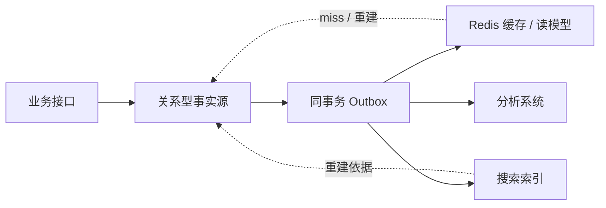
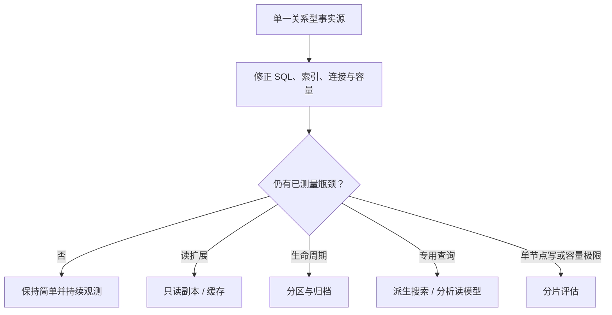

# 数据库技术选型、架构评审与演进决策

数据库选型不是比较产品宣传页，也不是选“功能最多”或“跑分最高”的数据库。真正的问题是：在明确的正确性、延迟、吞吐、恢复、安全和团队约束下，哪种最简单的架构能够持续满足业务，并且失败时可恢复、未来可退出？

前端联调一个列表接口时，你已经接触过选型输入：过滤条件、排序、分页、数据新鲜度和错误处理。本课把这些接口细节扩展成完整工作负载，再用硬门槛、实测证据和架构决策记录（ADR）做出可复审的决定。

## 先选“数据角色”，再选产品

同一份业务数据可能有多个表示，但每个表示的责任不同：

| 角色 | 核心责任 | 失败后的正确处置 |
| --- | --- | --- |
| 事实源 / system of record | 保存权威业务事实与不变量 | 恢复、补偿、对账，不能随意丢弃 |
| 事务写模型 | 原子修改一组相关事实 | 按事务和幂等语义重试 |
| 派生读模型 | 为特定查询形状预计算或建索引 | 从事实源重放或重建 |
| 缓存 | 用可接受的新鲜度换取延迟/负载 | miss 后回源，必要时整体失效 |
| 事件传递 | 把已提交事实传播给下游 | 去重、重试、处理乱序和缺口 |
| 分析副本 | 大范围聚合、历史分析 | 按水位重新同步，不反向改写事实源 |

“用户资料同时在 MySQL、Redis 和搜索索引里”不代表三者都是权威源。若所有系统都能互相覆盖，就没有可判定的冲突解决规则。



图中的实线表示事实传播；虚线表示回源或重建依据，不表示派生系统可反向成为事实源。

## 把需求写成可验证的工作负载

“数据量很大”“高并发”“强一致”都不能直接用于选型。需求表至少要包含以下方面。

### 数据与不变量

- 核心实体、关系、唯一性、外键和跨行不变量是什么？
- 单条记录大小、总量、每日新增、保留期和删除要求是多少？
- 是否需要账本式不可变历史、审计和时间点恢复？
- 一次事务涉及多少行、表、分区或服务？
- 冲突时哪个系统拥有最终解释权？

### 接口查询形状

不要只记录“读多写少”，而要从 API 契约列出：

```text
GET /orders?tenantId=?&status=?&createdBefore=?&cursor=?
排序：(created_at DESC, id DESC)
返回：50 行；要求读己之写；p95 < 120 ms

POST /payments
写入：支付尝试 + 幂等键 + 订单状态 + outbox
要求：不可重复扣款；数据库提交 p99 < 80 ms
```

还要记录参数分布、热点租户、空结果比例、分页深度、连接并发、读写比例和峰值持续时间。平均 QPS 会掩盖突发流量与热点键。

### 可用性、恢复与一致性

- SLO 是多少，计划维护是否计入？
- RPO/RTO 分别是多少，是否经过恢复演练？
- 哪些读取允许旧数据，最多旧多久？
- 是否要求读己之写、单调读或跨实体原子性？
- 网络分区和区域故障时，宁可拒绝写入还是接受冲突？

“强一致”要翻译成可测试行为。例如支付成功响应后，用户立即查询订单必须看到 `PAID`；这比一个没有边界的标签有用得多。

### 安全、合规与地域

- 数据驻留地域、加密、密钥控制和审计保留期。
- 租户隔离强度、行级权限或独立实例需求。
- 删除请求是否需要同步清除备份、缓存和派生副本。
- 托管服务、扩展和跨区复制是否满足组织政策。

### 团队与生命周期

- 谁负责值班、升级、容量、备份和恢复？
- 团队实际掌握哪个版本和部署形态，而不是“听说用过”什么？
- 官方驱动、ORM、迁移工具和监控是否成熟？
- 预计使用多久，退出成本和数据导出速度是多少？

## 第一原则：默认从一个关系型事实源开始

对于用户、订单、支付、库存、权限等有关联与事务不变量的后端系统，一个成熟的 MySQL InnoDB 或 PostgreSQL 通常是稳健起点：它们提供事务、约束、索引、并发控制、备份恢复和复制生态。

这不是说关系型数据库适合所有工作负载，而是它提供了高价值的默认正确性边界。单库并不等于单机：可使用高可用、备份和只读副本；“逻辑上一个事实源”和“物理上只有一个进程”是两回事。

初始架构越简单：

- 跨实体事务越容易保持原子性。
- 查询和数据修复不需要跨系统拼接。
- 本地开发、测试、迁移、备份和审计链更少。
- 故障时需要同时理解的组件和传播延迟更少。

只有证据表明单一关系型架构无法满足某个具体约束时，才增加专用组件。

## MySQL 与 PostgreSQL：比较实际部署，而不是刻板印象

MySQL InnoDB 和 PostgreSQL 都支持可靠事务、MVCC、约束、索引、JSON 能力、复制和分区。不能用“一个适合简单业务、另一个适合复杂业务”代替测量。

选型应比较具体组合：

```text
数据库产品 + 精确版本 + 扩展/插件 + 参数
+ 自建或托管服务及规格 + 存储类型 + HA/复制拓扑
+ 驱动/连接池 + 备份恢复工具 + 监控与升级路径
```

同一产品在不同云服务层级、参数、存储和驱动下，故障切换、扩展支持、连接上限和性能可能完全不同。

### 有效的差异证据

- 目标版本是否原生表达关键约束和查询，而不是能否勉强模拟。
- 用真实数据分布执行 top queries 的计划、p95/p99 和资源消耗。
- 在线 DDL、主版本升级、PITR 与故障切换的实测时间。
- 团队已有自动化、值班经验和历史事故证据。
- 托管服务对扩展、参数、日志、审计和网络的确切限制。
- 许可证、支持周期、商业支持和三年总成本。

“PostgreSQL 有 `jsonb`”或“MySQL 有 JSON 类型”只证明存在能力，不证明把核心模型设计成任意 JSON 是好方案。稳定、需要约束和关联的字段仍应结构化；JSON 适合边界清楚、演进频繁的附属属性，并需验证索引和更新成本。

同理，数据库内全文检索是否足够，要用语言、分词、相关性、更新延迟和查询功能验证；不能因为功能存在就默认替代专用搜索，也不能因为有专用搜索就提前引入双写一致性。

## Redis：按职责引入，不按“快”引入

Redis 提供字符串、hash、set、sorted set、stream 等数据结构以及原子命令，适合低延迟缓存、计数、排行榜、短期状态和某些协调/流处理场景。它的价值来自数据结构与访问模式匹配，而不只是“数据在内存里”。

引入前必须回答：

- 数据丢失或短暂不可用时，能否从事实源恢复？
- 缓存不命中、Redis 超时和全量冷启动时，关系库能否承受回源？
- TTL、淘汰策略、内存上限、大 key 与热点 key 如何治理？
- 使用 RDB、AOF 或无持久化时，实际 RPO 是多少？
- 主从切换期间是否可能丢失已确认写，业务是否允许？
- Redis 事务语义和关系型事务是否满足同一个业务不变量？

Redis 的 `MULTI/EXEC` 能把命令顺序执行为一个隔离操作，但这不等于关系数据库的完整事务模型，也不会自动让“Redis + 关系库”成为一个原子事务。跨系统仍要使用事实源、outbox、幂等和对账。

如果 Redis 仅作缓存，常见原则是：关系库为真、缓存可删、写库成功优先、失效操作可重试、回源受过载保护。

## 硬约束先淘汰，软指标后比较

把选型条件分成两类。

### 硬约束（pass/fail）

- 必须表达的事务、唯一性和租户隔离能力。
- 目标地域、RPO/RTO、加密与审计要求。
- 官方支持的运行环境、驱动和升级路径。
- 数据规模、单行/单键限制或必要扩展是否可用。
- 组织能否在 SLO 内恢复，而不只是服务宣称支持备份。

任一硬约束失败，不能用“性能分高”抵消。

### 软指标（在通过者之间权衡）

- 代表性负载的延迟、吞吐和单位成本。
- 团队熟悉度、工具链成熟度和值班负担。
- schema 演进、调试、可观测性和本地开发体验。
- 供应商锁定、迁移时间和退出难度。

权重必须来自当前业务，且保留原始测量值。一个总分只能辅助沟通，不能隐藏“为什么给 4 分”。

## 基准测试必须回答业务问题

只跑默认参数下的通用 benchmark，通常只能比较那套 benchmark。有效 PoC 应包含：

1. 与生产接近的数据量、行宽、基数、偏斜和热点。
2. 实际 SQL/命令、参数分布、事务组合和连接池行为。
3. 正常峰值、突发、长时间 soak 和容量余量。
4. 缓存冷启动、索引未命中、统计信息变化等不利条件。
5. 副本延迟、节点故障、网络抖动、磁盘接近满等故障注入。
6. p50/p95/p99、错误率、吞吐、CPU、内存、I/O、锁等待和成本。
7. 备份、恢复、扩容、DDL、升级与 failover，不只测 steady state。

客户端必须成为受控变量：相同业务语义、合理连接数、预热规则、超时和重试。若压测机 CPU 已满，测到的不是数据库上限。

正确比较的是“在相同正确性和持久性保证下的结果”。关闭 `fsync` 得到的吞吐不能和满足严格 RPO 的配置直接比较。

## 总拥有成本不只是实例账单

三年 TCO 至少包括：

- primary、replica、跨区流量、存储、备份、日志和测试环境。
- 峰值余量、扩容期间双份资源和灾备环境。
- 托管服务、商业支持、扩展或数据传输费用。
- 值班、升级、容量规划、恢复演练和安全审计的人力。
- 每增加一个系统带来的驱动、监控、权限、备份和事故手册。
- 迁移双写、历史回填、对账和旧系统退役成本。

便宜的单节点价格可能对应昂贵的人工运维；高单价托管服务也可能因出口流量、功能限制或锁定而增加长期成本。必须把假设写进模型。

## 多模存储会引入“分布式系统税”

新增缓存、搜索或文档数据库后，不只是多一个客户端：

- 同一事实有多个副本，需要定义所有权和传播方向。
- 本地事务变成 outbox、消息、幂等、重试和最终一致。
- 需要处理重复、乱序、毒消息、重放和 schema 版本。
- 备份时间点不同，需要跨系统恢复顺序与对账。
- 权限、密钥、审计、升级、容量和 on-call 面扩大。
- 本地测试与事故复现更复杂。

因此“某查询在专用系统中更快”只是收益一侧，还要证明它覆盖了分布式系统税。

## 架构演进应沿证据逐级推进



这不是固定顺序，但每一步都应有进入条件和退出条件：

- **索引/查询优化**：执行计划证明访问路径不合适。
- **只读副本**：只读负载确实占主要资源，并接受复制延迟。
- **缓存**：存在可缓存热点，命中率与失效语义能达到 SLO。
- **分区**：裁剪或生命周期操作匹配稳定分区键。
- **搜索/分析系统**：关系库无法经济地满足明确查询能力。
- **分片**：优化、纵向扩容、归档和读扩展后，单节点写入或容量仍无法满足预测，且有稳定路由键。

“未来可能很大”不是立即分片的充分证据。预测应包含增长曲线、单节点实测上限、安全余量和达到阈值的日期。

## ADR：让决定可复审，而不是永久正确

架构决策记录至少包含：

- **状态与日期**：proposed、accepted、superseded。
- **上下文**：业务工作负载、现状和必须解决的问题。
- **硬约束**：带来源和验收方式。
- **候选方案**：包括“保持现状”这个基线。
- **证据**：版本、配置、数据集、压测结果和恢复演练。
- **决定**：选择什么，以及明确不选择什么。
- **后果**：收益、代价、新故障模式和团队责任。
- **迁移/回退**：水位、双写或 outbox、验证与停止条件。
- **复审触发器**：不是随意日期，而是容量、功能或成本阈值。

ADR 不是为既定偏好补理由。候选、硬约束和测量方法应在 PoC 前约定，避免测试中不断修改规则让喜欢的产品获胜。

## 迁移方案和退出方案属于选型本身

好的候选如果无法安全迁入，也不是当前可行方案。迁移需说明：

- schema 与数据类型如何映射，精度、时区、collation 如何验证。
- 全量快照与增量 CDC 如何在同一水位衔接。
- 是否双写；若双写，部分成功怎样补偿和对账。
- 读流量如何 shadow/canary，写入切换如何 fencing 旧入口。
- 回退资格何时因新格式或新写入而关闭。
- 旧系统何时停止同步、保留多久、如何安全退役。

退出计划要验证可导出格式、导出速率、费用、目标恢复时间和替代驱动，而不是只写“支持导出”。供应商故障、价格变化和功能下线都可能触发退出。

## 一次完整的架构评审怎么开

评审材料应提前提供，会议聚焦尚未解决的风险：

1. 业务 owner 确认不变量、SLO、RPO/RTO 和增长预测。
2. 开发说明查询形状、事务边界、数据所有权与失败语义。
3. DBA/平台团队核对版本、拓扑、容量、备份、升级和观测。
4. 安全团队核对地域、权限、密钥、审计和删除要求。
5. 值班团队演练最可能的故障，确认 runbook 与权限真实可用。
6. 明确未决风险、owner、截止日期和阻断上线的条件。

评审结论可以是“小范围 PoC 后再决定”，但 PoC 必须有通过阈值；“继续观察”不能掩盖无人负责的风险。

## 示例说明

运行 `node examples/database/28-architecture-decision-model.mjs`，观察硬约束淘汰、证据评分、新组件引入门禁和分片门禁。

`examples/database/28-architecture-decision-record.md` 提供一份填写完整的示例 ADR，展示如何记录基线、实测证据、风险、缓存降级和复审触发器。示例数字只属于其假设场景，不能作为真实产品结论。

## 评审检查清单

- 数据角色与权威源唯一，派生副本能从事实源重建。
- 需求已转为查询、事务、分布、SLO、RPO/RTO 和增长数字。
- 候选精确到版本、部署规格、参数、驱动和拓扑。
- 硬约束先判断，没有用加权总分掩盖不合格项。
- PoC 使用真实查询形状、数据偏斜、并发和故障场景。
- 在相同一致性、持久性和安全语义下比较性能与成本。
- Redis、搜索和分析系统的所有权、失效与重建路径明确。
- 新组件的分布式系统税、on-call 和恢复顺序已计入。
- 迁移、对账、切换、回退资格和退出路径经过验证。
- ADR 写明反对意见、未知项、owner 和量化复审触发器。

## 常见误区

### “流量大就应该上分布式数据库”

先给出查询形状、峰值、增长、单节点实测上限和瓶颈证据。很多问题来自 SQL、索引、连接池或无界请求。

### “Redis 比关系库快，所以把订单放 Redis”

延迟只是约束之一。订单还涉及关系、恢复、审计、持久性和跨实体事务；若用 Redis，必须证明完整语义而不是只测 `GET/SET`。

### “用了托管服务，就不需要数据库能力”

托管方负责部分控制面，团队仍需负责 schema、查询、容量、权限、RPO/RTO、故障决策和业务正确性。

### “做个功能矩阵，勾最多的获胜”

不需要的功能没有价值，关键能力的限制也不能由十个无关勾选抵消。先做硬约束，再看工作负载证据。

### “统一技术栈一定比专用系统好”

统一能降低运维面，但若无法满足硬约束就不是方案；反过来，专用系统的局部优势也必须覆盖一致性与运维成本。

### “选型完成后长期不再复审”

业务分布、成本、版本和团队都会变化。应以量化阈值复审，但不能因新产品流行而无证据迁移。

## 本课小结

- 先定义事实源、缓存、派生读模型等数据角色，再选择具体产品。
- 把接口契约展开成数据分布、查询形状、事务、一致性、SLO 和恢复要求。
- 有关系与事务不变量的业务通常从一个成熟关系型事实源开始。
- MySQL 与 PostgreSQL 应比较具体版本、部署和真实负载，避免产品刻板印象。
- Redis 按数据结构与降级语义引入，不能把低延迟等同于完整数据库正确性。
- 硬约束采用 pass/fail，软指标只在合格候选中按证据权衡。
- benchmark 必须覆盖生产分布、尾延迟、持久性和故障，而非只测峰值吞吐。
- 新数据系统会带来一致性、恢复、安全和 on-call 的分布式系统税。
- 架构沿测量证据演进；缓存、分区、搜索和分片都有明确进入门槛。
- ADR 记录上下文、证据、后果、迁移、退出和复审触发器，使决定可以被推翻和改进。

## 官方资料

- [MySQL 8.4：InnoDB 与 ACID Model](https://dev.mysql.com/doc/refman/8.4/en/mysql-acid.html)
- [MySQL 8.4：InnoDB 与 MySQL Replication](https://dev.mysql.com/doc/refman/8.4/en/innodb-and-mysql-replication.html)
- [MySQL 8.4：The JSON Data Type](https://dev.mysql.com/doc/refman/8.4/en/json.html)
- [MySQL 8.4：InnoDB Online DDL Operations](https://dev.mysql.com/doc/refman/8.4/en/innodb-online-ddl-operations.html)
- [PostgreSQL 18：Data Types 与 jsonb Indexing](https://www.postgresql.org/docs/18/datatype.html)
- [PostgreSQL 18：Full Text Search](https://www.postgresql.org/docs/18/textsearch.html)
- [PostgreSQL 18：Table Partitioning](https://www.postgresql.org/docs/18/ddl-partitioning.html)
- [Redis：Data Types](https://redis.io/docs/latest/develop/data-types/)
- [Redis：Transactions](https://redis.io/docs/latest/develop/using-commands/transactions/)
- [Redis：Persistence](https://redis.io/docs/latest/operate/oss_and_stack/management/persistence/)
