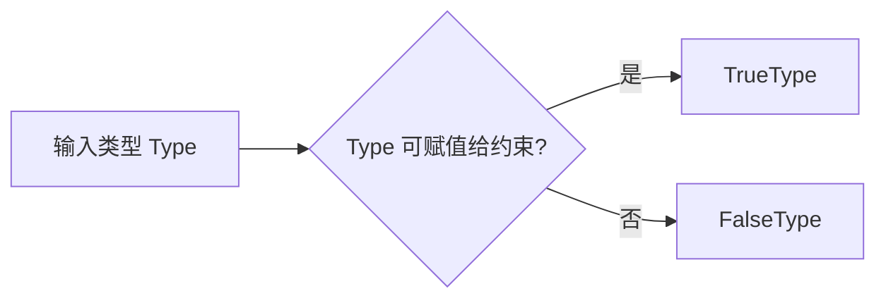

# TypeScript 条件类型与 `infer`

> 适用环境：TypeScript 7.x、Node.js 22+、`strict` 模式。条件类型属于类型级编程能力，本节以可维护的业务场景为主，不追求复杂类型体操。

## 1. 学习目标

完成本节后，你应该能够：

- 理解条件类型（Conditional Type）的语法和可赋值性判断规则。
- 区分运行时条件表达式与编译期条件类型。
- 使用泛型条件类型表达输入类型与输出类型的分支关系。
- 理解条件类型真分支中的约束收窄。
- 使用 `infer` 从数组、元组、函数、构造函数和 Promise 中提取内部类型。
- 理解从重载函数推断时为什么使用最后一个签名。
- 理解分布式条件类型（Distributive Conditional Type）如何逐个处理联合成员。
- 使用方括号元组包装关闭分发行为。
- 理解 `never` 在联合过滤中的作用。
- 掌握 `Exclude`、`Extract`、`NonNullable`、`ReturnType`、`Parameters` 和 `Awaited` 的核心原理。
- 识别条件类型遇到 `any`、`unknown`、`never` 和递归时的常见陷阱。
- 判断何时应该直接使用内置工具类型，而不是重新发明复杂类型。

## 2. 前置知识

建议先掌握：

- 泛型与 `extends` 约束。
- 联合类型、交叉类型、`never` 和 `unknown`。
- `keyof`、类型位置 `typeof` 与索引访问类型。
- 函数类型、元组、可辨识联合和 Promise。

上一节：[TypeScript `keyof`、`typeof` 与索引访问类型](/frontend/typescript/keyof-typeof-and-indexed-access)

## 3. 为什么需要条件类型

普通泛型能保存类型关系，但有些关系还包含分支：

- 如果输入是数组，输出元素类型；否则保留原类型。
- 如果结果是成功分支，提取 `data`；否则得到 `never`。
- 如果类型是 Promise，取得最终异步值。
- 从事件联合中只保留某一种事件。
- 从联合类型中排除 `null` 和 `undefined`。

只用重载表达这些关系可能快速膨胀：

```ts
function createLabel(value: string): { name: string }
function createLabel(value: number): { id: number }
function createLabel(
  value: string | number
): { name: string } | { id: number }
```

可以把输入与输出关系写成类型级分支：

```ts
type LabelFor<Value extends string | number> =
  Value extends number
    ? { id: number }
    : { name: string }
```

```ts
type StringLabel = LabelFor<string>
// { name: string }

type NumberLabel = LabelFor<number>
// { id: number }
```

条件类型让一个通用类型根据输入类型选择结果，但它不会自动实现运行时分支。真实函数仍需编写真正的 JavaScript 判断。

## 4. 条件类型基本语法

条件类型的形式与 JavaScript 三元表达式相似：

```ts
type Result = CheckedType extends Constraint
  ? TrueType
  : FalseType
```

含义是：

> 如果 `CheckedType` 可以赋值给 `Constraint`，结果使用 `TrueType`；否则使用 `FalseType`。

```ts
type IsString<Type> = Type extends string ? true : false

type A = IsString<'TypeScript'> // true
type B = IsString<number>       // false
```

这里检查的不是运行时 `typeof`，也不是面向对象意义上的“是否显式继承”。TypeScript 使用结构化类型系统，核心问题是可赋值性。

```ts
interface HasId {
  id: string
}

type HasStringId<Type> = Type extends HasId ? true : false

type LessonCheck = HasStringId<{
  id: string
  title: string
}>
// true
```

对象不需要写 `implements HasId`，只要结构兼容即可进入真分支。

## 5. 条件类型只在编译阶段工作

下面的类型不会生成 JavaScript：

```ts
type IsArray<Type> = Type extends readonly unknown[]
  ? true
  : false
```

它不能替代运行时判断：

```ts
function process(value: unknown): void {
  if (Array.isArray(value)) {
    console.log(value.length)
  }
}
```

两者职责不同：

| 能力 | 条件类型 | 运行时条件 |
| --- | --- | --- |
| 选择静态类型结果 | 能 | 不能直接产生类型 |
| 检查真实输入数据 | 不能 | 能 |
| 生成 JavaScript 分支 | 不能 | 能 |
| 帮助编辑器提示 | 能 | 通过控制流间接帮助 |

如果函数签名使用条件类型，函数体仍必须保证实际返回值与类型承诺一致。

## 6. 泛型让条件类型真正有价值

对两个已知具体类型做条件判断通常意义有限：

```ts
type Known = string extends string ? 1 : 0
// 1
```

与泛型结合后，同一个规则可以处理不同输入：

```ts
type ApiField<Type> = Type extends Date
  ? string
  : Type

type DateField = ApiField<Date>   // string
type TitleField = ApiField<string> // string
type CountField = ApiField<number> // number
```

条件类型表达的是一种类型函数：传入类型，经过判断后返回另一个类型。



## 7. 条件类型中的约束位置

假设要取得 `message` 属性类型：

```ts
type MessageOf<Type> = Type['message']
//                            ~~~~~~~~~ Type 未必有 message
```

一种设计是在类型参数上直接约束：

```ts
type MessageOfStrict<Type extends { message: unknown }> =
  Type['message']
```

它会拒绝没有 `message` 的类型：

```ts
type EmailMessage = MessageOfStrict<{ message: string }>
// string

type DogMessage = MessageOfStrict<{ bark(): void }>
// 错误：不满足约束
```

另一种设计是把约束移进条件类型，并定义失败结果：

```ts
type MessageOf<Type> =
  Type extends { message: unknown }
    ? Type['message']
    : never
```

```ts
type EmailMessage = MessageOf<{ message: string }>
// string

type DogMessage = MessageOf<{ bark(): void }>
// never
```

选择取决于 API 语义：

- 不符合条件应被视为错误：使用泛型约束。
- 希望在类型变换中跳过不符合成员：使用条件类型和 `never`。

## 8. 真分支中的类型收窄

在条件类型的真分支中，TypeScript 已经知道泛型满足右侧结构：

```ts
type MessageOf<Type> =
  Type extends { message: unknown }
    ? Type['message']
    : never
```

进入真分支后，`Type` 被进一步约束为拥有 `message`，所以 `Type['message']` 合法。

这与运行时控制流收窄在思想上相似：

```ts
function readMessage(value: unknown): unknown {
  if (
    typeof value === 'object' &&
    value !== null &&
    'message' in value
  ) {
    return value.message
  }

  return undefined
}
```

区别是：条件类型处理静态类型，运行时守卫检查真实值。

## 9. 使用索引访问展开数组

可以用上一节的 `[number]` 取得数组元素：

```ts
type Flatten<Type> =
  Type extends readonly unknown[]
    ? Type[number]
    : Type
```

```ts
type Text = Flatten<readonly string[]>
// string

type Count = Flatten<number>
// number
```

这里使用 `readonly unknown[]`，因此同时接受普通数组和只读数组。若写成 `any[]`，会引入不必要的 `any`；若只写可变数组，`readonly` 元组可能无法匹配。

## 10. `infer`：给匹配到的内部类型命名

`infer` 只能出现在条件类型 `extends` 右侧的匹配结构中，用来声明一个待推断的类型变量：

```ts
type Flatten<Type> =
  Type extends ReadonlyArray<infer Item>
    ? Item
    : Type
```

可以把它读作：

> 如果 `Type` 可以看作某种只读数组，那么把元素类型命名为 `Item`，真分支返回 `Item`；否则返回 `Type`。

```ts
type LessonItem = Flatten<readonly {
  id: string
  title: string
}[]>
// { id: string; title: string }
```

`infer Item` 不是运行时变量，也不能离开条件类型作用域使用。

## 11. 从元组中提取首项和剩余项

条件类型可以像模式匹配一样拆解元组：

```ts
type Head<Tuple extends readonly unknown[]> =
  Tuple extends readonly [infer First, ...unknown[]]
    ? First
    : never
```

```ts
type First = Head<readonly ['id', number, boolean]>
// "id"

type EmptyFirst = Head<readonly []>
// never
```

提取剩余项：

```ts
type Tail<Tuple extends readonly unknown[]> =
  Tuple extends readonly [unknown, ...infer Rest]
    ? Rest
    : readonly []
```

```ts
type Remaining = Tail<readonly ['id', number, boolean]>
// [number, boolean]
```

注意，推断得到的 `Rest` 是否保留 `readonly` 取决于匹配形式和 TypeScript 推断规则。如果公共 API 对可变性有明确要求，应在输出中显式表达，而不是只依赖隐式推断细节。

## 12. 约束 `infer` 的结果

如果只希望首项为字符串时才返回，可以嵌套判断：

```ts
type FirstString<Tuple extends readonly unknown[]> =
  Tuple extends readonly [infer First, ...unknown[]]
    ? First extends string
      ? First
      : never
    : never
```

也可以直接给推断变量添加约束：

```ts
type FirstString<Tuple extends readonly unknown[]> =
  Tuple extends readonly [
    infer First extends string,
    ...unknown[]
  ]
    ? First
    : never
```

```ts
type A = FirstString<readonly ['title', number]>
// "title"

type B = FirstString<readonly [42, string]>
// never
```

受约束的 `infer` 能减少嵌套，但不要为了缩短代码而牺牲可读性。

## 13. 从函数类型中提取返回值

```ts
type FunctionReturn<Type> =
  Type extends (...args: never[]) => infer Return
    ? Return
    : never
```

```ts
type NumberResult = FunctionReturn<() => number>
// number

type LessonResult = FunctionReturn<
  (id: string) => { id: string; title: string }
>
// { id: string; title: string }
```

使用 `never[]` 描述“我们不准备调用这个函数，只关心其返回类型”的匹配位置。生产代码通常直接使用内置 `ReturnType<Type>`，它处理了标准库约束和边界行为。

## 14. 从函数类型中提取参数

```ts
type FunctionParameters<Type> =
  Type extends (...args: infer Parameters) => unknown
    ? Parameters
    : never
```

```ts
type SaveParameters = FunctionParameters<
  (id: string, published: boolean) => void
>
// [id: string, published: boolean]
```

`Parameters` 是元组，因此可以继续查询：

```ts
type IdParameter = SaveParameters[0]
// string

type AnyParameter = SaveParameters[number]
// string | boolean
```

标准库已经提供 `Parameters<Type>`，不需要在项目中重复定义同名工具。

## 15. 从构造函数中提取实例和参数

构造签名使用 `new`：

```ts
type ConstructedInstance<Type> =
  Type extends abstract new (...args: never[]) => infer Instance
    ? Instance
    : never
```

```ts
class LessonModel {
  constructor(
    readonly id: string,
    readonly title: string
  ) {}
}

type LessonInstance = ConstructedInstance<typeof LessonModel>
// LessonModel

type LessonConstructorParameters =
  ConstructorParameters<typeof LessonModel>
// [id: string, title: string]
```

标准库中的对应工具是 `InstanceType<Type>` 和 `ConstructorParameters<Type>`。

## 16. 从 Promise 中提取异步结果

最小版本可以写成：

```ts
type PromiseValue<Type> =
  Type extends Promise<infer Value>
    ? Value
    : Type
```

```ts
type User = PromiseValue<Promise<{ id: string }>>
// { id: string }
```

但真实 `await` 会递归展开嵌套 Promise/thenable，并对联合类型执行相应处理。标准库提供 `Awaited<Type>` 模拟该行为：

```ts
type A = Awaited<Promise<string>>
// string

type B = Awaited<Promise<Promise<number>>>
// number

type C = Awaited<boolean | Promise<number>>
// boolean | number
```

不要用简单的单层 `PromiseValue` 冒充完整 `Awaited`。业务代码优先使用标准工具类型。

## 17. 自定义递归展开类型

为了理解递归，可以写一个教学版本：

```ts
type DeepPromiseValue<Type> =
  Type extends PromiseLike<infer Value>
    ? DeepPromiseValue<Value>
    : Type
```

```ts
type FinalValue = DeepPromiseValue<
  Promise<Promise<{ id: string }>>
>
// { id: string }
```

递归条件类型适合处理递归容器，但存在风险：

- 输入结构过深可能达到编译器实例化深度限制。
- 错误信息变长。
- 类型检查性能下降。
- 自定义 thenable 边界可能与 JavaScript `await` 语义不完全一致。

因此理解原理后，Promise 场景仍优先使用内置 `Awaited`。

## 18. 重载函数的推断限制

从具有多个调用签名的函数进行推断时，TypeScript 使用最后一个签名，通常也是最宽泛的实现兼容签名：

```ts
declare function parseValue(value: string): number
declare function parseValue(value: number): string
declare function parseValue(
  value: string | number
): string | number

type Parsed = ReturnType<typeof parseValue>
// string | number
```

`ReturnType` 不会根据某个指定参数替你执行重载解析，也不会得到“字符串输入对应数字”的单独分支。

如果类型级 API 需要保留每个输入输出关系，可以考虑：

- 显式可辨识对象联合。
- 泛型映射关系。
- 分别命名调用签名。
- 避免依赖从重载整体反向提取精确信息。

## 19. 分布式条件类型

当条件类型检查的是**裸类型参数**时，传入联合类型会逐成员分发：

```ts
type ToArray<Type> = Type extends unknown
  ? Type[]
  : never
```

```ts
type Result = ToArray<string | number>
// string[] | number[]
```

可以把计算过程展开为：

```text
ToArray<string | number>
→ ToArray<string> | ToArray<number>
→ string[] | number[]
```

这里结果不是 `(string | number)[]`。前者表示“纯字符串数组或纯数字数组”，后者允许一个数组同时混合字符串和数字。

所谓“裸类型参数”是指被检查位置直接是 `Type`：

```ts
Type extends Constraint ? A : B
```

如果它被元组、对象或其他结构包裹，就不会按同样方式分发。

## 20. 使用分发过滤联合成员

`never` 在联合中会被消去：

```ts
type Example = string | never
// string
```

结合分发行为，可以实现联合过滤：

```ts
type KeepStrings<Type> =
  Type extends string ? Type : never

type Strings = KeepStrings<
  string | number | boolean | 'draft'
>
// string
```

注意 `'draft'` 已经是 `string` 的子类型，联合化简后合并进 `string`。

保留字面量示例：

```ts
type Values = 'draft' | 1 | 'published' | false
type StringValues = KeepStrings<Values>
// "draft" | "published"
```

## 21. `Exclude` 与 `Extract` 的原理

标准工具类型可以近似理解为：

```ts
type MyExclude<Union, Excluded> =
  Union extends Excluded ? never : Union

type MyExtract<Union, Candidates> =
  Union extends Candidates ? Union : never
```

`Exclude` 丢弃可赋值给排除目标的成员：

```ts
type EditableStatus = Exclude<
  'draft' | 'published' | 'archived',
  'archived'
>
// "draft" | "published"
```

`Extract` 只保留可赋值给候选目标的成员：

```ts
type Primitive = string | number | boolean | (() => void)
type Callable = Extract<Primitive, Function>
// () => void
```

它们处理的是联合成员可赋值性，不是字符串集合的简单文本减法。

## 22. 用 `Extract` 查询可辨识联合

```ts
type LearningEvent =
  | {
      type: 'lesson.started'
      payload: { lessonId: string }
    }
  | {
      type: 'lesson.completed'
      payload: { lessonId: string; score: number }
    }
  | {
      type: 'lesson.failed'
      payload: { lessonId: string; reason: string }
    }
```

提取完成事件：

```ts
type CompletedEvent = Extract<
  LearningEvent,
  { type: 'lesson.completed' }
>
```

结果保留整个匹配成员，而不仅是 `type`：

```ts
// {
//   type: "lesson.completed"
//   payload: { lessonId: string; score: number }
// }
```

进一步提取负载：

```ts
type CompletedPayload = CompletedEvent['payload']
// { lessonId: string; score: number }
```

也可以定义通用查询：

```ts
type EventOfType<
  Event extends { type: PropertyKey },
  Type extends Event['type']
> = Extract<Event, { type: Type }>
```

## 23. `NonNullable` 的原理

`NonNullable<Type>` 排除 `null` 和 `undefined`：

```ts
type MaybeTitle = string | null | undefined
type Title = NonNullable<MaybeTitle>
// string
```

可以近似理解为：

```ts
type MyNonNullable<Type> =
  Type extends null | undefined
    ? never
    : Type
```

这只是静态类型变换，不会检查或替换运行时值：

```ts
function requireValue<Type>(
  value: Type
): NonNullable<Type> {
  if (value === null || value === undefined) {
    throw new TypeError('值不能为空')
  }

  return value
}
```

函数必须真正执行运行时判断，才能诚实地返回非空类型。

## 24. 如何关闭条件类型分发

如果希望把联合整体作为一个类型检查，而不是逐成员处理，可以用单元素元组包住 `extends` 两侧：

```ts
type ToArrayNonDistributive<Type> =
  [Type] extends [unknown]
    ? Type[]
    : never
```

```ts
type Result = ToArrayNonDistributive<string | number>
// (string | number)[]
```

对比：

```ts
type Distributed = ToArray<string | number>
// string[] | number[]

type NotDistributed = ToArrayNonDistributive<string | number>
// (string | number)[]
```

元组包装不是运行时数组，也不是把值装入数组；它只是让被检查位置不再是裸类型参数，从而阻止分发。

## 25. `never` 在分布式条件类型中的特殊表现

因为 `never` 可以理解为空联合，没有任何成员可供分发：

```ts
type IsNeverWrong<Type> =
  Type extends never ? true : false

type Result = IsNeverWrong<never>
// never，而不是 true
```

若要检测整个类型是否为 `never`，需要关闭分发：

```ts
type IsNever<Type> =
  [Type] extends [never] ? true : false

type A = IsNever<never>  // true
type B = IsNever<string> // false
```

这是方括号包装最常见的实际用途之一。

## 26. 条件类型遇到 `any` 和 `unknown`

`any` 会传播不确定性，并可能让条件类型同时保留两个分支：

```ts
type IsString<Type> = Type extends string ? true : false

type FromAny = IsString<any>
// 通常得到 true | false
```

不要依赖 `any` 在复杂条件中的细节结果；它会削弱类型系统保证。

`unknown` 是安全顶层类型：

```ts
type FromUnknown = IsString<unknown>
// false
```

因为不能保证任意未知值可赋值给 `string`。

另一方面，通常任何具体类型都可赋值给 `unknown`：

```ts
type IsKnownType<Type> =
  Type extends unknown ? true : false
```

对于普通类型结果为 `true`；当传入联合时仍可能发生分发，传入 `never` 时仍得到 `never`。

## 27. 内置工具类型速查

这些工具都在全局可用，不需要导入：

| 工具类型 | 作用 | 典型结果 |
| --- | --- | --- |
| `Exclude<U, E>` | 从联合 `U` 排除可赋值给 `E` 的成员 | 状态删减 |
| `Extract<U, C>` | 从联合 `U` 保留可赋值给 `C` 的成员 | 事件查询 |
| `NonNullable<T>` | 排除 `null` 和 `undefined` | 非空模型 |
| `ReturnType<F>` | 提取函数返回类型 | 服务结果 |
| `Parameters<F>` | 提取函数参数元组 | 包装函数 |
| `ConstructorParameters<C>` | 提取构造参数元组 | 工厂 |
| `InstanceType<C>` | 提取构造函数实例类型 | 类实例 |
| `Awaited<T>` | 递归模拟 `await` 展开 | 异步结果 |

`Partial`、`Required`、`Readonly`、`Pick`、`Omit` 和 `Record` 主要依赖映射类型，下一节会系统讲解。

## 28. 类型断言不能修复条件类型实现

下面的函数签名看起来精确：

```ts
type LabelFor<Value extends string | number> =
  Value extends number
    ? { id: number }
    : { name: string }
```

但实现条件泛型返回值时，编译器常难以在函数体内把运行时分支与未决泛型条件完全对应：

```ts
function createLabel<Value extends string | number>(
  value: Value
): LabelFor<Value> {
  // 实现通常需要重载、辅助签名或受控断言
}
```

不要因此随意写双重断言。更可靠的选择包括：

- 对外暴露重载，对内使用明确联合实现。
- 返回可辨识联合，由调用方收窄。
- 把类型级映射和运行时映射集中在一个小型、经过测试的边界。
- 如果条件类型没有显著改善调用体验，改用普通联合返回值。

类型签名必须与真实运行时逻辑保持一致，复杂不是正确性的证明。

## 29. 完整项目示例：学习事件与 API 结果

本站提供可运行源码：

```text
examples/typescript/conditional-types-and-infer.ts
```

<<< ../../../examples/typescript/conditional-types-and-infer.ts

示例包含：

1. `ApiResult<Data, ErrorData>`：成功与失败联合。
2. `SuccessData<Result>`：用条件类型和 `infer` 提取成功数据。
3. `FailureData<Result>`：提取失败错误结构。
4. `EventOfType<Event, Type>`：使用 `Extract` 查询事件联合。
5. `EventPayload<Event>`：分布式提取每个事件负载。
6. `Awaited<ReturnType<...>>`：取得异步服务最终结果。
7. `requireValue`：把 `NonNullable` 与真实运行时校验对应起来。


示例重点不是堆叠工具，而是让每一步都有清晰职责和可命名的中间类型。

## 30. 常见错误

### 把条件类型当成运行时 `if`

条件类型不会读取真实值、验证 JSON 或生成分支代码。

### 不理解判断基于可赋值性

`Type extends Constraint` 不是检查显式继承关系。结构兼容、联合成员和特殊类型都会影响结果。

### 意外触发分发

裸类型参数接收联合时会逐成员处理。先明确目标是“每个成员分别转换”还是“整个联合统一判断”。

### 误以为 `never extends ...` 一定得到布尔值

分布式条件中的 `never` 没有成员可分发，整体结果通常仍是 `never`。检测 `never` 需使用元组包装。

### 用 `any` 让条件结果失真

`any` 可能传播为两个分支的联合或污染后续类型。优先使用 `unknown` 和明确约束。

### 重新实现标准工具类型

教学时可以实现简化版本理解原理，业务代码优先使用标准库的 `Awaited`、`ReturnType` 等。

### 对重载函数期待逐签名推断

标准提取通常查看最后一个签名，不能通过 `ReturnType` 对每个重载执行参数相关解析。

### 递归类型没有终止条件

递归条件类型必须让每一步更接近基础分支，否则可能出现过深实例化或无限递归错误。

## 31. 工程最佳实践

- 先用普通联合、泛型约束和索引访问解决问题，确实存在类型分支时再使用条件类型。
- 条件类型使用有业务含义的名称，不把长表达式散落在函数签名中。
- 明确记录条件类型是分布式还是整体判断。
- 使用 `unknown` 描述未知结构，避免以 `any` 简化匹配。
- 提取数组时兼容 `readonly`，除非实现确实要求可变数组。
- 过滤联合时使用内置 `Exclude` 和 `Extract`。
- 异步结果使用 `Awaited<ReturnType<typeof fn>>`，避免重复手写返回模型。
- 公共 API 中谨慎使用递归和深层嵌套条件，优先可读的中间类型。
- 重载函数的提取结果按最后签名理解，不依赖不存在的类型级重载解析。
- 条件类型只描述静态关系；运行时实现、校验和错误处理必须独立正确。
- 类型变换开始影响编辑器响应或错误信息时，降低复杂度比继续抽象更重要。

## 32. 与 Vue、Java 和后端开发的联系

### Vue 组件事件

可辨识事件联合配合 `Extract`，可以取得某个事件的完整负载：

```ts
type ComponentEvent =
  | { type: 'save'; payload: { id: string } }
  | { type: 'cancel'; payload: undefined }

type SaveEvent = Extract<
  ComponentEvent,
  { type: 'save' }
>
```

在设计组合式函数或事件总线时，这能让事件名与负载保持同步。但运行时字符串仍需校验，不能只依靠类型。

### Vue 异步状态

服务函数返回 `Promise<ApiResult<Page<Lesson>, ApiError>>` 时，可以用：

```ts
type ServiceResult = Awaited<ReturnType<typeof loadLessons>>
type SuccessResult = Extract<ServiceResult, { ok: true }>
type LessonPage = SuccessResult['data']
```

这样服务签名变化时，消费类型能同步更新。

### Java 对比

Java 泛型主要通过类型参数边界、重载和类层次表达关系；TypeScript 条件类型可以直接在编译期根据结构可赋值性选择类型结果，并对联合类型分发。

Java 的条件逻辑仍主要发生在运行时，TypeScript 条件类型则通常被完全擦除。它更接近类型级函数，而不是 Java 的普通三元表达式。

### 后端响应与领域事件

`Extract` 很适合从大型领域事件联合中查询某一种事件，`Awaited` 与 `ReturnType` 适合从异步服务派生结果。

但如果前后端协议由 OpenAPI 或 Schema 定义，应优先从协议生成类型并进行运行时验证，不要让复杂条件类型成为唯一契约来源。

## 33. 概念辨析与因果回顾

### 条件类型的判断依据是什么？

`T extends U ? X : Y` 判断 `T` 是否可赋值给 `U`。满足时得到 `X`，否则得到 `Y`。它通常与泛型结合表达类型之间的分支关系。

### `infer` 的作用是什么？

`infer` 在条件类型的匹配结构中声明待推断类型变量，用于提取数组元素、元组部分、函数参数、返回值、构造实例或 Promise 内部值。

### 什么是分布式条件类型？

当被检查位置是裸类型参数时，传入联合类型会对每个联合成员分别应用条件类型，再把结果联合起来。

### 如何关闭条件类型分发？

把 `extends` 两侧用单元素元组包裹，例如 `[T] extends [U] ? X : Y`，使检查位置不再是裸类型参数。

### `never` 为什么能过滤联合成员？

分布式条件类型逐成员处理，不符合条件的成员返回 `never`；`never` 与其他类型组成联合时会被消去，因此只留下匹配成员。

### `ReturnType` 如何处理重载函数？

它从最后一个调用签名推断返回类型，通常是最宽泛的签名，不会根据某组参数执行类型级重载解析。

### `Awaited<T>` 与简单的 `T extends Promise<infer U>` 有何区别？

`Awaited` 用于模拟真实 `await` 行为，会递归展开 Promise/thenable，并正确处理联合等边界；简单版本通常只展开一层且覆盖范围较窄。

## 34. 本节总结

- 条件类型使用 `T extends U ? X : Y` 表达类型级分支。
- 判断依据是可赋值性，不是运行时检查或显式继承声明。
- 条件类型与泛型结合后可以表达输入类型到输出类型的分支关系。
- 真分支中泛型已满足被检查约束，可以安全访问相应结构。
- `infer` 在匹配结构中为内部类型命名。
- 数组、元组、函数、构造函数和 Promise 都可以通过结构匹配提取类型。
- 重载函数的推断使用最后一个签名，不执行逐重载解析。
- 裸类型参数上的条件类型会对联合成员自动分发。
- 使用 `[T] extends [U]` 可以把联合整体判断并关闭分发。
- `never` 在联合中被消去，是 `Exclude`、`Extract` 等过滤工具的基础。
- 分布式条件直接接收 `never` 时通常得到 `never`，检测 `never` 需关闭分发。
- `any` 会污染条件结果，`unknown` 通常是更安全的未知类型。
- `Awaited`、`ReturnType`、`Parameters` 等标准工具优先于自定义简化版本。
- 条件类型只提供静态关系，不能替代运行时实现和数据校验。
- 类型级抽象应服务于可维护性，而不是追求复杂度。

## 35. 下一步学习

下一节建议学习：**TypeScript 映射类型与常用工具类型**。

届时将继续讲解：

- `[Key in keyof Type]` 如何遍历对象键。
- `readonly` 和 `?` 映射修饰符如何添加或移除。
- `Partial`、`Required`、`Readonly`、`Pick`、`Omit`、`Record` 的实现思路。
- 键重映射 `as` 与模板字面量类型的基础组合。
- 如何为表单、更新 DTO 和只读视图设计可维护的类型变换。

## 36. 参考资料

- [TypeScript Handbook：Conditional Types](https://www.typescriptlang.org/docs/handbook/2/conditional-types.html)
- [TypeScript Handbook：Utility Types](https://www.typescriptlang.org/docs/handbook/utility-types.html)
- [TypeScript Handbook：Indexed Access Types](https://www.typescriptlang.org/docs/handbook/2/indexed-access-types.html)
- [TypeScript 2.8 Release Notes：Conditional Types](https://www.typescriptlang.org/docs/handbook/release-notes/typescript-2-8.html)
- [TypeScript 4.1 Release Notes：Recursive Conditional Types](https://www.typescriptlang.org/docs/handbook/release-notes/typescript-4-1.html#recursive-conditional-types)
- [TypeScript 4.7 Release Notes：extends Constraints on infer](https://www.typescriptlang.org/docs/handbook/release-notes/typescript-4-7.html#extends-constraints-on-infer-type-variables)
- [TypeScript 4.8 Release Notes：Improved Inference for infer Types](https://www.typescriptlang.org/docs/handbook/release-notes/typescript-4-8.html#improved-inference-for-infer-types-in-template-string-types)
