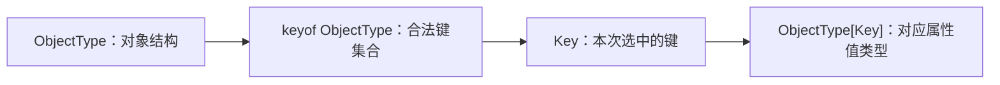
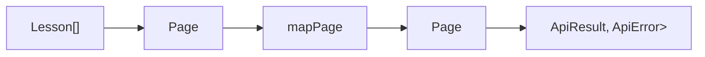

# TypeScript 泛型基础与约束

> 适用环境：TypeScript 7.x、Node.js 22+、`strict` 模式。本文以函数泛型、对象泛型、约束和 `keyof` 为重点，不提前展开条件类型与映射类型。

## 1. 学习目标

完成本节后，你应该能够：

- 理解泛型（Generics）解决的是“类型之间的关系”，而不只是代码复用。
- 区分泛型、联合类型、函数重载、`any` 和 `unknown` 的适用场景。
- 编写泛型函数、泛型类型别名、泛型接口和泛型类。
- 理解类型参数（Type Parameter）、类型实参（Type Argument）和类型推断。
- 使用 `extends` 为类型参数添加最低能力约束。
- 使用 `keyof` 和索引访问类型 `T[K]` 安全读取对象属性。
- 正确处理数组首项可能不存在、泛型约束不能代表具体类型等问题。
- 使用默认类型参数降低通用类型的使用成本。
- 判断一个函数是否真的需要泛型，并设计尽量简单的泛型 API。

## 2. 前置知识

建议先掌握：

- 对象类型与函数类型。
- 联合类型、交叉类型和类型收窄。
- `unknown`、`never`、可选属性和只读数组。
- TypeScript 的结构化类型系统。

上一节：[TypeScript 联合类型、交叉类型与类型收窄](/frontend/typescript/unions-intersections-and-narrowing)

## 3. 为什么需要泛型

先看一个返回数组首项的 JavaScript 函数：

```ts
function first(items) {
  return items[0]
}
```

给它增加单一类型后，只能处理字符串：

```ts
function firstString(items: string[]): string | undefined {
  return items[0]
}
```

如果改成联合类型：

```ts
function firstValue(
  items: Array<string | number>
): string | number | undefined {
  return items[0]
}
```

它可以接收字符串或数字，但返回值永远是 `string | number | undefined`。即使传入纯字符串数组，调用方仍需要处理数字分支：

```ts
const title = firstValue(['TypeScript', 'Vue'])
// title: string | number | undefined
```

真正的业务关系是：

> 输入数组的元素是什么类型，返回值就应该是同一种类型，或者在空数组时为 `undefined`。

泛型可以把这个关系写进签名：

```ts
function first<Type>(items: readonly Type[]): Type | undefined {
  return items[0]
}
```

调用时 TypeScript 会根据实参推断 `Type`：

```ts
const title = first(['TypeScript', 'Vue'])
// title: string | undefined

const duration = first([60, 90])
// duration: number | undefined
```

泛型没有删除 `undefined`，因为数组确实可能为空。它保留了能够证明的类型关系，同时继续表达真实风险。

## 4. 泛型的核心：类型变量

最小泛型函数通常从恒等函数（Identity Function）开始：

```ts
function identity<Type>(value: Type): Type {
  return value
}
```

这里的 `Type` 是类型参数。可以把它理解为“类型层面的形参”：

```text
值层面：function identity(value)  ← value 是值参数
类型层面：function identity<Type> ← Type 是类型参数
```

调用函数时，具体的 `string`、`number` 或业务对象类型叫作类型实参：

```ts
const text = identity<string>('TypeScript')
const count = identity<number>(4)
```

类型参数只存在于类型检查阶段。生成 JavaScript 后，`<Type>` 和类型标注会被移除，不会创建运行时变量，也不能在代码中写 `typeof Type`。

### 类型参数名称

常见短名称包括：

- `T`：Type，通用类型。
- `K`：Key，对象键。
- `V`：Value，值。
- `E`：Element，元素。
- `R`：Result 或 Return，结果。

在复杂签名中，描述性名称通常更容易阅读：

```ts
function map<Input, Output>(
  items: readonly Input[],
  transform: (item: Input) => Output
): Output[] {
  return items.map(transform)
}
```

类型参数名称不影响兼容性，关键是它在签名中出现的位置和表达的关系。

## 5. 泛型与 `any` 的本质区别

`any` 看起来也能接受任意类型：

```ts
function identityAny(value: any): any {
  return value
}
```

但它丢失了输入与输出的关系：

```ts
const result = identityAny('TypeScript')
result.doesNotExist() // 编译器不阻止，运行时可能失败
```

泛型会捕获调用时的具体类型：

```ts
const result = identity('TypeScript')
// result: string

result.toUpperCase()  // 正确
result.doesNotExist() // 编译错误
```

可以概括为：

| 写法 | 能否接受多种类型 | 是否保留具体类型 | 使用前是否需要收窄 |
| --- | --- | --- | --- |
| `any` | 能 | 否，检查基本关闭 | 不需要，但不安全 |
| `unknown` | 能 | 不表达输入输出关系 | 需要 |
| 联合类型 | 接受已知候选类型 | 保留为候选集合 | 常常需要 |
| 泛型 | 能 | 是，保留类型关系 | 取决于函数逻辑 |

`unknown` 用于“我现在不知道这个值是什么”；泛型用于“调用者知道具体类型，我的 API 要在不同位置保留这种类型关系”。

## 6. 类型实参推断

大多数情况下不需要手动写尖括号，TypeScript 会从值实参推断类型参数：

```ts
const text = identity('hello')
// Type 推断为 string

const lesson = identity({
  id: 'ts-04',
  title: 'TypeScript 泛型'
})
// Type 推断为对象结构
```

### 多个类型参数也可以分别推断

```ts
function map<Input, Output>(
  items: readonly Input[],
  transform: (item: Input) => Output
): Output[] {
  return items.map(transform)
}

const lengths = map(['TS', 'Vue'], (item) => item.length)
// Input = string
// Output = number
// lengths: number[]
```

`Input` 从数组元素推断，`Output` 从回调返回值推断。回调参数也会因此获得上下文类型 `string`。

### 什么时候显式传入类型实参

通常优先使用推断，以下情况可以显式指定：

1. 没有足够的值信息可供推断。
2. 需要建立比当前值更宽的目标类型。
3. 编译器推断结果不符合 API 的业务意图。

```ts
interface User {
  id: string
  name: string
}

const emptyUsers = new Map<string, User>()
```

空集合没有元素，无法仅从内容推断完整键值类型，所以显式类型实参很有价值。

不要为了“看起来更严谨”而重复编译器已经能准确推断的信息：

```ts
identity<string>('hello') // 合法，但通常可以简化为 identity('hello')
```

## 7. 泛型表达的是关系，而不是占位装饰

泛型类型参数应该连接签名中的两个或多个位置：

```ts
function pairWithSelf<Type>(value: Type): [Type, Type] {
  return [value, value]
}
```

`Type` 连接了输入和元组中的两个输出位置。

下面的泛型没有提供有效关系：

```ts
function logValue<Type>(value: Type): void {
  console.log(value)
}
```

如果函数只把值交给能够接收任意值的 `console.log`，且返回值不携带 `Type`，可以直接写：

```ts
function logValue(value: unknown): void {
  console.log(value)
}
```

“类型参数只出现一次”是需要重新审视的信号，并非绝对语法错误。有时类型参数会通过推断返回类型、条件类型或框架 API 间接建立关系；判断标准仍是它是否保存了调用者需要的类型信息。

## 8. 泛型函数的完整类型写法

函数声明：

```ts
function identity<Type>(value: Type): Type {
  return value
}
```

泛型函数类型表达式：

```ts
type IdentityFunction = <Type>(value: Type) => Type

const copy: IdentityFunction = (value) => value
```

对象调用签名：

```ts
interface IdentityCallable {
  <Type>(value: Type): Type
}
```

这里的函数必须对每次调用都保持泛型：

```ts
const copy: IdentityCallable = (value) => value

copy('text') // string
copy(42)     // number
```

### 泛型放在调用签名还是接口上

泛型调用签名表示每次调用可以选择不同类型：

```ts
interface Converter {
  <Type>(value: Type): Type
}
```

泛型接口表示创建接口实例时就固定类型：

```ts
interface Processor<Type> {
  process(value: Type): Type
}

const stringProcessor: Processor<string> = {
  process: (value) => value.trim()
}
```

选择原则：

- 每次调用都应独立决定类型：把类型参数放在调用签名上。
- 一个对象的多个成员需要共享同一具体类型：把类型参数放在接口或类型别名上。

## 9. 泛型类型别名和接口

泛型不仅用于函数，也能创建可复用的数据结构。

```ts
interface ApiSuccess<Data> {
  ok: true
  data: Data
}

interface ApiFailure<ErrorData> {
  ok: false
  error: ErrorData
}

type ApiResult<Data, ErrorData> =
  | ApiSuccess<Data>
  | ApiFailure<ErrorData>
```

使用时传入业务类型：

```ts
interface Lesson {
  id: string
  title: string
}

interface ApiError {
  code: string
  message: string
}

type LessonResult = ApiResult<Lesson[], ApiError>
```

`ApiResult` 负责表达协议结构，`Lesson[]` 和 `ApiError` 负责表达具体业务数据。两者职责分离，因此既精确又可复用。

### 容器类型中的类型参数传播

```ts
interface Page<Item> {
  items: readonly Item[]
  page: number
  pageSize: number
  total: number
}
```

`Page<Lesson>` 会把 `Item` 替换为 `Lesson`：

```ts
const page: Page<Lesson> = {
  items: [{ id: 'ts-04', title: 'TypeScript 泛型' }],
  page: 1,
  pageSize: 20,
  total: 1
}
```

## 10. `extends` 泛型约束

没有约束的类型参数可能代表任何类型，所以不能假设它拥有某个属性：

```ts
function printLength<Type>(value: Type): Type {
  console.log(value.length)
  //                ~~~~~~ Type 上不一定存在 length
  return value
}
```

可以用 `extends` 声明最低能力：

```ts
interface HasLength {
  length: number
}

function printLength<Type extends HasLength>(value: Type): Type {
  console.log(value.length)
  return value
}
```

现在可以传入任何结构上满足 `HasLength` 的值：

```ts
printLength('TypeScript')
printLength([1, 2, 3])
printLength({ length: 5, unit: 'minutes' })

printLength(42) // 错误：number 没有 length
```

这里的 `extends` 表示类型约束，不一定表示类继承。TypeScript 使用结构化类型系统，只要实际类型具有兼容的 `length: number` 就满足约束。

## 11. 约束只保证最低结构

理解下面的错误非常重要：

```ts
function ensureMinimumLength<Type extends { length: number }>(
  value: Type,
  minimum: number
): Type {
  if (value.length >= minimum) {
    return value
  }

  return { length: minimum }
  // 错误：它满足约束，但不一定满足具体的 Type
}
```

`Type extends { length: number }` 不表示 `Type` 就等于 `{ length: number }`。调用者可能传入更具体的数组：

```ts
const result = ensureMinimumLength(['a', 'b'], 3)
```

如果函数返回 `{ length: 3 }`，它虽然有 `length`，却不是字符串数组，调用方执行 `result.slice()` 或数组操作就会出错。

泛型函数承诺返回 `Type` 时，必须返回调用者传入的那个具体类型，或真正构造出满足完整 `Type` 的值。可选设计包括：

- 返回约束类型而不是 `Type`，但会损失具体信息。
- 接收一个由调用者提供的创建函数。
- 返回联合类型，明确表达不同结果。
- 修改业务规则，不在信息不足时伪造具体类型。

例如由调用者负责补齐具体值：

```ts
function ensureValue<Type extends { length: number }>(
  value: Type,
  minimum: number,
  createFallback: (minimum: number) => Type
): Type {
  return value.length >= minimum
    ? value
    : createFallback(minimum)
}
```

## 12. 多个类型参数及其关系

一个函数可以声明多个类型参数：

```ts
function map<Input, Output>(
  items: readonly Input[],
  transform: (item: Input, index: number) => Output
): Output[] {
  return items.map(transform)
}
```

`Input` 和 `Output` 代表不同角色，不应该为了减少参数数量而强行合并：

```ts
const titles = map(
  [{ id: '1', title: '泛型' }],
  (lesson) => lesson.title
)
// titles: string[]
```

但也不应该为不需要关联的实现细节增加类型参数：

```ts
function filterBad<
  Item,
  Predicate extends (item: Item) => boolean
>(items: Item[], predicate: Predicate): Item[] {
  return items.filter(predicate)
}
```

`Predicate` 没有为返回类型或其他参数带来额外信息，可以简化：

```ts
function filter<Item>(
  items: readonly Item[],
  predicate: (item: Item) => boolean
): Item[] {
  return items.filter(predicate)
}
```

类型参数越多，调用、推断、错误信息和维护成本通常越高。

## 13. `keyof`：获取对象键的联合类型

`keyof` 类型运算符接收一个对象类型，产生其已知属性名组成的联合类型：

```ts
interface Lesson {
  id: string
  title: string
  durationMinutes: number
}

type LessonKey = keyof Lesson
// "id" | "title" | "durationMinutes"
```

它工作在类型层面，不会在运行时读取对象键。

如果类型包含索引签名，结果可能包含 `string`、`number` 或 `symbol`，而不只是字面量键：

```ts
type ScoreMap = { [key: string]: number }
type ScoreKey = keyof ScoreMap
// string | number
```

数字也会出现，是因为 JavaScript 对象的数字属性访问会转换为字符串形式，例如 `obj[0]` 与 `obj['0']`。

## 14. `K extends keyof T`：安全读取属性

普通字符串不能保证是对象的有效键：

```ts
function getProperty(object: object, key: string) {
  return object[key] // object 没有任意 string 索引签名
}
```

可以让键类型受对象键约束：

```ts
function getProperty<ObjectType, Key extends keyof ObjectType>(
  object: ObjectType,
  key: Key
): ObjectType[Key] {
  return object[key]
}
```

调用结果会根据键精确变化：

```ts
const lesson = {
  id: 'ts-04',
  title: 'TypeScript 泛型',
  durationMinutes: 100
}

const title = getProperty(lesson, 'title')
// string

const duration = getProperty(lesson, 'durationMinutes')
// number

getProperty(lesson, 'status')
// 错误："status" 不是对象键
```

这里建立了三层关系：



## 15. 索引访问类型 `T[K]`

索引访问类型使用另一个类型查询属性类型：

```ts
type LessonTitle = Lesson['title']
// string

type LessonMainValue = Lesson['title' | 'durationMinutes']
// string | number
```

它与运行时属性访问长得相似，但发生在类型层面：

```ts
const key = 'title'
type Value = Lesson[key]
// 错误：key 是值，不能直接作为类型
```

可以使用字面量类型别名，或通过 `typeof` 获取值的类型：

```ts
const key = 'title' as const
type Value = Lesson[typeof key]
// string
```

### 获取数组元素类型

数组可以用 `number` 索引，因此：

```ts
const lessons = [
  { id: 'ts-04', title: '泛型' },
  { id: 'ts-05', title: '类型运算' }
]

type LessonItem = (typeof lessons)[number]
// { id: string; title: string }
```

这在从常量数据、接口数组或配置表派生类型时非常实用。

## 16. 为什么首项返回 `T | undefined`

在开启 `noUncheckedIndexedAccess` 的项目中，数组索引结果包含 `undefined`：

```ts
function first<Type>(items: readonly Type[]): Type | undefined {
  return items[0]
}
```

即使参数类型是 `Type[]`，它也不能证明数组非空。错误地声明返回 `Type` 相当于向调用者隐瞒风险。

如果业务上要求非空数组，应把条件写进类型：

```ts
type NonEmptyArray<Type> = readonly [Type, ...Type[]]

function firstRequired<Type>(items: NonEmptyArray<Type>): Type {
  return items[0]
}

firstRequired(['TypeScript']) // string
firstRequired([])             // 编译错误
```

这是一个重要设计原则：不要用类型断言删除风险，要让参数类型表达函数真正需要的前置条件。

## 17. 泛型参数默认值

可以为类型参数提供默认值：

```ts
interface ApiResponse<Data, ErrorData = ApiError> {
  data?: Data
  error?: ErrorData
}
```

使用默认错误类型：

```ts
type LessonResponse = ApiResponse<Lesson[]>
```

覆盖默认类型：

```ts
interface ValidationError {
  field: string
  message: string
}

type CreateLessonResponse = ApiResponse<Lesson, ValidationError[]>
```

默认类型参数的关键规则：

- 带默认值的类型参数成为可选参数。
- 必需类型参数不能放在可选类型参数之后。
- 默认类型必须满足该参数自己的约束。
- 显式传参时，只需要提供必需参数以及希望覆盖的可选参数。
- 推断没有候选结果时，默认值可以作为结果。

默认值适合“绝大多数调用相同、少数调用需要覆盖”的类型角色。不要用过度宽泛的默认值掩盖模型信息不足。

## 18. 泛型类

类也可以声明类型参数：

```ts
interface Entity {
  id: string
}

class MemoryRepository<Item extends Entity> {
  private readonly records = new Map<string, Item>()

  save(item: Item): void {
    this.records.set(item.id, item)
  }

  findById(id: string): Item | undefined {
    return this.records.get(id)
  }

  findAll(): readonly Item[] {
    return [...this.records.values()]
  }
}
```

实例化时固定仓库中的实体类型：

```ts
interface Course extends Entity {
  title: string
}

const repository = new MemoryRepository<Course>()
repository.save({ id: 'ts-04', title: 'TypeScript 泛型' })
```

### 静态成员不能引用类的类型参数

下面的写法不合法：

```ts
class Box<Type> {
  static defaultValue: Type
  //                   ~~~~ 静态成员不能引用类类型参数
}
```

运行时只有一个 `Box.defaultValue`，不会分别存在 `Box<string>` 和 `Box<number>` 两份静态存储。类的泛型参数作用于实例侧，而不是静态侧。

如果静态工厂需要泛型，应把类型参数放在静态方法本身：

```ts
class Box<Type> {
  constructor(readonly value: Type) {}

  static of<Value>(value: Value): Box<Value> {
    return new Box(value)
  }
}
```

## 19. 构造签名与泛型工厂

创建类实例的通用工厂需要描述构造函数类型：

```ts
type Constructor<Instance> = new () => Instance

function create<Instance>(
  ConstructorType: Constructor<Instance>
): Instance {
  return new ConstructorType()
}
```

如果实例必须满足某个基础能力，可以添加约束：

```ts
interface Initializable {
  initialize(): void
}

function createInitialized<Instance extends Initializable>(
  ConstructorType: new () => Instance
): Instance {
  const instance = new ConstructorType()
  instance.initialize()
  return instance
}
```

构造签名描述的是类值的静态侧，即“这个值可以被 `new` 调用并产生什么实例”，不要与实例类型本身混淆。

## 20. 泛型、联合类型和重载如何选择

### 使用泛型

当输入与输出、两个参数或容器与元素之间存在类型对应关系：

```ts
function first<Type>(items: readonly Type[]): Type | undefined
```

### 使用联合类型

当函数只接受有限候选类型，且返回值不随具体输入精确变化：

```ts
function printId(id: string | number): void
```

### 使用函数重载

当存在少量明确调用模式，且输入形态与返回类型的对应关系难以用简单泛型表达：

```ts
function parse(value: string): object
function parse(value: Uint8Array): object
```

### 不要为常量返回值增加泛型

```ts
function isReady<Type>(value: Type): boolean {
  return value != null
}
```

如果 `Type` 没有参与返回或其他参数关系，可以直接接收 `unknown`：

```ts
function isReady(value: unknown): boolean {
  return value != null
}
```

## 21. 泛型推断中的字面量与扩大

泛型推断可能保留字面量，也可能根据参数位置和可变性扩大类型：

```ts
function keep<Type>(value: Type): Type {
  return value
}

const kept = keep('success')
// 通常保留字面量 "success"
```

但如果值进入一个可变位置，编译器可能推断更宽的类型，以允许正常修改：

```ts
function wrap<Type>(value: Type): { value: Type } {
  return { value }
}

const wrapped = wrap('success')
// wrapped.value 通常可被推断为 string
```

如果 API 需要精确保留字面量，可通过只读结构、显式类型或 `const` 类型参数等机制设计。`const` 类型参数属于更进阶的推断控制，本节只需记住：推断结果会受值的位置、可变性和约束影响，不是简单的文本替换。

## 22. 完整项目示例：通用分页与仓库

本站提供可运行源码：

```text
examples/typescript/generics-and-constraints.ts
```

<<< ../../../examples/typescript/generics-and-constraints.ts

示例包含：

1. `Page<Item>`：用泛型表达分页容器与元素类型的关系。
2. `mapPage<Input, Output>`：在保留分页信息的同时转换元素类型。
3. `getProperty<ObjectType, Key>`：用 `keyof` 和 `T[K]` 安全读取属性。
4. `MemoryRepository<Item extends Entity>`：约束仓库实体必须有字符串 ID。
5. `ApiResult<Data, ErrorData>`：复用成功与失败协议结构。
6. `first` 与 `NonEmptyArray`：准确表达数组可能为空或确定非空。

数据流如下：



### 为什么 `mapPage` 使用两个类型参数

输入课程对象和输出摘要对象是不同类型。`Input` 从原分页数据推断，`Output` 从转换回调的返回值推断，最终返回 `Page<Output>`。这是一条完整、可检查的类型关系。

### 为什么仓库需要约束

仓库内部通过 `item.id` 建立索引。如果不约束 `Item`，编译器无法保证它有 `id`。`Item extends Entity` 只要求最低结构，课程仍会保留自己的 `title`、`durationMinutes` 等具体字段。

## 23. 常见错误

### 用泛型掩盖真实的联合类型

```ts
function format<Type extends string | number>(value: Type): string {
  // 仍然需要收窄，因为 Type 可能是 string 或 number
  return String(value)
}
```

如果不需要在其他位置保留 `Type`，直接写 `string | number` 更清楚。

### 认为约束就是具体类型

`Type extends HasLength` 只保证 `Type` 至少有 `length`，不能返回任意 `HasLength` 冒充 `Type`。

### 返回类型断言掩盖空数组

```ts
function firstUnsafe<Type>(items: Type[]): Type {
  return items[0] as Type
}
```

空数组仍会返回 `undefined`。应返回 `Type | undefined`，或要求 `NonEmptyArray<Type>`。

### 给每个位置都增加类型参数

类型参数不是越多越精确。没有建立新关系的参数只会增加推断和阅读成本。

### 过早显式指定类型实参

显式类型可能比实际值更宽，并阻止编译器保留有用信息。优先让推断工作，只在缺少信息或需要明确目标时指定。

### 使用 `any` 作为约束

```ts
function firstBad<Type extends any[]>(items: Type) {
  return items[0] // 结果容易退化为 any
}
```

更直接地对元素类型泛型化：

```ts
function firstGood<Type>(items: readonly Type[]): Type | undefined {
  return items[0]
}
```

### 把类型参数当成运行时值

类型参数会被擦除，不能用于 `switch`、`typeof`、构造对象或运行时校验。需要运行时行为时，必须额外传入值、构造函数或校验器。

## 24. 泛型 API 设计原则

### 尽量下推类型参数

官方文档建议尽可能直接对所需元素类型泛型化，而不是先约束整个复杂容器：

```ts
function firstBetter<Type>(items: readonly Type[]) {
  return items[0]
}
```

相比 `Type extends any[]`，它更容易获得精确元素返回类型。

### 使用尽量少的类型参数

每个类型参数都应该表达调用者关心的独立类型角色。能用普通函数参数类型表达的，不要额外抽成类型参数。

### 类型参数应该建立关系

如果只在签名一个位置出现，应认真考虑能否用具体类型或 `unknown` 替代。

### 优先推断，必要时显式

良好的泛型 API 应让常见调用自然推断，复杂或空数据场景仍允许显式指定。

### 约束表达最低真实能力

只约束实现确实需要的成员。约束过宽会拒绝合法调用，约束过松又会迫使实现使用断言。

### 不要通过 `as` 修补设计

频繁断言往往说明泛型关系、返回类型或运行时验证不完整。先重新检查签名承诺是否真实。

## 25. 与 Vue、Java 和后端开发的联系

### Vue 组合式函数

通用列表选择逻辑可以保留元素类型：

```ts
function useSelection<Item extends { id: string }>(items: Ref<Item[]>) {
  const selectedId = ref<string>()

  const selected = computed(() =>
    items.value.find((item) => item.id === selectedId.value)
  )

  return { selectedId, selected }
}
```

传入 `Lesson[]` 时，`selected` 是课程；传入 `User[]` 时，它就是用户。约束只要求选择逻辑真正依赖的 `id`。

### Vue 组件和表格列

表格列可以使用 `keyof` 限制字段：

```ts
interface Column<Row, Key extends keyof Row = keyof Row> {
  key: Key
  label: string
  format?: (value: Row[Key], row: Row) => string
}
```

这类设计能减少列名拼写错误，但复杂列渲染可能需要进一步区分不同键对应的值类型，后续学习映射类型时会继续完善。

### Java 泛型

TypeScript 和 Java 泛型都能表达容器元素、输入输出关系和类型约束，但存在重要差异：

- TypeScript 以结构兼容为主，Java 以名义类型为主。
- TypeScript 类型通常完全擦除，不会生成运行时检查。
- Java 常用 `T extends Base` 和通配符；TypeScript 还会大量结合联合类型、`keyof`、条件类型和结构化对象操作。
- 两者都不能把泛型参数直接当作普通运行时值使用。

### 后端 API

分页、统一响应和错误结构是泛型的典型应用：

```ts
type ResponseBody<Data> = ApiResult<Data, ApiError>
type LessonPageResponse = ResponseBody<Page<Lesson>>
```

但 `ResponseBody<Page<Lesson>>` 仍只是静态类型。通过网络获得的 JSON 必须在运行时验证，泛型不会自动生成校验器。

## 26. 概念辨析与因果回顾

### 泛型和 `any` 有什么区别？

`any` 允许任意操作并丢失具体类型信息；泛型通过类型参数捕获调用时的具体类型，并在输入、输出或多个参数之间传递这种关系，仍然接受完整类型检查。

### 什么情况下应该使用泛型？

当多个类型位置存在调用者关心的对应关系时使用，例如数组元素与返回值、输入与转换输出、对象与合法键、容器与内部数据。单纯接收任意值不一定需要泛型，`unknown` 可能更合适。

### `T extends U` 表示什么？

它表示类型实参 `T` 必须可赋值给约束 `U`，因此泛型实现可以安全使用 `U` 保证的能力。`T` 仍可能是更具体的子类型，不能用任意 `U` 值冒充 `T`。

### `K extends keyof T` 解决什么问题？

它把键类型 `K` 限制在对象 `T` 的合法属性名集合内。配合返回类型 `T[K]`，可以让读取结果随具体键精确变化，并阻止不存在的属性名。

### 为什么泛型类的静态成员不能使用类类型参数？

类型参数作用于实例侧，而运行时只有一份静态成员，不会为每种类型实参分别创建静态存储。因此静态成员无法安全引用实例侧类型参数。

### 为什么泛型不能完成运行时验证？

TypeScript 的类型参数和大部分类型信息在生成 JavaScript 时都会被擦除。验证网络数据需要实际的运行时代码、Schema 或校验函数。

## 27. 本节总结

- 泛型的核心价值是保存类型之间的对应关系。
- `any` 接受任意类型但丢失信息，泛型接受多种类型同时保留精度。
- TypeScript 通常能从值实参和上下文自动推断类型实参。
- 类型参数应连接输入、输出或多个值；无意义的类型参数会增加复杂度。
- 泛型类型别名和接口适合复用分页、响应、容器等结构。
- `extends` 约束只保证最低能力，具体类型仍可能包含更多结构。
- 不能返回一个只满足约束的值冒充具体类型参数。
- `keyof T` 得到对象键的联合，`T[K]` 得到对应属性值类型。
- `K extends keyof T` 可以同时保证键合法、返回值精确。
- 空数组首项应返回 `T | undefined`；确定非空时应在参数类型中表达前置条件。
- 默认类型参数适合稳定的常见默认角色。
- 泛型类的类型参数属于实例侧，静态成员不能直接引用它。
- 优秀泛型 API 倾向于少量参数、自然推断和真实约束。
- 泛型是静态类型工具，不能替代运行时数据校验。

## 28. 下一步学习

下一节建议学习：[**TypeScript `keyof`、`typeof` 与索引访问类型进阶**](/frontend/typescript/keyof-typeof-and-indexed-access)。

本节已经使用了这些类型运算符的核心能力，下一节将系统讲解：

- 值空间和类型空间的区别。
- `typeof` 在类型位置的作用。
- 从常量对象和数组派生类型。
- `keyof` 遇到联合、交叉和索引签名时的结果。
- 使用索引访问类型构造可维护的字段模型。

## 29. 参考资料

- [TypeScript Handbook：Generics](https://www.typescriptlang.org/docs/handbook/2/generics.html)
- [TypeScript Handbook：More on Functions - Generic Functions](https://www.typescriptlang.org/docs/handbook/2/functions.html#generic-functions)
- [TypeScript Handbook：Keyof Type Operator](https://www.typescriptlang.org/docs/handbook/2/keyof-types.html)
- [TypeScript Handbook：Indexed Access Types](https://www.typescriptlang.org/docs/handbook/2/indexed-access-types.html)
- [TypeScript Handbook：Classes - Generic Classes](https://www.typescriptlang.org/docs/handbook/2/classes.html#generic-classes)
- [TypeScript Handbook：Type Compatibility - Generics](https://www.typescriptlang.org/docs/handbook/type-compatibility.html#generics)
