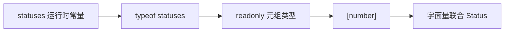
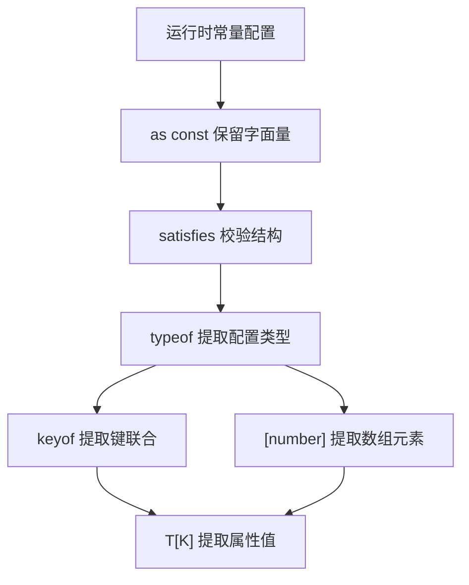

# TypeScript `keyof`、`typeof` 与索引访问类型进阶

> 适用环境：TypeScript 7.x、Node.js 22+、`strict` 模式。本节聚焦从现有结构派生类型，不提前展开条件类型和自定义映射类型。

## 1. 学习目标

完成本节后，你应该能够：

- 区分 TypeScript 的类型空间（Type Space）和值空间（Value Space）。
- 区分 JavaScript 运行时 `typeof` 和 TypeScript 类型位置 `typeof`。
- 使用 `typeof` 从变量、对象属性、函数和类派生类型。
- 使用 `keyof` 得到对象已知键的联合类型。
- 理解 `keyof` 遇到字符串、数字、符号索引签名时的结果。
- 理解 `keyof` 作用于联合类型和交叉类型时的差异。
- 使用索引访问类型 `T[K]` 获取属性、多个属性或数组元素的类型。
- 组合 `typeof`、`keyof` 和 `[number]`，让类型跟随配置数据自动更新。
- 正确使用 `as const` 保留字面量，并理解它不等于运行时深度冻结。
- 使用 `satisfies` 校验配置形状，同时保留表达式自身的精确信息。
- 识别 `Object.keys`、任意字符串索引和类型断言中常见的不安全写法。

## 2. 前置知识

建议先掌握：

- 对象类型、函数类型和结构化类型系统。
- 联合类型、交叉类型与字面量类型。
- 泛型参数、泛型约束和 `K extends keyof T`。
- `readonly`、元组和 `unknown`。

上一节：[TypeScript 泛型基础与约束](/frontend/typescript/generics-and-constraints)

## 3. 为什么需要从现有结构派生类型

假设系统有一组课程状态：

```ts
type LessonStatus = 'draft' | 'published' | 'archived'

const statusLabels = {
  draft: '草稿',
  published: '已发布',
  archived: '已归档'
}
```

状态被写了两次：一次在类型中，一次在运行时对象中。随着业务变化，很容易只修改其中一处：

```ts
type LessonStatus =
  | 'draft'
  | 'reviewing'
  | 'published'
  | 'archived'

// 忘记给 statusLabels 添加 reviewing
```

另一种做法是让类型从真实配置派生：

```ts
const statusLabels = {
  draft: '草稿',
  published: '已发布',
  archived: '已归档'
} as const

type LessonStatus = keyof typeof statusLabels
// "draft" | "published" | "archived"
```

现在配置键就是单一事实来源（Single Source of Truth）。添加或移除键时，类型会自动变化。

类型派生适合：

- 状态、角色、路由和事件名称。
- 表格列、表单字段和筛选配置。
- 常量数组与下拉选项。
- 函数返回值和库导出的配置对象。
- API DTO 中多个模型共享的字段类型。

目标不是写出最复杂的类型表达式，而是减少重复、保持同步和暴露不一致。

## 4. 类型空间和值空间

TypeScript 源码中同时存在两类名称：

- **值**：运行时真实存在，可以赋值、调用、打印或读取。
- **类型**：只供编译器检查，生成 JavaScript 后通常被移除。

```ts
interface Lesson {
  id: string
  title: string
}

const lesson = {
  id: 'ts-05',
  title: '类型运算'
}
```

`Lesson` 只在类型空间，`lesson` 只在值空间：

```ts
const current: Lesson = lesson
//             类型      值
```

因此不能把普通值直接当成类型：

```ts
const field = 'title'
type FieldValue = Lesson[field]
//                       ~~~~~ field 是值，不是类型
```

需要先取得这个值的类型：

```ts
const field = 'title' as const
type FieldValue = Lesson[typeof field]
// string
```

### 某些名称同时存在于两个空间

类声明会同时创建：

1. 实例类型。
2. 运行时构造函数值。

```ts
class LessonModel {
  constructor(readonly title: string) {}
}

const instance: LessonModel = new LessonModel('类型运算')
//              实例类型       构造函数值
```

这种“双重身份”是后面理解 `typeof LessonModel` 的关键。

## 5. 两种 `typeof` 完全不同

### JavaScript 运行时 `typeof`

出现在表达式位置，会真实执行并返回字符串：

```ts
const title = 'TypeScript'
console.log(typeof title) // "string"
```

它常用于类型收窄：

```ts
function normalize(value: string | number): string {
  if (typeof value === 'string') {
    return value.trim()
  }

  return value.toFixed(0)
}
```

### TypeScript 类型位置 `typeof`

出现在类型位置，不执行代码，而是取得某个值的静态类型：

```ts
const lesson = {
  id: 'ts-05',
  title: '类型运算',
  durationMinutes: 100
}

type LessonFromValue = typeof lesson
// {
//   id: string
//   title: string
//   durationMinutes: number
// }
```

可以把它理解为编译器在问：

> “如果我要声明另一个变量与 `lesson` 拥有相同静态类型，这个类型是什么？”

这两个 `typeof` 虽然拼写相同，却处在不同语法上下文：

| 写法 | 所在空间 | 是否运行 | 结果 |
| --- | --- | --- | --- |
| `typeof value` 作为表达式 | 值空间 | 是 | 运行时字符串 |
| `type T = typeof value` | 类型空间 | 否 | 值的静态类型 |

## 6. 类型位置 `typeof` 的使用限制

TypeScript 有意限制类型位置的 `typeof`。通常只能对标识符及其属性使用：

```ts
const config = {
  request: {
    timeout: 5000
  }
}

type Config = typeof config
type RequestConfig = typeof config.request
```

不能把任意函数调用放进类型位置：

```ts
function createLesson() {
  return { id: '1', title: 'TypeScript' }
}

type Lesson = typeof createLesson()
//                                ~~ 类型位置不会执行函数
```

如果目标是取得函数返回类型，应组合 `typeof` 与内置工具类型 `ReturnType`：

```ts
type CreateLessonResult = ReturnType<typeof createLesson>
// { id: string; title: string }
```

这里分两步：

1. `typeof createLesson` 得到函数的类型。
2. `ReturnType<...>` 提取该函数类型的返回类型。

这种限制避免开发者误以为类型表达式会产生运行时副作用。

## 7. 从函数和类派生类型

### 函数

```ts
function createSummary(title: string, minutes: number) {
  return {
    label: `${title}（${minutes} 分钟）`,
    durationMinutes: minutes
  }
}

type CreateSummary = typeof createSummary
type Summary = ReturnType<CreateSummary>
type CreateSummaryParameters = Parameters<CreateSummary>
// [title: string, minutes: number]
```

不要重复手写函数签名和返回对象结构，派生类型能让重构更同步。但对于公共领域模型，仍应考虑显式接口是否更能稳定表达契约；不要让核心模型完全依赖某个偶然实现细节。

### 类

类名在类型位置默认表示实例类型：

```ts
class Course {
  static category = 'frontend'

  constructor(readonly title: string) {}
}

type CourseInstance = Course
```

`typeof Course` 表示构造函数值及其静态成员的类型：

```ts
type CourseConstructor = typeof Course

const Constructor: CourseConstructor = Course
const course = new Constructor('TypeScript')
console.log(Constructor.category)
```

也可以使用：

```ts
type DerivedInstance = InstanceType<typeof Course>
// Course
```

记忆方式：

- `Course`：`new Course()` 产生的实例类型。
- `typeof Course`：运行时变量 `Course` 本身的构造函数/静态侧类型。

## 8. `keyof`：从对象类型得到键集合

`keyof` 接收一个对象类型，产生其已知属性键组成的联合类型：

```ts
interface Lesson {
  id: string
  title: string
  durationMinutes: number
  published: boolean
}

type LessonKey = keyof Lesson
// "id" | "title" | "durationMinutes" | "published"
```

它发生在类型空间，不会像 `Object.keys` 一样创建运行时数组。

```ts
function getProperty<ObjectType, Key extends keyof ObjectType>(
  object: ObjectType,
  key: Key
): ObjectType[Key] {
  return object[key]
}
```

`keyof` 生成候选键集合，泛型约束从集合中选择一个合法键，索引访问类型再得到对应值类型。

## 9. `keyof` 与数字键、符号键

JavaScript 属性键的运行时基础类型是 `string | number | symbol`，更准确地说，除符号外的属性键最终会按字符串形式处理。

### 数字字面量键

```ts
interface HttpStatusText {
  200: 'OK'
  404: 'Not Found'
}

type HttpStatus = keyof HttpStatusText
// 200 | 404
```

这里得到数字字面量联合，而不是字符串 `'200' | '404'`。

### 唯一符号键

```ts
const metadataKey: unique symbol = Symbol('metadata')

interface WithMetadata {
  id: string
  [metadataKey]: { createdAt: number }
}

type WithMetadataKey = keyof WithMetadata
// "id" | typeof metadataKey
```

`symbol` 键在需要避免属性名冲突的底层库中有价值，普通业务 DTO 和 JSON 中则主要使用字符串键，因为 JSON 不支持符号属性。

## 10. `keyof` 与索引签名

索引签名表示属性名无法预先枚举，但键和值遵循规则。

### 数字索引签名

```ts
type StringList = {
  [index: number]: string
}

type StringListKey = keyof StringList
// number
```

### 字符串索引签名

```ts
type ScoreMap = {
  [name: string]: number
}

type ScoreKey = keyof ScoreMap
// string | number
```

为什么包含 `number`？因为 JavaScript 会把普通对象的数字键转换成字符串：

```ts
const scores: ScoreMap = { Alice: 95 }
scores[0] = 80

console.log(Object.keys(scores)) // ["0", "Alice"]
```

字符串索引签名还要求显式声明的字符串属性值与索引值类型兼容：

```ts
interface Dictionary {
  [key: string]: number
  total: number
  name: string // 错误：string 不兼容索引值 number
}
```

如果对象键实际上是有限集合，不要为了方便随意添加 `[key: string]: unknown`。它会让 `keyof` 扩大为 `string | number`，也会失去拼写检查带来的价值。

## 11. `keyof` 作用于联合类型

假设有两个对象类型：

```ts
interface VideoLesson {
  kind: 'video'
  title: string
  videoUrl: string
}

interface ArticleLesson {
  kind: 'article'
  title: string
  content: string
}

type LessonContent = VideoLesson | ArticleLesson
```

对联合类型使用 `keyof`，得到的是**在没有收窄前可以安全访问的公共键**：

```ts
type SafeContentKey = keyof LessonContent
// "kind" | "title"
```

`videoUrl` 只存在于视频成员，`content` 只存在于文章成员，不能对任意 `LessonContent` 安全读取：

```ts
function printContent(content: LessonContent): void {
  console.log(content.title)    // 安全
  console.log(content.videoUrl) // 错误
}
```

必须先收窄：

```ts
function getBody(content: LessonContent): string {
  if (content.kind === 'video') {
    return content.videoUrl
  }

  return content.content
}
```

这与联合类型的基本规则一致：未经收窄，只能执行每个成员都安全支持的操作。

## 12. `keyof` 作用于交叉类型

交叉类型要求同时满足两边，因此通常拥有两边的全部键：

```ts
interface Identified {
  id: string
}

interface Timestamped {
  createdAt: number
}

type StoredEntity = Identified & Timestamped
type StoredEntityKey = keyof StoredEntity
// "id" | "createdAt"
```

可以概括为：

```text
keyof (A | B) → 通常是双方可安全访问的公共键
keyof (A & B) → 通常是双方键的联合
```

如果交叉类型的同名属性发生冲突，属性值可能变成 `never`；键仍可能存在。`keyof` 只回答“有哪些键”，不保证对应值类型一定可构造。

## 13. 索引访问类型 `T[K]`

索引访问类型使用键类型查询属性值类型：

```ts
type LessonTitle = Lesson['title']
// string

type LessonDuration = Lesson['durationMinutes']
// number
```

它类似 JavaScript 的方括号访问，但只发生在类型空间，不读取任何真实对象。

如果键不存在，编译器会报错：

```ts
type LessonStatus = Lesson['status']
//                         ~~~~~~~~ Lesson 没有 status
```

这使模型重构更可靠：重命名或删除字段后，所有依赖该字段类型的位置都会被检查。

## 14. 用联合键取得联合值

索引位置可以使用字面量联合：

```ts
type LessonTextValue = Lesson['id' | 'title']
// string

type LessonDisplayValue = Lesson[
  'title' | 'durationMinutes' | 'published'
]
// string | number | boolean
```

也可以使用 `keyof` 得到全部属性值的联合：

```ts
type LessonValue = Lesson[keyof Lesson]
// string | number | boolean
```

注意，联合会合并重复成员：`id` 和 `title` 都是 `string`，结果中只显示一个 `string`。

这种“所有属性值类型”适合描述通用序列化、日志或配置，但往往太宽，不能替代具体键与具体值之间的对应关系。

## 15. 泛型键让返回类型跟随参数变化

```ts
function getProperty<ObjectType, Key extends keyof ObjectType>(
  object: ObjectType,
  key: Key
): ObjectType[Key] {
  return object[key]
}
```

调用时：

```ts
const lesson: Lesson = {
  id: 'ts-05',
  title: '类型运算',
  durationMinutes: 100,
  published: true
}

const title = getProperty(lesson, 'title')
// string

const published = getProperty(lesson, 'published')
// boolean
```

如果键变量本身是联合，返回值也会成为相应联合：

```ts
const key: 'title' | 'durationMinutes' =
  Math.random() > 0.5 ? 'title' : 'durationMinutes'

const value = getProperty(lesson, key)
// string | number
```

精确结果来自 `Key`，因此不要无意义地把参数提前扩大为 `keyof ObjectType`：

```ts
function getPropertyWide<ObjectType>(
  object: ObjectType,
  key: keyof ObjectType
): ObjectType[keyof ObjectType] {
  return object[key]
}
```

这个版本只知道“某个合法键”，返回值始终是所有属性值的联合，丢失了本次具体键的信息。

## 16. 从数组和元组取得元素类型

数组使用数字索引，因此可以用 `[number]` 得到元素类型：

```ts
type StringElement = string[][number]
// string
```

结合 `typeof`：

```ts
const lessons = [
  { id: 'ts-04', title: '泛型' },
  { id: 'ts-05', title: '类型运算' }
]

type LessonItem = (typeof lessons)[number]
// { id: string; title: string }
```

括号很重要：先得到数组变量的类型，再用 `[number]` 访问它的元素类型。

### 元组可以按具体位置访问

```ts
type Entry = readonly [id: string, duration: number]

type EntryId = Entry[0]
// string

type EntryDuration = Entry[1]
// number

type EntryElement = Entry[number]
// string | number
```

具体数字位置保留每个槽位的类型，`number` 则表示任意有效元素位置的联合。

## 17. 字面量扩大为什么会影响派生类型

```ts
const statuses = ['draft', 'published', 'archived']
type Status = (typeof statuses)[number]
// string
```

普通可变数组以后可以加入任意字符串，所以元素被推断为 `string`。如果希望得到有限字面量联合，需要保留字面量：

```ts
const statuses = ['draft', 'published', 'archived'] as const
type Status = (typeof statuses)[number]
// "draft" | "published" | "archived"
```

推导链如下：



## 18. `as const` 的三项类型效果

对字面量表达式使用 `as const`，主要产生三个效果：

1. 字面量不再扩大，例如 `'draft'` 保留为 `'draft'`。
2. 对象字面量属性成为 `readonly`。
3. 数组字面量成为只读元组。

```ts
const config = {
  status: 'draft',
  retryDelays: [1000, 3000]
} as const

// 类型近似：
// {
//   readonly status: "draft"
//   readonly retryDelays: readonly [1000, 3000]
// }
```

因此这些写入会报错：

```ts
config.status = 'published'
config.retryDelays.push(5000)
```

### `as const` 不会运行时冻结

类型检查被绕过或代码来自普通 JavaScript 时，运行时对象仍可能变化。`as const` 不会调用 `Object.freeze`。

它也不是递归克隆或绝对深度不可变。如果字面量引用了外部可变对象，外部对象仍可通过原引用修改：

```ts
const delays = [1000, 3000]

const config = {
  delays
} as const

config.delays = [] // 类型错误：属性只读
delays.push(5000)  // 合法：原数组仍是可变数组
```

## 19. `satisfies`：校验而不替换表达式类型

类型标注会把变量视为标注类型：

```ts
type FieldValue = string | readonly [number, number, number]
type ColorName = 'primary' | 'success' | 'danger'

const palette: Record<ColorName, FieldValue> = {
  primary: [49, 87, 213],
  success: '#16845b',
  danger: '#c2415d'
}

// palette.success 的类型是 FieldValue
```

`satisfies` 检查表达式可赋值给目标类型，同时尽量保留表达式自身的推断信息：

```ts
const palette = {
  primary: [49, 87, 213],
  success: '#16845b',
  danger: '#c2415d'
} satisfies Record<ColorName, string | [number, number, number]>

palette.success.toUpperCase() // 保留为字符串，可直接调用
```

它能检查缺少键、多余键和错误值结构，而不把整个变量强制替换成宽泛目标类型。

### `satisfies` 不是类型断言

```ts
const value = expression as Target
```

`as` 表达开发者对类型的主张，在一定重叠规则内可能跳过部分推断问题；`satisfies` 则要求表达式真实可赋值给目标类型，验证失败会报错。

### `satisfies` 不是运行时校验

它仍然只在编译阶段工作，不能验证网络 JSON、用户输入或本地存储数据。

## 20. 组合 `as const` 与 `satisfies`

配置驱动开发中常需要同时实现：

1. 保留字面量和只读结构。
2. 校验配置符合约定。

```ts
type LessonStatus = 'draft' | 'published' | 'archived'

const statusLabels = {
  draft: '草稿',
  published: '已发布',
  archived: '已归档'
} as const satisfies Record<LessonStatus, string>
```

结果：

- 如果漏掉 `archived`，编译器报错。
- 如果拼错键，编译器报错。
- 值仍保留 `'草稿' | '已发布' | '已归档'` 字面量。
- 属性为只读。

可以继续派生：

```ts
type StatusKey = keyof typeof statusLabels
// "draft" | "published" | "archived"

type StatusLabel = (typeof statusLabels)[StatusKey]
// "草稿" | "已发布" | "已归档"
```

这是一条常见且维护成本低的类型链：运行时配置 → 静态校验 → 键类型 → 值类型。

## 21. 从对象配置派生类型

```ts
const fieldDefinitions = {
  title: {
    label: '课程名称',
    kind: 'text'
  },
  durationMinutes: {
    label: '学习时长',
    kind: 'number'
  },
  published: {
    label: '是否发布',
    kind: 'boolean'
  }
} as const
```

可以逐层查询：

```ts
type FieldDefinitions = typeof fieldDefinitions
type FieldName = keyof FieldDefinitions
// "title" | "durationMinutes" | "published"

type TitleDefinition = FieldDefinitions['title']
// { readonly label: "课程名称"; readonly kind: "text" }

type FieldKind = FieldDefinitions[FieldName]['kind']
// "text" | "number" | "boolean"
```

最后一个表达式按顺序理解：

1. `FieldDefinitions[FieldName]` 得到每个字段定义对象的联合。
2. 再用 `['kind']` 取得每个成员的共同属性 `kind`。
3. 结果合并为字面量联合。

## 22. 从数组配置派生类型

```ts
const columns = [
  { key: 'title', label: '课程名称', align: 'left' },
  { key: 'durationMinutes', label: '时长', align: 'right' },
  { key: 'published', label: '状态', align: 'center' }
] as const satisfies readonly {
  key: keyof Lesson
  label: string
  align: 'left' | 'center' | 'right'
}[]
```

派生元素与属性类型：

```ts
type Column = (typeof columns)[number]

type ColumnKey = Column['key']
// "title" | "durationMinutes" | "published"

type ColumnAlign = Column['align']
// "left" | "right" | "center"
```

如果把 `key` 写成不存在的 `'duration'`，`satisfies` 会立即报错。与此同时，具体列键仍保持字面量，而不是被扩大成整个 `keyof Lesson`。

## 23. `Object.keys` 为什么返回 `string[]`

很多开发者期望：

```ts
Object.keys(lesson) // Array<keyof Lesson>？
```

标准类型通常返回 `string[]`。原因在于 TypeScript 的结构化类型系统允许值在运行时拥有比静态类型更多的属性：

```ts
interface Named {
  name: string
}

const fullUser = {
  name: 'Ada',
  passwordHash: 'secret'
}

const publicUser: Named = fullUser
Object.keys(publicUser)
// 运行时包含 name 和 passwordHash
```

静态的 `keyof Named` 只有 `'name'`，但运行时键还可能包含 `passwordHash`。如果 `Object.keys` 无条件承诺 `Array<keyof T>`，某些开放对象场景就不真实。

### 安全策略

- 已知有限字段：显式定义键元组并用 `satisfies` 校验。
- 外部对象：把键和值当作未知数据处理并验证。
- 内部完全受控的封闭对象：可以封装带断言的辅助函数，但必须记录其前置条件。
- 不要在通用库里无条件把所有 `Object.keys` 结果断言成 `Array<keyof T>`。

## 24. 动态字符串不能直接索引有限对象

```ts
const keyFromUrl: string = new URLSearchParams(location.search).get('sort') ?? ''

const value = lesson[keyFromUrl]
//                   ~~~~~~~~~~ 任意 string 不保证是 Lesson 的键
```

URL 参数是运行时外部输入，类型标注不能把它自动变成合法键。应该验证：

```ts
const sortableFields = ['title', 'durationMinutes'] as const
type SortableField = (typeof sortableFields)[number]

function isSortableField(value: string): value is SortableField {
  return (sortableFields as readonly string[]).includes(value)
}

if (isSortableField(keyFromUrl)) {
  const value = lesson[keyFromUrl]
  // string | number
}
```

这里数组既参与运行时校验，又通过 `typeof` 和 `[number]` 提供静态联合。类型谓词的实现责任仍由开发者承担。

## 25. 完整项目示例：配置驱动的课程字段

本站提供可运行源码：

```text
examples/typescript/keyof-typeof-and-indexed-access.ts
```

<<< ../../../examples/typescript/keyof-typeof-and-indexed-access.ts

示例包含：

1. `statusLabels`：组合 `as const` 和 `satisfies`。
2. `LessonStatus`：使用 `keyof typeof` 从配置键派生。
3. `StatusLabel`：用索引访问得到配置值联合。
4. `columns`：校验表格列键必须属于 `Lesson`。
5. `ColumnKey`：从只读元组元素派生实际展示字段。
6. `getProperty` 和 `formatProperty`：让返回值与键保持精确关系。
7. `sortableFields`：同一常量同时驱动运行时校验与静态类型。



这种设计减少了手工同步类型与配置的工作，但仍要保持边界清晰：配置适合成为事实来源时才派生；稳定的公共领域契约仍可能需要显式声明。

## 26. 常见错误

### 混淆运行时 `typeof` 和类型位置 `typeof`

运行时版本返回字符串并可以收窄；类型版本提取静态类型且不会执行代码。

### 直接把值名放进类型索引

```ts
const key = 'title'
type Value = Lesson[key]
```

应该使用字面量类型，或 `Lesson[typeof key]`。

### 认为 `keyof` 会返回运行时数组

`keyof` 只产生联合类型，没有 JavaScript 输出。需要遍历仍要准备真实键数组或调用运行时 API。

### 给有限对象添加宽泛字符串索引签名

这会允许任意字符串键、扩大 `keyof` 并弱化拼写检查。只有真正的字典结构才应使用索引签名。

### 认为 `as const` 会深度冻结运行时对象

它影响类型推断和写入检查，不调用 `Object.freeze`，也不能阻止外部可变引用被修改。

### 把 `satisfies` 当成运行时验证

它只检查源码表达式的静态可赋值性，不验证 API 响应或用户输入。

### 无条件断言 `Object.keys` 为 `Array<keyof T>`

结构化类型允许运行时额外属性，这个断言只在封闭、受控对象等明确前置条件下可靠。

### 派生出过于宽泛的全部值联合

`T[keyof T]` 会丢失键与值的一一对应。如果调用逻辑依赖具体键，应保留泛型 `K` 并返回 `T[K]`。

## 27. 工程最佳实践

- 当运行时配置才是事实来源时，用 `typeof` 派生类型，减少重复声明。
- 当公共接口或领域模型需要稳定契约时，优先显式命名类型，再用 `satisfies` 校验实现。
- 有限值集合使用只读元组加 `(typeof values)[number]`。
- 有限对象键使用 `keyof typeof object`。
- 保留键和值关系时使用泛型 `K extends keyof T` 和 `T[K]`。
- 配置对象同时需要精确字面量与结构检查时，使用 `as const satisfies ...`。
- 只有真正开放的字典才使用字符串索引签名。
- 动态 URL、表单、存储和接口字段先做运行时验证，再作为有限键使用。
- 不通过断言假装 `Object.keys` 在所有对象上都精确。
- 派生类型保持可读；过长的嵌套查询应拆成有业务含义的类型别名。
- 类型派生不能替代运行时校验、授权控制或数据清洗。

## 28. 与 Vue、Java 和后端开发的联系

### Vue Props 和事件名称

组件配置可以成为字段与事件名称的来源：

```ts
const editorFields = {
  title: { component: 'TextInput' },
  durationMinutes: { component: 'NumberInput' }
} as const

type EditorField = keyof typeof editorFields
// "title" | "durationMinutes"
```

表单状态、校验错误和更新事件可以复用 `EditorField`，减少字符串拼写分叉。

### Vue 表格与筛选器

列配置中的 `key` 使用 `keyof Row` 校验，格式化函数的输入使用 `Row[Key]`。这样数值列不会被误当成字符串列处理。

实际通用表格还会遇到联合列配置与回调相关性问题，后续条件类型和映射类型会进一步解决。

### Java 对比

Java 可以通过反射在运行时读取字段和方法，但 TypeScript 的 `keyof`、类型位置 `typeof` 与索引访问主要是编译期类型运算，通常没有运行时元数据。

TypeScript 的结构化类型、字面量联合和从常量派生类型也更贴近 JavaScript 数据结构；不要把 `typeof` 类型运算理解为 Java 的运行时反射。

### 后端 DTO 与接口配置

从共享 Schema 或生成代码派生 DTO 可以减少前后端漂移，但仅从某个示例 JSON 使用 `typeof` 推断类型通常不够可靠：示例可能遗漏可选字段、错误分支和边界值。

生产环境应让 OpenAPI、JSON Schema、验证 Schema 或明确领域模型成为契约来源，并同时保留运行时验证。

## 29. 面试知识

### 类型位置的 `typeof` 与 JavaScript `typeof` 有什么区别？

JavaScript `typeof` 在运行时执行并返回类型字符串，可用于分支收窄；TypeScript 类型位置的 `typeof` 在编译期取得已有值的静态类型，通常只允许用于标识符及其属性，不执行表达式。

### `keyof T` 返回什么？

它返回对象类型 `T` 的已知属性键联合。普通对象通常得到字符串、数字或唯一符号字面量；索引签名可能使结果扩大为 `string`、`number` 或 `symbol`。

### `T[K]` 表示什么？

它是索引访问类型，表示类型 `T` 在键类型 `K` 对应位置的属性值类型。`K` 可以是单个键、键联合、`keyof T` 或其他满足要求的类型。

### 为什么 `keyof (A | B)` 通常只包含公共键？

一个值在未收窄时可能是联合中的任意成员，只能安全访问每个成员都有的键，因此 `keyof` 反映可安全操作的公共部分。

### `as const` 和 `satisfies` 有什么区别？

`as const` 控制字面量推断，使字面量不扩大、对象属性只读、数组成为只读元组；`satisfies` 检查表达式是否满足目标类型，同时尽量保留表达式自身的推断类型。两者都不提供运行时验证。

### 为什么 `Object.keys` 通常不是 `Array<keyof T>`？

结构化类型允许一个静态类型较窄的变量指向拥有额外运行时属性的对象。实际键可能超出 `keyof T`，所以标准签名保持为更保守的 `string[]`。

## 30. 本节总结

- TypeScript 源码同时包含类型空间和值空间，值不能直接当类型使用。
- 运行时 `typeof` 返回字符串，类型位置 `typeof` 提取静态类型。
- 类型位置 `typeof` 通常只作用于标识符及其属性，不会执行函数。
- `typeof` 可与 `ReturnType`、`Parameters`、`InstanceType` 等工具组合。
- `keyof T` 得到对象已知键的联合，不会产生运行时数组。
- 字符串索引签名会使 `keyof` 包含 `string | number`。
- 联合对象的 `keyof` 反映未经收窄可安全访问的公共键。
- 交叉对象的 `keyof` 通常包含各组成类型的全部键。
- `T[K]` 查询属性值类型，联合键会得到对应值类型联合。
- `(typeof array)[number]` 可以从数组或只读元组派生元素类型。
- `as const` 保留字面量、生成只读属性和只读元组，但不深度冻结运行时对象。
- `satisfies` 校验可赋值性并保留表达式精度，但不是运行时验证。
- `as const satisfies ...` 适合配置驱动的有限键和值模型。
- `Object.keys` 的保守返回类型反映了开放对象与运行时额外属性的现实。
- 动态字符串必须经过运行时验证，才能安全收窄为有限对象键。

## 31. 下一步学习

下一节建议学习：[**TypeScript 条件类型与 `infer`**](/frontend/typescript/conditional-types-and-infer)。

届时将继续解决：

- 如何在类型系统中表达条件分支。
- 条件类型为什么会对裸类型参数联合进行分发。
- 如何使用 `infer` 从函数、数组和 Promise 中提取内部类型。
- 如何理解 `Exclude`、`Extract`、`NonNullable`、`ReturnType` 等内置工具类型。
- 如何控制条件类型的复杂度，避免难以维护的类型体操。

## 32. 参考资料

- [TypeScript Handbook：Keyof Type Operator](https://www.typescriptlang.org/docs/handbook/2/keyof-types.html)
- [TypeScript Handbook：Typeof Type Operator](https://www.typescriptlang.org/docs/handbook/2/typeof-types.html)
- [TypeScript Handbook：Indexed Access Types](https://www.typescriptlang.org/docs/handbook/2/indexed-access-types.html)
- [TypeScript Handbook：Creating Types from Types](https://www.typescriptlang.org/docs/handbook/2/types-from-types.html)
- [TypeScript Handbook：Everyday Types - Literal Inference](https://www.typescriptlang.org/docs/handbook/2/everyday-types.html#literal-inference)
- [TypeScript 3.4 Release Notes：const assertions](https://www.typescriptlang.org/docs/handbook/release-notes/typescript-3-4.html#const-assertions)
- [TypeScript 4.9 Release Notes：The satisfies Operator](https://www.typescriptlang.org/docs/handbook/release-notes/typescript-4-9.html#the-satisfies-operator)
- [TypeScript Handbook：Object Types - Index Signatures](https://www.typescriptlang.org/docs/handbook/2/objects.html#index-signatures)
