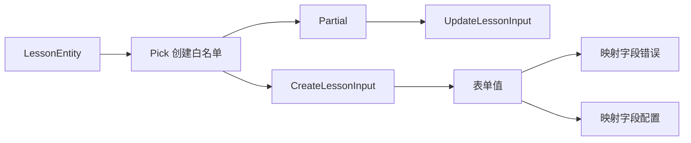

# TypeScript 映射类型与常用工具类型

> 适用环境：TypeScript 7.x、Node.js 22+、`strict` 与 `exactOptionalPropertyTypes` 模式。本节关注业务类型设计，不追求难以维护的深层类型体操。

## 1. 学习目标

完成本节后，你应该能够：

- 理解映射类型如何遍历 `PropertyKey` 联合并生成对象类型。
- 使用 `keyof` 和索引访问类型保持键和值的对应关系。
- 添加或移除属性的 `readonly`、可选修饰符。
- 理解同态映射为什么会保留原属性修饰符。
- 使用 `as` 重命名键，并通过 `never` 过滤键。
- 区分映射类型、索引签名和运行时对象遍历。
- 掌握 `Partial`、`Required`、`Readonly`、`Pick`、`Omit` 和 `Record`。
- 理解这些工具类型是浅层变换，不会执行运行时复制、冻结或校验。
- 正确设计更新 DTO、表单状态、字段配置和事件处理器映射。
- 识别 `Partial`、`Record`、联合对象与可选属性的常见陷阱。
- 在标准工具类型、自定义浅层工具和显式领域类型之间作出选择。

## 2. 前置知识

建议先掌握：

- 对象类型、可选属性和只读属性。
- 泛型与泛型约束。
- `keyof`、类型位置 `typeof` 和索引访问类型。
- 条件类型、`never`、`Exclude` 与 `Extract`。

上一节：[TypeScript 条件类型与 `infer`](/frontend/typescript/conditional-types-and-infer)

## 3. 为什么需要映射类型

假设接口模型是：

```ts
interface Lesson {
  readonly id: string
  title: string
  summary?: string
  published: boolean
}
```

编辑表单、权限配置和校验结果都与这些字段有关，但值类型不同：

```ts
interface LessonFieldTouched {
  id: boolean
  title: boolean
  summary: boolean
  published: boolean
}
```

手写派生模型会产生两个问题：

- `Lesson` 新增字段后，相关模型可能忘记同步。
- 重复声明隐藏了“每个字段都执行相同变换”的真实规则。

映射类型可以直接表达这个规则：

```ts
type FieldState<Type, State> = {
  [Key in keyof Type]: State
}

type LessonFieldTouched = FieldState<Lesson, boolean>
```

它在编译阶段从已有类型生成新类型，不会遍历任何运行时对象。

## 4. 基本语法

映射类型的核心形式是：

```ts
type Mapped<Type> = {
  [Key in keyof Type]: Type[Key]
}
```

可以分成三步理解：

1. `keyof Type` 取得属性键联合。
2. `Key in ...` 逐个遍历这些键。
3. `Type[Key]` 取得当前键对应的值类型。

```ts
interface LessonDraft {
  title: string
  durationMinutes: number
  published: boolean
}

type Copy<Type> = {
  [Key in keyof Type]: Type[Key]
}

type CopiedLessonDraft = Copy<LessonDraft>
// {
//   title: string
//   durationMinutes: number
//   published: boolean
// }
```

`Key` 只是当前遍历变量，可以命名为 `Property`、`K` 或其他有意义的名称。

## 5. 映射类型不是运行时循环

下面的定义只存在于类型检查阶段：

```ts
type BooleanFlags<Type> = {
  [Key in keyof Type]: boolean
}
```

它不会创建对象，也不会把真实属性值改成布尔值：

```ts
type LessonFlags = BooleanFlags<LessonDraft>

const flags: LessonFlags = {
  title: false,
  durationMinutes: false,
  published: true
}
```

真实对象仍需通过对象字面量、循环、`Object.fromEntries` 或其他 JavaScript 代码构造。类型声明只能检查结果是否满足约定。

## 6. 与索引签名的区别

索引签名描述事先不确定的键：

```ts
type Scores = {
  [lessonId: string]: number
}
```

映射类型通常描述一个已知键联合：

```ts
type LessonStatus = 'draft' | 'review' | 'published'

type StatusLabels = {
  [Status in LessonStatus]: string
}
```

二者的区别是：

| 能力 | 索引签名 | 映射类型 |
| --- | --- | --- |
| 描述开放字符串字典 | 适合 | 通常不是首选 |
| 遍历有限键联合 | 不表达遍历 | 适合 |
| 为每个已知键保留不同值类型 | 较弱 | 可用 `Type[Key]` |
| 增删属性修饰符 | 不适合 | 支持 |
| 重命名或过滤键 | 不支持 | 支持 `as` |

已知状态集合应优先使用有限键联合，因为漏写或多写键都能被检查。

## 7. 键必须属于 `PropertyKey`

JavaScript 对象属性键由 `string`、`number` 或 `symbol` 表示，TypeScript 用全局类型 `PropertyKey` 概括它们：

```ts
type PropertyKey = string | number | symbol
```

自定义键集合时应施加相应约束：

```ts
type Dictionary<
  Key extends PropertyKey,
  Value
> = {
  [Current in Key]: Value
}
```

```ts
type Locale = 'zh-CN' | 'en-US'
type Messages = Dictionary<Locale, string>
```

这正是 `Record<Keys, Type>` 的核心思想。

## 8. 保持键和值的对应关系

把所有值统一改成一个类型很简单，更重要的是保留每个键原有的值类型：

```ts
type PromiseFields<Type> = {
  [Key in keyof Type]: Promise<Type[Key]>
}
```

```ts
interface LessonForm {
  title: string
  durationMinutes: number
  published: boolean
}

type AsyncLessonForm = PromiseFields<LessonForm>
// {
//   title: Promise<string>
//   durationMinutes: Promise<number>
//   published: Promise<boolean>
// }
```

`Type[Key]` 让当前键与原值类型保持关联，而不是把所有值扩大成 `string | number | boolean`。

## 9. 同态映射与修饰符保留

直接遍历 `keyof Type` 的映射通常会保留原属性的可选和只读修饰符：

```ts
type Identity<Type> = {
  [Key in keyof Type]: Type[Key]
}

interface LessonMeta {
  readonly id: string
  summary?: string
}

type SameLessonMeta = Identity<LessonMeta>
// readonly id: string
// summary?: string
```

这种从输入对象属性直接派生的变换常称为同态映射。它的意义不是某个新关键字，而是提醒你：原模型的修饰符默认可能被带到结果中。

如果业务要求改变修饰符，就应显式使用映射修饰符。

## 10. 添加可选修饰符：`?`

```ts
type Optional<Type> = {
  [Key in keyof Type]?: Type[Key]
}
```

这与内置 `Partial<Type>` 的核心行为一致：

```ts
type LessonPatch = Partial<LessonDraft>

const patch: LessonPatch = {
  title: '新的标题'
}
```

`?` 的完整写法是 `+?`，省略 `+` 时默认表示添加：

```ts
type AlsoOptional<Type> = {
  [Key in keyof Type]+?: Type[Key]
}
```

## 11. 移除可选修饰符：`-?`

```ts
type Concrete<Type> = {
  [Key in keyof Type]-?: Type[Key]
}
```

```ts
interface LessonInput {
  title?: string
  durationMinutes?: number
}

type CompleteLessonInput = Concrete<LessonInput>
// title: string
// durationMinutes: number
```

内置 `Required<Type>` 使用同类机制。注意：移除属性的可选性与移除值类型中的 `undefined` 不是同一个问题：

```ts
interface ExplicitUndefined {
  value: string | undefined
}

type StillMayBeUndefined = Required<ExplicitUndefined>
// value 是必填属性，但值仍可能是 undefined
```

## 12. 添加只读修饰符：`readonly`

```ts
type ImmutableView<Type> = {
  readonly [Key in keyof Type]: Type[Key]
}
```

它与内置 `Readonly<Type>` 的核心行为一致：

```ts
const lesson: Readonly<LessonDraft> = {
  title: '映射类型',
  durationMinutes: 120,
  published: false
}

// lesson.title = '新标题'
// 错误：title 是只读属性
```

`readonly` 约束 TypeScript 中的赋值操作，不等于运行时 `Object.freeze()`。

## 13. 移除只读修饰符：`-readonly`

标准库没有名为 `Mutable` 的内置工具，但可以清晰地定义浅层版本：

```ts
type Mutable<Type> = {
  -readonly [Key in keyof Type]: Type[Key]
}
```

```ts
interface StoredLesson {
  readonly id: string
  readonly title: string
}

type EditableLesson = Mutable<StoredLesson>
```

`Mutable` 只移除第一层属性修饰符；嵌套对象是否只读取决于它自己的类型。

## 14. 同时增删多个修饰符

修饰符可以组合：

```ts
type MutableRequired<Type> = {
  -readonly [Key in keyof Type]-?: Type[Key]
}

type ReadonlyPartial<Type> = {
  readonly [Key in keyof Type]?: Type[Key]
}
```

阅读顺序可以固定为：

1. 遍历哪些键。
2. 是否改变 `readonly`。
3. 是否改变 `?`。
4. 每个键的新值类型是什么。

复杂变换应拆成有名称的中间类型，避免把所有操作塞进一个难以解释的表达式。

## 15. `Partial<Type>`：局部更新

`Partial<Type>` 把第一层所有属性变成可选：

```ts
function updateLesson(
  lesson: LessonDraft,
  changes: Partial<LessonDraft>
): LessonDraft {
  return { ...lesson, ...changes }
}
```

它适合“可更新任意字段”的内部函数，但不代表所有 API 更新模型都应直接使用它。

例如 `id` 不允许修改、标题不允许显式清空时，应该表达真实约束：

```ts
type UpdateLessonInput = Partial<
  Pick<LessonDraft, 'title' | 'durationMinutes' | 'published'>
>
```

或者使用显式接口，使接口契约更容易审查。

## 16. `exactOptionalPropertyTypes` 与 `Partial`

启用 `exactOptionalPropertyTypes` 后，可选属性表示“属性可以不存在”，不会自动等价为“属性存在且值为 `undefined`”：

```ts
interface Profile {
  displayName: string
}

const changes: Partial<Profile> = {}

// const invalid: Partial<Profile> = {
//   displayName: undefined
// }
```

如果协议明确允许发送 `undefined`，应把它写进值类型：

```ts
interface ProfilePatch {
  displayName?: string | undefined
}
```

对 HTTP JSON 而言，`undefined` 通常还会在序列化时被忽略；“缺失”“`null`”“空字符串”必须由协议明确区分。

## 17. `Required<Type>`：完成态模型

`Required<Type>` 把第一层所有属性变成必填：

```ts
interface LessonOptions {
  autoplay?: boolean
  playbackRate?: number
}

type ResolvedLessonOptions = Required<LessonOptions>
```

它适合描述默认值合并后的内部状态：

```ts
function resolveOptions(
  options: LessonOptions
): ResolvedLessonOptions {
  return {
    autoplay: options.autoplay ?? false,
    playbackRate: options.playbackRate ?? 1
  }
}
```

类型变换不会自动补默认值；函数实现仍需真正产生完整对象。

## 18. `Readonly<Type>`：只读视图

`Readonly<Type>` 可表达“调用方不应重写第一层属性”：

```ts
function printLesson(lesson: Readonly<LessonDraft>): string {
  return `${lesson.title}（${lesson.durationMinutes} 分钟）`
}
```

它是静态约束，不提供深层不可变和运行时安全：

```ts
interface Course {
  title: string
  tags: string[]
}

const course: Readonly<Course> = {
  title: 'TypeScript',
  tags: ['frontend']
}

course.tags.push('types') // 合法：tags 引用只读，但数组本身仍可变
```

需要深层只读时可设计递归工具，但数组、函数、Map、Set、类实例和性能都需要单独处理。领域模型中显式使用 `readonly` 往往更易维护。

## 19. `Pick<Type, Keys>`：选择字段

`Pick` 从对象类型中选择指定属性：

```ts
type LessonCard = Pick<
  LessonDraft,
  'title' | 'durationMinutes'
>
```

其核心实现思路是：

```ts
type MyPick<
  Type,
  Keys extends keyof Type
> = {
  [Key in Keys]: Type[Key]
}
```

`Keys extends keyof Type` 防止选择不存在的字段。`Pick` 适合白名单式视图：当模型新增敏感字段时，不会自动暴露。

## 20. `Omit<Type, Keys>`：排除字段

`Omit` 保留除指定键之外的属性：

```ts
interface LessonRecord {
  id: string
  title: string
  internalNotes: string
  createdAt: Date
}

type PublicLesson = Omit<LessonRecord, 'internalNotes'>
```

可以用已有工具理解其核心思路：

```ts
type MyOmit<Type, Keys extends PropertyKey> = Pick<
  Type,
  Exclude<keyof Type, Keys>
>
```

`Omit` 是黑名单式模型：原类型新增属性后会自动进入结果。处理敏感信息或外部响应时，`Pick` 的白名单通常更稳妥。

## 21. `Pick` 与 `Omit` 的选择

| 场景 | 推荐 | 原因 |
| --- | --- | --- |
| 对外公开字段 | `Pick` | 新增内部字段不会自动泄露 |
| 去掉一个稳定的技术字段 | `Omit` | 表达简洁 |
| 创建函数输入，排除服务端生成字段 | `Omit` | 常见且直观 |
| 安全敏感 DTO | 显式类型或 `Pick` | 容易审计 |
| 模型差异较大 | 显式领域类型 | 避免派生关系掩盖语义 |

不要因为工具类型更短，就让数据库实体、接口响应和表单模型永远强耦合。

## 22. `Record<Keys, Type>`：有限键字典

`Record` 为每个键指定统一值类型：

```ts
type LessonStatus = 'draft' | 'review' | 'published'

const statusLabels: Record<LessonStatus, string> = {
  draft: '草稿',
  review: '审核中',
  published: '已发布'
}
```

其核心实现是：

```ts
type MyRecord<
  Keys extends PropertyKey,
  Value
> = {
  [Key in Keys]: Value
}
```

有限键 `Record` 默认要求键完整。若数据只是稀疏缓存，应明确使用：

```ts
type LessonCache = Partial<Record<string, LessonRecord>>
```

## 23. `Record<string, T>` 不是“键一定存在”

```ts
const lessons: Record<string, LessonRecord> = {}
```

从类型表面看，任意字符串键都对应 `LessonRecord`；但运行时读取不存在的键会得到 `undefined`。

开启 `noUncheckedIndexedAccess` 后，索引读取会更诚实地包含 `undefined`：

```ts
const lesson = lessons['missing']
// LessonRecord | undefined
```

因此：

- 有限键全集使用 `Record<'a' | 'b', T>`。
- 开放且可能缺失的字典配合 `noUncheckedIndexedAccess`。
- 需要明确增删和存在性判断时，考虑 `Map`。
- 外部 JSON 仍需运行时验证。

## 24. 键重映射：`as`

TypeScript 可以在映射过程中生成新键：

```ts
type Getters<Type> = {
  [Key in keyof Type as
    `get${Capitalize<string & Key>}`
  ]: () => Type[Key]
}
```

```ts
interface LessonModel {
  title: string
  published: boolean
}

type LessonGetters = Getters<LessonModel>
// {
//   getTitle: () => string
//   getPublished: () => boolean
// }
```

`string & Key` 只保留可用于模板字面量的字符串键，避免 `number`、`symbol` 键不满足字符串操作要求。

## 25. 使用 `never` 过滤键

在 `as` 位置产生 `never`，当前属性就不会出现在结果中：

```ts
type WithoutId<Type> = {
  [Key in keyof Type as
    Key extends 'id' ? never : Key
  ]: Type[Key]
}
```

也可以按值类型筛选键：

```ts
type KeysMatching<Type, Value> = {
  [Key in keyof Type]-?:
    Type[Key] extends Value ? Key : never
}[keyof Type]
```

```ts
interface LessonFilters {
  keyword: string
  page: number
  published: boolean
}

type BooleanFilterKeys = KeysMatching<LessonFilters, boolean>
// 'published'
```

这里先生成“键到键或 `never`”的对象，再通过 `[keyof Type]` 取出值联合；`never` 最终从联合中消失。

## 26. 可选属性对按值筛选的影响

可选属性读取类型通常包含 `undefined`，所以直接判断可能漏掉它：

```ts
interface SearchForm {
  keyword: string
  category?: string
  page: number
}
```

若希望 `category` 也按 `string` 属性处理，可以先排除空值：

```ts
type KeysWhoseValueCanBe<Type, Value> = {
  [Key in keyof Type]-?:
    NonNullable<Type[Key]> extends Value
      ? Key
      : never
}[keyof Type]
```

这是一项业务选择：如果 `undefined` 有独立含义，就不应该随意移除。类型工具的名字应说明采用了什么判断语义。

## 27. 从事件联合生成处理器对象

映射类型不仅能遍历属性键，也能遍历对象联合，并把判别字段重映射为键：

```ts
type LessonEvent =
  | {
      type: 'lesson.created'
      payload: { id: string; title: string }
    }
  | {
      type: 'lesson.published'
      payload: { id: string; publishedAt: Date }
    }

type EventHandlers<
  Event extends { type: PropertyKey }
> = {
  [Current in Event as Current['type']]:
    (event: Current) => void
}
```

```ts
const handlers: EventHandlers<LessonEvent> = {
  'lesson.created': event => {
    console.log(event.payload.title)
  },
  'lesson.published': event => {
    console.log(event.payload.publishedAt)
  }
}
```

键完整性、事件名和处理器参数会同步变化，适合有限且由本地代码控制的事件集合。

## 28. 对联合对象使用工具类型的陷阱

考虑两种编辑目标：

```ts
type EditorTarget =
  | { kind: 'lesson'; lessonId: string; title: string }
  | { kind: 'course'; courseId: string; name: string }
```

直接写 `Omit<EditorTarget, 'kind'>` 往往不会得到“两个成员分别去掉 `kind`”的直觉结果。标准 `Pick`/`Omit` 围绕整体的 `keyof` 工作，而联合对象的公共键可能只有 `kind`。

需要逐成员变换时，应明确使用分布式条件类型：

```ts
type DistributiveOmit<
  Type,
  Keys extends PropertyKey
> = Type extends unknown
  ? Omit<Type, Keys>
  : never

type EditableTarget = DistributiveOmit<EditorTarget, 'kind'>
// { lessonId: string; title: string }
// | { courseId: string; name: string }
```

是否保留判别字段也要谨慎：删除 `kind` 后，运行时可能更难可靠收窄。

## 29. `Partial` 与可辨识联合

对可辨识联合整体使用 `Partial` 会让判别字段也变成可选，削弱类型收窄：

```ts
type WeakEventPatch = Partial<LessonEvent>
```

更可靠的模型通常保留稳定判别字段，只允许负载中的特定部分变化：

```ts
type EventDraft<Event extends LessonEvent> =
  Event extends unknown
    ? Omit<Event, 'payload'> & {
        payload: Partial<Event['payload']>
      }
    : never
```

不要把 `Partial<T>` 当作“任何草稿”的默认答案。先确定哪些属性必须持续存在，才能维持领域不变量。

## 30. 浅层工具不等于深层工具

所有本节主要工具都只处理第一层属性：

```ts
interface LessonConfig {
  player: {
    autoplay: boolean
    volume: number
  }
}

type ConfigPatch = Partial<LessonConfig>
```

合法值是省略整个 `player`，但一旦提供 `player`，内部仍必须完整：

```ts
const patch: ConfigPatch = {
  player: {
    autoplay: true,
    volume: 0.8
  }
}
```

自定义 `DeepPartial` 看似方便，却会影响数组、元组、函数、Map、Set 和类实例，并可能允许业务上无效的中间状态。配置合并最好由明确的 Schema、分层 patch 类型和真实合并逻辑共同定义。

## 31. 类型变换不会改变运行时数据

以下断言不会删除字段：

```ts
interface UserRecord {
  id: string
  email: string
  passwordHash: string
}

type PublicUser = Omit<UserRecord, 'passwordHash'>

function unsafePublicUser(user: UserRecord): PublicUser {
  return user
}
```

结构化类型允许拥有额外属性的变量赋给较窄类型，但运行时对象仍包含 `passwordHash`。如果随后直接序列化，就可能泄露数据。

必须真正构造安全对象：

```ts
function toPublicUser(user: UserRecord): PublicUser {
  const { passwordHash: _passwordHash, ...publicUser } = user
  return publicUser
}
```

工具类型描述输出契约，不能代替数据裁剪、验证或授权检查。

## 32. 表单状态的类型设计

前端表单经常包含三类模型：

```ts
interface LessonFormValue {
  title: string
  durationMinutes: number
  published: boolean
}

type FieldErrors<Type> = Partial<{
  [Key in keyof Type]: string
}>

type FieldTouched<Type> = {
  [Key in keyof Type]: boolean
}
```

- `LessonFormValue`：提交前的真实值。
- `FieldErrors<LessonFormValue>`：只有失败字段存在错误文本。
- `FieldTouched<LessonFormValue>`：每个字段都有明确触碰状态。

不要把所有模型都写成 `Partial<LessonFormValue>`。错误、触碰状态和提交 patch 具有不同语义，应分别建模。

## 33. 更新 DTO 的安全设计

数据库实体：

```ts
interface LessonEntity {
  id: string
  title: string
  summary: string | null
  published: boolean
  createdAt: Date
  updatedAt: Date
}
```

创建和更新输入不应机械复制实体：

```ts
type CreateLessonInput = Pick<
  LessonEntity,
  'title' | 'summary'
>

type UpdateLessonInput = Partial<Pick<
  LessonEntity,
  'title' | 'summary' | 'published'
>>
```

这能排除服务端管理的 `id` 和时间字段。但如果 API 契约需要长期演进、生成 OpenAPI 或添加字段级说明，显式 DTO 往往比层层工具嵌套更清晰。

## 34. 字段配置映射

映射类型适合确保配置与模型同步：

```ts
type FieldConfig<Type> = {
  [Key in keyof Type]-?: {
    label: string
    format(value: Type[Key]): string
  }
}
```

```ts
const lessonFieldConfig: FieldConfig<LessonFormValue> = {
  title: {
    label: '标题',
    format: value => value
  },
  durationMinutes: {
    label: '时长',
    format: value => `${value} 分钟`
  },
  published: {
    label: '发布状态',
    format: value => value ? '已发布' : '草稿'
  }
}
```

每个 `format` 的参数都与当前字段值类型一致，而不是宽泛联合。

## 35. 完整项目示例：课程管理模型

本站提供可运行源码：

```text
examples/typescript/mapped-types-and-utility-types.ts
```

示例包含：

1. `LessonEntity`：服务端课程实体。
2. `CreateLessonInput` 与 `UpdateLessonInput`：白名单式 DTO。
3. `FieldErrors` 与 `FieldTouched`：不同表单状态映射。
4. `FieldConfig`：保持字段名和值类型关联。
5. `Mutable`：移除第一层只读修饰符。
6. `EventHandlers`：从事件联合生成完整处理器对象。
7. `applyLessonPatch`：让静态 patch 类型与真实对象合并对应。



## 36. 常见错误

### 把 `Partial` 当成深层 patch

`Partial<T>` 只让第一层属性可选，嵌套对象不会自动变成部分对象。

### 用 `Partial` 破坏领域不变量

判别字段、主键或完成态必须存在的字段不应随意变成可选。

### 把 `Readonly` 当成运行时冻结

`Readonly<T>` 只限制静态赋值，而且默认只处理第一层。

### 认为 `Omit` 会删除真实字段

类型擦除后 `Omit` 不会产生任何 JavaScript。敏感字段必须在运行时真正裁剪。

### 用 `Record<string, T>` 假设任意键都存在

开放字典读取可能得到 `undefined`。开启 `noUncheckedIndexedAccess` 并处理缺失情况。

### 对联合对象直接应用 `Pick` 或 `Omit`

标准工具不一定逐联合成员变换。需要分发时应显式包装条件类型。

### 自定义复杂深层工具

递归工具很容易错误处理数组、函数和内建对象，也会降低错误信息质量和编辑器性能。

### 让派生类型掩盖业务语义

`Partial<Omit<Pick<...>>>` 即使正确，也可能不如一个清晰命名的显式接口易读。

## 37. 工程最佳实践

- 业务代码优先使用标准工具类型，不重复实现 `Partial`、`Pick` 等。
- 教学或库内部实现自定义工具时，保持名字、约束和边界清晰。
- 对外字段使用白名单式 `Pick` 或显式 DTO，谨慎使用黑名单式 `Omit`。
- 为更新输入只开放允许修改的字段，再应用 `Partial`。
- 区分“属性缺失”“值为 `undefined`”“值为 `null`”和空字符串。
- 使用 `Readonly` 表达调用边界，但不要宣称它提供运行时或深层不可变。
- 有限键集合使用 `Record` 获得穷尽检查；稀疏字典明确表达缺失。
- 对联合对象先判断目标是整体变换还是逐成员分发。
- 键重映射只在能明显提升调用体验时使用，并为结果类型命名。
- 类型工具不能替代运行时解析、Schema 校验、字段裁剪与权限检查。
- 深层递归工具应有真实需求、测试和复杂度上限。
- 当派生表达式难以解释时，改用显式领域类型通常更可靠。

## 38. 与 Vue 3 的联系

### 组件 Props

`Partial<Props>` 并不等价于 Vue 运行时 props 声明。是否必填、默认值和运行时校验仍需通过 Vue API 正确表达。

组合式函数可以接受只读视图：

```ts
interface UseLessonOptions {
  autoplay: boolean
  playbackRate: number
}

function useLesson(
  options: Readonly<UseLessonOptions>
) {
  // 不应直接重写调用方配置
}
```

### 表单

`Partial<Record<keyof FormValue, string>>` 很适合字段错误，但表单值本身未必应全部可选。表单初始化、编辑中状态和提交 DTO 应分别建模。

### 状态映射

如果页面状态是有限联合，`Record<State, ViewConfig>` 可以强制为每种状态提供 UI 配置，新增状态时编译器会提示所有需要同步的位置。

## 39. 与 Java 和后端开发的联系

Java 常通过 DTO 类、Builder、注解处理器或代码生成建立对象变体。TypeScript 可以直接用映射类型从结构派生浅层变体，开发体验更轻量。

但 TypeScript 类型在运行时被擦除。后端收到请求、前端读取 JSON 时，仍需 Schema 或验证器确认真实数据。`Pick`、`Omit` 与 `Readonly` 都不是安全边界。

如果前后端协议来自 OpenAPI、JSON Schema 或其他 IDL，应优先生成基础类型，再用少量清晰工具创建本地视图，避免手写类型逐渐偏离协议。

## 40. 面试知识

### 什么是映射类型？

映射类型遍历一个可作为属性键的联合，为每个键生成属性。它常与 `keyof` 和索引访问类型组合，从已有对象类型派生新类型。

### 如何添加或移除属性修饰符？

使用 `readonly`、`?` 添加修饰符，使用 `-readonly`、`-?` 移除修饰符。`+` 可以显式表示添加，但通常省略。

### `Partial<T>` 与 `Required<T>` 会递归吗？

不会。它们只变换第一层属性的可选修饰符。

### `Readonly<T>` 是否等于 `Object.freeze()`？

不等于。前者是编译期浅层约束，后者是运行时操作；两者都需要单独考虑嵌套对象。

### `Pick` 和 `Omit` 有何取舍？

`Pick` 是白名单，适合公开字段和安全敏感边界；`Omit` 是排除列表，适合去除少量稳定字段。模型差异大时应显式建模。

### 如何在映射类型中重命名或删除键？

在键后使用 `as` 计算新键；如果新键结果为 `never`，该属性会被过滤掉。

### 为什么 `Omit<Union, K>` 可能不符合直觉？

标准 `Omit` 基于整体 `keyof` 和映射操作，不一定逐联合成员处理。需要逐成员变换时，可使用分布式条件类型包装。

## 41. 本节总结

- 映射类型使用 `[Key in Keys]` 遍历属性键联合。
- `keyof Type` 与 `Type[Key]` 能保持字段和值类型的对应关系。
- 同态映射通常保留原属性的可选和只读修饰符。
- `?`、`readonly` 添加修饰符，`-?`、`-readonly` 移除修饰符。
- `Partial`、`Required`、`Readonly` 都是浅层属性变换。
- `Pick` 是字段白名单，`Omit` 是排除列表。
- `Record` 适合有限键全集，也可描述开放字典，但读取缺失值必须谨慎。
- `as` 能重映射键，产生 `never` 能过滤键。
- 映射类型可以把事件联合转换为类型安全的处理器对象。
- 标准 `Pick`、`Omit` 对联合对象不一定逐成员分发。
- 工具类型只描述静态结构，不会复制、过滤、冻结或校验运行时数据。
- 更新 DTO、表单状态和公开响应应按领域约束设计，不能机械套用工具。
- 标准浅层工具通常优于自定义深层递归工具。

## 42. 下一步学习

下一节建议学习：**TypeScript 模板字面量类型与类型安全契约**。

届时将继续讲解：

- 模板字面量类型如何组合字符串字面量联合。
- `Uppercase`、`Lowercase`、`Capitalize` 和 `Uncapitalize`。
- 如何从对象键派生事件名、Getter 和路由参数。
- 如何控制联合展开带来的组合数量与类型复杂度。
- `satisfies` 如何在校验结构的同时保留精确推断。

## 43. 参考资料

- [TypeScript Handbook：Mapped Types](https://www.typescriptlang.org/docs/handbook/2/mapped-types.html)
- [TypeScript Handbook：Utility Types](https://www.typescriptlang.org/docs/handbook/utility-types.html)
- [TypeScript Handbook：Keyof Type Operator](https://www.typescriptlang.org/docs/handbook/2/keyof-types.html)
- [TypeScript Handbook：Indexed Access Types](https://www.typescriptlang.org/docs/handbook/2/indexed-access-types.html)
- [TypeScript Handbook：Conditional Types](https://www.typescriptlang.org/docs/handbook/2/conditional-types.html)
- [TypeScript 2.1 Release Notes：Mapped Types](https://www.typescriptlang.org/docs/handbook/release-notes/typescript-2-1.html)
- [TypeScript 2.8 Release Notes：Mapped Type Modifiers](https://www.typescriptlang.org/docs/handbook/release-notes/typescript-2-8.html#improved-control-over-mapped-type-modifiers)
- [TypeScript 4.1 Release Notes：Key Remapping in Mapped Types](https://www.typescriptlang.org/docs/handbook/release-notes/typescript-4-1.html#key-remapping-in-mapped-types)
- [TypeScript TSConfig：exactOptionalPropertyTypes](https://www.typescriptlang.org/tsconfig/exactOptionalPropertyTypes.html)
- [TypeScript TSConfig：noUncheckedIndexedAccess](https://www.typescriptlang.org/tsconfig/noUncheckedIndexedAccess.html)
