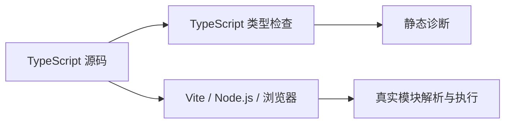
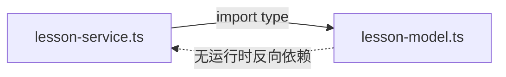

# TypeScript 工程配置与模块边界

> 适用环境：TypeScript 7.x、Node.js 22+、Vite 现代前端工程。本节会区分“由 Vite 打包的浏览器应用”和“由 Node.js 直接运行的代码”，因为它们不能机械复用同一套模块配置。

## 1. 学习目标

完成本节后，你应该能够：

- 理解 `tsconfig.json` 同时定义编译选项与项目文件边界。
- 区分 `target`、`lib`、`module` 与 `moduleResolution`。
- 为 Vite 浏览器应用和 Node.js ESM 选择不同的模块配置。
- 正确书写 Node.js ESM 的相对导入扩展名。
- 使用 `import type`、`export type` 区分类型与运行时依赖。
- 理解 `verbatimModuleSyntax` 与 `isolatedModules`。
- 使用 `include`、`exclude`、`types` 隔离不同环境。
- 理解 `paths` 通常不会改写运行时导入。
- 判断何时使用多个配置与项目引用。
- 使用 TypeScript CLI 诊断配置和模块解析。

## 2. 前置知识

建议先掌握 ESM 的 `import`、`export`、接口、类型别名与严格模式。

上一节：[TypeScript 模板字面量类型与类型安全契约](/frontend/typescript/template-literal-types-and-type-safe-contracts)

## 3. `tsconfig.json` 是工程边界

一个配置回答两类问题：

1. 哪些文件属于这个 TypeScript 工程。
2. 应使用什么规则检查和输出这些文件。

```json
{
  "compilerOptions": {
    "strict": true,
    "noEmit": true
  },
  "include": ["src/**/*.ts", "src/**/*.vue"]
}
```

编辑器、`tsc` 和相关工具都会读取它。错误的文件边界可能让测试全局变量污染应用代码，也可能让部分源码没有接受预期的严格检查。

## 4. 配置必须匹配真实宿主

TypeScript 不决定代码最终如何加载。真实模块宿主可能是 Vite、Node.js、浏览器原生 ESM、测试运行器或库消费者。



`module` 和 `moduleResolution` 应模拟真实宿主。类型检查通过不等于输出一定能在运行时加载。

## 5. `target`：JavaScript 语言级别

```json
{
  "compilerOptions": {
    "target": "ES2022"
  }
}
```

`target` 控制 TypeScript 输出允许使用的 JavaScript 语法级别，并影响默认标准库选择。它不是完整的浏览器兼容性清单；最终兼容性还取决于打包器目标和 polyfill 策略。

## 6. `lib`：平台 API 类型

```json
{
  "compilerOptions": {
    "lib": ["ES2022", "DOM", "DOM.Iterable"]
  }
}
```

- `ES2022` 提供 ECMAScript 内建类型。
- `DOM` 提供 `window`、`document` 等浏览器类型。
- Node.js 类型来自 `@types/node`，不是名为 `Node` 的 `lib`。

不要在纯 Node.js 项目中加入 `DOM` 只为消除错误，否则类型可能允许运行时不存在的 API。

## 7. `types`：限制全局类型包

```json
{
  "compilerOptions": {
    "types": ["vite/client"]
  }
}
```

测试配置可以单独加入测试运行器类型：

```json
{
  "compilerOptions": {
    "types": ["vite/client", "vitest/globals"]
  }
}
```

这样 `describe`、`expect` 等名字不会意外出现在生产应用的类型环境中。

## 8. `strict` 是可靠性的起点

```json
{
  "compilerOptions": {
    "strict": true,
    "exactOptionalPropertyTypes": true,
    "noUncheckedIndexedAccess": true,
    "noImplicitOverride": true
  }
}
```

`strict` 是一组严格检查。其余选项进一步约束可选属性、索引读取和类重写。迁移旧项目时应理解语义后逐步启用，而不是用大量断言压制错误。

## 9. `noEmit`：让 `tsc` 只检查

Vite 应用通常由打包器输出 JavaScript：

```json
{
  "compilerOptions": {
    "noEmit": true
  }
}
```

常见职责分工是：

```text
Vite：转译、资源处理、打包
tsc / vue-tsc：完整类型检查
```

快速转译工具通常不会完成完整类型检查，因此 CI 仍需要独立检查步骤。

## 10. `module` 与 `moduleResolution`

`module` 描述模块语义和输出模型；`moduleResolution` 描述如何根据导入字符串找到文件或包。

```ts
import { ref } from 'vue'
import { createLesson } from './lesson-service.js'
```

解析过程会考虑相对路径、`node_modules`、包 `exports`、条件导出和扩展名替换。应选择与实际工具链一致的组合，而不是选择报错最少的模式。

## 11. Vite 应用的常见配置

```json
{
  "compilerOptions": {
    "target": "ES2022",
    "lib": ["ES2022", "DOM", "DOM.Iterable"],
    "module": "ESNext",
    "moduleResolution": "Bundler",
    "verbatimModuleSyntax": true,
    "isolatedModules": true,
    "noEmit": true,
    "strict": true
  }
}
```

这是方向性示例。真实项目应优先沿用与当前 Vite、Vue 插件版本匹配的官方脚手架配置。

## 12. Node.js 的常见配置

TypeScript 输出由 Node.js 直接运行时，应模拟 Node.js：

```json
{
  "compilerOptions": {
    "module": "NodeNext",
    "moduleResolution": "NodeNext",
    "verbatimModuleSyntax": true,
    "strict": true
  }
}
```

还需结合最近的 `package.json` 是否声明 `"type": "module"`、文件扩展名和实际输出目录。

## 13. 为什么源码中导入 `.js`

Node.js ESM 项目常见：

```ts
import { createLesson } from './lesson-service.js'
```

即使源文件是 `lesson-service.ts`，输出通常是 `lesson-service.js`。Node 模块解析模式会在检查时把 `.js` 说明符关联到 `.ts` 源文件，并为运行时保留有效路径。

```text
源码：lesson-service.ts
输出：lesson-service.js
导入：./lesson-service.js
```

无扩展名导入可能被打包器接受，却在 Node.js ESM 中失败。

## 14. `.mts`、`.cts` 与包类型

- `.mts` 明确表示 ESM TypeScript，通常输出 `.mjs`。
- `.cts` 明确表示 CommonJS TypeScript，通常输出 `.cjs`。
- `.ts` 的模块格式会受到最近 `package.json` 的 `type` 等规则影响。

必须混合两种格式时可使用显式扩展名；单一格式应用保持一致的包级配置更简单。

## 15. `import type`

```ts
import type {
  CreateLessonInput,
  Lesson
} from './lesson-model.js'
```

类型导入只用于类型位置，输出 JavaScript 时被移除。它明确当前文件不需要该模块的运行时值，也避免为了类型意外触发模块副作用。

同一模块既导入值又导入类型时：

```ts
import {
  LESSON_STATUS,
  type Lesson,
  type LessonStatus
} from './lesson-model.js'
```

## 16. `export type`

公共入口可以分别再导出值与类型：

```ts
export { LESSON_STATUS }
export type { Lesson, LessonStatus }
```

`Lesson` 只存在于类型系统，`LESSON_STATUS` 是真实 JavaScript 对象。边界越明确，循环依赖、副作用和打包行为越容易审查。

## 17. `verbatimModuleSyntax`

开启后：

- 没有 `type` 修饰的 ESM 导入和导出会保留。
- 带 `type` 的导入和导出会被移除。
- TypeScript 不会悄悄把不匹配的 ESM 写法改写为 CommonJS。

```json
{
  "compilerOptions": {
    "verbatimModuleSyntax": true
  }
}
```

这能更早暴露包类型、文件扩展名和模块输出配置不一致。

## 18. `isolatedModules`

Vite 常使用逐文件转译工具，无法像完整 TypeScript 程序那样跨文件分析：

```json
{
  "compilerOptions": {
    "isolatedModules": true
  }
}
```

该选项报告不适合单文件转译的写法。它不会执行完整类型检查，也不表示模块彼此隔离。

## 19. `include` 定义根文件

```json
{
  "include": [
    "src/**/*.ts",
    "src/**/*.tsx",
    "src/**/*.vue"
  ]
}
```

被根文件导入的依赖通常也会进入程序，即使没有直接匹配 `include`。因此 `include` 不是安全沙箱。

## 20. `exclude` 不能阻止显式导入

```json
{
  "exclude": ["dist", "coverage"]
}
```

`exclude` 主要影响 `include` 扫描。应用源码显式导入的服务端文件仍可能进入类型程序。真正的环境隔离要靠目录边界、依赖方向和独立配置。

## 21. `files` 适合明确的小集合

```json
{
  "files": ["src/main.ts", "src/env.d.ts"]
}
```

`files` 精确列出根文件，适合入口很少或解决方案配置。大型应用通常使用 `include` 更易维护。

## 22. 配置继承 `extends`

基础配置集中严格选项：

```json
{
  "compilerOptions": {
    "strict": true,
    "noUncheckedIndexedAccess": true,
    "exactOptionalPropertyTypes": true
  }
}
```

应用配置继承并添加环境：

```json
{
  "extends": "./tsconfig.base.json",
  "compilerOptions": {
    "lib": ["ES2022", "DOM"],
    "types": ["vite/client"]
  },
  "include": ["src"]
}
```

继承后的真实结果应使用 `tsc --showConfig` 查看，不要假设所有数组都会自动拼接。

## 23. 为不同环境拆分配置

```text
tsconfig.base.json
tsconfig.app.json
tsconfig.node.json
tsconfig.test.json
tsconfig.json
```

- `app`：DOM、Vite 客户端和浏览器源码。
- `node`：Vite 配置与 Node.js 脚本。
- `test`：测试运行器与测试文件。
- 根配置：引用子项目。

单个配置只能准确描述一种模块与全局环境。把 DOM、Worker、Node.js 和测试全局全部混合，会降低类型约束力。

## 24. 项目引用

根解决方案配置可以只声明引用：

```json
{
  "files": [],
  "references": [
    { "path": "./tsconfig.app.json" },
    { "path": "./tsconfig.node.json" }
  ]
}
```

项目引用让 TypeScript 理解子项目依赖、构建顺序和声明边界。被引用项目通常需要启用 `composite`。

它适合多环境应用、Monorepo 内部库和需要增量构建的大型代码库；小型应用不必过早引入复杂引用图。

## 25. `composite` 与声明文件

```json
{
  "compilerOptions": {
    "composite": true,
    "declaration": true,
    "declarationMap": true,
    "rootDir": "src",
    "outDir": "dist"
  }
}
```

`composite` 加强输入和输出约束。引用方通常通过生成的 `.d.ts` 理解公共 API；声明文件不应泄露无法解析的内部别名或未发布路径。

## 26. `paths` 不会解决运行时解析

```json
{
  "compilerOptions": {
    "paths": {
      "@/*": ["./src/*"]
    }
  }
}
```

它告诉 TypeScript 如何解析 `@/features/lesson`，但通常不会改写输出导入。Vite、测试运行器和 Node.js 也必须理解相同别名，或使用包 `imports`、工作区包等真实机制。

不要仅用 `paths` 把 Monorepo 包名映射到另一个项目源码，这可能绕过真实包的 `exports`、声明文件和发布布局。

## 27. `rootDir` 与 `outDir`

```json
{
  "compilerOptions": {
    "rootDir": "src",
    "outDir": "dist"
  }
}
```

`rootDir` 描述输出结构的源文件根，`outDir` 指定生成目录。`rootDir` 不是文件包含规则，不能代替 `include`。

## 28. 应用配置与库配置不同

应用通常由打包器消费并使用 `noEmit`。发布库则可能需要：

```json
{
  "compilerOptions": {
    "declaration": true,
    "declarationMap": true,
    "sourceMap": true
  }
}
```

库还要验证真实产物、包 `exports`、最低运行时目标和消费者环境。不要把应用配置直接用于发布包。

## 29. `skipLibCheck` 的取舍

```json
{
  "compilerOptions": {
    "skipLibCheck": true
  }
}
```

它跳过声明文件内部的完整检查，常用于减少依赖声明冲突和检查时间，但不会跳过自己的 `.ts` 源码。它可能隐藏不兼容的依赖类型，不是修复版本冲突的根本方案。

## 30. JavaScript 渐进迁移

已有 Vue 2 或 JavaScript 项目可以分阶段启用：

```json
{
  "compilerOptions": {
    "allowJs": true,
    "checkJs": false,
    "noEmit": true
  }
}
```

随后对选定文件使用 `// @ts-check`，或逐步打开 `checkJs`。目标是建立可靠边界，不是把所有迁移错误改成 `any`。

## 31. 模块副作用与导入擦除

```ts
import './register-polyfills.js'
```

这是明确的副作用导入，必须保留。使用 `import type` 与 `verbatimModuleSyntax` 后，类型依赖被擦除，值导入和副作用导入被保留，模块初始化意图更容易审查。

只导出类型的模块不应偷偷执行注册逻辑。

## 32. 循环依赖与类型依赖

互相导入类型不一定形成运行时循环，因为 `import type` 会被擦除；一旦导入真实值，就可能形成运行时循环。



解决循环依赖应优先调整职责与依赖方向，而不是用断言或延迟导入掩盖问题。

## 33. 公共入口文件

```ts
export { createLesson } from './lesson-service.js'
export { LESSON_STATUS } from './lesson-model.js'
export type {
  CreateLessonInput,
  Lesson,
  LessonStatus
} from './lesson-model.js'
```

公共入口能控制对外 API。大型项目的桶文件也可能制造循环依赖，模块内部可直接依赖具体文件，对外再提供经过审查的入口。

## 34. 配置诊断命令

### 查看最终配置

```bash
tsc -p tsconfig.app.json --showConfig
```

### 解释文件为何进入项目

```bash
tsc -p tsconfig.app.json --explainFiles
```

### 跟踪模块解析

```bash
tsc -p tsconfig.app.json --traceResolution
```

### 仅做类型检查

```bash
tsc -p tsconfig.app.json --noEmit
```

`--traceResolution` 输出很长，应在别名、包导出和扩展名问题出现时针对性使用。

## 35. 完整项目示例：课程模块边界

示例由四个文件组成，页面直接导入仓库源码。

### 领域模型

```text
examples/typescript/module-boundaries/lesson-model.ts
```

<<< ../../../examples/typescript/module-boundaries/lesson-model.ts

### 服务模块

```text
examples/typescript/module-boundaries/lesson-service.ts
```

<<< ../../../examples/typescript/module-boundaries/lesson-service.ts

### 公共 API

```text
examples/typescript/module-boundaries/public-api.ts
```

<<< ../../../examples/typescript/module-boundaries/public-api.ts

### 入口与调用

```text
examples/typescript/module-boundaries/index.ts
```

<<< ../../../examples/typescript/module-boundaries/index.ts

示例展示 `.js` 相对说明符、类型导入、值导入、公共再导出和单向模块依赖。

## 36. 常见错误

### 复制“万能 tsconfig”

浏览器、Node.js、测试和库发布环境不同，不存在适合所有项目的固定配置。

### 混淆 `module` 与 `moduleResolution`

一个描述模块语义与输出模型，一个描述如何查找导入；二者要与真实工具链协调。

### 用 `Bundler` 检查由 Node.js 直接运行的代码

打包器允许的无扩展名导入等行为，可能在 Node.js ESM 中失败。

### 把类型导入写成值导入

可能产生无意义的运行时依赖、副作用，或在 `verbatimModuleSyntax` 下报错。

### 认为 `exclude` 能阻止显式导入

被根文件引用的模块仍会进入程序。环境隔离必须靠依赖方向和独立项目。

### 只配置 TypeScript 别名

`paths` 通常不改写运行时说明符，Vite、测试工具和 Node.js 必须理解相同路径。

### 用 DOM 类型掩盖 Node.js 错误

类型存在不代表运行环境存在对应 API。

### 永久依赖 `skipLibCheck`

它是性能和兼容性权衡，不是修复依赖声明冲突的根本办法。

## 37. 工程最佳实践

- 从代码实际由谁执行或打包出发选择模块配置。
- Vite 应用通常由打包器输出，TypeScript 使用 `noEmit` 检查。
- Node.js 输出使用与 Node 版本和包类型匹配的模块模式。
- 开启 `strict`，再按风险逐步增加精确选项。
- 使用 `import type`、`export type` 明确类型边界。
- 使用 `verbatimModuleSyntax` 暴露模块格式不一致。
- 浏览器、Node.js、Worker 和测试环境使用不同配置。
- 不把 DOM 或测试全局加入不需要它们的项目。
- 别名必须由 TypeScript 与真实宿主共同支持。
- 大型项目用项目引用表达依赖图，小型项目保持简单。
- 库发布前验证真实产物、`exports` 与声明文件。
- 排错先看 `--showConfig`，再使用其他诊断命令。

## 38. 与 Vue 3 和 Vite 的联系

Vue 单文件组件通常由 `vue-tsc` 做类型检查，Vite 负责开发服务器和构建。常见边界是：

```text
src/**            浏览器与 Vue 组件
vite.config.ts    Node.js 配置环境
tests/**          测试环境
scripts/**        Node.js 脚本环境
```

把这些文件塞进一个同时包含 DOM、Node.js 和测试全局的配置，会削弱类型对真实运行环境的约束。

## 39. 与后端和 Monorepo 的联系

前后端共享的应是纯契约模块，而不是把服务端实体、数据库客户端或 Node.js 全局直接导入浏览器工程。

Monorepo 共享契约最好具有真实工作区包、清晰的 `package.json` 导出、独立配置和可消费的 `.d.ts`。这比用 `paths` 穿透到另一个项目源码更接近真实发布行为。

## 40. 面试知识

### `target` 和 `lib` 有什么区别？

`target` 决定 JavaScript 语言级别；`lib` 决定类型检查时可见的标准库和平台 API。

### `moduleResolution` 如何选择？

选择与真实模块宿主一致的算法：打包器应用通常使用 `Bundler`，Node.js 直接执行的代码使用对应 Node 模式。

### 为什么 Node ESM 源码常导入 `.js`？

运行时加载输出后的 `.js`。Node 模式能把源码中的 `.js` 说明符关联到 `.ts` 文件进行检查。

### `import type` 有什么价值？

它明确导入只用于类型，输出时被移除，避免意外运行时依赖并支持单文件转译。

### `verbatimModuleSyntax` 做什么？

它保留未标为 `type` 的模块语法、移除类型导入，并阻止 TypeScript 静默改写不匹配的模块格式。

### `paths` 会改写输出导入吗？

通常不会。它主要指导 TypeScript 解析，运行宿主仍需理解相同别名。

### 什么时候使用项目引用？

工程包含多个环境、内部库或大型依赖图，需要清晰边界、构建顺序和增量性能时。

## 41. 本节总结

- `tsconfig.json` 同时定义文件集合和检查、输出规则。
- 配置必须匹配 Vite、Node.js 或测试运行器等真实宿主。
- `target` 管语言级别，`lib` 管平台 API 类型。
- `types` 可限制进入项目的全局类型包。
- Vite 应用通常使用 `ESNext`、`Bundler` 和 `noEmit`。
- Node.js 代码使用对应 Node 模式和运行时有效的扩展名。
- `import type`、`export type` 明确只在类型系统存在的依赖。
- `verbatimModuleSyntax` 让模块语法与输出意图更直接。
- `include`、`exclude` 不能代替依赖与环境边界。
- `paths` 通常不改写运行时导入。
- 多环境或大型工程可使用多个配置和项目引用。
- CLI 诊断命令能解释最终配置、文件来源与解析过程。

## 42. 下一步学习

下一节建议学习：**Vue 3 Composition API 与组件类型设计**。

届时将从 Vue 2 Options API 迁移到 Vue 3，讲解 `<script setup>`、响应式 API、Props、Emits、Slots、`v-model` 和组合式函数边界。

## 43. 参考资料

- [TypeScript Modules：Choosing Compiler Options](https://www.typescriptlang.org/docs/handbook/modules/guides/choosing-compiler-options.html)
- [TypeScript Modules：Theory](https://www.typescriptlang.org/docs/handbook/modules/theory.html)
- [TypeScript Modules：Reference](https://www.typescriptlang.org/docs/handbook/modules/reference.html)
- [TypeScript TSConfig Reference](https://www.typescriptlang.org/tsconfig/)
- [TypeScript TSConfig：verbatimModuleSyntax](https://www.typescriptlang.org/tsconfig/verbatimModuleSyntax.html)
- [TypeScript TSConfig：moduleResolution](https://www.typescriptlang.org/tsconfig/moduleResolution.html)
- [TypeScript TSConfig：isolatedModules](https://www.typescriptlang.org/tsconfig/isolatedModules.html)
- [TypeScript Handbook：Project References](https://www.typescriptlang.org/docs/handbook/project-references.html)
- [Node.js Documentation：ECMAScript modules](https://nodejs.org/api/esm.html)
